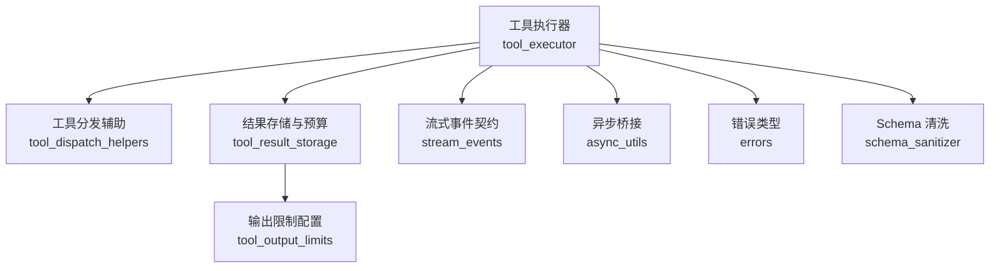
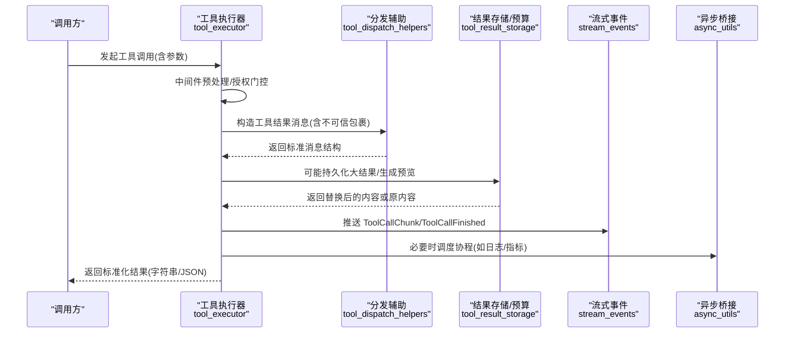
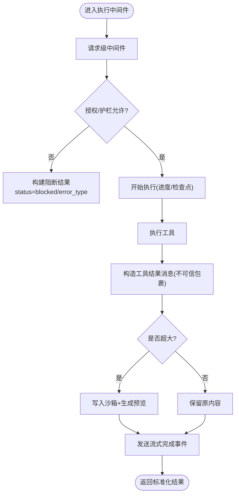
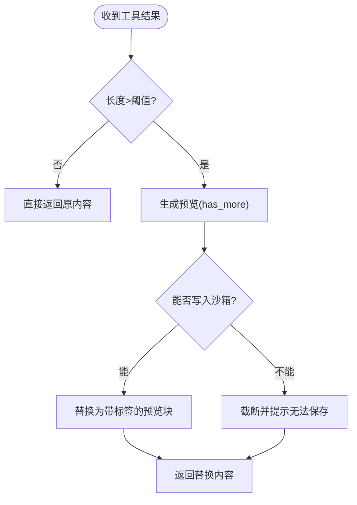
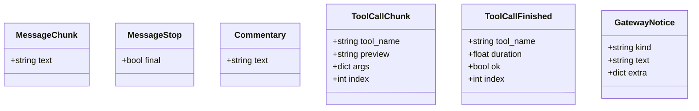
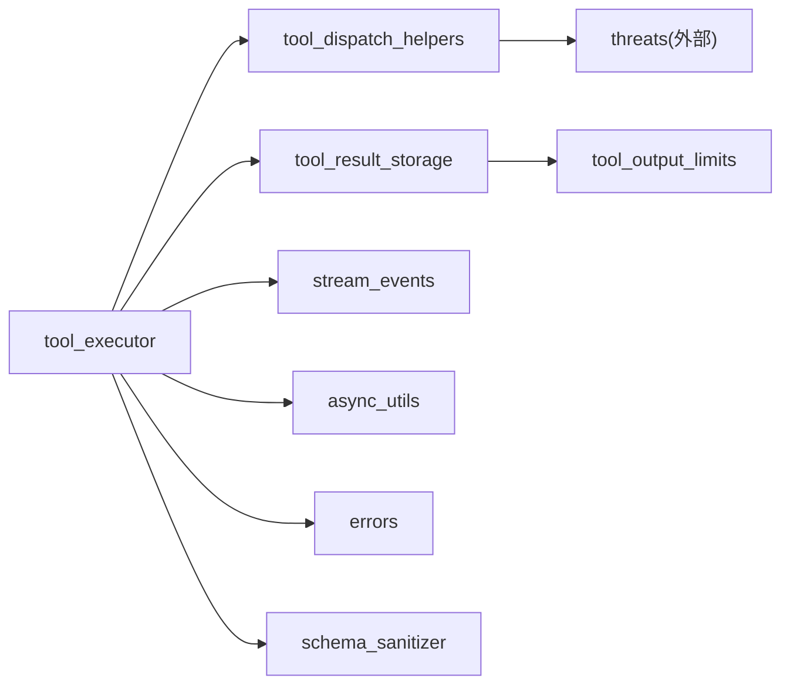

# 返回值格式规范

<cite>
**本文引用的文件**
- [agent/tool_executor.py](file://agent/tool_executor.py)
- [agent/tool_dispatch_helpers.py](file://agent/tool_dispatch_helpers.py)
- [tools/tool_result_storage.py](file://tools/tool_result_storage.py)
- [tools/tool_output_limits.py](file://tools/tool_output_limits.py)
- [gateway/stream_events.py](file://gateway/stream_events.py)
- [agent/async_utils.py](file://agent/async_utils.py)
- [agent/errors.py](file://agent/errors.py)
- [tools/schema_sanitizer.py](file://tools/schema_sanitizer.py)
</cite>

## 目录
1. [简介](#简介)
2. [项目结构](#项目结构)
3. [核心组件](#核心组件)
4. [架构总览](#架构总览)
5. [详细组件分析](#详细组件分析)
6. [依赖关系分析](#依赖关系分析)
7. [性能考量](#性能考量)
8. [故障排查指南](#故障排查指南)
9. [结论](#结论)
10. [附录](#附录)

## 简介
本规范定义工具执行结果的标准化返回格式，覆盖成功响应、错误响应与流式响应的数据结构；说明结果序列化机制（数据类型映射、特殊字符处理、编码问题）；解释异步返回值的处理方式（Promise 解析、回调函数、事件驱动模式）；并提供返回值验证与清理机制，确保数据安全和格式一致性。文档同时给出各场景的最佳实践与参考路径，便于在实现中复用既有能力。

## 项目结构
围绕“工具调用—结果处理—持久化/预算控制—流式事件—异步桥接”的主线，关键模块职责如下：
- 工具执行与编排：负责工具调用的调度、并发控制、中间件拦截、结果消息构造与追加。
- 结果存储与预算控制：对超大输出进行沙箱持久化与上下文内预览替换，并在单轮内聚合预算超限后进行二次压缩。
- 流式事件契约：定义 agent→gateway 的流式事件类型，解耦呈现与传输。
- 异步桥接：安全地将协程从工作线程调度到事件循环，避免资源泄漏。
- 错误与异常：统一错误类型与空流等异常语义。
- 参数/Schema 清洗：保证不同后端对 JSON Schema 的兼容性，间接影响参数校验与返回结构。



图表来源
- [agent/tool_executor.py:482-662](file://agent/tool_executor.py#L482-L662)
- [agent/tool_dispatch_helpers.py:533-576](file://agent/tool_dispatch_helpers.py#L533-L576)
- [tools/tool_result_storage.py:144-200](file://tools/tool_result_storage.py#L144-L200)
- [gateway/stream_events.py:43-159](file://gateway/stream_events.py#L43-L159)
- [agent/async_utils.py:34-68](file://agent/async_utils.py#L34-L68)
- [agent/errors.py:1-14](file://agent/errors.py#L1-L14)
- [tools/schema_sanitizer.py:120-174](file://tools/schema_sanitizer.py#L120-L174)
- [tools/tool_output_limits.py:59-89](file://tools/tool_output_limits.py#L59-L89)

章节来源
- [agent/tool_executor.py:482-662](file://agent/tool_executor.py#L482-L662)
- [tools/tool_result_storage.py:144-200](file://tools/tool_result_storage.py#L144-L200)
- [gateway/stream_events.py:43-159](file://gateway/stream_events.py#L43-L159)
- [agent/async_utils.py:34-68](file://agent/async_utils.py#L34-L68)
- [agent/errors.py:1-14](file://agent/errors.py#L1-L14)
- [tools/schema_sanitizer.py:120-174](file://tools/schema_sanitizer.py#L120-L174)
- [tools/tool_output_limits.py:59-89](file://tools/tool_output_limits.py#L59-L89)

## 核心组件
- 工具执行中间件与受控结果：封装请求预处理、策略拦截、授权门控、开始/结束钩子，并产出受控结果对象，包含结果、原始参数、中间件追踪、是否被阻断、是否已派发等信息。
- 工具结果消息构造：将工具结果包装为 OpenAI 兼容的消息结构，并对高风险外部数据添加不可信包裹，降低提示注入风险。
- 大结果持久化与预算控制：当工具输出超过阈值时，写入沙箱并以带标签的预览块替代；单轮结束后若仍超预算，按大小顺序继续下沉至磁盘。
- 流式事件：以冻结数据类描述文本增量、工具调用开始/结束、评论片段、网关通知等，供 gateway 消费并按平台渲染。
- 异步桥接：安全地从同步线程调度协程到事件循环，失败时关闭协程避免泄漏。
- 错误类型：定义 SSL 配置错误、空流错误、预设未找到等专用异常。
- Schema 清洗：对工具输入 Schema 做深度清洗，适配严格后端，减少因 schema 不兼容导致的请求失败。

章节来源
- [agent/tool_executor.py:482-662](file://agent/tool_executor.py#L482-L662)
- [agent/tool_dispatch_helpers.py:533-576](file://agent/tool_dispatch_helpers.py#L533-L576)
- [tools/tool_result_storage.py:144-200](file://tools/tool_result_storage.py#L144-L200)
- [gateway/stream_events.py:43-159](file://gateway/stream_events.py#L43-L159)
- [agent/async_utils.py:34-68](file://agent/async_utils.py#L34-L68)
- [agent/errors.py:1-14](file://agent/errors.py#L1-L14)
- [tools/schema_sanitizer.py:120-174](file://tools/schema_sanitizer.py#L120-L174)

## 架构总览
下图展示一次工具调用从进入执行器到最终结果落盘/流式上报的关键路径。



图表来源
- [agent/tool_executor.py:482-662](file://agent/tool_executor.py#L482-L662)
- [agent/tool_dispatch_helpers.py:533-576](file://agent/tool_dispatch_helpers.py#L533-L576)
- [tools/tool_result_storage.py:144-200](file://tools/tool_result_storage.py#L144-L200)
- [gateway/stream_events.py:84-116](file://gateway/stream_events.py#L84-L116)
- [agent/async_utils.py:34-68](file://agent/async_utils.py#L34-L68)

## 详细组件分析

### 工具执行与结果构造
- 中间件管道：统一执行请求级与执行级中间件，支持前置阻断（插件/护栏），记录中间件追踪信息，并确保只派发一次。
- 受控结果：封装 result、args、middleware_trace、blocked、dispatched，便于上层判断执行状态。
- 结果消息：使用统一消息结构，role/name/tool_name/content/tool_call_id，并对高风险工具输出自动包裹不可信数据块，防止间接提示注入。
- 取消与阻断：用户中断或策略阻断会返回标准化的取消/阻断结果，并附带状态与错误类型字段。



图表来源
- [agent/tool_executor.py:482-662](file://agent/tool_executor.py#L482-L662)
- [agent/tool_dispatch_helpers.py:533-576](file://agent/tool_dispatch_helpers.py#L533-L576)
- [tools/tool_result_storage.py:144-200](file://tools/tool_result_storage.py#L144-L200)

章节来源
- [agent/tool_executor.py:482-662](file://agent/tool_executor.py#L482-L662)
- [agent/tool_dispatch_helpers.py:533-576](file://agent/tool_dispatch_helpers.py#L533-L576)

### 结果序列化与数据类型映射
- 字符串与 JSON：工具结果通常以字符串返回；内部多处使用 JSON 编解码，确保 ensure_ascii=False 以正确保留 Unicode。
- 多模态结果：部分工具返回多模态信封（包含 content 列表与可选 text_summary），系统提供检测与文本摘要提取，用于日志、预览与非多模态后端的回退。
- 不可信数据包裹：对来自外部的高风险工具输出，自动包裹不可信数据块，并对嵌入的定界符进行中和，防止闭合逃逸。
- Schema 兼容性：对工具输入 Schema 进行深度清洗，修复裸字符串类型、anyOf/oneOf 可空联合、顶层组合符、$ref 兄弟关键字等，提升跨后端兼容性。

章节来源
- [agent/tool_dispatch_helpers.py:348-406](file://agent/tool_dispatch_helpers.py#L348-L406)
- [agent/tool_dispatch_helpers.py:533-576](file://agent/tool_dispatch_helpers.py#L533-L576)
- [tools/schema_sanitizer.py:120-174](file://tools/schema_sanitizer.py#L120-L174)
- [tools/schema_sanitizer.py:240-302](file://tools/schema_sanitizer.py#L240-L302)
- [tools/schema_sanitizer.py:401-540](file://tools/schema_sanitizer.py#L401-L540)

### 大结果持久化与单轮预算控制
- 阈值判定：根据工具名解析阈值，超过则触发持久化。
- 沙箱写入：通过环境执行接口将完整内容写入临时目录，文件名基于 tool_use_id 的安全化处理与哈希后缀。
- 预览替换：用带标签的预览块替换上下文中的大内容，提示可通过 read_file 读取完整输出。
- 单轮聚合预算：一轮结束后若仍超预算，按大小顺序继续下沉非持久化的结果，直至满足预算。



图表来源
- [tools/tool_result_storage.py:144-200](file://tools/tool_result_storage.py#L144-L200)
- [tools/tool_result_storage.py:203-255](file://tools/tool_result_storage.py#L203-L255)

章节来源
- [tools/tool_result_storage.py:144-200](file://tools/tool_result_storage.py#L144-L200)
- [tools/tool_result_storage.py:203-255](file://tools/tool_result_storage.py#L203-L255)
- [tools/tool_output_limits.py:59-89](file://tools/tool_output_limits.py#L59-L89)

### 流式响应与事件契约
- 文本增量：MessageChunk 表示助手文本增量，消费者累积并逐步渲染。
- 文本结束：MessageStop 标记一段连续文本结束，final=True 表示整轮结束。
- 工具调用：ToolCallChunk 表示工具开始/进行中，ToolCallFinished 表示完成，携带耗时与成功标志。
- 评论片段：Commentary 表示工具迭代间的完整短句。
- 网关通知：GatewayNotice 用于重启、在线、长任务提示等控制消息。



图表来源
- [gateway/stream_events.py:43-159](file://gateway/stream_events.py#L43-L159)

章节来源
- [gateway/stream_events.py:43-159](file://gateway/stream_events.py#L43-L159)

### 异步返回值处理
- 安全调度：从工作线程向事件循环调度协程，失败时关闭协程避免泄漏，返回 None 以便调用方分支处理。
- 任务结果消费：对已取消/分离的任务，静默获取异常以避免“未检索异常”噪音。
- 典型用法：在工具执行完成后，异步上报指标、日志或触发后续流程，主流程不阻塞。

```mermaid
sequenceDiagram
participant Worker as "工作线程"
participant Loop as "事件循环"
Worker->>Loop : safe_schedule_threadsafe(coro, loop)
alt 调度成功
Loop-->>Worker : Future
Worker->>Future : .result(timeout)
else 调度失败
Loop-->>Worker : None
Worker->>Worker : 关闭协程/记录日志
end
```

图表来源
- [agent/async_utils.py:34-68](file://agent/async_utils.py#L34-L68)
- [agent/async_utils.py:71-85](file://agent/async_utils.py#L71-L85)

章节来源
- [agent/async_utils.py:34-68](file://agent/async_utils.py#L34-L68)
- [agent/async_utils.py:71-85](file://agent/async_utils.py#L71-L85)

### 错误响应与异常类型
- 取消/阻断：工具执行被用户中断或被策略阻断时，返回包含 error 与 status 字段的标准化结果。
- 空流错误：当提供者关闭流且未产生响应时抛出 EmptyStreamError。
- SSL 配置错误：证书包配置失败时抛出 SSLConfigurationError。
- 建议：上层捕获这些异常并转换为统一的错误响应结构，保持客户端一致体验。

章节来源
- [agent/tool_executor.py:294-330](file://agent/tool_executor.py#L294-L330)
- [agent/errors.py:1-14](file://agent/errors.py#L1-L14)

## 依赖关系分析
- 工具执行器依赖分发辅助来构造消息与识别多模态结果；依赖结果存储进行大结果持久化与预算控制；依赖流式事件向 gateway 推送结构化事件；依赖异步桥接安全调度协程；依赖错误类型表达异常语义；依赖 Schema 清洗保障参数合法性。
- 结果存储依赖输出限制配置获取默认阈值；分发辅助依赖威胁扫描对高风险内容进行风险评估。



图表来源
- [agent/tool_executor.py:482-662](file://agent/tool_executor.py#L482-L662)
- [tools/tool_result_storage.py:144-200](file://tools/tool_result_storage.py#L144-L200)
- [gateway/stream_events.py:43-159](file://gateway/stream_events.py#L43-L159)
- [agent/async_utils.py:34-68](file://agent/async_utils.py#L34-L68)
- [agent/errors.py:1-14](file://agent/errors.py#L1-L14)
- [tools/schema_sanitizer.py:120-174](file://tools/schema_sanitizer.py#L120-L174)
- [tools/tool_output_limits.py:59-89](file://tools/tool_output_limits.py#L59-L89)

章节来源
- [agent/tool_executor.py:482-662](file://agent/tool_executor.py#L482-L662)
- [tools/tool_result_storage.py:144-200](file://tools/tool_result_storage.py#L144-L200)
- [gateway/stream_events.py:43-159](file://gateway/stream_events.py#L43-L159)
- [agent/async_utils.py:34-68](file://agent/async_utils.py#L34-L68)
- [agent/errors.py:1-14](file://agent/errors.py#L1-L14)
- [tools/schema_sanitizer.py:120-174](file://tools/schema_sanitizer.py#L120-L174)
- [tools/tool_output_limits.py:59-89](file://tools/tool_output_limits.py#L59-L89)

## 性能考量
- 并发与限流：工具批处理可按安全规则并行执行，图片生成等慢操作有独立并发上限，避免后端突发导致 TTFB 或限流失败。
- 预算控制：单轮聚合预算在 turn 结束时生效，优先下沉最大非持久化结果，减少上下文溢出风险。
- 输出限制：终端与文件读取等工具有可配置的字节/行数/行宽上限，避免过大输出拖慢处理链路。
- 异步调度：使用安全调度避免协程泄漏与警告，提高稳定性。

[本节为通用指导，无需特定文件引用]

## 故障排查指南
- 工具参数无效：当模型发出的参数无法解析为非字典时，返回包含 error 与 message 的标准错误结果，提示必须为有效 JSON 对象。
- 工具被阻断：插件或护栏阻断时，返回 blocked 状态与相应错误类型，便于定位原因。
- 大结果无法持久化：若沙箱写入失败，将回退为截断提示，需检查环境执行权限与可用空间。
- 空流错误：当提供者关闭流且无响应时抛出 EmptyStreamError，需检查上游连接与重试策略。
- Schema 不兼容：如遇严格后端拒绝 schema，启用 Schema 清洗或恢复性剥离（pattern/format、enum 斜杠等）。

章节来源
- [agent/tool_executor.py:141-157](file://agent/tool_executor.py#L141-L157)
- [agent/tool_executor.py:294-330](file://agent/tool_executor.py#L294-L330)
- [tools/tool_result_storage.py:181-200](file://tools/tool_result_storage.py#L181-L200)
- [agent/errors.py:1-14](file://agent/errors.py#L1-L14)
- [tools/schema_sanitizer.py:550-624](file://tools/schema_sanitizer.py#L550-L624)
- [tools/schema_sanitizer.py:627-687](file://tools/schema_sanitizer.py#L627-L687)

## 结论
本规范定义了工具执行结果的统一返回格式与处理流程：通过中间件与受控结果确保执行一致性与可观测性；通过不可信包裹与 Schema 清洗保障安全性与兼容性；通过大结果持久化与单轮预算控制防止上下文溢出；通过流式事件与异步桥接提升实时性与稳定性。遵循本规范可实现跨后端、跨平台的稳定返回值与用户体验。

[本节为总结性内容，无需特定文件引用]

## 附录
- 成功响应：字符串或 JSON 字符串，必要时包含 success 与 data 字段（由具体工具约定），并通过 make_tool_result_message 包装为标准消息结构。
- 错误响应：包含 error 与 status 字段，常见状态包括 cancelled、blocked、guardrail_block 等。
- 流式响应：使用 stream_events 中的事件类型，按文本增量、工具调用生命周期、评论片段与网关通知组织。
- 最佳实践：
  - 始终使用 make_tool_result_message 构造结果消息，确保 role/name/tool_name/content/tool_call_id 字段齐全。
  - 对高风险外部数据输出，依赖自动不可信包裹，不要自行拼接指令。
  - 对大输出优先使用 maybe_persist_tool_result，避免上下文溢出。
  - 在 turn 结束时调用 enforce_turn_budget，确保聚合预算达标。
  - 使用 safe_schedule_threadsafe 调度协程，避免资源泄漏。
  - 捕获 EmptyStreamError 与 SSLConfigurationError，并转化为统一错误响应。

章节来源
- [agent/tool_dispatch_helpers.py:533-576](file://agent/tool_dispatch_helpers.py#L533-L576)
- [tools/tool_result_storage.py:144-200](file://tools/tool_result_storage.py#L144-L200)
- [tools/tool_result_storage.py:203-255](file://tools/tool_result_storage.py#L203-L255)
- [gateway/stream_events.py:43-159](file://gateway/stream_events.py#L43-L159)
- [agent/async_utils.py:34-68](file://agent/async_utils.py#L34-L68)
- [agent/errors.py:1-14](file://agent/errors.py#L1-L14)