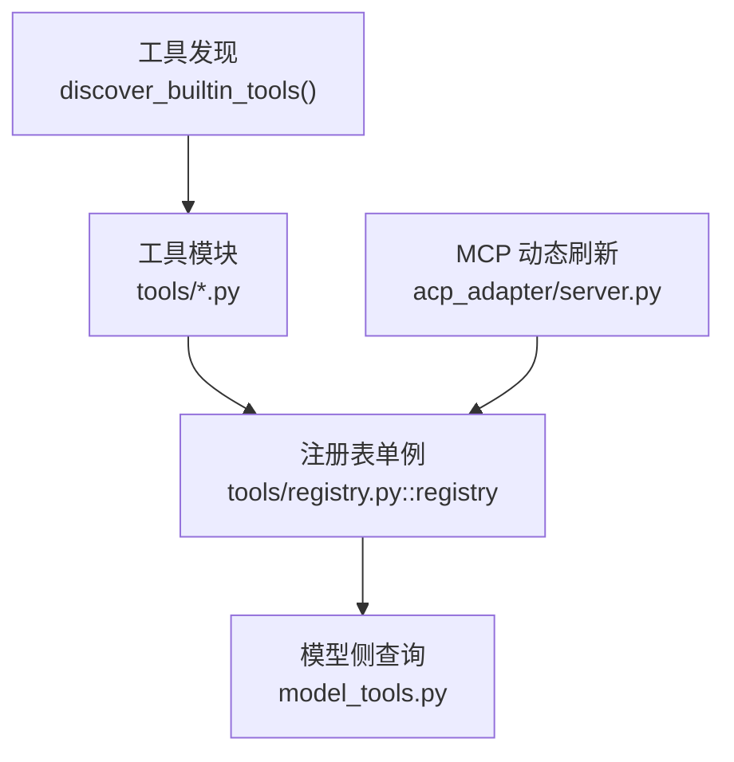
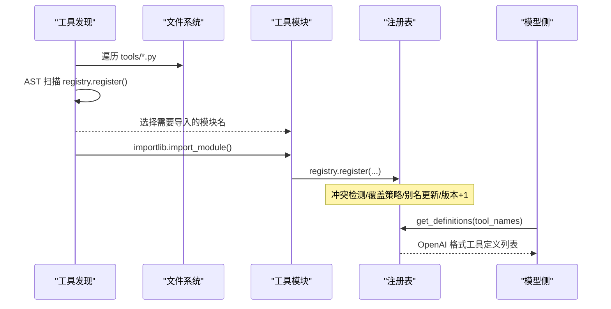
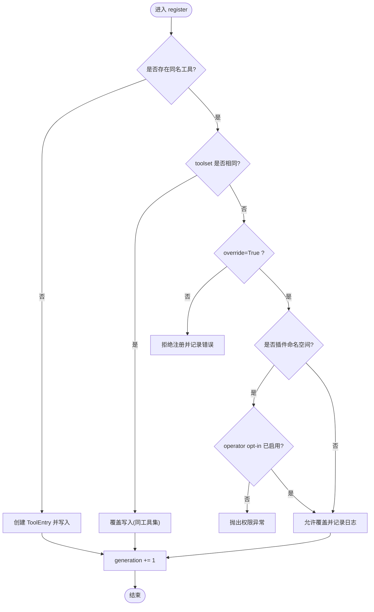
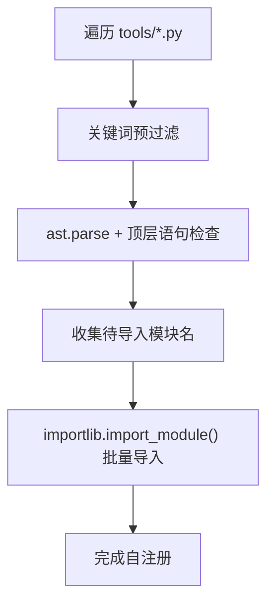
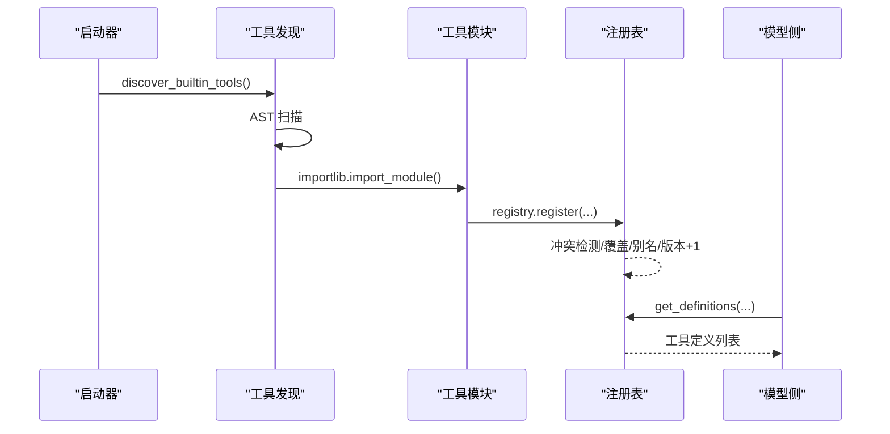
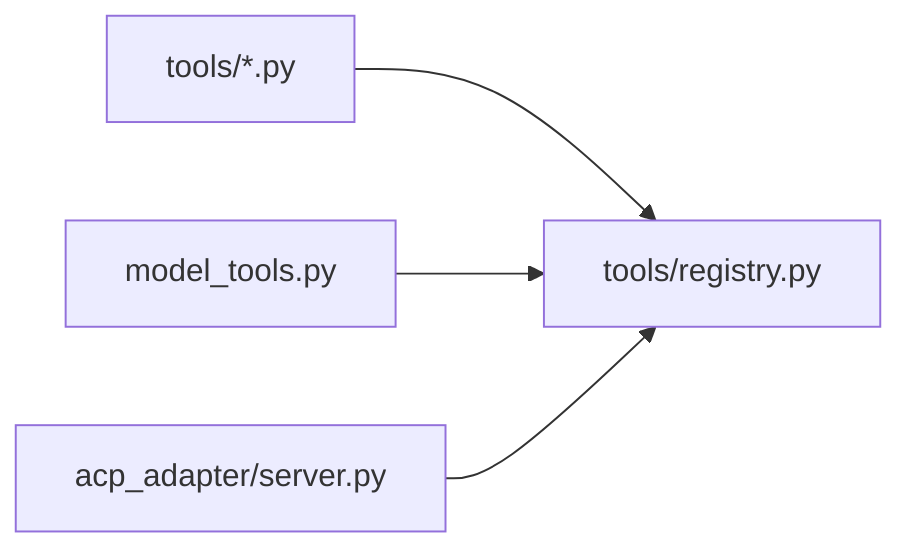

# 工具注册机制

<cite>
**本文引用的文件**
- [tools/registry.py](file://tools/registry.py)
- [tools/file_tools.py](file://tools/file_tools.py)
- [tools/terminal_tool.py](file://tools/terminal_tool.py)
- [model_tools.py](file://model_tools.py)
- [acp_adapter/server.py](file://acp_adapter/server.py)
</cite>

## 目录
1. [简介](#简介)
2. [项目结构](#项目结构)
3. [核心组件](#核心组件)
4. [架构总览](#架构总览)
5. [详细组件分析](#详细组件分析)
6. [依赖关系分析](#依赖关系分析)
7. [性能考量](#性能考量)
8. [故障排查指南](#故障排查指南)
9. [结论](#结论)
10. [附录：注册示例与常见问题](#附录：注册示例与常见问题)

## 简介
本文件系统性阐述工具注册机制，覆盖 ToolEntry 数据结构、ToolRegistry 的注册流程与冲突策略、工具发现（AST 扫描、模块导入、缓存）、工具集别名、插件覆盖策略与安全校验，以及从模块加载到注册完成的完整链路。文档同时提供可视化图示与实际注册示例路径，帮助读者快速理解并正确使用该机制。

## 项目结构
围绕工具注册的核心代码集中在 tools/registry.py，各工具模块在模块顶层调用 registry.register() 完成自注册；模型侧通过 model_tools.py 查询注册表生成工具定义；MCP 动态刷新通过 acp_adapter/server.py 触发注册表的增删改。

图表来源
- [tools/registry.py:108-159](file://tools/registry.py#L108-L159)
- [tools/registry.py:414-955](file://tools/registry.py#L414-L955)
- [acp_adapter/server.py:970-1009](file://acp_adapter/server.py#L970-L1009)

章节来源
- [tools/registry.py:1-159](file://tools/registry.py#L1-L159)
- [tools/registry.py:414-955](file://tools/registry.py#L414-L955)
- [acp_adapter/server.py:970-1009](file://acp_adapter/server.py#L970-L1009)

## 核心组件
- ToolEntry：描述单个工具的元数据与执行信息，包含 name、toolset、schema、handler、check_fn、requires_env、is_async、description、emoji、max_result_size_chars、dynamic_schema_overrides 等字段。
- ToolRegistry：全局注册表单例，负责工具注册、冲突检测、别名管理、可用性检查、定义生成、分发执行与查询辅助方法。
- 工具发现：discover_builtin_tools() 使用 AST 扫描定位自注册模块，结合磁盘缓存加速重复扫描，并按需 importlib.import_module 触发模块级注册。

章节来源
- [tools/registry.py:201-230](file://tools/registry.py#L201-L230)
- [tools/registry.py:414-955](file://tools/registry.py#L414-L955)
- [tools/registry.py:108-159](file://tools/registry.py#L108-L159)

## 架构总览
下图展示了“工具发现 → 模块导入 → 自注册 → 注册表维护 → 模型侧获取定义”的端到端流程。

图表来源
- [tools/registry.py:108-159](file://tools/registry.py#L108-L159)
- [tools/registry.py:562-644](file://tools/registry.py#L562-L644)
- [tools/registry.py:717-764](file://tools/registry.py#L717-L764)

## 详细组件分析

### ToolEntry 结构与字段说明
- name：工具唯一标识，用于注册、查询与分发。
- toolset：工具所属的工具集名称，用于分组、别名映射与可用性判断。
- schema：OpenAI 函数式工具定义（含参数 JSON Schema），最终会被包装为 {"type":"function","function":...}。
- handler：实际处理函数，接收 args 与 kwargs，返回字符串或受支持的多模态信封。
- check_fn：可选的环境/依赖探测函数，决定工具是否可用；结果被 TTL 缓存并具备短暂失败容忍。
- requires_env：该工具依赖的环境变量清单，用于 UI 展示与需求汇总。
- is_async：是否为异步处理器；调度时自动桥接执行。
- description、emoji：面向用户的描述与图标。
- max_result_size_chars：结果大小上限，用于限制输出体积。
- dynamic_schema_overrides：可选的零参回调，在生成定义时合并运行时配置到 schema。

章节来源
- [tools/registry.py:201-230](file://tools/registry.py#L201-L230)

### ToolRegistry 工作原理

#### register() 参数验证、冲突检测与覆盖策略
- 参数：name、toolset、schema、handler、check_fn、requires_env、is_async、description、emoji、max_result_size_chars、dynamic_schema_overrides、override。
- 冲突检测：若同名工具已存在且 toolset 不同，默认拒绝注册并记录错误；当 override=True 时允许覆盖。
- 插件覆盖安全：若覆盖来自插件命名空间，必须事先登记 operator opt-in（allow_tool_override），否则抛出权限异常。
- 注册成功后写入 ToolEntry，必要时维护 toolset 级别的 check_fn 映射，并递增内部 generation 以支持外部缓存失效。

图表来源
- [tools/registry.py:562-644](file://tools/registry.py#L562-L644)

章节来源
- [tools/registry.py:562-644](file://tools/registry.py#L562-L644)

#### 工具发现机制（AST 扫描、模块导入与缓存）
- AST 扫描：_module_registers_tools() 读取源码文本，先做轻量关键词预过滤，再解析 AST 检查是否存在顶层 registry.register() 调用。
- 模块导入：discover_builtin_tools() 遍历 tools/*.py，跳过特定文件，对每个模块进行 AST 判定，收集待导入模块名后统一 importlib.import_module() 触发自注册。
- 缓存策略：基于 (mtime_ns, size) 的磁盘缓存，避免重复解析；并发安全采用原子写入与 best-effort 策略。

图表来源
- [tools/registry.py:71-105](file://tools/registry.py#L71-L105)
- [tools/registry.py:108-159](file://tools/registry.py#L108-L159)

章节来源
- [tools/registry.py:71-105](file://tools/registry.py#L71-L105)
- [tools/registry.py:108-159](file://tools/registry.py#L108-L159)

#### 工具集别名
- 注册别名：register_toolset_alias(alias, toolset) 将别名映射到规范工具集名；重复别名会警告并覆盖。
- 查询接口：get_registered_toolset_aliases() 与 get_toolset_alias_target(alias) 提供快照与目标解析。

章节来源
- [tools/registry.py:487-507](file://tools/registry.py#L487-L507)

#### 插件覆盖策略与安全检查
- 覆盖授权：插件命名空间的 handler 若要覆盖内置工具，必须在加载时登记 allow_tool_override；否则 register() 与 deregister() 均会拒绝并抛错。
- 所有权判定：通过 handler.__globals__["__name__"] 绑定到定义时的模块命名空间；deregister() 还比较调用方与所有者的根包，防止跨插件误删。

章节来源
- [tools/registry.py:513-544](file://tools/registry.py#L513-L544)
- [tools/registry.py:646-711](file://tools/registry.py#L646-L711)

#### 可用性检查与 TTL 缓存
- check_fn 缓存：_check_fn_cached() 提供 ~30s TTL 缓存，并在最近一次成功后的短窗口内容忍瞬时失败，避免抖动导致工具突然不可用。
- 多进程隔离：支持按 profile 维度隔离缓存键，避免多路复用场景下的误共享。
- 失效接口：invalidate_check_fn_cache() 可在配置变更后主动清空缓存。

章节来源
- [tools/registry.py:233-388](file://tools/registry.py#L233-L388)
- [tools/registry.py:390-412](file://tools/registry.py#L390-L412)

#### 定义生成与分发执行
- 定义生成：get_definitions(tool_names) 仅暴露 check_fn 通过的 tool，并将 schema 包装为 OpenAI function 格式；支持 dynamic_schema_overrides 在运行时合并字段。
- 分发执行：dispatch(name, args, **kwargs) 根据 is_async 选择同步或异步执行，统一规范化结果为字符串或多模态信封，异常经清洗后返回标准错误格式。

章节来源
- [tools/registry.py:717-764](file://tools/registry.py#L717-L764)
- [tools/registry.py:801-834](file://tools/registry.py#L801-L834)

### 工具注册完整流程（从模块加载到注册完成）
1) 启动阶段调用 discover_builtin_tools() 扫描 tools/*.py。
2) AST 判定模块是否在顶层调用 registry.register()。
3) 对命中模块执行 importlib.import_module()，触发模块级自注册。
4) ToolRegistry.register() 执行参数校验、冲突检测与覆盖策略。
5) 写入 ToolEntry，更新 toolset 检查映射与别名映射，递增 generation。
6) 模型侧通过 model_tools.get_tool_definitions() 拉取工具定义，依据 check_fn 过滤可用工具。

图表来源
- [tools/registry.py:108-159](file://tools/registry.py#L108-L159)
- [tools/registry.py:562-644](file://tools/registry.py#L562-L644)
- [tools/registry.py:717-764](file://tools/registry.py#L717-L764)

章节来源
- [tools/registry.py:108-159](file://tools/registry.py#L108-L159)
- [tools/registry.py:562-644](file://tools/registry.py#L562-L644)
- [tools/registry.py:717-764](file://tools/registry.py#L717-L764)

## 依赖关系分析
- 工具模块依赖注册表：各工具模块在模块顶层调用 registry.register() 完成声明。
- 模型侧依赖注册表：model_tools.py 通过注册表获取工具定义，而非维护独立数据结构。
- MCP 动态刷新：acp_adapter/server.py 在会话生命周期中注册/刷新 MCP 服务器，间接影响注册表内容。

图表来源
- [tools/registry.py:1-15](file://tools/registry.py#L1-L15)
- [acp_adapter/server.py:970-1009](file://acp_adapter/server.py#L970-L1009)

章节来源
- [tools/registry.py:1-15](file://tools/registry.py#L1-L15)
- [acp_adapter/server.py:970-1009](file://acp_adapter/server.py#L970-L1009)

## 性能考量
- 工具发现缓存：基于 (mtime_ns, size) 的磁盘缓存显著降低 AST 解析成本，适合频繁重启或长驻进程。
- check_fn 缓存：~30s TTL 减少对外部环境探测的开销，并提供短暂失败容忍，避免抖动导致的工具丢失。
- 线程安全：注册表使用 RLock 保护并发读写；快照机制保证读取一致性。
- 结果裁剪：错误消息与 JSON error 字段有长度上限，防止上下文膨胀。

章节来源
- [tools/registry.py:108-159](file://tools/registry.py#L108-L159)
- [tools/registry.py:233-388](file://tools/registry.py#L233-L388)
- [tools/registry.py:414-436](file://tools/registry.py#L414-L436)
- [tools/registry.py:29-68](file://tools/registry.py#L29-L68)

## 故障排查指南
- 工具未出现：检查 check_fn 是否失败或被缓存；可通过 invalidate_check_fn_cache() 强制刷新。
- 注册被拒绝：确认是否发生跨工具集冲突；如需覆盖，请设置 override=True 并确保插件已开启 allow_tool_override。
- 插件无法覆盖：核对插件命名空间是否登记了 operator opt-in；否则 register/deregister 会抛出权限异常。
- 动态刷新问题：MCP 工具刷新可能触发 deregister/register；确保工具集前缀为 mcp-* 可豁免部分所有权检查。

章节来源
- [tools/registry.py:382-388](file://tools/registry.py#L382-L388)
- [tools/registry.py:562-644](file://tools/registry.py#L562-L644)
- [tools/registry.py:646-711](file://tools/registry.py#L646-L711)

## 结论
该工具注册机制通过清晰的 ToolEntry 模型与强约束的 ToolRegistry 实现，提供了安全的冲突检测、灵活的覆盖策略、高效的工具发现与稳定的可用性检查。配合别名管理与插件安全策略，既保证了扩展性，又确保了生产环境的稳定性与可审计性。

## 附录：注册示例与常见问题

### 实际注册示例（路径引用）
- 文件类工具注册：read_file、write_file、patch、search_files 均在模块顶层调用 registry.register() 完成自注册。
  - 参考路径：[tools/file_tools.py:2617-2621](file://tools/file_tools.py#L2617-L2621)
- 终端工具模块：terminal_tool.py 作为复杂工具示例，展示了环境变量解析、后端选择与安全检查等模式。
  - 参考路径：[tools/terminal_tool.py:1-200](file://tools/terminal_tool.py#L1-L200)
- MCP 动态刷新：会话启动时注册/刷新 MCP 服务器，随后刷新模型侧工具定义。
  - 参考路径：[acp_adapter/server.py:970-1009](file://acp_adapter/server.py#L970-L1009)

### 常见问题解决方案
- 工具不可用但环境已就绪：可能是 check_fn 缓存未过期；调用 invalidate_check_fn_cache() 或在下次 TTL 后重试。
- 插件覆盖失败：确认已在配置中启用 allow_tool_override，并在 register() 中显式传入 override=True。
- 工具定义不更新：检查 get_definitions() 是否传入了正确的 tool_names；注意 dynamic_schema_overrides 异常会被捕获并回退到静态 schema。
- 并发下定义不一致：注册表使用快照与 generation 计数，外部缓存应基于 generation 失效。

章节来源
- [tools/file_tools.py:2617-2621](file://tools/file_tools.py#L2617-L2621)
- [tools/terminal_tool.py:1-200](file://tools/terminal_tool.py#L1-L200)
- [acp_adapter/server.py:970-1009](file://acp_adapter/server.py#L970-L1009)
- [tools/registry.py:382-388](file://tools/registry.py#L382-L388)
- [tools/registry.py:562-644](file://tools/registry.py#L562-L644)
- [tools/registry.py:717-764](file://tools/registry.py#L717-L764)