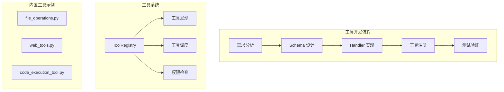
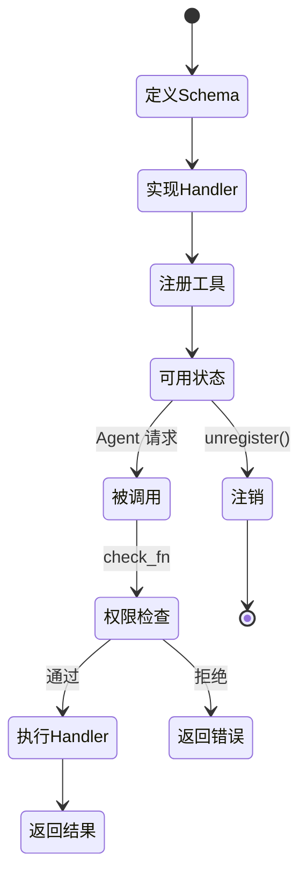

# 工具开发步骤

## 概述

本文档提供完整的 Sparkii Agent 工具开发指南，涵盖从需求分析到工具注册的全流程。Sparkii 的工具系统基于 `ToolRegistry` 单例注册表，支持同步/异步工具、插件覆盖策略和动态 schema 生成。

## 架构总览



## 第一步：需求分析与接口设计

### 确定工具功能

在开始编码前，明确以下问题：
1. 工具解决什么问题？
2. 输入参数有哪些？哪些是必需的，哪些是可选的？
3. 返回什么格式的结果？
4. 是否需要异步执行？

### 参考现有工具

| 工具文件 | 功能 | 特点 |
|----------|------|------|
| `tools/file_operations.py` | 文件读写操作 | 同步、安全沙箱 |
| `tools/web_tools.py` | 网页抓取和搜索 | 异步、HTTP 客户端 |
| `tools/code_execution_tool.py` | 代码执行 | 异步、沙箱隔离 |
| `tools/image_generation_tool.py` | 图像生成 | 异步、多模型支持 |

## 第二步：定义工具 Schema

工具 Schema 使用 JSON Schema 格式定义，描述工具的名称、描述和参数：

```python
MY_TOOL_SCHEMA = {
    "name": "my_custom_tool",
    "description": "工具的简要描述，用于 LLM 理解工具用途",
    "parameters": {
        "type": "object",
        "properties": {
            "input_text": {
                "type": "string",
                "description": "输入文本参数的描述",
            },
            "max_length": {
                "type": "integer",
                "description": "最大输出长度",
                "default": 100,
            },
            "options": {
                "type": "array",
                "items": {"type": "string"},
                "description": "可选配置列表",
            },
        },
        "required": ["input_text"],
    },
}
```

### Schema 设计最佳实践

1. **描述清晰**：每个参数都要有 description，帮助 LLM 正确使用
2. **类型精确**：使用准确的 JSON Schema 类型（string、integer、boolean、array、object）
3. **合理默认值**：可选参数提供合理的 default 值
4. **枚举约束**：有限选项使用 enum 约束

## 第三步：实现 Handler 函数

Handler 是工具的核心逻辑，接收参数字典并返回结果字典：

### 同步工具

```python
def my_sync_handler(params: dict) -> dict:
    """同步工具 handler。"""
    input_text = params.get("input_text", "")
    max_length = params.get("max_length", 100)
    
    # 核心逻辑
    result = process(input_text)[:max_length]
    
    return {
        "success": True,
        "result": result,
    }
```

### 异步工具

```python
async def my_async_handler(params: dict) -> dict:
    """异步工具 handler。适用于 I/O 密集型操作。"""
    input_text = params.get("input_text", "")
    
    # 异步操作
    async with httpx.AsyncClient() as client:
        response = await client.get(f"https://api.example.com?q={input_text}")
        data = response.json()
    
    return {
        "success": True,
        "result": data,
    }
```

### 错误处理

```python
def my_handler(params: dict) -> dict:
    try:
        # 核心逻辑
        result = do_work(params)
        return {"success": True, "result": result}
    except ValueError as e:
        return {"success": False, "error": str(e), "error_type": "validation"}
    except Exception as e:
        return {"success": False, "error": str(e), "error_type": "internal"}
```

## 第四步：注册工具

使用 `ToolRegistry.register()` 方法将工具注册到全局注册表：

```python
from tools.registry import registry

# 注册同步工具
registry.register(
    name="my_custom_tool",
    toolset="custom",                    # 工具集分类
    schema=MY_TOOL_SCHEMA,
    handler=my_sync_handler,
    check_fn=None,                       # 可选的权限检查函数
    is_async=False,
)

# 注册异步工具
registry.register(
    name="my_async_tool",
    toolset="custom",
    schema=MY_ASYNC_TOOL_SCHEMA,
    handler=my_async_handler,
    is_async=True,
)
```

### ToolRegistry 核心特性

```python
# tools/registry.py - ToolRegistry 类
class ToolRegistry:
    _lock = threading.RLock()            # 线程安全
    _generation: int = 0                 # 缓存失效计数器
    
    def register(self, name, toolset, schema, handler, 
                 check_fn=None, is_async=False):
        """注册工具到注册表"""
        with self._lock:
            self._tools[name] = ToolEntry(...)
            self._generation += 1        # 触发缓存失效
```

关键设计：
- **单例模式**：全局唯一的 `registry` 实例
- **线程安全**：使用 `threading.RLock()` 保护并发访问
- **缓存失效**：`_generation` 计数器在注册/注销时递增，用于工具列表缓存失效
- **插件覆盖**：`register_plugin_override_policy()` 支持插件覆盖内置工具

## 第五步：权限检查（可选）

通过 `check_fn` 参数为工具添加运行时权限检查：

```python
def check_file_access(params: dict) -> Optional[str]:
    """检查文件路径是否在允许范围内。返回 None 表示允许，返回字符串表示拒绝原因。"""
    path = params.get("path", "")
    if path.startswith("/etc/") or path.startswith("/sys/"):
        return f"禁止访问系统路径: {path}"
    return None

registry.register(
    name="safe_file_read",
    toolset="file",
    schema=FILE_READ_SCHEMA,
    handler=file_read_handler,
    check_fn=check_file_access,          # 注册权限检查
)
```

## 第六步：测试验证

### 单元测试

```python
import pytest
from tools.registry import registry

def test_my_tool_basic():
    result = registry.call("my_custom_tool", {"input_text": "hello"})
    assert result["success"] is True
    assert "result" in result

def test_my_tool_validation():
    result = registry.call("my_custom_tool", {})
    assert result["success"] is False
    assert "error" in result

def test_my_tool_permission():
    result = registry.call("safe_file_read", {"path": "/etc/passwd"})
    assert result["success"] is False
```

### 集成测试

```python
@pytest.mark.asyncio
async def test_tool_with_agent():
    # 模拟 Agent 调用工具
    tools = registry.get_tool_definitions()
    assert any(t["name"] == "my_custom_tool" for t in tools)
```

## 工具生命周期



## 源文件参考

| 文件 | 职责 |
|------|------|
| `tools/registry.py` | 工具注册表核心（1002 行） |
| `tools/file_operations.py` | 文件操作工具示例 |
| `tools/web_tools.py` | Web 工具示例 |
| `tools/code_execution_tool.py` | 代码执行工具示例 |
| `tools/mcp_tool.py` | MCP 协议工具集成 |
