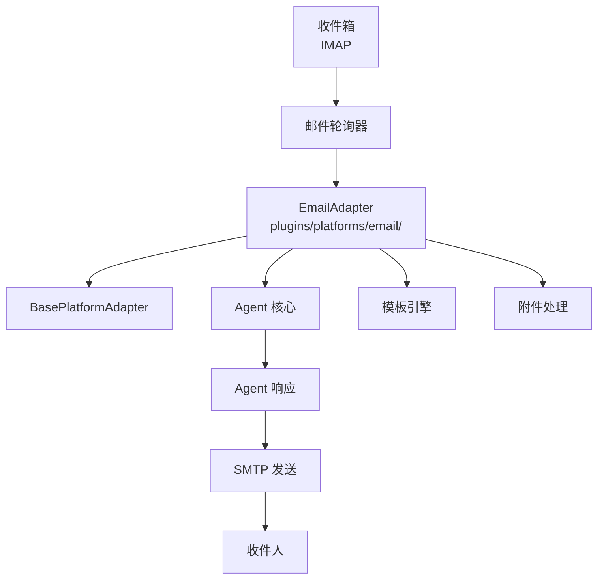
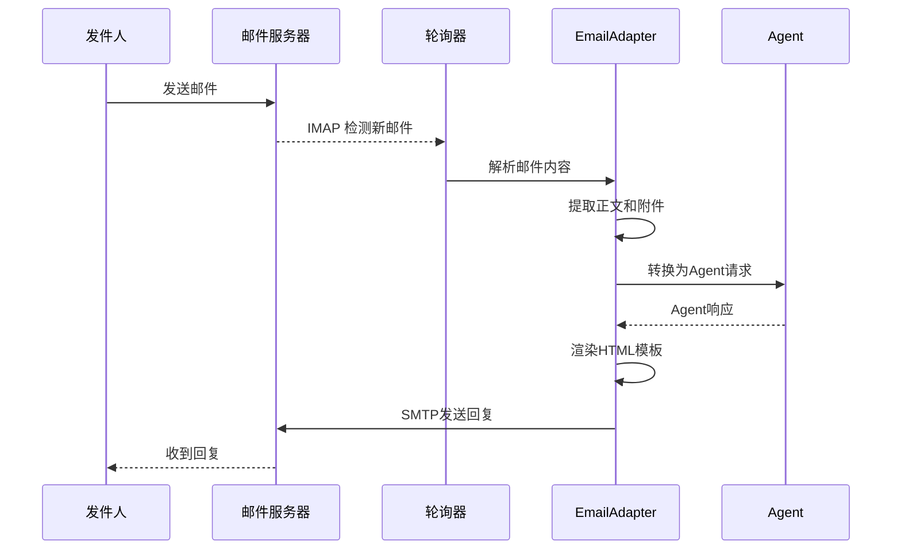

# Email适配器

<cite>
**本文引用的文件**
- [plugins/platforms/email/](file://plugins/platforms/email/)
- [gateway/platforms/base.py](file://gateway/platforms/base.py)
</cite>

## 目录
1. [简介](#简介)
2. [项目结构](#项目结构)
3. [核心组件](#核心组件)
4. [架构总览](#架构总览)
5. [详细组件分析](#详细组件分析)
6. [依赖关系分析](#依赖关系分析)
7. [性能考量](#性能考量)
8. [故障排查指南](#故障排查指南)
9. [结论](#结论)

## 简介
本文详细阐述 Sparkii Agent 的 Email 平台适配器实现。Email 适配器通过 SMTP/IMAP 协议集成，将 Agent 的对话能力接入电子邮件系统，支持邮件收发、附件处理、HTML 内容渲染和邮件列表管理。

适配器继承自 BasePlatformAdapter，实现了完整的邮件处理流程，包括 SSL/TLS 安全连接、邮件模板系统和批量操作。

## 项目结构
Email 适配器位于 `plugins/platforms/email/` 目录，使用 SMTP 发送和 IMAP 接收邮件。

## 核心组件
- **EmailAdapter**：主适配器类，实现 SMTP/IMAP 协议的完整集成。
- **邮件轮询器**：定期检查收件箱，处理新邮件。
- **SMTP 发送器**：支持 HTML 和纯文本格式，附件添加和优先级设置。
- **IMAP 接收器**：支持文件夹管理、邮件搜索和标记已读。
- **模板引擎**：预定义邮件模板，支持变量替换和条件渲染。
- **附件处理器**：支持文件上传、下载和格式转换。

## 架构总览

## 详细组件分析
### SMTP 发送
- 支持 SSL/TLS 加密连接。
- HTML 邮件自动添加纯文本回退。
- 附件支持 Base64 编码，兼容各种邮件客户端。
- 支持 CC、BCC、Reply-To 等邮件头设置。

### IMAP 接收
- 支持 IDLE 模式实时推送新邮件。
- 文件夹管理：收件箱、已发送、草稿箱等。
- 邮件搜索：按发件人、主题、日期等条件过滤。
- 自动标记已处理邮件，避免重复处理。

### 邮件模板系统
- 支持 Jinja2 模板语法。
- 内置常用模板（回复、通知、报告等）。
- 模板变量支持自动转义，防止 XSS 攻击。

### 批量操作
- 支持批量发送、批量标记和批量删除。
- 发送速率自适应，遵守邮件服务器限制。

## 依赖关系分析
- **平台基类**：`gateway/platforms/base.py` — BasePlatformAdapter
- **Email 适配器**：`plugins/platforms/email/` — Email 实现
- **认证管理**：SMTP/IMAP 凭证管理

## 性能考量
- 邮件轮询使用 IMAP IDLE 模式，减少不必要的网络请求。
- 大附件使用流式处理，不一次性加载到内存。
- SMTP 连接池复用，减少连接建立开销。
- 邮件解析使用增量处理，支持超大邮件。

## 故障排查指南
- **SMTP 连接失败**：检查服务器地址、端口和加密设置。
- **IMAP 认证失败**：确认用户名密码正确，检查应用专用密码。
- **邮件发送被拒**：检查发件人地址和 SPF/DKIM 配置。
- **附件过大**：确认附件大小在服务器限制范围内。

## 结论
Email 适配器通过标准化的邮件协议将 Agent 能力接入企业邮件系统。模板系统和批量操作机制使其适合大规模邮件处理场景，而安全连接和凭证管理确保了通信安全。

