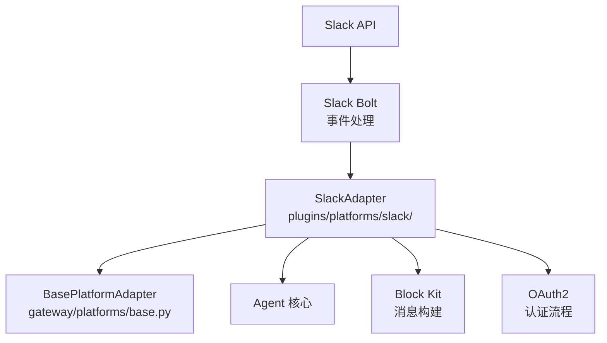
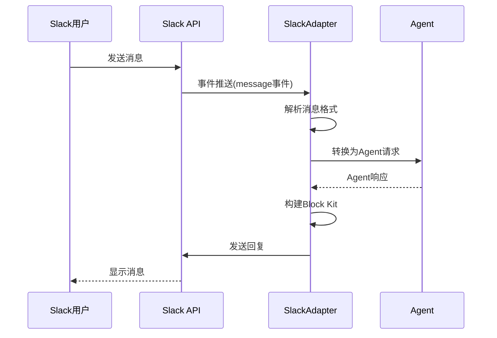

# Slack适配器

<cite>
**本文引用的文件**
- [plugins/platforms/slack/](file://plugins/platforms/slack/)
- [gateway/platforms/base.py](file://gateway/platforms/base.py)
- [gateway/platforms/ADDING_A_PLATFORM.md](file://gateway/platforms/ADDING_A_PLATFORM.md)
</cite>

## 目录
1. [简介](#简介)
2. [项目结构](#项目结构)
3. [核心组件](#核心组件)
4. [架构总览](#架构总览)
5. [详细组件分析](#详细组件分析)
6. [依赖关系分析](#依赖关系分析)
7. [性能考量](#性能考量)
8. [故障排查指南](#故障排查指南)
9. [结论](#结论)

## 简介
本文详细阐述 Sparkii Agent 的 Slack 平台适配器实现。Slack 适配器基于 Slack Bolt 框架集成，将 Agent 的对话能力无缝接入 Slack 工作空间，支持 Block Kit 界面构建、消息格式化、交互事件处理和 Slash 命令。

适配器继承自 BasePlatformAdapter 基类，实现了消息收发、会话管理、权限控制等标准接口，同时提供 Slack 特有的功能如频道管理、线程回复和富媒体内容。

## 项目结构
Slack 适配器位于 `plugins/platforms/slack/` 目录，继承自 `gateway/platforms/base.py` 中的 BasePlatformAdapter。

## 核心组件
- **SlackAdapter**：主适配器类，继承 BasePlatformAdapter，实现所有平台接口。
- **事件处理器**：处理 Slack 事件（消息、反应、文件共享等），转换为 Agent 可理解的格式。
- **Block Kit 构建器**：将 Agent 输出转换为 Slack Block Kit 格式，支持富文本、按钮、下拉菜单等交互组件。
- **OAuth2 认证**：实现 Slack OAuth2 流程，管理 Bot Token 和 User Token。
- **Slash 命令处理器**：注册和处理自定义 Slash 命令，支持快捷操作。

## 架构总览

## 详细组件分析
### Block Kit 界面构建
- 支持 Section、Actions、Input、Image 等 Block 类型。
- 自动将 Markdown 格式转换为 Slack mrkdwn 格式。
- 支持交互组件（按钮、选择菜单、日期选择器）的事件回调。

### 消息格式化
- 代码块自动添加语法高亮标记。
- 链接自动转换为 Slack 格式（<url|text>）。
- 长消息自动分段发送，避免超过 Slack 消息长度限制。

### 频道权限控制
- 支持基于频道的访问控制，限制 Agent 可响应的频道。
- 管理员可配置 Bot 的频道白名单和黑名单。
- 支持 DM（私信）和群聊的不同权限策略。

### 消息线程支持
- 自动识别线程上下文，保持对话连续性。
- 支持在指定线程中回复，或创建新线程。

## 依赖关系分析
- **平台基类**：`gateway/platforms/base.py` — BasePlatformAdapter
- **Slack 适配器**：`plugins/platforms/slack/` — Slack 实现
- **添加平台指南**：`gateway/platforms/ADDING_A_PLATFORM.md` — 开发文档
- **认证管理**：OAuth2 Token 管理和刷新机制

## 性能考量
- Slack API 调用遵守速率限制（Tier 1: 1请求/秒），适配器内置限流器。
- Block Kit 响应使用批量构建，减少 API 调用次数。
- 事件处理使用异步队列，避免阻塞 Slack 的3秒响应超时。
- Token 缓存减少认证开销。

## 故障排查指南
- **消息发送失败**：检查 Bot Token 有效性和频道权限。
- **事件接收超时**：确认 Bolt 应用的事件订阅配置正确。
- **Block Kit 渲染错误**：验证 Block 结构是否符合 Slack 规范。
- **OAuth 认证失败**：检查 Client ID/Secret 和重定向 URL 配置。

## 结论
Slack 适配器通过标准化的平台接口将 Sparkii Agent 的能力无缝接入 Slack 工作空间。开发者可以基于 BasePlatformAdapter 快速理解适配器架构，并参考 Slack 实现来开发其他平台适配器。

