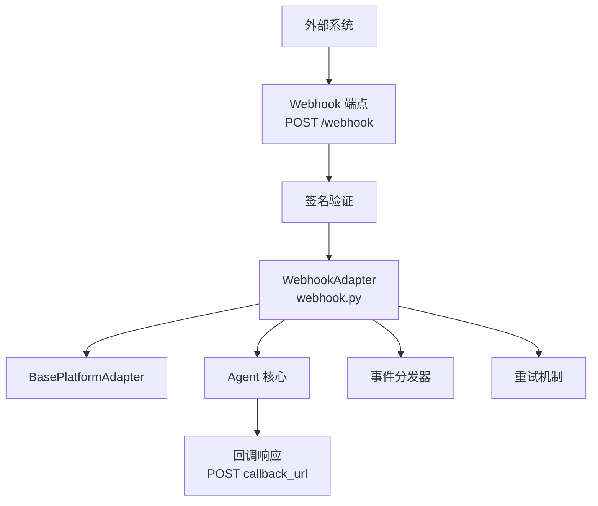
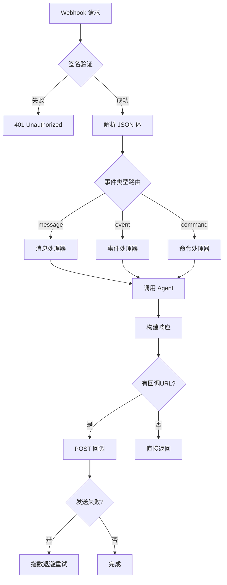

# Webhook适配器

<cite>
**本文引用的文件**
- [plugins/platforms/webhook/](file://plugins/platforms/webhook/)
- [gateway/platforms/base.py](file://gateway/platforms/base.py)
- [gateway/platforms/webhook.py](file://gateway/platforms/webhook.py)
</cite>

## 目录
1. [简介](#简介)
2. [项目结构](#项目结构)
3. [核心组件](#核心组件)
4. [架构总览](#架构总览)
5. [详细组件分析](#详细组件分析)
6. [依赖关系分析](#依赖关系分析)
7. [性能考量](#性能考量)
8. [故障排查指南](#故障排查指南)
9. [结论](#结论)

## 简介
本文详细阐述 Hermes Agent 的 Webhook 平台适配器实现。Webhook 适配器提供通用的 HTTP Webhook 接口，支持任意系统通过 HTTP 请求与 Agent 交互，包括事件订阅、签名验证、重试机制和回调 URL 管理。

适配器实现了 RESTful API 设计，支持 JSON 数据格式，提供完整的 Webhook 注册、事件分发和响应处理能力。

## 项目结构
Webhook 适配器位于 `plugins/platforms/webhook/` 和 `gateway/platforms/webhook.py`。

## 核心组件
- **WebhookAdapter**（gateway/platforms/webhook.py:177）：主适配器类，实现通用 Webhook 接口。
- **签名验证器**：使用 HMAC-SHA256 验证 Webhook 请求的完整性。
- **事件分发器**：根据事件类型路由到对应的处理器。
- **重试机制**：失败的回调自动重试，支持指数退避。
- **回调 URL 管理**：注册和管理回调地址，支持动态更新。
- **速率限制器**：防止 Webhook 端点被过度调用。

## 架构总览

## 详细组件分析
### Webhook 注册
- 支持通过 API 注册新的 Webhook 端点。
- 每个 Webhook 关联唯一密钥，用于签名验证。
- 支持事件过滤，只接收关心的事件类型。

### 签名验证
- 使用 HMAC-SHA256 算法计算请求体签名。
- 签名包含在 X-Webhook-Signature 头中。
- 支持时间戳验证，防止重放攻击。

### 事件分发
- 支持自定义事件类型和处理器映射。
- 未知事件类型触发默认处理器。
- 事件处理支持同步和异步两种模式。

### 重试机制
- 回调失败自动重试，最多3次。
- 重试间隔使用指数退避（1s, 2s, 4s）。
- 超过重试次数的回调记录到死信队列。

## 依赖关系分析
- **平台基类**：`gateway/platforms/base.py` — BasePlatformAdapter
- **Webhook 适配器**：`gateway/platforms/webhook.py` — Webhook 实现
- **Webhook 插件**：`plugins/platforms/webhook/` — 扩展功能
- **健康检查**：Webhook 端点内置健康检查（GET /health）

## 性能考量
- Webhook 端点使用异步处理，不阻塞 HTTP 响应。
- 签名验证使用常量时间比较，防止时序攻击。
- 事件队列使用内存缓冲，高并发时自动背压。
- 回调重试使用后台任务，不占用主请求线程。

## 故障排查指南
- **签名验证失败**：检查 Webhook 密钥配置和请求体完整性。
- **回调超时**：确认回调 URL 可达，调整超时设置。
- **事件丢失**：检查事件队列容量和背压配置。
- **重试耗尽**：查看死信队列中的失败回调，分析失败原因。

## 结论
Webhook 适配器提供了最灵活的系统集成方式，任何支持 HTTP 的系统都可以通过 Webhook 与 Agent 交互。签名验证和重试机制确保了通信的安全性和可靠性。

