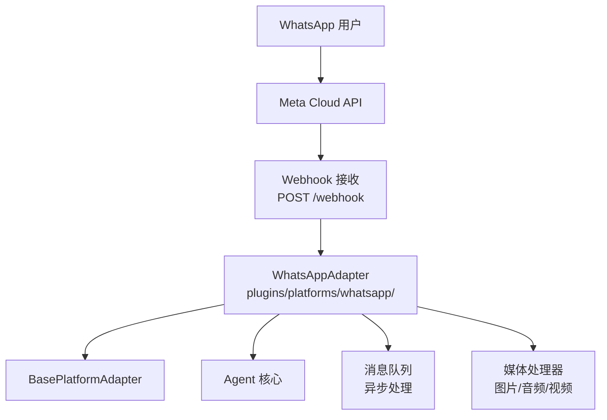
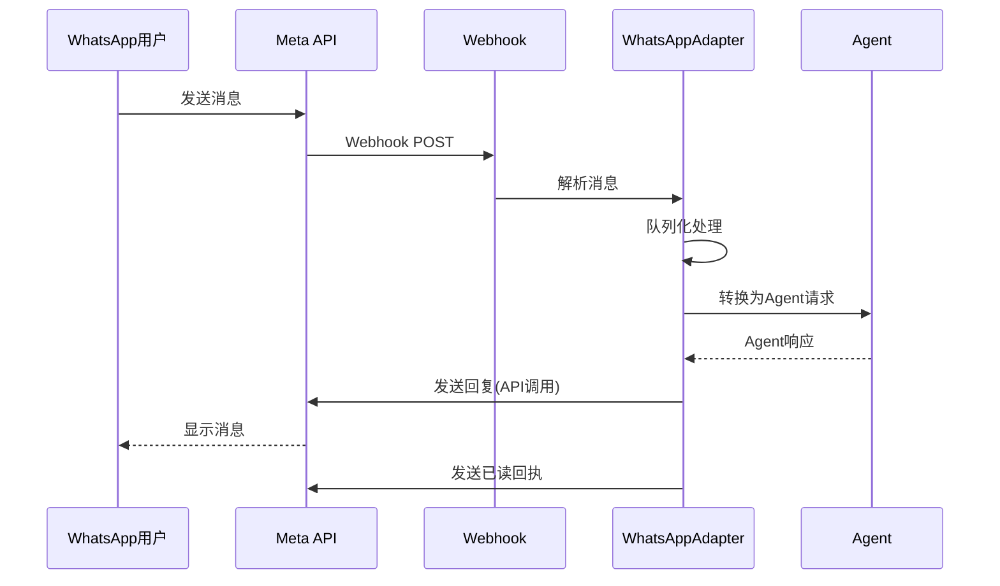

# WhatsApp适配器

<cite>
**本文引用的文件**
- [plugins/platforms/whatsapp/](file://plugins/platforms/whatsapp/)
- [gateway/platforms/base.py](file://gateway/platforms/base.py)
</cite>

## 目录
1. [简介](#简介)
2. [项目结构](#项目结构)
3. [核心组件](#核心组件)
4. [架构总览](#架构总览)
5. [详细组件分析](#详细组件分析)
6. [依赖关系分析](#依赖关系分析)
7. [性能考量](#性能考量)
8. [故障排查指南](#故障排查指南)
9. [结论](#结论)

## 简介
本文详细阐述 Sparkii Agent 的 WhatsApp 平台适配器实现。WhatsApp 适配器基于 WhatsApp Business API 集成，将 Agent 的对话能力接入 WhatsApp 消息平台，支持消息队列管理、媒体文件处理、模板消息发送和群组聊天。

适配器继承自 BasePlatformAdapter，实现了与 WhatsApp Cloud API 的完整集成，包括 Webhook 配置、消息格式转换和已读回执。

## 项目结构
WhatsApp 适配器位于 `plugins/platforms/whatsapp/` 目录，通过 WhatsApp Cloud API 与 Meta 服务器通信。

## 核心组件
- **WhatsAppAdapter**：主适配器类，实现 WhatsApp Business API 的完整集成。
- **消息队列管理**：异步处理入站消息，防止消息丢失和重复处理。
- **媒体文件处理器**：支持图片、音频、视频、文档的接收和发送。
- **模板消息系统**：管理预定义的消息模板，支持变量替换和多语言。
- **群组聊天支持**：处理群组消息、@提及和群组管理操作。
- **已读回执**：自动发送消息已读状态，提升用户体验。

## 架构总览

## 详细组件分析
### 消息队列管理
- 入站消息先进入异步队列，由工作协程逐条处理。
- 支持消息去重，防止 Webhook 重试导致的重复处理。
- 队列满时触发背压机制，通知 Meta API 暂停推送。

### 媒体文件处理
- 接收：自动下载媒体文件，转换为 Agent 可处理的格式。
- 发送：支持上传本地文件或 URL 引用的媒体内容。
- 格式转换：图片压缩、音频转码等优化处理。

### 模板消息
- 支持 WhatsApp 审核通过的消息模板。
- 模板变量支持动态替换。
- 多语言模板自动选择。

### 群组聊天
- 支持群组消息的上下文保持。
- @提及自动解析为用户标识。
- 群组管理命令（加入/退出/静音）。

## 依赖关系分析
- **平台基类**：`gateway/platforms/base.py` — BasePlatformAdapter
- **WhatsApp 适配器**：`plugins/platforms/whatsapp/` — WhatsApp 实现
- **认证管理**：Meta Business API Token 管理
- **Webhook 配置**：验证令牌和签名验证

## 性能考量
- 消息队列使用内存队列，配合持久化备份防止进程重启丢失。
- 媒体文件使用流式下载，大文件不占用过多内存。
- API 调用遵守 Meta 的速率限制，内置自适应限流器。
- 已读回执使用批量发送，减少 API 调用次数。

## 故障排查指南
- **Webhook 验证失败**：检查验证令牌配置和签名密钥。
- **消息发送超时**：确认 Meta API 可达性和 Token 有效性。
- **媒体上传失败**：检查文件大小限制和格式支持。
- **模板消息被拒**：确认模板已通过 Meta 审核。

## 结论
WhatsApp 适配器通过标准化的平台接口将 Agent 能力接入全球最广泛使用的即时通讯平台。消息队列和媒体处理机制确保了在高并发场景下的可靠性和性能。

