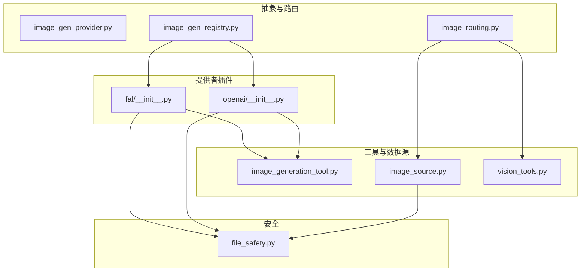
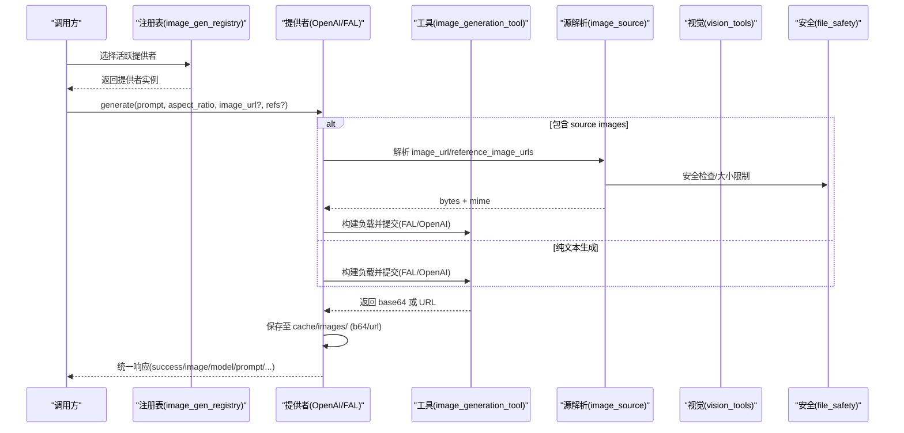
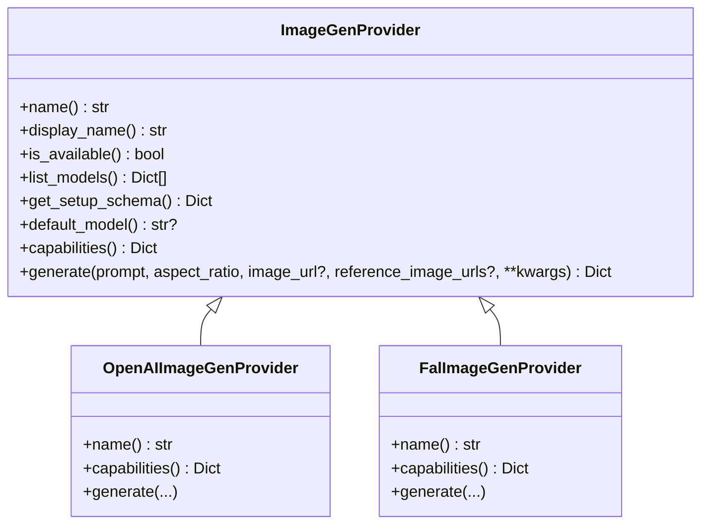
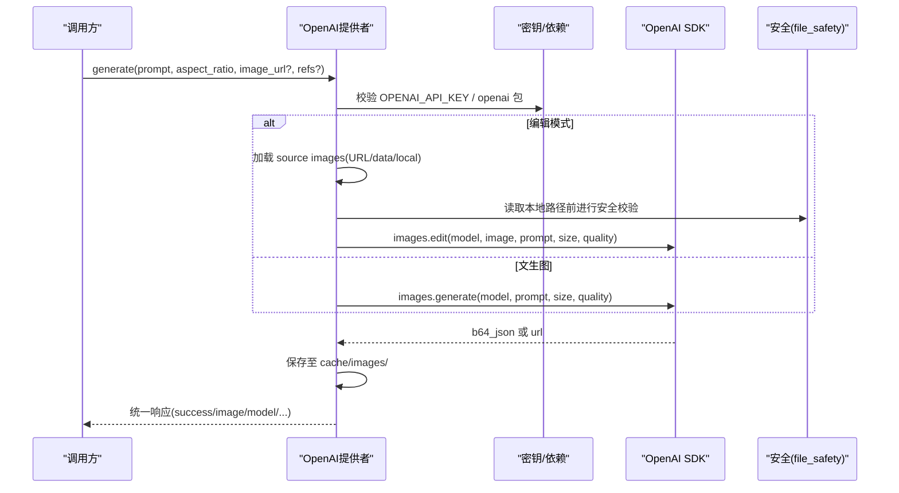
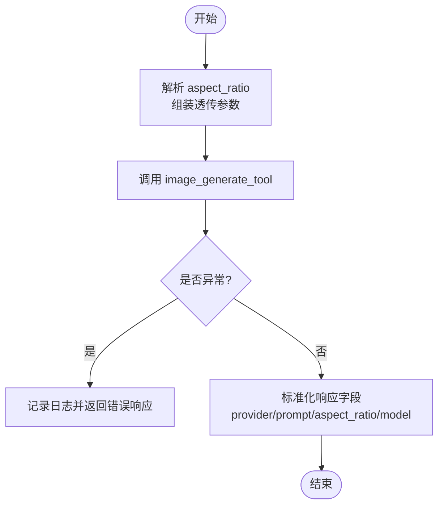
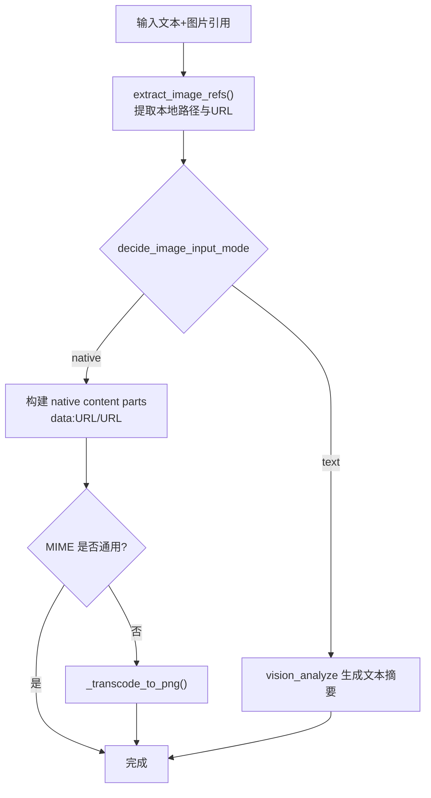
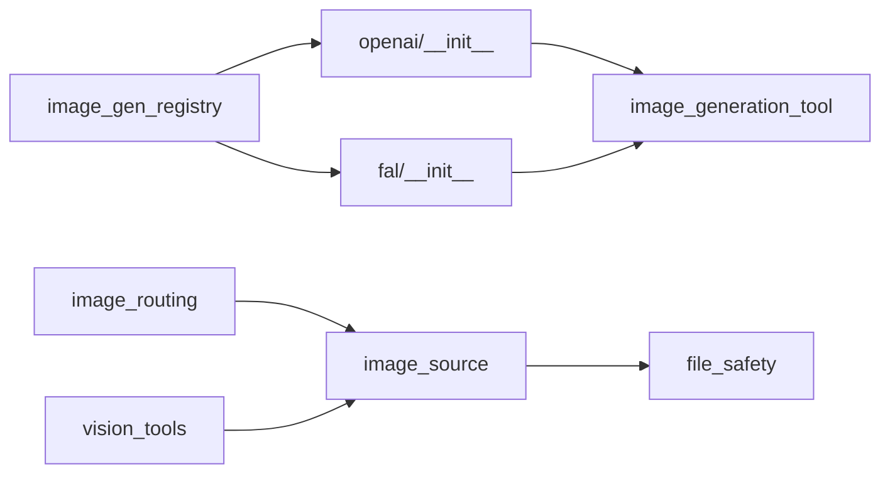

# 图像处理

<cite>
**本文引用的文件**
- [agent/image_gen_provider.py](file://agent/image_gen_provider.py)
- [agent/image_gen_registry.py](file://agent/image_gen_registry.py)
- [agent/image_routing.py](file://agent/image_routing.py)
- [tools/image_generation_tool.py](file://tools/image_generation_tool.py)
- [plugins/image_gen/openai/__init__.py](file://plugins/image_gen/openai/__init__.py)
- [plugins/image_gen/fal/__init__.py](file://plugins/image_gen/fal/__init__.py)
- [tools/image_source.py](file://tools/image_source.py)
- [tools/vision_tools.py](file://tools/vision_tools.py)
- [agent/file_safety.py](file://agent/file_safety.py)
</cite>

## 目录
1. [简介](#简介)
2. [项目结构](#项目结构)
3. [核心组件](#核心组件)
4. [架构总览](#架构总览)
5. [详细组件分析](#详细组件分析)
6. [依赖关系分析](#依赖关系分析)
7. [性能与优化](#性能与优化)
8. [故障排查指南](#故障排查指南)
9. [结论](#结论)
10. [附录：调用示例与最佳实践](#附录调用示例与最佳实践)

## 简介
本文件系统性说明本仓库中“图像处理”的完整实现机制，覆盖图像上传、下载、格式转换、压缩优化、图像生成工具集成（OpenAI DALL-E/gpt-image-2、FAL.ai 多模型）、缓存策略、CDN 友好处理、以及安全扫描与内容审核。文档面向不同技术背景的读者，提供从高层架构到代码级流程的渐进式说明，并给出可操作的调用路径与排错建议。

## 项目结构
围绕图像处理的关键模块分布如下：
- 抽象与路由层
  - agent/image_gen_provider.py：定义统一的图像生成提供者接口与通用工具（缓存落盘、响应构造等）。
  - agent/image_gen_registry.py：注册表与活跃提供者选择逻辑。
  - agent/image_routing.py：入站图片路由（原生视觉 vs 文本描述），本地/URL 提取、MIME 嗅探与转码。
- 具体提供者插件
  - plugins/image_gen/openai/__init__.py：OpenAI gpt-image-2 提供者（支持 text-to-image 与 image editing）。
  - plugins/image_gen/fal/__init__.py：FAL.ai 提供者（统一接入 tools.image_generation_tool 的多模型目录与上采样）。
- 工具与数据源
  - tools/image_generation_tool.py：FAL 模型目录、负载构建、托管网关选择、Clarity 上采样链路与请求提交。
  - tools/image_source.py：统一媒体源解析器（data/http(s)/file/container），大小限制、安全白名单、容器内读取。
  - tools/vision_tools.py：视觉分析工具（辅助 vision 路由、并发控制、下载超时、CPU 限流）。
- 安全与合规
  - agent/file_safety.py：读写安全规则、敏感路径拦截、凭据保护。



**图示来源**
- [agent/image_gen_provider.py:64-194](file://agent/image_gen_provider.py#L64-L194)
- [agent/image_gen_registry.py:36-139](file://agent/image_gen_registry.py#L36-L139)
- [agent/image_routing.py:82-148](file://agent/image_routing.py#L82-L148)
- [plugins/image_gen/openai/__init__.py:165-419](file://plugins/image_gen/openai/__init__.py#L165-L419)
- [plugins/image_gen/fal/__init__.py:40-212](file://plugins/image_gen/fal/__init__.py#L40-L212)
- [tools/image_generation_tool.py:97-661](file://tools/image_generation_tool.py#L97-L661)
- [tools/image_source.py:95-157](file://tools/image_source.py#L95-L157)
- [tools/vision_tools.py:101-194](file://tools/vision_tools.py#L101-L194)
- [agent/file_safety.py:161-177](file://agent/file_safety.py#L161-L177)

**章节来源**
- [agent/image_gen_provider.py:64-194](file://agent/image_gen_provider.py#L64-L194)
- [agent/image_gen_registry.py:36-139](file://agent/image_gen_registry.py#L36-L139)
- [agent/image_routing.py:82-148](file://agent/image_routing.py#L82-L148)
- [plugins/image_gen/openai/__init__.py:165-419](file://plugins/image_gen/openai/__init__.py#L165-L419)
- [plugins/image_gen/fal/__init__.py:40-212](file://plugins/image_gen/fal/__init__.py#L40-L212)
- [tools/image_generation_tool.py:97-661](file://tools/image_generation_tool.py#L97-L661)
- [tools/image_source.py:95-157](file://tools/image_source.py#L95-L157)
- [tools/vision_tools.py:101-194](file://tools/vision_tools.py#L101-L194)
- [agent/file_safety.py:161-177](file://agent/file_safety.py#L161-L177)

## 核心组件
- 图像生成提供者抽象（ImageGenProvider）
  - 统一入口 generate(prompt, aspect_ratio, image_url?, reference_image_urls?)，自动区分 text-to-image 与 image-to-image/edit。
  - 能力声明 capabilities() 暴露 modalities 与 max_reference_images，驱动动态工具模式。
  - 通用工具：save_b64_image/save_url_image 将结果持久化到 $SPARKII_HOME/cache/images/；success_response/error_response 统一返回形状。
- 提供者注册与选择（image_gen_registry）
  - 维护已注册提供者集合，按配置 image_gen.provider 选择活跃提供者；未显式配置时回退到唯一可用或 legacy fal。
- 入站图片路由（image_routing）
  - decide_image_input_mode：在 auto/native/text 三种模式下决定以原生像素还是文本摘要呈现给主模型。
  - extract_image_refs：从自由文本中提取本地路径与 http(s) URL 的图片引用（跳过代码块）。
  - MIME 嗅探与转码：对非通用格式（HEIC/AVIF/BMP/TIFF/ICO/SVG）尝试转 PNG 以保证跨提供商兼容。
- 图像源解析（image_source）
  - resolve_image_source：统一 data:/http(s):/file:/container 四种来源，强制大小上限（~50MB）、SSRF/网站策略检查、凭据文件读保护。
  - 在非本地后端下，仅允许访问受信任的媒体缓存根目录；否则走容器内执行读取，避免主机逃逸。
- 视觉分析工具（vision_tools）
  - 下载超时、并发 CPU 限流（基于宿主可用核数），保障高并发场景下的稳定性。
- 安全规则（file_safety）
  - 写拒绝清单、敏感目录前缀、安全写入根目录；读保护用于防止读取 .env、密钥存储等。

**章节来源**
- [agent/image_gen_provider.py:64-194](file://agent/image_gen_provider.py#L64-L194)
- [agent/image_gen_registry.py:36-139](file://agent/image_gen_registry.py#L36-L139)
- [agent/image_routing.py:82-148](file://agent/image_routing.py#L82-L148)
- [tools/image_source.py:95-157](file://tools/image_source.py#L95-L157)
- [tools/vision_tools.py:101-194](file://tools/vision_tools.py#L101-L194)
- [agent/file_safety.py:161-177](file://agent/file_safety.py#L161-L177)

## 架构总览
下图展示从用户输入到图像生成/编辑的端到端流程，包括路由、提供者选择、模型负载构建、缓存与安全校验。



**图示来源**
- [agent/image_gen_registry.py:75-139](file://agent/image_gen_registry.py#L75-L139)
- [plugins/image_gen/openai/__init__.py:219-409](file://plugins/image_gen/openai/__init__.py#L219-L409)
- [plugins/image_gen/fal/__init__.py:118-202](file://plugins/image_gen/fal/__init__.py#L118-L202)
- [tools/image_generation_tool.py:725-765](file://tools/image_generation_tool.py#L725-L765)
- [tools/image_source.py:95-157](file://tools/image_source.py#L95-L157)
- [tools/vision_tools.py:101-194](file://tools/vision_tools.py#L101-L194)
- [agent/file_safety.py:161-177](file://agent/file_safety.py#L161-L177)

## 详细组件分析

### 图像生成提供者抽象与通用工具
- 抽象类 ImageGenProvider
  - name/display_name/is_available/list_models/get_setup_schema/capabilities/generate
  - capabilities 声明支持的模态（text/image）与最大参考图数量，驱动前端/工具动态模式。
- 通用工具
  - save_b64_image：解码 base64 并写入 $SPARKII_HOME/cache/images/，文件名含时间戳与短 UUID。
  - save_url_image：下载 URL 图片，按 Content-Type 或 URL 后缀推断扩展名，限制最大字节数，失败清理临时文件。
  - success_response/error_response：统一成功/错误响应结构，便于下游消费。



**图示来源**
- [agent/image_gen_provider.py:64-194](file://agent/image_gen_provider.py#L64-L194)
- [plugins/image_gen/openai/__init__.py:165-419](file://plugins/image_gen/openai/__init__.py#L165-L419)
- [plugins/image_gen/fal/__init__.py:40-212](file://plugins/image_gen/fal/__init__.py#L40-L212)

**章节来源**
- [agent/image_gen_provider.py:64-194](file://agent/image_gen_provider.py#L64-L194)

### OpenAI 图像生成提供者（gpt-image-2）
- 模型分层：low/medium/high 三档 quality，映射到同一底层 API 模型。
- 能力：支持 text-to-image 与 image editing（最多 16 张参考图）。
- 流程要点：
  - 校验 prompt、API Key、依赖包。
  - 若为编辑模式，加载 source images（URL/data/local），转为 multipart 提交。
  - 生成结果优先保存为本地文件（b64_json），如返回 URL 则下载到缓存目录，避免下游消费过期链接。
  - 返回统一响应，附带 size/quality/revised_prompt 等 extra。



**图示来源**
- [plugins/image_gen/openai/__init__.py:219-409](file://plugins/image_gen/openai/__init__.py#L219-L409)
- [agent/file_safety.py:161-177](file://agent/file_safety.py#L161-L177)

**章节来源**
- [plugins/image_gen/openai/__init__.py:165-419](file://plugins/image_gen/openai/__init__.py#L165-L419)

### FAL.ai 图像生成提供者（多模型目录与上采样）
- 通过插件适配器委托到 tools.image_generation_tool，集中管理模型目录、负载构建、托管网关选择与 Clarity 上采样链路。
- 能力：根据当前模型元数据动态暴露是否支持编辑与参考图数量。
- 流程要点：
  - 解析 aspect_ratio，透传可选参数（num_inference_steps、guidance_scale、seed、upscale 等）。
  - 调用 image_generate_tool，捕获异常并转换为统一错误响应。
  - 对返回 JSON 补充 provider/prompt/aspect_ratio/model 字段，保证下游一致性。



**图示来源**
- [plugins/image_gen/fal/__init__.py:118-202](file://plugins/image_gen/fal/__init__.py#L118-L202)
- [tools/image_generation_tool.py:725-765](file://tools/image_generation_tool.py#L725-L765)

**章节来源**
- [plugins/image_gen/fal/__init__.py:40-212](file://plugins/image_gen/fal/__init__.py#L40-L212)
- [tools/image_generation_tool.py:97-661](file://tools/image_generation_tool.py#L97-L661)

### 入站图片路由与格式转换
- decide_image_input_mode：auto/native/text 三种模式，结合模型能力与辅助 vision 配置决定如何向主模型呈现图片。
- extract_image_refs：从消息正文中抽取本地路径与 http(s) URL 的图片引用，忽略代码块中的示例。
- MIME 嗅探与转码：
  - 对非通用格式（HEIC/AVIF/BMP/TIFF/ICO/SVG）尝试使用 Pillow 转 PNG，确保跨提供商兼容性。
  - _sniff_mime_from_bytes 基于魔数识别常见格式；_transcode_to_png 负责重编码。
- build_native_content_parts：构建 OpenAI 风格的 content 列表（text + image_url parts），本地图片以 data: URL 嵌入，远程 URL 直接传递。



**图示来源**
- [agent/image_routing.py:82-148](file://agent/image_routing.py#L82-L148)
- [agent/image_routing.py:524-640](file://agent/image_routing.py#L524-L640)
- [agent/image_routing.py:728-800](file://agent/image_routing.py#L728-L800)

**章节来源**
- [agent/image_routing.py:82-148](file://agent/image_routing.py#L82-L148)
- [agent/image_routing.py:524-640](file://agent/image_routing.py#L524-L640)
- [agent/image_routing.py:728-800](file://agent/image_routing.py#L728-L800)

### 图像源解析与安全边界
- resolve_image_source：统一处理 data:/http(s):/file:/container 四类来源，强制大小上限（~50MB），并在非本地后端下严格限制主机读取范围（仅媒体缓存根目录），其余路径走容器内执行读取，避免主机逃逸。
- HTTP 安全：
  - _http_block_reason：预检 is_safe_url 与 check_website_access，阻止不安全或受限站点。
  - _download_to_bytes：通过 vision_tools._download_image 下载并限制大小。
- 容器内读取：
  - _resolve_container_fallback：在沙箱内执行 head/base64/tr 管道读取，限制输入大小，冷启动重试一次，失败时输出诊断信息。
- 最终校验：_finalize 再次确认类型（图像/视频）与大小限制。

```mermaid
flowchart TD
Src["source 字符串"] --> Scheme{"scheme?"}
Scheme --> |data:| Data["解析base64并校验长度"]
Scheme --> |http(s):| Http["预检安全策略<br/>下载并限制大小"]
Scheme --> |file/path| File["判断是否允许主机读取<br/>否则走容器内读取"]
Data --> Final["_finalize() 类型与大小校验"]
Http --> Final
File --> Final
Final --> Out["ResolvedImage(data,mime,origin)"]
```

**图示来源**
- [tools/image_source.py:95-157](file://tools/image_source.py#L95-L157)
- [tools/image_source.py:174-209](file://tools/image_source.py#L174-L209)
- [tools/image_source.py:304-381](file://tools/image_source.py#L304-L381)
- [tools/image_source.py:384-423](file://tools/image_source.py#L384-L423)

**章节来源**
- [tools/image_source.py:95-157](file://tools/image_source.py#L95-L157)
- [tools/image_source.py:174-209](file://tools/image_source.py#L174-L209)
- [tools/image_source.py:304-381](file://tools/image_source.py#L304-L381)
- [tools/image_source.py:384-423](file://tools/image_source.py#L384-L423)

### 视觉分析与并发控制
- 下载超时：可通过环境变量或配置设置 auxiliary.vision.download_timeout。
- CPU 限流：基于宿主可用核心数创建专用线程池，限制 encode/resize 并发，避免事件循环饥饿。
- 辅助 vision 路由：当主模型不支持原生视觉时，可选择辅助 vision 后端生成文本描述，保持工作流一致。

**章节来源**
- [tools/vision_tools.py:101-194](file://tools/vision_tools.py#L101-L194)

### 安全扫描与内容审核
- 文件安全：
  - file_safety 提供写拒绝清单、敏感目录前缀、安全写入根目录；读保护用于防止读取 .env、密钥存储等。
  - 在 OpenAI 提供者中，读取本地源图片前调用 raise_if_read_blocked，阻断敏感文件。
- 网站策略：
  - image_source 在下载前检查 is_safe_url 与 check_website_access，阻止 SSRF 与受限站点。
- 尺寸限制：
  - 统一 ~50MB 下载/摄入上限，防止内存溢出与恶意大文件攻击。
- 提供商内置安全：
  - FAL 模型目录中多处 enable_safety_checker 开关，可按模型启用/禁用提供商侧安全检测。

**章节来源**
- [agent/file_safety.py:161-177](file://agent/file_safety.py#L161-L177)
- [plugins/image_gen/openai/__init__.py:127-157](file://plugins/image_gen/openai/__init__.py#L127-L157)
- [tools/image_source.py:174-209](file://tools/image_source.py#L174-L209)
- [tools/image_generation_tool.py:97-661](file://tools/image_generation_tool.py#L97-L661)

## 依赖关系分析
- 耦合与内聚
  - 抽象层（image_gen_provider）与注册表（image_gen_registry）低耦合，插件（openai/fal）通过标准接口接入。
  - 工具层（image_generation_tool）作为 FAL 能力的单一事实源，插件仅做适配与转发。
  - 路由层（image_routing）与源解析（image_source）解耦，前者关注呈现模式，后者专注安全与类型。
- 外部依赖
  - OpenAI SDK（openai）、requests（部分提供者下载）、Pillow（转码）、httpx（异步下载）。
  - 托管网关（Nous Portal）用于 FAL 队列代理与计费。
- 潜在循环依赖
  - 通过延迟导入（lazy import）避免冷启动开销与循环依赖（例如 fal_client、openai、辅助客户端）。



**图示来源**
- [agent/image_gen_registry.py:36-139](file://agent/image_gen_registry.py#L36-L139)
- [plugins/image_gen/openai/__init__.py:165-419](file://plugins/image_gen/openai/__init__.py#L165-L419)
- [plugins/image_gen/fal/__init__.py:40-212](file://plugins/image_gen/fal/__init__.py#L40-L212)
- [tools/image_generation_tool.py:97-661](file://tools/image_generation_tool.py#L97-L661)
- [agent/image_routing.py:82-148](file://agent/image_routing.py#L82-L148)
- [tools/image_source.py:95-157](file://tools/image_source.py#L95-L157)
- [tools/vision_tools.py:101-194](file://tools/vision_tools.py#L101-L194)
- [agent/file_safety.py:161-177](file://agent/file_safety.py#L161-L177)

**章节来源**
- [agent/image_gen_registry.py:36-139](file://agent/image_gen_registry.py#L36-L139)
- [plugins/image_gen/openai/__init__.py:165-419](file://plugins/image_gen/openai/__init__.py#L165-L419)
- [plugins/image_gen/fal/__init__.py:40-212](file://plugins/image_gen/fal/__init__.py#L40-L212)
- [tools/image_generation_tool.py:97-661](file://tools/image_generation_tool.py#L97-L661)
- [agent/image_routing.py:82-148](file://agent/image_routing.py#L82-L148)
- [tools/image_source.py:95-157](file://tools/image_source.py#L95-L157)
- [tools/vision_tools.py:101-194](file://tools/vision_tools.py#L101-L194)
- [agent/file_safety.py:161-177](file://agent/file_safety.py#L161-L177)

## 性能与优化
- 缓存策略
  - 所有生成结果统一保存到 $SPARKII_HOME/cache/images/，文件名含时间戳与短 UUID，避免覆盖与冲突。
  - 对于返回 URL 的提供商（如 xAI/OpenAI 历史行为），先下载到本地再返回路径，避免下游消费过期链接。
- CDN 集成
  - 对 URL 下载采用流式读取与大小限制，Content-Type 不精确时回退到 URL 后缀推断，兼容 CDN 返回 octet-stream。
  - 建议在网关层配合 CDN 缓存静态资源，减少重复下载。
- 压缩与格式优化
  - 非通用格式尝试转 PNG，提升跨提供商兼容性；必要时在调用方进行二次缩放以适应提供商限制（如 Anthropic 单图 5MB）。
- 并发与 CPU 限流
  - 视觉分析使用专用线程池，并发度等于宿主可用核心数，避免事件循环饥饿。
  - 下载超时与大小限制降低长尾与恶意流量影响。
- 模型与上采样
  - FAL 模型目录为每个模型声明 upscale 标志，按需启用 Clarity 上采样，平衡质量与延迟。

[本节为通用指导，无需特定文件来源]

## 故障排查指南
- 认证与依赖缺失
  - OpenAI：缺少 OPENAI_API_KEY 或未安装 openai 包会返回明确错误提示。
  - FAL：缺少 FAL_KEY 或托管网关不可用时会给出可操作修复建议。
- 网络与策略
  - 下载被网站策略阻止或 URL 不安全，会在 _http_block_reason 中返回原因。
  - 超大文件或空响应会被拒绝并清理临时文件。
- 格式与兼容
  - 非通用格式无法转码将被跳过并记录警告；确保安装 Pillow 及可选插件（pillow-heif、pillow-avif-plugin）。
- 容器与权限
  - 非本地后端下，非缓存路径无法读取主机文件；需在容器内存在或通过缓存挂载。
  - 首次容器读取可能冷启动失败，系统会重试一次；仍失败会输出诊断信息。

**章节来源**
- [plugins/image_gen/openai/__init__.py:219-409](file://plugins/image_gen/openai/__init__.py#L219-L409)
- [plugins/image_gen/fal/__init__.py:118-202](file://plugins/image_gen/fal/__init__.py#L118-L202)
- [tools/image_source.py:174-209](file://tools/image_source.py#L174-L209)
- [tools/image_source.py:304-381](file://tools/image_source.py#L304-L381)
- [agent/image_routing.py:524-640](file://agent/image_routing.py#L524-L640)

## 结论
本仓库提供了完整的图像处理基础设施：统一的提供者抽象、灵活的入站路由、安全的源解析、丰富的模型目录与上采样链路、以及稳健的缓存与并发控制。通过插件化设计，OpenAI 与 FAL 等多后端可无缝接入；通过严格的文件大小、SSRF/网站策略与凭据保护，保障了安全性与稳定性。建议在生产环境中结合 CDN 缓存静态资源、合理配置下载超时与并发限制，并根据业务需求选择合适的模型与上采样策略。

[本节为总结性内容，无需特定文件来源]

## 附录：调用示例与最佳实践
- 调用 OpenAI gpt-image-2（文生图）
  - 步骤：设置 OPENAI_API_KEY -> 选择 quality tier -> 调用 generate -> 结果保存到缓存 -> 返回统一响应。
  - 参考路径：[plugins/image_gen/openai/__init__.py:219-409](file://plugins/image_gen/openai/__init__.py#L219-L409)
- 调用 OpenAI gpt-image-2（图像编辑）
  - 步骤：准备 image_url/reference_image_urls -> 加载源图（URL/data/local）-> 调用 images.edit -> 保存结果。
  - 参考路径：[plugins/image_gen/openai/__init__.py:265-317](file://plugins/image_gen/openai/__init__.py#L265-L317)
- 调用 FAL 多模型（文生图/编辑）
  - 步骤：选择模型 -> 构建负载（size/style/参数白名单）-> 提交请求（直连或托管网关）-> 可选上采样 -> 返回统一响应。
  - 参考路径：[tools/image_generation_tool.py:97-661](file://tools/image_generation_tool.py#L97-L661)、[plugins/image_gen/fal/__init__.py:118-202](file://plugins/image_gen/fal/__init__.py#L118-L202)
- 入站图片路由（原生 vs 文本）
  - 步骤：extract_image_refs -> decide_image_input_mode -> 构建 native content parts 或 vision_analyze 文本摘要。
  - 参考路径：[agent/image_routing.py:82-148](file://agent/image_routing.py#L82-L148)、[agent/image_routing.py:728-800](file://agent/image_routing.py#L728-L800)
- 安全与大小限制
  - 步骤：_http_block_reason -> _download_to_bytes -> _finalize -> 拒绝过大/非法类型。
  - 参考路径：[tools/image_source.py:174-209](file://tools/image_source.py#L174-L209)、[tools/image_source.py:384-423](file://tools/image_source.py#L384-L423)

[本节为操作指引，无需额外来源]