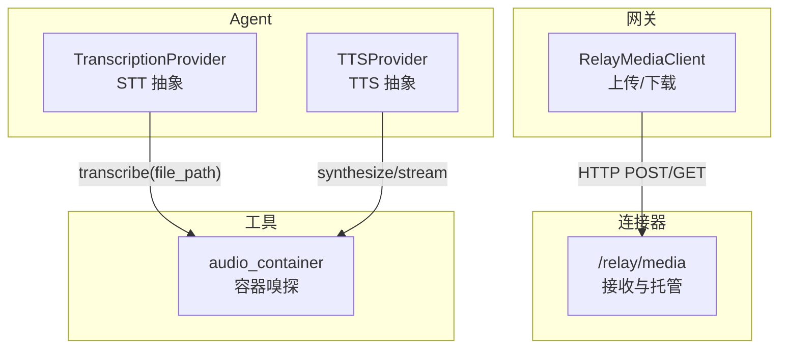
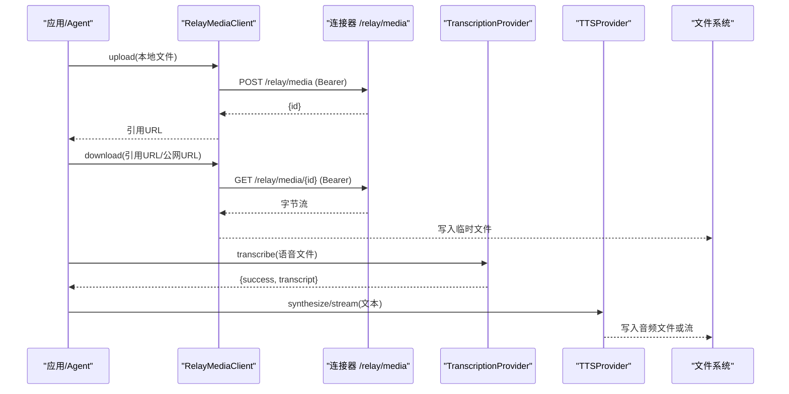
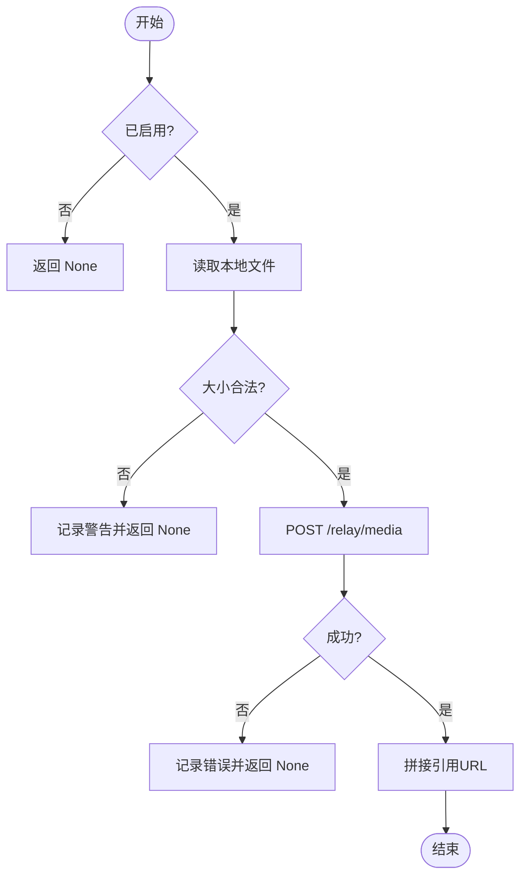
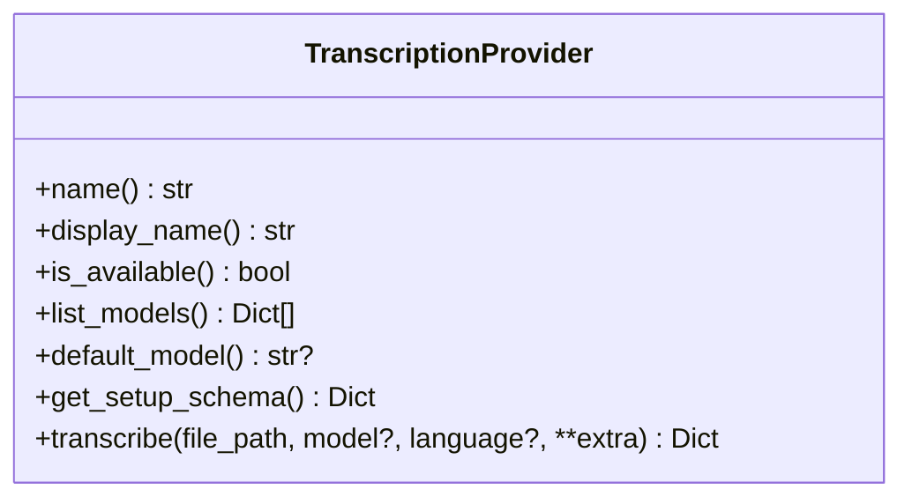
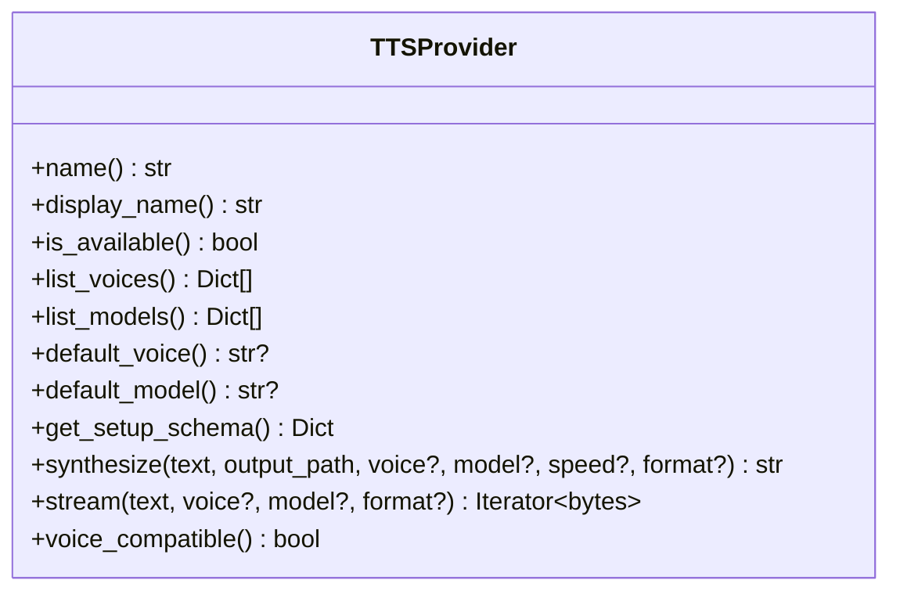
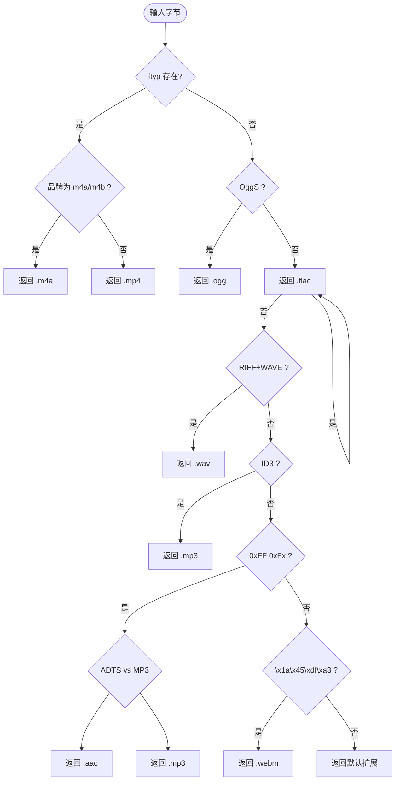
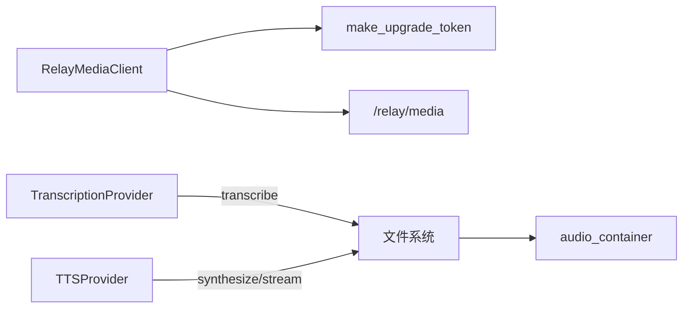

# 媒体内容处理

<cite>
**本文引用的文件**
- [gateway/relay/media.py](file://gateway/relay/media.py)
- [agent/transcription_provider.py](file://agent/transcription_provider.py)
- [agent/tts_provider.py](file://agent/tts_provider.py)
- [tools/audio_container.py](file://tools/audio_container.py)
- [skills/media/DESCRIPTION.md](file://skills/media/DESCRIPTION.md)
</cite>

## 目录
1. [简介](#简介)
2. [项目结构](#项目结构)
3. [核心组件](#核心组件)
4. [架构总览](#架构总览)
5. [详细组件分析](#详细组件分析)
6. [依赖关系分析](#依赖关系分析)
7. [性能与优化](#性能与优化)
8. [故障排查指南](#故障排查指南)
9. [结论](#结论)
10. [附录：示例与最佳实践](#附录示例与最佳实践)

## 简介
本指南面向在桌面与网关环境中进行富媒体（图像、音频、视频）上传、下载、转换、存储与分发的工程实现。结合仓库中的中继媒体客户端、语音转文字（STT）与文字转语音（TTS）抽象，以及容器嗅探工具，提供从接入到落盘、从格式识别到流式输出的完整方案，并给出压缩优化、缓存策略、CDN集成、安全扫描、大文件传输与断点续传等工程建议。

## 项目结构
围绕媒体处理的代码主要分布在以下位置：
- 网关侧媒体中继客户端：负责通过 HTTP 将本地文件上传至连接器，或从连接器下载附件到本地临时文件，供视觉/文件工具消费。
- STT/TTS 提供者抽象：定义可插拔的语音转文字与文字转语音后端接口，便于扩展不同厂商或本地命令。
- 容器嗅探工具：统一识别音频/音视频容器的魔数，确保入站/出站路径的文件扩展名与真实容器一致。
- 技能说明：描述媒体相关技能（如 YouTube 字幕、GIF 搜索、音乐生成等）。

图表来源
- [gateway/relay/media.py:71-202](file://gateway/relay/media.py#L71-L202)
- [agent/transcription_provider.py:61-194](file://agent/transcription_provider.py#L61-L194)
- [agent/tts_provider.py:64-275](file://agent/tts_provider.py#L64-L275)
- [tools/audio_container.py:49-98](file://tools/audio_container.py#L49-L98)

章节来源
- [gateway/relay/media.py:1-206](file://gateway/relay/media.py#L1-L206)
- [agent/transcription_provider.py:1-194](file://agent/transcription_provider.py#L1-L194)
- [agent/tts_provider.py:1-275](file://agent/tts_provider.py#L1-L275)
- [tools/audio_container.py:1-98](file://tools/audio_container.py#L1-L98)
- [skills/media/DESCRIPTION.md:1-4](file://skills/media/DESCRIPTION.md#L1-L4)

## 核心组件
- 中继媒体客户端（RelayMediaClient）
  - 功能：上传本地文件到连接器并返回引用 URL；根据 URL 类型决定是否携带鉴权头后下载为本地临时文件。
  - 限制：单文件大小上限固定，请求超时固定，失败时返回 None 以支持降级。
- STT 提供者抽象（TranscriptionProvider）
  - 功能：定义 transcribe(file_path, model, language, ...) 的统一接口，返回标准信封（success/transcript/provider/error）。
  - 扩展：内置提供者优先于插件提供者，避免名称冲突。
- TTS 提供者抽象（TTSProvider）
  - 功能：定义 synthesize(text, output_path, voice, model, speed, format, ...) 与可选 stream(...) 接口，输出多种音频格式。
  - 兼容：默认输出格式与有效格式集合，voice_compatible 标记是否适合语音气泡投递。
- 容器嗅探（audio_container）
  - 功能：基于魔数识别 m4a/mp4/ogg/flac/wav/mp3/aac/webm，并在入站路径修正扩展名，保证下游播放器/STT 正确解析。

章节来源
- [gateway/relay/media.py:71-202](file://gateway/relay/media.py#L71-L202)
- [agent/transcription_provider.py:61-194](file://agent/transcription_provider.py#L61-L194)
- [agent/tts_provider.py:64-275](file://agent/tts_provider.py#L64-L275)
- [tools/audio_container.py:49-98](file://tools/audio_container.py#L49-L98)

## 架构总览
媒体处理的关键流程包括：
- 上传：本地文件经 RelayMediaClient 以 Bearer 鉴权上传至连接器 /relay/media，返回引用 URL。
- 下载：收到事件中的 media_urls，若为连接器托管地址则带鉴权下载为本地临时文件，否则直接访问公网 URL。
- STT：平台适配器将语音缓存为本地文件后调用 TranscriptionProvider.transcribe，得到文本结果。
- TTS：将文本合成音频，写入指定路径或流式输出，必要时通过 ffmpeg 转换为 Opus 用于语音气泡。
- 容器修复：入站/出站均通过 audio_container 嗅探真实容器并修正扩展名，避免格式误判。

图表来源
- [gateway/relay/media.py:96-202](file://gateway/relay/media.py#L96-L202)
- [agent/transcription_provider.py:151-194](file://agent/transcription_provider.py#L151-L194)
- [agent/tts_provider.py:180-242](file://agent/tts_provider.py#L180-L242)

## 详细组件分析

### 中继媒体客户端（RelayMediaClient）
- 设计要点
  - 仅按引用传递媒体，不直接透传二进制，降低网关对公网 URL 的依赖。
  - 使用 per-gateway 的 Bearer 令牌鉴权，防止跨网关滥用。
  - 严格大小限制与超时控制，失败时返回 None，由上层降级处理。
- 关键行为
  - upload：读取本地文件，校验大小，推断 MIME，POST 到 /relay/media，返回引用 URL。
  - download：判断是否为连接器托管地址，必要时附加鉴权头，读取响应体并写入临时文件，自动推导扩展名。
- 错误处理
  - 网络异常、JSON 解析失败、IO 错误均记录日志并返回 None。
  - 超过大小限制直接拒绝，避免无效往返。

图表来源
- [gateway/relay/media.py:96-152](file://gateway/relay/media.py#L96-L152)

章节来源
- [gateway/relay/media.py:71-202](file://gateway/relay/media.py#L71-L202)

### STT 提供者抽象（TranscriptionProvider）
- 设计要点
  - 统一 transcribe 接口，屏蔽底层差异（本地模型、云端 API、命令行封装）。
  - 返回标准信封，便于上层统一处理成功/失败分支。
  - 支持模型列表、默认模型、语言提示等元数据。
- 扩展机制
  - 内置提供者优先于插件提供者，避免命名冲突。
  - 可通过注册表扩展新的 STT 后端。

图表来源
- [agent/transcription_provider.py:61-194](file://agent/transcription_provider.py#L61-L194)

章节来源
- [agent/transcription_provider.py:1-194](file://agent/transcription_provider.py#L1-L194)

### TTS 提供者抽象（TTSProvider）
- 设计要点
  - synthesize 将文本合成为音频文件；stream 可选实现流式输出，默认格式为 opus，适配语音气泡场景。
  - 支持声音列表、模型列表、默认声音/模型、速度控制等。
  - voice_compatible 标记是否适合语音气泡投递，网关可在需要时进行格式转换。
- 兼容性
  - 输出格式白名单与默认值，避免非法格式导致下游问题。

图表来源
- [agent/tts_provider.py:64-275](file://agent/tts_provider.py#L64-L275)

章节来源
- [agent/tts_provider.py:1-275](file://agent/tts_provider.py#L1-L275)

### 容器嗅探（audio_container）
- 设计要点
  - 单一嗅探器统一管理音频/音视频容器识别，避免重复实现。
  - 入站路径修正扩展名，出站路径修复不一致的容器与扩展名。
  - 区分 MP4 中音频品牌（m4a/m4b）与视频品牌，避免误判。
- 算法复杂度
  - 基于魔数前缀匹配，时间复杂度 O(1)，空间复杂度 O(1)。

图表来源
- [tools/audio_container.py:49-98](file://tools/audio_container.py#L49-L98)

章节来源
- [tools/audio_container.py:1-98](file://tools/audio_container.py#L1-L98)

## 依赖关系分析
- 模块耦合
  - RelayMediaClient 依赖网关鉴权令牌生成，与连接器 /relay/media 路由强耦合。
  - STT/TTS 提供者通过抽象解耦具体实现，上层通过注册表选择。
  - audio_container 被多处以“入站/出站”方式复用，作为统一的格式识别层。
- 外部依赖
  - 媒体上传/下载使用标准库 urllib，无额外 HTTP 客户端依赖。
  - STT/TTS 可能依赖第三方 SDK 或本地命令，但通过抽象隔离。

图表来源
- [gateway/relay/media.py:44-90](file://gateway/relay/media.py#L44-L90)
- [agent/transcription_provider.py:151-194](file://agent/transcription_provider.py#L151-L194)
- [agent/tts_provider.py:180-242](file://agent/tts_provider.py#L180-L242)
- [tools/audio_container.py:49-98](file://tools/audio_container.py#L49-L98)

章节来源
- [gateway/relay/media.py:1-206](file://gateway/relay/media.py#L1-L206)
- [agent/transcription_provider.py:1-194](file://agent/transcription_provider.py#L1-L194)
- [agent/tts_provider.py:1-275](file://agent/tts_provider.py#L1-L275)
- [tools/audio_container.py:1-98](file://tools/audio_container.py#L1-L98)

## 性能与优化
- 上传/下载
  - 单文件大小限制与超时控制，避免长连接与大对象阻塞。
  - 建议在网关侧增加重试与退避策略，提升弱网稳定性。
- 格式识别
  - 使用魔数嗅探替代文件名猜测，减少转码开销与播放失败。
- 流式输出
  - TTS 优先使用 stream 接口以降低首包延迟，适合语音气泡场景。
- 缓存与 CDN
  - 对热门媒体（图片/音频片段）建立本地缓存与远端 CDN 回源策略。
  - 使用 ETag/Last-Modified 进行条件请求，减少带宽消耗。
- 压缩优化
  - 图片：按需转换为 WebP/AVIF，设置合理质量阈值。
  - 音频：根据用途选择合适采样率与码率，语音气泡优先 Opus。
  - 视频：转 H.264/H.265，控制分辨率与码率，必要时分段。
- 大文件与断点续传
  - 采用分块上传（multipart upload），服务端支持 Range 与 Resume。
  - 客户端维护分片状态与校验和，失败重传并合并。
- 进度监控
  - 上报分片上传进度与下载进度，前端展示实时百分比。
- 并发与背压
  - 限制并发上传/下载数量，避免打满带宽或 CPU。
  - 使用队列与信号量控制资源占用。

[本节为通用指导，不直接分析具体文件]

## 故障排查指南
- 上传失败
  - 检查文件大小是否超过限制，确认网络连接与鉴权令牌有效。
  - 查看日志中的警告信息，定位具体失败阶段（读取、POST、响应解析）。
- 下载失败
  - 确认 URL 是否为连接器托管地址，是否需要 Bearer 鉴权。
  - 检查 Content-Length 与响应体长度，避免截断。
- STT/TTS 异常
  - 确认 provider 可用性与模型/声音配置。
  - 检查输出格式与扩展名一致性，必要时使用 audio_container 修复。
- 格式不匹配
  - 入站路径使用 sniff_audio_ext 修正扩展名。
  - 出站路径在写入前再次嗅探，确保容器与扩展名一致。

章节来源
- [gateway/relay/media.py:112-202](file://gateway/relay/media.py#L112-L202)
- [agent/transcription_provider.py:151-194](file://agent/transcription_provider.py#L151-L194)
- [agent/tts_provider.py:180-242](file://agent/tts_provider.py#L180-L242)
- [tools/audio_container.py:83-98](file://tools/audio_container.py#L83-L98)

## 结论
本仓库提供了可靠的媒体中继通道与可插拔的 STT/TTS 抽象，配合统一的容器嗅探能力，形成了从上传下载到语音合成的基础设施。在此基础上，可通过缓存、CDN、压缩、断点续传与进度监控等手段进一步提升用户体验与系统性能。建议在生产环境完善重试、限流、监控与安全扫描等横切能力，确保媒体管道的稳定与高效。

[本节为总结性内容，不直接分析具体文件]

## 附录：示例与最佳实践
- 上传示例
  - 调用 RelayMediaClient.upload 传入本地文件路径，成功后获得引用 URL，可用于 send_media 操作。
  - 参考路径：[gateway/relay/media.py:96-152](file://gateway/relay/media.py#L96-L152)
- 下载示例
  - 调用 RelayMediaClient.download 传入引用 URL 或公网 URL，返回本地临时文件路径供视觉/文件工具使用。
  - 参考路径：[gateway/relay/media.py:154-202](file://gateway/relay/media.py#L154-L202)
- STT 示例
  - 调用 TranscriptionProvider.transcribe 传入语音文件路径，获取转录文本。
  - 参考路径：[agent/transcription_provider.py:151-194](file://agent/transcription_provider.py#L151-L194)
- TTS 示例
  - 调用 TTSProvider.synthesize 或 stream 将文本合成为音频，写入指定路径或流式输出。
  - 参考路径：[agent/tts_provider.py:180-242](file://agent/tts_provider.py#L180-L242)
- 容器修复示例
  - 入站/出站使用 sniff_audio_ext/sniff_container 修正扩展名，确保下游正确解析。
  - 参考路径：[tools/audio_container.py:49-98](file://tools/audio_container.py#L49-L98)

章节来源
- [gateway/relay/media.py:96-202](file://gateway/relay/media.py#L96-L202)
- [agent/transcription_provider.py:151-194](file://agent/transcription_provider.py#L151-L194)
- [agent/tts_provider.py:180-242](file://agent/tts_provider.py#L180-L242)
- [tools/audio_container.py:49-98](file://tools/audio_container.py#L49-L98)
- [skills/media/DESCRIPTION.md:1-4](file://skills/media/DESCRIPTION.md#L1-L4)