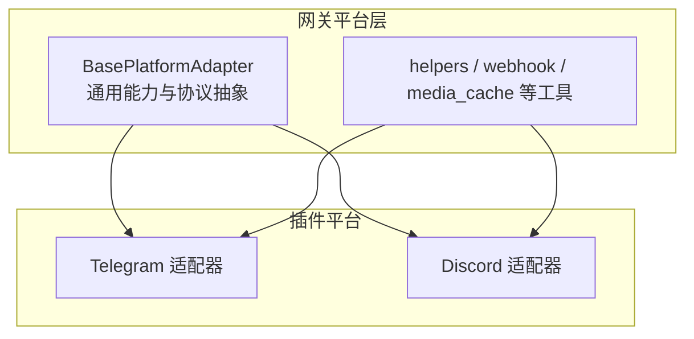
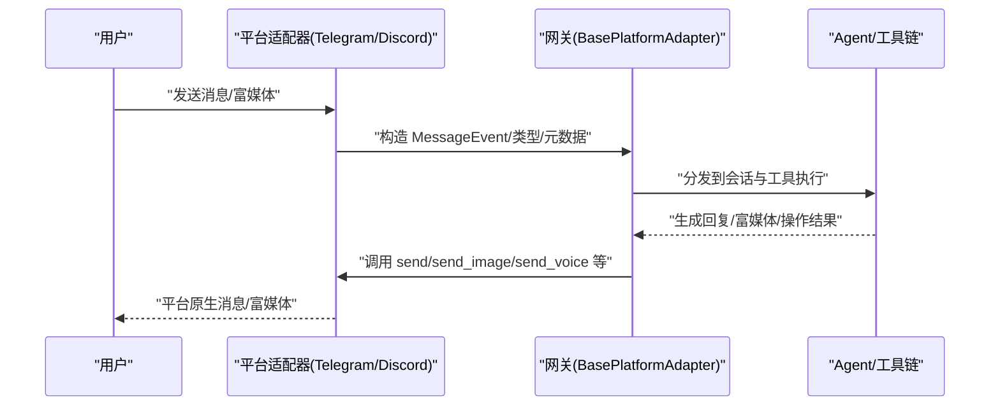
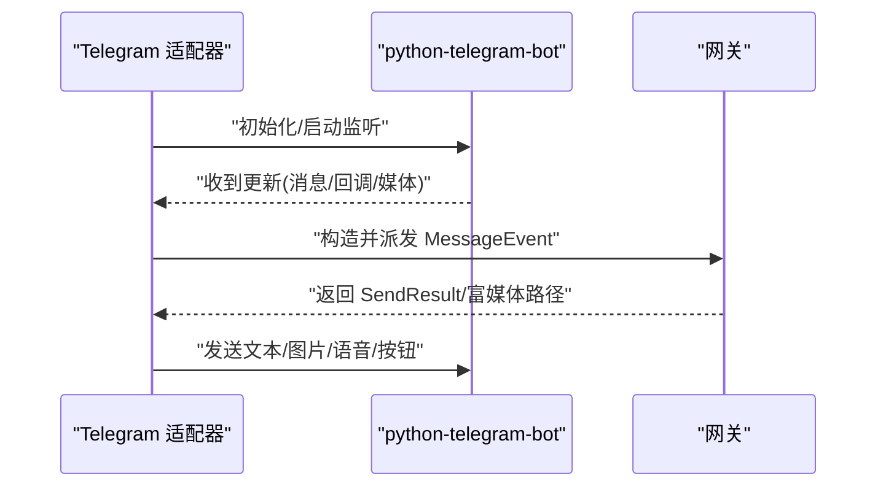
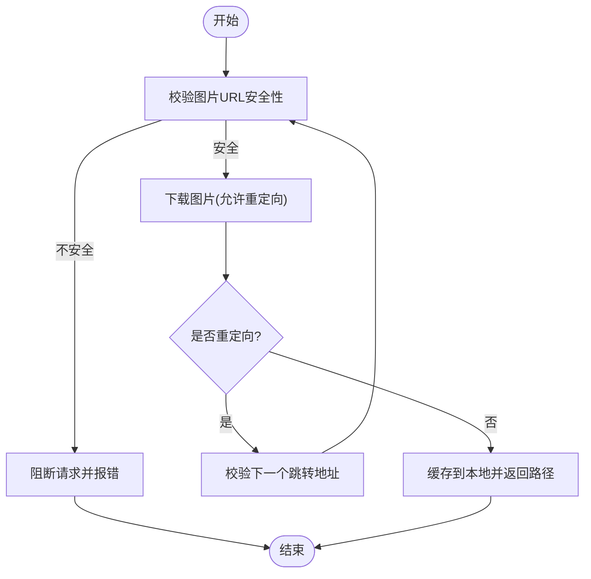
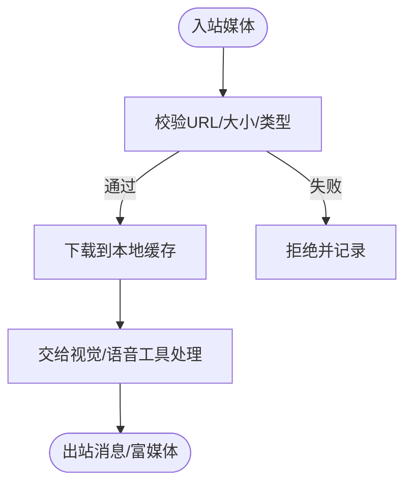
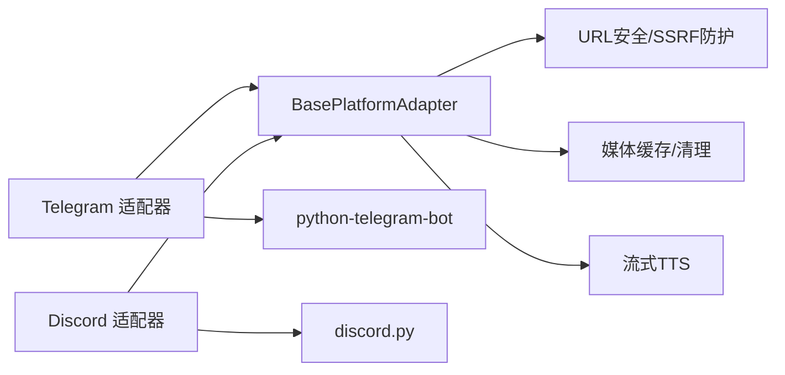

# 平台适配器开发

<cite>
**本文引用的文件**
- [gateway/platforms/base.py](file://gateway/platforms/base.py)
- [gateway/platforms/ADDING_A_PLATFORM.md](file://gateway/platforms/ADDING_A_PLATFORM.md)
- [plugins/platforms/telegram/adapter.py](file://plugins/platforms/telegram/adapter.py)
- [plugins/platforms/discord/adapter.py](file://plugins/platforms/discord/adapter.py)
</cite>

## 目录
1. [简介](#简介)
2. [项目结构](#项目结构)
3. [核心组件](#核心组件)
4. [架构总览](#架构总览)
5. [详细组件分析](#详细组件分析)
6. [依赖关系分析](#依赖关系分析)
7. [性能考量](#性能考量)
8. [故障排查指南](#故障排查指南)
9. [结论](#结论)
10. [附录](#附录)

## 简介
本指南面向希望为消息网关新增或扩展“平台适配器”的开发者。内容涵盖：
- 平台适配器的整体架构与基类职责（BasePlatformAdapter）
- 消息传输协议与事件模型
- WebSocket/长连接管理、消息格式转换与事件处理机制
- 认证、错误处理与重试逻辑
- 文本、图片、音频、视频及富媒体内容的统一处理流程
- 与网关服务的集成点与配置项
- 以 Telegram、Discord 为例的完整实现参考与最佳实践

## 项目结构
- 内置平台适配层位于 gateway/platforms，提供通用能力与基类
- 插件化平台适配位于 plugins/platforms，可按需独立扩展
- 新增平台既可通过插件路径快速接入，也可作为内置平台集成到核心

**图示来源**
- [gateway/platforms/base.py:1-120](file://gateway/platforms/base.py#L1-L120)
- [plugins/platforms/telegram/adapter.py:1-60](file://plugins/platforms/telegram/adapter.py#L1-L60)
- [plugins/platforms/discord/adapter.py:1-60](file://plugins/platforms/discord/adapter.py#L1-L60)

**章节来源**
- [gateway/platforms/ADDING_A_PLATFORM.md:1-75](file://gateway/platforms/ADDING_A_PLATFORM.md#L1-L75)

## 核心组件
- BasePlatformAdapter：定义所有平台适配器必须实现的接口与默认行为，包括连接生命周期、消息收发、富媒体缓存、流式TTS、代理与网络限制、UTF-16长度限制等
- 消息事件模型：MessageEvent、MessageType、SendResult 等用于统一入站/出站消息语义
- 媒体缓存：图片/音频/文档的统一下载、校验、缓存与清理，防止内存溢出与SSRF风险
- 流式TTS：StreamingTTSHandle/AudioFormat，支持按块写入与中止控制
- 代理与安全：代理解析、NO_PROXY匹配、重定向SSRF防护、URL安全校验

**章节来源**
- [gateway/platforms/base.py:1-120](file://gateway/platforms/base.py#L1-L120)
- [gateway/platforms/base.py:570-640](file://gateway/platforms/base.py#L570-L640)
- [gateway/platforms/base.py:682-780](file://gateway/platforms/base.py#L682-L780)
- [gateway/platforms/base.py:813-927](file://gateway/platforms/base.py#L813-L927)
- [gateway/platforms/base.py:966-1000](file://gateway/platforms/base.py#L966-L1000)

## 架构总览
平台适配器通过继承 BasePlatformAdapter，实现各平台的连接、鉴权、消息收发与事件处理。网关侧负责调度、路由、会话上下文与状态管理；适配器聚焦于平台协议细节。

**图示来源**
- [gateway/platforms/base.py:1-120](file://gateway/platforms/base.py#L1-L120)
- [plugins/platforms/telegram/adapter.py:1-60](file://plugins/platforms/telegram/adapter.py#L1-L60)
- [plugins/platforms/discord/adapter.py:1-60](file://plugins/platforms/discord/adapter.py#L1-L60)

## 详细组件分析

### BasePlatformAdapter 与消息协议
- 职责边界
  - 统一消息事件模型：MessageEvent、MessageType、SendResult
  - 统一富媒体处理：图片/音频/文档的下载、校验、缓存、清理
  - 统一网络与安全：代理解析、NO_PROXY、重定向SSRF防护、URL白名单
  - 统一文本限制：UTF-16长度计算与截断策略
  - 统一流式TTS：begin_streaming_tts/write_streaming_tts/abort_streaming_tts
- 关键能力
  - 入站媒体大小限制与保护：防止OOM
  - 图片/音频缓存：本地持久化，供视觉/语音工具使用
  - 代理与系统代理自动发现：兼容SOCKS/HTTP/HTTPS
  - 线程/任务超时与诊断：避免事件循环阻塞导致挂起

**章节来源**
- [gateway/platforms/base.py:1-120](file://gateway/platforms/base.py#L1-L120)
- [gateway/platforms/base.py:682-780](file://gateway/platforms/base.py#L682-L780)
- [gateway/platforms/base.py:813-927](file://gateway/platforms/base.py#L813-L927)
- [gateway/platforms/base.py:966-1000](file://gateway/platforms/base.py#L966-L1000)

### Telegram 适配器要点
- 基于 python-telegram-bot 实现接收/发送、媒体与命令处理
- 具备完善的初始化超时与死锁诊断：当事件循环被同步调用阻塞时，输出线程堆栈辅助定位
- 敏感信息脱敏：错误日志中自动屏蔽令牌等敏感字段
- 典型工作流：连接建立→轮询/长连接→事件解析→构造 MessageEvent→网关分发→回复发送

**图示来源**
- [plugins/platforms/telegram/adapter.py:1-60](file://plugins/platforms/telegram/adapter.py#L1-L60)
- [plugins/platforms/telegram/adapter.py:68-197](file://plugins/platforms/telegram/adapter.py#L68-L197)

**章节来源**
- [plugins/platforms/telegram/adapter.py:1-60](file://plugins/platforms/telegram/adapter.py#L1-L60)
- [plugins/platforms/telegram/adapter.py:68-197](file://plugins/platforms/telegram/adapter.py#L68-L197)

### Discord 适配器要点
- 基于 discord.py 实现服务器/DM消息、线程与频道管理
- Markdown链接渲染优化：避免标签被误识别为URL预览
- 非对话消息历史过滤：避免状态提示污染会话历史
- 图片下载重定向守卫：逐跳校验目标URL安全性，防止SSRF

**图示来源**
- [plugins/platforms/discord/adapter.py:171-200](file://plugins/platforms/discord/adapter.py#L171-L200)

**章节来源**
- [plugins/platforms/discord/adapter.py:1-60](file://plugins/platforms/discord/adapter.py#L1-L60)
- [plugins/platforms/discord/adapter.py:171-200](file://plugins/platforms/discord/adapter.py#L171-L200)

### 富媒体处理流程（文本/图片/音频/视频/富媒体）
- 入站媒体
  - 下载/读取：带超时与限流，严格校验Content-Length与累计字节数
  - 安全校验：URL白名单、重定向SSRF防护
  - 容量限制：可配置的入站媒体上限，超限即拒绝
  - 缓存落盘：图片/音频分别进入对应缓存目录，供后续工具消费
- 出站媒体
  - 根据平台能力选择发送方式（如Telegram的sendAudio/sendVoice/文档）
  - 自动TTS输出路径选择：按平台要求选择ogg/mp3容器
  - 流式TTS：按块写入PCM，支持中止与回退策略

**图示来源**
- [gateway/platforms/base.py:682-780](file://gateway/platforms/base.py#L682-L780)
- [gateway/platforms/base.py:813-927](file://gateway/platforms/base.py#L813-L927)
- [gateway/platforms/base.py:966-1000](file://gateway/platforms/base.py#L966-L1000)

**章节来源**
- [gateway/platforms/base.py:682-780](file://gateway/platforms/base.py#L682-L780)
- [gateway/platforms/base.py:813-927](file://gateway/platforms/base.py#L813-L927)
- [gateway/platforms/base.py:966-1000](file://gateway/platforms/base.py#L966-L1000)

### 认证、错误处理与重试
- 认证
  - 平台令牌/密钥从环境变量注入，适配器在初始化阶段读取并建立连接
  - 授权映射与白名单：通过网关配置控制哪些用户/渠道可用
- 错误处理
  - 敏感信息脱敏：错误日志自动屏蔽令牌、手机号等
  - 超时与死锁诊断：对初始化/连接过程设置墙钟级超时，必要时转储线程堆栈
- 重试
  - 媒体下载：指数退避重试（超时、429、5xx）
  - 连接恢复：长连接断开后按退避+抖动策略重连

**章节来源**
- [plugins/platforms/telegram/adapter.py:28-66](file://plugins/platforms/telegram/adapter.py#L28-L66)
- [plugins/platforms/telegram/adapter.py:68-197](file://plugins/platforms/telegram/adapter.py#L68-L197)
- [gateway/platforms/base.py:866-927](file://gateway/platforms/base.py#L866-L927)

### 与网关服务的集成与配置
- 插件路径（推荐）：零侵入核心代码，通过 plugin.yaml + adapter.py 注册
- 内置路径（核心贡献者）：需在多处注册枚举、工厂、授权映射、工具集、定时任务等
- 关键集成点
  - Platform 枚举与环境变量加载
  - 适配器工厂创建与依赖检查
  - 会话源 SessionSource 扩展（如需额外身份字段）
  - 系统提示词提示（PLATFORM_HINTS）
  - 工具集与发送消息工具路由
  - 通道目录、状态显示、CLI向导、日志脱敏、测试覆盖

**章节来源**
- [gateway/platforms/ADDING_A_PLATFORM.md:1-75](file://gateway/platforms/ADDING_A_PLATFORM.md#L1-L75)
- [gateway/platforms/ADDING_A_PLATFORM.md:78-145](file://gateway/platforms/ADDING_A_PLATFORM.md#L78-L145)
- [gateway/platforms/ADDING_A_PLATFORM.md:148-389](file://gateway/platforms/ADDING_A_PLATFORM.md#L148-L389)

## 依赖关系分析
- 适配器对基类的依赖：统一协议、媒体、网络与安全能力
- 平台SDK依赖：Telegram 使用 python-telegram-bot；Discord 使用 discord.py
- 工具链依赖：URL安全、音频容器探测、TTS工具、视觉/语音工具
- 配置与运行时：环境变量、配置文件、CLI向导、状态展示

**图示来源**
- [gateway/platforms/base.py:1-120](file://gateway/platforms/base.py#L1-L120)
- [plugins/platforms/telegram/adapter.py:1-60](file://plugins/platforms/telegram/adapter.py#L1-L60)
- [plugins/platforms/discord/adapter.py:1-60](file://plugins/platforms/discord/adapter.py#L1-L60)

**章节来源**
- [gateway/platforms/base.py:1-120](file://gateway/platforms/base.py#L1-L120)
- [plugins/platforms/telegram/adapter.py:1-60](file://plugins/platforms/telegram/adapter.py#L1-L60)
- [plugins/platforms/discord/adapter.py:1-60](file://plugins/platforms/discord/adapter.py#L1-L60)

## 性能考量
- 入站媒体大小限制：防止单条超大消息导致内存飙升
- 流式读取与分块校验：边读边检，避免一次性加载大文件
- 并发与限流：媒体下载与缓存写入限制并发度，避免争用
- UTF-16长度限制：针对平台消息长度限制进行精确截断
- 代理与DNS：SOCKS代理启用远程DNS解析，绕过污染

**章节来源**
- [gateway/platforms/base.py:722-780](file://gateway/platforms/base.py#L722-L780)
- [gateway/platforms/base.py:866-927](file://gateway/platforms/base.py#L866-L927)
- [gateway/platforms/base.py:451-517](file://gateway/platforms/base.py#L451-L517)

## 故障排查指南
- 事件循环阻塞
  - 现象：初始化或连接长时间无输出，卡在重试次数
  - 诊断：查看线程堆栈输出，定位同步阻塞调用
- 媒体下载失败
  - 现象：图片/音频无法缓存
  - 排查：检查URL安全、重定向、Content-Length与实际大小、代理配置
- 消息过长
  - 现象：平台拒绝超长消息
  - 排查：确认UTF-16长度计算与截断策略是否符合平台限制
- 认证失败
  - 现象：无法连接平台服务
  - 排查：检查令牌、权限、白名单、代理与网络可达性

**章节来源**
- [plugins/platforms/telegram/adapter.py:68-197](file://plugins/platforms/telegram/adapter.py#L68-L197)
- [gateway/platforms/base.py:866-927](file://gateway/platforms/base.py#L866-L927)
- [gateway/platforms/base.py:202-253](file://gateway/platforms/base.py#L202-L253)

## 结论
通过统一的 BasePlatformAdapter 与插件化架构，平台适配器开发可以聚焦于平台协议差异与用户体验增强。结合严格的媒体安全与容量限制、完善的错误处理与重试机制，以及清晰的集成清单，能够快速、稳定地接入新的消息平台。

## 附录
- 新增平台快速清单
  - 编写适配器（继承基类，实现必需方法）
  - 注册枚举与环境变量加载
  - 添加工厂与授权映射
  - 扩展会话源（如需）
  - 补充系统提示词与工具集
  - 接入定时任务与发送消息工具
  - 完善状态显示、CLI向导、日志脱敏与测试
- 参考实现
  - Telegram：长连接/轮询、超时与死锁诊断、敏感信息脱敏
  - Discord：Markdown链接渲染、非对话消息历史过滤、图片重定向SSRF防护

**章节来源**
- [gateway/platforms/ADDING_A_PLATFORM.md:78-389](file://gateway/platforms/ADDING_A_PLATFORM.md#L78-L389)
- [plugins/platforms/telegram/adapter.py:1-60](file://plugins/platforms/telegram/adapter.py#L1-L60)
- [plugins/platforms/discord/adapter.py:1-60](file://plugins/platforms/discord/adapter.py#L1-L60)