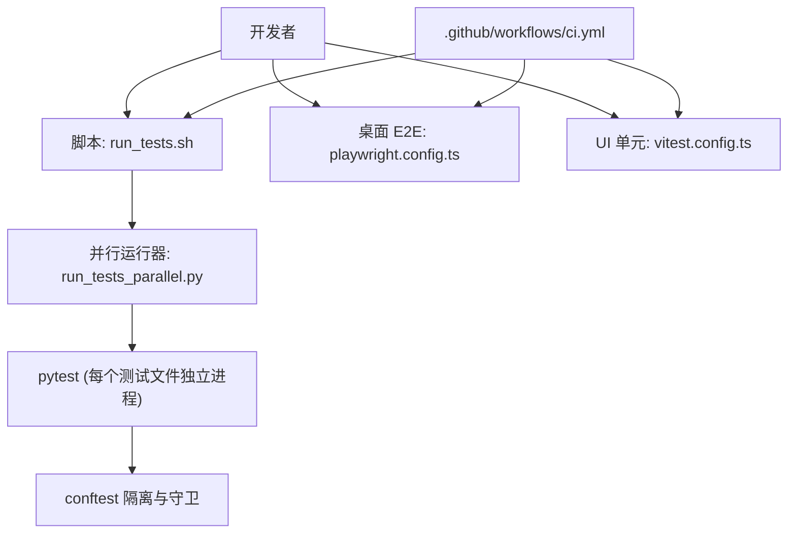
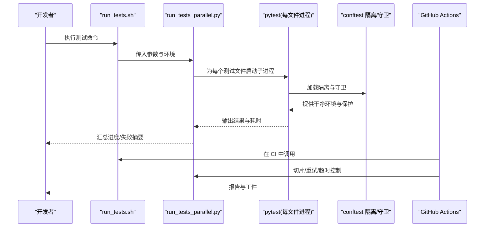
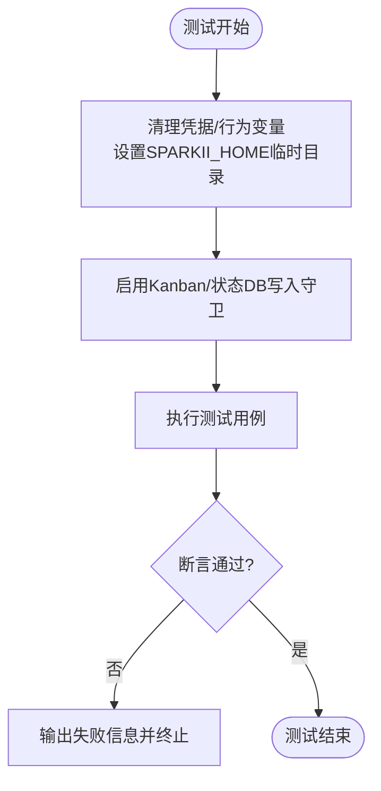
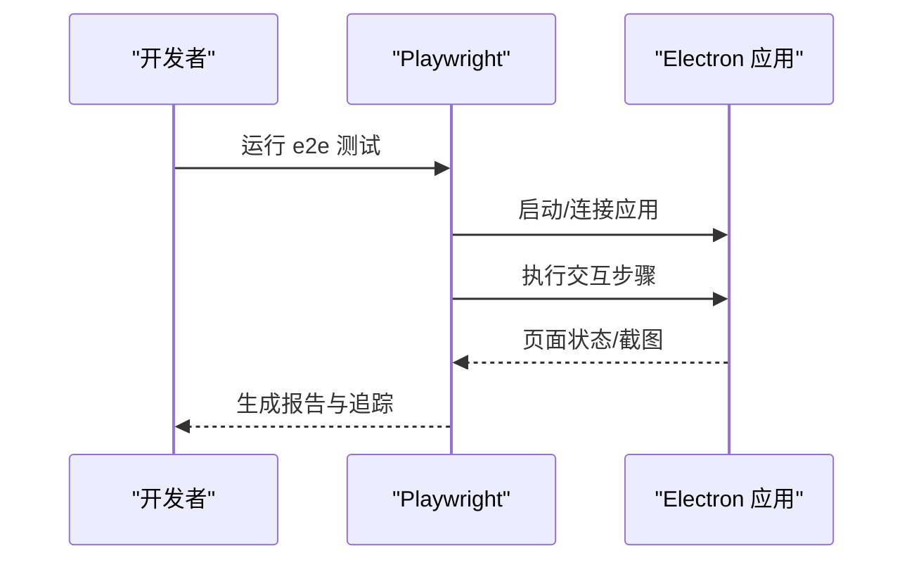
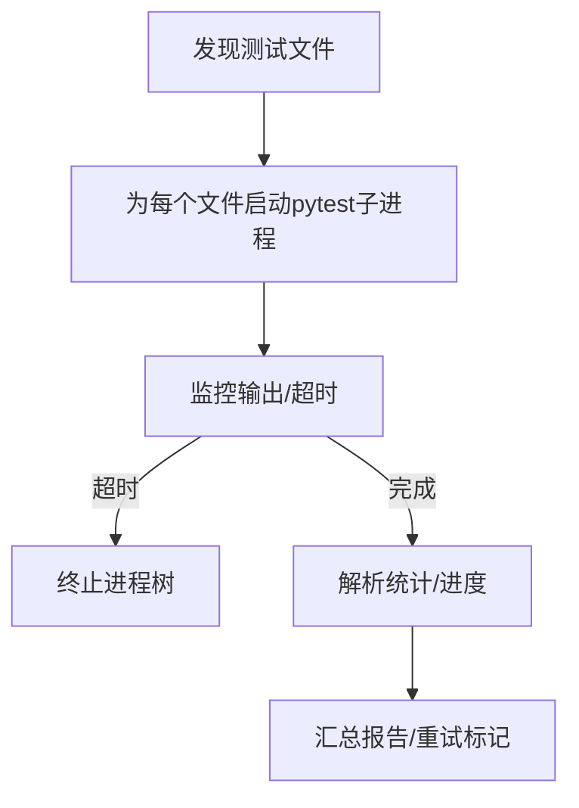
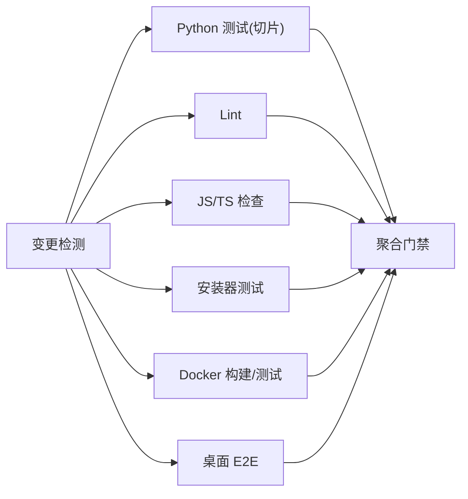
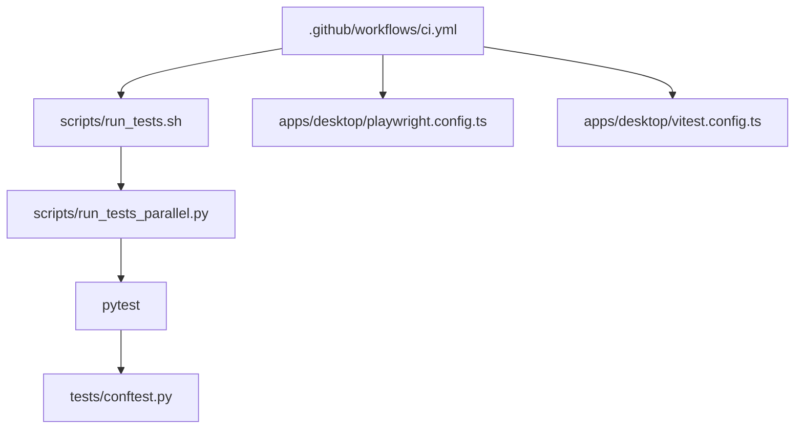

# 测试与调试

<cite>
**本文引用的文件**
- [tests/conftest.py](file://tests/conftest.py)
- [scripts/run_tests.sh](file://scripts/run_tests.sh)
- [scripts/run_tests_parallel.py](file://scripts/run_tests_parallel.py)
- [apps/desktop/playwright.config.ts](file://apps/desktop/playwright.config.ts)
- [apps/desktop/vitest.config.ts](file://apps/desktop/vitest.config.ts)
- [.github/workflows/ci.yml](file://.github/workflows/ci.yml)
</cite>

## 目录
1. [简介](#简介)
2. [项目结构](#项目结构)
3. [核心组件](#核心组件)
4. [架构总览](#架构总览)
5. [详细组件分析](#详细组件分析)
6. [依赖关系分析](#依赖关系分析)
7. [性能考量](#性能考量)
8. [故障排查指南](#故障排查指南)
9. [结论](#结论)
10. [附录](#附录)

## 简介
本指南面向开发与测试工程师，系统化说明本项目中单元测试、集成测试与端到端（E2E）的编写方法、最佳实践与环境搭建；覆盖 Mock 框架使用、测试数据准备、自动化流水线与持续集成、覆盖率统计思路、调试工具与日志分析、性能分析与压力/负载/稳定性测试策略，并提供可复用的工作流与示例路径。

## 项目结构
仓库采用多语言、多子项目的分层组织：
- Python 侧：以 pytest 为核心，提供统一的测试运行器与隔离环境，确保本地与 CI 行为一致。
- 桌面应用侧：前端 UI 使用 Vitest + jsdom 进行单元/组件测试；Electron 原生逻辑使用 Node 环境测试；E2E 使用 Playwright 驱动真实 Electron 进程并支持截图比对与追踪。
- CI 侧：通过 GitHub Actions 编排检测变更、并行执行 Python 测试、JS/TS 检查、安装器测试、Docker 构建与 E2E 等任务，并在 PR 上生成汇总报告。

**图表来源**
- [scripts/run_tests.sh:1-184](file://scripts/run_tests.sh#L1-L184)
- [scripts/run_tests_parallel.py:1-120](file://scripts/run_tests_parallel.py#L1-L120)
- [tests/conftest.py:1-120](file://tests/conftest.py#L1-L120)
- [apps/desktop/playwright.config.ts:1-64](file://apps/desktop/playwright.config.ts#L1-L64)
- [apps/desktop/vitest.config.ts:1-32](file://apps/desktop/vitest.config.ts#L1-L32)
- [.github/workflows/ci.yml:69-114](file://.github/workflows/ci.yml#L69-L114)

**章节来源**
- [scripts/run_tests.sh:1-184](file://scripts/run_tests.sh#L1-L184)
- [scripts/run_tests_parallel.py:1-120](file://scripts/run_tests_parallel.py#L1-L120)
- [tests/conftest.py:1-120](file://tests/conftest.py#L1-L120)
- [apps/desktop/playwright.config.ts:1-64](file://apps/desktop/playwright.config.ts#L1-L64)
- [apps/desktop/vitest.config.ts:1-32](file://apps/desktop/vitest.config.ts#L1-L32)
- [.github/workflows/ci.yml:69-114](file://.github/workflows/ci.yml#L69-L114)

## 核心组件
- 统一测试入口与隔离环境
  - 通过脚本在干净环境中启动并行测试，强制 TZ/LANG/HASHSEED 等确定性设置，屏蔽凭据类环境变量，并将 SPARKII_HOME 重定向到临时目录，避免污染用户真实配置。
- 每文件进程隔离
  - 自定义并行器为每个测试文件启动独立的 pytest 子进程，避免跨文件模块级状态泄漏；对超时文件自动终止整个进程树，防止僵尸进程。
- 安全守卫
  - 针对 Kanban 与主状态数据库写入进行“拒绝列表”保护，阻止测试误写生产路径；同时禁用浏览器打开、macOS Keychain 读取等副作用。
- 桌面端 E2E 与 UI 测试
  - Playwright 配置启用截图、追踪、视觉回归阈值与动画禁用；Vitest 配置区分 jsdom（UI）与 node（Electron）两类测试项目。
- CI 编排
  - 根据变更检测触发相应任务，聚合结果并生成时序报告；E2E 任务按条件启用或暂时禁用。

**章节来源**
- [tests/conftest.py:120-525](file://tests/conftest.py#L120-L525)
- [tests/conftest.py:586-718](file://tests/conftest.py#L586-L718)
- [scripts/run_tests.sh:102-184](file://scripts/run_tests.sh#L102-L184)
- [scripts/run_tests_parallel.py:210-410](file://scripts/run_tests_parallel.py#L210-L410)
- [apps/desktop/playwright.config.ts:1-64](file://apps/desktop/playwright.config.ts#L1-L64)
- [apps/desktop/vitest.config.ts:1-32](file://apps/desktop/vitest.config.ts#L1-L32)
- [.github/workflows/ci.yml:69-114](file://.github/workflows/ci.yml#L69-L114)

## 架构总览
下图展示从开发者到 CI 的完整测试与调试链路：

**图表来源**
- [scripts/run_tests.sh:152-184](file://scripts/run_tests.sh#L152-L184)
- [scripts/run_tests_parallel.py:268-410](file://scripts/run_tests_parallel.py#L268-L410)
- [tests/conftest.py:429-525](file://tests/conftest.py#L429-L525)
- [.github/workflows/ci.yml:69-114](file://.github/workflows/ci.yml#L69-L114)

## 详细组件分析

### 单元测试（Python）
- 目标与范围
  - 覆盖 CLI、Gateway、Agent、Tools、Cron、Plugins 等模块；每个测试文件在独立进程中运行，避免共享状态污染。
- 环境隔离要点
  - 清理凭据类环境变量；将 SPARKII_HOME 指向临时目录；固定时区、语言与哈希种子；禁用 AWS IMDS、Tirith 安装、懒依赖安装等网络/副作用路径。
- 安全守卫
  - 拦截对真实 Kanban DB 与主状态 DB 的写入；记录浏览器打开尝试；屏蔽 macOS Keychain 读取。
- 推荐实践
  - 使用 fixture 注入最小必要依赖；避免在测试中引入真实外部服务；必要时用 monkeypatch 替换模块属性。

**图表来源**
- [tests/conftest.py:429-525](file://tests/conftest.py#L429-L525)
- [tests/conftest.py:586-718](file://tests/conftest.py#L586-L718)

**章节来源**
- [tests/conftest.py:120-525](file://tests/conftest.py#L120-L525)
- [tests/conftest.py:586-718](file://tests/conftest.py#L586-L718)

### 集成测试（Python）
- 定位与策略
  - 位于 tests/integration（默认被并行器跳过），用于需要真实网关/Docker 镜像的场景；由专用 CI 作业单独执行，避免阻塞常规矩阵。
- 数据与环境
  - 通过 fixtures 管理 Docker 镜像复用；使用 SPARKII_TEST_IMAGE 指定已构建镜像以避免重复构建。
- 建议
  - 将对外部服务的交互封装为可替换接口；优先使用轻量容器或服务模拟；严格控制网络与磁盘 I/O。

**章节来源**
- [scripts/run_tests_parallel.py:56-75](file://scripts/run_tests_parallel.py#L56-L75)
- [scripts/run_tests.sh:126-150](file://scripts/run_tests.sh#L126-L150)

### 端到端测试（桌面应用）
- 技术栈
  - Playwright 驱动 Electron 应用，开启截图、追踪与视觉回归比较；超时较长以容纳冷启动；关闭动画以减少不稳定因素。
- 基线与对比
  - 在主分支更新基线快照；PR 中恢复缓存基线并进行像素级对比，差异作为工件供人工审查。
- 建议
  - 使用稳定的选择器与等待策略；避免基于时间的硬等待；利用追踪回放定位 UI 问题。

**图表来源**
- [apps/desktop/playwright.config.ts:1-64](file://apps/desktop/playwright.config.ts#L1-L64)

**章节来源**
- [apps/desktop/playwright.config.ts:1-64](file://apps/desktop/playwright.config.ts#L1-L64)

### UI 单元与 Electron 原生测试
- 技术栈
  - Vitest 双项目：jsdom 环境用于 React UI 组件测试；node 环境用于 Electron 原生逻辑测试。
- 配置要点
  - 为 jsdom 项目设置 setupFiles 与更长超时；electron 项目包含 electron 与 scripts 下的测试。
- 建议
  - 组件测试聚焦渲染与交互契约；Electron 测试关注进程间通信、平台 API 适配。

**章节来源**
- [apps/desktop/vitest.config.ts:1-32](file://apps/desktop/vitest.config.ts#L1-L32)

### 并行测试运行器与流程
- 设计目标
  - 替代 xdist，以“每文件一进程”的方式彻底消除跨文件状态泄漏；提供超时、重试、切片与进度显示。
- 关键机制
  - 发现 test_*.py 文件，排除 integration/e2e/docker（除非显式指定）；为每个文件启动 pytest 子进程；捕获 pgid 并在超时时杀死整个进程树；解析 pytest 输出统计通过率。
- 切片与重试
  - 基于历史耗时 LPT 分配切片，平衡 CI 时间；失败文件自动重试一次并标记为 FLAKY。

**图表来源**
- [scripts/run_tests_parallel.py:163-207](file://scripts/run_tests_parallel.py#L163-L207)
- [scripts/run_tests_parallel.py:210-410](file://scripts/run_tests_parallel.py#L210-L410)
- [scripts/run_tests_parallel.py:565-685](file://scripts/run_tests_parallel.py#L565-L685)

**章节来源**
- [scripts/run_tests_parallel.py:1-120](file://scripts/run_tests_parallel.py#L1-L120)
- [scripts/run_tests_parallel.py:210-410](file://scripts/run_tests_parallel.py#L210-L410)
- [scripts/run_tests_parallel.py:565-685](file://scripts/run_tests_parallel.py#L565-L685)

### 持续集成与流水线
- 编排
  - 先检测变更，再并行触发 Python 测试、Lint、JS/TS 检查、安装器测试、Docker 构建与 E2E；最终聚合结果并通过单一检查门控分支保护。
- 特性
  - 支持切片化 Python 测试；收集 CI 耗时并生成 HTML 报告；PR 评论实时汇总状态。
- 建议
  - 将慢任务拆分至独立作业；缓存依赖与镜像；对 flaky 测试进行重试与告警。

**图表来源**
- [.github/workflows/ci.yml:33-114](file://.github/workflows/ci.yml#L33-L114)
- [.github/workflows/ci.yml:242-291](file://.github/workflows/ci.yml#L242-L291)
- [.github/workflows/ci.yml:303-391](file://.github/workflows/ci.yml#L303-L391)

**章节来源**
- [.github/workflows/ci.yml:33-114](file://.github/workflows/ci.yml#L33-L114)
- [.github/workflows/ci.yml:242-291](file://.github/workflows/ci.yml#L242-L291)
- [.github/workflows/ci.yml:303-391](file://.github/workflows/ci.yml#L303-L391)

## 依赖关系分析
- 耦合与内聚
  - conftest 集中处理环境隔离与安全守卫，降低各测试文件的耦合度；并行器与脚本解耦，便于扩展切片与重试策略。
- 直接/间接依赖
  - run_tests.sh 依赖 run_tests_parallel.py；后者依赖 pytest；conftest 被 pytest 自动加载；CI 通过 workflow 调用上述脚本。
- 外部依赖
  - Playwright/Electron、Docker、GitHub Actions；通过环境变量与工件传递配置与结果。

**图表来源**
- [.github/workflows/ci.yml:69-114](file://.github/workflows/ci.yml#L69-L114)
- [scripts/run_tests.sh:152-184](file://scripts/run_tests.sh#L152-L184)
- [scripts/run_tests_parallel.py:268-410](file://scripts/run_tests_parallel.py#L268-L410)
- [tests/conftest.py:429-525](file://tests/conftest.py#L429-L525)
- [apps/desktop/playwright.config.ts:1-64](file://apps/desktop/playwright.config.ts#L1-L64)
- [apps/desktop/vitest.config.ts:1-32](file://apps/desktop/vitest.config.ts#L1-L32)

**章节来源**
- [scripts/run_tests.sh:152-184](file://scripts/run_tests.sh#L152-L184)
- [scripts/run_tests_parallel.py:268-410](file://scripts/run_tests_parallel.py#L268-L410)
- [tests/conftest.py:429-525](file://tests/conftest.py#L429-L525)
- [apps/desktop/playwright.config.ts:1-64](file://apps/desktop/playwright.config.ts#L1-L64)
- [apps/desktop/vitest.config.ts:1-32](file://apps/desktop/vitest.config.ts#L1-L32)
- [.github/workflows/ci.yml:69-114](file://.github/workflows/ci.yml#L69-L114)

## 性能考量
- 并行与切片
  - 使用并行器按 CPU 并发执行；结合历史耗时进行 LPT 切片，均衡 CI 时间；对大文件设置合理超时，避免假死。
- 字节码预编译
  - 在脚本中预先编译 .pyc，减少子进程首次导入开销。
- 资源限制
  - 禁用懒安装与网络探测，避免测试挂起；对 Docker 构建使用缓存镜像。
- 可视化与追踪
  - E2E 启用截图与追踪，快速定位 UI 卡顿与异步问题。

[本节为通用指导，不直接分析具体文件]

## 故障排查指南
- 常见问题定位
  - 凭据泄漏：确认 conftest 是否清理了敏感环境变量；检查是否有未匹配的命名模式。
  - 写入生产路径：确认 Kanban/状态 DB 守卫是否生效；若绕过需显式标记。
  - 进程泄漏：检查并行器是否在超时后正确终止进程树。
  - 浏览器弹窗：确认 webbrowser 已被记录而非实际打开。
- 调试技巧
  - 使用 Playwright 追踪回放定位 UI 问题；查看 CI 时序报告识别慢步骤。
  - 在本地缩小范围：仅运行单个文件或切片，配合 -v/--tb=long 获取详细堆栈。
- 错误修复建议
  - 将易变的外部依赖替换为 mock；将网络调用包装为可配置超时与重试；对 flaky 测试添加重试与明确的不稳定原因注释。

**章节来源**
- [tests/conftest.py:429-525](file://tests/conftest.py#L429-L525)
- [tests/conftest.py:586-718](file://tests/conftest.py#L586-L718)
- [scripts/run_tests_parallel.py:210-410](file://scripts/run_tests_parallel.py#L210-L410)
- [apps/desktop/playwright.config.ts:1-64](file://apps/desktop/playwright.config.ts#L1-L64)
- [.github/workflows/ci.yml:303-391](file://.github/workflows/ci.yml#L303-L391)

## 结论
本项目通过严格的测试环境隔离、安全的写入守卫、高效的并行运行器与完善的 CI 编排，构建了高可靠、可维护的测试体系。遵循本指南的实践，可在保证质量的同时提升开发效率与问题定位速度。

## 附录
- 常用命令参考
  - 运行全部 Python 测试：参见脚本入口与用法说明。
  - 运行单文件/切片：通过并行器参数指定路径或切片。
  - 桌面 E2E：使用 Playwright 配置运行并生成报告。
  - UI 单元：使用 Vitest 配置运行 jsdom 与 electron 项目。
- 覆盖率统计建议
  - Python：可使用 pytest-cov 收集覆盖率并与 CI 报告集成。
  - JS/TS：可使用 Vitest 内置覆盖率或接入 istanbul 插件。
- 压力/负载/稳定性测试
  - 使用并行器的高并发能力模拟负载；结合切片与超时控制评估稳定性；对 E2E 增加多次循环与随机化输入验证鲁棒性。

[本节为通用指导，不直接分析具体文件]