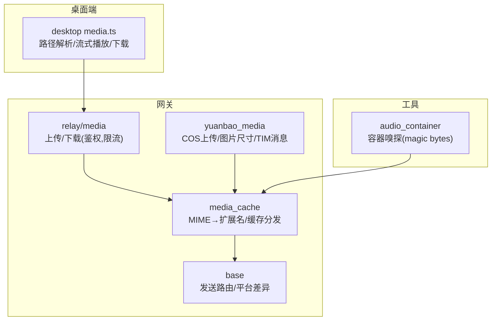
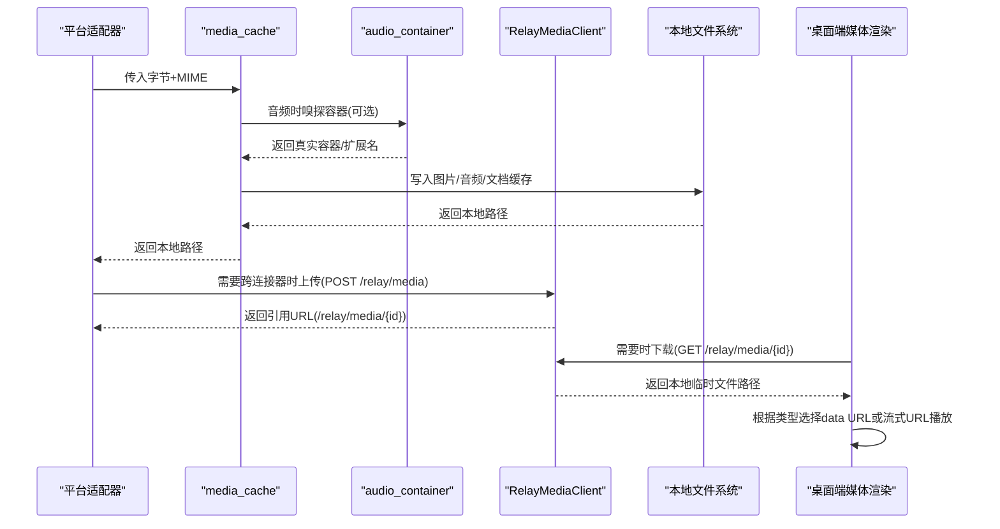
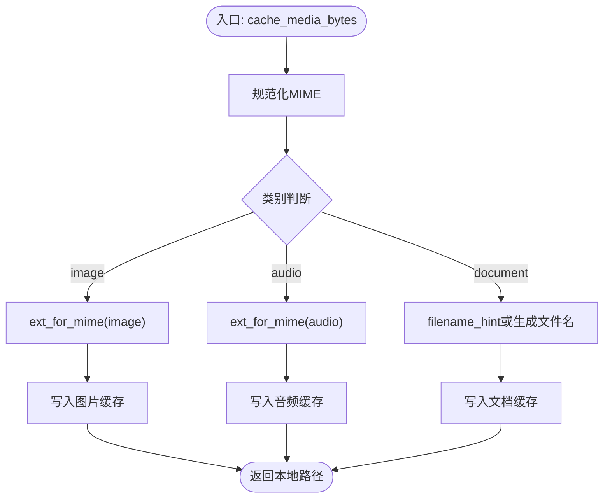
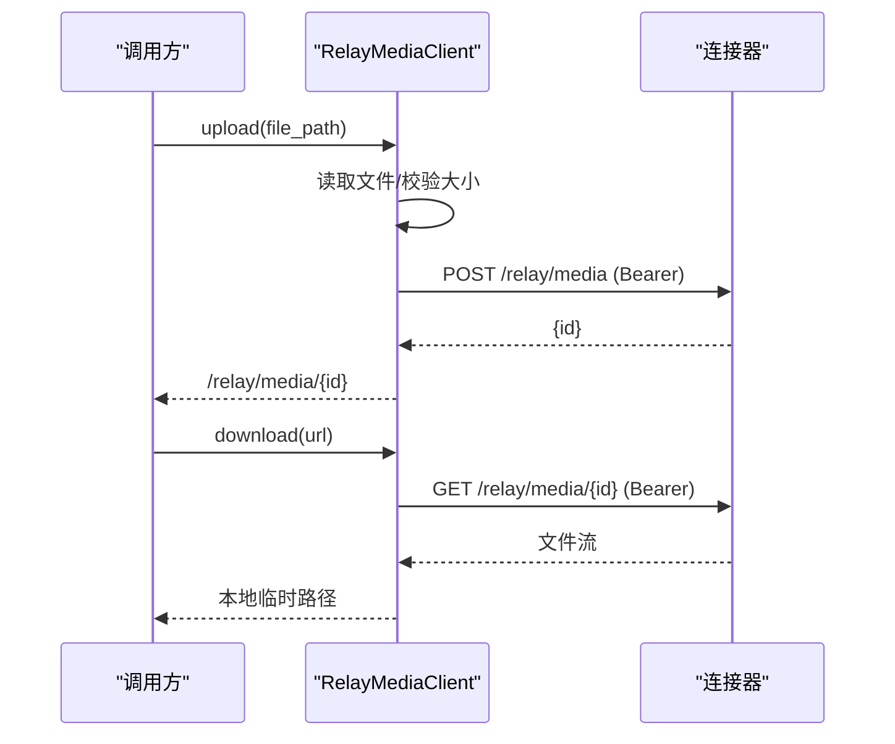
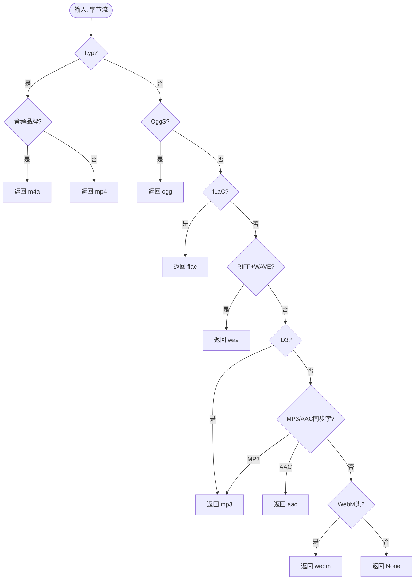
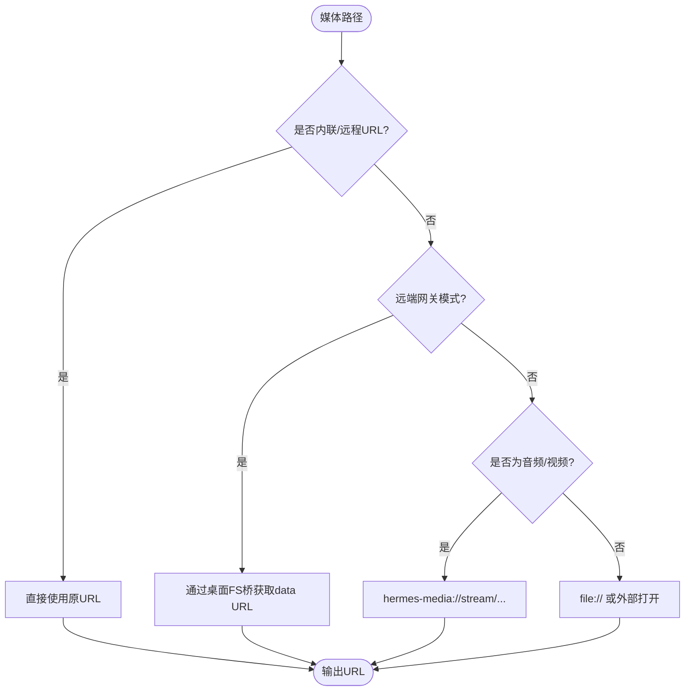
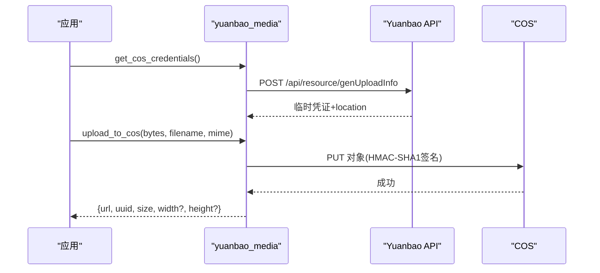
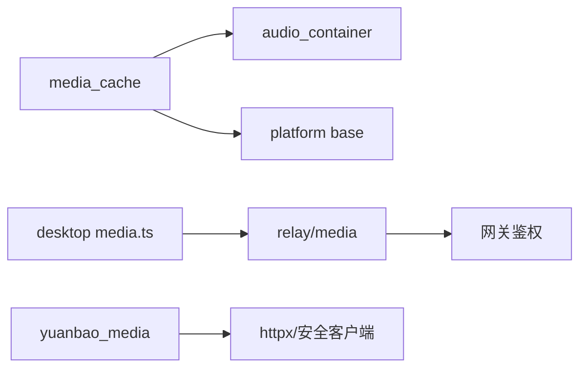

# 富媒体消息处理

<cite>
**本文引用的文件**
- [gateway/platforms/media_cache.py](file://gateway/platforms/media_cache.py)
- [gateway/relay/media.py](file://gateway/relay/media.py)
- [tools/audio_container.py](file://tools/audio_container.py)
- [apps/desktop/src/lib/media.ts](file://apps/desktop/src/lib/media.ts)
- [gateway/platforms/yuanbao_media.py](file://gateway/platforms/yuanbao_media.py)
- [gateway/platforms/base.py](file://gateway/platforms/base.py)
</cite>

## 目录
1. [简介](#简介)
2. [项目结构](#项目结构)
3. [核心组件](#核心组件)
4. [架构总览](#架构总览)
5. [详细组件分析](#详细组件分析)
6. [依赖关系分析](#依赖关系分析)
7. [性能考量](#性能考量)
8. [故障排除指南](#故障排除指南)
9. [结论](#结论)
10. [附录](#附录)

## 简介
本指南面向富媒体消息（图片、音频、视频等）的下载、缓存、传输与展示的全链路实现，覆盖以下主题：
- 媒体格式识别、转换与兼容性处理
- 文件大小限制、内存管理与磁盘缓存机制
- 预览生成、缩略图处理与格式压缩策略
- 去重、重试与错误恢复
- 性能优化技巧与常见问题排查

本仓库在网关层提供统一的媒体缓存分发与容器嗅探能力，在桌面端提供本地/远端媒体的解析与播放流式化方案，并提供跨连接器（Relay）的媒体上传/下载通道。

## 项目结构
围绕富媒体处理的关键模块分布如下：
- 网关平台层：统一 MIME→扩展名映射、按类型写入图片/音频/文档缓存；平台适配层的发送路由决策
- 中继层：网关与连接器之间的媒体平面（上传/下载），带鉴权与大小限制
- 工具层：基于魔数的音频/音视频容器嗅探，用于修复或推断真实容器类型
- 桌面端：本地/远端媒体路径解析、数据 URL 获取、流式播放地址构造与下载
- 平台集成示例：元宝平台的 COS 上传、图片尺寸解析、TIM 消息体构建

图表来源
- [gateway/platforms/media_cache.py:1-203](file://gateway/platforms/media_cache.py#L1-L203)
- [gateway/relay/media.py:1-206](file://gateway/relay/media.py#L1-L206)
- [tools/audio_container.py:1-98](file://tools/audio_container.py#L1-L98)
- [apps/desktop/src/lib/media.ts:1-195](file://apps/desktop/src/lib/media.ts#L1-L195)
- [gateway/platforms/yuanbao_media.py:1-666](file://gateway/platforms/yuanbao_media.py#L1-L666)

章节来源
- [gateway/platforms/media_cache.py:1-203](file://gateway/platforms/media_cache.py#L1-L203)
- [gateway/relay/media.py:1-206](file://gateway/relay/media.py#L1-L206)
- [tools/audio_container.py:1-98](file://tools/audio_container.py#L1-L98)
- [apps/desktop/src/lib/media.ts:1-195](file://apps/desktop/src/lib/media.ts#L1-L195)
- [gateway/platforms/yuanbao_media.py:1-666](file://gateway/platforms/yuanbao_media.py#L1-L666)
- [gateway/platforms/base.py:153-200](file://gateway/platforms/base.py#L153-L200)

## 核心组件
- 统一缓存分发器：根据 MIME 与平台覆盖表决定扩展名，并调用对应缓存写入（图片/音频/文档）
- 中继媒体客户端：对连接器进行受保护的上传/下载，内置大小限制与超时控制
- 容器嗅探器：通过魔数识别音频/音视频容器，修正扩展名以匹配下游 STT/播放器
- 桌面媒体解析：区分本地/远端模式，为图片/音频/视频选择合适的数据 URL 或流式 URL
- 平台集成：以元宝平台为例，演示 COS 临时凭证上传、图片尺寸解析与 TIM 消息体组装

章节来源
- [gateway/platforms/media_cache.py:1-203](file://gateway/platforms/media_cache.py#L1-L203)
- [gateway/relay/media.py:1-206](file://gateway/relay/media.py#L1-L206)
- [tools/audio_container.py:1-98](file://tools/audio_container.py#L1-L98)
- [apps/desktop/src/lib/media.ts:1-195](file://apps/desktop/src/lib/media.ts#L1-L195)
- [gateway/platforms/yuanbao_media.py:1-666](file://gateway/platforms/yuanbao_media.py#L1-L666)

## 架构总览
下图展示了从“入站媒体”到“本地缓存/中继上传”，再到“桌面展示/播放”的整体流程。

图表来源
- [gateway/platforms/media_cache.py:155-203](file://gateway/platforms/media_cache.py#L155-L203)
- [tools/audio_container.py:49-98](file://tools/audio_container.py#L49-L98)
- [gateway/relay/media.py:96-202](file://gateway/relay/media.py#L96-L202)
- [apps/desktop/src/lib/media.ts:69-127](file://apps/desktop/src/lib/media.ts#L69-L127)

## 详细组件分析

### 组件A：统一媒体缓存分发（MIME→扩展名→缓存写入）
- 职责
  - 维护默认 MIME→扩展名映射与反向映射，支持平台级覆盖
  - 将入站字节按 MIME 分类写入图片/音频/文档缓存
  - 为未知类型提供安全回退扩展名
- 关键点
  - 规范化 MIME（小写、去除参数）
  - 优先使用平台覆盖表，其次默认表，最后系统 mimetypes 猜测
  - 音频路径可结合容器嗅探确保扩展名与真实容器一致
- 复杂度
  - 查找 O(1)，I/O 取决于缓存实现
- 错误处理
  - 未知 MIME 时回退到 .jpg/.ogg/.bin，避免失败
- 优化建议
  - 复用默认映射表，减少重复计算
  - 对大文件分块写入，降低峰值内存

图表来源
- [gateway/platforms/media_cache.py:88-149](file://gateway/platforms/media_cache.py#L88-L149)
- [gateway/platforms/media_cache.py:155-203](file://gateway/platforms/media_cache.py#L155-L203)

章节来源
- [gateway/platforms/media_cache.py:1-203](file://gateway/platforms/media_cache.py#L1-L203)

### 组件B：中继媒体客户端（上传/下载）
- 职责
  - 向连接器上传本地文件，返回引用 URL
  - 下载连接器托管的媒体到本地临时文件
  - 鉴权：使用网关令牌作为 Bearer
  - 大小限制：防止超大文件占用带宽与存储
- 关键点
  - 上传前读取本地文件，校验大小与存在性
  - 下载时根据 Content-Disposition/Content-Type 推断扩展名
  - 超时与异常捕获，失败时返回 None，由上层降级
- 复杂度
  - I/O 为主，网络请求串行执行
- 错误处理
  - 网络异常、JSON 解析失败、OSError 均记录日志并返回 None
- 优化建议
  - 并发度可控（线程执行器），避免阻塞事件循环
  - 对大文件考虑分块上传/断点续传（当前为整块）

图表来源
- [gateway/relay/media.py:96-202](file://gateway/relay/media.py#L96-L202)

章节来源
- [gateway/relay/media.py:1-206](file://gateway/relay/media.py#L1-L206)

### 组件C：音频容器嗅探（magic bytes）
- 职责
  - 通过魔数识别音频/音视频容器（m4a/mp4/ogg/flac/wav/mp3/aac/webm）
  - 在音频上下文中将通用 MP4 容器映射为 .m4a，便于 STT/播放器识别
- 关键点
  - 区分 MP4 中音频品牌（m4a/m4b）与视频品牌
  - 区分 MP3 与 ADTS AAC（基于头部位字段）
- 复杂度
  - 仅读取前若干字节，时间复杂度 O(1)
- 错误处理
  - 无法识别时返回 None，由调用方决定回退策略
- 优化建议
  - 仅在必要时调用，避免对非音频数据做无谓嗅探

图表来源
- [tools/audio_container.py:49-98](file://tools/audio_container.py#L49-L98)

章节来源
- [tools/audio_container.py:1-98](file://tools/audio_container.py#L1-L98)

### 组件D：桌面端媒体解析与播放
- 职责
  - 根据路径/扩展名推断媒体类型与 MIME
  - 本地模式：直接 data URL 或 Electron 自定义协议流式播放
  - 远端模式：通过网关 API 获取数据 URL 或外部下载链接
- 关键点
  - 音频/视频优先使用流式 URL，避免 data URL 体积限制
  - 远端模式下通过认证 token 访问网关文件接口
- 复杂度
  - 字符串解析与条件分支，O(1)
- 错误处理
  - 无法解析时回退为普通文件类型
- 优化建议
  - 预取元数据（如图片宽高）以减少重绘
  - 对大媒体使用 Range 请求与流式播放

图表来源
- [apps/desktop/src/lib/media.ts:33-127](file://apps/desktop/src/lib/media.ts#L33-L127)

章节来源
- [apps/desktop/src/lib/media.ts:1-195](file://apps/desktop/src/lib/media.ts#L1-L195)

### 组件E：元宝平台媒体处理（COS 上传与消息体）
- 职责
  - 获取 COS 临时凭证并签名上传
  - 解析图片尺寸（无需第三方库）
  - 构建 TIM 图片/文件消息体
- 关键点
  - 下载阶段进行 SSRF 防护与重定向校验
  - 上传阶段使用 HMAC-SHA1 签名，支持加速域名
  - 图片上传后自动解析宽高，便于前端布局
- 复杂度
  - HTTP 请求为主，图片尺寸解析为 O(1)
- 错误处理
  - 接口状态码检查、必要字段缺失抛出运行时错误
- 优化建议
  - 对大图片先裁剪/压缩再上传
  - 合理设置超时与重试策略

图表来源
- [gateway/platforms/yuanbao_media.py:359-570](file://gateway/platforms/yuanbao_media.py#L359-L570)
- [gateway/platforms/yuanbao_media.py:121-197](file://gateway/platforms/yuanbao_media.py#L121-L197)

章节来源
- [gateway/platforms/yuanbao_media.py:1-666](file://gateway/platforms/yuanbao_media.py#L1-L666)

### 组件F：平台发送路由（音频 vs 文档）
- 职责
  - 根据平台与扩展名决定走“音频发送”还是“文档发送”
  - Telegram 特殊规则：语音用 Opus/OGG，附件用 MP3/M4A
- 关键点
  - 统一入口 should_send_media_as_audio 集中平台差异
- 复杂度
  - 常量查找与条件判断，O(1)
- 错误处理
  - 不支持的扩展名回退为文档发送
- 优化建议
  - 对需要转码的场景提前检测并提示用户

章节来源
- [gateway/platforms/base.py:153-200](file://gateway/platforms/base.py#L153-L200)

## 依赖关系分析
- media_cache 依赖 audio_container（音频场景下可增强扩展名准确性）
- relay/media 独立于平台，但被平台适配器用于跨节点传输
- yuanbao_media 依赖网络与安全工具（SSRF 防护）
- desktop media.ts 依赖连接上下文（本地/远端模式）

图表来源
- [gateway/platforms/media_cache.py:155-203](file://gateway/platforms/media_cache.py#L155-L203)
- [gateway/relay/media.py:44-90](file://gateway/relay/media.py#L44-L90)
- [gateway/platforms/yuanbao_media.py:220-270](file://gateway/platforms/yuanbao_media.py#L220-L270)
- [apps/desktop/src/lib/media.ts:101-127](file://apps/desktop/src/lib/media.ts#L101-L127)

章节来源
- [gateway/platforms/media_cache.py:1-203](file://gateway/platforms/media_cache.py#L1-L203)
- [gateway/relay/media.py:1-206](file://gateway/relay/media.py#L1-L206)
- [gateway/platforms/yuanbao_media.py:1-666](file://gateway/platforms/yuanbao_media.py#L1-L666)
- [apps/desktop/src/lib/media.ts:1-195](file://apps/desktop/src/lib/media.ts#L1-L195)

## 性能考量
- 大小限制与内存管理
  - 中继上传/下载均限制最大字节数，避免 OOM 与带宽耗尽
  - 下载采用流式读取，限制读取长度后再落盘
- 缓存与去重
  - 统一缓存分发减少重复写入；平台侧可结合内容哈希实现去重（例如元宝上传返回 MD5）
- 传输优化
  - 中继使用鉴权令牌，避免公网暴露
  - 桌面端对音视频使用流式 URL，避免 data URL 体积限制
- 格式与兼容
  - 容器嗅探确保扩展名与真实容器一致，提升 STT/播放器成功率
  - 平台差异化路由（Telegram 语音/附件）减少不必要转码

[本节为通用指导，不直接分析具体文件]

## 故障排除指南
- 中继上传失败
  - 检查文件大小是否超过限制
  - 确认网关凭据有效且连接器可达
  - 查看日志中的警告信息定位网络或 JSON 解析问题
- 中继下载失败
  - 确认 URL 是否为中继托管地址
  - 检查鉴权头是否正确注入
  - 关注 Content-Length 超限或读取异常
- 音频播放异常
  - 使用容器嗅探确认扩展名与真实容器一致
  - 若后端返回 MP3 而期望 Ogg/Opus，需在上层进行转码或路径后缀修正
- 图片显示异常
  - 确认 MIME 与扩展名一致
  - 对于 HEIC/WebP 等格式，确保下游工具链支持或进行转换
- 平台发送失败
  - 核对平台允许的音频扩展名与发送方式（语音/附件/文档）
  - 针对 Telegram，语音必须为 Opus/OGG，附件为 MP3/M4A

章节来源
- [gateway/relay/media.py:117-152](file://gateway/relay/media.py#L117-L152)
- [gateway/relay/media.py:171-202](file://gateway/relay/media.py#L171-L202)
- [tools/audio_container.py:83-98](file://tools/audio_container.py#L83-L98)
- [gateway/platforms/base.py:153-200](file://gateway/platforms/base.py#L153-L200)

## 结论
本方案通过“统一缓存分发 + 容器嗅探 + 中继传输 + 桌面流式播放”的组合，实现了富媒体消息的高可靠、高性能处理。建议在业务侧：
- 严格遵循大小限制与超时配置
- 利用容器嗅探与平台路由保证兼容性
- 对大媒体实施压缩与分片策略
- 完善日志与监控，快速定位网络与格式问题

[本节为总结性内容，不直接分析具体文件]

## 附录
- 关键常量与阈值
  - 中继媒体最大字节数：25 MB（可在连接器侧对齐）
  - 请求超时：约 30 秒（可根据网络环境调整）
- 推荐实践
  - 图片上传前先裁剪/压缩，减少带宽与存储
  - 音频优先使用 Ogg/Opus（语音）或 MP3/M4A（附件）
  - 对未知 MIME 保持安全回退，避免中断主流程

[本节为补充说明，不直接分析具体文件]