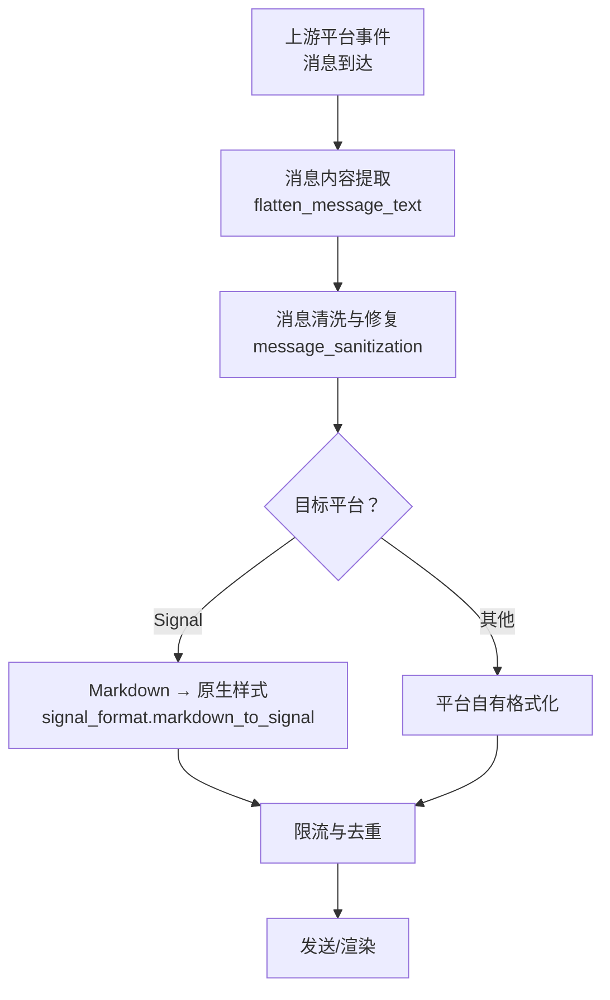
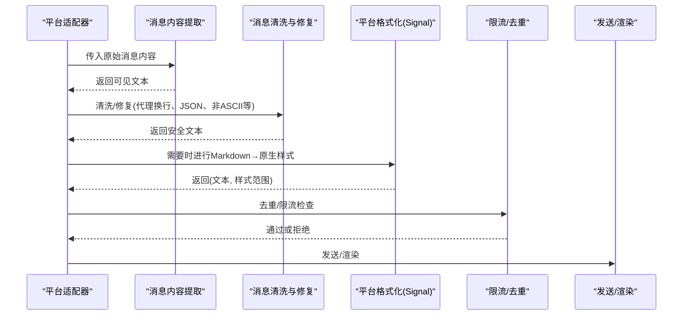
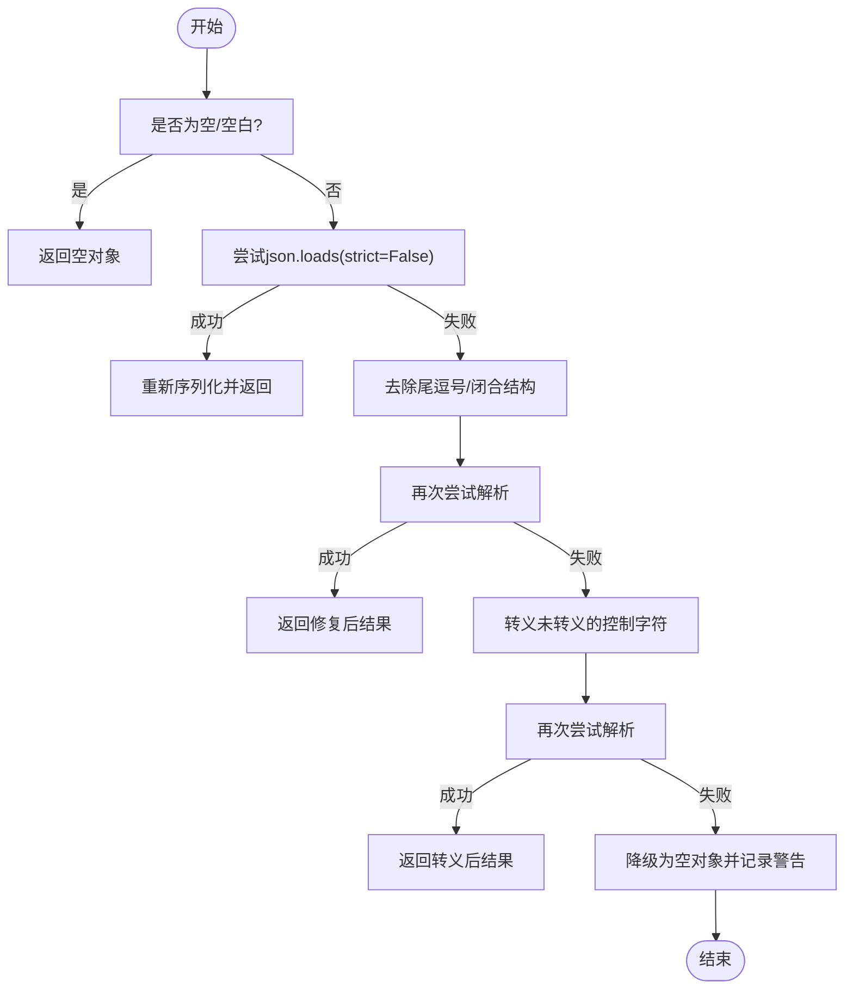
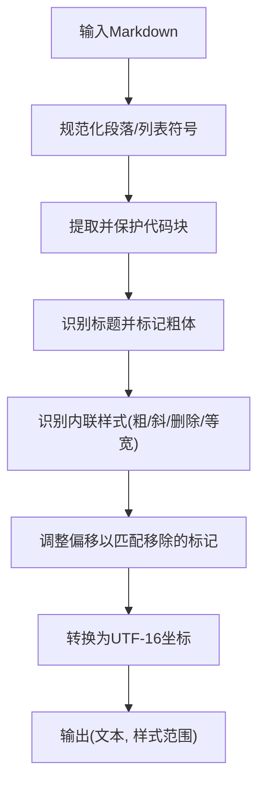
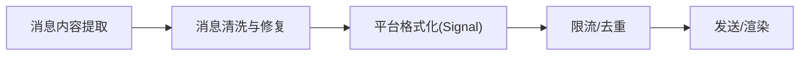

# 文本消息处理

<cite>
**本文引用的文件**
- [agent/message_content.py](file://agent/message_content.py)
- [agent/message_sanitization.py](file://agent/message_sanitization.py)
- [gateway/platforms/signal_format.py](file://gateway/platforms/signal_format.py)
- [gateway/platforms/signal_rate_limit.py](file://gateway/platforms/signal_rate_limit.py)
- [tests/gateway/test_message_deduplicator.py](file://tests/gateway/test_message_deduplicator.py)
</cite>

## 目录
1. [简介](#简介)
2. [项目结构](#项目结构)
3. [核心组件](#核心组件)
4. [架构总览](#架构总览)
5. [详细组件分析](#详细组件分析)
6. [依赖关系分析](#依赖关系分析)
7. [性能考量](#性能考量)
8. [故障排查指南](#故障排查指南)
9. [结论](#结论)
10. [附录](#附录)

## 简介
本文件聚焦于“文本消息处理”的端到端流程，覆盖从接收、解析到格式化的关键路径，重点包括：
- UTF-16 长度计算与平台特定限制（以 Signal 为例）
- 消息截断策略与编码转换（代理/平台侧）
- 富文本格式化与 Markdown 支持（Signal 原生样式映射）
- 文本去重、限流与错误恢复（含工具调用参数修复）
- 路由机制、线程处理与并发控制（基于平台模块与限流器）

## 项目结构
围绕文本消息处理的相关代码主要分布在以下位置：
- agent 层：通用消息内容提取与清洗（如去除非法字符、修复 JSON、处理推理字段等）
- gateway/platforms：平台特定的格式转换与发送逻辑（如 Signal 的 Markdown → 原生样式）
- tests：针对去重、限流、格式转换等的测试用例

图表来源
- [agent/message_content.py:34-51](file://agent/message_content.py#L34-L51)
- [agent/message_sanitization.py:32-141](file://agent/message_sanitization.py#L32-L141)
- [gateway/platforms/signal_format.py:12-141](file://gateway/platforms/signal_format.py#L12-L141)
- [gateway/platforms/signal_rate_limit.py](file://gateway/platforms/signal_rate_limit.py)

章节来源
- [agent/message_content.py:34-51](file://agent/message_content.py#L34-L51)
- [agent/message_sanitization.py:32-141](file://agent/message_sanitization.py#L32-L141)
- [gateway/platforms/signal_format.py:12-141](file://gateway/platforms/signal_format.py#L12-L141)

## 核心组件
- 文本内容提取：将多形态的消息内容（字符串、列表、对象）统一展平为可见文本。
- 消息清洗与修复：清理代理换行符、非法控制字符、非 ASCII 字符；修复工具调用参数 JSON；补齐中断后的对话序列。
- 平台格式化：将 Markdown 转换为平台原生样式（如 Signal 的 bodyRanges），并正确计算 UTF-16 长度。
- 限流与去重：按平台维度进行速率限制与消息去重，避免重复与超限。

章节来源
- [agent/message_content.py:34-51](file://agent/message_content.py#L34-L51)
- [agent/message_sanitization.py:32-141](file://agent/message_sanitization.py#L32-L141)
- [gateway/platforms/signal_format.py:12-141](file://gateway/platforms/signal_format.py#L12-L141)

## 架构总览
下图展示了文本消息从进入系统到最终渲染的关键路径，以及各组件的职责边界。

图表来源
- [agent/message_content.py:34-51](file://agent/message_content.py#L34-L51)
- [agent/message_sanitization.py:32-141](file://agent/message_sanitization.py#L32-L141)
- [gateway/platforms/signal_format.py:12-141](file://gateway/platforms/signal_format.py#L12-L141)

## 详细组件分析

### 文本内容提取（flatten_message_text）
- 功能：从多种消息结构中抽取可见文本，忽略图片/音频等非文本部分。
- 复杂度：线性遍历内容片段，时间 O(n)，空间 O(1)（不计输出）。
- 关键点：对对象类型尝试多个文本键；失败时回退为 str(content)。

章节来源
- [agent/message_content.py:7-51](file://agent/message_content.py#L7-L51)

### 消息清洗与修复（message_sanitization）
- 代理换行符清理：移除多余的连续换行，规范化段落。
- 代理换行符替换：将不可见控制字符转义为合法 JSON 表示。
- 代理换行符修复：对工具调用参数 JSON 进行多轮修复（补全括号、去除尾逗号、逃逸控制字符等），失败则降级为空对象并记录警告。
- 代理换行符剥离：在 ASCII-only 环境下剥离非 ASCII 字符，确保可打印。
- 代理换行符补充：当对话被中断且尾部为 tool 消息时，追加 assistant 回复以保持角色交替不变式。
- 代理换行符策略：根据目标提供商要求决定是否保留 reasoning_content 字段（如 DeepSeek/Kimi/MiMo 需回显，严格提供商需剔除）。

图表来源
- [agent/message_sanitization.py:195-293](file://agent/message_sanitization.py#L195-L293)

章节来源
- [agent/message_sanitization.py:32-141](file://agent/message_sanitization.py#L32-L141)
- [agent/message_sanitization.py:195-293](file://agent/message_sanitization.py#L195-L293)
- [agent/message_sanitization.py:296-325](file://agent/message_sanitization.py#L296-L325)
- [agent/message_sanitization.py:328-393](file://agent/message_sanitization.py#L328-L393)
- [agent/message_sanitization.py:712-800](file://agent/message_sanitization.py#L712-L800)

### 平台格式化（Signal Markdown → 原生样式）
- 功能：将 Markdown 转换为纯文本 + 样式范围列表（bodyRanges），用于 Signal 原生渲染。
- UTF-16 长度：使用 UTF-16 LE 编码长度作为坐标单位，保证与协议一致。
- 支持样式：粗体、斜体、删除线、等宽字体；标题转为粗体；代码块保持原样并标记等宽。
- 列表符号：将 Markdown 列表标记替换为 Unicode 项目符号，同时保护代码块内内容。

图表来源
- [gateway/platforms/signal_format.py:12-141](file://gateway/platforms/signal_format.py#L12-L141)

章节来源
- [gateway/platforms/signal_format.py:12-141](file://gateway/platforms/signal_format.py#L12-L141)

### 文本去重与限流
- 去重：通过测试用例验证去重器的行为，确保同一会话中不重复投递相同消息。
- 限流：Signal 平台提供独立的速率限制模块，防止超出平台配额。

章节来源
- [tests/gateway/test_message_deduplicator.py](file://tests/gateway/test_message_deduplicator.py)
- [gateway/platforms/signal_rate_limit.py](file://gateway/platforms/signal_rate_limit.py)

### 路由机制、线程处理与并发控制
- 路由：平台适配层负责将消息分发至对应平台的格式化与发送逻辑（例如 Signal 走 signal_format）。
- 线程与并发：平台限流器通常封装了并发控制（如令牌桶/漏桶），保障在高并发下稳定发送。
- 注意：具体线程模型由平台实现决定；本文档聚焦于文本处理相关的路径与约束。

章节来源
- [gateway/platforms/signal_format.py:12-141](file://gateway/platforms/signal_format.py#L12-L141)
- [gateway/platforms/signal_rate_limit.py](file://gateway/platforms/signal_rate_limit.py)

## 依赖关系分析
- agent/message_content.py 仅依赖标准库，职责单一，便于复用。
- agent/message_sanitization.py 依赖正则与 JSON 库，提供强鲁棒性的清洗能力。
- gateway/platforms/signal_format.py 依赖正则表达式，专注于 Markdown 到 Signal 样式的映射。
- 平台限流模块独立于格式化逻辑，形成松耦合的并发控制点。

图表来源
- [agent/message_content.py:34-51](file://agent/message_content.py#L34-L51)
- [agent/message_sanitization.py:32-141](file://agent/message_sanitization.py#L32-L141)
- [gateway/platforms/signal_format.py:12-141](file://gateway/platforms/signal_format.py#L12-L141)
- [gateway/platforms/signal_rate_limit.py](file://gateway/platforms/signal_rate_limit.py)

章节来源
- [agent/message_content.py:34-51](file://agent/message_content.py#L34-L51)
- [agent/message_sanitization.py:32-141](file://agent/message_sanitization.py#L32-L141)
- [gateway/platforms/signal_format.py:12-141](file://gateway/platforms/signal_format.py#L12-L141)
- [gateway/platforms/signal_rate_limit.py](file://gateway/platforms/signal_rate_limit.py)

## 性能考量
- 文本提取：线性扫描，开销低。
- 清洗与修复：正则与 JSON 操作可能带来额外 CPU 消耗，但仅在必要时触发；失败路径有日志与降级策略。
- 平台格式化：正则匹配与字符串拼接，注意代码块保护以避免误判；UTF-16 长度计算为轻量操作。
- 限流与去重：在高吞吐场景下减少无效请求与重复处理，提升整体稳定性。

[本节为通用指导，不直接分析具体文件]

## 故障排查指南
- 代理换行符导致 JSON 解析失败：检查工具调用参数是否包含未转义控制字符，参考修复流程。
- 代理换行符缺失导致角色交替异常：若对话被中断，确认是否已追加 assistant 回复。
- 代理换行符环境限制：在 ASCII-only 环境中，非 ASCII 字符会被剥离，必要时调整输入。
- 代理换行符平台限制：不同平台对富文本支持不同，优先使用平台原生样式（如 Signal 的 bodyRanges）。
- 代理换行符限流与去重：遇到发送失败或重复，检查限流策略与去重键是否正确。

章节来源
- [agent/message_sanitization.py:195-293](file://agent/message_sanitization.py#L195-L293)
- [agent/message_sanitization.py:296-325](file://agent/message_sanitization.py#L296-L325)
- [agent/message_sanitization.py:328-393](file://agent/message_sanitization.py#L328-L393)
- [gateway/platforms/signal_format.py:12-141](file://gateway/platforms/signal_format.py#L12-L141)
- [gateway/platforms/signal_rate_limit.py](file://gateway/platforms/signal_rate_limit.py)

## 结论
该文本消息处理链路通过“提取—清洗—格式化—限流/去重—发送”的分层设计，兼顾了跨平台兼容性与鲁棒性。Signal 等平台通过原生样式与 UTF-16 坐标确保渲染一致性；消息清洗与修复保障了在不同环境与上游模型输出下的稳定性；限流与去重提升了高并发下的可靠性。建议在生产环境中结合日志与监控持续优化各阶段性能与错误恢复策略。

[本节为总结，不直接分析具体文件]

## 附录
- 关键函数与用途速查
  - flatten_message_text：从多形态消息中提取可见文本
  - _repair_tool_call_arguments：修复工具调用参数 JSON
  - close_interrupted_tool_sequence：补齐中断后的 assistant 回复
  - markdown_to_signal：Markdown → Signal 原生样式（含 UTF-16 长度）
  - 限流/去重：平台级并发控制与重复消息过滤

章节来源
- [agent/message_content.py:34-51](file://agent/message_content.py#L34-L51)
- [agent/message_sanitization.py:195-293](file://agent/message_sanitization.py#L195-L293)
- [agent/message_sanitization.py:296-325](file://agent/message_sanitization.py#L296-L325)
- [gateway/platforms/signal_format.py:12-141](file://gateway/platforms/signal_format.py#L12-L141)
- [gateway/platforms/signal_rate_limit.py](file://gateway/platforms/signal_rate_limit.py)
- [tests/gateway/test_message_deduplicator.py](file://tests/gateway/test_message_deduplicator.py)