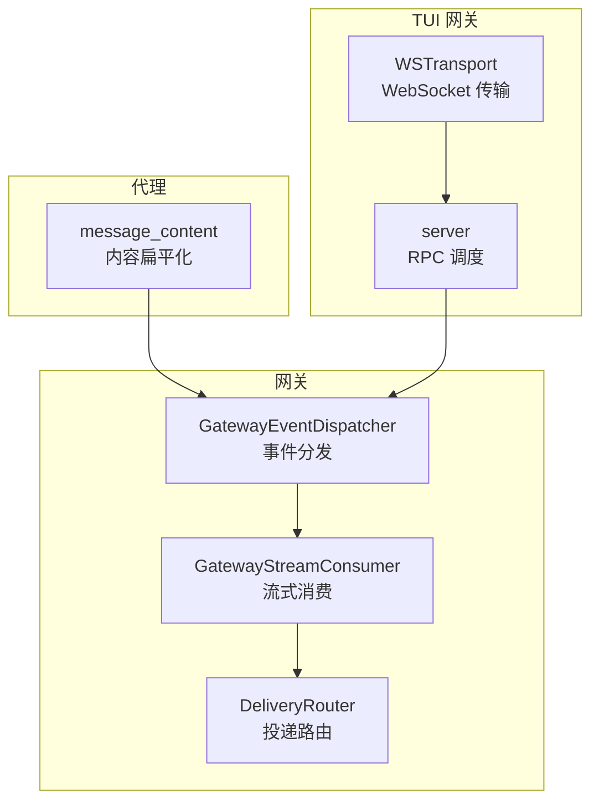
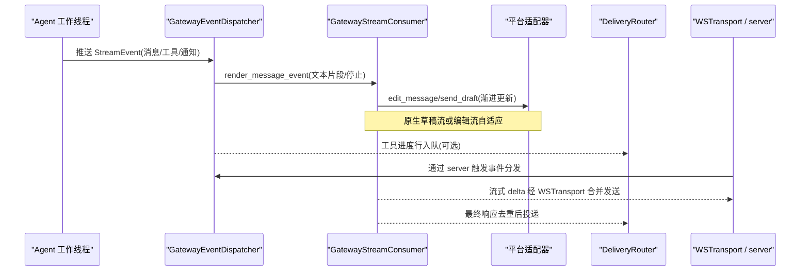
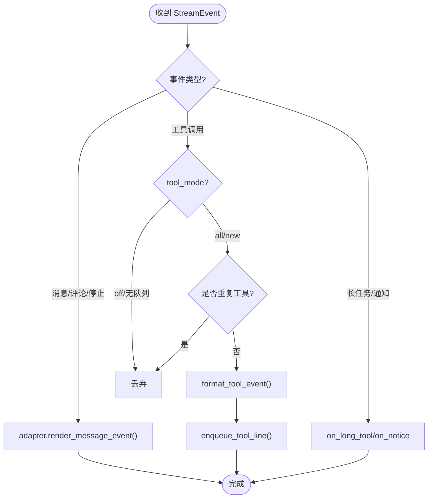
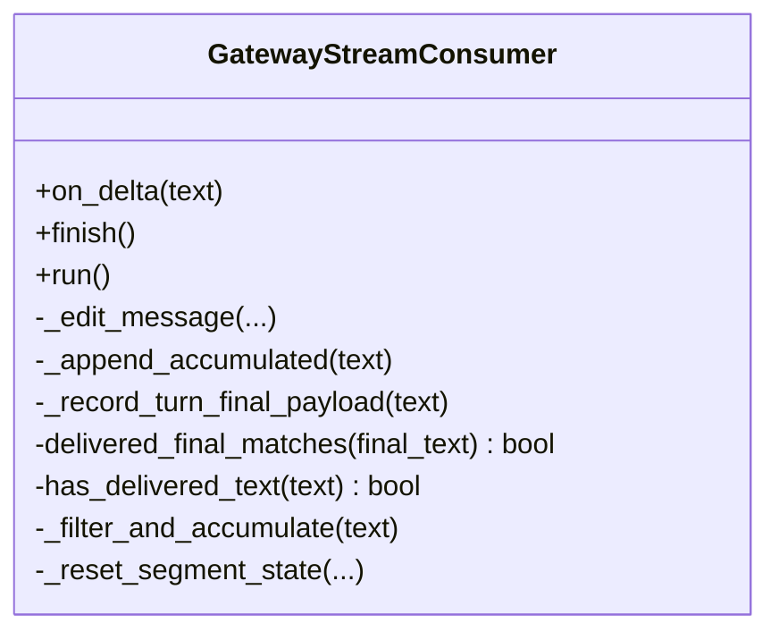
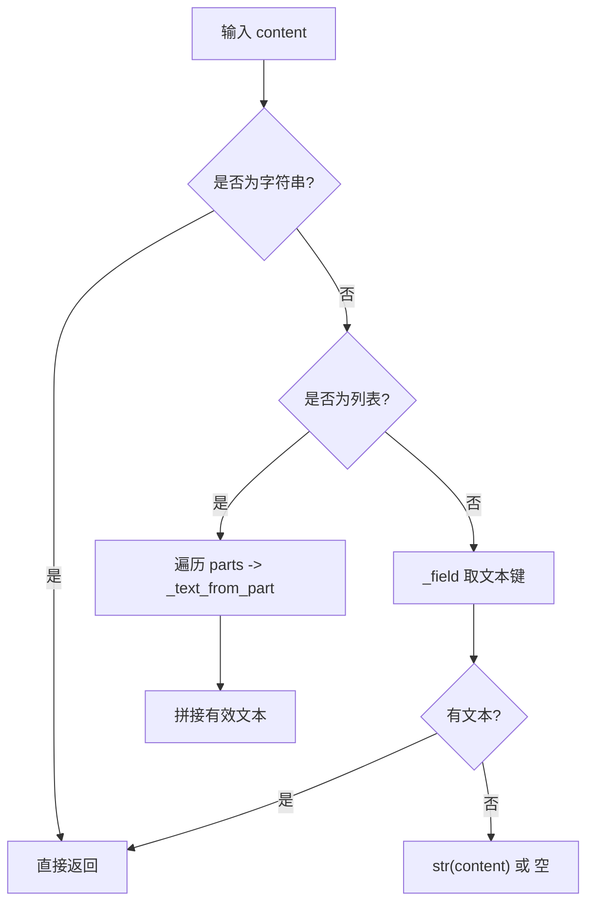
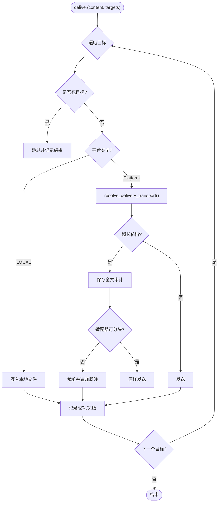
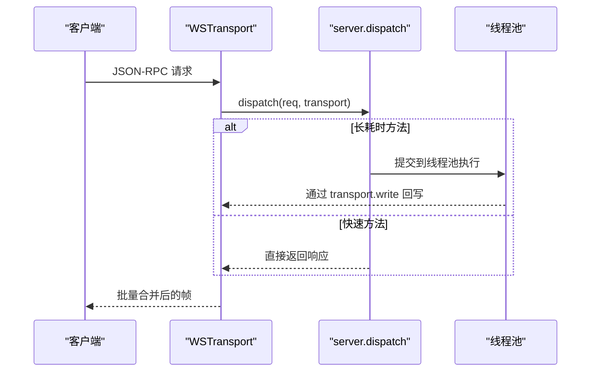
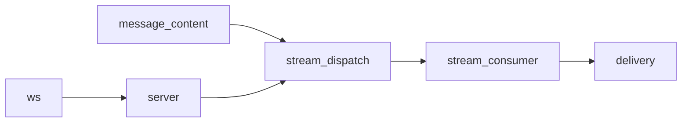

# 消息处理机制

<cite>
**本文引用的文件**
- [gateway/stream_dispatch.py](file://gateway/stream_dispatch.py)
- [gateway/stream_consumer.py](file://gateway/stream_consumer.py)
- [agent/message_content.py](file://agent/message_content.py)
- [gateway/delivery.py](file://gateway/delivery.py)
- [tui_gateway/ws.py](file://tui_gateway/ws.py)
- [tui_gateway/server.py](file://tui_gateway/server.py)
</cite>

## 目录
1. [简介](#简介)
2. [项目结构](#项目结构)
3. [核心组件](#核心组件)
4. [架构总览](#架构总览)
5. [详细组件分析](#详细组件分析)
6. [依赖关系分析](#依赖关系分析)
7. [性能考量](#性能考量)
8. [故障排查指南](#故障排查指南)
9. [结论](#结论)
10. [附录](#附录)

## 简介
本指南面向“消息接收、解析、转换与分发”的完整链路，覆盖文本、图片、音频、视频等富媒体内容的处理策略；说明消息路由、线程与并发控制、去重与限流、错误恢复；并给出 WebSocket 连接管理、心跳与断线重连的实践建议。文档基于代码库中的网关流式消费、事件分发、投递路由以及 TUI WebSocket 传输实现进行系统化梳理，帮助读者在不深入源码的情况下理解整体设计，并在需要时快速定位到具体实现位置。

## 项目结构
围绕消息处理的关键模块分布在以下路径：
- 网关层（Gateway）：负责将 Agent 产生的结构化流事件路由到平台适配器，并通过异步消费者逐步编辑/发送消息。
- 代理层（Agent）：提供消息内容扁平化、富媒体类型识别等基础能力。
- 投递层（Delivery）：统一路由到目标平台或本地文件，包含长度裁剪、静默语料过滤、死目标记录等。
- TUI 网关（TUI Gateway）：提供 WebSocket 传输、JSON-RPC 调度、流式帧合并与写保护，支撑桌面/TUI 客户端实时交互。

**图示来源**
- [gateway/stream_dispatch.py:40-132](file://gateway/stream_dispatch.py#L40-L132)
- [gateway/stream_consumer.py:156-323](file://gateway/stream_consumer.py#L156-L323)
- [gateway/delivery.py:294-391](file://gateway/delivery.py#L294-L391)
- [tui_gateway/ws.py:70-256](file://tui_gateway/ws.py#L70-L256)
- [tui_gateway/server.py:184-296](file://tui_gateway/server.py#L184-L296)

**章节来源**
- [gateway/stream_dispatch.py:1-132](file://gateway/stream_dispatch.py#L1-L132)
- [gateway/stream_consumer.py:1-323](file://gateway/stream_consumer.py#L1-L323)
- [agent/message_content.py:1-51](file://agent/message_content.py#L1-L51)
- [gateway/delivery.py:1-391](file://gateway/delivery.py#L1-L391)
- [tui_gateway/ws.py:1-256](file://tui_gateway/ws.py#L1-L256)
- [tui_gateway/server.py:184-296](file://tui_gateway/server.py#L184-L296)

## 核心组件
- 事件分发器（GatewayEventDispatcher）：将 Agent 产生的结构化流事件（消息片段、工具调用、长任务提示、通知等）按模式路由到平台适配器和进度队列，屏蔽平台差异。
- 流式消费者（GatewayStreamConsumer）：桥接同步回调与异步平台投递，支持渐进式编辑、原生草稿流、溢出拆分、思考块过滤、最终响应去重等。
- 投递路由（DeliveryRouter）：统一将消息投递到指定平台或本地文件，处理超长输出裁剪、静默语料过滤、死目标短路、线程/话题锚定等。
- WebSocket 传输（WSTransport）：为 TUI/Web 客户端提供 JSON-RPC 双向通道，具备高频 token 帧合并、写锁、Nagle 优化、超时保护与关闭清理。
- RPC 调度（server）：维护会话、方法注册、长耗时方法池化执行、崩溃日志、会话生命周期钩子等。

**章节来源**
- [gateway/stream_dispatch.py:40-132](file://gateway/stream_dispatch.py#L40-L132)
- [gateway/stream_consumer.py:156-323](file://gateway/stream_consumer.py#L156-L323)
- [gateway/delivery.py:294-391](file://gateway/delivery.py#L294-L391)
- [tui_gateway/ws.py:70-256](file://tui_gateway/ws.py#L70-L256)
- [tui_gateway/server.py:184-296](file://tui_gateway/server.py#L184-L296)

## 架构总览
下图展示从 Agent 产生流事件到平台投递、再到 TUI 客户端展示的端到端流程。

**图示来源**
- [gateway/stream_dispatch.py:88-129](file://gateway/stream_dispatch.py#L88-L129)
- [gateway/stream_consumer.py:760-800](file://gateway/stream_consumer.py#L760-L800)
- [tui_gateway/ws.py:118-226](file://tui_gateway/ws.py#L118-L226)
- [tui_gateway/server.py:384-428](file://tui_gateway/server.py#L384-L428)

## 详细组件分析

### 事件分发器（GatewayEventDispatcher）
- 职责：将不同事件类型路由到渲染或进度队列；在“new”模式下对工具调用进行去重；捕获异常避免破坏 Agent 循环。
- 关键点：
  - 消息类事件（MessageChunk/MessageStop/Commentary）交由适配器渲染到消费者。
  - 工具调用事件根据 tool_mode 决定是否入队，支持“仅新工具”去重。
  - 长任务提示与通知走回调钩子，由网关决定是否呈现。

**图示来源**
- [gateway/stream_dispatch.py:88-129](file://gateway/stream_dispatch.py#L88-L129)

**章节来源**
- [gateway/stream_dispatch.py:40-132](file://gateway/stream_dispatch.py#L40-L132)

### 流式消费者（GatewayStreamConsumer）
- 职责：接收 Agent 同步回调，缓冲、限速、渐进编辑平台消息；支持原生草稿流、溢出拆分、思考块过滤、最终响应去重与分段边界。
- 关键特性：
  - 线程安全 on_delta：将文本增量放入队列，异步 run 任务消费。
  - 自适应编辑间隔与洪水控制：连续失败则降级。
  - 原生草稿流：优先使用 send_draft 动画预览，失败回退到 edit。
  - 溢出拆分：当平台限制过长时拆分为多条消息，保留可见前缀。
  - 思考块过滤：屏蔽模型内联推理标签，保证用户只看到正文。
  - 最终响应去重：对比已送达文本，避免重复发送。

**图示来源**
- [gateway/stream_consumer.py:156-323](file://gateway/stream_consumer.py#L156-L323)
- [gateway/stream_consumer.py:590-605](file://gateway/stream_consumer.py#L590-L605)
- [gateway/stream_consumer.py:760-800](file://gateway/stream_consumer.py#L760-L800)

**章节来源**
- [gateway/stream_consumer.py:156-323](file://gateway/stream_consumer.py#L156-L323)
- [gateway/stream_consumer.py:590-605](file://gateway/stream_consumer.py#L590-L605)
- [gateway/stream_consumer.py:760-800](file://gateway/stream_consumer.py#L760-L800)

### 消息内容扁平化与富媒体识别
- 作用：从常见消息结构中抽取可见文本，忽略图片、音频等非文本部分，便于后续展示与去重。
- 规则：
  - 非文本类型（image/audio 等）直接返回空字符串。
  - 文本字段包括 text/content/input_text/output_text/summary_text。
  - 列表型内容按分隔符拼接有效文本。

**图示来源**
- [agent/message_content.py:7-51](file://agent/message_content.py#L7-L51)

**章节来源**
- [agent/message_content.py:1-51](file://agent/message_content.py#L1-L51)

### 投递路由（DeliveryRouter）
- 职责：将消息投递到指定平台或本地文件；处理超长输出裁剪、静默语料过滤、死目标短路、Telegram 私有主题创建与刷新。
- 关键点：
  - 超长输出：超过阈值时保存全文审计，并对不支持分块的适配器进行裁剪。
  - 静默语料过滤：防止机器人互发“静音”标记导致环路。
  - 死目标记录：已知不可达目标跳过投递，成功后清除标记。
  - 线程/话题：为 Telegram 私有 DM 主题创建或刷新 thread_id。

**图示来源**
- [gateway/delivery.py:318-391](file://gateway/delivery.py#L318-L391)
- [gateway/delivery.py:460-642](file://gateway/delivery.py#L460-L642)

**章节来源**
- [gateway/delivery.py:294-391](file://gateway/delivery.py#L294-L391)
- [gateway/delivery.py:460-642](file://gateway/delivery.py#L460-L642)

### WebSocket 传输与 TUI 调度
- WSTransport：
  - 高频 token 帧合并：降低事件循环唤醒频率，保持 ~30fps 显示节奏。
  - 写锁与超时保护：避免 GIL 阻塞导致假死，确保顺序与可靠性。
  - Nagle 优化：禁用 Nagle 使小帧尽快发出，提升实时性。
- server：
  - 长耗时 RPC 池化：将慢方法放到线程池，避免阻塞读循环。
  - 会话生命周期：创建、暂停、恢复、终止与资源回收。
  - 崩溃日志：未处理异常落盘并输出摘要，便于排障。

**图示来源**
- [tui_gateway/ws.py:118-226](file://tui_gateway/ws.py#L118-L226)
- [tui_gateway/server.py:184-296](file://tui_gateway/server.py#L184-L296)
- [tui_gateway/server.py:384-428](file://tui_gateway/server.py#L384-L428)

**章节来源**
- [tui_gateway/ws.py:70-256](file://tui_gateway/ws.py#L70-L256)
- [tui_gateway/server.py:184-296](file://tui_gateway/server.py#L184-L296)
- [tui_gateway/server.py:384-428](file://tui_gateway/server.py#L384-L428)

## 依赖关系分析
- 事件分发依赖平台适配器与消费者接口，解耦 Agent 与平台细节。
- 流式消费者依赖适配器长度函数与编辑能力，支持多平台一致体验。
- 投递路由依赖配置与平台适配器，支持 Relay 与原生适配器优先级选择。
- TUI 传输依赖 server 的调度与 transport 抽象，确保跨进程/跨语言一致性。

**图示来源**
- [agent/message_content.py:1-51](file://agent/message_content.py#L1-L51)
- [gateway/stream_dispatch.py:40-132](file://gateway/stream_dispatch.py#L40-L132)
- [gateway/stream_consumer.py:156-323](file://gateway/stream_consumer.py#L156-L323)
- [gateway/delivery.py:294-391](file://gateway/delivery.py#L294-L391)
- [tui_gateway/ws.py:70-256](file://tui_gateway/ws.py#L70-L256)
- [tui_gateway/server.py:184-296](file://tui_gateway/server.py#L184-L296)

**章节来源**
- [gateway/stream_dispatch.py:40-132](file://gateway/stream_dispatch.py#L40-L132)
- [gateway/stream_consumer.py:156-323](file://gateway/stream_consumer.py#L156-L323)
- [gateway/delivery.py:294-391](file://gateway/delivery.py#L294-L391)
- [tui_gateway/ws.py:70-256](file://tui_gateway/ws.py#L70-L256)
- [tui_gateway/server.py:184-296](file://tui_gateway/server.py#L184-L296)

## 性能考量
- 流式帧合并：WSTransport 将高频 token 帧合并为批次，减少事件循环唤醒与 GIL 竞争，提升 UI 流畅度。
- 自适应编辑间隔：流式消费者根据平台反馈动态调整编辑频率，避免洪水控制触发。
- 原生草稿流：优先使用 send_draft 动画预览，降低频繁 edit 的成本，失败自动回退。
- 长耗时 RPC 池化：server 将慢方法放入线程池，保障读循环不被阻塞，维持系统响应性。
- 超长输出裁剪：delivery 对非分块适配器进行裁剪并保存全文审计，兼顾用户体验与可追溯性。

[本节为通用性能讨论，不直接分析具体文件]

## 故障排查指南
- 流式编辑失败：检查消费者洪水计数与编辑间隔，确认平台是否支持渐进编辑；必要时启用原生草稿流。
- 最终响应重复：核对 delivered_final_matches 与 has_delivered_text 逻辑，确保比较文本已规范化。
- 工具进度丢失：确认 tool_mode 与 enqueue_tool_line 回调是否可用；“new”模式下需关注工具名变化。
- WebSocket 卡顿：查看 WSTransport 写超时与合并定时器；确认事件循环未被长时间占用。
- 死目标持续重试：检查 delivery 的死目标记录与清理逻辑，必要时手动触发重发以清除标记。
- 崩溃与异常：关注 tui_gateway 崩溃日志与线程异常钩子，定位未处理异常与资源泄漏。

**章节来源**
- [gateway/stream_consumer.py:171-174](file://gateway/stream_consumer.py#L171-L174)
- [gateway/stream_consumer.py:443-491](file://gateway/stream_consumer.py#L443-L491)
- [gateway/delivery.py:341-391](file://gateway/delivery.py#L341-L391)
- [tui_gateway/ws.py:165-187](file://tui_gateway/ws.py#L165-L187)
- [tui_gateway/server.py:62-132](file://tui_gateway/server.py#L62-L132)

## 结论
该消息处理机制通过事件分发、流式消费、统一投递与 WebSocket 传输形成闭环，既保证了多平台的一致体验，又提供了高性能与高可用的工程实践。结合去重、限流、错误恢复与资源回收，能够在复杂场景下稳定运行。建议在扩展新平台或新增消息类型时，遵循现有接口契约，复用已有能力，确保系统可扩展性与可维护性。

[本节为总结，不直接分析具体文件]

## 附录
- 富媒体内容下载与缓存：当前仓库未见统一的媒体下载与缓存模块；可在平台适配器层按需实现，并结合 delivery 的审计保存策略记录原始资源路径。
- 心跳检测与断线重连：建议在客户端侧实现心跳与指数退避重连；服务端可通过 WSTransport 的 close 与统计信息辅助诊断。
- 实际代码示例路径：
  - 事件分发入口：[gateway/stream_dispatch.py:88-129](file://gateway/stream_dispatch.py#L88-L129)
  - 流式消费主循环：[gateway/stream_consumer.py:760-800](file://gateway/stream_consumer.py#L760-L800)
  - 内容扁平化：[agent/message_content.py:34-51](file://agent/message_content.py#L34-L51)
  - 投递路由主流程：[gateway/delivery.py:318-391](file://gateway/delivery.py#L318-L391)
  - WebSocket 写合并：[tui_gateway/ws.py:118-226](file://tui_gateway/ws.py#L118-L226)
  - 长耗时 RPC 池化：[tui_gateway/server.py:184-296](file://tui_gateway/server.py#L184-L296)

[本节为参考索引，不直接分析具体文件]