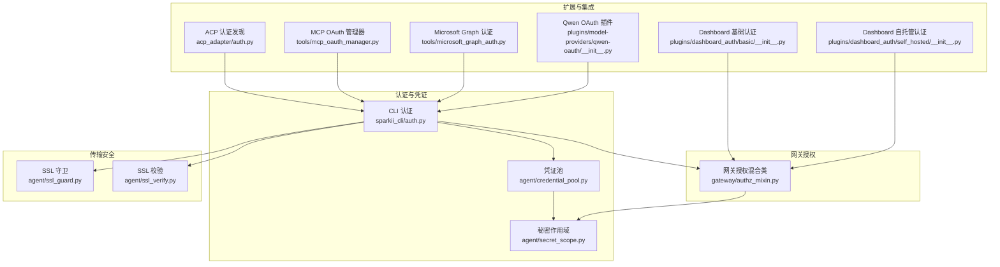
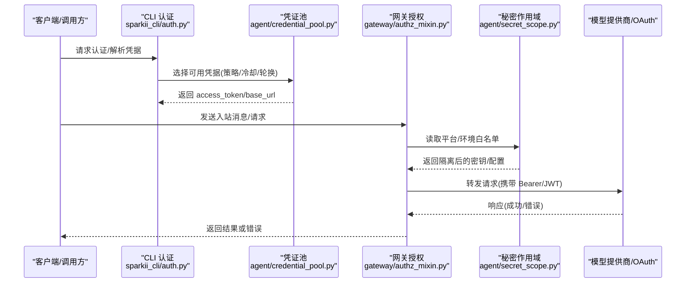
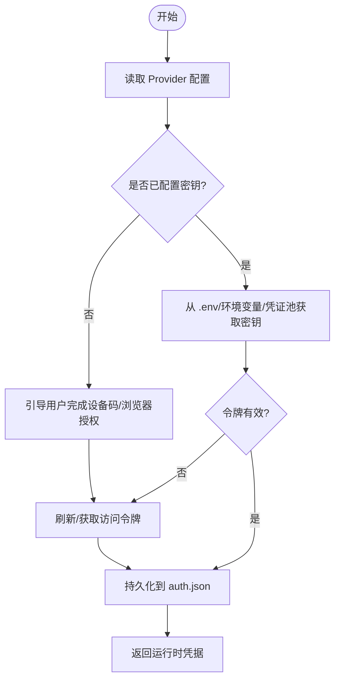
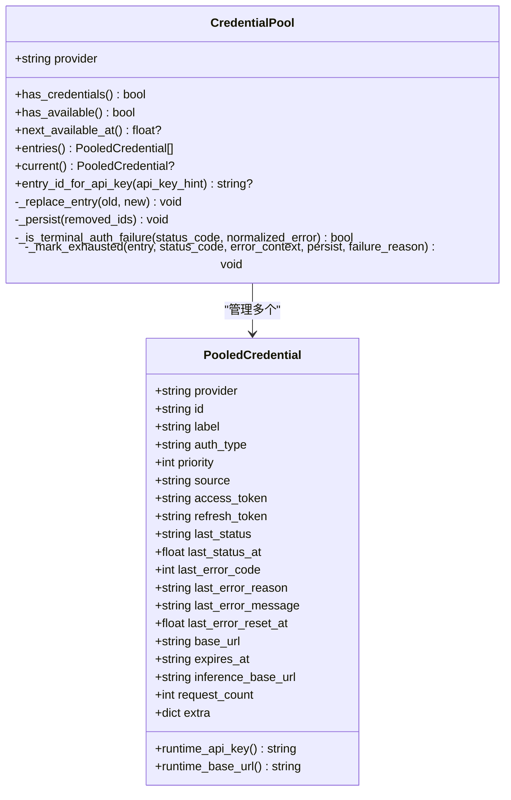
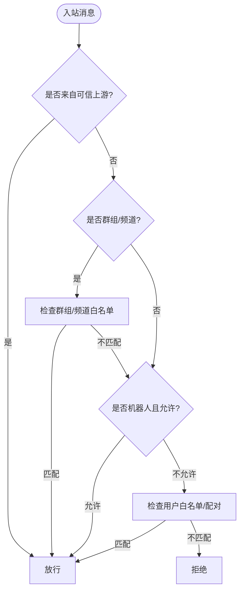
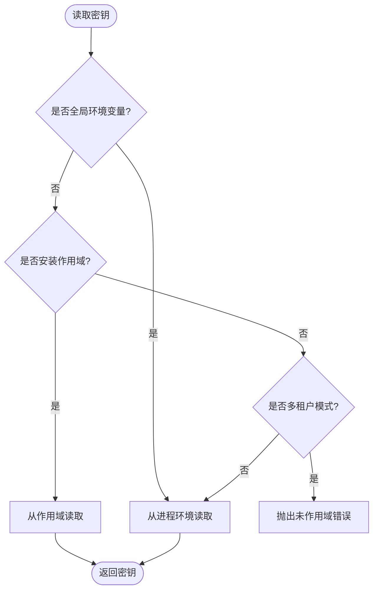
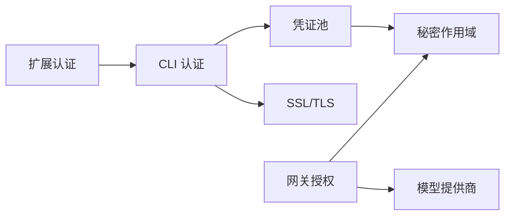

# 认证与安全机制

<cite>
**本文引用的文件**
- [acp_adapter/auth.py](file://acp_adapter/auth.py)
- [gateway/authz_mixin.py](file://gateway/authz_mixin.py)
- [sparkii_cli/auth.py](file://sparkii_cli/auth.py)
- [agent/credential_pool.py](file://agent/credential_pool.py)
- [agent/secret_scope.py](file://agent/secret_scope.py)
- [agent/ssl_guard.py](file://agent/ssl_guard.py)
- [agent/ssl_verify.py](file://agent/ssl_verify.py)
- [plugins/dashboard_auth/basic/__init__.py](file://plugins/dashboard_auth/basic/__init__.py)
- [plugins/dashboard_auth/self_hosted/__init__.py](file://plugins/dashboard_auth/self_hosted/__init__.py)
- [plugins/memory/honcho/oauth.py](file://plugins/memory/honcho/oauth.py)
- [plugins/model-providers/qwen-oauth/__init__.py](file://plugins/model-providers/qwen-oauth/__init__.py)
- [tools/mcp_oauth_manager.py](file://tools/mcp_oauth_manager.py)
- [tools/microsoft_graph_auth.py](file://tools/microsoft_graph_auth.py)
- [tests/test_sql_injection.py](file://tests/test_sql_injection.py)
- [sparkii_cli/security_audit.py](file://sparkii_cli/security_audit.py)
</cite>

## 目录
1. [简介](#简介)
2. [项目结构](#项目结构)
3. [核心组件](#核心组件)
4. [架构总览](#架构总览)
5. [详细组件分析](#详细组件分析)
6. [依赖关系分析](#依赖关系分析)
7. [性能考量](#性能考量)
8. [故障排除指南](#故障排除指南)
9. [结论](#结论)
10. [附录](#附录)

## 简介
本文件系统性梳理本项目中的认证与安全机制，覆盖 OAuth2.0、API 密钥、JWT 令牌等认证方式；说明敏感信息的安全存储、加密传输与访问控制策略；阐述权限验证、角色管理、操作审计；并给出防重放攻击、SQL 注入防护、XSS 防护思路。同时提供企业级安全特性（单点登录 SSO、多因素认证 MFA）的实现方案建议、安全配置最佳实践与漏洞检测方法。

## 项目结构
围绕认证与安全的关键代码分布在以下模块：
- 认证入口与提供者注册：CLI 层集中管理多提供商认证配置与流程
- 凭证池与持久化：统一的多凭据池、轮换、冷却与持久化
- 网关授权：入站消息的白名单、配对、上游授权信任与平台策略
- 多租户隔离：基于上下文变量的秘密作用域，避免跨配置泄露
- TLS/SSL 校验：强制 HTTPS、证书校验与 CA 管理
- 插件与扩展：Dashboard 基础/自托管认证、MCP OAuth、第三方平台 OAuth
- 审计与合规：启动时安全检查、审计日志与工具

**图表来源**
- [sparkii_cli/auth.py:190-507](file://sparkii_cli/auth.py#L190-L507)
- [agent/credential_pool.py:185-290](file://agent/credential_pool.py#L185-L290)
- [agent/secret_scope.py:132-186](file://agent/secret_scope.py#L132-L186)
- [gateway/authz_mixin.py:386-783](file://gateway/authz_mixin.py#L386-L783)
- [acp_adapter/auth.py:11-79](file://acp_adapter/auth.py#L11-L79)
- [plugins/dashboard_auth/basic/__init__.py](file://plugins/dashboard_auth/basic/__init__.py)
- [plugins/dashboard_auth/self_hosted/__init__.py](file://plugins/dashboard_auth/self_hosted/__init__.py)
- [tools/mcp_oauth_manager.py](file://tools/mcp_oauth_manager.py)
- [tools/microsoft_graph_auth.py](file://tools/microsoft_graph_auth.py)
- [plugins/model-providers/qwen-oauth/__init__.py](file://plugins/model-providers/qwen-oauth/__init__.py)

**章节来源**
- [sparkii_cli/auth.py:190-507](file://sparkii_cli/auth.py#L190-L507)
- [agent/credential_pool.py:185-290](file://agent/credential_pool.py#L185-L290)
- [agent/secret_scope.py:132-186](file://agent/secret_scope.py#L132-L186)
- [gateway/authz_mixin.py:386-783](file://gateway/authz_mixin.py#L386-L783)
- [acp_adapter/auth.py:11-79](file://acp_adapter/auth.py#L11-L79)

## 核心组件
- 多提供商认证与 JWT：集中式 Provider 注册表，支持 API Key、OAuth Device Code、外部 OAuth、AWS SDK、Vertex 等；对 Nous Portal 使用 invoke JWT；对 xAI、OpenAI Codex、Qwen 等提供专用刷新与过期策略。
- 凭证池与轮换：统一的多凭据池，支持选择策略（填充优先、轮询、随机、最少使用）、冷却期、死标记、失败分类、持久化与写回全局根 store。
- 网关授权：按平台与环境变量进行用户/群组白名单校验；支持上游授权信任（Relay/平台适配器）；支持配对审批；对“开放”策略默认拒绝，遵循最小权限。
- 多租户隔离：通过上下文变量实现秘密作用域，在复用进程中严格隔离不同 profile 的密钥，禁止跨 profile 泄露。
- 传输安全：强制 HTTPS、证书校验、CA 管理，防止中间人攻击。
- 扩展认证：Dashboard 基础/自托管认证、MCP OAuth、Microsoft Graph、Qwen OAuth 等插件化接入。

**章节来源**
- [sparkii_cli/auth.py:190-507](file://sparkii_cli/auth.py#L190-L507)
- [agent/credential_pool.py:185-290](file://agent/credential_pool.py#L185-L290)
- [gateway/authz_mixin.py:386-783](file://gateway/authz_mixin.py#L386-L783)
- [agent/secret_scope.py:132-186](file://agent/secret_scope.py#L132-L186)
- [agent/ssl_guard.py](file://agent/ssl_guard.py)
- [agent/ssl_verify.py](file://agent/ssl_verify.py)
- [plugins/dashboard_auth/basic/__init__.py](file://plugins/dashboard_auth/basic/__init__.py)
- [plugins/dashboard_auth/self_hosted/__init__.py](file://plugins/dashboard_auth/self_hosted/__init__.py)
- [tools/mcp_oauth_manager.py](file://tools/mcp_oauth_manager.py)
- [tools/microsoft_graph_auth.py](file://tools/microsoft_graph_auth.py)
- [plugins/model-providers/qwen-oauth/__init__.py](file://plugins/model-providers/qwen-oauth/__init__.py)

## 架构总览
下图展示从客户端到网关再到模型提供商的认证与授权链路，以及凭证池与秘密作用域的协作。

**图表来源**
- [sparkii_cli/auth.py:190-507](file://sparkii_cli/auth.py#L190-L507)
- [agent/credential_pool.py:185-290](file://agent/credential_pool.py#L185-L290)
- [gateway/authz_mixin.py:386-783](file://gateway/authz_mixin.py#L386-L783)
- [agent/secret_scope.py:132-186](file://agent/secret_scope.py#L132-L186)

## 详细组件分析

### 多提供商认证与 JWT（CLI 层）
- 能力概览
  - 注册表驱动：集中定义各提供商的认证类型、端点、环境变量与范围
  - 支持多种认证：API Key、OAuth Device Code、外部 OAuth、AWS SDK、Vertex
  - JWT 支持：Nous Portal 使用 invoke JWT；xAI/OpenAI Codex/Qwen 等具备专用刷新与过期策略
  - 安全提示：检测占位符密钥、自动探测端点（如 Z.AI/Kimi），减少误配
- 关键流程
  - 解析 Provider 配置 -> 获取/刷新 Token -> 写入/更新 auth.json -> 提供给运行时使用
  - 对 Copilot 等特殊提供商走专用模块进行令牌校验与转换

**图表来源**
- [sparkii_cli/auth.py:190-507](file://sparkii_cli/auth.py#L190-L507)

**章节来源**
- [sparkii_cli/auth.py:190-507](file://sparkii_cli/auth.py#L190-L507)

### 凭证池与轮换（CredentialPool）
- 能力概览
  - 多凭据池：同一提供商可维护多个凭据，支持优先级、选择策略、并发限制
  - 冷却与恢复：根据 HTTP 状态码与错误语义设置冷却时间；识别“终结性”失败（如 token_revoked）
  - 持久化与写回：将状态持久化到 JSON，并在必要时写回全局根 store，避免多 profile 共享刷新链失效
  - 标签与可读性：从 JWT claims 生成友好标签，便于运维观察
- 关键流程
  - 选择可用凭据 -> 执行请求 -> 记录错误/冷却 -> 必要时轮换 -> 持久化

**图表来源**
- [agent/credential_pool.py:185-290](file://agent/credential_pool.py#L185-L290)
- [agent/credential_pool.py:633-800](file://agent/credential_pool.py#L633-L800)

**章节来源**
- [agent/credential_pool.py:185-290](file://agent/credential_pool.py#L185-L290)
- [agent/credential_pool.py:633-800](file://agent/credential_pool.py#L633-L800)

### 网关授权与访问控制（AuthorizationMixin）
- 能力概览
  - 多层白名单：平台级允许所有、环境变量白名单、群组/频道白名单、配对审批、全局允许标志
  - 上游授权信任：Relay 或平台适配器已做鉴权时，直接信任其入站事件
  - 失败关闭：未配置白名单时默认拒绝，避免“开放”策略被误用为放行
  - 适配策略：DM/群组策略、发送者白名单、别名归一化（WhatsApp/SimpleX）
- 关键流程
  - 检查上游授权 -> 检查群组/频道白名单 -> 检查机器人策略 -> 检查用户白名单/配对 -> 默认拒绝

**图表来源**
- [gateway/authz_mixin.py:386-783](file://gateway/authz_mixin.py#L386-L783)

**章节来源**
- [gateway/authz_mixin.py:386-783](file://gateway/authz_mixin.py#L386-L783)

### 多租户隔离与秘密作用域（SecretScope）
- 能力概览
  - 上下文变量隔离：每个任务/转场安装当前 profile 的秘密映射，子线程继承
  - 失败关闭：在多租户模式下，未安装作用域即读取密钥会抛出异常，防止跨 profile 泄露
  - 全局环境变量豁免：部署级变量（如路径、超时、CORS）不受作用域限制
  - .env 解析：安全加载 profile 的 .env，剥离注释与转义，避免污染进程环境
- 关键流程
  - 安装作用域 -> 读取密钥（优先作用域，其次全局环境变量）-> 多租户下缺失则报错

**图表来源**
- [agent/secret_scope.py:132-186](file://agent/secret_scope.py#L132-L186)

**章节来源**
- [agent/secret_scope.py:132-186](file://agent/secret_scope.py#L132-L186)

### 传输安全（SSL/TLS）
- 能力概览
  - 强制 HTTPS：对外通信仅允许安全连接，阻止明文传输
  - 证书校验：启用严格的证书校验，拒绝无效/自签证书（除非显式配置）
  - CA 管理：支持自定义 CA 包，确保内部服务证书链正确
- 建议
  - 在生产环境禁用宽松校验开关
  - 定期轮换证书，监控证书过期告警
  - 对内部服务使用受信任的私有 CA

**章节来源**
- [agent/ssl_guard.py](file://agent/ssl_guard.py)
- [agent/ssl_verify.py](file://agent/ssl_verify.py)

### 扩展认证（Dashboard/MCP/第三方）
- Dashboard 基础/自托管认证：提供本地用户名/密码或自托管身份源接入
- MCP OAuth 管理器：统一管理 MCP 服务的 OAuth 流程与令牌生命周期
- Microsoft Graph 认证：对接企业 Azure AD，支持组织级授权与资源访问
- Qwen OAuth 插件：以插件形式接入 Qwen 的 OAuth 流程，简化配置

**章节来源**
- [plugins/dashboard_auth/basic/__init__.py](file://plugins/dashboard_auth/basic/__init__.py)
- [plugins/dashboard_auth/self_hosted/__init__.py](file://plugins/dashboard_auth/self_hosted/__init__.py)
- [tools/mcp_oauth_manager.py](file://tools/mcp_oauth_manager.py)
- [tools/microsoft_graph_auth.py](file://tools/microsoft_graph_auth.py)
- [plugins/model-providers/qwen-oauth/__init__.py](file://plugins/model-providers/qwen-oauth/__init__.py)

### ACP 认证发现
- 能力概览
  - 动态发现 Sparkii 运行时提供的认证方法（如终端设置、已配置的提供商）
  - 在无配置时提供交互式设置入口，降低初始门槛
- 关键流程
  - 检测运行时提供商 -> 构建认证方法列表 -> 供 ACP 注册中心使用

**章节来源**
- [acp_adapter/auth.py:11-79](file://acp_adapter/auth.py#L11-L79)

## 依赖关系分析
- 耦合与内聚
  - CLI 认证与凭证池强耦合：CLI 负责解析与刷新，凭证池负责选择与持久化
  - 网关授权与秘密作用域解耦：通过 get_secret 抽象读取，保证多租户隔离
  - 传输安全独立：SSL 校验作为网络层横切关注点，被各组件复用
- 外部依赖
  - OAuth 提供商：OpenAI、Anthropic、xAI、Qwen、MiniMax、Spotify 等
  - 企业身份：Azure AD（Microsoft Graph）、GitHub Copilot
  - 平台适配器：Discord、Telegram、Slack、WhatsApp、WeCom、Yuanbao 等
- 潜在循环依赖
  - 通过延迟导入与模块化设计避免循环引用（例如 gateway.authz_mixin 中懒加载 logger）

**图表来源**
- [sparkii_cli/auth.py:190-507](file://sparkii_cli/auth.py#L190-L507)
- [agent/credential_pool.py:185-290](file://agent/credential_pool.py#L185-L290)
- [agent/secret_scope.py:132-186](file://agent/secret_scope.py#L132-L186)
- [gateway/authz_mixin.py:386-783](file://gateway/authz_mixin.py#L386-L783)

**章节来源**
- [sparkii_cli/auth.py:190-507](file://sparkii_cli/auth.py#L190-L507)
- [agent/credential_pool.py:185-290](file://agent/credential_pool.py#L185-L290)
- [agent/secret_scope.py:132-186](file://agent/secret_scope.py#L132-L186)
- [gateway/authz_mixin.py:386-783](file://gateway/authz_mixin.py#L386-L783)

## 性能考量
- 凭证池选择策略：在高并发场景下，轮询/随机策略可分散负载；最少使用策略有助于负载均衡
- 冷却时间优化：根据错误语义（401/429/402）设置差异化冷却，避免雪崩
- 日志节流：对“无可用凭据”等高频日志进行节流，减少锁竞争与 I/O 压力
- 多租户隔离开销：作用域切换成本低，但应避免频繁创建/销毁大对象

[本节为通用指导，无需特定文件来源]

## 故障排除指南
- 常见问题
  - 令牌过期/失效：检查凭证池状态与刷新逻辑；确认终结性失败（token_revoked/invalid_grant）需重新授权
  - 白名单未生效：核对平台环境变量、群组/频道白名单、配对审批状态
  - 多租户密钥泄露：确认多租户模式下已安装作用域；未安装将抛出异常
  - SSL 证书错误：检查证书链、CA 包配置与系统时间
- 诊断步骤
  - 查看凭证池条目与最后错误信息
  - 检查网关授权日志与平台适配器策略
  - 使用安全审计工具扫描配置与依赖

**章节来源**
- [agent/credential_pool.py:633-800](file://agent/credential_pool.py#L633-L800)
- [gateway/authz_mixin.py:386-783](file://gateway/authz_mixin.py#L386-L783)
- [agent/secret_scope.py:132-186](file://agent/secret_scope.py#L132-L186)
- [agent/ssl_guard.py](file://agent/ssl_guard.py)
- [agent/ssl_verify.py](file://agent/ssl_verify.py)

## 结论
本项目构建了完善的认证与安全体系：以 CLI 为中心的多提供商认证、统一的凭证池与轮换、严格的网关授权与多租户隔离、可靠的传输安全与可扩展的插件生态。通过最小权限原则、失败关闭策略与审计能力，满足企业级安全需求。建议在生产环境中持续强化证书管理、白名单治理与审计日志分析，并结合 SSO/MFA 提升整体安全性。

[本节为总结，无需特定文件来源]

## 附录

### 安全配置最佳实践
- 认证
  - 优先使用 OAuth2.0 与 JWT，避免硬编码 API Key
  - 定期轮换令牌，启用短 TTL 与自动刷新
  - 对管理员账户启用 MFA（结合企业身份源）
- 访问控制
  - 明确配置平台白名单与群组白名单，默认拒绝
  - 使用配对审批机制逐步放开访问
  - 对上游授权信任保持最小化，仅信任可信中继/适配器
- 传输安全
  - 强制 HTTPS，启用严格证书校验
  - 使用受信任的私有 CA，定期轮换证书
- 审计与合规
  - 启用操作审计日志，记录关键认证与授权事件
  - 定期进行安全扫描与依赖漏洞检测

[本节为通用指导，无需特定文件来源]

### 漏洞检测与加固
- SQL 注入防护
  - 使用参数化查询与 ORM，避免字符串拼接
  - 参考测试用例验证输入过滤与边界处理
- XSS 防护
  - 对用户输入进行输出编码与内容安全策略（CSP）配置
  - 前端框架默认转义，谨慎使用 dangerouslySetInnerHTML 等
- 防重放攻击
  - 使用一次性令牌、时间戳与签名校验
  - 服务端记录最近请求指纹，拒绝重复提交
- 依赖漏洞
  - 定期扫描依赖库，及时升级已知漏洞版本

**章节来源**
- [tests/test_sql_injection.py](file://tests/test_sql_injection.py)

### 企业级特性方案（SSO/MFA）
- 单点登录（SSO）
  - 基于 OpenID Connect 与企业身份源（Azure AD、Okta、Keycloak）集成
  - 使用标准协议（authorization code flow + PKCE）保障安全
- 多因素认证（MFA）
  - 结合 TOTP、短信/邮件验证码、硬件密钥（FIDO2/WebAuthn）
  - 在网关层或身份提供方统一实施，确保会话一致性

[本节为概念性方案，无需特定文件来源]

### 安全审计与启动检查
- 启动时安全检查：扫描常见配置风险（弱口令、开放端口、不安全默认值）
- 审计日志：记录认证、授权、配置变更等关键事件，便于追溯与分析

**章节来源**
- [sparkii_cli/security_audit.py](file://sparkii_cli/security_audit.py)