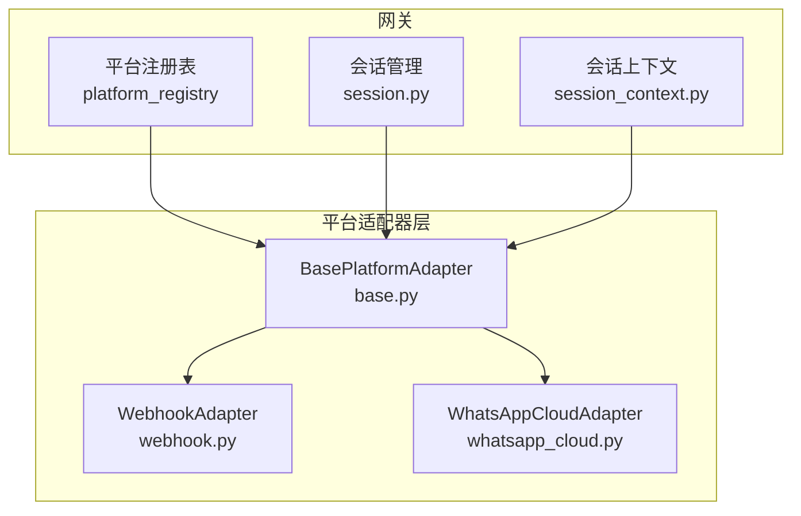
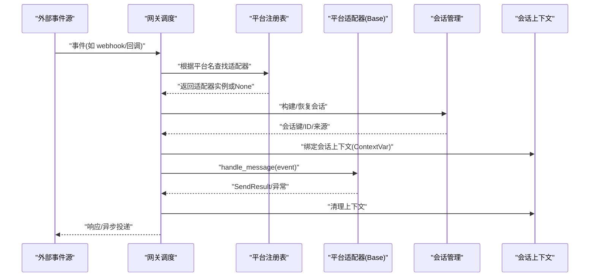
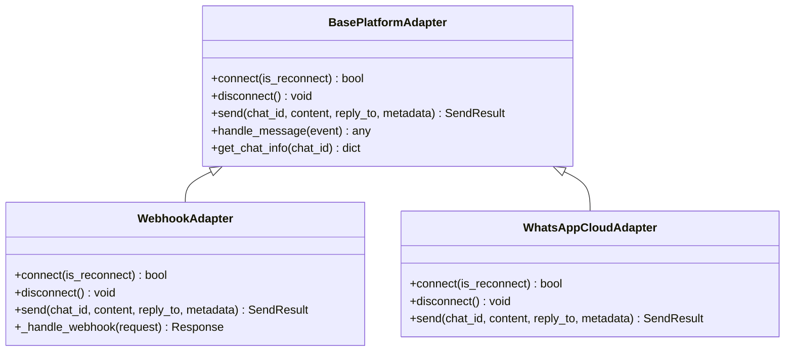
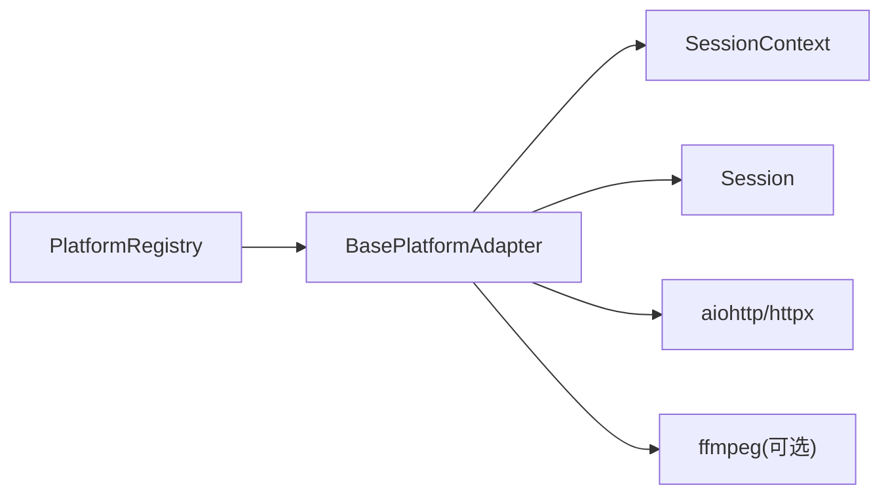

# 适配器架构设计

<cite>
**本文引用的文件**
- [gateway/platforms/base.py](file://gateway/platforms/base.py)
- [gateway/platform_registry.py](file://gateway/platform_registry.py)
- [gateway/session.py](file://gateway/session.py)
- [gateway/session_context.py](file://gateway/session_context.py)
- [gateway/platforms/webhook.py](file://gateway/platforms/webhook.py)
- [gateway/platforms/whatsapp_cloud.py](file://gateway/platforms/whatsapp_cloud.py)
</cite>

## 目录
1. [简介](#简介)
2. [项目结构](#项目结构)
3. [核心组件](#核心组件)
4. [架构总览](#架构总览)
5. [详细组件分析](#详细组件分析)
6. [依赖关系分析](#依赖关系分析)
7. [性能考量](#性能考量)
8. [故障排查指南](#故障排查指南)
9. [结论](#结论)
10. [附录](#附录)

## 简介
本文件面向平台适配器的架构设计与实现，聚焦以下目标：
- 解释 BasePlatformAdapter（基类）的设计模式与核心接口定义，包括消息处理生命周期、事件驱动架构与异步处理机制。
- 说明适配器的继承层次结构、抽象方法的作用与实现要求。
- 阐述会话管理、状态维护与上下文传递机制。
- 描述适配器注册机制、配置管理与依赖注入模式。
- 提供架构图与组件交互流程图，说明与网关服务的集成方式。
- 覆盖错误处理策略、重试机制与资源管理最佳实践。

## 项目结构
围绕“平台适配器”的关键代码集中在 gateway 模块下：
- 基类与通用能力：gateway/platforms/base.py
- 适配器注册与发现：gateway/platform_registry.py
- 会话与会话上下文：gateway/session.py、gateway/session_context.py
- 具体适配器示例：gateway/platforms/webhook.py、gateway/platforms/whatsapp_cloud.py

图表来源
- [gateway/platform_registry.py:183-382](file://gateway/platform_registry.py#L183-L382)
- [gateway/platforms/base.py:1-800](file://gateway/platforms/base.py#L1-L800)
- [gateway/session.py:148-347](file://gateway/session.py#L148-L347)
- [gateway/session_context.py:1-150](file://gateway/session_context.py#L1-L150)

章节来源
- [gateway/platform_registry.py:1-382](file://gateway/platform_registry.py#L1-L382)
- [gateway/platforms/base.py:1-800](file://gateway/platforms/base.py#L1-L800)
- [gateway/session.py:1-800](file://gateway/session.py#L1-L800)
- [gateway/session_context.py:1-496](file://gateway/session_context.py#L1-L496)

## 核心组件
- BasePlatformAdapter：所有平台适配器的统一基类，定义消息接收、发送、连接/断开等生命周期钩子，并提供跨平台的媒体、代理、TTS、限流等通用能力。
- PlatformRegistry：集中式适配器注册中心，支持延迟加载、依赖检查、配置校验、工厂创建与插件覆盖。
- Session/SessionContext：会话标识、来源、路由元数据与动态系统提示注入；基于 contextvars 的并发安全上下文传递。
- WebhookAdapter/WhatsAppCloudAdapter：具体平台适配器示例，展示如何继承基类并实现平台特定逻辑。

章节来源
- [gateway/platforms/base.py:1-800](file://gateway/platforms/base.py#L1-L800)
- [gateway/platform_registry.py:1-382](file://gateway/platform_registry.py#L1-L382)
- [gateway/session.py:148-347](file://gateway/session.py#L148-L347)
- [gateway/session_context.py:1-150](file://gateway/session_context.py#L1-L150)

## 架构总览
平台适配器通过“注册表 + 基类 + 会话上下文”的组合，形成可扩展的事件驱动架构：
- 启动时或按需加载：注册表维护适配器条目（含依赖检查、配置校验、工厂函数），支持插件覆盖内置适配器。
- 运行时：网关将外部事件（HTTP/WebSocket/平台回调）转换为统一的 MessageEvent，交由对应适配器处理。
- 上下文：每个消息在独立的 asyncio 任务中运行，使用 contextvars 保证会话上下文隔离，避免并发污染。
- 输出：适配器通过 send() 将结果投递到目标渠道（原路返回或跨平台转发）。

图表来源
- [gateway/platform_registry.py:299-377](file://gateway/platform_registry.py#L299-L377)
- [gateway/session.py:148-347](file://gateway/session.py#L148-L347)
- [gateway/session_context.py:206-313](file://gateway/session_context.py#L206-L313)
- [gateway/platforms/webhook.py:584-800](file://gateway/platforms/webhook.py#L584-L800)

## 详细组件分析

### BasePlatformAdapter（基类）
- 职责
  - 定义适配器生命周期：connect/disconnect、send、get_chat_info、handle_message（由子类实现）。
  - 提供跨平台通用能力：媒体缓存与大小限制、代理解析、TTS 流式输出、消息截断、线程/回复锚点处理等。
  - 统一错误与日志格式，便于上层网关聚合处理。
- 关键设计点
  - 异步优先：大量 IO 操作采用 async/await，配合 aiohttp/httpx 等库。
  - 可插拔：通过注册表的工厂函数创建实例，支持插件覆盖。
  - 上下文感知：结合 session_context 的 ContextVar 获取当前会话信息，确保并发安全。
- 抽象方法与实现要求
  - 必须实现：connect、disconnect、send、handle_message（或等效入口）、get_chat_info（可选但推荐）。
  - 建议实现：check_fn/ensure_deps_fn（通过注册表声明）、validate_config（通过注册表声明）。
- 复杂度与性能
  - 媒体下载/上传需遵循入站媒体大小上限，避免 OOM。
  - 代理与网络访问需考虑 NO_PROXY 与 macOS 系统代理自动检测。
  - TTS 流式输出需按平台音频格式约束生成 PCM 片段。

章节来源
- [gateway/platforms/base.py:1-800](file://gateway/platforms/base.py#L1-L800)

### 平台注册表（PlatformRegistry）
- 职责
  - 集中管理适配器条目（名称、标签、工厂、依赖检查、配置校验、安装提示等）。
  - 支持延迟加载：仅在实际使用时导入重型 SDK，降低冷启动开销。
  - 提供 create_adapter：完成依赖检查、配置校验、工厂调用与异常捕获。
- 关键流程
  - register/register_deferred：注册条目或延迟加载器。
  - get/create_adapter：解析延迟加载、执行 check_fn/ensure_deps_fn、validate_config、调用 adapter_factory。
  - all_entries/plugin_entries：用于全量扫描（启动、状态页、通道目录）。
- 扩展性
  - 插件可通过 PluginContext.register_platform 注册自定义平台，支持覆盖内置适配器。
  - 支持 YAML→环境变量的桥接、独立进程发送器（standalone_sender_fn）等高级特性。

章节来源
- [gateway/platform_registry.py:38-181](file://gateway/platform_registry.py#L38-L181)
- [gateway/platform_registry.py:183-382](file://gateway/platform_registry.py#L183-L382)

### 会话管理与上下文（Session & SessionContext）
- 会话模型
  - SessionSource：描述消息来源（平台、聊天ID、用户、线程、范围等），用于路由与系统提示注入。
  - SessionContext：包含来源、已连接平台、家频道、共享多用户会话标志及持久化元数据。
  - build_session_context_prompt：根据来源与平台特性生成动态系统提示，支持 PII 脱敏。
- 上下文传递
  - 使用 contextvars 替代进程级环境变量，避免并发任务间互相覆盖。
  - set_session_vars/clear_session_vars/reset_session_vars：设置、清理、重置会话上下文。
  - async_delivery_supported：声明当前会话是否支持异步后台投递。
- 安全性
  - 路径与键安全检查，防止会话键被利用进行路径穿越。
  - PII 脱敏：对敏感平台（如 Telegram/Signal/WhatsApp/BlueBubbles）在系统提示中哈希化 ID。

章节来源
- [gateway/session.py:148-347](file://gateway/session.py#L148-L347)
- [gateway/session_context.py:1-150](file://gateway/session_context.py#L1-L150)
- [gateway/session_context.py:206-313](file://gateway/session_context.py#L206-L313)
- [gateway/session_context.py:363-496](file://gateway/session_context.py#L363-L496)

### 具体适配器示例

#### WebhookAdapter
- 角色：通用 HTTP 回调接收器，将外部服务事件转换为 agent prompt，并支持回投到其他平台。
- 关键点
  - 路由与鉴权：每路由可配置 HMAC 密钥、事件过滤、脚本预处理、速率限制、幂等去重。
  - 安全：请求体大小限制、SSRF 防护、INSECURE_NO_AUTH 仅限本地回环。
  - 投递：支持直接投递（deliver_only）或经 agent 处理后跨平台投递。
  - 生命周期：connect 启动 aiohttp 服务器，disconnect 清理资源。
- 与网关集成
  - 通过 platform_registry 注册，create_adapter 时完成依赖检查与配置校验。
  - 使用 session_context 绑定会话上下文，确保并发安全。

章节来源
- [gateway/platforms/webhook.py:177-464](file://gateway/platforms/webhook.py#L177-L464)
- [gateway/platforms/webhook.py:584-800](file://gateway/platforms/webhook.py#L584-L800)

#### WhatsAppCloudAdapter
- 角色：Meta WhatsApp Cloud API 适配器，提供文本与多媒体收发、HMAC 签名验证、wamid 去重等。
- 关键点
  - 鉴权与签名：X-Hub-Signature-256 验证，wamid 去重缓存。
  - 媒体：入站媒体缓存、出站媒体上传与类型映射、ffmpeg 转换与 MP3 回退。
  - 生命周期：connect 启动 webhook 服务器，disconnect 释放资源。
  - 行为混入：复用 WhatsAppBehaviorMixin 统一行为（提及、格式化等）。
- 与网关集成
  - 通过 platform_registry 注册，依赖 httpx/aiohttp。
  - 使用 session_context 绑定会话上下文，确保并发安全。

章节来源
- [gateway/platforms/whatsapp_cloud.py:1-200](file://gateway/platforms/whatsapp_cloud.py#L1-L200)

### 继承层次与抽象方法
- 继承关系
  - BasePlatformAdapter：定义统一接口与通用能力。
  - WebhookAdapter/WhatsAppCloudAdapter：继承基类，实现平台特定逻辑。
- 抽象方法与作用
  - connect/disconnect：资源初始化与释放。
  - send：消息投递，返回 SendResult。
  - handle_message：事件处理入口，负责解析、校验、路由与调用 agent。
  - get_chat_info：查询聊天信息（可选）。
- 实现要求
  - 严格遵循生命周期顺序：先 connect，再处理消息，最后 disconnect。
  - 正确处理异常与超时，记录结构化日志。
  - 遵守媒体大小限制与代理规则。

图表来源
- [gateway/platforms/base.py:1-800](file://gateway/platforms/base.py#L1-L800)
- [gateway/platforms/webhook.py:177-464](file://gateway/platforms/webhook.py#L177-L464)
- [gateway/platforms/whatsapp_cloud.py:1-200](file://gateway/platforms/whatsapp_cloud.py#L1-L200)

## 依赖关系分析
- 组件耦合
  - 适配器依赖注册表进行发现与创建。
  - 适配器依赖会话上下文进行并发安全的上下文读取。
  - 适配器依赖网关提供的会话管理以构建/恢复会话。
- 外部依赖
  - aiohttp/httpx：网络通信与 HTTP 服务器。
  - ffmpeg：媒体格式转换（WhatsApp 语音）。
  - 平台 SDK：各平台官方/第三方库（通过 ensure_deps_fn 懒加载）。
- 潜在循环依赖
  - 注册表与适配器之间通过工厂解耦，避免直接 import 循环。
  - 会话上下文通过 contextvars 解耦，不引入模块级全局状态。

图表来源
- [gateway/platform_registry.py:183-382](file://gateway/platform_registry.py#L183-L382)
- [gateway/platforms/base.py:1-800](file://gateway/platforms/base.py#L1-L800)
- [gateway/session_context.py:1-150](file://gateway/session_context.py#L1-L150)

章节来源
- [gateway/platform_registry.py:183-382](file://gateway/platform_registry.py#L183-L382)
- [gateway/platforms/base.py:1-800](file://gateway/platforms/base.py#L1-L800)

## 性能考量
- 延迟加载：注册表仅在需要时导入重型平台 SDK，减少冷启动时间。
- 媒体限制：入站媒体大小上限防止内存爆炸，出站媒体按平台限制校验。
- 并发安全：contextvars 保证多任务并发下的会话上下文隔离。
- 网络优化：代理自动检测与 NO_PROXY 匹配，减少无效请求。
- 资源管理：connect/disconnect 成对调用，及时释放服务器与连接。

[本节为通用指导，无需具体文件引用]

## 故障排查指南
- 常见问题
  - 依赖缺失：check_fn 失败且无 ensure_deps_fn，导致 create_adapter 返回 None。
  - 配置错误：validate_config 失败，适配器未创建。
  - 端口冲突：webhook 服务器无法绑定，抛出 OSError。
  - 签名失败：HMAC 校验不通过，返回 401。
  - 媒体过大：入站媒体超过上限，拒绝处理。
- 排查步骤
  - 检查注册表条目是否正确注册，依赖是否满足。
  - 查看适配器日志，确认 connect/disconnect 是否正常。
  - 验证配置项（密钥、端口、路由、事件过滤）。
  - 检查网络代理与 NO_PROXY 设置。
  - 审查媒体大小限制与格式兼容性。

章节来源
- [gateway/platform_registry.py:299-377](file://gateway/platform_registry.py#L299-L377)
- [gateway/platforms/webhook.py:248-351](file://gateway/platforms/webhook.py#L248-L351)
- [gateway/platforms/webhook.py:626-681](file://gateway/platforms/webhook.py#L626-L681)
- [gateway/platforms/base.py:722-800](file://gateway/platforms/base.py#L722-L800)

## 结论
本架构通过 BasePlatformAdapter 统一接口、PlatformRegistry 集中注册与发现、Session/SessionContext 并发安全上下文，构建了可扩展、高内聚、低耦合的平台适配器体系。WebhookAdapter 与 WhatsAppCloudAdapter 展示了如何在不同平台上实现事件驱动的消息处理与投递。该设计兼顾了性能、安全与可维护性，适合大规模多平台集成场景。

[本节为总结，无需具体文件引用]

## 附录
- 最佳实践
  - 始终实现 connect/disconnect 成对调用，确保资源释放。
  - 使用注册表的 check_fn/ensure_deps_fn 分离被动检查与主动安装。
  - 在 handle_message 中严格校验输入，记录结构化日志。
  - 遵循媒体大小限制与代理规则，避免 OOM 与网络问题。
  - 使用 contextvars 管理会话上下文，避免并发污染。

[本节为通用指导，无需具体文件引用]