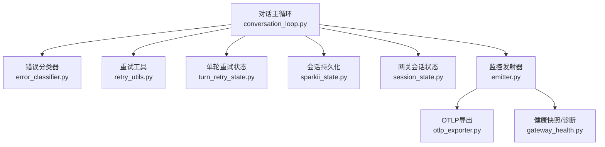
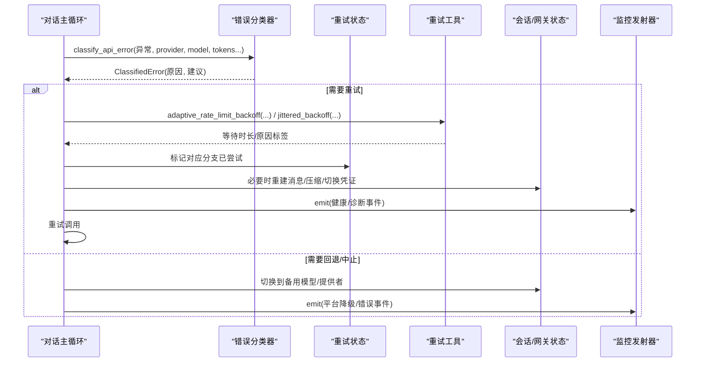
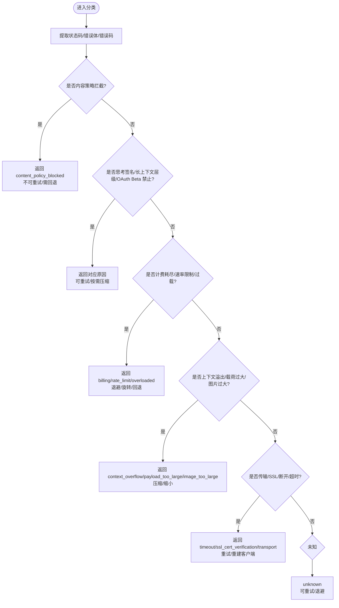
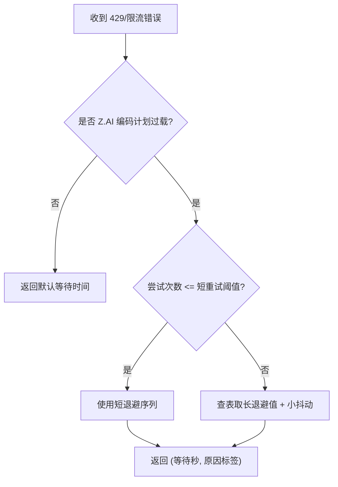
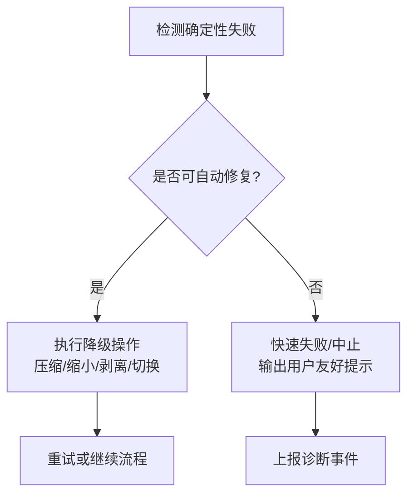
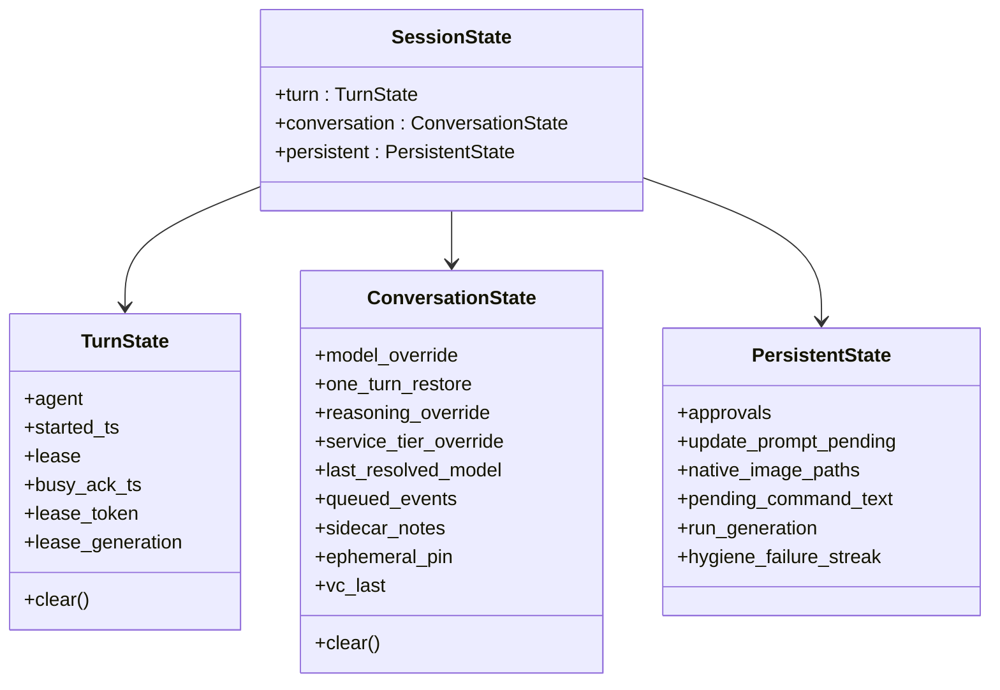
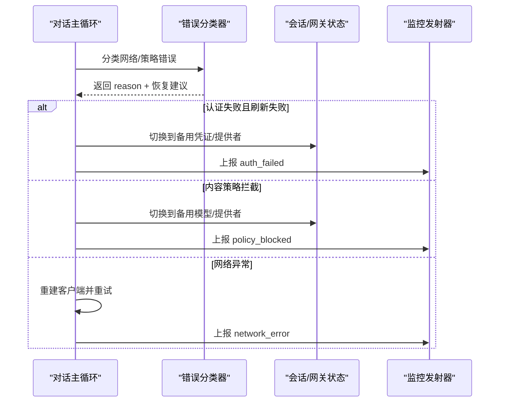
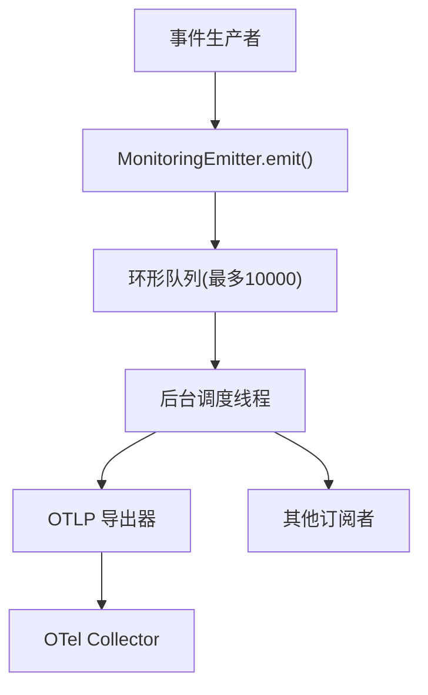
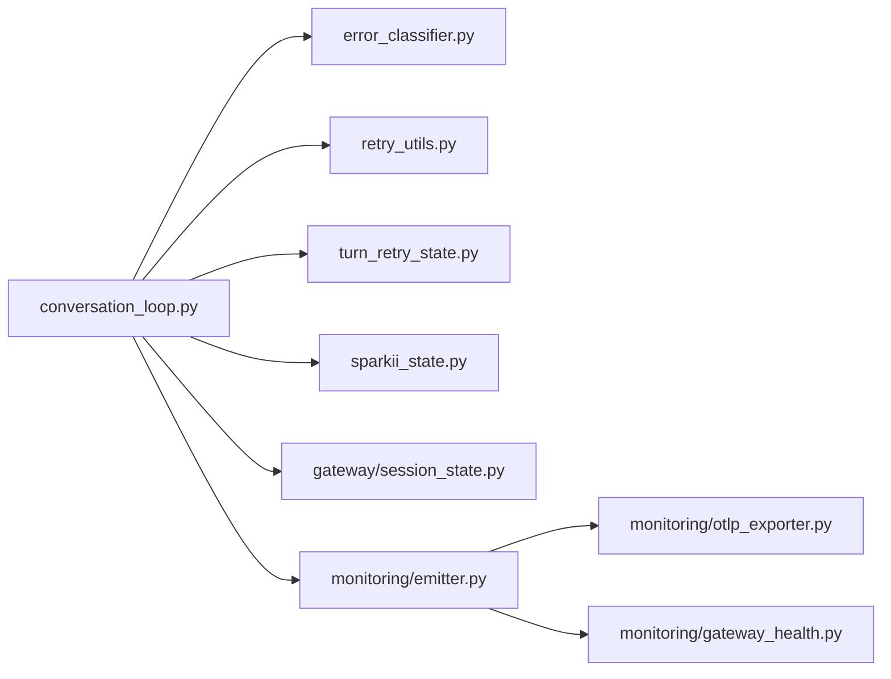

# 错误处理与恢复

<cite>
**本文引用的文件**
- [agent/errors.py](file://agent/errors.py)
- [agent/retry_utils.py](file://agent/retry_utils.py)
- [agent/error_classifier.py](file://agent/error_classifier.py)
- [agent/turn_retry_state.py](file://agent/turn_retry_state.py)
- [agent/conversation_loop.py](file://agent/conversation_loop.py)
- [sparkii_state.py](file://sparkii_state.py)
- [gateway/session_state.py](file://gateway/session_state.py)
- [agent/monitoring/emitter.py](file://agent/monitoring/emitter.py)
- [agent/monitoring/events.py](file://agent/monitoring/events.py)
- [agent/monitoring/gateway_health.py](file://agent/monitoring/gateway_health.py)
- [agent/monitoring/otlp_exporter.py](file://agent/monitoring/otlp_exporter.py)
</cite>

## 目录
1. [简介](#简介)
2. [项目结构](#项目结构)
3. [核心组件](#核心组件)
4. [架构总览](#架构总览)
5. [详细组件分析](#详细组件分析)
6. [依赖关系分析](#依赖关系分析)
7. [性能考量](#性能考量)
8. [故障排查指南](#故障排查指南)
9. [结论](#结论)
10. [附录](#附录)

## 简介
本文件系统化梳理该仓库的错误处理与恢复机制，覆盖异常分类、重试策略（含指数退避与抖动）、熔断式降级、会话状态恢复、数据一致性与事务管理、网络异常与服务降级、故障转移、监控告警与可观测性、用户友好提示与引导，以及生产环境排障经验。目标是让读者既能理解整体设计，也能定位到具体实现位置进行二次开发或问题诊断。

## 项目结构
围绕“错误处理与恢复”的关键代码分布在以下模块：
- 异常定义与基础错误类型：agent/errors.py
- 重试与退避：agent/retry_utils.py
- 错误分类与恢复建议：agent/error_classifier.py
- 单轮重试状态机：agent/turn_retry_state.py
- 对话主循环（集成重试/压缩/回退）：agent/conversation_loop.py
- 会话持久化与恢复边界：sparkii_state.py
- 网关会话状态容器与生命周期：gateway/session_state.py
- 监控事件发射器与导出：agent/monitoring/emitter.py, agent/monitoring/events.py, agent/monitoring/gateway_health.py, agent/monitoring/otlp_exporter.py

**图表来源**
- [agent/conversation_loop.py:1-200](file://agent/conversation_loop.py#L1-L200)
- [agent/error_classifier.py:624-718](file://agent/error_classifier.py#L624-L718)
- [agent/retry_utils.py:90-128](file://agent/retry_utils.py#L90-L128)
- [agent/turn_retry_state.py:32-89](file://agent/turn_retry_state.py#L32-L89)
- [sparkii_state.py:114-157](file://sparkii_state.py#L114-L157)
- [gateway/session_state.py:51-178](file://gateway/session_state.py#L51-L178)
- [agent/monitoring/emitter.py:36-118](file://agent/monitoring/emitter.py#L36-L118)
- [agent/monitoring/otlp_exporter.py:107-133](file://agent/monitoring/otlp_exporter.py#L107-L133)
- [agent/monitoring/gateway_health.py:210-291](file://agent/monitoring/gateway_health.py#L210-L291)

**章节来源**
- [agent/conversation_loop.py:1-200](file://agent/conversation_loop.py#L1-L200)
- [agent/error_classifier.py:1-120](file://agent/error_classifier.py#L1-L120)
- [agent/retry_utils.py:1-209](file://agent/retry_utils.py#L1-L209)
- [agent/turn_retry_state.py:1-94](file://agent/turn_retry_state.py#L1-L94)
- [sparkii_state.py:1-200](file://sparkii_state.py#L1-L200)
- [gateway/session_state.py:1-178](file://gateway/session_state.py#L1-L178)
- [agent/monitoring/emitter.py:1-212](file://agent/monitoring/emitter.py#L1-L212)
- [agent/monitoring/events.py:1-87](file://agent/monitoring/events.py#L1-L87)
- [agent/monitoring/gateway_health.py:1-470](file://agent/monitoring/gateway_health.py#L1-L470)
- [agent/monitoring/otlp_exporter.py:1-271](file://agent/monitoring/otlp_exporter.py#L1-L271)

## 核心组件
- 异常分类体系：将 API 错误按原因（认证、计费、限流、过载、传输、上下文溢出、模型/提供者策略、格式错误等）结构化，并附带恢复动作建议（重试、压缩、轮换凭证、回退）。
- 重试与退避：提供带抖动的指数退避、针对特定供应商的自适应限流退避、以及针对特定过载场景的长退避表。
- 单轮重试状态：以一次性开关记录各分支是否已尝试过，避免重复触发同一修复路径。
- 会话状态与恢复：在会话级和网关级维护不同生命周期的状态，确保边界重置与跨进程租约安全。
- 监控与告警：无阻塞的事件发射器、内容脱敏的健康快照、OTLP 导出，用于可观测与告警。

**章节来源**
- [agent/error_classifier.py:22-120](file://agent/error_classifier.py#L22-L120)
- [agent/retry_utils.py:38-128](file://agent/retry_utils.py#L38-L128)
- [agent/turn_retry_state.py:32-89](file://agent/turn_retry_state.py#L32-L89)
- [gateway/session_state.py:51-178](file://gateway/session_state.py#L51-L178)
- [agent/monitoring/emitter.py:36-118](file://agent/monitoring/emitter.py#L36-L118)

## 架构总览
下图展示一次 API 调用失败后的端到端处理流程：从对话主循环捕获异常，经分类器决定恢复策略，结合重试状态与退避策略执行重试/压缩/回退；同时通过监控发射器上报健康与诊断事件。

**图表来源**
- [agent/conversation_loop.py:1-200](file://agent/conversation_loop.py#L1-L200)
- [agent/error_classifier.py:624-718](file://agent/error_classifier.py#L624-L718)
- [agent/retry_utils.py:162-209](file://agent/retry_utils.py#L162-L209)
- [agent/turn_retry_state.py:32-89](file://agent/turn_retry_state.py#L32-L89)
- [agent/monitoring/emitter.py:53-118](file://agent/monitoring/emitter.py#L53-L118)

## 详细组件分析

### 异常分类与恢复建议
- 分类维度：认证失败、计费耗尽、速率限制、上游限流、服务过载、服务器错误、超时、SSL/TLS 证书验证失败、上下文溢出、载荷过大、图片过大、模型不存在、提供者策略拦截、内容策略拦截、格式错误、多模态工具内容不支持、思考签名错误、长上下文层级门控、OAuth 长上下文 Beta 禁止、llama.cpp 语法模式不匹配等。
- 恢复建议：是否可重试、是否需要压缩上下文、是否轮换凭证、是否回退到其他模型/提供者。
- 关键入口：classify_api_error 函数，按优先级顺序匹配特殊模式、HTTP 状态码、错误码、消息文本、传输错误类型等。

**图表来源**
- [agent/error_classifier.py:624-718](file://agent/error_classifier.py#L624-L718)
- [agent/error_classifier.py:719-800](file://agent/error_classifier.py#L719-L800)

**章节来源**
- [agent/error_classifier.py:22-120](file://agent/error_classifier.py#L22-L120)
- [agent/error_classifier.py:624-718](file://agent/error_classifier.py#L624-L718)
- [agent/error_classifier.py:719-800](file://agent/error_classifier.py#L719-L800)

### 重试策略与指数退避
- 通用退避：jittered_backoff 提供基于尝试次数的指数退避，加入随机抖动以避免并发风暴。
- 自适应限流退避：adaptive_rate_limit_backoff 对特定供应商（如 Z.AI Coding Plan GLM-5.2）采用短重试后转入长退避表（30/60/90/120 秒），并控制抖动比例。
- 重试上限：zai_coding_overload_retry_ceiling 计算达到完整长退避所需的最大尝试次数，避免提前放弃。
- Retry-After 解析：parse_retry_after_seconds 支持数值与 HTTP-date，统一为秒数。

**图表来源**
- [agent/retry_utils.py:38-128](file://agent/retry_utils.py#L38-L128)
- [agent/retry_utils.py:142-209](file://agent/retry_utils.py#L142-L209)

**章节来源**
- [agent/retry_utils.py:38-128](file://agent/retry_utils.py#L38-L128)
- [agent/retry_utils.py:142-209](file://agent/retry_utils.py#L142-L209)

### 熔断器模式与服务降级
- 熔断思想体现在“快速失败与降级”：当检测到确定性失败（如 SSL 证书验证失败、内容策略拦截、请求格式错误）时，不再浪费重试预算，直接回退或中止。
- 降级路径：根据分类结果选择压缩上下文、缩小图片、剥离多模态工具内容、切换模型/提供者、关闭 Beta 特性等。
- 实施点：错误分类器返回 should_compress/should_rotate_credential/should_fallback 等标志，由主循环驱动相应降级逻辑。

**图表来源**
- [agent/error_classifier.py:719-800](file://agent/error_classifier.py#L719-L800)
- [agent/conversation_loop.py:1-200](file://agent/conversation_loop.py#L1-L200)

**章节来源**
- [agent/error_classifier.py:719-800](file://agent/error_classifier.py#L719-L800)
- [agent/conversation_loop.py:1-200](file://agent/conversation_loop.py#L1-L200)

### 会话状态恢复、数据一致性与事务管理
- 会话恢复边界：sparkii_state.py 提供会话恢复的安全上限（max_resume_messages）与导出上限（max_export_messages），防止超大会话导致内存压力。
- 一致性保障：WAL 模式、压缩触发的会话拆分、父会话链、锁持有者进程存活检查，避免死锁与资源泄露。
- 网关会话状态：gateway/session_state.py 将 turn/conversation/persistent 三类状态集中管理，明确生命周期与清理时机，避免边界漂移与竞态。

**图表来源**
- [gateway/session_state.py:51-178](file://gateway/session_state.py#L51-L178)

**章节来源**
- [sparkii_state.py:114-157](file://sparkii_state.py#L114-L157)
- [sparkii_state.py:160-200](file://sparkii_state.py#L160-L200)
- [gateway/session_state.py:51-178](file://gateway/session_state.py#L51-L178)

### 网络异常、服务降级与故障转移
- 网络异常：识别连接/读取超时、SSL/TLS 握手失败、服务端断开等，优先走重试与客户端重建路径。
- 服务降级：当内容策略拦截或提供者策略阻止时，立即切换到备用模型/提供者，避免无效重试。
- 故障转移：认证失败且刷新失败后，进入认证失败转移链；计费耗尽则立即轮换凭证或切换账户。

**图表来源**
- [agent/error_classifier.py:719-800](file://agent/error_classifier.py#L719-L800)
- [agent/conversation_loop.py:1-200](file://agent/conversation_loop.py#L1-L200)
- [agent/monitoring/gateway_health.py:70-120](file://agent/monitoring/gateway_health.py#L70-L120)

**章节来源**
- [agent/error_classifier.py:719-800](file://agent/error_classifier.py#L719-L800)
- [agent/conversation_loop.py:1-200](file://agent/conversation_loop.py#L1-L200)
- [agent/monitoring/gateway_health.py:70-120](file://agent/monitoring/gateway_health.py#L70-L120)

### 监控告警系统与可观测性
- 发射器：MonitoringEmitter 提供 O(微秒) 的非阻塞 emit，队列满时丢弃最旧事件，保证热路径不受影响。
- 事件类型：GatewayHealthEvent、GatewayDiagnosticEvent、CronExecutionEvent，均为内容脱敏的结构化事件。
- 健康快照：build_gateway_health_snapshot 聚合网关与平台指标，生成 metrics 与 events。
- OTLP 导出：OTLPStreamer 将事件映射为 OpenTelemetry Span，支持配置化头部与环境变量注入。

**图表来源**
- [agent/monitoring/emitter.py:36-118](file://agent/monitoring/emitter.py#L36-L118)
- [agent/monitoring/events.py:19-80](file://agent/monitoring/events.py#L19-L80)
- [agent/monitoring/gateway_health.py:210-291](file://agent/monitoring/gateway_health.py#L210-L291)
- [agent/monitoring/otlp_exporter.py:107-133](file://agent/monitoring/otlp_exporter.py#L107-L133)

**章节来源**
- [agent/monitoring/emitter.py:36-118](file://agent/monitoring/emitter.py#L36-L118)
- [agent/monitoring/events.py:19-80](file://agent/monitoring/events.py#L19-L80)
- [agent/monitoring/gateway_health.py:210-291](file://agent/monitoring/gateway_health.py#L210-L291)
- [agent/monitoring/otlp_exporter.py:107-133](file://agent/monitoring/otlp_exporter.py#L107-L133)

### 用户友好的错误提示与故障恢复引导
- 确定性错误快速失败：SSL 证书验证失败、内容策略拦截、请求格式错误等，避免长时间静默重试。
- 可操作指引：分类结果包含 message 字段，结合回退/压缩/轮换凭证等动作，向用户提供明确的修复步骤。
- 日志与事件：GatewayDiagnosticLogHandler 将网关警告/错误桥接为诊断事件，便于集中检索与告警。

**章节来源**
- [agent/error_classifier.py:719-800](file://agent/error_classifier.py#L719-L800)
- [agent/monitoring/gateway_health.py:427-459](file://agent/monitoring/gateway_health.py#L427-L459)

## 依赖关系分析
- conversation_loop 依赖 error_classifier、retry_utils、turn_retry_state、sparkii_state、gateway/session_state 与 monitoring emitter。
- error_classifier 提供统一的恢复建议，被主循环消费。
- retry_utils 提供退避策略，被主循环在重试前调用。
- turn_retry_state 作为一次性开关，避免重复触发同一修复分支。
- sparkii_state 与 gateway/session_state 分别负责会话持久化与网关会话状态的生命周期管理。
- monitoring emitter 作为松耦合出口，将健康与诊断事件分发给 OTLP 等订阅者。

**图表来源**
- [agent/conversation_loop.py:1-200](file://agent/conversation_loop.py#L1-L200)
- [agent/error_classifier.py:624-718](file://agent/error_classifier.py#L624-L718)
- [agent/retry_utils.py:90-128](file://agent/retry_utils.py#L90-L128)
- [agent/turn_retry_state.py:32-89](file://agent/turn_retry_state.py#L32-L89)
- [sparkii_state.py:114-157](file://sparkii_state.py#L114-L157)
- [gateway/session_state.py:51-178](file://gateway/session_state.py#L51-L178)
- [agent/monitoring/emitter.py:36-118](file://agent/monitoring/emitter.py#L36-L118)
- [agent/monitoring/otlp_exporter.py:107-133](file://agent/monitoring/otlp_exporter.py#L107-L133)
- [agent/monitoring/gateway_health.py:210-291](file://agent/monitoring/gateway_health.py#L210-L291)

**章节来源**
- [agent/conversation_loop.py:1-200](file://agent/conversation_loop.py#L1-L200)
- [agent/error_classifier.py:624-718](file://agent/error_classifier.py#L624-L718)
- [agent/retry_utils.py:90-128](file://agent/retry_utils.py#L90-L128)
- [agent/turn_retry_state.py:32-89](file://agent/turn_retry_state.py#L32-L89)
- [sparkii_state.py:114-157](file://sparkii_state.py#L114-L157)
- [gateway/session_state.py:51-178](file://gateway/session_state.py#L51-L178)
- [agent/monitoring/emitter.py:36-118](file://agent/monitoring/emitter.py#L36-L118)
- [agent/monitoring/otlp_exporter.py:107-133](file://agent/monitoring/otlp_exporter.py#L107-L133)
- [agent/monitoring/gateway_health.py:210-291](file://agent/monitoring/gateway_health.py#L210-L291)

## 性能考量
- 非阻塞监控：emitter.emit 保证热路径不阻塞，队列满时丢弃最旧事件，避免背压影响主流程。
- 退避抖动：jittered_backoff 引入随机抖动，降低并发重试风暴风险。
- 自适应退避：对特定过载场景使用长退避表，减少无效重试与资源消耗。
- 会话大小限制：max_resume_messages/max_export_messages 防止超大会话导致的内存压力。
- 状态隔离：SessionState 将不同生命周期状态分离，减少全局状态竞争与误清风险。

[本节为通用性能指导，不直接分析具体文件]

## 故障排查指南
- 快速定位错误类型：查看 error_classifier 的分类结果与 message，结合 status_code 与错误码判断根因。
- 检查重试策略：确认是否命中自适应退避或长退避表，核对尝试次数与上限。
- 监控事件：通过 GatewayDiagnosticEvent 与 GatewayHealthEvent 检索平台状态变化与错误分类。
- 会话恢复：若出现超大会话恢复失败，检查 max_resume_messages 配置与会话拆分情况。
- 网络/SSL：若频繁出现 SSL 握手失败或连接重置，检查代理/CA 证书与网络稳定性。
- 用户提示：对于确定性错误（如内容策略拦截、SSL 证书验证失败），应尽快给出可操作的修复指引。

**章节来源**
- [agent/error_classifier.py:719-800](file://agent/error_classifier.py#L719-L800)
- [agent/retry_utils.py:162-209](file://agent/retry_utils.py#L162-L209)
- [agent/monitoring/gateway_health.py:70-120](file://agent/monitoring/gateway_health.py#L70-L120)
- [sparkii_state.py:114-157](file://sparkii_state.py#L114-L157)

## 结论
该仓库构建了完善的错误处理与恢复体系：以结构化分类为核心，结合智能重试与退避、熔断式降级、会话状态恢复与一致性保障、以及强大的监控与可观测性能力。生产环境中可通过分类结果与监控事件快速定位问题，利用自适应退避与降级策略提升系统韧性，并通过用户友好提示降低故障对用户的影响。

[本节为总结性内容，不直接分析具体文件]

## 附录
- 关键实现位置参考：
  - 异常定义：agent/errors.py
  - 重试与退避：agent/retry_utils.py
  - 错误分类：agent/error_classifier.py
  - 单轮重试状态：agent/turn_retry_state.py
  - 对话主循环：agent/conversation_loop.py
  - 会话持久化：sparkii_state.py
  - 网关会话状态：gateway/session_state.py
  - 监控发射器：agent/monitoring/emitter.py
  - 事件类型：agent/monitoring/events.py
  - 健康快照：agent/monitoring/gateway_health.py
  - OTLP 导出：agent/monitoring/otlp_exporter.py

[本节为索引性内容，不直接分析具体文件]