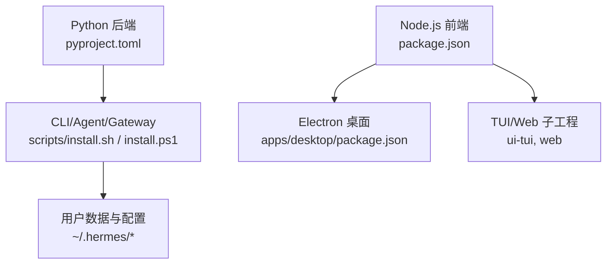
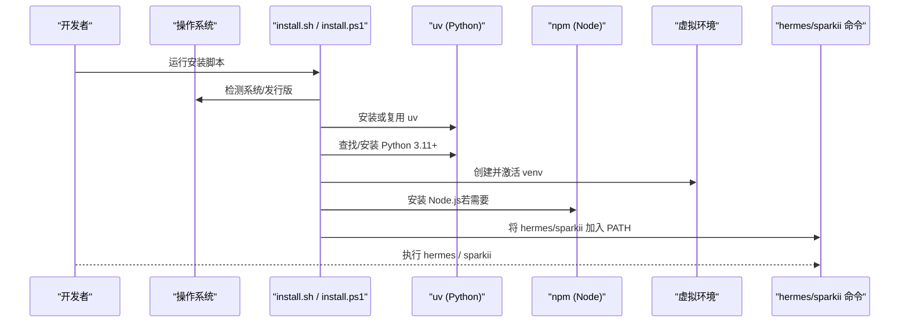
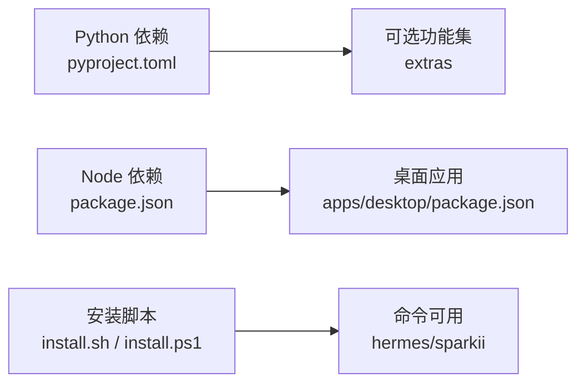

# 开发环境搭建

<cite>
**本文引用的文件**
- [README.md](file://README.md)
- [package.json](file://package.json)
- [pyproject.toml](file://pyproject.toml)
- [setup.py](file://setup.py)
- [scripts/install.sh](file://scripts/install.sh)
- [scripts/install.ps1](file://scripts/install.ps1)
- [CONTRIBUTING.md](file://CONTRIBUTING.md)
- [AGENTS.md](file://AGENTS.md)
- [nix/devShell.nix](file://nix/devShell.nix)
- [apps/desktop/package.json](file://apps/desktop/package.json)
</cite>

## 目录
1. [简介](#简介)
2. [项目结构](#项目结构)
3. [核心组件](#核心组件)
4. [架构总览](#架构总览)
5. [详细组件分析](#详细组件分析)
6. [依赖关系分析](#依赖关系分析)
7. [性能注意事项](#性能注意事项)
8. [故障排除指南](#故障排除指南)
9. [结论](#结论)
10. [附录](#附录)

## 简介
本指南面向首次接触该项目的开发者，目标是帮助你在 Windows、macOS、Linux 上从零开始搭建完整的本地开发环境。内容涵盖：
- Python 与 Node.js 的版本要求与兼容性
- 虚拟环境与包管理器的使用（uv、npm）
- 安装流程（一键脚本与手动方式）
- 开发工具配置（IDE、调试器、代码格式化）
- 不同操作系统的具体步骤
- 常见问题与排错方法
- 为初学者提供的逐步指导

## 项目结构
该项目包含 Python 后端（Agent/Gateway/CLI）、Node.js 前端（桌面应用、TUI、网站）以及跨平台安装脚本。关键入口与职责如下：
- Python 侧：通过 pyproject.toml 声明依赖与可选功能集；提供跨平台安装脚本 install.sh（Linux/macOS/WSL/Termux）与 install.ps1（Windows）。
- Node.js 侧：根 package.json 定义工作区与脚本；apps/desktop 为 Electron 桌面端；ui-tui/web 等子包用于 TUI 与 Web。
- 构建与发布：setup.py 对 wheel/sdist 构建进行保护，避免非 Nix 环境下误构建。

图表来源
- [pyproject.toml:1-155](file://pyproject.toml#L1-L155)
- [package.json:1-81](file://package.json#L1-L81)
- [apps/desktop/package.json:1-65](file://apps/desktop/package.json#L1-L65)

章节来源
- [pyproject.toml:1-155](file://pyproject.toml#L1-L155)
- [package.json:1-81](file://package.json#L1-L81)
- [apps/desktop/package.json:1-65](file://apps/desktop/package.json#L1-L65)

## 核心组件
- Python 运行时与依赖
  - Python 版本：>=3.11,<3.14（受限于部分 Rust 依赖的 wheel 支持）
  - 包管理器：推荐使用 uv（快速、可管理 Python 版本与依赖）
  - 依赖策略：核心依赖精确锁定，可选依赖通过 extras 按需启用（如 dev、web、messaging 等）
- Node.js 运行时与依赖
  - Node 版本：>=22.22.0（根 package.json engines 约束）
  - npm 版本：满足 <11.10.0 || >=11.17.0（根 package.json engines 约束）
  - 工作区：apps/*、ui-tui、web、tests-js 等通过 npm workspaces 统一管理
- 桌面应用
  - Electron 应用位于 apps/desktop，其 package.json 指定 Node 引擎 >=18.0.0（与根仓库 Node 版本要求一致）
- 安装脚本
  - Linux/macOS/WSL/Termux：scripts/install.sh
  - Windows：scripts/install.ps1

章节来源
- [pyproject.toml:1-155](file://pyproject.toml#L1-L155)
- [package.json:65-68](file://package.json#L65-L68)
- [apps/desktop/package.json:10-12](file://apps/desktop/package.json#L10-L12)
- [scripts/install.sh:59-61](file://scripts/install.sh#L59-L61)
- [scripts/install.ps1:378-391](file://scripts/install.ps1#L378-L391)

## 架构总览
下图展示了“安装与启动”的关键路径：从系统检测、Python/Node 准备、虚拟环境创建、依赖安装到命令可用。

图表来源
- [scripts/install.sh:549-653](file://scripts/install.sh#L549-L653)
- [scripts/install.ps1:689-735](file://scripts/install.ps1#L689-L735)
- [package.json:13-26](file://package.json#L13-L26)

## 详细组件分析

### Python 环境搭建（推荐：uv + venv）
- 版本要求
  - Python：>=3.11,<3.14（pyproject.toml requires-python）
  - 包管理器：uv（推荐，自动管理 Python 与依赖）
- 推荐流程
  - 使用安装脚本自动完成 uv、Python、venv、依赖安装与命令链接
  - 或使用 uv 手动创建 venv 并安装 editable 模式与 extras
- 可选依赖
  - 开发：dev
  - Web/Dashboard：web
  - 消息通道：messaging
  - MCP/MCP 相关：mcp
  - 其他能力：根据需求选择 extras（如 voice、wake、google 等）

章节来源
- [pyproject.toml:8-15](file://pyproject.toml#L8-L15)
- [pyproject.toml:157-352](file://pyproject.toml#L157-L352)
- [CONTRIBUTING.md:105-172](file://CONTRIBUTING.md#L105-L172)
- [AGENTS.md:252-261](file://AGENTS.md#L252-L261)

### Node.js 环境搭建（npm 工作区）
- 版本要求
  - Node：>=22.22.0（根 package.json engines.node）
  - npm：<11.10.0 || >=11.17.0（根 package.json engines.npm）
- 工作区与脚本
  - 根 package.json 定义了 workspaces 与常用脚本（install:root/install:web/install:tui/install:desktop 等）
  - 桌面应用 apps/desktop 有自己的 package.json，Node 引擎 >=18.0.0
- 建议
  - 使用根 npm 安装工作区依赖
  - 在 apps/desktop 内执行桌面专用脚本（build、dist、test 等）

章节来源
- [package.json:6-26](file://package.json#L6-L26)
- [package.json:65-68](file://package.json#L65-L68)
- [apps/desktop/package.json:10-65](file://apps/desktop/package.json#L10-L65)

### 安装脚本详解（跨平台）
- Linux/macOS/WSL/Termux
  - scripts/install.sh 负责：系统检测、uv 安装、Python 安装/发现、Git 检查、Node 检查、创建 venv、安装 Python/Node 依赖、配置命令链接
  - 支持参数控制是否创建 venv、是否跳过浏览器依赖、是否安装桌面构建产物等
- Windows
  - scripts/install.ps1 负责：PowerShell 环境初始化、uv 安装、Python/Node 安装、PATH 处理、8.3 短路径修复、证书提示等
  - 默认安装路径位于 %LOCALAPPDATA%\hermes

章节来源
- [scripts/install.sh:45-199](file://scripts/install.sh#L45-L199)
- [scripts/install.sh:503-781](file://scripts/install.sh#L503-L781)
- [scripts/install.ps1:15-75](file://scripts/install.ps1#L15-L75)
- [scripts/install.ps1:378-391](file://scripts/install.ps1#L378-L391)
- [scripts/install.ps1:689-735](file://scripts/install.ps1#L689-L735)

### 构建与发布保护（setup.py）
- setup.py 对 bdist_wheel/sdist 构建进行保护，仅在 Nix 构建环境中允许构建制品
- 开发时请使用可编辑安装（uv sync 或 pip install -e .），不要直接构建 wheel/sdist

章节来源
- [setup.py:1-75](file://setup.py#L1-L75)

### 桌面应用（Electron）
- apps/desktop/package.json 定义了桌面应用的脚本、依赖与打包配置
- 开发流程：安装依赖后，可使用 dev/build/dist 等脚本进行开发与打包
- 注意：桌面应用有独立的 Node 引擎要求（>=18.0.0），与根仓库 Node 版本兼容

章节来源
- [apps/desktop/package.json:13-65](file://apps/desktop/package.json#L13-L65)
- [apps/desktop/package.json:164-275](file://apps/desktop/package.json#L164-L275)

### Nix 开发壳（可选）
- nix/devShell.nix 提供统一开发环境，集成 uv、playwright-test、cage、ghostty 等工具
- 适合希望在 Nix 环境中获得一致体验的开发者

章节来源
- [nix/devShell.nix:1-65](file://nix/devShell.nix#L1-L65)

## 依赖关系分析
- Python 依赖
  - 核心依赖：openai、httpx、rich、tenacity、pydantic、fastapi、uvicorn、Pillow 等
  - 可选依赖：按功能划分（dev、web、messaging、mcp、voice、wake、google 等）
  - 安全与稳定性：严格上限约束与精确版本锁定，减少供应链风险
- Node.js 依赖
  - 根工作区：electron、agent-browser 等
  - 桌面应用：React、Vite、Electron Builder、Xterm 等
- 安装顺序
  - 先确保 Python 与 uv 可用，再安装 Python 依赖
  - 再确保 Node.js 与 npm 可用，最后安装 Node.js 依赖

图表来源
- [pyproject.toml:19-155](file://pyproject.toml#L19-L155)
- [pyproject.toml:157-352](file://pyproject.toml#L157-L352)
- [package.json:37-64](file://package.json#L37-L64)
- [apps/desktop/package.json:66-163](file://apps/desktop/package.json#L66-L163)

章节来源
- [pyproject.toml:19-155](file://pyproject.toml#L19-L155)
- [pyproject.toml:157-352](file://pyproject.toml#L157-L352)
- [package.json:37-64](file://package.json#L37-L64)
- [apps/desktop/package.json:66-163](file://apps/desktop/package.json#L66-L163)

## 性能注意事项
- 使用 uv 管理 Python 依赖，提升安装与解析速度
- 仅安装必要的 extras，避免不必要的依赖体积与编译时间
- Node.js 依赖通过 npm workspaces 一次性安装，减少重复下载
- 桌面应用构建时合理设置内存限制（参考 apps/desktop 脚本中的 NODE_OPTIONS）

[本节为通用指导，不直接分析具体文件]

## 故障排除指南
- Windows Defender/杀毒软件误报 uv.exe
  - 现象：uv.exe 被隔离或阻止
  - 解决：验证签名与哈希，添加白名单文件夹（而非文件哈希）
  - 参考：README 中关于 Windows 防病毒误报的处理说明
- TLS/证书问题（npm/electron）
  - 现象：npm 安装失败，提示证书链错误
  - 解决：配置企业根 CA 或临时关闭 strict-ssl（仅安装阶段）
  - 参考：install.ps1 中的证书提示逻辑
- Git 未安装或不可用
  - 现象：安装脚本无法克隆仓库
  - 解决：通过系统包管理器或命令行工具安装 Git
  - 参考：install.sh 的 Git 检测与自动安装逻辑
- Node/npm 版本不匹配
  - 现象：EBADENGINE 或安装失败
  - 解决：升级/降级 Node 与 npm 至 package.json engines 范围
  - 参考：根 package.json engines 约束
- Python 版本不兼容
  - 现象：Rust 依赖无 cp314 wheel，导致构建失败
  - 解决：使用 Python 3.11–3.13（pyproject.toml requires-python）
  - 参考：pyproject.toml 的 requires-python 与注释说明

章节来源
- [README.md:68-101](file://README.md#L68-L101)
- [scripts/install.ps1:527-554](file://scripts/install.ps1#L527-L554)
- [scripts/install.sh:655-781](file://scripts/install.sh#L655-L781)
- [package.json:65-68](file://package.json#L65-L68)
- [pyproject.toml:8-15](file://pyproject.toml#L8-L15)

## 结论
通过本指南，你可以在 Windows、macOS、Linux 上快速搭建稳定的开发环境。推荐使用官方安装脚本以自动化完成 uv、Python、Node 与依赖的安装；如需更细粒度控制，可参考手动流程。遵循版本约束与依赖策略，能显著降低安装与运行时的不确定性。遇到问题时，优先查看脚本输出与 README/Contributing 文档中的排错指引。

[本节为总结性内容，不直接分析具体文件]

## 附录

### 分步安装清单（初学者友好）
- 前置条件
  - 安装 Git（各系统包管理器或命令行工具）
  - 确认网络可达（PyPI、npm registry、GitHub）
- Linux/macOS/WSL/Termux
  - 运行安装脚本（curl | bash）
  - 刷新 shell（source ~/.bashrc 或 ~/.zshrc）
  - 验证命令可用（hermes --help）
- Windows
  - 在 PowerShell 中运行安装脚本（irm | iex）
  - 如遇杀毒软件拦截，按 README 指引添加白名单
  - 验证命令可用（sparkii --help 或 hermes --help）
- Node.js 与前端
  - 在根目录执行 npm install（安装工作区依赖）
  - 进入 apps/desktop 执行桌面相关脚本（dev/build/dist）

章节来源
- [README.md:35-66](file://README.md#L35-L66)
- [scripts/install.sh:45-199](file://scripts/install.sh#L45-L199)
- [scripts/install.ps1:15-75](file://scripts/install.ps1#L15-L75)
- [package.json:13-26](file://package.json#L13-L26)

### IDE 与调试器配置建议
- Python
  - 使用 VS Code 或 PyCharm，解释器指向 venv 中的 Python
  - 调试器：debugpy（dev extra 已包含）
  - 运行入口：run_agent.py 或 hermes CLI
- Node.js
  - 使用 VS Code 或 WebStorm，工作区根目录为仓库根
  - 调试器：内置 Node 调试器或 Chrome DevTools（Electron 应用）
  - 桌面应用：apps/desktop 的 profile:main 脚本支持 --inspect 调试
- 代码格式化与检查
  - Python：ruff（pyproject.toml 中已配置）
  - TypeScript/JS：eslint、prettier（各子工程 package.json 中脚本）

章节来源
- [pyproject.toml:175-175](file://pyproject.toml#L175-L175)
- [apps/desktop/package.json:18-65](file://apps/desktop/package.json#L18-L65)
- [package.json:42-49](file://package.json#L42-L49)

### 常见环境变量与配置位置
- 用户数据目录：~/.hermes（或 Windows 下 %LOCALAPPDATA%\hermes）
- 配置文件：config.yaml（行为设置）、.env（仅密钥）
- 日志：~/.hermes/logs/（agent.log、errors.log、gateway.log）

章节来源
- [CONTRIBUTING.md:284-297](file://CONTRIBUTING.md#L284-L297)
- [AGENTS.md:311-314](file://AGENTS.md#L311-L314)