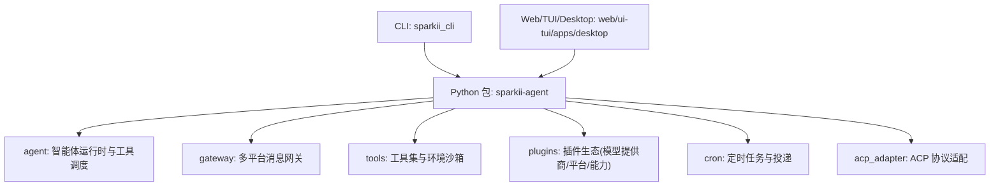
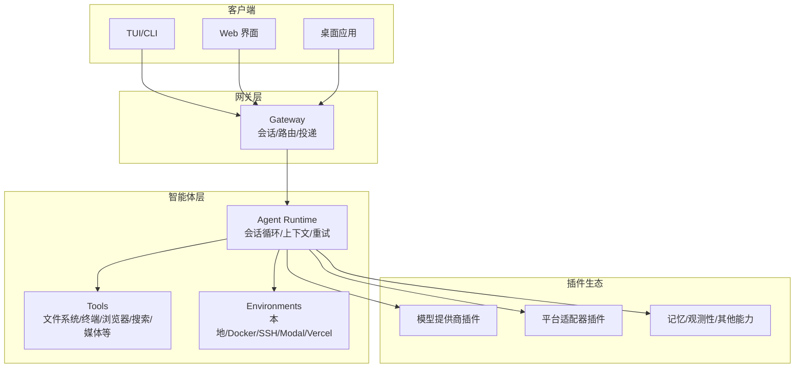
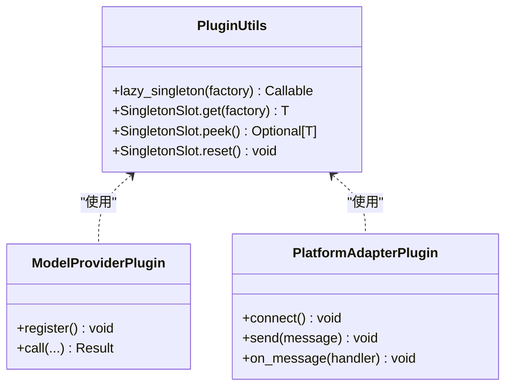
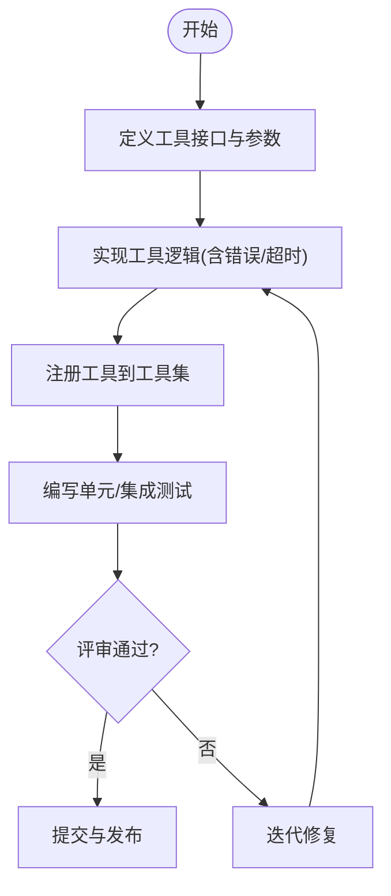
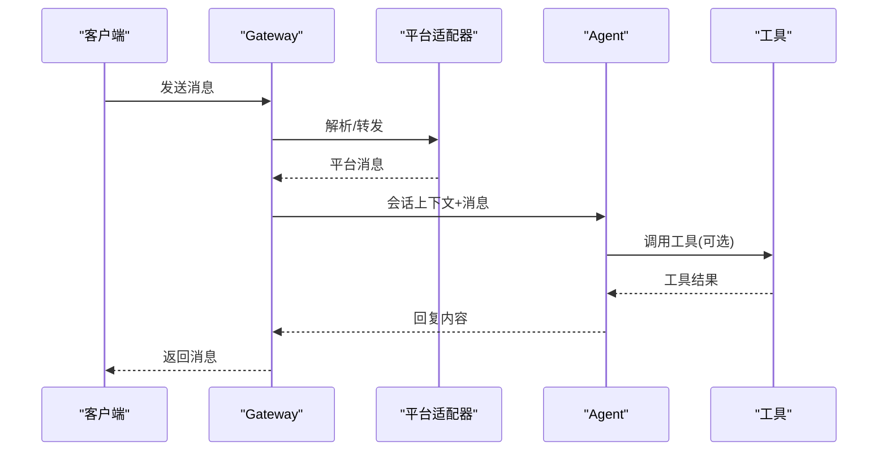
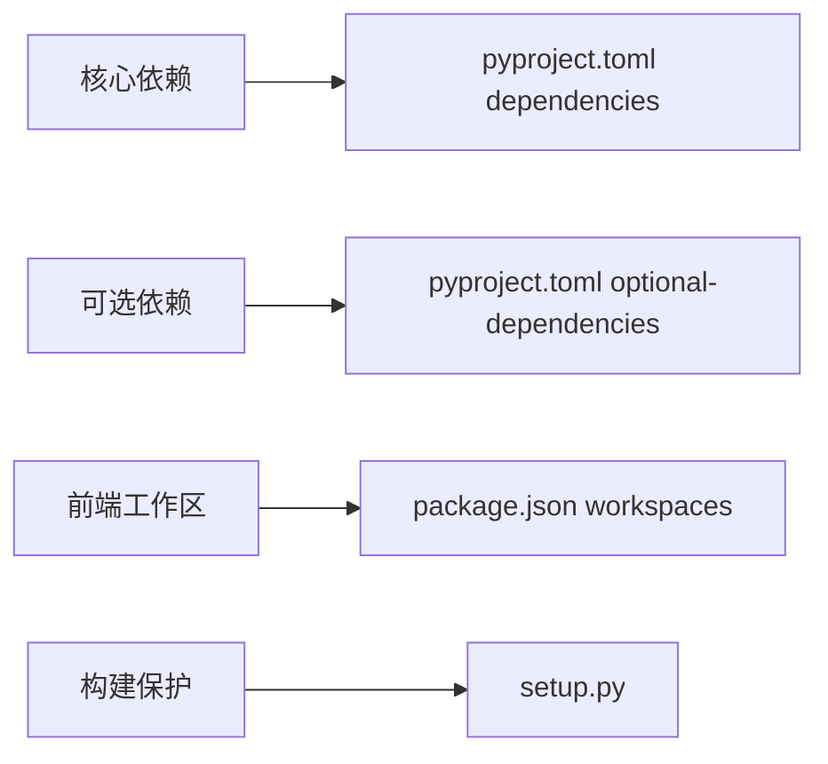

# 开发者指南

<cite>
**本文引用的文件**
- [README.md](file://README.md)
- [pyproject.toml](file://pyproject.toml)
- [setup.py](file://setup.py)
- [package.json](file://package.json)
- [plugins/plugin_utils.py](file://plugins/plugin_utils.py)
- [gateway/__init__.py](file://gateway/__init__.py)
</cite>

## 目录
1. [简介](#简介)
2. [项目结构](#项目结构)
3. [核心组件](#核心组件)
4. [架构总览](#架构总览)
5. [详细组件分析](#详细组件分析)
6. [依赖分析](#依赖分析)
7. [性能考虑](#性能考虑)
8. [故障排查指南](#故障排查指南)
9. [结论](#结论)
10. [附录](#附录)

## 简介
本指南面向希望扩展与二次开发 Sparkii Desktop（Sparkii Agent）的开发者，覆盖开发环境搭建、插件系统架构与扩展机制、工具与平台适配器开发流程、API 参考（REST/WebSocket/事件）、最佳实践与性能优化建议。文档以仓库实际代码为依据，提供可追溯的文件来源与图示，帮助不同经验水平的开发者快速上手并高质量地贡献代码。

## 项目结构
仓库采用多语言、多工作区组织：
- Python 后端与核心逻辑：agent、gateway、tools、plugins、cron、acp_adapter 等
- CLI 与启动入口：sparkii_cli、run_agent、mcp_serve 等
- Web/TUI/桌面前端：web、ui-tui、apps/desktop（Electron）
- 配置与构建：pyproject.toml、package.json、setup.py、nix 脚本
- 测试与脚本：tests、scripts

**图表来源**
- [pyproject.toml:358-401](file://pyproject.toml#L358-L401)
- [package.json:6-12](file://package.json#L6-L12)

**章节来源**
- [pyproject.toml:358-401](file://pyproject.toml#L358-L401)
- [package.json:6-12](file://package.json#L6-L12)

## 核心组件
- 智能体运行时与工具调度：位于 agent 模块，负责会话循环、上下文压缩、工具执行、重试与错误分类等。
- 多平台消息网关：gateway 提供统一会话管理、上下文注入、投递路由与平台能力隔离。
- 工具与环境：tools 提供丰富的内置工具与环境沙箱（本地/Docker/SSH/Modal/Vercel/Singularity）。
- 插件系统：plugins 提供模型提供商、平台适配器、记忆、图像/视频生成、观测性等扩展点。
- 定时任务：cron 提供计划任务与跨平台投递。
- ACP 适配：acp_adapter 暴露 ACP 协议接口，便于外部系统集成。

**章节来源**
- [gateway/__init__.py:1-36](file://gateway/__init__.py#L1-L36)

## 架构总览
整体由“CLI/前端 → Gateway → Agent → Tools/Plugins”构成，支持多种消息平台与模型提供商，具备可扩展的工具与环境体系。

**图表来源**
- [pyproject.toml:358-401](file://pyproject.toml#L358-L401)
- [gateway/__init__.py:1-36](file://gateway/__init__.py#L1-L36)

## 详细组件分析

### 开发环境搭建
- 使用官方安装器一键安装（Linux/macOS/WSL2/Termux/Windows），自动处理 uv、Python 3.11、Node.js、Git Bash 等依赖。
- 开发模式推荐 editable install：uv sync 或 pip install -e .，避免直接构建 wheel/sdist（setup.py 在非 Nix 环境下会阻止打包）。
- Node 工作区：根 package.json 定义了 workspaces，包含 web、ui-tui、apps/desktop 等子工程。

步骤要点
- 安装与初始化：遵循 README 中的 Quick Install 与 Getting Started。
- 开发依赖：安装 dev extras，运行测试脚本。
- 前端工作区：在 apps/desktop、web、ui-tui 中分别安装依赖并启动。

**章节来源**
- [README.md:35-118](file://README.md#L35-L118)
- [README.md:217-246](file://README.md#L217-L246)
- [setup.py:1-75](file://setup.py#L1-L75)
- [package.json:6-27](file://package.json#L6-L27)

### 插件系统架构与扩展机制
插件系统围绕“模型提供商、平台适配器、能力扩展（记忆/观测/图像/视频等）”展开，通过统一的注册与发现机制加载。

- 并发安全与单例：插件应使用 plugin_utils 提供的 lazy_singleton 与 SingletonSlot，避免多线程下的竞态与资源泄漏。
- 插件目录：plugins 下按功能域组织（model-providers、platforms、memory、observability、image_gen、video_gen 等），每个插件通常包含 __init__.py、plugin.yaml 与实现模块。
- 加载与发现：通过 setuptools 包发现与 pyproject 配置，结合运行时懒加载策略（部分依赖通过 tools/lazy_deps 按需安装）。

**图表来源**
- [plugins/plugin_utils.py:1-136](file://plugins/plugin_utils.py#L1-L136)

**章节来源**
- [plugins/plugin_utils.py:1-136](file://plugins/plugin_utils.py#L1-L136)

### 工具开发完整流程（从接口到实现与测试）
- 接口定义：在 tools 目录下新增工具模块，遵循现有工具的命名与结构约定；如需新能力，可在 environments 中增加沙箱类型。
- 实现要点：
  - 输入参数校验与输出限制：确保参数安全、结果大小可控。
  - 异步与超时：对网络/IO 操作设置合理超时与重试。
  - 错误处理：区分可恢复与不可恢复错误，记录必要上下文。
- 注册与发现：将工具纳入工具集（toolsets）并通过 CLI 暴露。
- 测试：为工具编写单元测试与集成测试，覆盖边界条件与异常路径。

[此图为概念流程图，不绑定具体源码]

### 开发新的消息平台适配器
- 位置与结构：在 plugins/platforms 下新建平台目录，包含 __init__.py、plugin.yaml 与核心实现。
- 协议实现：实现连接、发送、接收消息、错误处理与重连逻辑。
- 消息格式转换：将平台原生消息转换为内部统一格式，保证上下文与会话一致性。
- 错误处理：区分网络错误、认证失败、限流等，提供可观测日志与指标。
- 测试：模拟平台回调与消息流，验证端到端链路。

**图表来源**
- [gateway/__init__.py:1-36](file://gateway/__init__.py#L1-L36)

**章节来源**
- [gateway/__init__.py:1-36](file://gateway/__init__.py#L1-L36)

### API 参考（REST/WebSocket/事件）
- REST API：Web 仪表盘与部分 CLI 命令通过 FastAPI/Uvicorn 提供服务，上传、状态查询等接口在 web 相关模块中暴露。
- WebSocket：TUI/Gateway 通过 WebSocket 进行实时通信，支持流式输出与事件推送。
- 事件系统：Gateway 与 Agent 之间通过事件驱动的消息流传递会话状态、工具执行进度与结果。

说明
- 具体端点与事件契约请参考对应模块的实现与测试用例；本文档聚焦架构与开发指引，不粘贴具体代码片段。

**章节来源**
- [pyproject.toml:105-111](file://pyproject.toml#L105-L111)
- [pyproject.toml:316-319](file://pyproject.toml#L316-L319)

## 依赖分析
- Python 依赖：pyproject.toml 精确锁定核心依赖，optional-dependencies 按功能域拆分（messaging、voice、web、mcp 等），通过 tools/lazy_deps 实现按需安装。
- Node 依赖：package.json 定义工作区与脚本，统一前端依赖管理与审计。
- 构建保护：setup.py 在非 Nix 环境下禁止打包 wheel/sdist，防止遗漏资源。

**图表来源**
- [pyproject.toml:19-155](file://pyproject.toml#L19-L155)
- [pyproject.toml:157-352](file://pyproject.toml#L157-L352)
- [package.json:6-27](file://package.json#L6-L27)
- [setup.py:1-75](file://setup.py#L1-L75)

**章节来源**
- [pyproject.toml:19-155](file://pyproject.toml#L19-L155)
- [pyproject.toml:157-352](file://pyproject.toml#L157-L352)
- [package.json:6-27](file://package.json#L6-L27)
- [setup.py:1-75](file://setup.py#L1-L75)

## 性能考虑
- 依赖最小化：仅将每会话必需依赖放入 core，其余通过 optional-dependencies 与 lazy_deps 按需加载，减少冷启动与攻击面。
- 并发与单例：插件中使用 lazy_singleton/SingletonSlot 避免重复初始化与资源泄漏。
- 流式与缓冲：网关与 TUI 使用流式传输降低延迟；工具输出限制避免大响应阻塞。
- 沙箱隔离：根据场景选择合适的环境（本地/Docker/SSH/Modal/Vercel），控制资源与生命周期。

**章节来源**
- [plugins/plugin_utils.py:1-136](file://plugins/plugin_utils.py#L1-L136)
- [pyproject.toml:19-155](file://pyproject.toml#L19-L155)
- [pyproject.toml:157-352](file://pyproject.toml#L157-L352)

## 故障排查指南
- 安装与依赖问题：优先使用官方安装器；若出现误报（如 Windows Defender 标记 uv.exe），按 README 中的白名单与验证步骤处理。
- 构建失败：在非 Nix 环境不要直接构建 wheel/sdist；使用 editable install 进行开发。
- 前端依赖：确保 Node 版本满足要求，使用 npm 工作区脚本安装与审计。
- 调试：启用日志与诊断命令（如 sparkii doctor），查看 Gateway/Agent 日志定位问题。

**章节来源**
- [README.md:68-101](file://README.md#L68-L101)
- [setup.py:1-75](file://setup.py#L1-L75)
- [package.json:66-79](file://package.json#L66-L79)

## 结论
本指南基于仓库实际结构与代码，提供了从环境搭建、插件与工具开发、平台适配器实现到 API 与性能的全面开发指引。建议开发者遵循插件并发安全、依赖最小化与流式传输等最佳实践，持续完善测试与可观测性，以获得稳定高效的扩展体验。

## 附录
- 常用命令参考：sparkii model/tools/config/gateway/setup/update/doctor 等，详见 README。
- 文档中心：https://sparkii-agent.nousresearch.com/docs/
- 社区与支持：Discord、Issues、Skills Hub

**章节来源**
- [README.md:105-183](file://README.md#L105-L183)