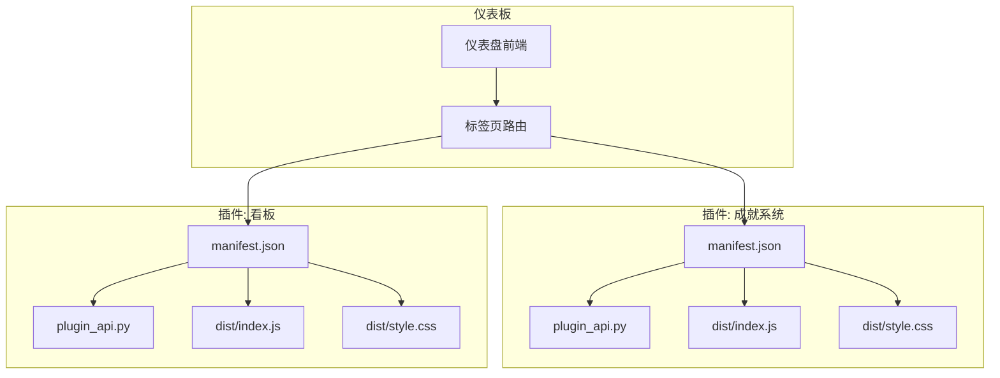
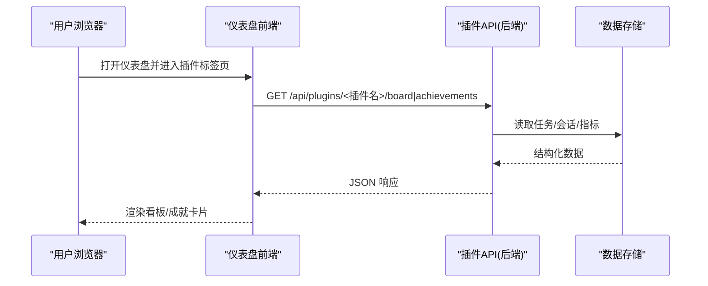
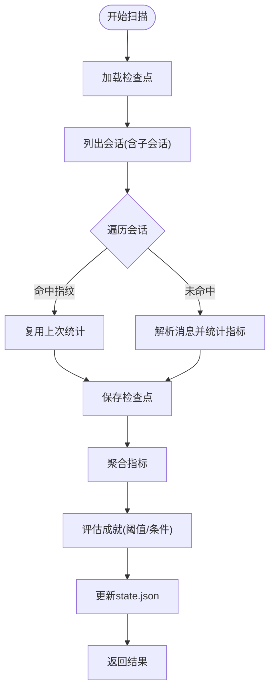
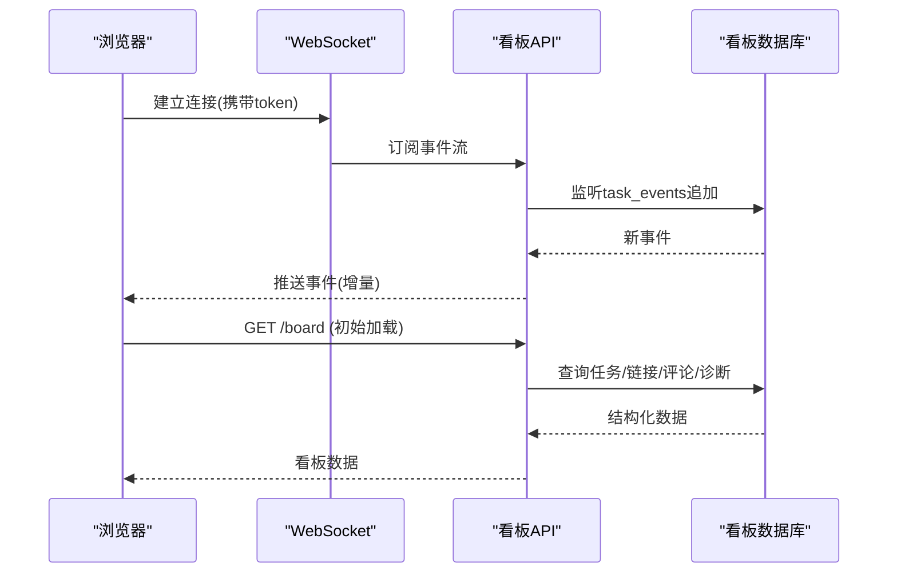
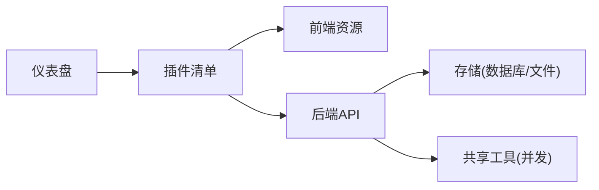

# 仪表板插件开发

<cite>
**本文引用的文件**
- [README.md](file://README.md)
- [plugin_utils.py](file://plugins/plugin_utils.py)
- [sparkii-achievements/manifest.json](file://plugins/sparkii-achievements/dashboard/manifest.json)
- [sparkii-achievements/plugin_api.py](file://plugins/sparkii-achievements/dashboard/plugin_api.py)
- [kanban/manifest.json](file://plugins/kanban/dashboard/manifest.json)
- [kanban/plugin_api.py](file://plugins/kanban/dashboard/plugin_api.py)
</cite>

## 目录
1. [简介](#简介)
2. [项目结构](#项目结构)
3. [核心组件](#核心组件)
4. [架构总览](#架构总览)
5. [详细组件分析](#详细组件分析)
6. [依赖关系分析](#依赖关系分析)
7. [性能考虑](#性能考虑)
8. [故障排查指南](#故障排查指南)
9. [结论](#结论)
10. [附录](#附录)

## 简介
本教程面向希望在 Sparkii Agent 仪表盘中开发 Web 插件的开发者，涵盖从项目初始化、前端组件与后端 API 集成、状态管理与主题定制，到打包部署与用户体验优化的完整流程。仓库内已内置两个典型仪表板插件示例：成就系统（sparkii-achievements）与看板管理（kanban），可作为参考实现。

## 项目结构
Sparkii 仪表板插件采用“前后端分离 + 清单驱动”的组织方式：
- 每个插件位于 plugins/<插件名>/dashboard 目录下
- manifest.json 声明插件元数据、前端入口、样式与后端 API 模块
- plugin_api.py 提供 FastAPI Router，暴露 REST/WebSocket 接口
- dist/index.js 与 dist/style.css 为构建产物，由仪表盘加载

图表来源
- [sparkii-achievements/manifest.json:1-12](file://plugins/sparkii-achievements/dashboard/manifest.json#L1-L12)
- [kanban/manifest.json:1-15](file://plugins/kanban/dashboard/manifest.json#L1-L15)

章节来源
- [sparkii-achievements/manifest.json:1-12](file://plugins/sparkii-achievements/dashboard/manifest.json#L1-L12)
- [kanban/manifest.json:1-15](file://plugins/kanban/dashboard/manifest.json#L1-L15)

## 核心组件
- 插件清单 manifest.json：定义 name、label、描述、图标、版本、标签页路径与位置、前端 entry、CSS、后端 api 模块。
- 后端 API plugin_api.py：基于 FastAPI 的 APIRouter，挂载到 /api/plugins/<插件名>/，提供数据查询、写入、事件推送等能力。
- 前端资源 dist/index.js、dist/style.css：由仪表盘在对应标签页加载，负责渲染 UI、调用后端 API、处理交互与状态。
- 共享工具：如并发安全的单例工具，帮助插件避免多线程下的竞态问题。

章节来源
- [sparkii-achievements/manifest.json:1-12](file://plugins/sparkii-achievements/dashboard/manifest.json#L1-L12)
- [kanban/manifest.json:1-15](file://plugins/kanban/dashboard/manifest.json#L1-L15)
- [plugin_utils.py:1-136](file://plugins/plugin_utils.py#L1-L136)

## 架构总览
仪表板插件通过“清单 + 路由 + 前端资源”的方式接入仪表盘：
- 仪表盘启动时扫描插件目录，读取 manifest.json，注册标签页与 API 路由前缀
- 前端在标签页加载时引入 dist/index.js 与 dist/style.css
- 前端通过 /api/plugins/<插件名>/... 调用后端 API
- 后端通过数据库或外部服务获取数据，返回给前端渲染

图表来源
- [kanban/plugin_api.py:378-510](file://plugins/kanban/dashboard/plugin_api.py#L378-L510)
- [sparkii-achievements/plugin_api.py:560-671](file://plugins/sparkii-achievements/dashboard/plugin_api.py#L560-L671)

## 详细组件分析

### 插件清单与注册
- 清单字段说明
  - name：插件唯一标识
  - label：显示名称
  - description：功能描述
  - icon：图标名称
  - version：版本号
  - tab.path/tab.position：标签页路由与插入位置
  - entry：前端 JS 入口
  - css：样式文件
  - api：后端 API 模块文件名
- 注册机制
  - 仪表盘根据 manifest.json 将插件挂载到指定路径，并在前端侧注入标签页

章节来源
- [sparkii-achievements/manifest.json:1-12](file://plugins/sparkii-achievements/dashboard/manifest.json#L1-L12)
- [kanban/manifest.json:1-15](file://plugins/kanban/dashboard/manifest.json#L1-L15)

### 成就系统插件（sparkii-achievements）
- 功能概述
  - 扫描本地 Sparkii 会话历史，基于行为指标解锁徽章
  - 支持多等级（铜/银/金/钻/奥林匹亚）、进度条、隐藏成就
  - 提供快照缓存与增量检查点，提升冷/热加载性能
- 关键后端逻辑
  - 会话扫描：读取会话列表与消息，统计工具调用、错误、文件操作、模型使用等指标
  - 指标聚合：按会话维度计算最大值与累计值，生成全局聚合
  - 成就评估：根据阈值或组合条件判定是否解锁，维护本地 state.json
  - 缓存策略：内存快照 TTL 与磁盘检查点复用，减少重复扫描
- 前端交互
  - 展示成就卡片、进度、证据来源（最佳会话）
  - 分享卡片：客户端 Canvas 生成图片，支持下载与复制

图表来源
- [sparkii-achievements/plugin_api.py:560-671](file://plugins/sparkii-achievements/dashboard/plugin_api.py#L560-L671)
- [sparkii-achievements/plugin_api.py:674-755](file://plugins/sparkii-achievements/dashboard/plugin_api.py#L674-L755)
- [sparkii-achievements/plugin_api.py:758-800](file://plugins/sparkii-achievements/dashboard/plugin_api.py#L758-L800)

章节来源
- [sparkii-achievements/plugin_api.py:560-671](file://plugins/sparkii-achievements/dashboard/plugin_api.py#L560-L671)
- [sparkii-achievements/plugin_api.py:674-755](file://plugins/sparkii-achievements/dashboard/plugin_api.py#L674-L755)
- [sparkii-achievements/plugin_api.py:758-800](file://plugins/sparkii-achievements/dashboard/plugin_api.py#L758-L800)

### 看板管理插件（kanban）
- 功能概述
  - 多列看板（待办、计划、进行中、阻塞、评审、完成等）
  - 任务详情、评论、附件、运行历史、诊断告警
  - WebSocket 实时事件推送，支持 OAuth 鉴权
- 关键后端逻辑
  - 连接与初始化：自动创建 schema，保证首次访问不报错
  - 数据聚合：批量获取链接计数、评论数、子任务进度、诊断摘要
  - 安全与鉴权：WebSocket 升级走统一鉴权门控；HTTP 路由受仪表盘会话令牌保护
  - 附件上传：流式写入、大小限制、文件名清洗与冲突解决
- 前端交互
  - 拖拽卡片、查看任务详情、评论与附件、运行历史与诊断信息
  - 实时刷新：基于事件 ID 增量拉取最新变更

图表来源
- [kanban/plugin_api.py:64-94](file://plugins/kanban/dashboard/plugin_api.py#L64-L94)
- [kanban/plugin_api.py:378-510](file://plugins/kanban/dashboard/plugin_api.py#L378-L510)
- [kanban/plugin_api.py:712-779](file://plugins/kanban/dashboard/plugin_api.py#L712-L779)

章节来源
- [kanban/plugin_api.py:64-94](file://plugins/kanban/dashboard/plugin_api.py#L64-L94)
- [kanban/plugin_api.py:378-510](file://plugins/kanban/dashboard/plugin_api.py#L378-L510)
- [kanban/plugin_api.py:712-779](file://plugins/kanban/dashboard/plugin_api.py#L712-L779)

### 前端组件与状态管理（通用实践）
- 组件组织
  - 按功能拆分：列表、详情、编辑器、设置面板
  - 使用 React Hooks 管理本地状态，复杂状态可引入轻量状态库
- 数据通信
  - REST：GET/POST/PUT/DELETE 与分页、过滤、排序
  - WebSocket：用于实时事件（如看板事件流）
- 主题与样式
  - 通过 CSS 变量或主题配置适配明暗主题
  - 保持与仪表盘设计系统一致（字体、间距、色彩）
- 响应式设计
  - 移动端优先布局，自适应列宽与交互方式
  - 大表格/看板在小屏下提供滚动与折叠

[本节为通用实践说明，不直接分析具体文件]

## 依赖关系分析
- 插件与仪表盘
  - 仪表盘负责发现 manifest.json、注册路由与标签页
  - 插件仅关注自身业务逻辑，不耦合仪表盘内部实现
- 插件与存储
  - 成就系统：依赖会话数据库与本地 state/checkpoint/snapshot 文件
  - 看板：依赖 SQLite 表结构与事件追加表
- 并发与线程安全
  - 使用共享工具提供的 lazy_singleton 与 SingletonSlot 避免多线程竞态

图表来源
- [plugin_utils.py:43-81](file://plugins/plugin_utils.py#L43-L81)
- [plugin_utils.py:84-136](file://plugins/plugin_utils.py#L84-L136)

章节来源
- [plugin_utils.py:43-81](file://plugins/plugin_utils.py#L43-L81)
- [plugin_utils.py:84-136](file://plugins/plugin_utils.py#L84-L136)

## 性能考虑
- 成就系统
  - 使用检查点与快照缓存，避免重复扫描全部会话
  - 后台线程执行长扫描，UI 通过进度回调逐步呈现
- 看板
  - 批量查询与窗口函数减少 N+1 问题
  - 事件流增量推送，降低轮询开销
  - 附件上传流式写入与大小限制，防止内存与磁盘压力

[本节为通用性能建议，结合具体实现进行优化]

## 故障排查指南
- 插件未显示
  - 确认 manifest.json 中 tab.path 与 position 正确
  - 重新扫描插件目录后重启仪表盘
- API 404
  - 后端路由未挂载或依赖缺失导致导入失败
  - 检查 plugin_api.py 是否正确导出 router
- 权限问题
  - WebSocket 升级需通过统一鉴权门控
  - HTTP 请求需携带会话令牌
- 性能卡顿
  - 检查是否触发全量扫描或无分页的大查询
  - 启用检查点与快照缓存，合理设置 TTL

章节来源
- [kanban/plugin_api.py:64-94](file://plugins/kanban/dashboard/plugin_api.py#L64-L94)
- [sparkii-achievements/plugin_api.py:560-671](file://plugins/sparkii-achievements/dashboard/plugin_api.py#L560-L671)

## 结论
通过清单驱动的插件体系，Sparkii 仪表板提供了灵活、可扩展的前后端扩展能力。借助现有示例（成就系统与看板），开发者可以快速上手，遵循统一的注册、路由与鉴权规范，实现高质量的用户体验与稳定的性能表现。

## 附录
- 快速开始
  - 安装与启动仪表盘，确保插件目录被扫描
  - 修改 manifest.json 与 plugin_api.py，添加自定义路由
  - 构建前端资源并放入 dist 目录
- 最佳实践
  - 使用懒加载与缓存，减少首屏与冷启动时间
  - 对敏感操作进行鉴权与审计
  - 提供清晰的错误提示与重试机制
  - 保持样式与主题一致性，支持响应式布局

[本节为补充信息，不直接分析具体文件]