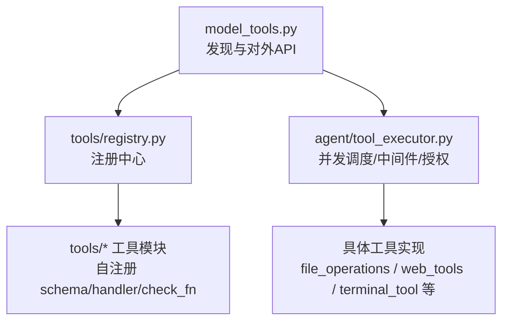
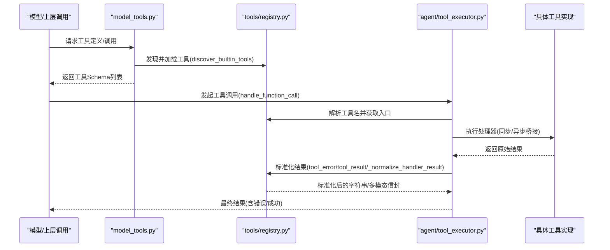
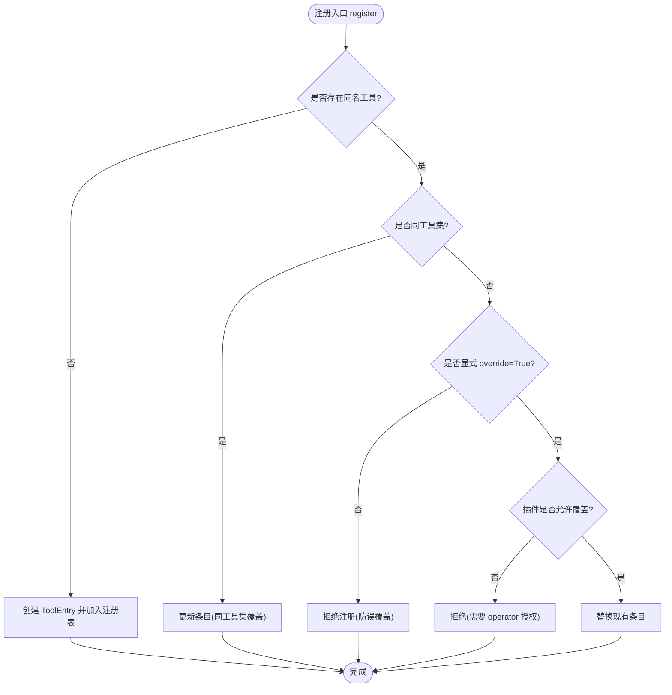
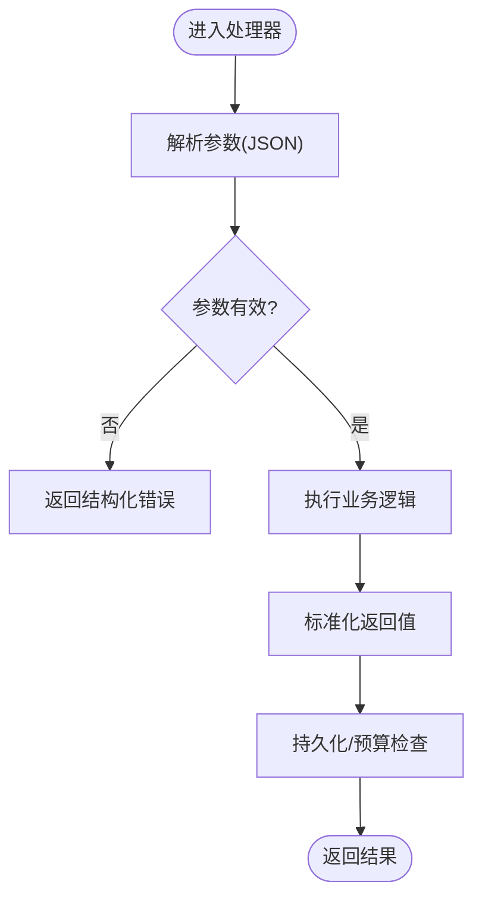
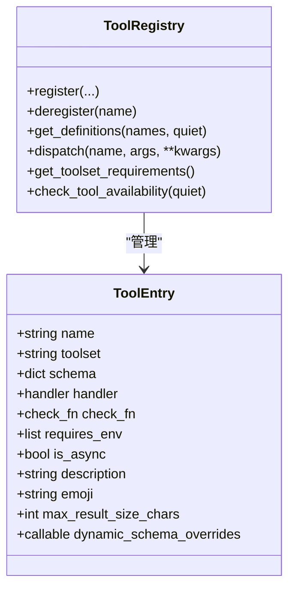
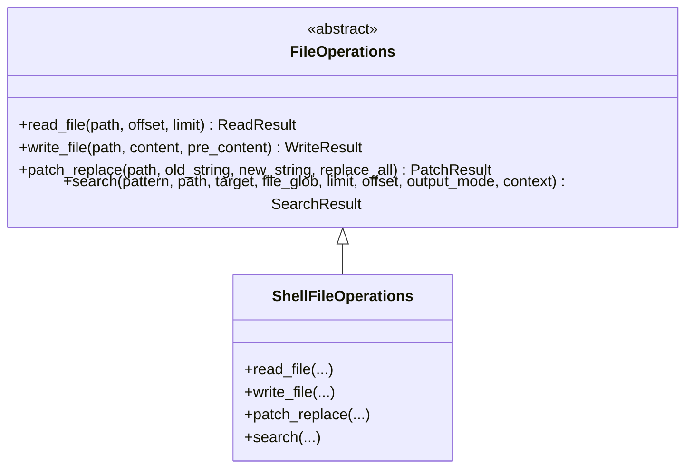
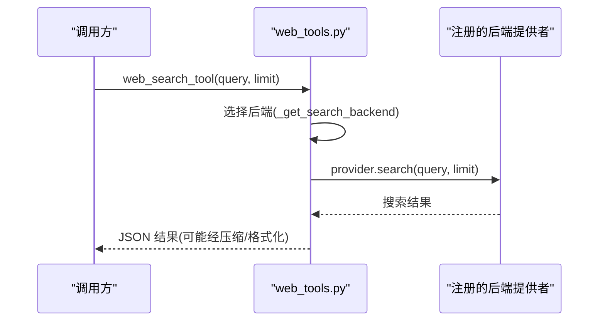
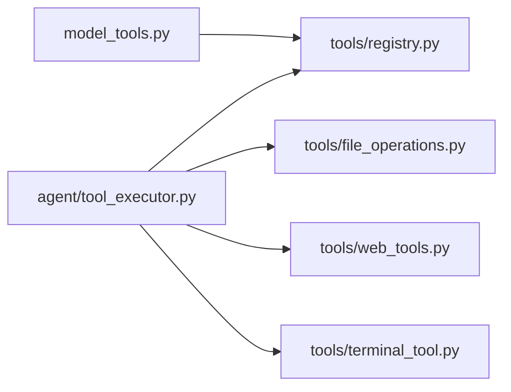

# 工具插件开发

<cite>
**本文引用的文件**
- [tools/registry.py](file://tools/registry.py)
- [model_tools.py](file://model_tools.py)
- [agent/tool_executor.py](file://agent/tool_executor.py)
- [tools/file_operations.py](file://tools/file_operations.py)
- [tools/file_tools.py](file://tools/file_tools.py)
- [tools/web_tools.py](file://tools/web_tools.py)
- [tools/computer_use_tool.py](file://tools/computer_use_tool.py)
- [tools/terminal_tool.py](file://tools/terminal_tool.py)
</cite>

## 目录
1. [简介](#简介)
2. [项目结构](#项目结构)
3. [核心组件](#核心组件)
4. [架构总览](#架构总览)
5. [详细组件分析](#详细组件分析)
6. [依赖关系分析](#依赖关系分析)
7. [性能考虑](#性能考虑)
8. [故障排查指南](#故障排查指南)
9. [结论](#结论)
10. [附录](#附录)

## 简介
本指南面向希望为系统开发自定义“工具插件”的开发者，覆盖从接口定义、参数校验与返回值处理，到工具注册机制（元数据、权限、依赖声明）、完整开发生命周期（规划、实现、测试、部署），以及执行环境隔离、错误处理与日志记录最佳实践。文档还包含实际示例：文件操作工具、API 调用工具、数据处理工具，并给出调试方法与性能优化技巧。

## 项目结构
- 工具注册中心位于 tools/registry.py，提供统一的注册、发现、查询与分发能力。
- 模型侧编排层 model_tools.py 负责触发内置工具发现、异步桥接与对外 API。
- 工具执行器 agent/tool_executor.py 负责并发调度、中间件、授权门控、结果持久化与预算控制。
- 具体工具实现集中在 tools/ 目录下，例如：
  - 文件操作：tools/file_operations.py、tools/file_tools.py
  - Web 搜索/抓取：tools/web_tools.py
  - 桌面控制：tools/computer_use_tool.py（作为 shim 触发子包注册）
  - 终端执行：tools/terminal_tool.py

**图表来源**
- [model_tools.py:1-200](file://model_tools.py#L1-L200)
- [tools/registry.py:1-200](file://tools/registry.py#L1-L200)
- [agent/tool_executor.py:1-200](file://agent/tool_executor.py#L1-L200)

**章节来源**
- [tools/registry.py:1-200](file://tools/registry.py#L1-L200)
- [model_tools.py:1-200](file://model_tools.py#L1-L200)
- [agent/tool_executor.py:1-200](file://agent/tool_executor.py#L1-L200)

## 核心组件
- 工具注册表 ToolRegistry
  - 维护工具条目（名称、工具集、Schema、处理器、可用性检查、环境变量、是否异步、描述、表情、最大结果大小、动态 Schema 覆盖）。
  - 提供注册、注销、查询、按工具集过滤、别名管理、生成号递增等能力。
  - 对 check_fn 进行 TTL 缓存与瞬态失败宽容，避免外部状态抖动导致工具不可用。
- 工具发现 discover_builtin_tools
  - 扫描 tools/*.py，通过 AST 检测顶层 registry.register() 调用，惰性导入已注册的模块。
- 工具分发 dispatch
  - 自动桥接异步处理器，统一规范化返回值为字符串或受支持的多模态信封；异常被捕获并以标准错误格式返回。
- 模型侧编排 model_tools
  - 触发内置工具发现，提供 get_tool_definitions、handle_function_call 等对外接口；维护事件循环以安全运行异步处理器。
- 工具执行器 tool_executor
  - 并发执行工具调用，集成中间件链、授权门控、进度回调、预算限制、结果持久化与取消/中断处理。

**章节来源**
- [tools/registry.py:200-414](file://tools/registry.py#L200-L414)
- [tools/registry.py:414-800](file://tools/registry.py#L414-L800)
- [tools/registry.py:800-1002](file://tools/registry.py#L800-L1002)
- [model_tools.py:1-200](file://model_tools.py#L1-L200)
- [agent/tool_executor.py:1-200](file://agent/tool_executor.py#L1-L200)

## 架构总览
下图展示了从模型调用到工具执行的端到端流程，包括注册、发现、调度、中间件、授权、执行与结果归一化。

**图表来源**
- [model_tools.py:1-200](file://model_tools.py#L1-L200)
- [tools/registry.py:800-1002](file://tools/registry.py#L800-L1002)
- [agent/tool_executor.py:482-662](file://agent/tool_executor.py#L482-L662)

## 详细组件分析

### 工具接口定义与注册
- 每个工具在模块级调用 registry.register(...) 声明：
  - name：工具唯一名称
  - toolset：所属工具集（用于分组与权限）
  - schema：OpenAI 风格的函数 Schema（包含 description、parameters 等）
  - handler：处理器函数（可同步或异步）
  - check_fn：可选的环境/依赖可用性检查函数
  - requires_env：声明所需环境变量（用于 UI 提示与需求检查）
  - is_async：是否异步处理器
  - description、emoji：用户可见信息
  - max_result_size_chars：结果大小上限
  - dynamic_schema_overrides：运行时动态覆盖 Schema 字段（如根据配置调整描述）
- 插件覆盖内置工具的权限控制：
  - 默认禁止跨工具集覆盖；如需覆盖需显式 override=True，并由 operator 在配置中允许 allow_tool_override。
  - 注销同样受所有权策略保护，防止插件误删非自有工具。

**图表来源**
- [tools/registry.py:562-644](file://tools/registry.py#L562-L644)

**章节来源**
- [tools/registry.py:200-414](file://tools/registry.py#L200-L414)
- [tools/registry.py:562-711](file://tools/registry.py#L562-L711)

### 参数验证与返回值处理
- 参数解析：
  - 工具执行器会先解析模型传入的参数为 JSON 对象；若无效则直接返回结构化错误，不执行工具。
- 返回值规范：
  - 处理器应返回字符串（JSON）或受支持的多模态信封；其他类型会被转换为错误响应，避免下游无法安全处理。
  - 错误消息会被截断与清洗，防止异常体过大污染上下文。
- 结果持久化与预算：
  - 执行器会在合适时机将结果持久化，并根据上下文窗口计算预算，限制单次结果大小。

**图表来源**
- [agent/tool_executor.py:141-158](file://agent/tool_executor.py#L141-L158)
- [tools/registry.py:770-800](file://tools/registry.py#L770-L800)
- [tools/registry.py:974-1002](file://tools/registry.py#L974-L1002)

**章节来源**
- [agent/tool_executor.py:141-158](file://agent/tool_executor.py#L141-L158)
- [tools/registry.py:770-800](file://tools/registry.py#L770-L800)
- [tools/registry.py:974-1002](file://tools/registry.py#L974-L1002)

### 工具注册机制：元数据、权限与依赖
- 元数据：
  - 每个工具条目包含名称、工具集、Schema、描述、表情、最大结果大小、动态 Schema 覆盖等。
- 权限：
  - 插件覆盖内置工具需 operator 授权；注销也受所有权策略保护。
- 依赖：
  - check_fn 用于探测外部依赖（如 Docker、Playwright、Web 后端密钥）；结果带 TTL 缓存与瞬态失败宽容。
  - requires_env 声明环境变量，便于 UI 展示与需求检查。

**图表来源**
- [tools/registry.py:200-414](file://tools/registry.py#L200-L414)
- [tools/registry.py:800-1002](file://tools/registry.py#L800-L1002)

**章节来源**
- [tools/registry.py:200-414](file://tools/registry.py#L200-L414)
- [tools/registry.py:800-1002](file://tools/registry.py#L800-L1002)

### 执行环境隔离、错误处理与日志记录
- 环境隔离：
  - 终端工具支持本地、Docker、Modal、Vercel Sandbox 等多种后端；路径解析与 CWD 绑定任务上下文，避免写错仓库。
  - 文件工具对设备路径、敏感路径进行阻断与白名单控制。
- 错误处理：
  - 所有异常在分发层被捕获并转为标准错误格式；错误消息被截断与清洗。
  - 工具执行器对中断、取消、超时进行专门处理，确保资源释放与状态一致。
- 日志记录：
  - 关键路径（注册、分发、错误、可用性检查）均有日志输出；诊断信息可用于定位问题。

**章节来源**
- [tools/terminal_tool.py:1-200](file://tools/terminal_tool.py#L1-L200)
- [tools/file_operations.py:1-200](file://tools/file_operations.py#L1-L200)
- [tools/registry.py:233-414](file://tools/registry.py#L233-L414)
- [tools/registry.py:800-835](file://tools/registry.py#L800-L835)
- [agent/tool_executor.py:482-662](file://agent/tool_executor.py#L482-L662)

### 实际工具开发示例

#### 文件操作工具
- 抽象接口 FileOperations 定义了 read/write/patch/search/delete/move 等方法，屏蔽不同后端的差异。
- ShellFileOperations 基于 shell 命令实现通用文件操作，并提供行尾符/BOM 处理、分页读取、搜索输出清洗等。
- file_tools.py 封装了 read_file、write_file、patch 等工具，结合 file_operations 与安全策略（写入拒绝路径、设备路径阻断）。

**图表来源**
- [tools/file_operations.py:451-515](file://tools/file_operations.py#L451-L515)

**章节来源**
- [tools/file_operations.py:1-200](file://tools/file_operations.py#L1-L200)
- [tools/file_operations.py:451-515](file://tools/file_operations.py#L451-L515)
- [tools/file_tools.py:1-200](file://tools/file_tools.py#L1-L200)

#### API 调用工具（Web 搜索/抓取）
- web_tools.py 提供 web_search_tool 与 web_extract_tool，支持多个后端（Exa、Parallel、Tavily、Firecrawl、SearXNG 等）。
- 后端选择优先级：web.search_backend/web.extract_backend -> web.backend -> 自动探测可用后端。
- 结果裁剪与存储：大页面 head+tail 截取，全文保存到 cache/web，并通过 footer 指导模型分页读取。
- 安全：URL 去敏感参数、拦截内嵌密钥；base64 图片替换为占位符以减少 token 消耗。

**图表来源**
- [tools/web_tools.py:618-740](file://tools/web_tools.py#L618-L740)
- [tools/web_tools.py:742-800](file://tools/web_tools.py#L742-L800)

**章节来源**
- [tools/web_tools.py:1-200](file://tools/web_tools.py#L1-L200)
- [tools/web_tools.py:618-740](file://tools/web_tools.py#L618-L740)
- [tools/web_tools.py:742-800](file://tools/web_tools.py#L742-L800)

#### 数据处理工具（桌面控制）
- computer_use_tool.py 作为 shim，触发 tools/computer_use/ 包的注册，暴露 computer_use 工具。
- 该工具通过 cua-driver 实现跨平台桌面控制，支持后台模式且不抢占用户焦点。

**章节来源**
- [tools/computer_use_tool.py:1-43](file://tools/computer_use_tool.py#L1-L43)

### 工具开发流程（从规划到部署）
- 项目结构规划
  - 在 tools/ 下新增模块，或在已有模块中增加新工具。
  - 使用 registry.register(...) 在模块级声明工具元数据与处理器。
- 代码实现
  - 定义处理器函数（可同步或异步），遵循参数解析与返回值规范。
  - 如需外部依赖，实现 check_fn 并在 requires_env 中声明环境变量。
- 测试
  - 单元测试：模拟后端/网络/文件系统，验证参数校验、错误分支与结果格式。
  - 集成测试：端到端验证工具在真实环境中可用（如 Docker/Modal/Web 后端）。
- 部署
  - 确保环境变量与依赖安装正确；必要时启用 operator 授权以覆盖内置工具。
  - 使用 CLI 或配置工具启用/禁用工具集，观察工具可用性。

**章节来源**
- [tools/registry.py:108-159](file://tools/registry.py#L108-L159)
- [tools/registry.py:562-644](file://tools/registry.py#L562-L644)
- [model_tools.py:1-200](file://model_tools.py#L1-L200)

## 依赖关系分析
- model_tools.py 依赖 tools/registry.py 进行工具发现与定义获取。
- agent/tool_executor.py 依赖 tools/registry.py 进行工具分发，并调用具体工具实现。
- 各工具模块依赖各自的后端与第三方库（如 httpx、firecrawl、ddgs 等），通过 check_fn 与 requires_env 管理可用性。

**图表来源**
- [model_tools.py:1-200](file://model_tools.py#L1-L200)
- [agent/tool_executor.py:1-200](file://agent/tool_executor.py#L1-L200)
- [tools/registry.py:1-200](file://tools/registry.py#L1-L200)

**章节来源**
- [model_tools.py:1-200](file://model_tools.py#L1-L200)
- [agent/tool_executor.py:1-200](file://agent/tool_executor.py#L1-L200)
- [tools/registry.py:1-200](file://tools/registry.py#L1-L200)

## 性能考虑
- 工具发现缓存
  - 基于文件 mtime+size 的发现缓存减少 AST 扫描开销。
- check_fn 缓存与瞬态失败宽容
  - 30 秒 TTL 与最近成功宽容窗口，避免外部抖动导致工具频繁不可用。
- 并发执行与预算控制
  - 工具执行器支持并发调度，限制最大工作线程数；按上下文窗口动态调整结果预算。
- 结果大小限制
  - 全局与单工具最大结果大小限制，防止上下文溢出。
- 异步桥接与事件循环复用
  - 复用持久事件循环，避免“Event loop is closed”错误与资源泄漏。

**章节来源**
- [tools/registry.py:108-159](file://tools/registry.py#L108-L159)
- [tools/registry.py:233-414](file://tools/registry.py#L233-L414)
- [agent/tool_executor.py:78-99](file://agent/tool_executor.py#L78-L99)
- [model_tools.py:72-200](file://model_tools.py#L72-L200)

## 故障排查指南
- 工具不可用
  - 检查 check_fn 是否失败（网络/依赖/密钥缺失）；查看日志中的可用性警告。
  - 确认 requires_env 环境变量已设置；必要时刷新 check_fn 缓存。
- 工具被拒绝覆盖
  - 插件覆盖内置工具需 operator 授权；检查配置中的 allow_tool_override。
- 参数解析失败
  - 确认模型传入参数为合法 JSON 对象；查看执行器的参数解析错误。
- 结果过大或被截断
  - 调整 max_result_size_chars 或工具内部的分页/截断策略；检查 footer 提示。
- 异步错误
  - 检查事件循环状态；确认异步处理器正确 await 且未关闭循环。

**章节来源**
- [tools/registry.py:233-414](file://tools/registry.py#L233-L414)
- [tools/registry.py:562-644](file://tools/registry.py#L562-L644)
- [agent/tool_executor.py:141-158](file://agent/tool_executor.py#L141-L158)
- [tools/registry.py:800-835](file://tools/registry.py#L800-L835)

## 结论
本指南系统阐述了工具插件的开发方法：通过 registry.register 声明工具元数据与处理器，利用 check_fn 与 requires_env 管理依赖与环境；借助 model_tools 与 tool_executor 完成发现、调度与执行；遵循参数与返回值规范，结合错误处理与日志记录保障稳定性。通过示例（文件操作、Web 调用、桌面控制）与性能优化建议，帮助开发者快速构建高质量的工具插件。

## 附录
- 最佳实践清单
  - 明确工具职责与工具集归属，避免命名冲突。
  - 实现健壮的 check_fn，处理网络/依赖瞬态失败。
  - 严格参数校验与返回值规范，使用 tool_error/tool_result 简化序列化。
  - 合理设置结果大小限制与分页策略，避免上下文溢出。
  - 充分测试（单元/集成），覆盖错误分支与边界条件。
  - 记录关键日志，便于问题定位与性能分析。