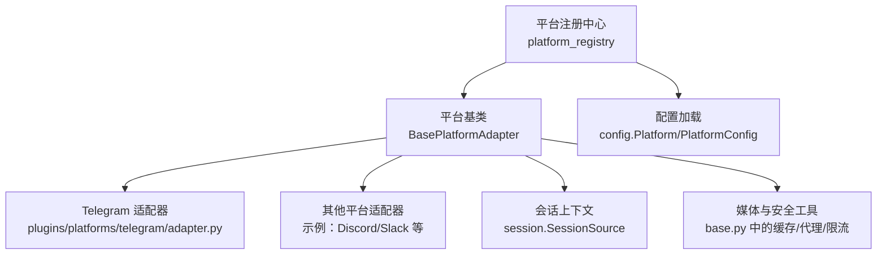
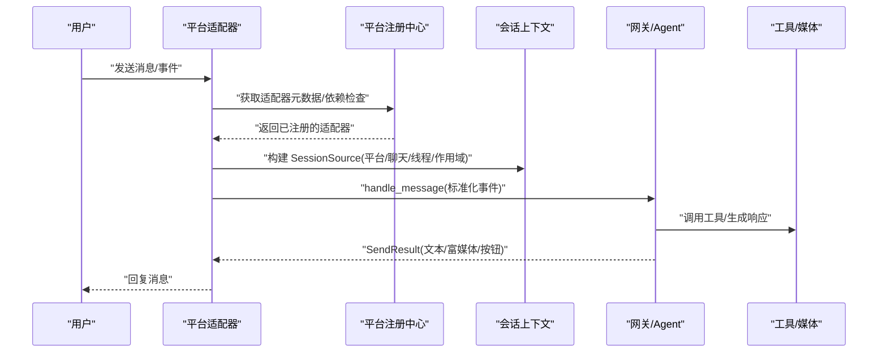
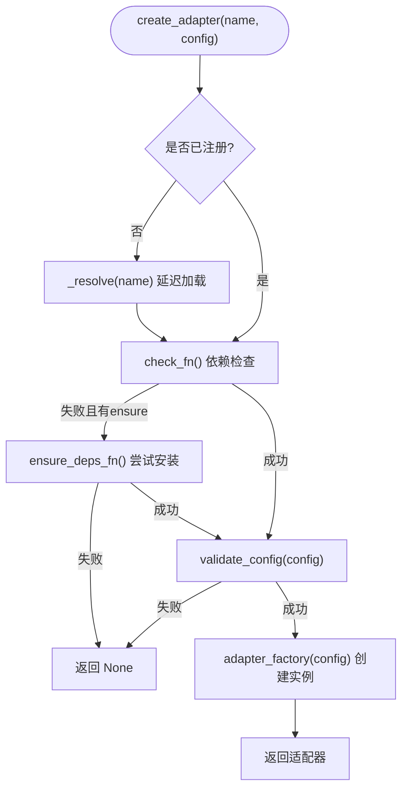
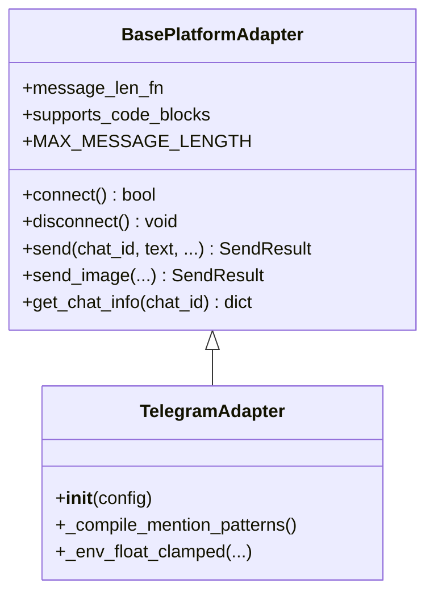
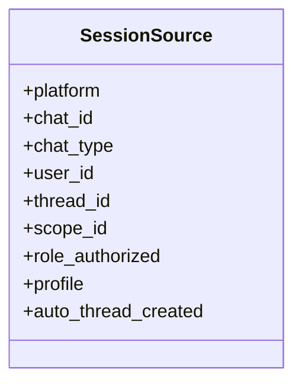
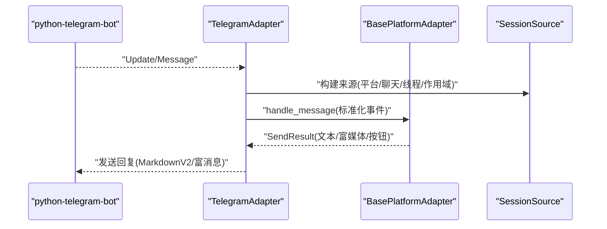
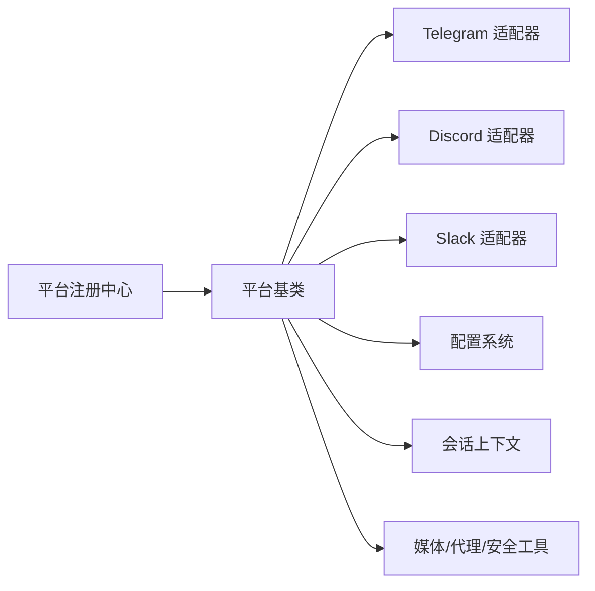

# 平台适配器开发

<cite>
**本文引用的文件**
- [gateway/platforms/base.py](file://gateway/platforms/base.py)
- [gateway/platform_registry.py](file://gateway/platform_registry.py)
- [gateway/session.py](file://gateway/session.py)
- [gateway/config.py](file://gateway/config.py)
- [plugins/platforms/telegram/adapter.py](file://plugins/platforms/telegram/adapter.py)
- [gateway/platforms/ADDING_A_PLATFORM.md](file://gateway/platforms/ADDING_A_PLATFORM.md)
</cite>

## 目录
1. [简介](#简介)
2. [项目结构](#项目结构)
3. [核心组件](#核心组件)
4. [架构总览](#架构总览)
5. [详细组件分析](#详细组件分析)
6. [依赖关系分析](#依赖关系分析)
7. [性能考量](#性能考量)
8. [故障排查指南](#故障排查指南)
9. [结论](#结论)
10. [附录](#附录)

## 简介
本教程面向希望为新的消息平台（如 Telegram Bot、Discord Bot、Slack App）开发适配器的工程师。文档围绕以下目标展开：
- 平台接口抽象与统一入口
- 消息格式转换与会话管理
- 连接管理器、消息处理器、用户认证与权限控制
- 完整的适配器开发流程（SDK 集成、消息路由、状态同步）
- 平台特定功能适配（富媒体、命令系统、用户交互）
- 测试策略与部署配置

## 项目结构
本项目采用“网关 + 平台插件”的分层设计：
- 网关层提供统一的平台注册、配置加载、会话管理与消息分发能力
- 平台层通过基类抽象出通用行为，各平台以插件或内置方式实现具体细节
- 工具层提供媒体缓存、代理、TTS、安全等通用能力

图表来源
- [gateway/platform_registry.py:183-382](file://gateway/platform_registry.py#L183-L382)
- [gateway/platforms/base.py:1-120](file://gateway/platforms/base.py#L1-L120)
- [plugins/platforms/telegram/adapter.py:633-800](file://plugins/platforms/telegram/adapter.py#L633-L800)
- [gateway/session.py:148-200](file://gateway/session.py#L148-L200)
- [gateway/config.py:1-200](file://gateway/config.py#L1-L200)

章节来源
- [gateway/platform_registry.py:1-382](file://gateway/platform_registry.py#L1-L382)
- [gateway/platforms/base.py:1-120](file://gateway/platforms/base.py#L1-L120)
- [plugins/platforms/telegram/adapter.py:1-800](file://plugins/platforms/telegram/adapter.py#L1-L800)
- [gateway/session.py:1-200](file://gateway/session.py#L1-L200)
- [gateway/config.py:1-200](file://gateway/config.py#L1-L200)

## 核心组件
- 平台注册中心：集中管理所有平台适配器（内置与插件），支持延迟加载、依赖检查、配置校验与工厂创建
- 平台基类：定义连接、发送、类型提示、媒体处理、代理、长度限制、错误分类等通用能力
- 会话管理：维护消息来源、线程、作用域、角色授权、多租户隔离等上下文信息
- 配置系统：枚举平台、加载环境变量、合并 YAML/ENV、提供连接状态判断

章节来源
- [gateway/platform_registry.py:38-181](file://gateway/platform_registry.py#L38-L181)
- [gateway/platforms/base.py:570-800](file://gateway/platforms/base.py#L570-L800)
- [gateway/session.py:148-200](file://gateway/session.py#L148-L200)
- [gateway/config.py:1-200](file://gateway/config.py#L1-L200)

## 架构总览
下图展示了从平台事件到消息处理的端到端流程，包括注册、连接、接收、转换、路由与回复。

图表来源
- [gateway/platform_registry.py:299-377](file://gateway/platform_registry.py#L299-L377)
- [gateway/platforms/base.py:78-151](file://gateway/platforms/base.py#L78-L151)
- [gateway/session.py:148-200](file://gateway/session.py#L148-L200)
- [plugins/platforms/telegram/adapter.py:633-800](file://plugins/platforms/telegram/adapter.py#L633-L800)

## 详细组件分析

### 平台注册中心（PlatformRegistry）
- 职责
  - 注册平台条目（名称、标签、工厂函数、依赖检查、配置校验、安装提示、独立发送器等）
  - 延迟加载平台模块，避免启动时导入重型 SDK
  - 创建适配器实例，执行依赖检测、配置校验与异常保护
- 关键流程
  - register_deferred：登记懒加载器
  - get/create_adapter：按需解析并创建适配器
  - ensure_deps_fn：在需要时自动安装依赖
  - validate_config：校验平台配置
- 扩展点
  - standalone_sender_fn：供 cron/send_message 在无进程内适配器时使用
  - apply_yaml_config_fn：将 YAML 配置转换为 ENV/extra
  - cron_deliver_env_var：声明 cron 投递的目标环境变量

图表来源
- [gateway/platform_registry.py:208-250](file://gateway/platform_registry.py#L208-L250)
- [gateway/platform_registry.py:299-377](file://gateway/platform_registry.py#L299-L377)

章节来源
- [gateway/platform_registry.py:38-181](file://gateway/platform_registry.py#L38-L181)
- [gateway/platform_registry.py:208-250](file://gateway/platform_registry.py#L208-L250)
- [gateway/platform_registry.py:299-377](file://gateway/platform_registry.py#L299-L377)

### 平台基类（BasePlatformAdapter）
- 职责
  - 统一连接生命周期（connect/disconnect）
  - 消息发送（文本、图片、文档、语音、视频、动画）
  - 输入媒体大小限制、代理解析、URL 安全校验
  - 消息长度计算（UTF-16 单位）、截断与分块
  - 线程/话题元数据构建、通知标记、回复锚点选择
  - 流式 TTS 支持与格式描述
- 关键能力
  - resolve_proxy_url/proxy_kwargs_for_*：跨平台代理配置
  - should_send_media_as_audio/build_auto_tts_output_path：音频/TTS 输出路径
  - cache_*：入站媒体缓存，防止内存溢出
  - _reply_anchor_for_event/_platform_name：平台感知的事件路由

图表来源
- [gateway/platforms/base.py:570-800](file://gateway/platforms/base.py#L570-L800)
- [plugins/platforms/telegram/adapter.py:633-800](file://plugins/platforms/telegram/adapter.py#L633-L800)

章节来源
- [gateway/platforms/base.py:570-800](file://gateway/platforms/base.py#L570-L800)
- [plugins/platforms/telegram/adapter.py:633-800](file://plugins/platforms/telegram/adapter.py#L633-L800)

### 会话管理（SessionSource）
- 职责
  - 记录消息来源（平台、聊天、线程、作用域、角色授权、多租户 profile）
  - 提供会话键生成、身份哈希、路径安全校验
  - 支持 Discord/Slack 等工作区/服务器隔离
- 关键点
  - scope_id/guild_id：工作区/服务器标识
  - thread_id/chat_topic：线程与频道主题
  - role_authorized/profile：角色授权与多租户路由

图表来源
- [gateway/session.py:148-200](file://gateway/session.py#L148-L200)

章节来源
- [gateway/session.py:148-200](file://gateway/session.py#L148-L200)

### 配置系统（Platform/PlatformConfig）
- 职责
  - 枚举平台、加载环境变量、合并 YAML/ENV
  - 提供连接状态判断、传输模式归一化、系统守护超时等
- 关键点
  - _apply_env_overrides：按平台注入 token/密钥
  - normalize_transport_mode：统一 streaming mode
  - coerce_systemd_watchdog_seconds：服务健康检查

章节来源
- [gateway/config.py:1-200](file://gateway/config.py#L1-L200)

### 平台适配器示例：Telegram Bot
- 特性
  - 使用 python-telegram-bot 进行收发消息、处理媒体与命令
  - MarkdownV2 转义/清理、表格转列表、富消息（Rich Messages）
  - 自适应文本批处理、媒体分组、打字指示器冷却
  - 重连与心跳、阻塞检测、资源泄漏防护
- 关键实现
  - check_telegram_requirements：被动探测与主动安装依赖
  - message_len_fn：UTF-16 长度计算
  - MAX_MESSAGE_LENGTH/RICH_MESSAGE_MAX_CHARS：平台限制
  - _rich_normalize_linebreaks：富消息换行处理

图表来源
- [plugins/platforms/telegram/adapter.py:395-459](file://plugins/platforms/telegram/adapter.py#L395-L459)
- [plugins/platforms/telegram/adapter.py:633-800](file://plugins/platforms/telegram/adapter.py#L633-L800)
- [gateway/platforms/base.py:78-151](file://gateway/platforms/base.py#L78-L151)

章节来源
- [plugins/platforms/telegram/adapter.py:1-800](file://plugins/platforms/telegram/adapter.py#L1-L800)

### 新增平台开发流程（基于官方指南）
- 推荐路径：插件方式（无需修改核心代码）
  - 在 plugins/platforms/<your_platform>/ 下创建 adapter.py 与 plugin.yaml
  - 继承 BasePlatformAdapter，实现 connect/disconnect/send 等
  - 在 register(ctx) 中通过 ctx.register_platform() 注册
- 内置路径（核心贡献者）
  - 在 gateway/platforms/<platform>.py 实现适配器
  - 在 gateway/config.py 的 Platform 枚举中添加新平台
  - 在 run.py 的 _create_adapter 中注册工厂
  - 在 authorization maps、cron delivery、send_message tool、channel directory、status display、setup wizard、redaction、toolsets 等处补充集成点
- 可选钩子
  - env_enablement_fn：从环境变量预填充 extra/home_channel
  - apply_yaml_config_fn：YAML→ENV/extra 转换
  - cron_deliver_env_var：声明 cron 投递环境变量
  - standalone_sender_fn：进程外发送
  - setup_fn：交互式配置

章节来源
- [gateway/platforms/ADDING_A_PLATFORM.md:1-405](file://gateway/platforms/ADDING_A_PLATFORM.md#L1-L405)

## 依赖关系分析
- 耦合与内聚
  - 平台注册中心与平台基类松耦合，通过工厂与元数据解耦
  - 适配器对会话上下文强依赖，保证路由正确性
  - 配置系统为所有平台提供统一的环境变量与 YAML 桥接
- 外部依赖
  - 各平台 SDK（如 telegram、discord.py、slack_bolt）通过 lazy_deps 按需安装与导入
  - 网络代理、媒体缓存、TTS、安全工具由 base.py 统一管理

图表来源
- [gateway/platform_registry.py:183-382](file://gateway/platform_registry.py#L183-L382)
- [gateway/platforms/base.py:570-800](file://gateway/platforms/base.py#L570-L800)
- [plugins/platforms/telegram/adapter.py:633-800](file://plugins/platforms/telegram/adapter.py#L633-L800)
- [gateway/session.py:148-200](file://gateway/session.py#L148-L200)
- [gateway/config.py:1-200](file://gateway/config.py#L1-L200)

章节来源
- [gateway/platform_registry.py:183-382](file://gateway/platform_registry.py#L183-L382)
- [gateway/platforms/base.py:570-800](file://gateway/platforms/base.py#L570-L800)
- [plugins/platforms/telegram/adapter.py:633-800](file://plugins/platforms/telegram/adapter.py#L633-L800)
- [gateway/session.py:148-200](file://gateway/session.py#L148-L200)
- [gateway/config.py:1-200](file://gateway/config.py#L1-L200)

## 性能考量
- 延迟加载：平台模块仅在首次使用时导入，减少启动开销
- 依赖安装：仅在 create_adapter 路径中触发，避免状态展示时的副作用
- 媒体限制：入站媒体大小上限与流式读取，防止 OOM
- 代理优化：优先使用 connector 路径，兼容 SOCKS/HTTP
- 文本批处理：短消息快速路径，降低首 Token 延迟
- 心跳与重连：严格超时与退避，避免死锁与资源泄漏

[本节为通用指导，不直接分析具体文件]

## 故障排查指南
- 常见问题
  - 依赖缺失：检查 check_fn/ensure_deps_fn 日志与 install_hint
  - 配置错误：查看 validate_config 失败原因
  - 连接挂起：关注 updater.stop/start 超时、drain 超时、心跳任务卡住
  - 媒体过大：确认 inbound media 上限与流式读取
  - 代理问题：验证 NO_PROXY/no_proxy 匹配与 macOS 系统代理
- 诊断建议
  - 启用详细日志，关注平台名与错误码
  - 使用 faulthandler 堆栈 dump 定位阻塞
  - 检查 SessionSource 字段是否正确（thread/scope/profile）
  - 核对 cron deliver 环境变量与 standalone sender

章节来源
- [gateway/platform_registry.py:315-377](file://gateway/platform_registry.py#L315-L377)
- [plugins/platforms/telegram/adapter.py:575-627](file://plugins/platforms/telegram/adapter.py#L575-L627)
- [gateway/platforms/base.py:417-517](file://gateway/platforms/base.py#L417-L517)

## 结论
通过平台注册中心与基类抽象，本项目提供了可扩展、可维护的平台适配器体系。开发者可基于插件或内置路径快速接入新平台，并利用统一的会话、配置、媒体与安全能力，实现高质量的消息路由与用户体验。结合严格的依赖管理、性能优化与故障诊断机制，确保生产环境的稳定性与可观测性。

[本节为总结，不直接分析具体文件]

## 附录
- 快速验证清单
  - 平台枚举存在且值正确
  - 环境变量加载与 YAML 桥接生效
  - 适配器初始化、消息处理、发送流程正常
  - 会话源序列化/反序列化一致
  - 授权映射、cron 投递、send_message 路由完整
  - 状态显示与设置向导可用
- 参考实现
  - Telegram：丰富的富消息、MarkdownV2、批处理与健壮的重连逻辑
  - 其他平台：遵循相同基类与注册流程，按需实现差异点

章节来源
- [gateway/platforms/ADDING_A_PLATFORM.md:372-405](file://gateway/platforms/ADDING_A_PLATFORM.md#L372-L405)
- [plugins/platforms/telegram/adapter.py:395-459](file://plugins/platforms/telegram/adapter.py#L395-L459)