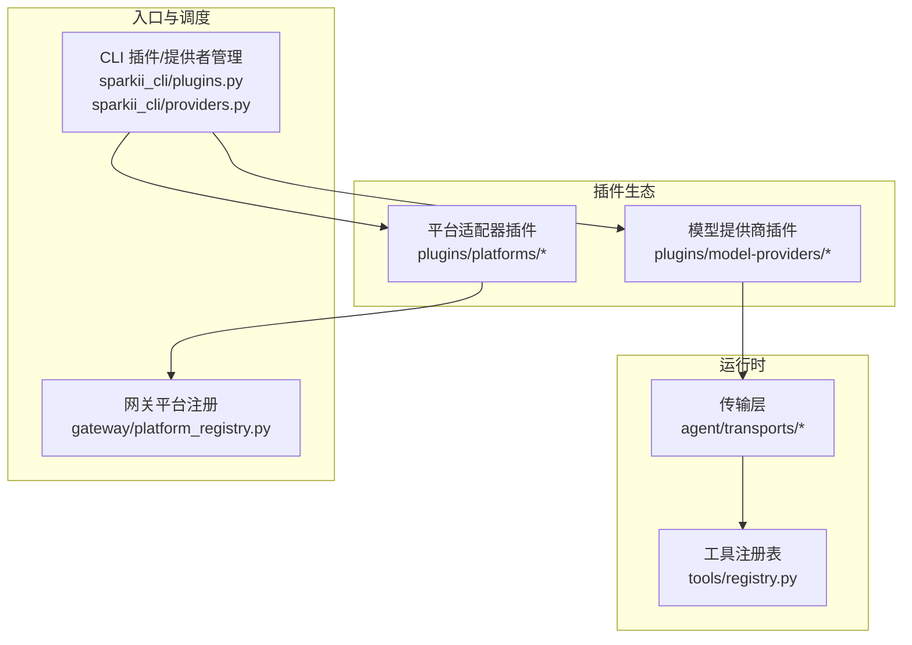
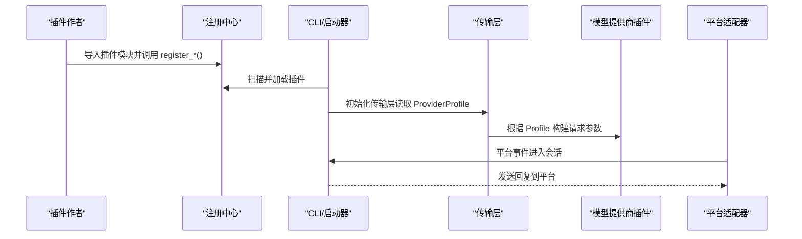
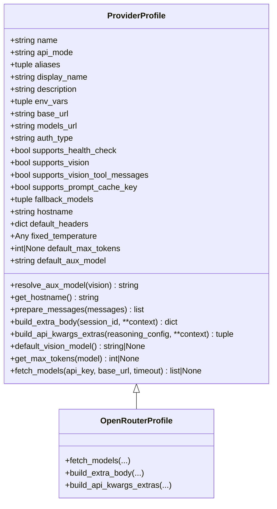
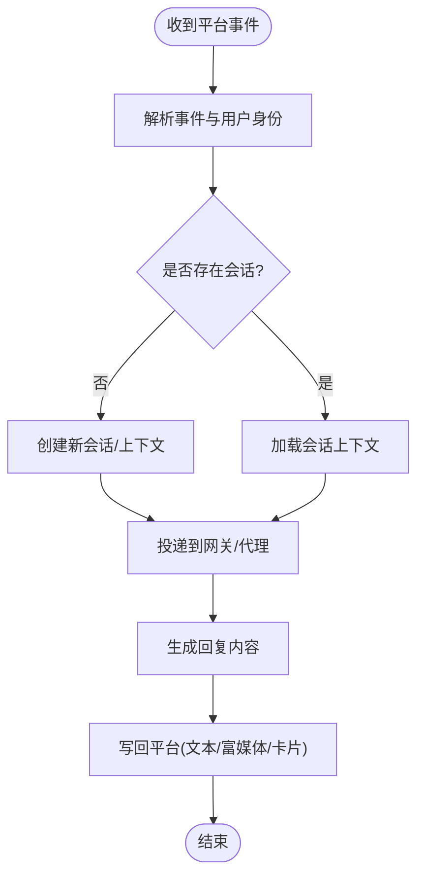
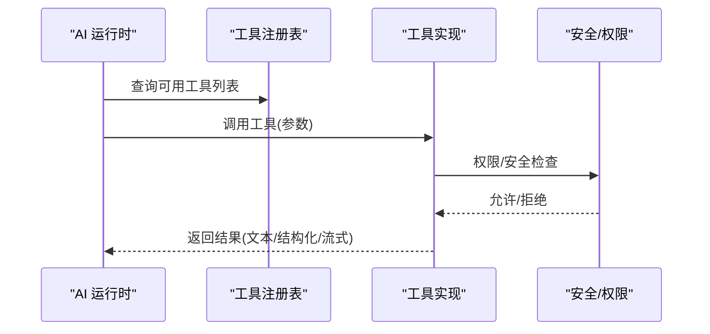
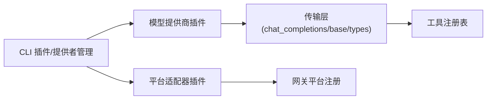

# 插件开发教程

<cite>
**本文引用的文件**
- [plugins/plugin_utils.py](file://plugins/plugin_utils.py)
- [providers/base.py](file://providers/base.py)
- [plugins/model-providers/README.md](file://plugins/model-providers/README.md)
- [plugins/model-providers/openrouter/__init__.py](file://plugins/model-providers/openrouter/__init__.py)
- [plugins/platforms/slack/__init__.py](file://plugins/platforms/slack/__init__.py)
- [plugins/platforms/slack/adapter.py](file://plugins/platforms/slack/adapter.py)
- [plugins/platforms/slack/block_kit.py](file://plugins/platforms/slack/block_kit.py)
- [agent/transports/chat_completions.py](file://agent/transports/chat_completions.py)
- [agent/transports/base.py](file://agent/transports/base.py)
- [agent/transports/types.py](file://agent/transports/types.py)
- [sparkii_cli/plugins.py](file://sparkii_cli/plugins.py)
- [sparkii_cli/providers.py](file://sparkii_cli/providers.py)
- [tools/registry.py](file://tools/registry.py)
- [tools/mcp_tool.py](file://tools/mcp_tool.py)
- [gateway/platform_registry.py](file://gateway/platform_registry.py)
- [gateway/platforms/telegram/__init__.py](file://gateway/platforms/telegram/__init__.py)
- [gateway/platforms/discord/__init__.py](file://gateway/platforms/discord/__init__.py)
- [gateway/platforms/slack/__init__.py](file://gateway/platforms/slack/__init__.py)
</cite>

## 目录
1. [简介](#简介)
2. [项目结构](#项目结构)
3. [核心组件](#核心组件)
4. [架构总览](#架构总览)
5. [详细组件分析](#详细组件分析)
6. [依赖关系分析](#依赖关系分析)
7. [性能考虑](#性能考虑)
8. [故障排查指南](#故障排查指南)
9. [结论](#结论)
10. [附录](#附录)

## 简介
本教程面向希望为系统扩展能力的开发者，围绕“插件系统”的架构设计与实现，系统性讲解插件生命周期、加载机制与扩展点；并覆盖工具插件、平台适配器、模型提供商三类插件的开发方法。文档提供从项目结构规划、代码实现、测试到发布分发的完整流程，包含注册机制、配置管理与依赖处理，以及安全、权限控制与错误处理的实践建议。

## 项目结构
仓库采用分层与按能力域组织的方式：
- 插件生态位于 plugins/ 下，包含模型提供商插件（model-providers）与消息平台适配器（platforms）。
- 运行时与传输层位于 agent/transports/，负责统一调用不同模型后端。
- CLI 与网关分别负责插件发现、注册与运行期调度。
- 工具子系统位于 tools/，提供可被 AI 调用的工具能力。

图表来源
- [plugins/model-providers/README.md:17-27](file://plugins/model-providers/README.md#L17-L27)
- [sparkii_cli/providers.py](file://sparkii_cli/providers.py)
- [sparkii_cli/plugins.py](file://sparkii_cli/plugins.py)
- [gateway/platform_registry.py](file://gateway/platform_registry.py)
- [agent/transports/chat_completions.py](file://agent/transports/chat_completions.py)

章节来源
- [plugins/model-providers/README.md:17-27](file://plugins/model-providers/README.md#L17-L27)

## 核心组件
- 模型提供商 Profile：通过声明式配置描述认证方式、端点、能力开关与请求级钩子，传输层据此构造请求。
- 平台适配器：将外部消息平台事件转换为内部会话消息，并将回复写回平台。
- 工具插件：以标准接口暴露可被 AI 调用的能力，并通过工具注册表集中管理。
- 并发单例工具：提供线程安全的懒加载单例，避免多进程/多线程下的资源竞争。

章节来源
- [providers/base.py:38-168](file://providers/base.py#L38-L168)
- [plugins/plugin_utils.py:43-136](file://plugins/plugin_utils.py#L43-L136)
- [tools/registry.py](file://tools/registry.py)
- [tools/mcp_tool.py](file://tools/mcp_tool.py)

## 架构总览
插件系统的核心思想是“声明式 + 注册式”：
- 模型提供商插件通过 ProviderProfile 声明式描述自身行为，并在模块导入时向全局注册中心登记。
- 平台适配器在网关侧注册，接收平台事件并路由到会话。
- 工具插件通过工具注册表暴露能力，AI 运行时按需调用。

图表来源
- [plugins/model-providers/README.md:17-27](file://plugins/model-providers/README.md#L17-L27)
- [providers/base.py:38-168](file://providers/base.py#L38-L168)
- [agent/transports/chat_completions.py](file://agent/transports/chat_completions.py)
- [gateway/platform_registry.py](file://gateway/platform_registry.py)

## 详细组件分析

### 模型提供商插件
- 目标：以最小成本接入新的 AI 模型服务或聚合服务。
- 关键步骤：
  - 创建插件目录与清单文件（name、kind、version、description）。
  - 定义 ProviderProfile（或子类），声明名称、别名、环境变量、基础 URL、鉴权类型、能力开关等。
  - 在模块导入时调用注册函数完成登记。
  - 如需特殊行为，覆写 build_extra_body、build_api_kwargs_extras、fetch_models、prepare_messages 等钩子。

图表来源
- [providers/base.py:38-255](file://providers/base.py#L38-L255)
- [plugins/model-providers/openrouter/__init__.py:49-214](file://plugins/model-providers/openrouter/__init__.py#L49-L214)

章节来源
- [plugins/model-providers/README.md:28-71](file://plugins/model-providers/README.md#L28-L71)
- [providers/base.py:38-255](file://providers/base.py#L38-L255)
- [plugins/model-providers/openrouter/__init__.py:49-214](file://plugins/model-providers/openrouter/__init__.py#L49-L214)

### 平台适配器插件
- 目标：对接外部消息平台（如 Slack、Telegram、Discord 等），将平台事件转为内部会话消息，并将响应写回平台。
- 典型职责：
  - 解析平台事件（消息、反应、回调等）。
  - 建立/复用会话上下文。
  - 将消息投递给网关/代理，并将结果回写到平台。
  - 处理鉴权、限流、重试与错误上报。

图表来源
- [gateway/platform_registry.py](file://gateway/platform_registry.py)
- [gateway/platforms/slack/__init__.py](file://gateway/platforms/slack/__init__.py)
- [gateway/platforms/telegram/__init__.py](file://gateway/platforms/telegram/__init__.py)
- [gateway/platforms/discord/__init__.py](file://gateway/platforms/discord/__init__.py)

章节来源
- [gateway/platform_registry.py](file://gateway/platform_registry.py)
- [gateway/platforms/slack/__init__.py](file://gateway/platforms/slack/__init__.py)
- [gateway/platforms/telegram/__init__.py](file://gateway/platforms/telegram/__init__.py)
- [gateway/platforms/discord/__init__.py](file://gateway/platforms/discord/__init__.py)

### 工具插件
- 目标：为 AI 提供可执行的操作能力（如文件操作、浏览器控制、MCP 工具等）。
- 关键点：
  - 使用工具注册表统一登记工具元数据与执行逻辑。
  - 对敏感操作进行权限校验与安全边界控制。
  - 支持异步执行、超时与结果限制。

图表来源
- [tools/registry.py](file://tools/registry.py)
- [tools/mcp_tool.py](file://tools/mcp_tool.py)

章节来源
- [tools/registry.py](file://tools/registry.py)
- [tools/mcp_tool.py](file://tools/mcp_tool.py)

### 并发与资源管理
- 插件中常见的陷阱是进程级单例的竞态条件。为此提供了线程安全的懒加载单例与槽位工具，确保首次构建后缓存实例，且异常不会污染缓存。
- 适用场景：HTTP 客户端、数据库连接、第三方 SDK 客户端等。

章节来源
- [plugins/plugin_utils.py:1-136](file://plugins/plugin_utils.py#L1-L136)

## 依赖关系分析
- 模型提供商插件依赖 providers.base.ProviderProfile 与传输层（chat_completions 等）来发起请求。
- 平台适配器依赖网关的平台注册机制，将事件路由到会话。
- 工具插件依赖工具注册表，供 AI 运行时发现和调用。
- CLI 负责插件发现与加载，将模型提供商与平台插件纳入运行环境。

图表来源
- [sparkii_cli/plugins.py](file://sparkii_cli/plugins.py)
- [sparkii_cli/providers.py](file://sparkii_cli/providers.py)
- [agent/transports/chat_completions.py](file://agent/transports/chat_completions.py)
- [agent/transports/base.py](file://agent/transports/base.py)
- [agent/transports/types.py](file://agent/transports/types.py)
- [gateway/platform_registry.py](file://gateway/platform_registry.py)
- [tools/registry.py](file://tools/registry.py)

章节来源
- [agent/transports/chat_completions.py](file://agent/transports/chat_completions.py)
- [agent/transports/base.py](file://agent/transports/base.py)
- [agent/transports/types.py](file://agent/transports/types.py)
- [gateway/platform_registry.py](file://gateway/platform_registry.py)
- [tools/registry.py](file://tools/registry.py)

## 性能考虑
- 模型提供商：
  - 使用 fetch_models 的缓存策略减少重复网络请求。
  - 合理设置默认最大输出 token 与辅助模型，降低无用开销。
  - 利用 build_extra_body/build_api_kwargs_extras 注入优化字段（如会话粘性键、推理配置）。
- 平台适配器：
  - 批量写入与去重，避免频繁 API 调用。
  - 合理设置超时与重试退避策略。
- 工具插件：
  - 对 I/O 密集操作使用异步与连接池。
  - 限制输出大小与执行时间，防止阻塞主循环。
- 并发单例：
  - 使用提供的 lazy_singleton/SingletonSlot 避免重复初始化与资源泄漏。

[本节为通用指导，不直接分析具体文件]

## 故障排查指南
- 模型提供商无法列出模型：
  - 检查 models_url/base_url 与鉴权头是否正确。
  - 确认 User-Agent 未被 WAF 拦截（默认已设置为 hermes-cli UA）。
  - 查看 fetch_models 的异常日志定位网络或格式问题。
- 平台适配器无消息：
  - 核对网关平台注册是否成功。
  - 检查事件解析与签名校验逻辑。
  - 确认会话上下文与路由规则。
- 工具调用失败：
  - 检查工具注册表是否包含该工具。
  - 验证权限与安全策略是否放行。
  - 查看工具执行的超时与错误分类。

章节来源
- [providers/base.py:224-255](file://providers/base.py#L224-L255)
- [plugins/model-providers/openrouter/__init__.py:52-76](file://plugins/model-providers/openrouter/__init__.py#L52-L76)
- [gateway/platform_registry.py](file://gateway/platform_registry.py)
- [tools/registry.py](file://tools/registry.py)

## 结论
本插件体系通过“声明式 Profile + 注册式发现”实现了高内聚、低耦合的扩展能力。模型提供商、平台适配器与工具插件各司其职，配合 CLI 与网关完成生命周期管理。遵循本文的流程与实践，可以快速、安全地扩展系统能力，并保证稳定性与可维护性。

## 附录

### 快速上手：新增一个模型提供商插件
- 步骤概览：
  - 在 plugins/model-providers/<your_provider>/ 下创建 __init__.py 与 plugin.yaml。
  - 在 __init__.py 中定义 ProviderProfile（或子类），并调用注册函数。
  - 根据需要覆写钩子以适配上游差异。
  - 通过 CLI 或网关启动后，自动发现并可用。

章节来源
- [plugins/model-providers/README.md:28-71](file://plugins/model-providers/README.md#L28-L71)
- [providers/base.py:38-168](file://providers/base.py#L38-L168)

### 快速上手：新增一个平台适配器
- 步骤概览：
  - 在 gateway/platforms/<your_platform>/ 下实现事件解析、会话映射与回复写入。
  - 在网关平台注册处登记适配器。
  - 配置鉴权与回调地址，启动后接收事件。

章节来源
- [gateway/platform_registry.py](file://gateway/platform_registry.py)
- [gateway/platforms/slack/__init__.py](file://gateway/platforms/slack/__init__.py)
- [gateway/platforms/telegram/__init__.py](file://gateway/platforms/telegram/__init__.py)
- [gateway/platforms/discord/__init__.py](file://gateway/platforms/discord/__init__.py)

### 快速上手：新增一个工具插件
- 步骤概览：
  - 在 tools/ 下实现工具逻辑，并通过工具注册表登记。
  - 在 AI 运行时中即可发现并调用。
  - 结合权限与安全策略保护敏感操作。

章节来源
- [tools/registry.py](file://tools/registry.py)
- [tools/mcp_tool.py](file://tools/mcp_tool.py)

### 安全与权限最佳实践
- 最小权限原则：仅授予工具必要的文件系统、网络与进程访问权限。
- 输入校验与输出限制：对所有外部输入进行严格校验，限制输出长度与复杂度。
- 密钥与凭据：通过环境变量或专用密钥源管理，避免硬编码。
- 审计与追踪：记录关键操作的上下文与结果，便于回溯与合规。

[本节为通用指导，不直接分析具体文件]

### 发布与分发
- 模型提供商插件：
  - 将插件目录放入 $HERMES_HOME/plugins/model-providers/<name>/，覆盖内置同名插件。
  - 清单文件需包含 name、kind、version、description。
- 平台适配器与工具插件：
  - 按照对应目录结构放置，并确保在启动时被扫描与注册。
  - 提供安装脚本或包管理器集成以便自动化部署。

章节来源
- [plugins/model-providers/README.md:17-27](file://plugins/model-providers/README.md#L17-L27)