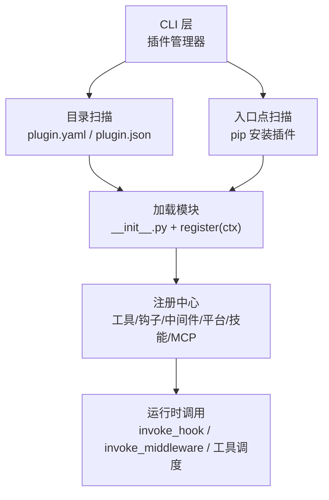
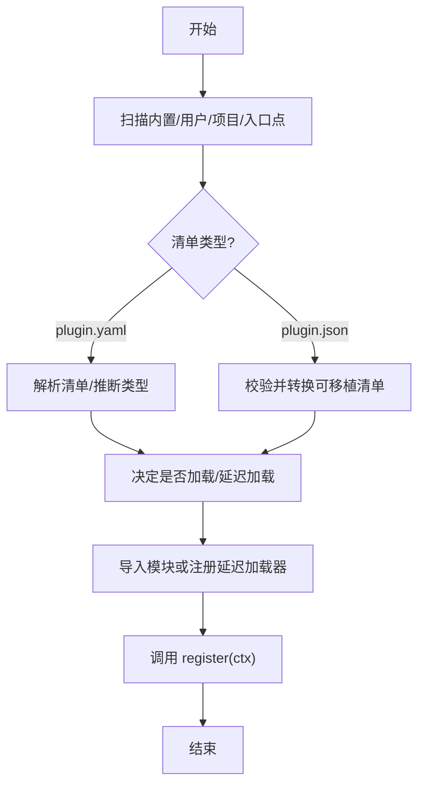
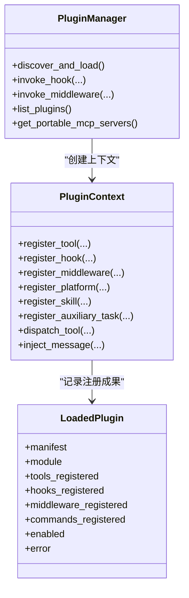
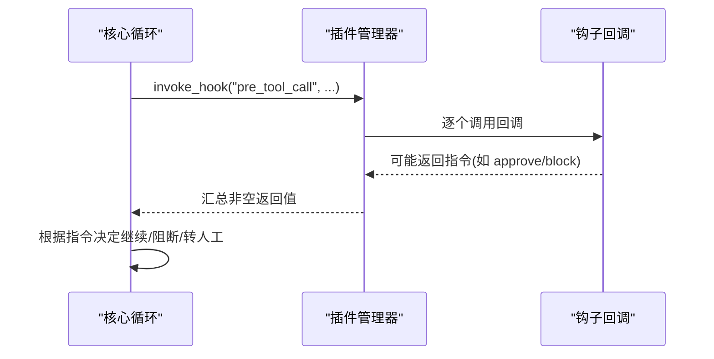
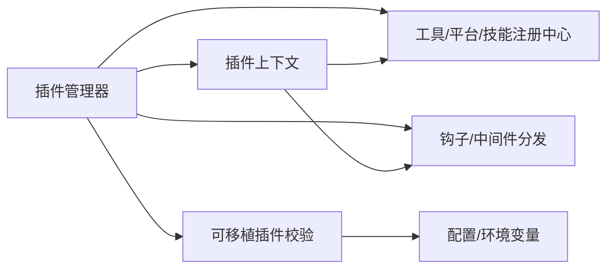

# 插件架构概览

<cite>
**本文引用的文件**
- [sparkii_cli/plugins.py](file://sparkii_cli/plugins.py)
- [sparkii_cli/agent_plugins.py](file://sparkii_cli/agent_plugins.py)
- [plugins/plugin_utils.py](file://plugins/plugin_utils.py)
- [plugins/disk-cleanup/plugin.yaml](file://plugins/disk-cleanup/plugin.yaml)
- [plugins/browser/browser_use/plugin.yaml](file://plugins/browser/browser_use/plugin.yaml)
- [plugins/memory/honcho/plugin.yaml](file://plugins/memory/honcho/plugin.yaml)
</cite>

## 目录
1. [简介](#简介)
2. [项目结构](#项目结构)
3. [核心组件](#核心组件)
4. [架构总览](#架构总览)
5. [详细组件分析](#详细组件分析)
6. [依赖关系分析](#依赖关系分析)
7. [性能考虑](#性能考虑)
8. [故障排查指南](#故障排查指南)
9. [结论](#结论)
10. [附录](#附录)

## 简介
本文件面向插件开发者与系统集成者，系统性阐述该项目的插件系统设计理念与架构模式。内容覆盖：
- 插件生命周期管理与加载机制（目录、入口点、可移植包）
- 扩展点设计（工具、钩子、中间件、平台适配器、技能、MCP、辅助任务等）
- 插件注册表工作原理、发现机制与依赖解析策略
- 插件目录结构与配置文件格式、元数据定义
- 插件与核心系统的交互方式（事件系统、配置注入、工具注册）
- 插件开发最佳实践与安全考量
- 版本管理与兼容性处理策略

## 项目结构
插件系统由“发现—加载—注册—调用”的流水线构成，围绕以下关键位置组织：
- 插件发现与加载：位于 CLI 层的插件管理器，统一扫描多种来源并加载
- 插件接口与上下文：为插件提供注册工具、钩子、平台、技能等的门面
- 可移植插件规范：对基于 JSON 的可移植插件包进行校验与翻译
- 共享并发原语：为插件作者提供线程安全的懒加载单例能力



**图表来源**
- [sparkii_cli/plugins.py:1341-1494](file://sparkii_cli/plugins.py#L1341-L1494)
- [sparkii_cli/plugins.py:1607-1716](file://sparkii_cli/plugins.py#L1607-L1716)
- [sparkii_cli/plugins.py:1813-1837](file://sparkii_cli/plugins.py#L1813-L1837)
- [sparkii_cli/plugins.py:1903-1989](file://sparkii_cli/plugins.py#L1903-L1989)

**章节来源**
- [sparkii_cli/plugins.py:1341-1494](file://sparkii_cli/plugins.py#L1341-L1494)
- [sparkii_cli/plugins.py:1607-1716](file://sparkii_cli/plugins.py#L1607-L1716)
- [sparkii_cli/plugins.py:1813-1837](file://sparkii_cli/plugins.py#L1813-L1837)
- [sparkii_cli/plugins.py:1903-1989](file://sparkii_cli/plugins.py#L1903-L1989)

## 核心组件
- 插件清单与运行态
  - 清单：描述插件名称、版本、类型、来源、键名、是否可移植等
  - 运行态：记录已加载模块、已注册的工具/钩子/中间件/命令、启用状态、错误信息
- 插件上下文（PluginContext）
  - 暴露统一的注册 API：工具、钩子、中间件、平台适配器、技能、MCP、辅助任务、消息注入、CLI/斜杠命令等
  - 安全门控：工具覆盖需显式授权；LLM 访问与子代理生命周期通过受控门面
- 插件管理器（PluginManager）
  - 负责发现、去重、加载、延迟加载平台、钩子与中间件分发、技能与 MCP 收集、列表与查询
- 可移植插件支持
  - 校验与翻译 plugin.json 与 mcp.json，发现 skills，生成安全的数据路径与环境变量
- 并发安全工具
  - 提供线程安全的懒加载单例与槽位，避免多线程竞争导致的资源泄漏

**章节来源**
- [sparkii_cli/plugins.py:307-362](file://sparkii_cli/plugins.py#L307-L362)
- [sparkii_cli/plugins.py:368-1303](file://sparkii_cli/plugins.py#L368-L1303)
- [sparkii_cli/plugins.py:1309-2258](file://sparkii_cli/plugins.py#L1309-L2258)
- [sparkii_cli/agent_plugins.py:47-77](file://sparkii_cli/agent_plugins.py#L47-L77)
- [plugins/plugin_utils.py:43-136](file://plugins/plugin_utils.py#L43-L136)

## 架构总览
下图展示插件从发现到调用的整体流程，以及各扩展点的注册与使用路径。

```mermaid
sequenceDiagram
participant Host as "宿主进程"
participant PM as "插件管理器"
participant FS as "文件系统"
participant EP as "入口点"
mod as "插件模块"
reg as "注册中心"
hook as "钩子/中间件"
tool as "工具调度"
Host->>PM : discover_and_load()
PM->>FS : 扫描目录(plugin.yaml / plugin.json)
PM->>EP : 扫描 pip 入口点
PM->>mod : 导入 __init__.py 并调用 register(ctx)
mod->>reg : 注册工具/平台/技能/MCP/辅助任务
mod->>hook : 注册钩子/中间件回调
Host->>PM : invoke_hook("pre_tool_call", ...)
PM-->>Host : 返回非空指令(可选)
Host->>tool : 调度工具执行
tool-->>Host : 返回结果
```

**图表来源**
- [sparkii_cli/plugins.py:1341-1494](file://sparkii_cli/plugins.py#L1341-L1494)
- [sparkii_cli/plugins.py:1903-1989](file://sparkii_cli/plugins.py#L1903-L1989)
- [sparkii_cli/plugins.py:2103-2169](file://sparkii_cli/plugins.py#L2103-L2169)

## 详细组件分析

### 插件发现与加载机制
- 多来源扫描
  - 内置插件：仓库内 plugins 目录（排除 memory/context_engine/platforms/model-providers 等自有发现逻辑）
  - 用户插件：~/.sparkii/plugins
  - 项目插件：./.sparkii/plugins（需环境变量开启）
  - 入口点插件：通过 pip 的 entry_points 组注册
- 优先级与去重
  - 按来源顺序收集，后者优先覆盖同名 key；exclusive 与 model-provider 走专用路径不直接加载
  - 内置 backend 自动加载；内置 platform 延迟加载以缩短启动时间
- 可移植插件
  - 检测 plugin.json，读取并转换为内部清单；仅做只读校验与组件发现，不导入 Python 代码
- 加载过程
  - 目录插件：动态创建命名空间并 exec_module，调用 register(ctx)
  - 入口点插件：通过 metadata 加载模块并调用 register(ctx)
  - 可移植插件：校验 manifest、发现 skills 与 mcp servers，注册技能与 MCP 配置



**图表来源**
- [sparkii_cli/plugins.py:1380-1494](file://sparkii_cli/plugins.py#L1380-L1494)
- [sparkii_cli/plugins.py:1607-1716](file://sparkii_cli/plugins.py#L1607-L1716)
- [sparkii_cli/plugins.py:1903-2041](file://sparkii_cli/plugins.py#L1903-L2041)
- [sparkii_cli/agent_plugins.py:97-155](file://sparkii_cli/agent_plugins.py#L97-L155)

**章节来源**
- [sparkii_cli/plugins.py:1380-1494](file://sparkii_cli/plugins.py#L1380-L1494)
- [sparkii_cli/plugins.py:1607-1716](file://sparkii_cli/plugins.py#L1607-L1716)
- [sparkii_cli/plugins.py:1903-2041](file://sparkii_cli/plugins.py#L1903-L2041)
- [sparkii_cli/agent_plugins.py:97-155](file://sparkii_cli/agent_plugins.py#L97-L155)

### 插件注册表与扩展点
- 工具注册
  - 通过 ctx.register_tool 将工具加入全局工具注册表，支持异步、环境依赖、描述与表情
  - 覆盖内置工具需显式授权（allow_tool_override），否则拒绝
- 钩子与中间件
  - 钩子：在特定生命周期触发（如 pre_tool_call、post_tool_call、on_session_* 等）
  - 中间件：可改写请求或包装执行，未知类型会警告但保留向前兼容
- 平台适配器
  - 注册网关平台适配器，支持检查函数与按需安装提示；内置平台延迟加载
- 技能与 MCP
  - 技能：以命名空间形式注册，供显式加载；可移植包自动发现 SKILL.md
  - MCP：可移植包的 mcp.json 经校验后转为内部配置，隔离命名空间
- 辅助任务
  - 声明独立的 LLM 侧任务，具备独立路由字段与默认值，避免与内置任务冲突



**图表来源**
- [sparkii_cli/plugins.py:368-1303](file://sparkii_cli/plugins.py#L368-L1303)
- [sparkii_cli/plugins.py:1309-2258](file://sparkii_cli/plugins.py#L1309-L2258)

**章节来源**
- [sparkii_cli/plugins.py:368-1303](file://sparkii_cli/plugins.py#L368-L1303)
- [sparkii_cli/plugins.py:1309-2258](file://sparkii_cli/plugins.py#L1309-L2258)

### 插件生命周期与事件系统
- 生命周期钩子集合
  - 工具前后、终端输出/工具结果转换、LLM 调用前后、会话生命周期、验证前、API 请求前后、技能生命周期、子代理启停、网关前置分发、审批前后、看板任务状态变更等
- 钩子调用
  - 每个回调被独立 try/except 包裹，异常不会中断核心循环
  - 部分钩子可返回指令（如 pre_tool_call 的 block/approve）
- 中间件
  - 用于改写有效负载或包装执行，未知类型会警告但保留兼容



**图表来源**
- [sparkii_cli/plugins.py:136-219](file://sparkii_cli/plugins.py#L136-L219)
- [sparkii_cli/plugins.py:2103-2169](file://sparkii_cli/plugins.py#L2103-L2169)

**章节来源**
- [sparkii_cli/plugins.py:136-219](file://sparkii_cli/plugins.py#L136-L219)
- [sparkii_cli/plugins.py:2103-2169](file://sparkii_cli/plugins.py#L2103-L2169)

### 插件目录结构与配置文件
- 目录布局
  - 扁平：根目录下 <plugin-name>/plugin.yaml
  - 分类：根目录下 <category>/<plugin-name>/plugin.yaml，键名为 category/name
  - 可移植：根目录下 plugin.json，可选 skills/ 与 mcp.json
- 清单字段（plugin.yaml）
  - name、version、description、author、requires_env、provides_tools、provides_hooks、kind、source、path、key、portable 等
- 可移植清单（plugin.json）
  - 遵循 v1 schema，包含 name、version、description、author、homepage、repository、license、keywords、extensions 等
  - mcp.json 声明 MCP 服务器（stdio/远程），支持路径占位符与头校验
- 示例清单
  - disk-cleanup：声明 hooks 与基本信息
  - browser-use：声明后端类型与提供的浏览器提供者
  - honcho：声明内存提供者及会话结束钩子

**章节来源**
- [sparkii_cli/plugins.py:1718-1807](file://sparkii_cli/plugins.py#L1718-L1807)
- [sparkii_cli/agent_plugins.py:97-155](file://sparkii_cli/agent_plugins.py#L97-L155)
- [plugins/disk-cleanup/plugin.yaml:1-8](file://plugins/disk-cleanup/plugin.yaml#L1-L8)
- [plugins/browser/browser_use/plugin.yaml:1-8](file://plugins/browser/browser_use/plugin.yaml#L1-L8)
- [plugins/memory/honcho/plugin.yaml:1-8](file://plugins/memory/honcho/plugin.yaml#L1-L8)

### 插件与核心系统的交互
- 事件系统
  - 通过钩子与中间件接入核心流程，实现观察、拦截、改写与增强
- 配置注入
  - 辅助任务支持独立路由字段与默认值，并在启动时桥接至环境变量
  - 可移植插件通过环境变量注入 PLUGIN_ROOT、PLUGIN_DATA，限制路径范围
- 工具注册
  - 插件通过 ctx.register_tool 注册工具，支持覆盖内置工具（需授权）
  - 工具调度通过 registry.dispatch 完成，自动注入父代理上下文（可用时）

**章节来源**
- [sparkii_cli/plugins.py:1103-1212](file://sparkii_cli/plugins.py#L1103-L1212)
- [sparkii_cli/plugins.py:439-490](file://sparkii_cli/plugins.py#L439-L490)
- [sparkii_cli/plugins.py:633-660](file://sparkii_cli/plugins.py#L633-L660)
- [sparkii_cli/agent_plugins.py:255-365](file://sparkii_cli/agent_plugins.py#L255-L365)

### 插件开发最佳实践与安全
- 并发安全
  - 使用共享的 lazy_singleton 与 SingletonSlot 避免多线程竞争导致的资源泄漏
- 安全门控
  - 覆盖内置工具必须显式授权；LLM 访问与子代理生命周期通过受控门面
  - 可移植插件路径与命令严格校验，禁止逃逸与危险字符
- 健壮性
  - 钩子与中间件回调应幂等且快速失败；异常不影响核心循环
  - 使用延迟加载减少启动开销（尤其是平台适配器）
- 可维护性
  - 清晰声明清单字段与依赖；避免与内置任务/命令冲突
  - 使用命名空间注册技能，避免污染全局

**章节来源**
- [plugins/plugin_utils.py:43-136](file://plugins/plugin_utils.py#L43-L136)
- [sparkii_cli/plugins.py:498-520](file://sparkii_cli/plugins.py#L498-L520)
- [sparkii_cli/agent_plugins.py:290-365](file://sparkii_cli/agent_plugins.py#L290-L365)

### 版本管理与兼容性处理
- 清单版本
  - 可移植插件使用固定 schema 版本（v1），确保向后兼容
  - 未知字段会被忽略并记录诊断，避免破坏性升级
- 插件类型与发现
  - kind 字段支持 standalone/backend/exclusive/platform/model-provider，未知类型降级为 standalone 并告警
  - exclusive 与 model-provider 走专用发现路径，避免重复加载
- 配置迁移与白名单
  - enabled/disabled 列表控制加载；legacy bare name 仍兼容
  - 项目插件需显式开启，防止意外加载

**章节来源**
- [sparkii_cli/agent_plugins.py:21-44](file://sparkii_cli/agent_plugins.py#L21-L44)
- [sparkii_cli/plugins.py:1738-1783](file://sparkii_cli/plugins.py#L1738-L1783)
- [sparkii_cli/plugins.py:1398-1487](file://sparkii_cli/plugins.py#L1398-L1487)

## 依赖关系分析
- 组件耦合
  - 插件管理器与插件上下文强耦合，负责生命周期与注册
  - 可移植插件模块与 CLI 层解耦，仅做只读校验与组件发现
  - 平台适配器延迟加载，降低启动期依赖
- 外部依赖
  - 工具注册表、平台注册表、TTS/STT/图像/视频/搜索/浏览器等子系统通过注册中心集成
  - 配置系统用于启用/禁用与条目级权限控制
- 潜在循环
  - 通过延迟 import 避免循环依赖（如 tools.registry、gateway.platform_registry）



**图表来源**
- [sparkii_cli/plugins.py:1309-2258](file://sparkii_cli/plugins.py#L1309-L2258)
- [sparkii_cli/agent_plugins.py:451-485](file://sparkii_cli/agent_plugins.py#L451-L485)

**章节来源**
- [sparkii_cli/plugins.py:1309-2258](file://sparkii_cli/plugins.py#L1309-L2258)
- [sparkii_cli/agent_plugins.py:451-485](file://sparkii_cli/agent_plugins.py#L451-L485)

## 性能考虑
- 启动优化
  - 内置平台延迟加载，避免一次性导入重型 SDK
  - 可移植插件只做只读扫描，不导入 Python 代码
- 运行时优化
  - 钩子与中间件回调异常隔离，避免长尾影响主循环
  - 使用线程安全懒加载单例减少重复初始化成本
- 资源管理
  - 可移植插件数据目录隔离，避免污染插件包
  - 工具覆盖需显式授权，防止误用导致额外开销

[本节为通用指导，无需具体文件引用]

## 故障排查指南
- 常见问题定位
  - 未找到 register()：插件模块缺少必要入口
  - 清单解析失败：检查 YAML/JSON 格式与字段约束
  - 钩子回调异常：查看日志中的 Hook 回调异常信息
  - 工具覆盖被拒：确认是否配置 allow_tool_override
- 调试建议
  - 启用插件调试日志（环境变量开关），查看扫描与加载细节
  - 使用 list_plugins 查看已发现插件的状态与错误信息
  - 对于可移植插件，关注诊断信息与路径/命令校验错误

**章节来源**
- [sparkii_cli/plugins.py:1930-1989](file://sparkii_cli/plugins.py#L1930-L1989)
- [sparkii_cli/plugins.py:2103-2169](file://sparkii_cli/plugins.py#L2103-L2169)
- [sparkii_cli/plugins.py:2191-2211](file://sparkii_cli/plugins.py#L2191-L2211)

## 结论
该插件系统通过统一的发现与加载管线、丰富的扩展点与严格的安全门控，实现了高内聚、低耦合的生态扩展能力。其设计兼顾了启动性能、运行时稳定性与可维护性，适合大规模插件生态演进。开发者应遵循清单规范、安全约定与并发最佳实践，充分利用钩子、中间件与注册中心构建可靠、可观测、可扩展的功能。

[本节为总结性内容，无需具体文件引用]

## 附录
- 术语
  - 插件清单：描述插件元数据的配置文件（plugin.yaml 或 plugin.json）
  - 可移植插件：基于 JSON 的无代码依赖插件包，仅做只读校验与组件发现
  - 钩子：生命周期回调，用于观察与干预核心流程
  - 中间件：行为改写或执行包装的回调
  - 平台适配器：网关平台的接入实现
  - 技能：可读的说明文档与元数据，供显式加载
  - MCP：模型通信协议服务器配置
  - 辅助任务：独立的 LLM 侧任务，具备独立路由与默认值

[本节为概念性内容，无需具体文件引用]