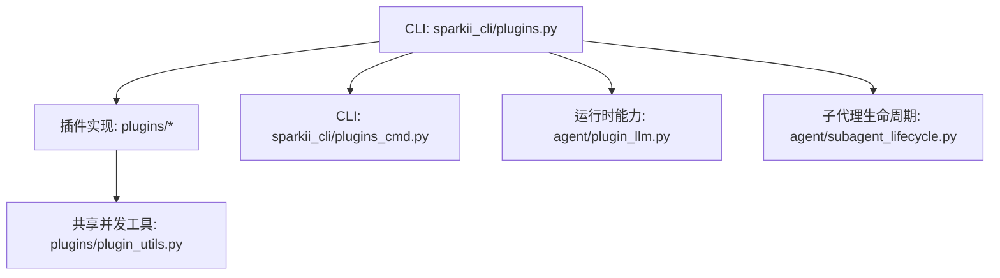
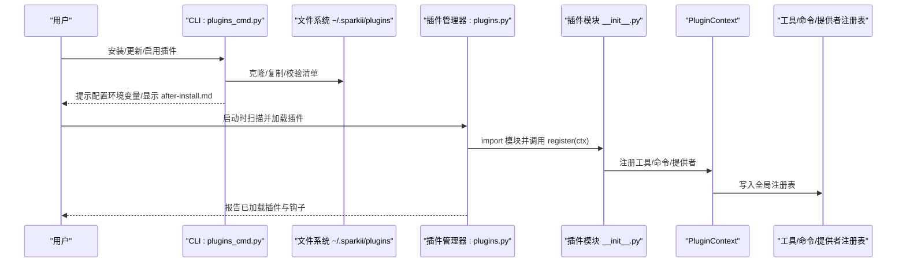
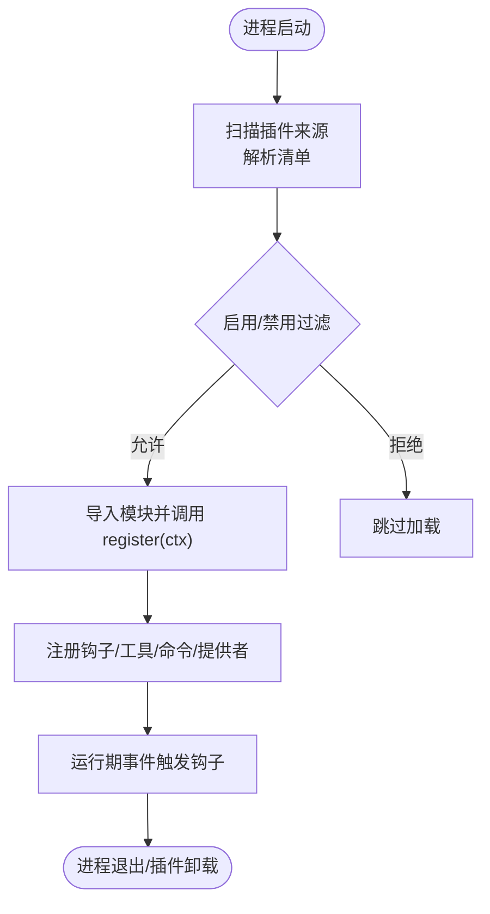
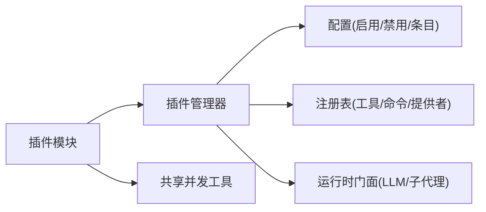

# 插件生命周期管理

<cite>
**本文引用的文件**
- [sparkii_cli/plugins.py](file://sparkii_cli/plugins.py)
- [sparkii_cli/plugins_cmd.py](file://sparkii_cli/plugins_cmd.py)
- [plugins/plugin_utils.py](file://plugins/plugin_utils.py)
- [agent/plugin_llm.py](file://agent/plugin_llm.py)
- [agent/subagent_lifecycle.py](file://agent/subagent_lifecycle.py)
</cite>

## 目录
1. [简介](#简介)
2. [项目结构](#项目结构)
3. [核心组件](#核心组件)
4. [架构总览](#架构总览)
5. [详细组件分析](#详细组件分析)
6. [依赖关系分析](#依赖关系分析)
7. [性能考量](#性能考量)
8. [故障排查指南](#故障排查指南)
9. [结论](#结论)
10. [附录](#附录)

## 简介
本文件面向插件开发者与运维人员，系统化说明插件的完整生命周期：安装、加载、初始化、运行与卸载；阐述插件状态管理与健康检查、错误恢复与资源清理；提供监控与调试方法（日志、性能、诊断）；说明更新机制（热重载、版本兼容、回滚策略）；覆盖安全验证、权限控制与沙箱隔离；并汇总命令行工具与API接口。

## 项目结构
仓库采用“核心宿主 + 插件生态”的分层组织：
- 插件发现与生命周期管理位于 CLI 层，负责扫描、解析清单、注册钩子/工具/命令等。
- 插件实现位于 plugins 目录，按功能域划分（平台、模型提供者、可观测性等）。
- 运行时能力通过上下文对象暴露给插件（如 LLM、子代理生命周期、工具注册等）。
- 插件安装/更新/移除由独立的 CLI 子命令完成，支持 Git 源、子目录、环境变量引导等。

图表来源
- [sparkii_cli/plugins.py:1-800](file://sparkii_cli/plugins.py#L1-L800)
- [sparkii_cli/plugins_cmd.py:1-800](file://sparkii_cli/plugins_cmd.py#L1-L800)
- [plugins/plugin_utils.py:1-136](file://plugins/plugin_utils.py#L1-L136)
- [agent/plugin_llm.py](file://agent/plugin_llm.py)
- [agent/subagent_lifecycle.py](file://agent/subagent_lifecycle.py)

章节来源
- [sparkii_cli/plugins.py:1-800](file://sparkii_cli/plugins.py#L1-L800)
- [sparkii_cli/plugins_cmd.py:1-800](file://sparkii_cli/plugins_cmd.py#L1-L800)
- [plugins/plugin_utils.py:1-136](file://plugins/plugin_utils.py#L1-L136)

## 核心组件
- 插件清单与已加载状态
  - 清单数据模型：描述名称、版本、作者、所需环境、提供的工具/钩子、来源、键名、是否便携等。
  - 已加载状态：记录模块引用、已注册的工具/钩子/中间件/命令、启用状态、错误信息、延迟加载标记等。
- 插件上下文 PluginContext
  - 向插件暴露的能力：LLM 访问、子代理生命周期、当前 Profile、工具注册、消息注入、CLI/斜杠命令注册、上下文引擎/图像/视频/搜索等提供者注册。
  - 安全门控：对覆盖内置工具的 override 操作需显式授权，否则拒绝。
- 钩子系统
  - 定义一组受支持的钩子点（工具调用前后、终端输出转换、LLM 调用前后、会话生命周期、网关分发前、审批流程、看板任务状态等），由宿主在合适时机触发。
- 插件管理器
  - 负责从多个来源发现插件（内置、用户、项目、pip entry points），处理命名冲突（后者优先）、启用/禁用白名单与黑名单、加载模块并执行 register(ctx)。

章节来源
- [sparkii_cli/plugins.py:307-362](file://sparkii_cli/plugins.py#L307-L362)
- [sparkii_cli/plugins.py:368-800](file://sparkii_cli/plugins.py#L368-L800)
- [sparkii_cli/plugins.py:136-219](file://sparkii_cli/plugins.py#L136-L219)

## 架构总览
下图展示插件从安装到运行的关键路径与交互方。

图表来源
- [sparkii_cli/plugins_cmd.py:584-667](file://sparkii_cli/plugins_cmd.py#L584-L667)
- [sparkii_cli/plugins_cmd.py:670-729](file://sparkii_cli/plugins_cmd.py#L670-L729)
- [sparkii_cli/plugins.py:368-800](file://sparkii_cli/plugins.py#L368-L800)

## 详细组件分析

### 插件生命周期阶段
- 安装
  - 支持 Git URL、owner/repo 简写、浏览器链接、带子目录的安装。
  - 校验清单版本兼容性，拷贝示例配置文件，提示缺失的环境变量。
  - 可选自动启用；否则需手动启用。
- 加载
  - 启动时扫描多来源目录与入口点，解析 plugin.yaml/json，生成清单。
  - 根据启用/禁用列表过滤，处理同名冲突（后者优先）。
  - 导入模块并调用 register(ctx)，完成工具/钩子/命令/提供者注册。
- 初始化
  - 插件可在 register(ctx) 中完成一次性初始化（如连接池、缓存预热）。
  - 使用线程安全的懒单例工具避免竞态与资源泄漏。
- 运行
  - 宿主在相应事件点触发钩子（工具调用前后、LLM 调用前后、会话开始/结束/重置、网关分发前、审批流程、看板任务状态变更等）。
  - 插件可通过 ctx.dispatch_tool 调用其他工具，或通过消息注入参与对话流。
- 卸载
  - 通过 CLI 删除插件目录；若为 Git 源，update 会清理旧字节码并同步新内容。
  - 宿主重启后不再加载该插件。

图表来源
- [sparkii_cli/plugins.py:136-219](file://sparkii_cli/plugins.py#L136-L219)
- [sparkii_cli/plugins.py:307-362](file://sparkii_cli/plugins.py#L307-L362)
- [sparkii_cli/plugins_cmd.py:584-729](file://sparkii_cli/plugins_cmd.py#L584-L729)

章节来源
- [sparkii_cli/plugins_cmd.py:584-729](file://sparkii_cli/plugins_cmd.py#L584-L729)
- [sparkii_cli/plugins.py:136-219](file://sparkii_cli/plugins.py#L136-L219)
- [sparkii_cli/plugins.py:307-362](file://sparkii_cli/plugins.py#L307-L362)

### 状态管理与健康检查
- 状态字段
  - 清单与已加载状态包含 name/version/source/key/enabled/error/deferred 等字段，便于列出、诊断与选择性加载。
- 健康检查
  - 通过钩子在关键路径上报状态（如 on_session_start/end、pre/post_api_request、pre/post_tool_call 等），插件可据此实现自检与告警。
- 错误恢复
  - 注册过程异常会被记录，插件可借助 try/except 保护初始化逻辑；宿主侧对类型不匹配的提供者注册进行静默忽略，避免崩溃传播。
- 资源清理
  - 建议在 on_session_end/on_session_finalize 中释放连接、关闭句柄、清理临时文件；使用线程安全单例的 reset 能力在测试或重启场景重建实例。

章节来源
- [sparkii_cli/plugins.py:307-362](file://sparkii_cli/plugins.py#L307-L362)
- [sparkii_cli/plugins.py:136-219](file://sparkii_cli/plugins.py#L136-L219)
- [plugins/plugin_utils.py:43-81](file://plugins/plugin_utils.py#L43-L81)
- [plugins/plugin_utils.py:84-136](file://plugins/plugin_utils.py#L84-L136)

### 监控与调试
- 日志收集
  - 设置 SPARKII_PLUGINS_DEBUG=1 可将插件发现与加载的详细日志输出到 stderr，同时保留到 agent.log。
  - 插件应使用标准 logging 模块，避免直接 print。
- 性能分析
  - 利用 pre/post 钩子埋点统计耗时；结合系统指标与外部可观测性后端（如 OTLP）上报。
- 故障诊断
  - 使用 sparkii plugins list/status（如存在）查看已加载插件与错误；检查 config.yaml 的 enabled/disabled 列表；核对 requires_env 是否配置。

章节来源
- [sparkii_cli/plugins.py:83-130](file://sparkii_cli/plugins.py#L83-L130)
- [sparkii_cli/plugins.py:136-219](file://sparkii_cli/plugins.py#L136-L219)

### 更新机制
- 热重载
  - 代码层未提供进程内热重载；通常通过重启 gateway 或进程重新加载插件。
  - update 会拉取最新代码并清理 __pycache__，确保新字节码生效。
- 版本兼容性
  - 清单声明 manifest_version，安装器仅支持到某版本；超出则提示升级宿主。
- 回滚策略
  - 基于 Git 的版本历史可回退到指定提交；也可通过禁用/启用切换不同版本插件目录。

章节来源
- [sparkii_cli/plugins_cmd.py:670-713](file://sparkii_cli/plugins_cmd.py#L670-L713)
- [sparkii_cli/plugins_cmd.py:540-556](file://sparkii_cli/plugins_cmd.py#L540-L556)

### 安全验证、权限控制与沙箱隔离
- 安全验证
  - 安装时对 Git URL 进行规范化与子目录逃逸防护；http/file 协议安装会给出安全警告。
  - 清单版本校验，防止不兼容清单导致行为异常。
- 权限控制
  - 插件覆盖内置工具需显式授权（allow_tool_override），否则抛出权限错误。
  - 插件对 LLM 的调用通过受限门面进行，默认禁止覆盖模型/认证等敏感能力。
- 沙箱隔离
  - 插件以 Python 模块形式加载，无独立进程级沙箱；建议插件遵循最小权限原则，避免直接访问敏感 API。
  - 通过注册表与上下文限定插件可访问能力边界。

章节来源
- [sparkii_cli/plugins_cmd.py:83-137](file://sparkii_cli/plugins_cmd.py#L83-L137)
- [sparkii_cli/plugins_cmd.py:154-247](file://sparkii_cli/plugins_cmd.py#L154-L247)
- [sparkii_cli/plugins_cmd.py:584-667](file://sparkii_cli/plugins_cmd.py#L584-L667)
- [sparkii_cli/plugins.py:439-520](file://sparkii_cli/plugins.py#L439-L520)
- [sparkii_cli/plugins.py:380-413](file://sparkii_cli/plugins.py#L380-L413)

### 命令行工具与 API 接口
- 命令行
  - 安装：sparkii plugins install <标识符> [--force] [--enable/--no-enable]
  - 更新：sparkii plugins update <插件名>
  - 移除：sparkii plugins remove <插件名>
  - 标识符支持：Git URL、owner/repo、浏览器链接、子目录、片段 #path/to/plugin。
- API/扩展点
  - 插件通过 register(ctx) 暴露能力：
    - 工具注册：ctx.register_tool(...)
    - CLI/斜杠命令：ctx.register_cli_command(...) / ctx.register_command(...)
    - 提供者注册：图像/视频/搜索/上下文引擎/Dashboard 认证等
    - 消息注入：ctx.inject_message(...)
    - 工具调度：ctx.dispatch_tool(...)
  - 钩子：在 VALID_HOOKS 集合中定义的钩子点由宿主触发。

章节来源
- [sparkii_cli/plugins_cmd.py:584-729](file://sparkii_cli/plugins_cmd.py#L584-L729)
- [sparkii_cli/plugins.py:368-800](file://sparkii_cli/plugins.py#L368-L800)
- [sparkii_cli/plugins.py:136-219](file://sparkii_cli/plugins.py#L136-L219)

## 依赖关系分析
- 插件管理器依赖：
  - 配置读取（enabled/disabled/entries）
  - 工具/命令/提供者注册表
  - 运行时能力门面（LLM、子代理生命周期）
- 插件实现依赖：
  - 共享并发工具（懒单例、线程安全槽）
  - 宿主暴露的上下文与注册表

图表来源
- [sparkii_cli/plugins.py:368-800](file://sparkii_cli/plugins.py#L368-L800)
- [plugins/plugin_utils.py:1-136](file://plugins/plugin_utils.py#L1-L136)

章节来源
- [sparkii_cli/plugins.py:368-800](file://sparkii_cli/plugins.py#L368-L800)
- [plugins/plugin_utils.py:1-136](file://plugins/plugin_utils.py#L1-L136)

## 性能考量
- 懒加载与单例
  - 使用 lazy_singleton 与 SingletonSlot 避免重复初始化与竞态条件，降低启动开销与内存占用。
- 钩子粒度
  - 将重计算放入合适的钩子（如会话开始/结束），避免在高频路径（工具调用前后）做昂贵操作。
- 字节码清理
  - 更新插件后清理 __pycache__，避免旧字节码导致的性能抖动或行为不一致。

章节来源
- [plugins/plugin_utils.py:43-136](file://plugins/plugin_utils.py#L43-L136)
- [sparkii_cli/plugins_cmd.py:697-701](file://sparkii_cli/plugins_cmd.py#L697-L701)

## 故障排查指南
- 常见问题
  - 插件未加载：检查 enabled/disabled 列表、清单是否存在且有效、register(ctx) 是否被调用。
  - 工具未注册：确认 register_tool 参数正确、未尝试覆盖内置工具而未授权。
  - 环境变量缺失：安装后根据提示配置 .env 中的 requires_env。
- 定位手段
  - 开启 SPARKII_PLUGINS_DEBUG=1 获取详细发现与加载日志。
  - 查看插件 error 字段与日志输出，必要时重启进程重新加载。
- 恢复步骤
  - 更新/回滚到已知稳定版本；必要时禁用问题插件并逐步启用排查。

章节来源
- [sparkii_cli/plugins.py:83-130](file://sparkii_cli/plugins.py#L83-L130)
- [sparkii_cli/plugins_cmd.py:584-667](file://sparkii_cli/plugins_cmd.py#L584-L667)

## 结论
本项目的插件体系通过清晰的清单模型、严格的启用/禁用策略、丰富的钩子与注册能力，实现了可扩展、可控的插件生态。配合 CLI 安装/更新/移除与调试开关，可满足从开发到生产的全链路需求。建议插件遵循最小权限与安全最佳实践，充分利用懒加载与单例提升性能，并通过钩子实现健壮的健康检查与资源清理。

## 附录
- 常用环境变量
  - SPARKII_PLUGINS_DEBUG：启用插件调试日志
  - SPARKII_BUNDLED_PLUGINS：覆盖内置插件目录（打包/只读场景）
- 清单关键字段（节选）
  - name/version/description/author/requires_env/provides_tools/provides_hooks/source/path/kind/key/portable/skill_namespace
- 典型工作流
  - 安装 -> 配置环境变量 -> 启用 -> 重启 -> 观察钩子日志 -> 按需更新/回滚