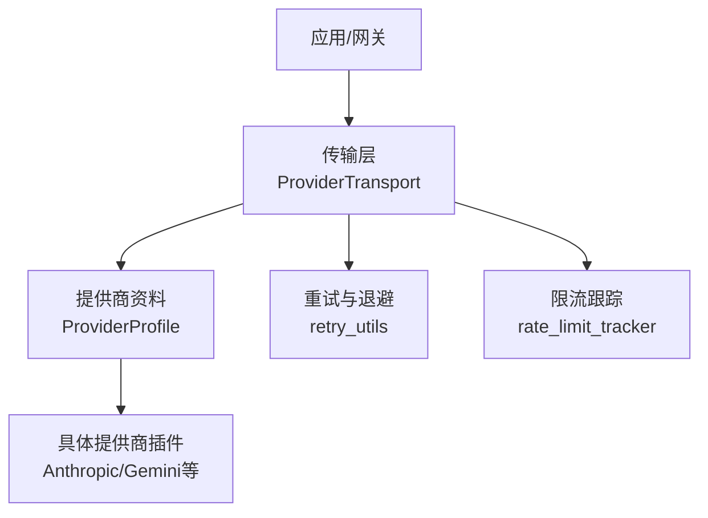
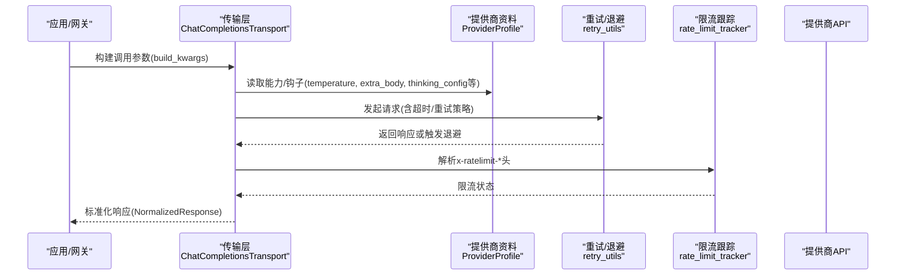
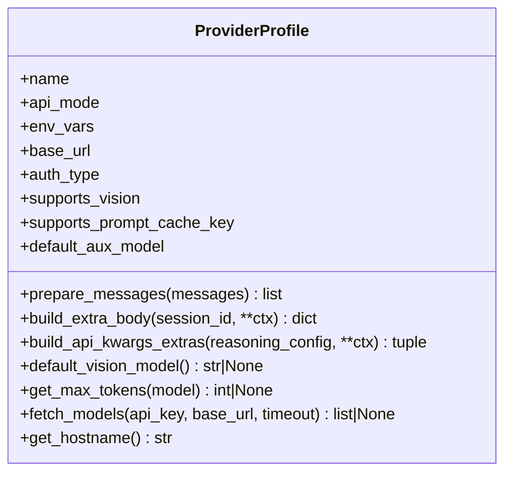
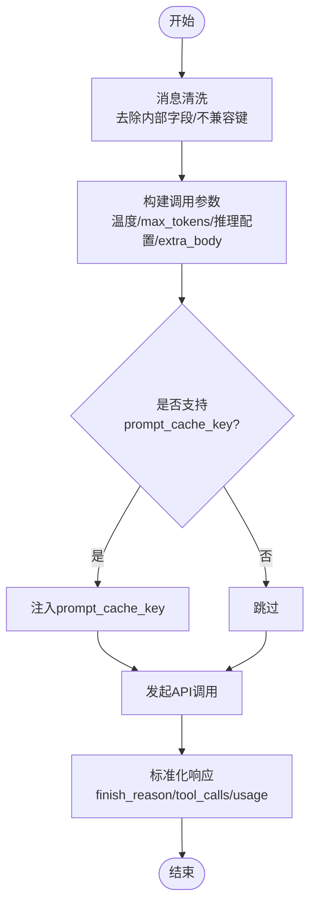
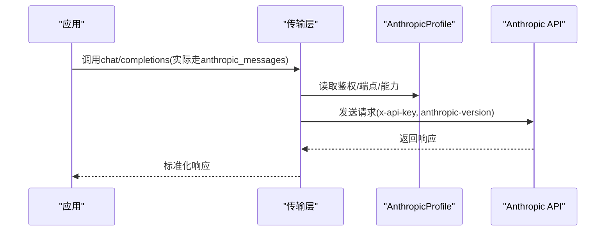
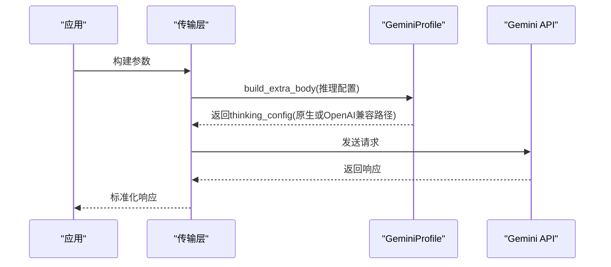
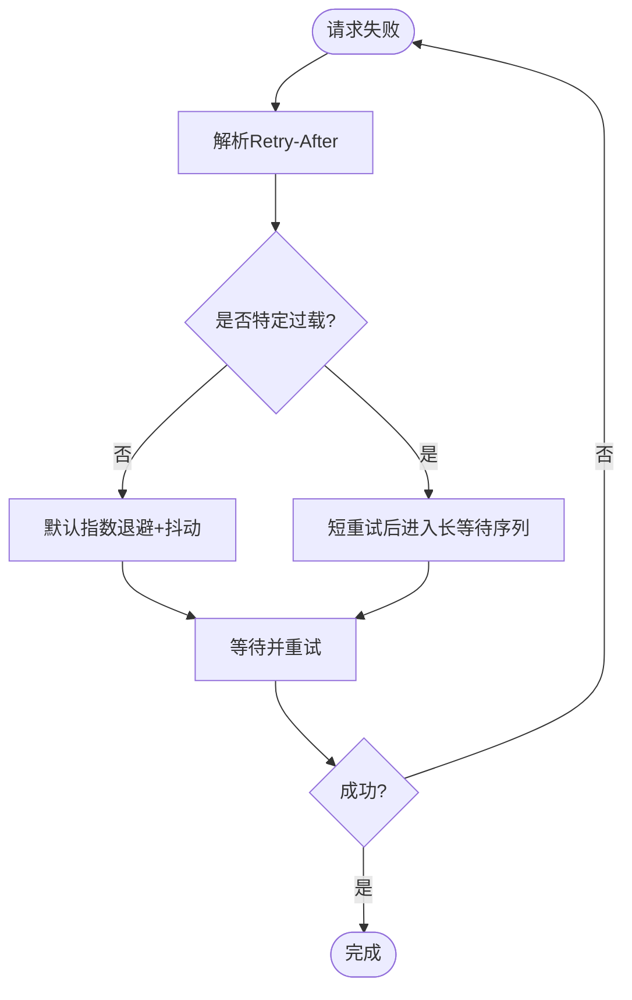
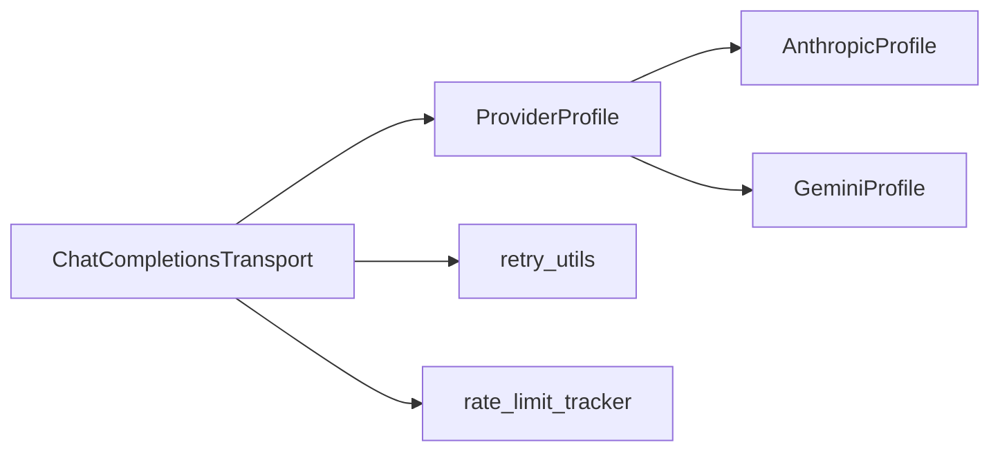

# 模型提供商集成

<cite>
**本文引用的文件**
- [providers/base.py](file://providers/base.py)
- [agent/transports/base.py](file://agent/transports/base.py)
- [agent/transports/chat_completions.py](file://agent/transports/chat_completions.py)
- [plugins/model-providers/anthropic/__init__.py](file://plugins/model-providers/anthropic/__init__.py)
- [plugins/model-providers/gemini/__init__.py](file://plugins/model-providers/gemini/__init__.py)
- [agent/retry_utils.py](file://agent/retry_utils.py)
- [agent/rate_limit_tracker.py](file://agent/rate_limit_tracker.py)
</cite>

## 目录
1. [简介](#简介)
2. [项目结构](#项目结构)
3. [核心组件](#核心组件)
4. [架构总览](#架构总览)
5. [详细组件分析](#详细组件分析)
6. [依赖关系分析](#依赖关系分析)
7. [性能考虑](#性能考虑)
8. [故障排除指南](#故障排除指南)
9. [结论](#结论)
10. [附录](#附录)

## 简介
本指南面向希望将新的AI模型提供商接入系统的开发者，覆盖API接口适配、认证机制、流式响应处理、错误重试与限流、配置与密钥管理、多提供商切换机制，以及性能优化与故障排除。系统通过声明式的“提供商资料（ProviderProfile）”和“传输层（Transport）”解耦具体实现，使新增提供商只需聚焦协议差异与端点细节。

## 项目结构
- 提供商抽象与注册
  - 提供商资料：定义名称、鉴权方式、端点、能力标志、默认参数与钩子方法，用于描述提供商行为而不持有客户端或流式逻辑。
  - 传输层：负责消息与工具格式转换、构建调用参数、标准化响应，屏蔽不同提供商的协议差异。
- 具体提供商插件
  - 以插件形式提供各提供商的资料实例与注册，例如Anthropic与Gemini。
- 可靠性与可观测性
  - 重试与退避：去抖指数退避、特定供应商过载策略、解析Retry-After。
  - 限流跟踪：解析x-ratelimit-*头并格式化展示。

图表来源
- [agent/transports/base.py:16-90](file://agent/transports/base.py#L16-L90)
- [providers/base.py:38-255](file://providers/base.py#L38-L255)
- [plugins/model-providers/anthropic/__init__.py:14-55](file://plugins/model-providers/anthropic/__init__.py#L14-L55)
- [plugins/model-providers/gemini/__init__.py:18-62](file://plugins/model-providers/gemini/__init__.py#L18-L62)
- [agent/retry_utils.py:38-209](file://agent/retry_utils.py#L38-L209)
- [agent/rate_limit_tracker.py:30-129](file://agent/rate_limit_tracker.py#L30-L129)

章节来源
- [providers/base.py:38-255](file://providers/base.py#L38-L255)
- [agent/transports/base.py:16-90](file://agent/transports/base.py#L16-L90)

## 核心组件
- ProviderProfile（提供商资料）
  - 声明式描述提供商身份、鉴权类型、端点、能力标志（如是否支持视觉、提示缓存键）、默认参数与钩子（消息预处理、额外请求体、推理配置拆分、默认视觉模型、最大令牌上限、模型列表拉取）。
  - 关键能力：
    - 准备消息与工具：prepare_messages、convert_tools（由传输层调用）。
    - 构建额外请求体：build_extra_body、build_api_kwargs_extras。
    - 动态模型发现：fetch_models（带鉴权与UA定制）。
    - 主机名推导：get_hostname。
- ProviderTransport（传输层基类）
  - 统一数据路径：convert_messages → convert_tools → build_kwargs → normalize_response。
  - 可选能力：validate_response、extract_cache_stats、map_finish_reason。
- ChatCompletionsTransport（OpenAI兼容传输）
  - 针对chat_completions模式的消息清洗、工具定义透传、复杂参数组装（温度、max_tokens、推理配置、thinking_config、extra_body、prompt_cache_key等），并支持按提供商资料路径构建参数。
  - 标准化响应：提取finish_reason、tool_calls、usage等。

章节来源
- [providers/base.py:38-255](file://providers/base.py#L38-L255)
- [agent/transports/base.py:16-90](file://agent/transports/base.py#L16-L90)
- [agent/transports/chat_completions.py:207-747](file://agent/transports/chat_completions.py#L207-L747)

## 架构总览
下图展示了从应用到提供商的完整调用链，包括传输层、提供商资料、重试与限流模块的协作。

图表来源
- [agent/transports/chat_completions.py:356-747](file://agent/transports/chat_completions.py#L356-L747)
- [providers/base.py:133-255](file://providers/base.py#L133-L255)
- [agent/retry_utils.py:90-209](file://agent/retry_utils.py#L90-L209)
- [agent/rate_limit_tracker.py:92-129](file://agent/rate_limit_tracker.py#L92-L129)

## 详细组件分析

### 提供商资料 ProviderProfile
- 职责
  - 集中声明提供商元信息、鉴权、端点、能力标志、默认参数与钩子。
  - 提供模型列表拉取与主机名推导，便于健康检查与路由。
- 关键钩子
  - prepare_messages：在消息进入传输前进行提供商特定预处理。
  - build_extra_body/build_api_kwargs_extras：拼装extra_body与顶层api_kwargs，分离reasoning/thinking等字段位置差异。
  - default_vision_model/get_max_tokens/fetch_models：运行时能力与限制。
- 使用建议
  - 新增提供商时，优先继承ProviderProfile并实现必要钩子；避免在传输层堆叠条件分支。

图表来源
- [providers/base.py:38-255](file://providers/base.py#L38-L255)

章节来源
- [providers/base.py:38-255](file://providers/base.py#L38-L255)

### 传输层 ProviderTransport 与 ChatCompletionsTransport
- ProviderTransport
  - 定义统一的转换与标准化接口，屏蔽提供商差异。
- ChatCompletionsTransport
  - 消息清洗：移除内部字段与严格提供商不识别的键，保留必要的provider_data（如thought_signature）。
  - 参数构建：
    - 温度控制：固定温度、省略温度、用户传入优先级。
    - max_tokens：临时覆盖 > 用户配置 > 提供商默认。
    - 推理配置：按提供商映射为reasoning/thinking_config。
    - extra_body：聚合tags、provider偏好、插件、thinking_config等。
    - prompt_cache_key：仅在明确支持的端点注入。
  - 响应标准化：finish_reason、tool_calls、usage等。

图表来源
- [agent/transports/chat_completions.py:217-747](file://agent/transports/chat_completions.py#L217-L747)

章节来源
- [agent/transports/base.py:16-90](file://agent/transports/base.py#L16-L90)
- [agent/transports/chat_completions.py:217-747](file://agent/transports/chat_completions.py#L217-L747)

### 具体提供商示例

#### Anthropic（原生Messages API）
- 特点
  - 使用x-api-key与anthropic-version头。
  - 自定义模型列表拉取逻辑。
- 集成要点
  - 在插件中注册AnthropicProfile，设置api_mode为anthropic_messages，并提供正确的鉴权与环境变量。
  - 传输层会按该模式的转换规则处理消息与工具。

图表来源
- [plugins/model-providers/anthropic/__init__.py:14-55](file://plugins/model-providers/anthropic/__init__.py#L14-L55)

章节来源
- [plugins/model-providers/anthropic/__init__.py:14-55](file://plugins/model-providers/anthropic/__init__.py#L14-L55)

#### Google Gemini（原生与OpenAI兼容路径）
- 特点
  - 原生端点与OpenAI兼容子路径均支持，但thinking_config字段位置不同。
  - 通过ProviderProfile钩子在extra_body中注入thinking_config。
- 集成要点
  - 根据base_url判断是否为OpenAI兼容路径，决定thinking_config嵌套位置。
  - 非Gemini模型需避免发送thinking_config，防止校验失败。

图表来源
- [plugins/model-providers/gemini/__init__.py:18-62](file://plugins/model-providers/gemini/__init__.py#L18-L62)
- [agent/transports/chat_completions.py:93-170](file://agent/transports/chat_completions.py#L93-L170)

章节来源
- [plugins/model-providers/gemini/__init__.py:18-62](file://plugins/model-providers/gemini/__init__.py#L18-L62)
- [agent/transports/chat_completions.py:93-170](file://agent/transports/chat_completions.py#L93-L170)

### 错误重试与限流

#### 重试与退避
- 去抖指数退避：避免并发重试风暴。
- 特定供应商过载策略：对Z.AI Coding Plan GLM-5.2的429采用短重试后长等待序列。
- Retry-After解析：支持数值与HTTP日期格式。

图表来源
- [agent/retry_utils.py:38-209](file://agent/retry_utils.py#L38-L209)

章节来源
- [agent/retry_utils.py:38-209](file://agent/retry_utils.py#L38-L209)

#### 限流跟踪
- 解析x-ratelimit-*头，生成分钟/小时维度的请求与令牌配额状态。
- 提供人类可读的展示与紧凑摘要，便于诊断与监控。

章节来源
- [agent/rate_limit_tracker.py:30-129](file://agent/rate_limit_tracker.py#L30-L129)
- [agent/rate_limit_tracker.py:182-247](file://agent/rate_limit_tracker.py#L182-L247)

## 依赖关系分析
- 低耦合设计
  - 传输层仅依赖ProviderProfile的能力与钩子，不感知具体提供商实现细节。
  - 提供商插件仅注册自身Profile，保持最小侵入。
- 外部依赖
  - 网络请求安全封装（open_credentialed_url）。
  - 标准库urllib与JSON解析。
- 潜在循环与风险
  - 延迟导入避免循环依赖（如CLI版本获取）。
  - 严格提供商对未知字段敏感，需在传输层做字段裁剪。

图表来源
- [agent/transports/chat_completions.py:207-747](file://agent/transports/chat_completions.py#L207-L747)
- [providers/base.py:38-255](file://providers/base.py#L38-L255)
- [plugins/model-providers/anthropic/__init__.py:14-55](file://plugins/model-providers/anthropic/__init__.py#L14-L55)
- [plugins/model-providers/gemini/__init__.py:18-62](file://plugins/model-providers/gemini/__init__.py#L18-L62)

章节来源
- [agent/transports/chat_completions.py:207-747](file://agent/transports/chat_completions.py#L207-L747)
- [providers/base.py:38-255](file://providers/base.py#L38-L255)

## 性能考虑
- 提示缓存键
  - 仅在明确支持的端点注入prompt_cache_key，避免严格提供商拒绝未知字段。
- 消息清洗
  - 提前剥离内部字段与不兼容键，减少400/422错误与重传成本。
- 推理配置映射
  - 针对不同提供商精确映射effort/thinking_level/budget，避免无效字段导致校验失败。
- 限流可视化
  - 利用x-ratelimit-*头进行前端/日志展示，辅助调优并发与重试策略。

[本节为通用指导，无需引用具体文件]

## 故障排除指南
- 常见错误定位
  - 400/422：检查消息与工具字段是否被正确清洗；确认thinking_config/extra_content等字段仅在目标提供商允许时发送。
  - 429：查看retry_utils中的过载策略与Retry-After解析；结合rate_limit_tracker的限流状态调整并发。
  - 鉴权失败：核对env_vars与鉴权头（如Anthropic的x-api-key）。
- 调试步骤
  - 启用传输层日志，观察build_kwargs生成的最终参数。
  - 使用fetch_models验证端点可达性与鉴权。
  - 对比不同提供商的thinking_config形状，确保与base_url匹配。

章节来源
- [agent/transports/chat_completions.py:217-747](file://agent/transports/chat_completions.py#L217-L747)
- [agent/retry_utils.py:38-209](file://agent/retry_utils.py#L38-L209)
- [agent/rate_limit_tracker.py:92-129](file://agent/rate_limit_tracker.py#L92-L129)
- [plugins/model-providers/anthropic/__init__.py:14-55](file://plugins/model-providers/anthropic/__init__.py#L14-L55)

## 结论
通过ProviderProfile与ProviderTransport的解耦设计，新增AI模型提供商只需关注协议差异与端点细节，即可快速接入。系统内置的重试、限流与消息清洗能力，显著降低了集成复杂度与出错概率。建议在新增提供商时优先复用现有钩子与传输层能力，保持代码简洁与可维护性。

## 附录
- 集成开发流程清单
  - 创建提供商插件并实现ProviderProfile（鉴权、端点、能力标志、钩子）。
  - 注册提供商至全局注册表。
  - 在传输层中通过api_mode选择对应转换逻辑。
  - 配置环境变量与密钥管理（参考env_vars）。
  - 测试模型列表拉取与健康检查。
  - 验证消息清洗、工具定义、推理配置与extra_body。
  - 观察限流与重试行为，必要时调整策略。
- 多提供商切换机制
  - 通过api_mode与ProviderProfile的name/aliases进行路由。
  - 基于base_url与hostname进行反向映射与检测。
- 流式响应处理
  - 传输层标准化响应，上层可按需消费流式片段（不在本仓库文件中直接体现，遵循统一接口）。

[本节为通用指导，无需引用具体文件]