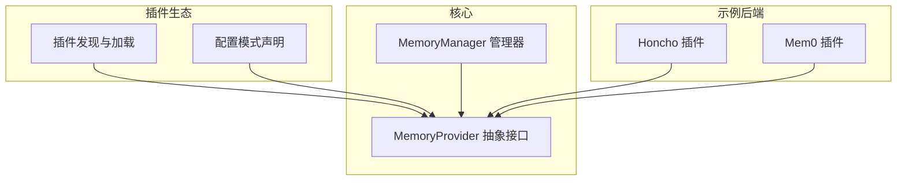
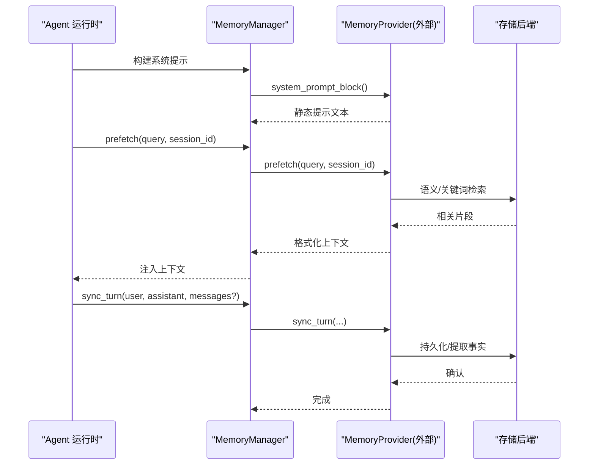
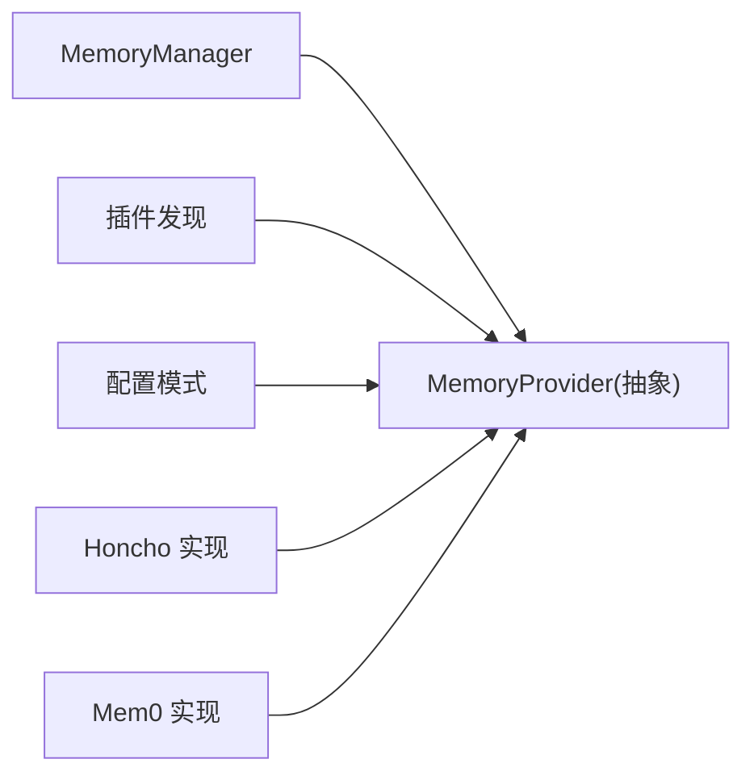

# 记忆存储提供商

<cite>
**本文引用的文件**
- [plugins/memory/__init__.py](file://plugins/memory/__init__.py)
- [plugins/memory/config_schema.py](file://plugins/memory/config_schema.py)
- [agent/memory_provider.py](file://agent/memory_provider.py)
- [agent/memory_manager.py](file://agent/memory_manager.py)
- [plugins/memory/honcho/__init__.py](file://plugins/memory/honcho/__init__.py)
- [plugins/memory/mem0/__init__.py](file://plugins/memory/mem0/__init__.py)
</cite>

## 目录
1. [简介](#简介)
2. [项目结构](#项目结构)
3. [核心组件](#核心组件)
4. [架构总览](#架构总览)
5. [详细组件分析](#详细组件分析)
6. [依赖关系分析](#依赖关系分析)
7. [性能考虑](#性能考虑)
8. [故障排查指南](#故障排查指南)
9. [结论](#结论)
10. [附录](#附录)

## 简介
本指南面向希望开发自定义“记忆存储提供商”的工程师，目标是帮助你基于统一的抽象接口实现新的记忆后端，并理解系统在短期记忆、长期记忆与用户画像管理方面的设计。文档涵盖：
- 存储接口定义与生命周期
- 查询优化与数据持久化策略
- 插件发现与配置声明机制
- 不同后端的实现示例（向量数据库、关系型数据库、内存存储）
- 数据迁移、备份恢复与性能调优
- 安全与隐私保护建议

## 项目结构
记忆系统以“插件化”的方式组织，核心由抽象接口、管理器与插件发现/配置层组成；具体后端以独立插件目录提供。

图表来源
- [agent/memory_provider.py:81-192](file://agent/memory_provider.py#L81-L192)
- [agent/memory_manager.py:364-470](file://agent/memory_manager.py#L364-L470)
- [plugins/memory/__init__.py:146-217](file://plugins/memory/__init__.py#L146-L217)
- [plugins/memory/config_schema.py:94-145](file://plugins/memory/config_schema.py#L94-L145)

章节来源
- [plugins/memory/__init__.py:1-217](file://plugins/memory/__init__.py#L1-L217)
- [plugins/memory/config_schema.py:1-145](file://plugins/memory/config_schema.py#L1-L145)
- [agent/memory_provider.py:1-192](file://agent/memory_provider.py#L1-L192)
- [agent/memory_manager.py:1-470](file://agent/memory_manager.py#L1-L470)

## 核心组件
- MemoryProvider（抽象接口）
  - 定义统一的生命周期与能力：可用性检查、初始化、系统提示块、预取召回、同步写入、工具暴露与调用、会话钩子、备份路径等。
  - 关键方法包括 is_available、initialize、system_prompt_block、prefetch、queue_prefetch、sync_turn、get_tool_schemas、handle_tool_call、shutdown，以及可选钩子 on_turn_start、on_session_end、on_session_switch、on_pre_compress、on_delegation、backup_paths。
- MemoryManager（管理器）
  - 负责注册与管理多个提供者（内置 + 最多一个外部），编排系统提示、预取与同步流程，提供后台执行与超时控制，避免慢/卡住的提供者阻塞主流程。
- 插件发现与配置
  - 插件发现：扫描内置与用户安装目录，支持 register(ctx) 或继承 MemoryProvider 两种注册方式，仅允许一个外部提供者激活。
  - 配置模式：通过 config_schema.py 声明字段类型、是否机密、作用域等，由通用 UI 与 API 渲染与读写。

章节来源
- [agent/memory_provider.py:81-358](file://agent/memory_provider.py#L81-L358)
- [agent/memory_manager.py:364-800](file://agent/memory_manager.py#L364-L800)
- [plugins/memory/__init__.py:146-217](file://plugins/memory/__init__.py#L146-L217)
- [plugins/memory/config_schema.py:30-145](file://plugins/memory/config_schema.py#L30-L145)

## 架构总览
下图展示了从管理器到提供者的调用链，以及典型的前置预取与后置同步流程。

图表来源
- [agent/memory_manager.py:486-694](file://agent/memory_manager.py#L486-L694)
- [agent/memory_provider.py:123-170](file://agent/memory_provider.py#L123-L170)

## 详细组件分析

### 抽象接口 MemoryProvider
- 职责边界
  - 生命周期：is_available、initialize、shutdown
  - 上下文：system_prompt_block、prefetch、queue_prefetch
  - 写入：sync_turn（可接受 messages）
  - 工具：get_tool_schemas、handle_tool_call
  - 扩展点：on_turn_start、on_session_end、on_session_switch、on_pre_compress、on_delegation、backup_paths
- 设计要点
  - 所有网络/IO 操作应异步或后台化，避免阻塞对话主循环
  - 对 trivial prompt 进行过滤，减少无效召回
  - 提供 backup_paths 以便跨环境迁移时包含外部状态

章节来源
- [agent/memory_provider.py:81-358](file://agent/memory_provider.py#L81-L358)

### 管理器 MemoryManager
- 编排策略
  - 仅允许一个外部提供者，避免工具名冲突与重复开销
  - 预取：对外部提供者使用线程+超时，失败不阻断其他提供者
  - 同步：通过单工作线程序列化写入，保证顺序性
  - 工具注入：规范化工具 schema，屏蔽保留工具名冲突
- 健壮性
  - 后台任务在关闭时设置超时，避免进程挂起
  - 对 provider 异常做隔离与日志记录

章节来源
- [agent/memory_manager.py:364-800](file://agent/memory_manager.py#L364-L800)

### 插件发现与配置
- 插件发现
  - 扫描内置 plugins/memory/<name>/ 与用户目录 $SPARKII_HOME/plugins/<name>/
  - 支持 register(ctx) 或继承 MemoryProvider 两种方式
  - 名称冲突时内置优先
- 配置模式
  - 通过 ProviderConfigSchema 声明字段类型、默认值、是否机密、作用域等
  - 通用 UI/API 根据声明渲染与读写，无需为每个提供者定制界面

章节来源
- [plugins/memory/__init__.py:60-217](file://plugins/memory/__init__.py#L60-L217)
- [plugins/memory/config_schema.py:30-145](file://plugins/memory/config_schema.py#L30-L145)

### 示例后端一：Honcho（AI 原生记忆/用户画像）
- 能力概览
  - 提供 profile/search/reasoning/context/conclude 等工具
  - 支持 context/tools/hybrid 三种召回模式
  - 首次对话预热、上下文缓存、推理深度控制
- 关键流程
  - initialize：解析配置、建立会话、可选迁移与预热
  - prefetch：组合基础上下文（representation/card）与辩证补充
  - sync_turn：后台写入，不影响主流程
- 配置与备份
  - 保存 honcho.json（原子写入）
  - 上报外部路径用于备份

章节来源
- [plugins/memory/honcho/__init__.py:237-800](file://plugins/memory/honcho/__init__.py#L237-L800)

### 示例后端二：Mem0（服务端抽取/语义搜索）
- 能力概览
  - 支持平台云、自托管 HTTP、OSS 三种模式
  - 提供 search/add/update/delete 工具
  - 预取采用短等待热路径，失败启用熔断器
- 关键流程
  - initialize：加载配置、选择后端、确定 user_id/agent_id
  - prefetch：后台搜索并缓存结果，供当前轮次消费
  - sync_turn：后台提交消息进行事实抽取与存储
- 配置与容错
  - 读取 .env 与 mem0.json 合并配置
  - 连续失败触发熔断冷却，降低雪崩风险

章节来源
- [plugins/memory/mem0/__init__.py:194-629](file://plugins/memory/mem0/__init__.py#L194-L629)

### 概念总览：短期记忆、长期记忆与用户画像
- 短期记忆
  - 当前会话内的上下文窗口，通常由模型上下文与压缩策略管理
  - 可通过 on_pre_compress 将重要信息提前抽取并融入压缩摘要
- 长期记忆
  - 跨会话的事实、偏好、决策等，由外部提供者持久化
  - 通过 sync_turn 持续沉淀，通过 prefetch 按需召回
- 用户画像
  - 结构化表征（如 representation/card），可由提供者维护并随时间演进
  - 结合推理工具生成综合答案，支撑个性化交互

[本节为概念说明，不直接分析具体文件]

## 依赖关系分析
- 耦合与内聚
  - MemoryProvider 高内聚地封装单一后端逻辑
  - MemoryManager 低耦合地编排多个提供者，屏蔽差异
- 外部依赖
  - 插件发现依赖文件系统与动态导入
  - 配置模式依赖纯数据声明，UI/API 层解耦业务逻辑
- 潜在环依赖
  - 通过抽象接口与插件命名空间隔离，避免循环导入

图表来源
- [agent/memory_manager.py:364-470](file://agent/memory_manager.py#L364-L470)
- [plugins/memory/__init__.py:146-217](file://plugins/memory/__init__.py#L146-L217)
- [plugins/memory/config_schema.py:94-145](file://plugins/memory/config_schema.py#L94-L145)

章节来源
- [agent/memory_manager.py:364-470](file://agent/memory_manager.py#L364-L470)
- [plugins/memory/__init__.py:146-217](file://plugins/memory/__init__.py#L146-L217)
- [plugins/memory/config_schema.py:94-145](file://plugins/memory/config_schema.py#L94-L145)

## 性能考虑
- 预取与同步分离
  - 预取走快速路径，必要时短等待；失败降级为工具调用兜底
  - 同步写入后台串行化，避免竞争与乱序
- 超时与熔断
  - 外部提供者预取带超时，防止阻塞主循环
  - Mem0 实现使用熔断器抑制雪崩
- 缓存与节流
  - Honcho 维护基础上下文缓存与调用频率控制
  - 按 turn 计数与阈值控制昂贵操作（如推理）
- 索引与查询优化
  - 向量库：合理维度与距离度量，批量写入，分页检索
  - 关系库：复合索引、全文检索、冷热分层
  - 内存存储：LRU/TTL 策略，限制最大条目数
- 资源与并发
  - 单写线程保证顺序，读并发可控
  - 后台线程守护化，避免进程退出阻塞

[本节提供通用指导，不直接分析具体文件]

## 故障排查指南
- 常见问题定位
  - 提供者未激活：检查 is_available 返回与配置项是否齐全
  - 预取超时：查看外部提供者线程是否存活，调整超时或优化后端
  - 同步失败：关注后台任务日志，确认连接与权限
  - 工具冲突：确保工具名不与核心保留名冲突
- 诊断手段
  - 启用调试日志，观察 MemoryManager 与 Provider 的调用链
  - 使用 flush_pending 等待后台任务完成，便于断言一致性
  - 借助 backup_paths 验证外部状态是否纳入备份

章节来源
- [agent/memory_manager.py:547-780](file://agent/memory_manager.py#L547-L780)
- [plugins/memory/mem0/__init__.py:294-336](file://plugins/memory/mem0/__init__.py#L294-L336)

## 结论
通过统一的 MemoryProvider 抽象与 MemoryManager 编排，系统实现了可扩展、健壮的跨会话记忆能力。开发者只需实现接口并遵循最佳实践，即可快速接入向量库、关系库或内存存储等不同后端。配合配置模式与插件发现机制，可在不改动核心代码的前提下扩展新能力。

[本节为总结，不直接分析具体文件]

## 附录

### 开发流程清单
- 设计阶段
  - 明确短期/长期记忆边界与用户画像粒度
  - 规划数据模型、索引策略与缓存机制
- 实现阶段
  - 实现 MemoryProvider 的核心方法与可选钩子
  - 提供 get_tool_schemas 与 handle_tool_call
  - 实现 is_available、initialize、shutdown
  - 实现 queue_prefetch/prefetch 与 sync_turn 的异步化
  - 实现 backup_paths 以支持迁移
- 配置与发布
  - 编写 config_schema.py 声明配置字段与作用域
  - 在 __init__.py 中注册插件（register 或继承类）
  - 提供 plugin.yaml 描述信息
- 测试与调优
  - 覆盖正常/异常路径与超时场景
  - 压测预取与同步吞吐，调整批大小与并发
  - 校验工具名无冲突，schema 可被正确注入

[本节为流程指导，不直接分析具体文件]

### 数据迁移、备份与恢复
- 迁移
  - 利用 on_session_switch/on_pre_compress 在会话切换或压缩前抽取关键信息
  - 对于旧格式数据，在 initialize 中执行一次性迁移（如 Honcho 的文件迁移）
- 备份与恢复
  - 通过 backup_paths 声明外部状态路径，纳入归档与还原
  - 确保敏感配置以机密字段形式存储，不在 API 响应中回显

章节来源
- [agent/memory_provider.py:214-358](file://agent/memory_provider.py#L214-L358)
- [plugins/memory/honcho/__init__.py:240-251](file://plugins/memory/honcho/__init__.py#L240-L251)

### 安全与隐私
- 机密配置
  - 使用 secret 类型字段，写入环境变量或受保护的存储
  - 避免在日志与 API 响应中泄露敏感信息
- 访问控制
  - 对用户/会话维度进行隔离（user_id/session_id）
  - 最小权限原则，仅暴露必要工具与方法
- 合规与审计
  - 记录写入来源与上下文（metadata），便于追溯
  - 提供删除/更新能力，满足遗忘与更正需求

章节来源
- [plugins/memory/config_schema.py:52-88](file://plugins/memory/config_schema.py#L52-L88)
- [plugins/memory/mem0/__init__.py:372-383](file://plugins/memory/mem0/__init__.py#L372-L383)