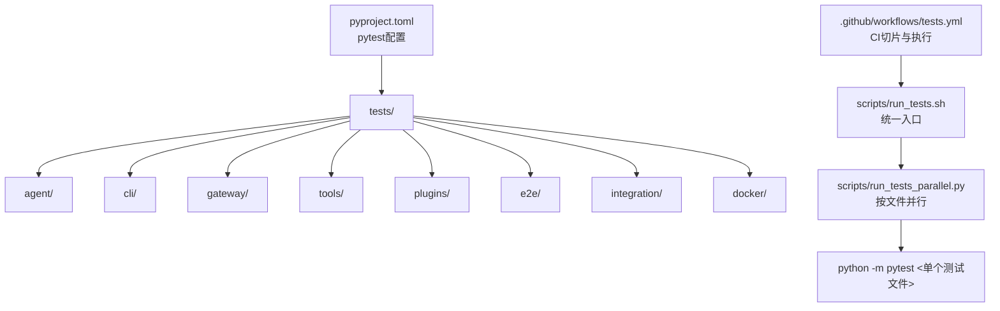
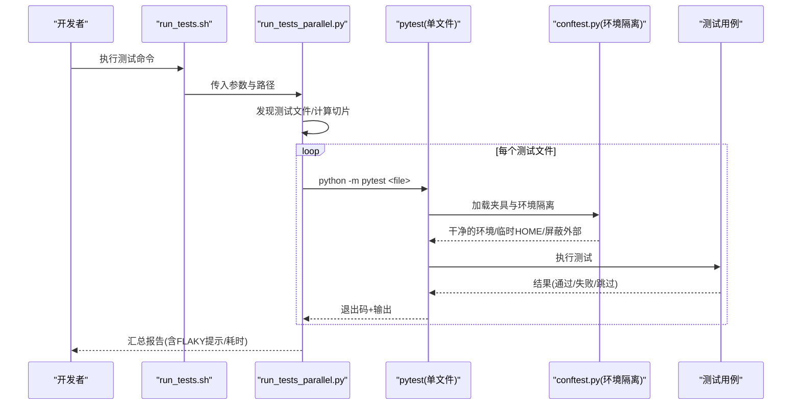
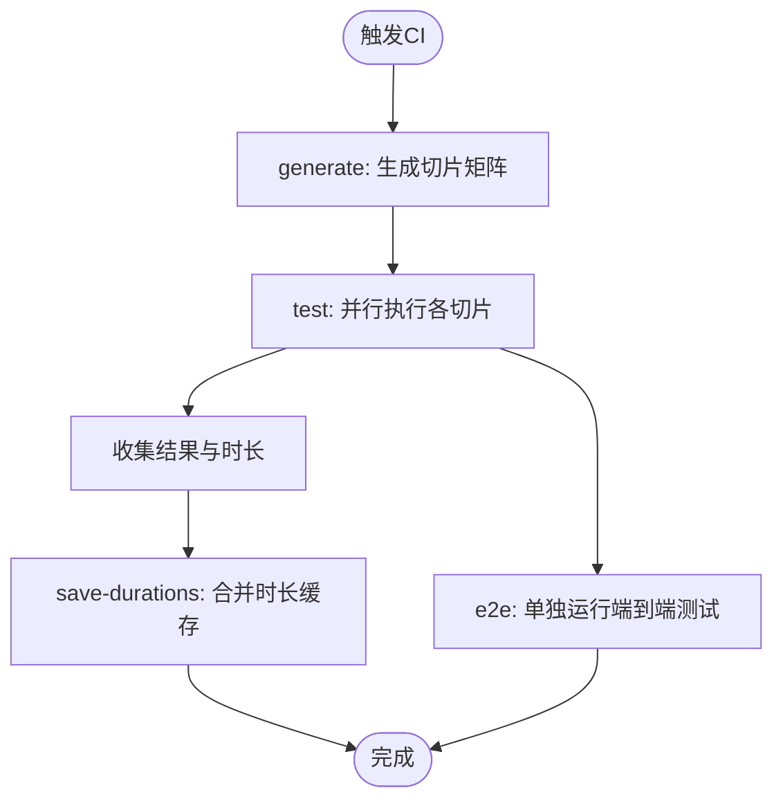
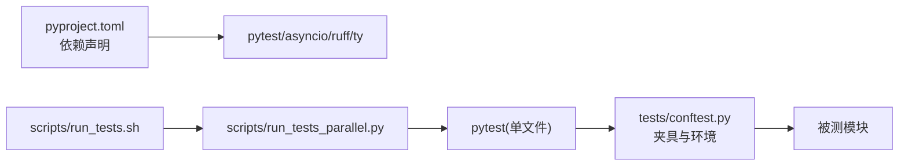

# 测试指南

<cite>
**本文引用的文件**
- [tests/conftest.py](file://tests/conftest.py)
- [pyproject.toml](file://pyproject.toml)
- [scripts/run_tests.sh](file://scripts/run_tests.sh)
- [scripts/run_tests_parallel.py](file://scripts/run_tests_parallel.py)
- [.github/workflows/tests.yml](file://.github/workflows/tests.yml)
- [tests/acp/conftest.py](file://tests/acp/conftest.py)
</cite>

## 目录
1. [简介](#简介)
2. [项目结构](#项目结构)
3. [核心组件](#核心组件)
4. [架构总览](#架构总览)
5. [详细组件分析](#详细组件分析)
6. [依赖关系分析](#依赖关系分析)
7. [性能考量](#性能考量)
8. [故障排查指南](#故障排查指南)
9. [结论](#结论)
10. [附录](#附录)

## 简介
本指南面向Sparkii Desktop项目的测试体系，覆盖单元测试、集成测试与端到端测试的组织方式、测试框架配置（pytest）、夹具与模拟策略、工具/平台适配器/API测试方法、测试数据与环境管理、持续集成流程，以及性能/负载/安全测试的实施建议、覆盖率与质量门禁、调试与常见失败处理。目标是帮助开发者在本地与CI中稳定、高效地运行与维护测试套件。

## 项目结构
- 测试根目录：tests
  - 按模块划分子目录（agent、cli、gateway、tools、plugins等），每个子目录包含对应模块的单元/集成测试。
  - e2e：端到端测试（默认跳过，由专用CI任务执行）。
  - integration：历史遗留集成测试（默认跳过）。
  - docker：容器相关测试（默认跳过，由专用CI任务执行）。
  - fixtures/fakes：共享夹具与伪造实现。
- 顶层配置：
  - pyproject.toml：定义pytest入口、标记、默认选项等。
  - scripts/run_tests.sh：统一入口脚本，确保环境与隔离一致。
  - scripts/run_tests_parallel.py：按文件并行执行pytest子进程，提供切片、重试、超时控制等能力。
- CI流水线：
  - .github/workflows/tests.yml：生成切片、安装依赖、运行测试与E2E、合并时长缓存。

**图示来源**
- [pyproject.toml:412-423](file://pyproject.toml#L412-L423)
- [scripts/run_tests.sh:1-33](file://scripts/run_tests.sh#L1-L33)
- [scripts/run_tests_parallel.py:1-40](file://scripts/run_tests_parallel.py#L1-L40)
- [.github/workflows/tests.yml:1-55](file://.github/workflows/tests.yml#L1-L55)

**章节来源**
- [pyproject.toml:412-423](file://pyproject.toml#L412-L423)
- [scripts/run_tests.sh:1-33](file://scripts/run_tests.sh#L1-L33)
- [scripts/run_tests_parallel.py:1-40](file://scripts/run_tests_parallel.py#L1-L40)
- [.github/workflows/tests.yml:1-55](file://.github/workflows/tests.yml#L1-L55)

## 核心组件
- 环境隔离与确定性
  - 自动清理敏感环境变量（API Key/Token/Secret等）与行为开关变量，避免本地密钥泄露或行为差异。
  - 将SPARKII_HOME重定向到每测试临时目录，防止写入真实用户目录；同时保护kanban/state数据库不被误写。
  - 固定时区、语言、哈希种子，保证时间/排序/随机性可重现。
- 浏览器与系统调用屏蔽
  - 拦截webbrowser打开操作，记录URL而非真正弹出浏览器。
  - 禁用AWS元数据服务探测，避免测试阻塞。
  - 禁用Tirith自动安装，避免网络/包管理器副作用。
- 模块级状态隔离
  - 通过“按文件独立进程”的方式彻底消除跨文件模块级状态泄漏；文件内顺序由作者负责。
  - 针对tui_gateway.server等全局状态模块，提供快照/恢复机制，确保任意文件组合顺序无关。
- 插件与提供者初始化隔离
  - 重置插件单例，避免跨测试污染。
  - 针对特定模块（如ACP）提供离线夹具，阻断模型清单的网络请求。

**章节来源**
- [tests/conftest.py:1-20](file://tests/conftest.py#L1-L20)
- [tests/conftest.py:119-229](file://tests/conftest.py#L119-L229)
- [tests/conftest.py:429-526](file://tests/conftest.py#L429-L526)
- [tests/conftest.py:536-583](file://tests/conftest.py#L536-L583)
- [tests/conftest.py:586-718](file://tests/conftest.py#L586-L718)
- [tests/conftest.py:720-800](file://tests/conftest.py#L720-L800)
- [tests/acp/conftest.py:1-33](file://tests/acp/conftest.py#L1-L33)

## 架构总览
测试执行链路从统一入口脚本开始，进入按文件并行器，再为每个测试文件启动独立的pytest进程，从而获得最强的隔离性。CI通过“生成切片”将测试集均衡分配到多个作业，提升吞吐并降低超时风险。

**图示来源**
- [scripts/run_tests.sh:1-33](file://scripts/run_tests.sh#L1-L33)
- [scripts/run_tests_parallel.py:268-410](file://scripts/run_tests_parallel.py#L268-L410)
- [tests/conftest.py:429-526](file://tests/conftest.py#L429-L526)

**章节来源**
- [scripts/run_tests.sh:1-33](file://scripts/run_tests.sh#L1-L33)
- [scripts/run_tests_parallel.py:268-410](file://scripts/run_tests_parallel.py#L268-L410)
- [tests/conftest.py:429-526](file://tests/conftest.py#L429-L526)

## 详细组件分析

### 测试框架与配置（pytest）
- 入口与标记
  - 测试路径：tests
  - 自定义标记：integration、real_concurrent_gate、real_agent_prewarm、requires_wal、no_isolate、ssh
  - 默认选项：排除integration标记，避免在常规CI中运行耗时任务
- 推荐用法
  - 使用scripts/run_tests.sh作为统一入口，确保环境与隔离一致
  - 通过-k/-m等pytest参数筛选用例
  - 对需要外部服务的用例添加integration标记，并在CI中单独运行

**章节来源**
- [pyproject.toml:412-423](file://pyproject.toml#L412-L423)

### 夹具与模拟对象
- 环境夹具
  - _hermetic_environment：清理敏感/行为环境变量，设置SPARKII_HOME到临时目录，固定TZ/LANG/HASHSEED，禁用AWS IMDS与Tirith，重置插件单例
  - _neutralize_webbrowser：记录浏览器打开行为，不真正弹出窗口
  - _state_db_write_guard/_kanban_write_guard：拒绝写入真实用户目录下的状态/看板数据库，防止破坏生产数据
- 模块级状态隔离
  - tui_gateway.server快照/恢复：避免RPC处理器注册与全局会话状态在不同测试间互相影响
- 领域夹具示例
  - tests/acp/conftest.py：离线化模型清单构建，避免网络IO

**章节来源**
- [tests/conftest.py:429-526](file://tests/conftest.py#L429-L526)
- [tests/conftest.py:586-718](file://tests/conftest.py#L586-L718)
- [tests/conftest.py:720-800](file://tests/conftest.py#L720-L800)
- [tests/acp/conftest.py:1-33](file://tests/acp/conftest.py#L1-L33)

### 工具测试、平台适配器测试与API测试
- 工具测试
  - 位于tests/tools/，聚焦工具函数/CLI/协议交互等，通常可通过monkeypatch替换外部依赖（文件系统、网络、子进程）
  - 借助conftest的环境隔离，无需额外配置即可运行
- 平台适配器测试
  - 位于tests/gateway/platforms/或对应模块下，重点验证消息路由、鉴权、限流、事件分发等
  - 建议使用fixture注入假平台客户端/网关，断言事件与状态变更
- API测试
  - 针对FastAPI/ASGI接口，可使用httpx/requests发起请求，结合pytest异步支持（pytest-asyncio）
  - 建议在fixture中启动最小化服务器实例，或使用TestClient进行无网络测试

[本节为通用实践说明，未直接分析具体文件]

### 测试数据管理与测试环境配置
- 测试数据
  - 优先使用内存/临时目录，避免持久化到真实路径
  - 对于需要固定数据的场景，使用fixtures目录中的JSON/文本资源
- 环境配置
  - 通过conftest自动完成大部分隔离；如需特殊环境，使用monkeypatch在测试或fixture中按需设置
  - 对外部服务（数据库、消息队列、第三方API）一律用mock/fixture替代

**章节来源**
- [tests/conftest.py:429-526](file://tests/conftest.py#L429-L526)

### 持续集成流程
- 切片生成与执行
  - generate阶段：基于上次运行时长缓存，使用LPT算法将测试文件均衡分配到N个切片
  - test阶段：每个切片独立运行，收集结果与时长
  - save-durations阶段：合并各切片时长，更新缓存供后续PR/分支复用
- 依赖安装
  - 使用uv sync --locked锁定依赖，安装all/dev及若干lazy-extras，确保测试所需SDK预装
- E2E测试
  - 单独任务运行tests/e2e，默认不在主测试任务中执行

**图示来源**
- [.github/workflows/tests.yml:20-55](file://.github/workflows/tests.yml#L20-L55)
- [.github/workflows/tests.yml:120-147](file://.github/workflows/tests.yml#L120-L147)
- [.github/workflows/tests.yml:149-182](file://.github/workflows/tests.yml#L149-L182)
- [.github/workflows/tests.yml:183-252](file://.github/workflows/tests.yml#L183-L252)

**章节来源**
- [.github/workflows/tests.yml:20-55](file://.github/workflows/tests.yml#L20-L55)
- [.github/workflows/tests.yml:120-147](file://.github/workflows/tests.yml#L120-L147)
- [.github/workflows/tests.yml:149-182](file://.github/workflows/tests.yml#L149-L182)
- [.github/workflows/tests.yml:183-252](file://.github/workflows/tests.yml#L183-L252)

## 依赖关系分析
- 测试运行依赖
  - pytest、pytest-asyncio、ruff、ty等开发依赖在dev extra中声明
  - 运行时依赖通过pyproject.toml精确锁定，避免上游漂移
- 测试执行依赖链
  - run_tests.sh -> run_tests_parallel.py -> pytest(单文件) -> conftest夹具 -> 被测代码
  - CI通过tests.yml编排依赖安装、切片生成与执行

**图示来源**
- [pyproject.toml:157-176](file://pyproject.toml#L157-L176)
- [scripts/run_tests.sh:1-33](file://scripts/run_tests.sh#L1-L33)
- [scripts/run_tests_parallel.py:1-40](file://scripts/run_tests_parallel.py#L1-L40)
- [tests/conftest.py:429-526](file://tests/conftest.py#L429-L526)

**章节来源**
- [pyproject.toml:157-176](file://pyproject.toml#L157-L176)
- [scripts/run_tests.sh:1-33](file://scripts/run_tests.sh#L1-L33)
- [scripts/run_tests_parallel.py:1-40](file://scripts/run_tests_parallel.py#L1-L40)
- [tests/conftest.py:429-526](file://tests/conftest.py#L429-L526)

## 性能考量
- 按文件并行
  - 每个测试文件一个独立Python进程，避免跨文件状态泄漏；默认并发度为CPU核数×2，可通过HERMES_TEST_WORKERS调整
- 超时与重试
  - 单文件超时默认300秒，避免卡死；支持一次重试以识别偶发失败（FLAKY）
- 切片平衡
  - 基于历史时长缓存的LPT分配，减少长尾影响；CI会合并并缓存时长
- 字节码预编译
  - 运行前预编译所有Python文件，减少首次导入开销

**章节来源**
- [scripts/run_tests_parallel.py:77-98](file://scripts/run_tests_parallel.py#L77-L98)
- [scripts/run_tests_parallel.py:268-410](file://scripts/run_tests_parallel.py#L268-L410)
- [scripts/run_tests.sh:160-184](file://scripts/run_tests.sh#L160-L184)

## 故障排查指南
- 常见问题
  - 测试写入真实用户目录：检查是否绕过隔离（例如直接修改SPARKII_HOME指向生产路径），确认kanban/state写守卫生效
  - 网络请求导致超时：确认已启用离线夹具（如ACP模型清单），或显式mock外部HTTP/SDK
  - 浏览器弹窗干扰：确认webbrowser被拦截，断言opened列表
  - 权限/编码问题：Windows环境下注意UTF-8输出与文件编码，必要时使用encoding参数
- 定位步骤
  - 使用scripts/run_tests.sh运行单个文件，配合-v/--tb=long查看堆栈
  - 通过--file-timeout缩短超时以便快速复现
  - 在CI中使用--files指定失败文件，缩小范围
- 常见修复
  - 将外部依赖替换为fixture/mock
  - 将持久化路径切换到tmp_path或SPARKII_HOME临时目录
  - 对全局状态模块使用前/后快照恢复

**章节来源**
- [tests/conftest.py:586-718](file://tests/conftest.py#L586-L718)
- [tests/conftest.py:536-583](file://tests/conftest.py#L536-L583)
- [scripts/run_tests_parallel.py:534-562](file://scripts/run_tests_parallel.py#L534-L562)

## 结论
本项目采用“强隔离+按文件并行+CI切片”的测试架构，结合完善的夹具与环境治理，有效避免了状态泄漏、外部依赖干扰与不确定性。通过统一的入口脚本与CI流水线，开发者可在本地与云端获得一致的体验。建议在新功能开发中遵循以下原则：
- 优先使用conftest提供的夹具与环境隔离
- 对外部依赖一律mock或注入fake实现
- 对涉及磁盘/网络/浏览器的行为进行断言与限制
- 对可能产生副作用的全局状态进行快照/恢复
- 在CI中利用切片与缓存优化反馈速度

[本节为总结性内容，不直接分析具体文件]

## 附录

### 性能测试、负载测试与安全测试实施建议
- 性能测试
  - 使用pytest-benchmark或自定义计时夹具测量关键路径耗时
  - 在CI中定期运行基准，关注回归趋势
- 负载测试
  - 对API/网关层使用locust/k6等工具构造并发请求，评估吞吐与延迟
  - 结合监控指标（CPU/内存/连接池/队列长度）定位瓶颈
- 安全测试
  - 静态扫描：依赖SAST（如Semgrep/GitHub CodeQL）与依赖漏洞扫描（Dependabot/OSV）
  - 动态测试：对认证/授权路径进行渗透测试，校验输入校验与越权防护
  - 数据安全：确保日志脱敏、密钥不落盘、传输加密

[本节为通用实践说明，未直接分析具体文件]

### 覆盖率分析与质量门禁
- 覆盖率
  - 使用pytest-cov采集覆盖率，输出HTML/XML便于归档与比较
  - 设定最低覆盖率阈值，作为PR门禁的一部分
- 质量门禁
  - 代码风格：ruff/flake8/black
  - 类型检查：ty/mypy
  - 安全扫描：依赖漏洞与SAST
  - 测试通过率：必须全部通过且无新增Flaky

[本节为通用实践说明，未直接分析具体文件]