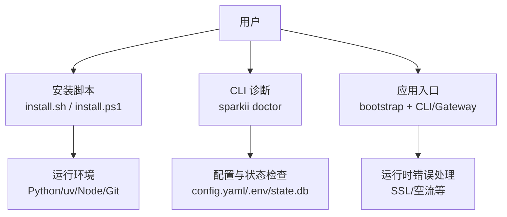
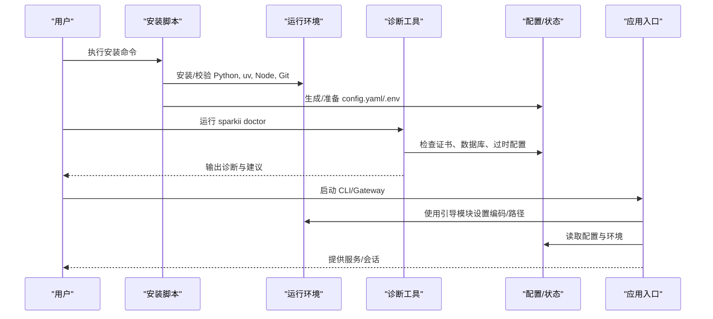
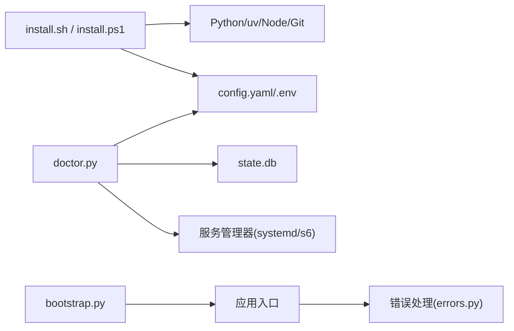

# 常见问题解答

<cite>
**本文引用的文件**
- [README.md](file://README.md)
- [sparkii_bootstrap.py](file://sparkii_bootstrap.py)
- [scripts/install.sh](file://scripts/install.sh)
- [scripts/install.ps1](file://scripts/install.ps1)
- [sparkii_cli/doctor.py](file://sparkii_cli/doctor.py)
- [agent/errors.py](file://agent/errors.py)
- [sparkii_cli/config.py](file://sparkii_cli/config.py)
</cite>

## 目录
1. [简介](#简介)
2. [项目结构](#项目结构)
3. [核心组件](#核心组件)
4. [架构总览](#架构总览)
5. [详细组件分析](#详细组件分析)
6. [依赖关系分析](#依赖关系分析)
7. [性能注意事项](#性能注意事项)
8. [故障排查指南](#故障排查指南)
9. [结论](#结论)
10. [附录](#附录)

## 简介
本“常见问题解答”聚焦安装失败、配置错误、权限问题、环境依赖（Python/Node.js）、以及自动化工具（如 sparkii doctor）诊断结果的解读与修复。文档按操作系统（Windows、Linux、macOS）分类，提供分步骤的诊断与修复流程，并给出命令示例与配置文件修改说明。同时汇总社区常见问题的最佳实践建议。

## 项目结构
本项目包含跨平台安装脚本、CLI 诊断工具、启动引导模块、配置管理与错误类型定义等关键部分：
- 安装脚本：scripts/install.sh（Linux/macOS/Termux）、scripts/install.ps1（Windows）
- CLI 诊断：sparkii_cli/doctor.py（sparkii doctor）
- 启动引导：sparkii_bootstrap.py（Windows UTF-8 与导入路径加固）
- 配置管理：sparkii_cli/config.py（config.yaml/.env 解析与安全策略）
- 错误类型：agent/errors.py（SSL 配置异常等）
- 快速上手与排错提示：README.md

图表来源
- [scripts/install.sh:45-196](file://scripts/install.sh#L45-L196)
- [scripts/install.ps1:15-75](file://scripts/install.ps1#L15-L75)
- [sparkii_cli/doctor.py:1-38](file://sparkii_cli/doctor.py#L1-L38)
- [sparkii_bootstrap.py:1-48](file://sparkii_bootstrap.py#L1-L48)
- [sparkii_cli/config.py:1-15](file://sparkii_cli/config.py#L1-L15)
- [agent/errors.py:1-14](file://agent/errors.py#L1-L14)

章节来源
- [README.md:35-118](file://README.md#L35-L118)
- [scripts/install.sh:45-196](file://scripts/install.sh#L45-L196)
- [scripts/install.ps1:15-75](file://scripts/install.ps1#L15-L75)
- [sparkii_cli/doctor.py:1-38](file://sparkii_cli/doctor.py#L1-L38)
- [sparkii_bootstrap.py:1-48](file://sparkii_bootstrap.py#L1-L48)
- [sparkii_cli/config.py:1-15](file://sparkii_cli/config.py#L1-L15)
- [agent/errors.py:1-14](file://agent/errors.py#L1-L14)

## 核心组件
- 安装器（install.sh/install.ps1）：负责检测系统、安装 Python/uv/Node/Git、创建虚拟环境、下载源码、链接命令、准备配置与技能、可选构建桌面端。
- 诊断器（doctor.py）：检查 Python/Node/浏览器工具、证书、数据库 WAL 模式、过时配置键与环境变量、网关服务 linger 状态等，并提供修复建议。
- 启动引导（sparkii_bootstrap.py）：在 Windows 上启用 UTF-8 输出、抑制平台版本查询的窗口闪烁与解码崩溃、防止当前目录包遮蔽 Sparkii 模块、激活持久化懒加载目标。
- 配置管理（config.py）：安全地读取 config.yaml/.env，备份损坏配置，警告解析失败，限制危险环境变量写入。
- 错误类型（errors.py）：定义 SSL 配置异常、空流异常等，供上层统一捕获与提示。

章节来源
- [scripts/install.sh:45-196](file://scripts/install.sh#L45-L196)
- [scripts/install.ps1:15-75](file://scripts/install.ps1#L15-L75)
- [sparkii_cli/doctor.py:1-38](file://sparkii_cli/doctor.py#L1-L38)
- [sparkii_bootstrap.py:1-48](file://sparkii_bootstrap.py#L1-L48)
- [sparkii_cli/config.py:1-15](file://sparkii_cli/config.py#L1-L15)
- [agent/errors.py:1-14](file://agent/errors.py#L1-L14)

## 架构总览
下图展示从安装到诊断再到运行的关键交互：

图表来源
- [scripts/install.sh:45-196](file://scripts/install.sh#L45-L196)
- [scripts/install.ps1:15-75](file://scripts/install.ps1#L15-L75)
- [sparkii_cli/doctor.py:1-38](file://sparkii_cli/doctor.py#L1-L38)
- [sparkii_bootstrap.py:1-48](file://sparkii_bootstrap.py#L1-L48)
- [sparkii_cli/config.py:1-15](file://sparkii_cli/config.py#L1-L15)

## 详细组件分析

### 安装失败与依赖缺失（Windows/Linux/macOS）
- 症状
  - 无法找到 Python/uv/Node/Git；安装中途报错或卡住；命令不可用。
- 原因
  - 系统未安装必要依赖；网络受限；权限不足；路径未正确加入 PATH。
- 诊断与修复
  - 使用安装脚本重新安装，必要时指定分支或提交以复现问题。
  - Linux/macOS：通过 install.sh 自动安装 uv、Python 3.11、Node 22、Git；若失败，根据提示手动安装对应包管理器工具。
  - Windows：通过 install.ps1 安装 uv、Python、Node、Git（含便携 Git Bash），并确保 %LOCALAPPDATA%\sparkii\bin 在 PATH。
  - Termux：使用 .[termux] 或 .[termux-all] 额外集，避免不兼容依赖。
- 命令参考
  - Linux/macOS：curl 管道执行安装脚本；source ~/.bashrc 后运行 sparkii。
  - Windows PowerShell：iex (irm ...) 执行安装脚本；完成后运行 sparkii。
- 注意
  - 安装脚本会清理继承的 PYTHONPATH/PYTHONHOME，避免模块遮蔽。
  - 根用户 Linux 安装采用 FHS 布局，代码位于 /usr/local/lib/sparkii-agent，命令链接至 /usr/local/bin。

章节来源
- [scripts/install.sh:45-196](file://scripts/install.sh#L45-L196)
- [scripts/install.sh:549-653](file://scripts/install.sh#L549-L653)
- [scripts/install.sh:655-781](file://scripts/install.sh#L655-L781)
- [scripts/install.ps1:15-75](file://scripts/install.ps1#L15-L75)
- [README.md:35-118](file://README.md#L35-L118)

### 配置错误（config.yaml/.env）
- 症状
  - 启动时报 YAML 解析失败；功能未按预期生效；敏感信息未生效。
- 原因
  - config.yaml 语法错误；使用了已弃用的键；.env 中设置了被禁止的危险环境变量名。
- 诊断与修复
  - 查看日志与 stderr 中的解析失败提示；如有损坏，会自动备份为 .bak 文件以便恢复。
  - 将弃用键迁移到推荐位置（例如 display.tool_progress → display.platforms）。
  - 避免通过 dashboard 写入 LD_PRELOAD、PYTHONPATH、PATH、GIT_SSH_COMMAND 等危险变量。
- 命令参考
  - 使用 sparkii config get/set 查看和修改配置项。
  - 使用 sparkii setup 重新运行向导。
- 注意
  - 解析失败会回退到默认配置，用户覆盖将被忽略，需修复 YAML 后重启。

章节来源
- [sparkii_cli/config.py:45-156](file://sparkii_cli/config.py#L45-L156)
- [sparkii_cli/config.py:157-200](file://sparkii_cli/config.py#L157-L200)
- [README.md:105-118](file://README.md#L105-L118)

### 权限问题（文件/目录/服务）
- 症状
  - 无法写入 ~/.sparkii 或安装目录；Gateway 服务登录后退出即停止。
- 原因
  - 用户无写权限；systemd linger 未启用；容器内服务管理器不同。
- 诊断与修复
  - 确保 ~/.sparkii 及安装目录可写；Linux 下启用 systemd linger 使 Gateway 服务在注销后继续运行。
  - 容器环境下由 s6 管理服务，无需 linger。
- 命令参考
  - Linux：sudo loginctl enable-linger $USER
  - 诊断：sparkii doctor 会提示相关状态与建议。

章节来源
- [sparkii_cli/doctor.py:732-774](file://sparkii_cli/doctor.py#L732-L774)

### 环境依赖问题（Python/Node.js）
- 症状
  - Python 版本不匹配；Node 版本过低导致 npm ci 失败；浏览器工具不可用。
- 原因
  - 系统 Python/Node 版本不符合要求；未安装浏览器依赖。
- 诊断与修复
  - 安装脚本会安装 Python 3.11 与 Node 22；Termux 使用 pkg 安装。
  - 浏览器工具需要额外安装步骤（Termux 下需安装 agent-browser）。
- 命令参考
  - 使用 install.sh 的 --ensure 参数仅安装指定依赖（node/browser/ripgrep/ffmpeg）。
  - Termux：pkg install nodejs；npm install -g agent-browser；agent-browser install。

章节来源
- [scripts/install.sh:549-653](file://scripts/install.sh#L549-L653)
- [scripts/install.sh:783-800](file://scripts/install.sh#L783-L800)
- [sparkii_cli/doctor.py:209-227](file://sparkii_cli/doctor.py#L209-L227)

### 启动与编码问题（Windows）
- 症状
  - 中文乱码；子进程 UnicodeEncodeError；控制台闪烁；导入冲突。
- 原因
  - Windows 控制台默认非 UTF-8；platform.win32_ver 调用触发 cmd 子进程；当前目录包遮蔽 Sparkii 模块。
- 诊断与修复
  - 启动时自动启用 UTF-8 模式与重配置 stdio；抑制 platform._syscmd_ver 以避免闪烁与解码崩溃；加固 sys.path 防止遮蔽。
- 命令参考
  - 直接运行 sparkii；如遇编码问题，确认已正确安装并更新到最新版本。

章节来源
- [sparkii_bootstrap.py:1-48](file://sparkii_bootstrap.py#L1-L48)
- [sparkii_bootstrap.py:125-166](file://sparkii_bootstrap.py#L125-L166)
- [sparkii_bootstrap.py:168-202](file://sparkii_bootstrap.py#L168-L202)

### 证书与网络问题（SSL）
- 症状
  - HTTPS 请求失败；证书链不可用；首次连接报 SSLConfigurationError。
- 原因
  - CA 证书包损坏或未正确安装；自定义证书路径指向不存在文件。
- 诊断与修复
  - 使用 sparkii doctor 检查证书；必要时使用 --fix 强制重装 certifi；或手动 pip install --force-reinstall certifi。
  - 检查是否设置了 SSL_CERT_FILE/REQUESTS_CA_BUNDLE 指向无效路径。
- 命令参考
  - sparkii doctor --fix
  - python -m pip install --force-reinstall certifi

章节来源
- [sparkii_cli/doctor.py:646-730](file://sparkii_cli/doctor.py#L646-L730)
- [agent/errors.py:1-3](file://agent/errors.py#L1-L3)

### 数据库与 WAL 问题（state.db）
- 症状
  - state.db 过大；WAL 文件增长异常；SQLite 版本存在已知漏洞风险。
- 原因
  - 长期运行积累消息与会话；WAL 模式在特定 SQLite 版本下存在重置缺陷。
- 诊断与修复
  - 使用 sparkii doctor 查看数据库大小、WAL 状态与持有者数量；若处于易受攻击的 WAL 模式，升级 SQLite 或执行修复提示。
  - 对大库考虑启用 sessions.auto_prune；离线优化存储（gateway 停止时运行 optimize-storage）。
- 命令参考
  - sparkii doctor
  - sparkii sessions optimize-storage（离线）

章节来源
- [sparkii_cli/doctor.py:102-199](file://sparkii_cli/doctor.py#L102-L199)
- [sparkii_cli/doctor.py:318-405](file://sparkii_cli/doctor.py#L318-L405)

### 过时配置与环境变量
- 症状
  - 某些行为未按预期；日志中出现弃用警告。
- 原因
  - 仍在使用旧版配置键或环境变量。
- 诊断与修复
  - 使用 sparkii doctor 报告弃用项，并按提示迁移到新键（如 terminal.cwd、display.tool_progress）。
- 命令参考
  - sparkii doctor
  - 编辑 config.yaml 替换旧键；删除 .env 中不再使用的变量。

章节来源
- [sparkii_cli/doctor.py:420-515](file://sparkii_cli/doctor.py#L420-L515)

### 模型与工具可用性
- 症状
  - 某些工具集显示不可用；API Key 缺失；OAuth 可用但直连密钥失败。
- 原因
  - 工具集仅在特定运行时加载（如 kanban 工作进程）；提供商支持 OAuth 替代路径。
- 诊断与修复
  - 使用 sparkii doctor 查看工具集可用性；为 CLI 启用的工具集补充 API Key 或切换 OAuth。
- 命令参考
  - sparkii tools
  - sparkii model

章节来源
- [sparkii_cli/doctor.py:518-541](file://sparkii_cli/doctor.py#L518-L541)
- [sparkii_cli/doctor.py:281-302](file://sparkii_cli/doctor.py#L281-L302)

## 依赖关系分析
- 安装脚本依赖系统包管理器（apt/dnf/pacman/pkg/Homebrew）与网络可达性。
- CLI 诊断依赖配置解析、状态数据库、服务管理器（systemd/s6）。
- 启动引导依赖 Python 标准库与 Windows 平台特性。
- 配置管理依赖 YAML 解析与文件系统权限。

图表来源
- [scripts/install.sh:45-196](file://scripts/install.sh#L45-L196)
- [scripts/install.ps1:15-75](file://scripts/install.ps1#L15-L75)
- [sparkii_cli/doctor.py:1-38](file://sparkii_cli/doctor.py#L1-L38)
- [sparkii_bootstrap.py:1-48](file://sparkii_bootstrap.py#L1-L48)
- [agent/errors.py:1-14](file://agent/errors.py#L1-L14)

章节来源
- [scripts/install.sh:45-196](file://scripts/install.sh#L45-L196)
- [scripts/install.ps1:15-75](file://scripts/install.ps1#L15-L75)
- [sparkii_cli/doctor.py:1-38](file://sparkii_cli/doctor.py#L1-L38)
- [sparkii_bootstrap.py:1-48](file://sparkii_bootstrap.py#L1-L48)
- [agent/errors.py:1-14](file://agent/errors.py#L1-L14)

## 性能注意事项
- 避免频繁读写大数据库：启用 auto_prune，定期离线优化存储。
- 控制日志与上下文大小：使用压缩与摘要减少上下文成本。
- 合理选择模型与提供商：利用多提供商与 fallback 提升稳定性。
- 避免不必要的子进程与全局 PATH 修改：通过明确配置集成路径。

## 故障排查指南
- 安装失败
  - 检查网络与包管理器；重新运行安装脚本；必要时指定 --ensure 仅安装依赖。
  - Windows 下确认 PATH 包含 %LOCALAPPDATA%\sparkii\bin。
- 配置错误
  - 查看日志与 stderr；修复 YAML 语法；迁移弃用键；避免危险环境变量。
- 权限问题
  - 确保数据目录可写；Linux 启用 linger；容器使用 s6 管理服务。
- 环境依赖
  - 使用安装脚本安装 Python/Node；Termux 使用 pkg；浏览器工具按需安装。
- 证书与网络
  - 运行 sparkii doctor --fix；必要时重装 certifi；检查自定义证书路径。
- 数据库与 WAL
  - 监控 state.db 大小与 WAL；升级 SQLite；离线优化存储。
- 模型与工具
  - 补充 API Key 或使用 OAuth；确认工具集在运行时可用。

章节来源
- [scripts/install.sh:45-196](file://scripts/install.sh#L45-L196)
- [scripts/install.ps1:15-75](file://scripts/install.ps1#L15-L75)
- [sparkii_cli/doctor.py:646-730](file://sparkii_cli/doctor.py#L646-L730)
- [sparkii_cli/doctor.py:102-199](file://sparkii_cli/doctor.py#L102-L199)
- [sparkii_cli/config.py:45-156](file://sparkii_cli/config.py#L45-L156)

## 结论
通过统一的安装脚本、健壮的启动引导、完善的诊断工具与安全配置管理，大多数安装、配置与权限问题可在数分钟内定位与修复。建议优先使用 sparkii doctor 进行健康检查，并结合日志与配置备份快速恢复。遵循最佳实践（最小权限、显式路径、定期维护数据库）可显著提升稳定性与可维护性。

## 附录
- 常用命令
  - 安装：Linux/macOS 使用 curl 管道安装脚本；Windows 使用 PowerShell 安装脚本。
  - 诊断：sparkii doctor；必要时加 --fix。
  - 配置：sparkii config get/set；sparkii setup。
  - 模型与工具：sparkii model；sparkii tools。
- 社区资源
  - 文档站点、Discord、Issues 与 Skills Hub 提供进一步支持与扩展能力。

章节来源
- [README.md:35-118](file://README.md#L35-L118)
- [README.md:105-118](file://README.md#L105-L118)