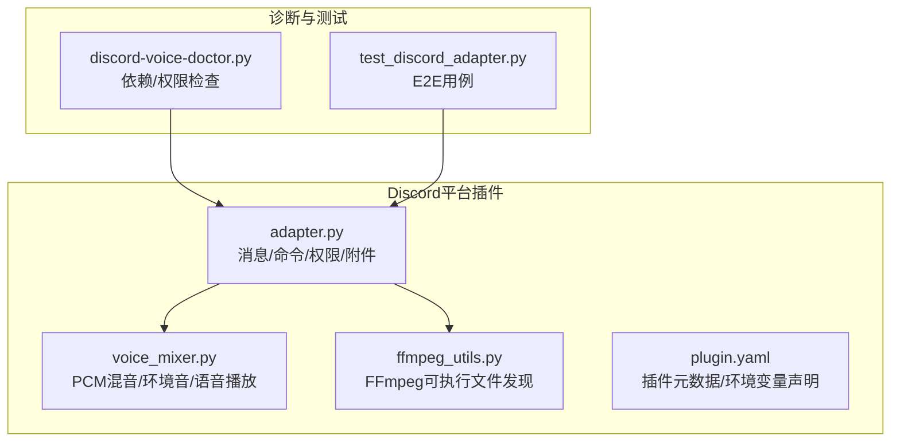
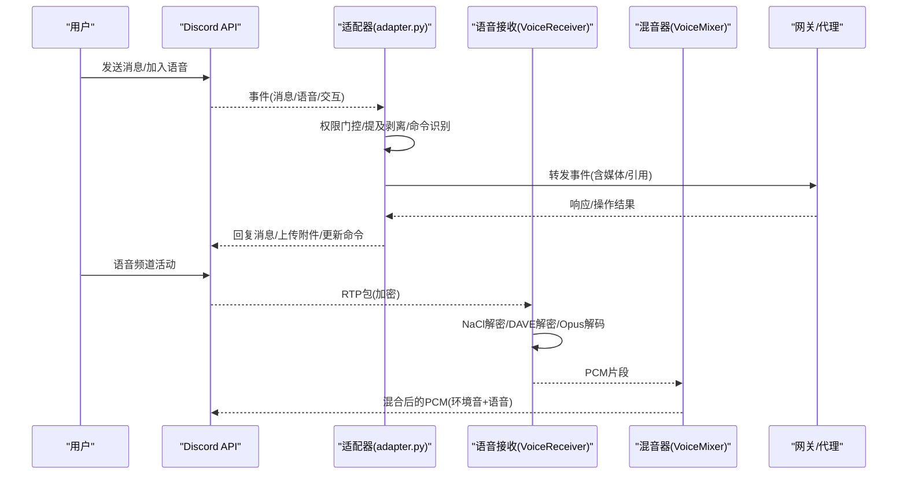
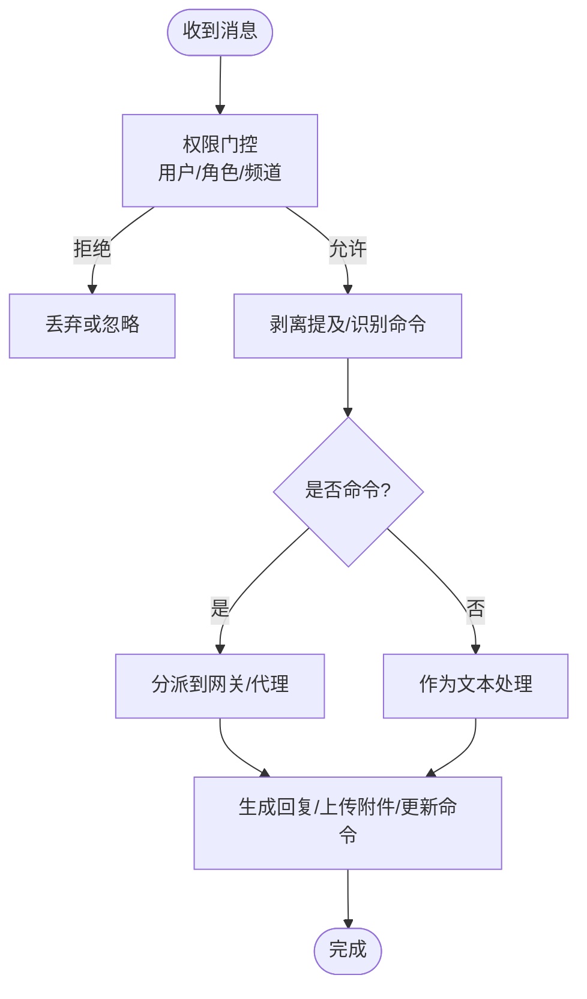
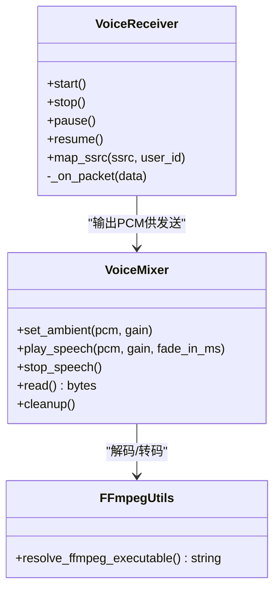
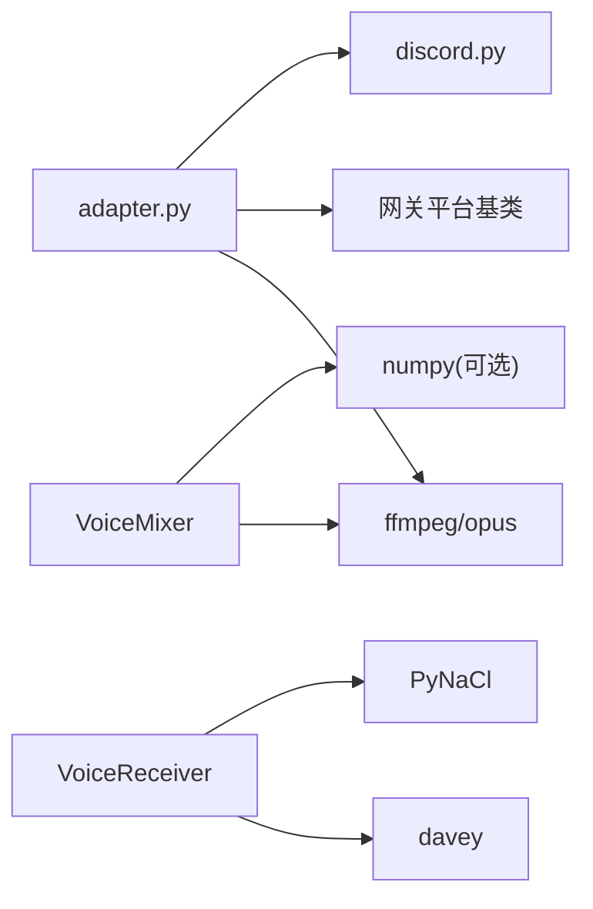

# Discord集成问题

<cite>
**本文引用的文件**
- [adapter.py](file://plugins/platforms/discord/adapter.py)
- [plugin.yaml](file://plugins/platforms/discord/plugin.yaml)
- [voice_mixer.py](file://plugins/platforms/discord/voice_mixer.py)
- [ffmpeg_utils.py](file://plugins/platforms/discord/ffmpeg_utils.py)
- [discord-voice-doctor.py](file://scripts/discord-voice-doctor.py)
- [test_discord_adapter.py](file://tests/e2e/test_discord_adapter.py)
</cite>

## 目录
1. [简介](#简介)
2. [项目结构](#项目结构)
3. [核心组件](#核心组件)
4. [架构总览](#架构总览)
5. [详细组件分析](#详细组件分析)
6. [依赖关系分析](#依赖关系分析)
7. [性能与限流](#性能与限流)
8. [故障排除指南](#故障排除指南)
9. [结论](#结论)
10. [附录：配置与环境变量清单](#附录：配置与环境变量清单)

## 简介
本文件面向在项目中集成Discord平台时遇到的典型问题，提供从Bot Token配置、OAuth2授权与权限范围、消息与附件处理、Slash命令与交互组件、语音频道连接与音频流、Webhook使用、到多服务器部署隔离与数据同步的完整解决方案。内容基于代码库中的Discord平台适配器、语音混音器、诊断脚本与端到端测试进行系统化梳理，帮助快速定位并修复常见问题。

## 项目结构
Discord平台以插件形式接入网关，核心由以下模块构成：
- 平台适配器：负责消息收发、线程管理、Slash命令注册、权限校验、附件下载与缓存等。
- 语音通道能力：接收语音包、解码、静音检测、TTS播放与混音。
- 工具与辅助：FFmpeg路径解析、Windows Opus DLL发现、诊断脚本。
- 测试用例：覆盖提及剥离、自动线程、引用媒体转发等关键流程。

图表来源
- [adapter.py:1-170](file://plugins/platforms/discord/adapter.py#L1-L170)
- [voice_mixer.py:1-80](file://plugins/platforms/discord/voice_mixer.py#L1-L80)
- [ffmpeg_utils.py:1-44](file://plugins/platforms/discord/ffmpeg_utils.py#L1-L44)
- [plugin.yaml:1-35](file://plugins/platforms/discord/plugin.yaml#L1-L35)
- [discord-voice-doctor.py:1-120](file://scripts/discord-voice-doctor.py#L1-L120)
- [test_discord_adapter.py:1-156](file://tests/e2e/test_discord_adapter.py#L1-L156)

章节来源
- [adapter.py:1-170](file://plugins/platforms/discord/adapter.py#L1-L170)
- [plugin.yaml:1-35](file://plugins/platforms/discord/plugin.yaml#L1-L35)

## 核心组件
- 平台适配器（adapter.py）
  - 负责Discord客户端初始化、事件监听、消息路由、权限门控、Slash命令同步、附件下载与缓存、嵌入与链接格式化、非对话消息去重等。
  - 支持通过环境变量控制允许用户/角色/频道、是否允许所有用户、是否允许机器人等。
  - 内置安全策略：图片URL重定向防护、SSRF防护、UTF-16长度限制、引用消息媒体缓存。
- 语音接收与混音（VoiceReceiver/VoiceMixer）
  - VoiceReceiver：拦截RTP包，NaCl解密、DAVE端到端加密、Opus解码为PCM，按用户缓冲与静音检测。
  - VoiceMixer：将环境音与语音片段混合，支持语音“ducking”（说话时压低背景音），输出标准PCM帧给discord.py发送。
- FFmpeg与系统依赖（ffmpeg_utils.py）
  - 统一解析FFmpeg路径，支持环境变量覆盖与Windows winget安装路径回退。
- 诊断脚本（discord-voice-doctor.py）
  - 检查Python包、系统工具、环境变量、Bot权限，给出明确修复建议。
- 插件配置（plugin.yaml）
  - 声明必需与可选环境变量，便于引导式配置。

章节来源
- [adapter.py:120-170](file://plugins/platforms/discord/adapter.py#L120-L170)
- [adapter.py:435-509](file://plugins/platforms/discord/adapter.py#L435-L509)
- [adapter.py:525-800](file://plugins/platforms/discord/adapter.py#L525-L800)
- [voice_mixer.py:1-80](file://plugins/platforms/discord/voice_mixer.py#L1-L80)
- [voice_mixer.py:156-305](file://plugins/platforms/discord/voice_mixer.py#L156-L305)
- [ffmpeg_utils.py:17-44](file://plugins/platforms/discord/ffmpeg_utils.py#L17-L44)
- [discord-voice-doctor.py:60-170](file://scripts/discord-voice-doctor.py#L60-L170)
- [plugin.yaml:12-35](file://plugins/platforms/discord/plugin.yaml#L12-L35)

## 架构总览
下图展示Discord平台在网关中的位置与关键交互：消息进入、权限校验、命令分发、附件处理、语音通道与混音、以及诊断与测试支撑。

图表来源
- [adapter.py:476-509](file://plugins/platforms/discord/adapter.py#L476-L509)
- [adapter.py:525-800](file://plugins/platforms/discord/adapter.py#L525-L800)
- [voice_mixer.py:156-305](file://plugins/platforms/discord/voice_mixer.py#L156-L305)

## 详细组件分析

### 平台适配器（消息、权限、命令、附件）
- 功能要点
  - 安全默认：禁止@everyone与角色ping，保留用户与回复用户ping，避免误触发全服提醒。
  - 环境变量门控：DISCORD_ALLOWED_USERS/ROLES/CHANNELS、DISCORD_ALLOW_ALL_USERS、DISCORD_ALLOW_BOTS等。
  - Slash命令同步：全局应用命令上限保护（100条），状态持久化与限流休眠。
  - 附件与媒体：下载、缓存、类型推断、大小校验；引用消息的图片/文档自动缓存。
  - 链接与嵌入：Markdown链接标签清理，防止被Discord预览覆盖；嵌入显示优化。
  - 非对话消息：持久化ID集合与历史模式匹配，避免噪音污染聊天历史。
- 关键流程（消息处理）

图表来源
- [adapter.py:476-509](file://plugins/platforms/discord/adapter.py#L476-L509)
- [adapter.py:289-354](file://plugins/platforms/discord/adapter.py#L289-L354)
- [test_discord_adapter.py:30-108](file://tests/e2e/test_discord_adapter.py#L30-L108)

章节来源
- [adapter.py:476-509](file://plugins/platforms/discord/adapter.py#L476-L509)
- [adapter.py:289-354](file://plugins/platforms/discord/adapter.py#L289-L354)
- [test_discord_adapter.py:30-108](file://tests/e2e/test_discord_adapter.py#L30-L108)

### 语音通道：接收、解码与混音
- 语音接收（VoiceReceiver）
  - 拦截RTP包，验证版本与负载类型，计算动态头部长度，跳过自身SSRC。
  - NaCl解密后，若启用DAVE则按用户解密；Opus解码为PCM并按用户缓冲。
  - 通过SPEAKING事件维护SSRC到user_id映射，支持静音检测与断句。
- 混音器（VoiceMixer）
  - 实现discord.AudioSource，持续输出20ms PCM帧。
  - 支持环境音循环与语音片段叠加，语音期间压低环境音（ducking），结束后平滑恢复。
  - 线程安全：读取来自discord.py发送线程，添加/移除子源来自事件循环线程。
- FFmpeg与系统依赖
  - 统一解析FFmpeg路径，支持环境变量覆盖与Windows winget回退。
  - Windows下尝试加载bundled opus DLL，确保语音编解码可用。

图表来源
- [adapter.py:525-800](file://plugins/platforms/discord/adapter.py#L525-L800)
- [voice_mixer.py:156-305](file://plugins/platforms/discord/voice_mixer.py#L156-L305)
- [ffmpeg_utils.py:17-44](file://plugins/platforms/discord/ffmpeg_utils.py#L17-L44)

章节来源
- [adapter.py:525-800](file://plugins/platforms/discord/adapter.py#L525-L800)
- [voice_mixer.py:156-305](file://plugins/platforms/discord/voice_mixer.py#L156-L305)
- [ffmpeg_utils.py:17-44](file://plugins/platforms/discord/ffmpeg_utils.py#L17-L44)

### 诊断与测试
- 诊断脚本（discord-voice-doctor.py）
  - 检查Python包（discord.py、PyNaCl、davey）、系统工具（opus、ffmpeg）、环境变量（DISCORD_BOT_TOKEN、STT/TTS密钥）、Bot权限（Connect/Speak/View Channel等）。
  - 输出明确的修复建议与缺失项提示。
- 端到端测试（test_discord_adapter.py）
  - 覆盖提及剥离、自动线程创建后命令识别、引用消息媒体转发等场景，保障核心链路稳定。

章节来源
- [discord-voice-doctor.py:60-170](file://scripts/discord-voice-doctor.py#L60-L170)
- [discord-voice-doctor.py:281-367](file://scripts/discord-voice-doctor.py#L281-L367)
- [test_discord_adapter.py:30-156](file://tests/e2e/test_discord_adapter.py#L30-L156)

## 依赖关系分析
- 外部依赖
  - discord.py：消息收发、语音通道、命令注册。
  - PyNaCl：RTP载荷解密。
  - davey：DAVE端到端加密。
  - ffmpeg/opus：音频编解码与格式转换。
  - numpy（可选voice扩展）：混音计算。
- 内部依赖
  - 网关平台基类与工具：消息去重、线程参与跟踪、媒体缓存、UTF-16长度限制等。
  - 插件配置：plugin.yaml声明的环境变量用于引导配置。

图表来源
- [adapter.py:120-170](file://plugins/platforms/discord/adapter.py#L120-L170)
- [adapter.py:525-800](file://plugins/platforms/discord/adapter.py#L525-L800)
- [voice_mixer.py:156-305](file://plugins/platforms/discord/voice_mixer.py#L156-L305)
- [ffmpeg_utils.py:17-44](file://plugins/platforms/discord/ffmpeg_utils.py#L17-L44)

章节来源
- [adapter.py:120-170](file://plugins/platforms/discord/adapter.py#L120-L170)
- [adapter.py:525-800](file://plugins/platforms/discord/adapter.py#L525-L800)
- [voice_mixer.py:156-305](file://plugins/platforms/discord/voice_mixer.py#L156-L305)
- [ffmpeg_utils.py:17-44](file://plugins/platforms/discord/ffmpeg_utils.py#L17-L44)

## 性能与限流
- Discord API限流
  - Slash命令同步存在全局上限（100条），超过会导致整个同步失败。适配器在注册阶段保持期望集不超过上限，并在限流时休眠等待。
  - 建议在大规模部署中分批注册命令，或使用“bulk”策略减少请求次数。
- WebSocket与连接池
  - 启动时等待ready事件并与bot任务竞态，快速暴露连接错误（如SOCKS/proxy失败），避免长时间阻塞。
  - 对aiohttp传输关闭超时异常时，尝试中止底层transport，提升重连效率。
- 语音通道性能
  - 混音器每20ms输出一帧，CPU开销低；环境音与语音片段叠加采用向量化加法与裁剪，避免溢出。
  - 语音接收按用户维护解码器状态，避免重复初始化；静音检测阈值可调，减少误判。

章节来源
- [adapter.py:72-86](file://plugins/platforms/discord/adapter.py#L72-L86)
- [adapter.py:232-267](file://plugins/platforms/discord/adapter.py#L232-L267)
- [voice_mixer.py:156-305](file://plugins/platforms/discord/voice_mixer.py#L156-L305)

## 故障排除指南
- Bot Token与OAuth2授权
  - 确认已设置DISCORD_BOT_TOKEN，并通过诊断脚本验证登录成功与权限。
  - OAuth2授权流程需在Discord开发者控制台配置应用与重定向URI，授予所需权限范围（如Read Messages、Send Messages、Embed Links、Attach Files、Connect、Speak等）。
- 服务器邀请链接生成失败
  - 常见原因：缺少Create Instant Invite权限或目标频道不可见。请在服务器设置中为机器人分配“创建即时邀请”权限，并确保机器人有访问频道的权限。
- 成员权限验证与角色管理
  - 使用DISCORD_ALLOWED_USERS/ROLES/CHANNELS进行白名单控制；如需开发宽松模式，可启用DISCORD_ALLOW_ALL_USERS。
  - 注意多服务器环境下，权限需在各服务器分别授予。
- 消息发送限制、嵌入内容与附件上传
  - 嵌入内容过长会被截断；链接标签会被清理以避免预览覆盖。
  - 附件上传受Discord大小限制；适配器会校验入站媒体大小并缓存本地路径。
- 语音频道连接、音频流与屏幕共享
  - 运行discord-voice-doctor.py检查依赖与权限；确保opus与ffmpeg可用。
  - 若出现无声或杂音，检查RTP头长度、填充位处理与DAVE解密是否成功。
- Webhook使用、Slash命令与交互组件
  - Slash命令注册需遵守全局上限；交互组件（按钮/选择框）字段长度受限，适配器已做UTF-16长度裁剪。
- 限流、连接池与重连
  - 遇到限流时，适配器会休眠等待；连接失败时快速失败并重试。
  - 若WebSocket关闭缓慢，适配器尝试中止底层transport以加速释放。
- 多服务器部署配置隔离与数据同步
  - 在多实例或多Profile模式下，环境变量读取应基于当前Profile的Secret Scope，避免跨Profile污染。
  - 命令同步状态与非对话消息ID持久化在独立目录，避免不同实例间冲突。

章节来源
- [plugin.yaml:12-35](file://plugins/platforms/discord/plugin.yaml#L12-L35)
- [discord-voice-doctor.py:173-234](file://scripts/discord-voice-doctor.py#L173-L234)
- [discord-voice-doctor.py:281-367](file://scripts/discord-voice-doctor.py#L281-L367)
- [adapter.py:476-509](file://plugins/platforms/discord/adapter.py#L476-L509)
- [adapter.py:289-354](file://plugins/platforms/discord/adapter.py#L289-L354)
- [adapter.py:232-267](file://plugins/platforms/discord/adapter.py#L232-L267)

## 结论
本项目提供了完整的Discord平台集成能力，涵盖消息、命令、附件、语音与诊断工具。通过合理配置环境变量、权限与依赖，结合适配器内置的安全与限流策略，可在多服务器环境中稳定运行。遇到问题时，优先使用诊断脚本与测试用例定位根因，再按本文指引逐项排查。

## 附录：配置与环境变量清单
- 必需
  - DISCORD_BOT_TOKEN：Discord机器人令牌。
- 可选
  - DISCORD_ALLOWED_USERS：允许的用户ID列表（逗号分隔）。
  - DISCORD_ALLOW_ALL_USERS：允许所有用户（仅开发）。
  - DISCORD_HOME_CHANNEL / DISCORD_HOME_CHANNEL_NAME：默认频道与显示名。
  - DISCORD_ALLOWED_ROLES / DISCORD_ALLOWED_CHANNELS / DISCORD_IGNORED_CHANNELS / DISCORD_NO_THREAD_CHANNELS / DISCORD_FREE_RESPONSE_CHANNELS / DISCORD_MISSED_MESSAGE_BACKFILL_CHANNELS：频道与角色门控。
  - DISCORD_ALLOW_BOTS：是否允许机器人消息。
  - SPARKII_GATEWAY_PLATFORM_CONNECT_TIMEOUT：平台连接超时时间。
  - FFMPEG_PATH：FFmpeg可执行文件路径覆盖。
  - GROQ_API_KEY / ELEVENLABS_API_KEY：语音STT/TTS服务密钥。

章节来源
- [plugin.yaml:12-35](file://plugins/platforms/discord/plugin.yaml#L12-L35)
- [discord-voice-doctor.py:173-234](file://scripts/discord-voice-doctor.py#L173-L234)