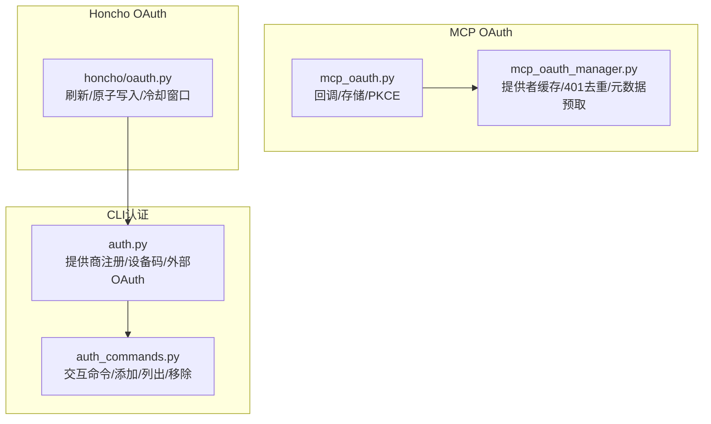
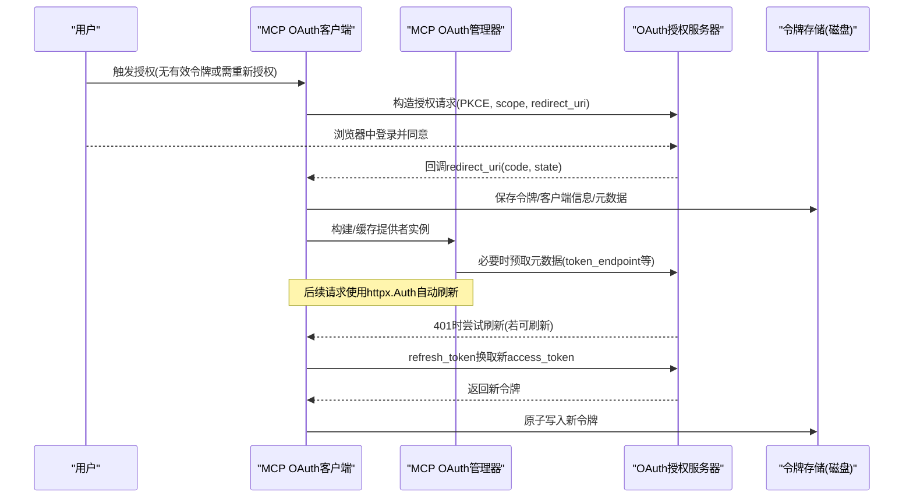
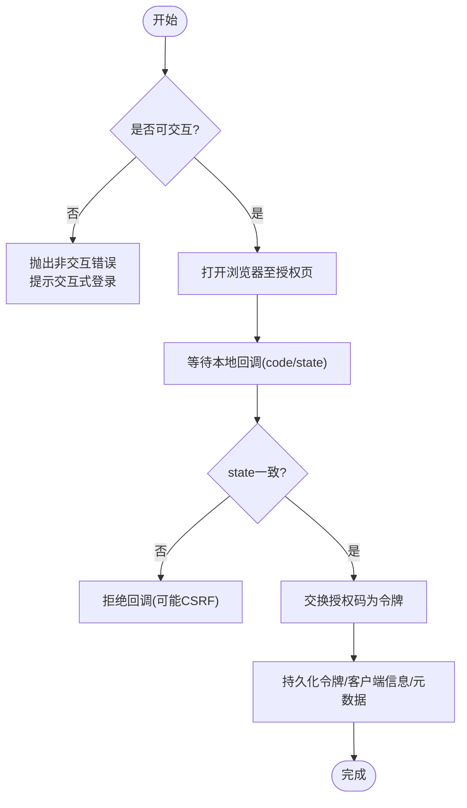
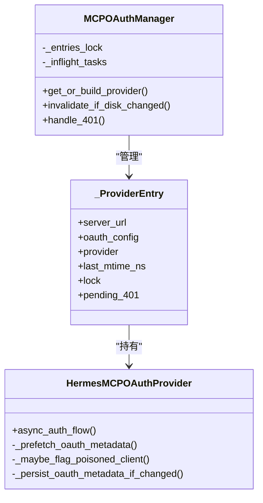
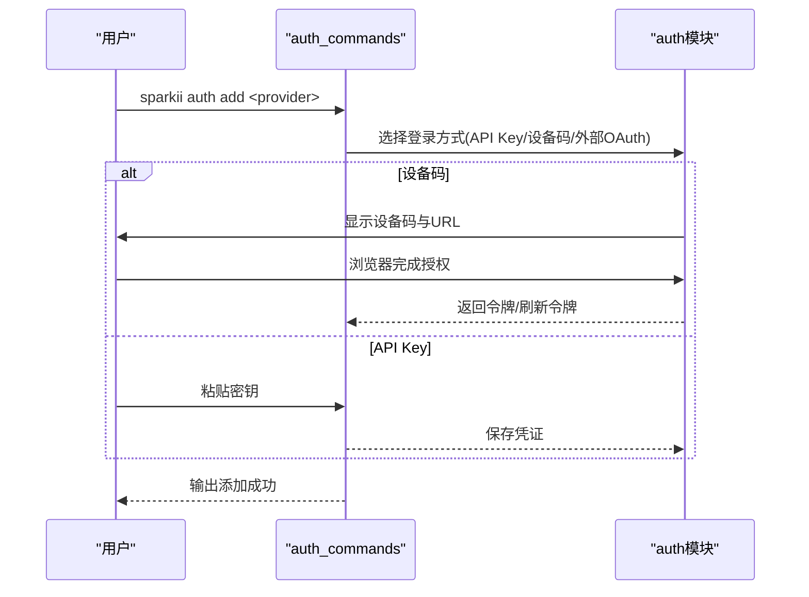
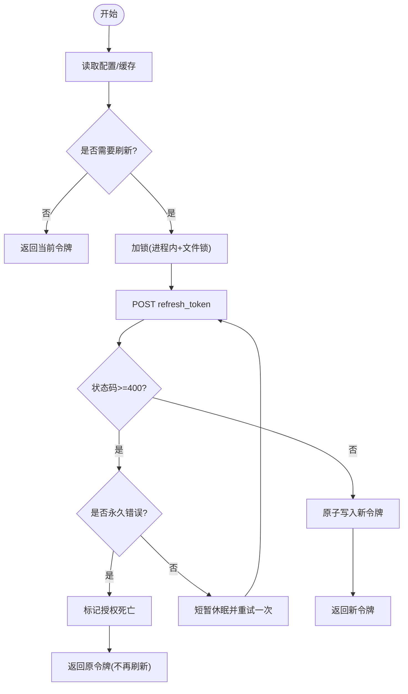
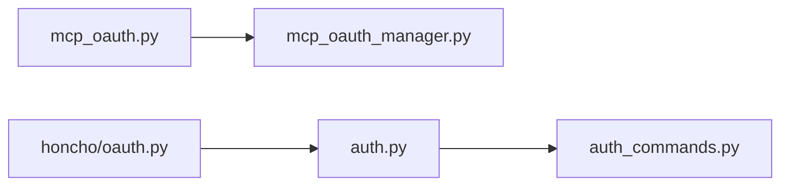

# OAuth认证问题

<cite>
**本文引用的文件**
- [tools/mcp_oauth.py](file://tools/mcp_oauth.py)
- [tools/mcp_oauth_manager.py](file://tools/mcp_oauth_manager.py)
- [sparkii_cli/auth.py](file://sparkii_cli/auth.py)
- [sparkii_cli/auth_commands.py](file://sparkii_cli/auth_commands.py)
- [plugins/memory/honcho/oauth.py](file://plugins/memory/honcho/oauth.py)
</cite>

## 目录
1. [简介](#简介)
2. [项目结构](#项目结构)
3. [核心组件](#核心组件)
4. [架构总览](#架构总览)
5. [详细组件分析](#详细组件分析)
6. [依赖关系分析](#依赖关系分析)
7. [性能考虑](#性能考虑)
8. [故障排查指南](#故障排查指南)
9. [结论](#结论)
10. [附录](#附录)

## 简介
本文件面向在工程环境中集成与排错OAuth2.0（含PKCE、授权码流程、刷新令牌、作用域与回调）的工程师，提供端到端的配置要点、常见问题定位与修复方案，以及企业网络环境下的代理与防火墙策略建议。内容基于仓库中的MCP OAuth实现、多提供商CLI认证、以及Honcho内存服务的OAuth刷新机制，覆盖：
- OAuth2.0流程配置与客户端ID/密钥设置
- 授权码获取失败、重定向URL与state校验
- 访问令牌刷新、过期处理与刷新令牌存储
- 权限范围与作用域限制、用户同意页面定制
- 多提供商OAuth集成、统一认证中心与单点登录思路
- 回调失败、网络异常与安全威胁防护
- 企业代理、防火墙与网络安全策略

## 项目结构
本项目围绕三类OAuth能力展开：
- MCP服务器OAuth（浏览器本地回调+持久化）：位于 tools/mcp_oauth.py 与 tools/mcp_oauth_manager.py
- CLI多提供商认证（设备码/外部OAuth/Key）：位于 sparkii_cli/auth.py 与 sparkii_cli/auth_commands.py
- Honcho内存服务OAuth刷新：位于 plugins/memory/honcho/oauth.py

**图示来源**
- [tools/mcp_oauth.py:1-120](file://tools/mcp_oauth.py#L1-L120)
- [tools/mcp_oauth_manager.py:100-180](file://tools/mcp_oauth_manager.py#L100-L180)
- [sparkii_cli/auth.py:190-507](file://sparkii_cli/auth.py#L190-L507)
- [sparkii_cli/auth_commands.py:164-434](file://sparkii_cli/auth_commands.py#L164-L434)
- [plugins/memory/honcho/oauth.py:284-367](file://plugins/memory/honcho/oauth.py#L284-L367)

**章节来源**
- [tools/mcp_oauth.py:1-120](file://tools/mcp_oauth.py#L1-L120)
- [tools/mcp_oauth_manager.py:100-180](file://tools/mcp_oauth_manager.py#L100-L180)
- [sparkii_cli/auth.py:190-507](file://sparkii_cli/auth.py#L190-L507)
- [sparkii_cli/auth_commands.py:164-434](file://sparkii_cli/auth_commands.py#L164-L434)
- [plugins/memory/honcho/oauth.py:284-367](file://plugins/memory/honcho/oauth.py#L284-L367)

## 核心组件
- MCP OAuth客户端与回调
  - 支持浏览器打开授权页、本地回调解码授权码、状态参数校验、PKCE
  - 将令牌、客户端信息、OAuth元数据持久化到磁盘，进程重启可恢复
  - 自动发现并缓存授权服务器元数据，避免冷启动刷新失败
- MCP OAuth管理器
  - 按服务器名缓存OAuth提供者实例，跨调用复用
  - 监听磁盘令牌变更，外部刷新后无需重启即可生效
  - 对并发401进行去重，避免“惊群”重试
  - 检测无效客户端注册并触发重新注册
- CLI多提供商认证
  - 维护提供商注册表，支持API Key、设备码、外部OAuth等多种方式
  - 提供交互式命令添加/列出/移除凭证，支持多账户池
- Honcho OAuth刷新
  - 基于refresh_token的刷新流程，带重试与冷却窗口
  - 原子写入配置文件，跨进程安全
  - 标记永久失败的授权为“死亡”，避免持续请求

**章节来源**
- [tools/mcp_oauth.py:184-646](file://tools/mcp_oauth.py#L184-L646)
- [tools/mcp_oauth_manager.py:446-786](file://tools/mcp_oauth_manager.py#L446-L786)
- [sparkii_cli/auth.py:190-507](file://sparkii_cli/auth.py#L190-L507)
- [sparkii_cli/auth_commands.py:164-434](file://sparkii_cli/auth_commands.py#L164-L434)
- [plugins/memory/honcho/oauth.py:284-367](file://plugins/memory/honcho/oauth.py#L284-L367)

## 架构总览
下图展示从发起授权到获得可用令牌的完整链路，包括回调、持久化、元数据预取与刷新路径。

**图示来源**
- [tools/mcp_oauth.py:653-791](file://tools/mcp_oauth.py#L653-L791)
- [tools/mcp_oauth_manager.py:149-226](file://tools/mcp_oauth_manager.py#L149-L226)
- [tools/mcp_oauth_manager.py:637-678](file://tools/mcp_oauth_manager.py#L637-L678)
- [plugins/memory/honcho/oauth.py:324-367](file://plugins/memory/honcho/oauth.py#L324-L367)

## 详细组件分析

### MCP OAuth客户端（工具层）
- 回调与状态校验
  - 本地HTTP回调接收code/state/error，解析并返回给等待方
  - 非交互环境下会提示运行交互式登录或粘贴授权URL
- 令牌与元数据持久化
  - 以JSON形式保存令牌、客户端信息与OAuth元数据，权限收紧
  - 读取时兼容旧格式，计算剩余有效期，确保SDK正确判断过期
- 回调端口与重定向URI
  - 优先复用已注册的回调端口，避免“重定向URI不匹配”错误
  - 支持远程会话通过代理回调（如隧道/Funnel），并提供SSH转发指引
- 浏览器与交互控制
  - 自动打开浏览器；在无显示/SSH场景下打印URL并引导操作
  - 通过ContextVar控制是否允许交互，防止后台任务误开浏览器

**图示来源**
- [tools/mcp_oauth.py:298-355](file://tools/mcp_oauth.py#L298-L355)
- [tools/mcp_oauth.py:653-791](file://tools/mcp_oauth.py#L653-L791)
- [tools/mcp_oauth.py:429-556](file://tools/mcp_oauth.py#L429-L556)

**章节来源**
- [tools/mcp_oauth.py:298-355](file://tools/mcp_oauth.py#L298-L355)
- [tools/mcp_oauth.py:429-556](file://tools/mcp_oauth.py#L429-L556)
- [tools/mcp_oauth.py:653-791](file://tools/mcp_oauth.py#L653-L791)

### MCP OAuth管理器（协调层）
- 提供者缓存与重建
  - 按服务器名缓存OAuth提供者，URL变化时丢弃重建
  - 首次使用时按需构建，注入存储、回调处理器与超时
- 磁盘变更感知
  - 每次授权前检查令牌文件mtime，外部刷新后强制重载内存状态
- 401去重与恢复
  - 并发401只触发一次恢复，其他调用等待同一结果
  - 若SDK可原地刷新则直接重试；否则提示需要重新授权
- 无效客户端注册自愈
  - 当token端点返回invalid_client且命中目标端点时，删除本地client.json与元数据，触发重新注册

**图示来源**
- [tools/mcp_oauth_manager.py:73-99](file://tools/mcp_oauth_manager.py#L73-L99)
- [tools/mcp_oauth_manager.py:106-180](file://tools/mcp_oauth_manager.py#L106-L180)
- [tools/mcp_oauth_manager.py:446-786](file://tools/mcp_oauth_manager.py#L446-L786)

**章节来源**
- [tools/mcp_oauth_manager.py:106-180](file://tools/mcp_oauth_manager.py#L106-L180)
- [tools/mcp_oauth_manager.py:446-786](file://tools/mcp_oauth_manager.py#L446-L786)

### CLI多提供商认证（入口与命令）
- 提供商注册与类型
  - 集中定义各提供商的认证类型、基础URL、环境变量与scope
  - 支持API Key、设备码、外部OAuth等多种模式
- 交互式命令
  - 添加/列出/移除/重置/状态/登出等子命令
  - 针对特定提供商（如Nous、xAI、Qwen、MiniMax）提供专用登录流程
- 多账户与池化
  - 每个账户独立条目，支持轮换策略与耗尽状态追踪

**图示来源**
- [sparkii_cli/auth.py:190-507](file://sparkii_cli/auth.py#L190-L507)
- [sparkii_cli/auth_commands.py:164-434](file://sparkii_cli/auth_commands.py#L164-L434)

**章节来源**
- [sparkii_cli/auth.py:190-507](file://sparkii_cli/auth.py#L190-L507)
- [sparkii_cli/auth_commands.py:164-434](file://sparkii_cli/auth_commands.py#L164-L434)

### Honcho内存服务OAuth刷新（刷新与存储）
- 刷新流程
  - 使用refresh_token向token端点换取新access_token，带重试与冷却窗口
  - 永久错误（如invalid_grant）标记授权为“死亡”，停止重复请求
- 原子写入与跨进程安全
  - 临时文件+原子替换，权限收紧，避免并发写冲突
- 失效恢复
  - 遇到本地仍有效的令牌但服务端401时，强制刷新

**图示来源**
- [plugins/memory/honcho/oauth.py:284-367](file://plugins/memory/honcho/oauth.py#L284-L367)
- [plugins/memory/honcho/oauth.py:400-480](file://plugins/memory/honcho/oauth.py#L400-L480)
- [plugins/memory/honcho/oauth.py:483-570](file://plugins/memory/honcho/oauth.py#L483-L570)

**章节来源**
- [plugins/memory/honcho/oauth.py:284-367](file://plugins/memory/honcho/oauth.py#L284-L367)
- [plugins/memory/honcho/oauth.py:400-480](file://plugins/memory/honcho/oauth.py#L400-L480)
- [plugins/memory/honcho/oauth.py:483-570](file://plugins/memory/honcho/oauth.py#L483-L570)

## 依赖关系分析
- 模块耦合
  - mcp_oauth_manager依赖mcp_oauth提供的存储与回调工具
  - CLI认证与提供商注册解耦，便于扩展新提供商
  - Honcho刷新独立于MCP流程，适用于内存服务场景
- 外部依赖
  - MCP SDK的OAuthClientProvider（可选，懒加载）
  - httpx用于HTTP通信
  - 文件系统用于持久化令牌与元数据

**图示来源**
- [tools/mcp_oauth.py:1-120](file://tools/mcp_oauth.py#L1-L120)
- [tools/mcp_oauth_manager.py:100-180](file://tools/mcp_oauth_manager.py#L100-L180)
- [sparkii_cli/auth.py:190-507](file://sparkii_cli/auth.py#L190-L507)
- [sparkii_cli/auth_commands.py:164-434](file://sparkii_cli/auth_commands.py#L164-L434)
- [plugins/memory/honcho/oauth.py:284-367](file://plugins/memory/honcho/oauth.py#L284-L367)

**章节来源**
- [tools/mcp_oauth.py:1-120](file://tools/mcp_oauth.py#L1-L120)
- [tools/mcp_oauth_manager.py:100-180](file://tools/mcp_oauth_manager.py#L100-L180)
- [sparkii_cli/auth.py:190-507](file://sparkii_cli/auth.py#L190-L507)
- [sparkii_cli/auth_commands.py:164-434](file://sparkii_cli/auth_commands.py#L164-L434)
- [plugins/memory/honcho/oauth.py:284-367](file://plugins/memory/honcho/oauth.py#L284-L367)

## 性能考虑
- 懒加载与缓存
  - MCP SDK OAuth类仅在首次使用时导入，降低启动开销
  - 管理器按服务器名缓存提供者实例，避免重复构建
- 磁盘IO优化
  - 仅接近过期或发生401时读写令牌文件
  - 原子写入减少竞争与损坏风险
- 并发控制
  - 401去重避免“惊群”刷新
  - Honcho刷新使用进程内锁与文件锁，保证串行旋转

[本节为通用指导，不直接分析具体文件]

## 故障排查指南
- 授权码获取失败
  - 检查回调端口是否与已注册的一致；若不一致，复用缓存端口或更新提供商配置
  - 确认state参数一致，避免CSRF攻击导致拒绝
  - 在非交互环境（系统服务/后台任务）无法打开浏览器时，采用交互式登录或粘贴授权URL
- 重定向URL配置错误
  - 使用loopback回调时，确保本地监听端口开放；远程会话可通过代理回调
  - 若出现“重定向URI不匹配”，请保持与注册时一致的端口或更新提供商白名单
- 状态参数验证失败
  - 回调处理器会记录error字段；若state不一致，立即拒绝并提示安全风险
- 访问令牌刷新失败
  - 观察是否命中invalid_grant等永久错误；若是，需重新登录
  - 检查token端点是否正确（通过元数据预取或缓存）
  - 若本地认为未过期但服务端401，执行强制刷新
- 刷新令牌存储问题
  - 确认持久化目录权限为仅用户可读写
  - 原子写入失败时会清理临时文件并抛出异常，检查日志与文件系统权限
- 网络异常与企业代理
  - 配置http代理/CA证书，确保能访问授权服务器与token端点
  - 防火墙放行回调端口与授权域名
- 安全威胁防护
  - 严格校验state与redirect_uri，禁止接受任意回调
  - 令牌与客户端信息文件权限收紧，避免泄露
  - 对敏感字段进行脱敏日志输出

**章节来源**
- [tools/mcp_oauth.py:653-791](file://tools/mcp_oauth.py#L653-L791)
- [tools/mcp_oauth_manager.py:322-384](file://tools/mcp_oauth_manager.py#L322-L384)
- [plugins/memory/honcho/oauth.py:324-367](file://plugins/memory/honcho/oauth.py#L324-L367)

## 结论
本方案通过分层设计实现了稳健的OAuth2.0集成：MCP层负责浏览器授权与持久化，管理层提供缓存、元数据预取与自愈，CLI层统一多提供商认证入口，Honcho层专注刷新与存储安全。结合严格的回调校验、原子写入与并发控制，可在复杂企业环境中稳定运行。建议在生产部署时关注回调端口一致性、代理与防火墙策略、以及令牌文件的权限与备份。

[本节为总结性内容，不直接分析具体文件]

## 附录
- 常见配置项速查
  - 客户端ID/密钥：在提供商注册表中配置或通过命令行添加
  - 作用域(scope)：根据最小权限原则配置，避免过度授权
  - 重定向URL：优先使用loopback回调；远程会话使用代理回调
  - 超时与重试：合理设置HTTP超时与刷新重试预算
- 最佳实践
  - 使用PKCE提升安全性
  - 定期轮换刷新令牌，监控授权状态
  - 在CI/CD中使用非交互模式并提前准备令牌
  - 审计回调与state校验逻辑，防范CSRF

[本节为通用指导，不直接分析具体文件]