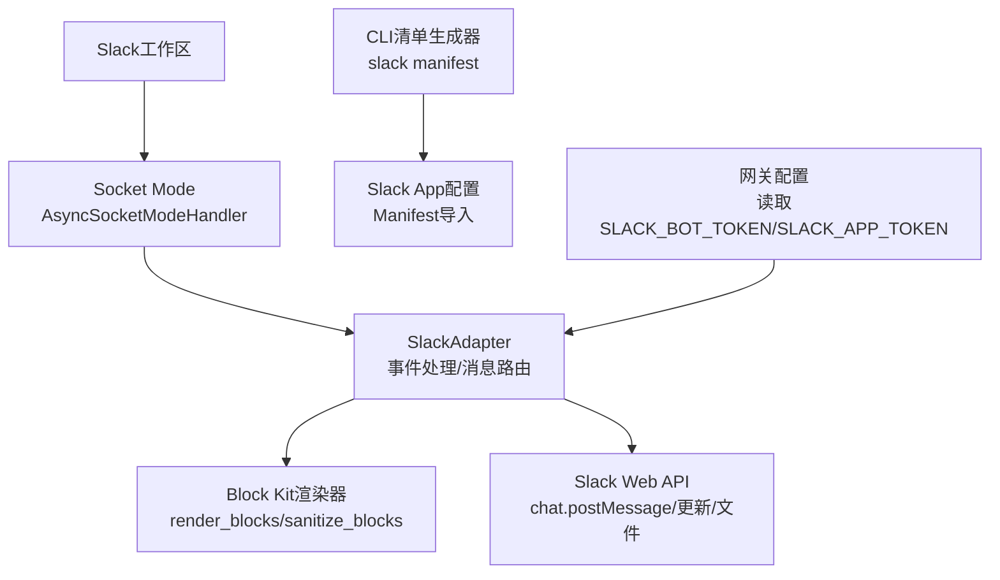
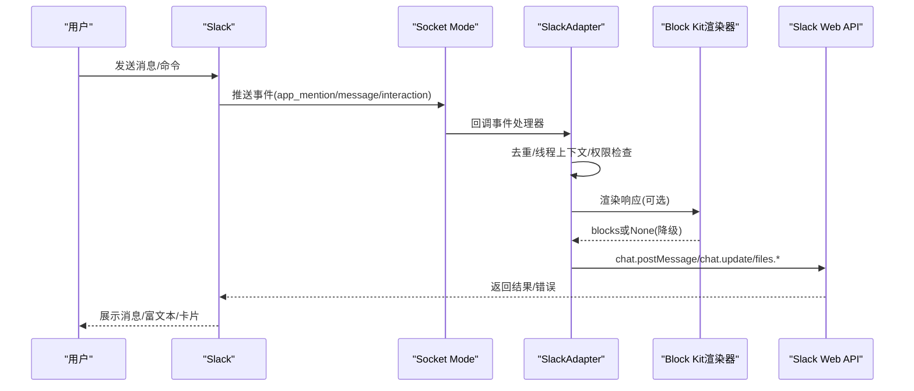
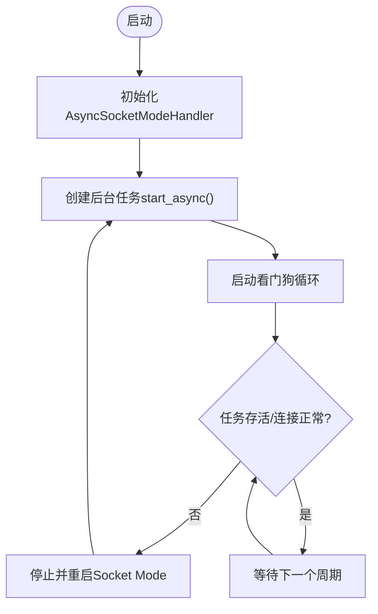
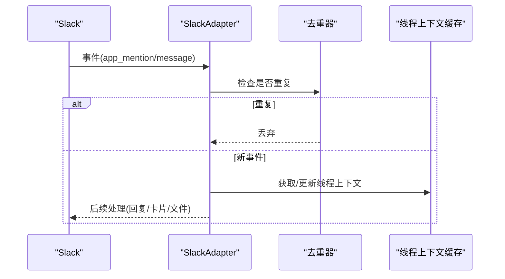
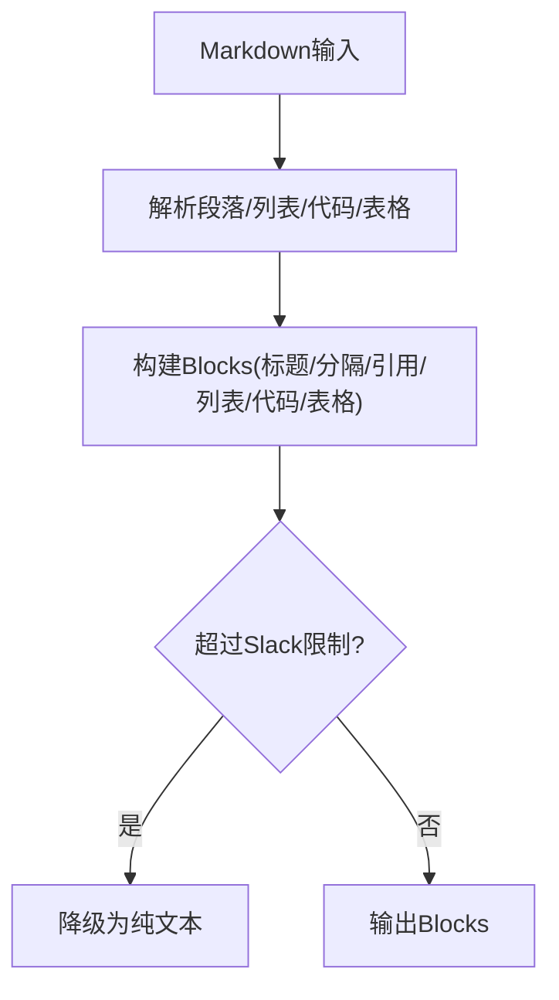
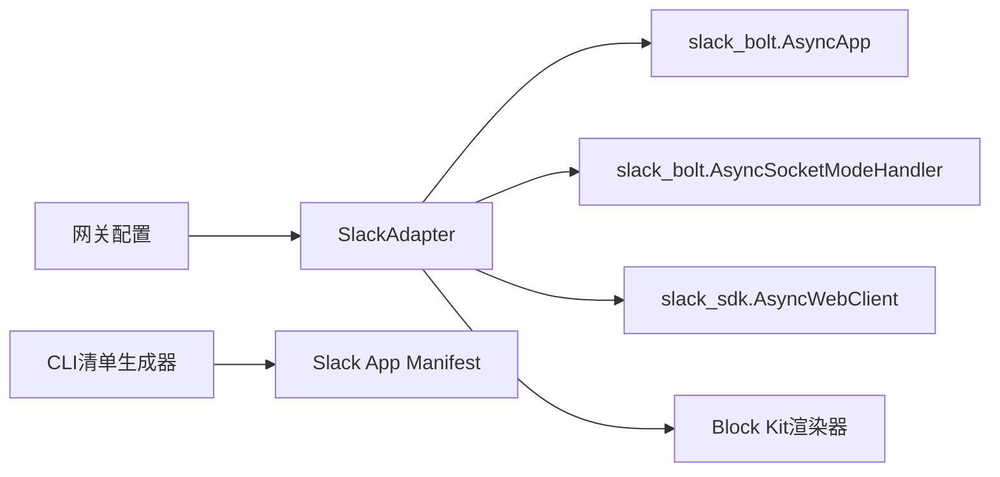

# Slack集成问题

<cite>
**本文引用的文件**
- [plugins/platforms/slack/adapter.py](file://plugins/platforms/slack/adapter.py)
- [plugins/platforms/slack/block_kit.py](file://plugins/platforms/slack/block_kit.py)
- [plugins/platforms/slack/plugin.yaml](file://plugins/platforms/slack/plugin.yaml)
- [sparkii_cli/slack_cli.py](file://sparkii_cli/slack_cli.py)
- [tests/gateway/test_slack.py](file://tests/gateway/test_slack.py)
- [gateway/config.py](file://gateway/config.py)
- [agent/redact.py](file://agent/redact.py)
</cite>

## 目录
1. [简介](#简介)
2. [项目结构](#项目结构)
3. [核心组件](#核心组件)
4. [架构总览](#架构总览)
5. [详细组件分析](#详细组件分析)
6. [依赖关系分析](#依赖关系分析)
7. [性能考虑](#性能考虑)
8. [故障排除指南](#故障排除指南)
9. [结论](#结论)
10. [附录](#附录)

## 简介
本文件面向在项目中集成Slack平台时遇到的常见问题，提供从应用配置、Bot用户与工作区权限管理，到WebSocket连接稳定性、事件订阅与实时消息处理、富文本渲染与Block Kit构建、多媒体内容处理（含上传限制与优化）、频道管理与搜索、API变更兼容性与企业级安全策略的系统性解决方案。文档基于代码库中的Slack适配器实现、Block Kit渲染器、CLI清单生成器以及测试用例进行归纳与说明。

## 项目结构
Slack集成的关键代码位于以下位置：
- 平台适配器：负责Socket Mode连接、事件路由、消息收发、线程上下文、去重、代理与健康监控等。
- Block Kit渲染器：将Agent的Markdown转换为Slack Block Kit blocks，并做边界裁剪与降级。
- CLI清单生成器：生成Slack App Manifest，包含命令、事件、作用域与Socket Mode设置。
- 插件元数据：声明必需/可选环境变量及功能描述。
- 网关配置：读取Slack令牌与环境变量，注入平台配置。
- 测试：覆盖忽略频道、发送、下载SSRF防护、Block Kit适配器等场景。

图表来源
- [plugins/platforms/slack/adapter.py:1183-1200](file://plugins/platforms/slack/adapter.py#L1183-L1200)
- [plugins/platforms/slack/block_kit.py:368-535](file://plugins/platforms/slack/block_kit.py#L368-L535)
- [sparkii_cli/slack_cli.py:30-163](file://sparkii_cli/slack_cli.py#L30-L163)
- [gateway/config.py:586-600](file://gateway/config.py#L586-L600)

章节来源
- [plugins/platforms/slack/adapter.py:866-1047](file://plugins/platforms/slack/adapter.py#L866-L1047)
- [plugins/platforms/slack/block_kit.py:1-689](file://plugins/platforms/slack/block_kit.py#L1-L689)
- [sparkii_cli/slack_cli.py:1-283](file://sparkii_cli/slack_cli.py#L1-L283)
- [plugins/platforms/slack/plugin.yaml:1-46](file://plugins/platforms/slack/plugin.yaml#L1-L46)
- [gateway/config.py:586-600](file://gateway/config.py#L586-L600)

## 核心组件
- SlackAdapter：基于Socket Mode的事件驱动适配器，负责连接生命周期、消息去重、线程上下文缓存、Slash命令上下文、状态气泡、助理线程元数据、多工作区支持、代理与鉴权错误提示、健康自检与自动重连。
- Block Kit渲染器：将Markdown转为Block Kit blocks，处理标题、列表、引用、代码块、表格（原生table或等宽回退），并严格遵循Slack的结构限制（块数、文本长度、表格行列与字符上限）。
- CLI清单生成器：输出完整的Slack App Manifest，包括显示信息、Bot用户、Slash命令、OAuth作用域、事件订阅、交互与Socket Mode开关，支持Assistant/Agent视图模式切换。
- 插件元数据：声明SLACK_BOT_TOKEN、SLACK_APP_TOKEN为必需环境变量，以及SLACK_ALLOWED_USERS、SLACK_HOME_CHANNEL等可选配置。

章节来源
- [plugins/platforms/slack/adapter.py:866-1047](file://plugins/platforms/slack/adapter.py#L866-L1047)
- [plugins/platforms/slack/block_kit.py:368-689](file://plugins/platforms/slack/block_kit.py#L368-L689)
- [sparkii_cli/slack_cli.py:30-163](file://sparkii_cli/slack_cli.py#L30-L163)
- [plugins/platforms/slack/plugin.yaml:12-46](file://plugins/platforms/slack/plugin.yaml#L12-L46)

## 架构总览
Slack集成通过Socket Mode建立长连接，接收事件并路由至适配器；适配器调用Web API发送消息、处理文件与富文本；Block Kit渲染器确保输出符合Slack限制；CLI工具生成Manifest以完成应用注册与权限配置。

图表来源
- [plugins/platforms/slack/adapter.py:1183-1200](file://plugins/platforms/slack/adapter.py#L1183-L1200)
- [plugins/platforms/slack/block_kit.py:368-535](file://plugins/platforms/slack/block_kit.py#L368-L535)

## 详细组件分析

### Socket Mode连接与WebSocket稳定性
- 启动与停止：使用AsyncSocketModeHandler创建任务，并在关闭时按顺序取消子任务并调用close_async，避免会话关闭后仍重试导致的死循环。
- 健康检测：周期性检查任务是否存活、连接状态与ping/pong时间戳，若异常则触发重连。
- 代理支持：解析全局代理并应用到Socket Mode客户端与SDK客户端，同时尊重NO_PROXY规则对Slack域名白名单豁免。
- 重连保护：重连过程加锁，避免并发重建；对首次ping/pong给予宽限期，防止误判。

图表来源
- [plugins/platforms/slack/adapter.py:1183-1200](file://plugins/platforms/slack/adapter.py#L1183-L1200)
- [plugins/platforms/slack/adapter.py:1235-1343](file://plugins/platforms/slack/adapter.py#L1235-L1343)

章节来源
- [plugins/platforms/slack/adapter.py:1183-1343](file://plugins/platforms/slack/adapter.py#L1183-L1343)

### 事件订阅与实时消息处理
- 事件类型：app_mention、message.channels/groups/im/mpim、reaction_added/removed，以及Assistant/Agent视图相关事件（assistant_thread_*、app_context_changed、app_home_opened）。
- 去重机制：基于MessageDeduplicator与TTL（默认1小时）应对Socket Mode重投递；同时维护已处理消息时间戳集合，避免编辑后的重复响应。
- 线程上下文：缓存threads根消息与历史，支持冷启动时补充图片与上下文；对仅提及根图片的场景限制下载数量。
- Slash命令上下文：暂存response_url与user_id，用于首条回复的临时消息路由，避免跨用户/工作区冲突。

图表来源
- [plugins/platforms/slack/adapter.py:748-770](file://plugins/platforms/slack/adapter.py#L748-L770)
- [plugins/platforms/slack/adapter.py:947-1007](file://plugins/platforms/slack/adapter.py#L947-L1007)

章节来源
- [sparkii_cli/slack_cli.py:98-128](file://sparkii_cli/slack_cli.py#L98-L128)
- [plugins/platforms/slack/adapter.py:748-770](file://plugins/platforms/slack/adapter.py#L748-L770)
- [plugins/platforms/slack/adapter.py:947-1007](file://plugins/platforms/slack/adapter.py#L947-L1007)

### 消息格式转换与富文本渲染
- Markdown转Block Kit：支持标题、分隔线、引用、列表、代码块、表格（优先原生table，超限回退等宽文本），段落拆分与块数限制。
- 文本边界：section文本最大3000字符，header最大150字符，整体blocks不超过50；超出时降级为纯文本路径，保证消息不丢失。
- 链接与提及：统一规范化链接形式，提取Block Kit中非引用区的用户/频道/群组提及，避免被转发内容误导。
- 附件与富文本：从legacy attachments与rich_text_quote中提取可读文本，便于Agent理解上下文。

图表来源
- [plugins/platforms/slack/block_kit.py:368-535](file://plugins/platforms/slack/block_kit.py#L368-L535)
- [plugins/platforms/slack/block_kit.py:591-689](file://plugins/platforms/slack/block_kit.py#L591-L689)

章节来源
- [plugins/platforms/slack/block_kit.py:1-689](file://plugins/platforms/slack/block_kit.py#L1-L689)
- [plugins/platforms/slack/adapter.py:399-533](file://plugins/platforms/slack/adapter.py#L399-L533)

### 文件上传限制、图片优化与多媒体处理
- 音频识别：根据文件名与mimetype判断是否为语音片段，选择合适容器扩展名（如.m4a），确保STT后端正确识别。
- 下载失败诊断：将Slack API错误码映射为用户可操作提示（权限缺失、token无效、文件不存在等），并区分HTTP状态码。
- 代理与SSRF防护：对外部URL访问进行重定向防护与代理解析，避免恶意跳转与网络风险。
- 媒体类型：视频与音频分别走不同处理路径，语音片段即使标记为video/mp4也走音频路径。

章节来源
- [plugins/platforms/slack/adapter.py:772-864](file://plugins/platforms/slack/adapter.py#L772-L864)
- [plugins/platforms/slack/adapter.py:1402-1483](file://plugins/platforms/slack/adapter.py#L1402-L1483)
- [tests/gateway/test_slack.py:1-200](file://tests/gateway/test_slack.py#L1-L200)

### 频道管理、用户分组与消息搜索
- 忽略频道：可在配置中指定忽略频道，出站消息将被抑制并返回特定错误码。
- 用户授权：可通过SLACK_ALLOWED_USERS限制允许的用户；开发环境可使用SLACK_ALLOW_ALL_USERS放宽限制。
- 频道技能绑定：适配器支持频道级别的技能绑定，结合会话范围控制消息路由。
- 搜索能力：通过会话与消息索引工具进行搜索（与Slack侧搜索互补），提升定位效率。

章节来源
- [tests/gateway/test_slack.py:116-141](file://tests/gateway/test_slack.py#L116-L141)
- [plugins/platforms/slack/plugin.yaml:23-46](file://plugins/platforms/slack/plugin.yaml#L23-L46)

### Slack API变更与向后兼容性
- 事件类型演进：支持Assistant与Agent两种消息体验，按需启用相应事件与作用域；当Slack升级时，适配器通过条件分支保持兼容。
- 渲染降级：当Block Kit无法表达或超出限制时，自动降级为mrkdwn或纯文本，确保消息始终可达。
- 作用域最小化：清单生成器仅声明必要作用域，减少权限变更带来的影响面。

章节来源
- [sparkii_cli/slack_cli.py:108-128](file://sparkii_cli/slack_cli.py#L108-L128)
- [plugins/platforms/slack/block_kit.py:368-535](file://plugins/platforms/slack/block_kit.py#L368-L535)

### 企业级部署的安全配置与访问控制
- 令牌与敏感信息脱敏：日志与错误信息中对Slack token进行脱敏，避免泄露。
- 代理与网络隔离：支持企业代理，同时遵守NO_PROXY规则，保障内网访问安全。
- 作用域与权限：通过Manifest精确配置bot作用域与事件订阅，遵循最小权限原则。
- 访问控制：支持用户白名单与忽略频道，限制机器人行为范围。

章节来源
- [agent/redact.py:87-88](file://agent/redact.py#L87-L88)
- [plugins/platforms/slack/adapter.py:720-745](file://plugins/platforms/slack/adapter.py#L720-L745)
- [sparkii_cli/slack_cli.py:79-128](file://sparkii_cli/slack_cli.py#L79-L128)

## 依赖关系分析
- 外部依赖：slack-bolt（AsyncApp、AsyncSocketModeHandler）、slack-sdk（AsyncWebClient）、aiohttp。
- 内部依赖：网关平台基类（BasePlatformAdapter、MessageEvent、SendResult等）、Block Kit渲染器、CLI清单生成器、插件元数据。
- 配置依赖：SLACK_BOT_TOKEN、SLACK_APP_TOKEN为必需；SLACK_HOME_CHANNEL等为可选。

图表来源
- [plugins/platforms/slack/adapter.py:25-35](file://plugins/platforms/slack/adapter.py#L25-L35)
- [plugins/platforms/slack/block_kit.py:368-535](file://plugins/platforms/slack/block_kit.py#L368-L535)
- [sparkii_cli/slack_cli.py:30-163](file://sparkii_cli/slack_cli.py#L30-L163)
- [gateway/config.py:586-600](file://gateway/config.py#L586-L600)

章节来源
- [plugins/platforms/slack/adapter.py:25-35](file://plugins/platforms/slack/adapter.py#L25-L35)
- [plugins/platforms/slack/plugin.yaml:12-46](file://plugins/platforms/slack/plugin.yaml#L12-L46)
- [gateway/config.py:586-600](file://gateway/config.py#L586-L600)

## 性能考虑
- 去重窗口：Socket Mode重投递可能导致重复响应，采用1小时TTL的去重器平衡内存与可靠性。
- 线程上下文缓存：限制条目数量与TTL，避免无限增长；冷启动时限制图片下载数量，降低带宽与延迟。
- 渲染边界：严格控制blocks数量与文本长度，避免大消息导致API失败或渲染卡顿。
- 健康监控：看门狗周期轮询，快速发现并修复僵尸连接，减少服务中断时间。

章节来源
- [plugins/platforms/slack/adapter.py:748-770](file://plugins/platforms/slack/adapter.py#L748-L770)
- [plugins/platforms/slack/adapter.py:947-1007](file://plugins/platforms/slack/adapter.py#L947-L1007)
- [plugins/platforms/slack/block_kit.py:368-535](file://plugins/platforms/slack/block_kit.py#L368-L535)
- [plugins/platforms/slack/adapter.py:1306-1343](file://plugins/platforms/slack/adapter.py#L1306-L1343)

## 故障排除指南
- WebSocket连接失败
  - 检查SLACK_APP_TOKEN是否正确且具备connections:write作用域。
  - 确认代理配置有效且未被NO_PROXY豁免。
  - 查看看门狗日志，关注“socket task missing”“transport disconnected”“ping/pong stale”等重连原因。
- 事件订阅未生效
  - 核对Manifest中的bot_events是否包含所需事件类型。
  - 确认Socket Mode已启用，且应用已重新安装以应用新的作用域/事件。
- 实时消息处理异常
  - 检查去重器TTL是否过短导致重复响应。
  - 验证线程上下文缓存是否命中，必要时清理过期条目。
- 富文本渲染失败
  - 若blocks超限，系统将自动降级为纯文本；检查是否有超大表格或超长段落。
  - 使用sanitize_blocks对输出进行边界裁剪，避免invalid_blocks错误。
- 文件上传与下载问题
  - 根据错误码判断权限不足、token无效或文件不存在。
  - 确认代理与SSRF防护未阻断合法请求。
- 频道与用户权限
  - 检查SLACK_ALLOWED_USERS与忽略频道配置。
  - 对于多工作区，确认team_id与channel_id映射正确。

章节来源
- [plugins/platforms/slack/adapter.py:1235-1343](file://plugins/platforms/slack/adapter.py#L1235-L1343)
- [sparkii_cli/slack_cli.py:98-128](file://sparkii_cli/slack_cli.py#L98-L128)
- [plugins/platforms/slack/block_kit.py:591-689](file://plugins/platforms/slack/block_kit.py#L591-L689)
- [plugins/platforms/slack/adapter.py:1402-1483](file://plugins/platforms/slack/adapter.py#L1402-L1483)
- [tests/gateway/test_slack.py:116-141](file://tests/gateway/test_slack.py#L116-L141)

## 结论
本项目提供了健壮的Slack集成方案：通过Socket Mode实现稳定通信，Block Kit渲染器确保富文本质量与兼容性，CLI清单生成器简化应用配置，适配器内置健康监控与自动重连提升可用性。针对企业环境，提供了代理、脱敏、权限最小化与访问控制等安全措施。建议在生产环境中合理配置去重窗口、缓存大小与渲染边界，并结合监控与日志快速定位问题。

## 附录
- 环境变量参考
  - 必需：SLACK_BOT_TOKEN、SLACK_APP_TOKEN
  - 可选：SLACK_ALLOWED_USERS、SLACK_ALLOW_ALL_USERS、SLACK_HOME_CHANNEL、SLACK_HOME_CHANNEL_NAME、SLACK_THREAD_REQUIRE_MENTION
- 常用命令
  - 生成Manifest：sparkii slack manifest [--write] [--name] [--description] [--long-description-file] [--no-assistant] [--agent-view]
- 测试要点
  - 忽略频道出站抑制
  - Mock Slack依赖以保证测试环境独立
  - 文件下载SSRF防护

章节来源
- [plugins/platforms/slack/plugin.yaml:12-46](file://plugins/platforms/slack/plugin.yaml#L12-L46)
- [sparkii_cli/slack_cli.py:166-283](file://sparkii_cli/slack_cli.py#L166-L283)
- [tests/gateway/test_slack.py:1-200](file://tests/gateway/test_slack.py#L1-L200)