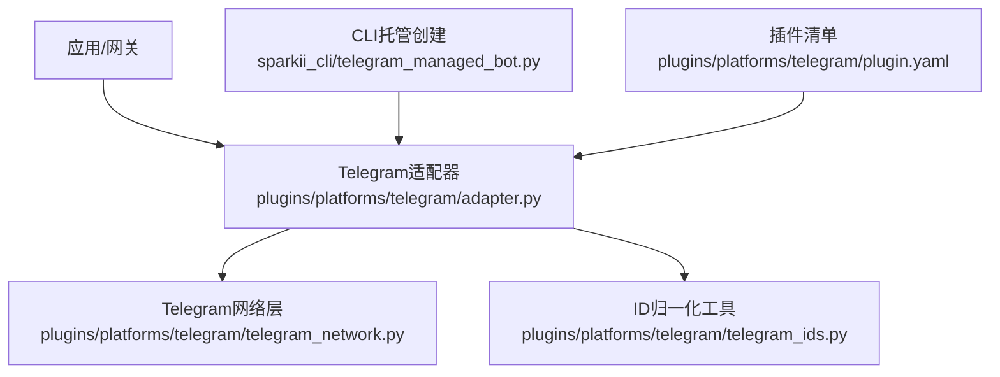
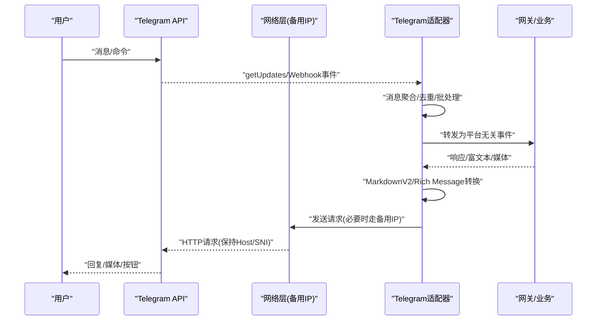
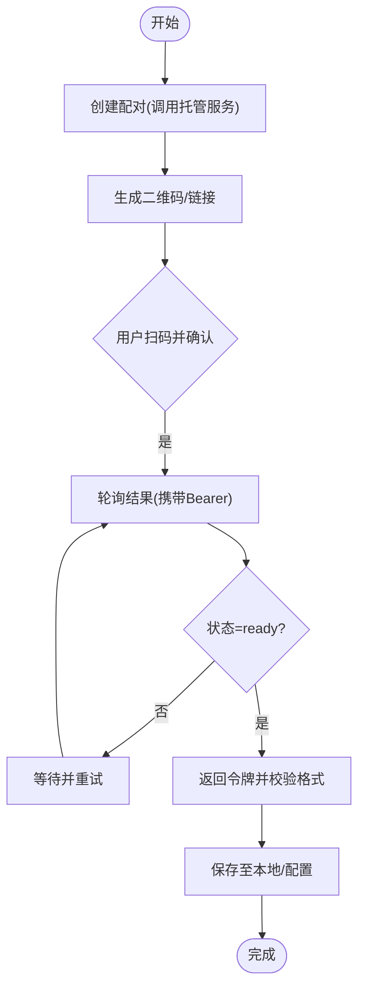
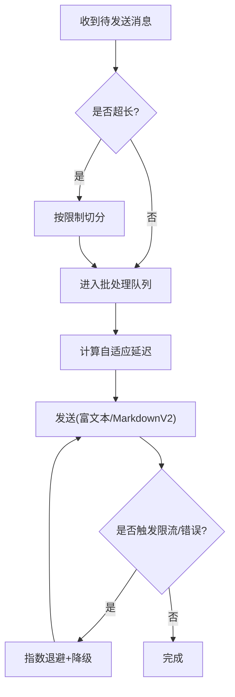
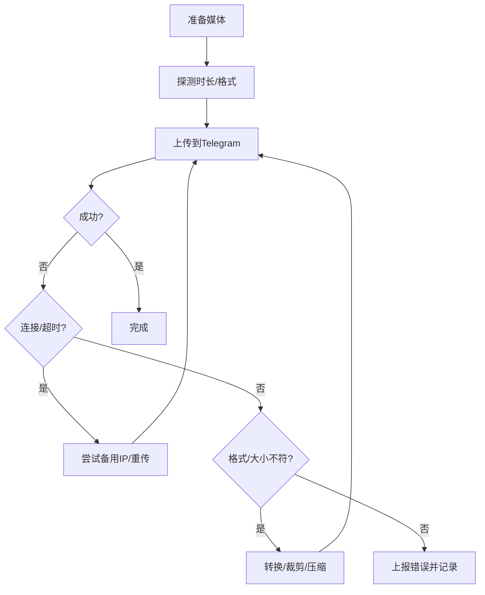
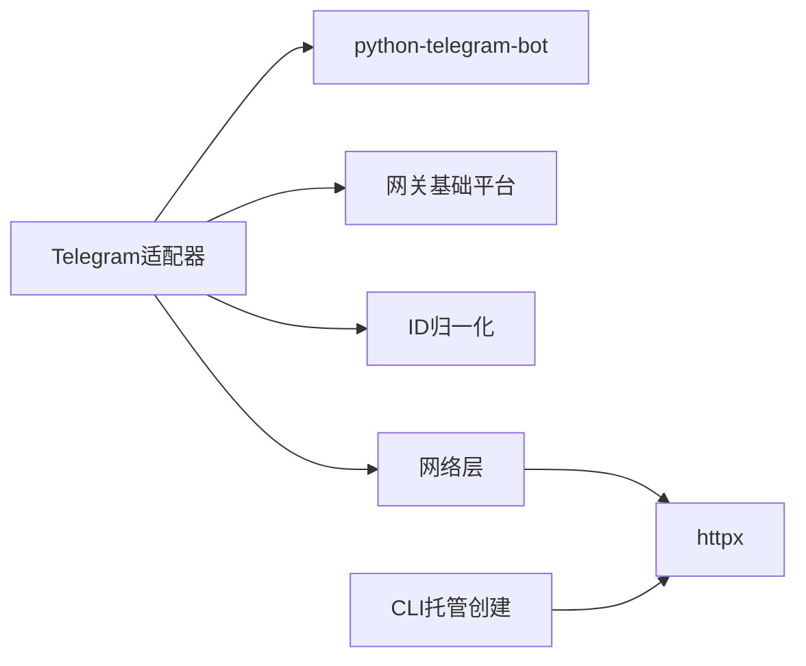

# Telegram集成问题

<cite>
**本文引用的文件**
- [plugins/platforms/telegram/adapter.py](file://plugins/platforms/telegram/adapter.py)
- [plugins/platforms/telegram/telegram_network.py](file://plugins/platforms/telegram/telegram_network.py)
- [plugins/platforms/telegram/plugin.yaml](file://plugins/platforms/telegram/plugin.yaml)
- [sparkii_cli/telegram_managed_bot.py](file://sparkii_cli/telegram_managed_bot.py)
- [plugins/platforms/telegram/telegram_ids.py](file://plugins/platforms/telegram/telegram_ids.py)
</cite>

## 目录
1. [简介](#简介)
2. [项目结构](#项目结构)
3. [核心组件](#核心组件)
4. [架构总览](#架构总览)
5. [详细组件分析](#详细组件分析)
6. [依赖关系分析](#依赖关系分析)
7. [性能与限制](#性能与限制)
8. [故障排除指南](#故障排除指南)
9. [结论](#结论)
10. [附录](#附录)

## 简介
本文件面向在项目中集成Telegram平台时遇到的认证、Webhook、网络连通性、消息与媒体发送限制、群组/频道/论坛主题、服务中断与版本升级、以及多Bot部署隔离等常见问题，提供基于仓库实现的系统化解决方案与排错指引。内容聚焦以下方面：
- Bot令牌获取与管理、权限与白名单配置
- Webhook回调URL验证、SSL证书与防火墙设置
- 消息发送限制与速率控制（含批量处理与重试）
- 媒体上传失败、大小限制与格式兼容
- 群组聊天、频道订阅、论坛主题集成的排障
- Telegram服务中断与API版本升级的应对
- 多Bot部署时的会话隔离与资源管理

## 项目结构
Telegram平台以插件形式接入网关，核心由适配器、网络层、ID归一化与CLI托管创建流程组成：
- 适配器：封装消息收发、MarkdownV2/Rich Message、流式编辑、批处理、错误降级与恢复
- 网络层：实现DNS不可达时的备用IP直连与连接池保护
- ID工具：统一chat_id为数值或@username
- CLI：通过托管机器人流程自动创建并拉取令牌

**图表来源**
- [plugins/platforms/telegram/adapter.py:633-800](file://plugins/platforms/telegram/adapter.py#L633-L800)
- [plugins/platforms/telegram/telegram_network.py:52-166](file://plugins/platforms/telegram/telegram_network.py#L52-L166)
- [plugins/platforms/telegram/telegram_ids.py:23-52](file://plugins/platforms/telegram/telegram_ids.py#L23-L52)
- [sparkii_cli/telegram_managed_bot.py:166-359](file://sparkii_cli/telegram_managed_bot.py#L166-L359)
- [plugins/platforms/telegram/plugin.yaml:1-36](file://plugins/platforms/telegram/plugin.yaml#L1-L36)

**章节来源**
- [plugins/platforms/telegram/adapter.py:633-800](file://plugins/platforms/telegram/adapter.py#L633-L800)
- [plugins/platforms/telegram/telegram_network.py:52-166](file://plugins/platforms/telegram/telegram_network.py#L52-L166)
- [plugins/platforms/telegram/telegram_ids.py:23-52](file://plugins/platforms/telegram/telegram_ids.py#L23-L52)
- [sparkii_cli/telegram_managed_bot.py:166-359](file://sparkii_cli/telegram_managed_bot.py#L166-L359)
- [plugins/platforms/telegram/plugin.yaml:1-36](file://plugins/platforms/telegram/plugin.yaml#L1-L36)

## 核心组件
- Telegram适配器
  - 负责消息接收/发送、MarkdownV2与Rich Message渲染、流式编辑、文本与媒体批处理、错误降级与恢复、轮询生命周期管理
  - 关键能力：消息长度限制、富文本上限、文本批处理延迟、媒体组等待时间、类型提示冷却、轮询健康检查与超时保护
- Telegram网络层
  - 当主域名不可达时，通过DoH发现或种子IP进行备用连接；保持逻辑主机名与SNI不变；对失败连接池及时释放，避免FD泄漏
- ID归一化
  - 将chat_id统一为数值或@username字符串，避免int转换异常
- CLI托管创建
  - 通过托管机器人流程生成配对信息、二维码/链接，轮询获取令牌并校验格式

**章节来源**
- [plugins/platforms/telegram/adapter.py:633-800](file://plugins/platforms/telegram/adapter.py#L633-L800)
- [plugins/platforms/telegram/telegram_network.py:52-166](file://plugins/platforms/telegram/telegram_network.py#L52-L166)
- [plugins/platforms/telegram/telegram_ids.py:23-52](file://plugins/platforms/telegram/telegram_ids.py#L23-L52)
- [sparkii_cli/telegram_managed_bot.py:166-359](file://sparkii_cli/telegram_managed_bot.py#L166-L359)

## 架构总览
下图展示从请求到响应的端到端路径，包括网络回退与适配器内部批处理/重试机制。

**图表来源**
- [plugins/platforms/telegram/adapter.py:633-800](file://plugins/platforms/telegram/adapter.py#L633-L800)
- [plugins/platforms/telegram/telegram_network.py:105-157](file://plugins/platforms/telegram/telegram_network.py#L105-L157)

## 详细组件分析

### 认证与令牌管理
- 令牌来源
  - 使用托管机器人流程自动创建子Bot并获取令牌，支持二维码/链接扫码确认，轮询直到令牌就绪
  - 令牌格式校验，确保符合规范后再写入本地
- 环境变量与权限
  - 必需：TELEGRAM_BOT_TOKEN
  - 可选：TELEGRAM_ALLOWED_USERS、TELEGRAM_ALLOW_ALL_USERS、TELEGRAM_HOME_CHANNEL、TELEGRAM_HOME_CHANNEL_NAME
  - 授权门控按Profile读取，避免多Profile环境下的环境变量串扰

**图表来源**
- [sparkii_cli/telegram_managed_bot.py:166-359](file://sparkii_cli/telegram_managed_bot.py#L166-L359)

**章节来源**
- [sparkii_cli/telegram_managed_bot.py:166-359](file://sparkii_cli/telegram_managed_bot.py#L166-L359)
- [plugins/platforms/telegram/plugin.yaml:13-35](file://plugins/platforms/telegram/plugin.yaml#L13-L35)

### Webhook配置与回调URL验证
- 模式选择
  - 适配器同时支持轮询与Webhook两种模式；若启用Webhook，需确保回调URL可达且TLS有效
- 回调验证
  - 若使用Webhook，请确保回调端点能正确响应Telegram的验证请求；如未正确配置，适配器会回退到轮询模式以保证可用性
- SSL与防火墙
  - 确保服务器对外暴露HTTPS端口，证书链完整；防火墙放行入站443及出站到Telegram域名的连接
- 诊断建议
  - 观察适配器日志中的“轮询健康检查”“连接超时”“回退IP”等关键字，定位是证书、反向代理还是网络策略问题

[本节为概念性说明，不直接引用具体代码行]

### 消息发送限制与速率限制
- 文本限制
  - 单条消息最大长度受平台限制；长消息会被切分并通过流式编辑合并
  - Rich Message有字符上限，超出部分走传统MarkdownV2路径
- 批处理与延迟
  - 文本与媒体采用短时缓冲聚合，减少客户端拆分导致的重复处理
  - 自适应延迟：短消息更快到达，长消息适当延后，整体受可配置上限约束
- 速率与重试
  - 针对Telegram侧的限流与临时错误，适配器内置重试与降级策略；最终编辑失败时走兜底路径，避免长时间占用配额
  - 类型提示发送带冷却，避免频繁失败浪费配额

**图表来源**
- [plugins/platforms/telegram/adapter.py:633-800](file://plugins/platforms/telegram/adapter.py#L633-L800)

**章节来源**
- [plugins/platforms/telegram/adapter.py:633-800](file://plugins/platforms/telegram/adapter.py#L633-L800)

### 媒体文件上传失败、大小限制与格式兼容
- 失败原因排查
  - 网络抖动、服务端转码耗时、连接池僵死、文件大小超限、格式不支持
- 适配策略
  - 媒体发送读超时更长，以容纳服务端转码时间
  - 音频时长探测：优先标准库，其次元数据解析，最后ffprobe回退，确保播放器显示正确时长
  - 图片扩展名与MIME映射，保证正确的Content-Type
- 连接池保护
  - 备用传输在连接失败时丢弃失效连接池，避免文件描述符耗尽

**图表来源**
- [plugins/platforms/telegram/adapter.py:335-393](file://plugins/platforms/telegram/adapter.py#L335-L393)
- [plugins/platforms/telegram/telegram_network.py:88-104](file://plugins/platforms/telegram/telegram_network.py#L88-L104)

**章节来源**
- [plugins/platforms/telegram/adapter.py:335-393](file://plugins/platforms/telegram/adapter.py#L335-L393)
- [plugins/platforms/telegram/telegram_network.py:88-104](file://plugins/platforms/telegram/telegram_network.py#L88-L104)

### 群组聊天、频道订阅与论坛主题
- 群组/频道
  - chat_id支持数值与@username；归一化函数避免int转换异常
  - 频道发布与订阅需确保Bot已加入并具有相应权限
- 论坛主题
  - 适配器支持forum topic(thread_id)；通用主题ID常量用于默认路由
- 常见问题
  - 无法在频道发言：检查Bot权限与管理员设置
  - 论坛主题消息错位：确认thread_id传递正确

**章节来源**
- [plugins/platforms/telegram/telegram_ids.py:23-52](file://plugins/platforms/telegram/telegram_ids.py#L23-L52)
- [plugins/platforms/telegram/adapter.py:633-800](file://plugins/platforms/telegram/adapter.py#L633-L800)

### 服务中断与API版本升级
- 服务中断
  - 轮询健康检查与超时保护，防止事件循环阻塞导致假死
  - 备用IP直连：当主域名不可达时自动切换到已知可用IP，保持Host与SNI不变
  - 心跳与看门狗：检测长时间无进展的任务并强制恢复
- API版本升级
  - Rich Message能力按需启用，并在失败时降级到MarkdownV2
  - 依赖懒加载：运行时再安装SDK，降低冷启动成本

**章节来源**
- [plugins/platforms/telegram/adapter.py:633-800](file://plugins/platforms/telegram/adapter.py#L633-L800)
- [plugins/platforms/telegram/telegram_network.py:231-285](file://plugins/platforms/telegram/telegram_network.py#L231-L285)

### 多Bot部署的会话隔离与资源管理
- 会话隔离
  - 每个Bot实例独立Application/Bot对象，事件上下文隔离
  - 批处理队列与任务按会话键隔离，避免跨会话污染
- 资源管理
  - 连接池限制与失败回收，避免FD泄漏
  - 轮询生命周期边界明确，停止/断开带超时保护，防止挂起
  - 类型提示与媒体批处理按会话冷却/缓冲，降低并发压力

**章节来源**
- [plugins/platforms/telegram/adapter.py:633-800](file://plugins/platforms/telegram/adapter.py#L633-L800)
- [plugins/platforms/telegram/telegram_network.py:61-79](file://plugins/platforms/telegram/telegram_network.py#L61-L79)

## 依赖关系分析
- 适配器依赖
  - python-telegram-bot（懒加载），网关基础平台抽象，ID归一化，网络层
- 网络层依赖
  - httpx异步传输，DoH提供商，系统DNS解析
- CLI依赖
  - httpx调用托管服务，qrcode可选输出

**图表来源**
- [plugins/platforms/telegram/adapter.py:236-275](file://plugins/platforms/telegram/adapter.py#L236-L275)
- [plugins/platforms/telegram/telegram_network.py:12-19](file://plugins/platforms/telegram/telegram_network.py#L12-L19)
- [sparkii_cli/telegram_managed_bot.py:19-23](file://sparkii_cli/telegram_managed_bot.py#L19-L23)

**章节来源**
- [plugins/platforms/telegram/adapter.py:236-275](file://plugins/platforms/telegram/adapter.py#L236-L275)
- [plugins/platforms/telegram/telegram_network.py:12-19](file://plugins/platforms/telegram/telegram_network.py#L12-L19)
- [sparkii_cli/telegram_managed_bot.py:19-23](file://sparkii_cli/telegram_managed_bot.py#L19-L23)

## 性能与限制
- 文本批处理
  - 短消息快速送达，长消息适度延迟，整体受上限约束，提升首字体验
- 媒体发送
  - 读超时延长以容纳服务端转码；音频时长探测提高播放体验
- 连接池
  - 限制连接数与保活连接数，失败时主动释放，避免FD耗尽
- 轮询健康
  - 初始与每代轮询均有进度超时，防止假死；看门狗强制恢复

[本节为通用性能讨论，不直接引用具体代码行]

## 故障排除指南
- 认证与令牌
  - 现象：无法启动或鉴权失败
  - 排查：确认TELEGRAM_BOT_TOKEN存在且格式合法；使用托管流程重新获取；检查Allowed Users/Allow All配置
  - 参考：[令牌校验与托管流程:166-359](file://sparkii_cli/telegram_managed_bot.py#L166-L359)、[插件清单环境变量:13-35](file://plugins/platforms/telegram/plugin.yaml#L13-L35)
- Webhook回调
  - 现象：回调无效或验证失败
  - 排查：确认回调URL可达、TLS有效；检查反向代理与防火墙；如失败则回退到轮询
  - 参考：[适配器模式切换与轮询健康:633-800](file://plugins/platforms/telegram/adapter.py#L633-L800)
- 网络连通性
  - 现象：连接超时或域名不可达
  - 排查：启用备用IP直连；检查DoH与系统DNS；观察“Primary unreachable; using sticky fallback IP”日志
  - 参考：[备用传输与DoH发现:231-285](file://plugins/platforms/telegram/telegram_network.py#L231-L285)
- 消息与媒体
  - 现象：发送失败、格式错误或时长显示为0
  - 排查：检查文件大小与格式；启用时长探测；查看媒体发送超时与重试日志
  - 参考：[音频时长探测:335-393](file://plugins/platforms/telegram/adapter.py#L335-L393)
- 群组/频道/论坛
  - 现象：无法在频道发言或主题错乱
  - 排查：确认Bot权限；验证chat_id与thread_id；使用ID归一化避免异常
  - 参考：[chat_id归一化:23-52](file://plugins/platforms/telegram/telegram_ids.py#L23-L52)
- 服务中断与升级
  - 现象：长时间无响应或功能异常
  - 排查：观察轮询健康与看门狗；确认Rich Message降级；检查依赖懒加载是否成功
  - 参考：[轮询健康与降级:633-800](file://plugins/platforms/telegram/adapter.py#L633-L800)

**章节来源**
- [sparkii_cli/telegram_managed_bot.py:166-359](file://sparkii_cli/telegram_managed_bot.py#L166-L359)
- [plugins/platforms/telegram/plugin.yaml:13-35](file://plugins/platforms/telegram/plugin.yaml#L13-L35)
- [plugins/platforms/telegram/adapter.py:633-800](file://plugins/platforms/telegram/adapter.py#L633-L800)
- [plugins/platforms/telegram/telegram_network.py:231-285](file://plugins/platforms/telegram/telegram_network.py#L231-L285)
- [plugins/platforms/telegram/telegram_ids.py:23-52](file://plugins/platforms/telegram/telegram_ids.py#L23-L52)

## 结论
本项目通过适配器、网络层与CLI协同，提供了健壮的Telegram集成方案：
- 自动化令牌获取与严格校验
- 灵活的消息与媒体处理、批处理与重试
- 在网络不可达时自动回退到备用IP，保障连通性
- 完善的健康检查与恢复机制，应对服务中断与版本升级
- 清晰的会话隔离与资源管理，支撑多Bot部署

建议在部署中结合日志关键词（如“fallback IP”“rich message”“polling progress”“media send timeout”）快速定位问题，并按本文指引逐项排查。

[本节为总结性内容，不直接引用具体代码行]

## 附录
- 环境变量速查
  - TELEGRAM_BOT_TOKEN：必填
  - TELEGRAM_ALLOWED_USERS：可选，逗号分隔的用户ID白名单
  - TELEGRAM_ALLOW_ALL_USERS：可选，开发环境允许所有用户
  - TELEGRAM_HOME_CHANNEL / TELEGRAM_HOME_CHANNEL_NAME：可选，通知与定时任务目标
- 常用排查命令
  - 检查DoH解析：观察备用IP发现日志
  - 检查连接池：关注“重置失败的回退传输”相关日志
  - 检查轮询健康：关注“轮询进度超时”“看门狗强制恢复”日志

[本节为补充信息，不直接引用具体代码行]