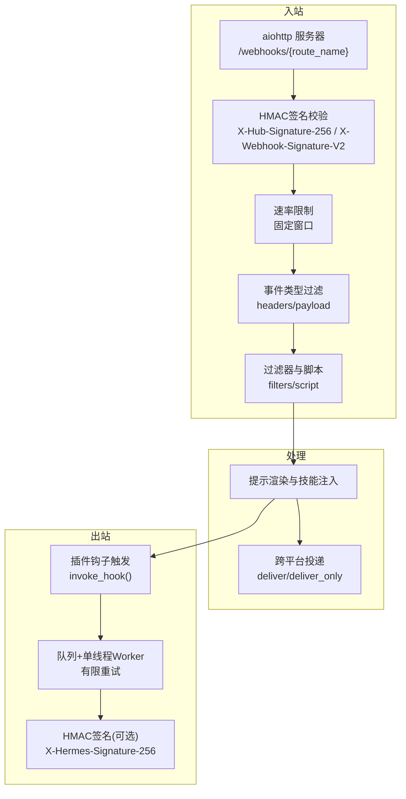
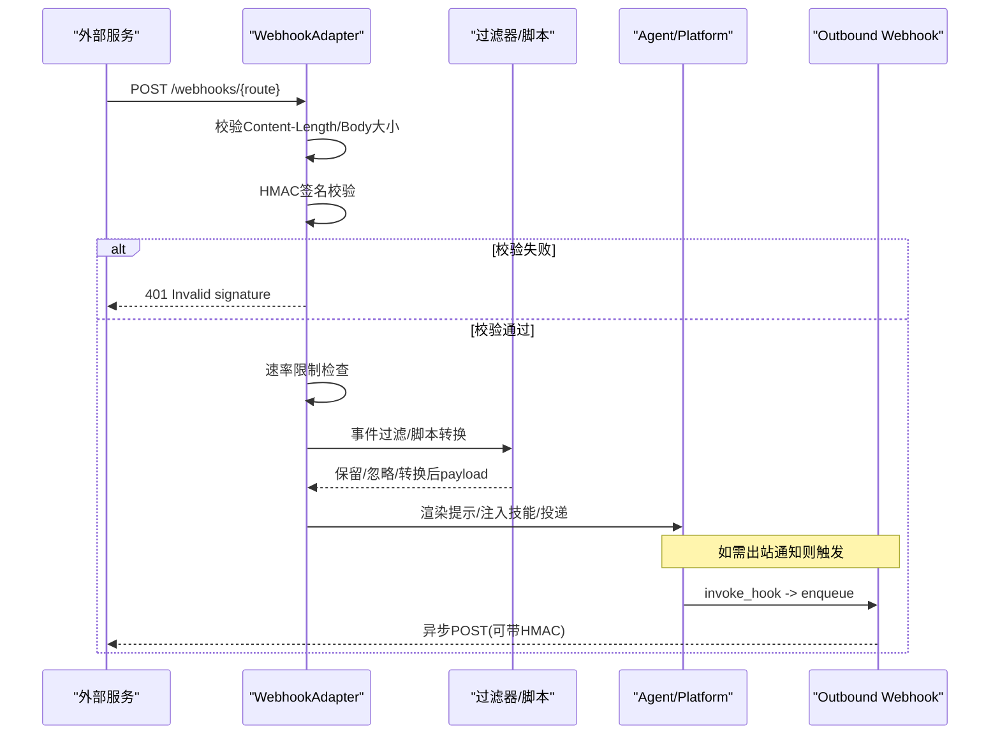
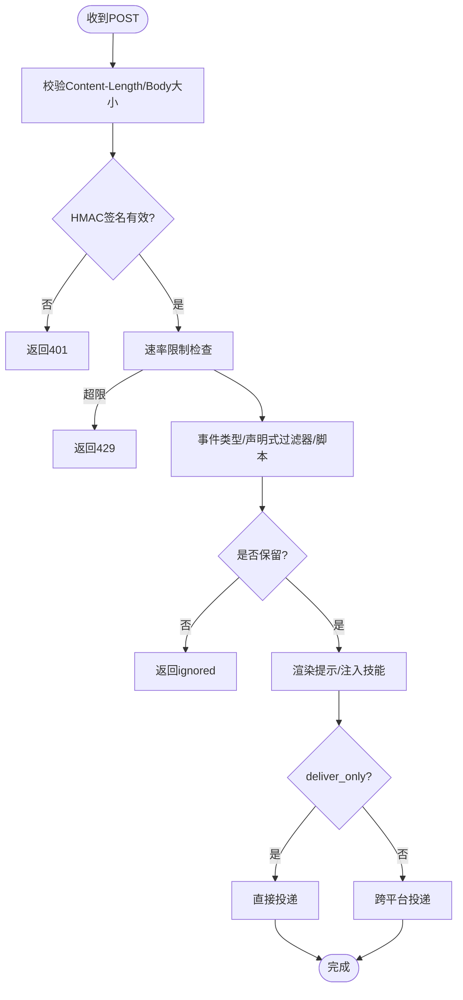
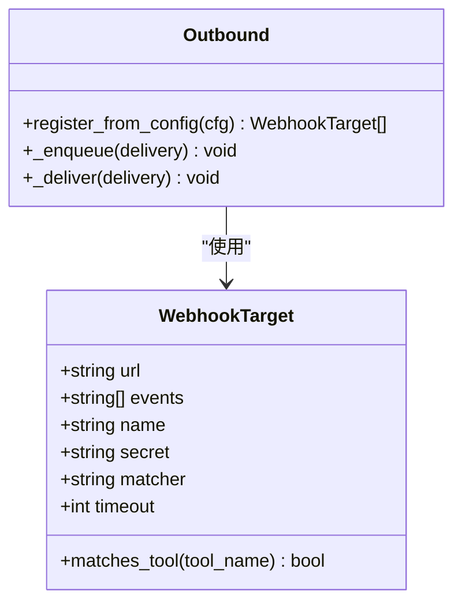
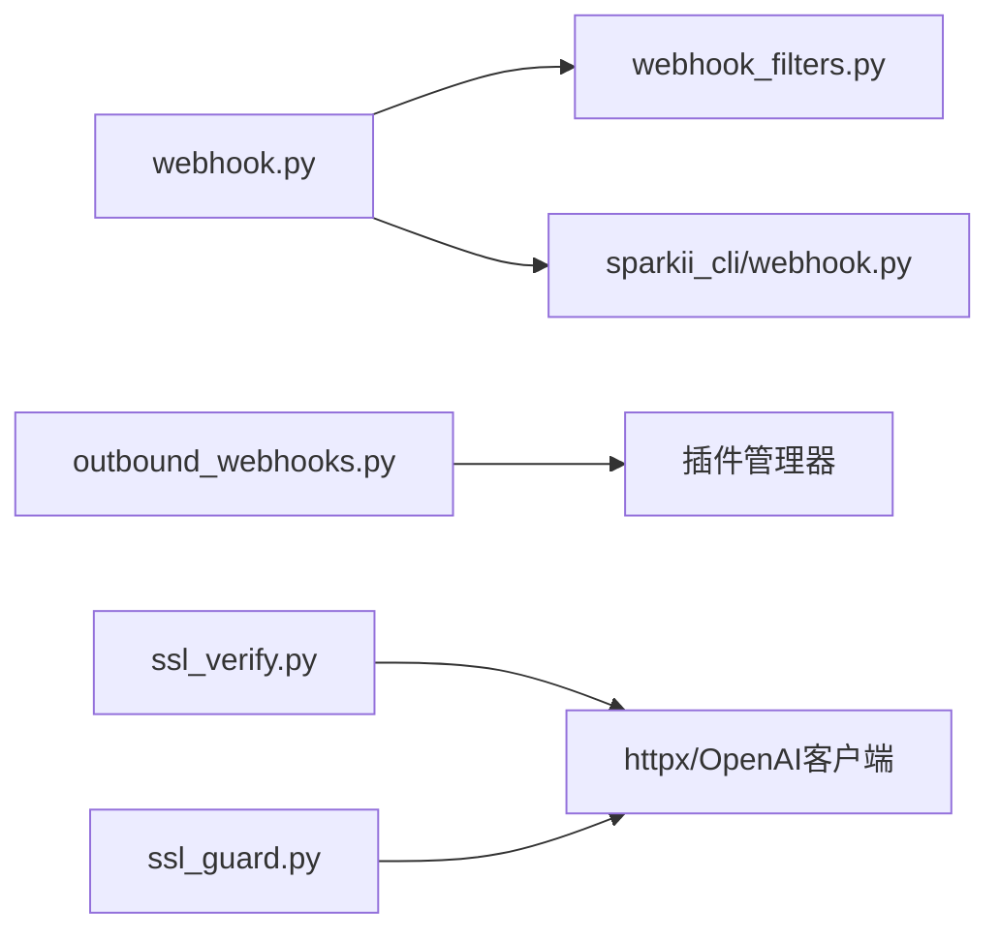

# Webhook配置问题

<cite>
**本文引用的文件**
- [agent/outbound_webhooks.py](file://agent/outbound_webhooks.py)
- [gateway/platforms/webhook.py](file://gateway/platforms/webhook.py)
- [gateway/platforms/webhook_filters.py](file://gateway/platforms/webhook_filters.py)
- [sparkii_cli/webhook.py](file://sparkii_cli/webhook.py)
- [tests/gateway/test_webhook_signature_rate_limit.py](file://tests/gateway/test_webhook_signature_rate_limit.py)
- [tests/agent/test_outbound_webhooks.py](file://tests/agent/test_outbound_webhooks.py)
- [agent/ssl_verify.py](file://agent/ssl_verify.py)
- [agent/ssl_guard.py](file://agent/ssl_guard.py)
</cite>

## 目录
1. [简介](#简介)
2. [项目结构](#项目结构)
3. [核心组件](#核心组件)
4. [架构总览](#架构总览)
5. [详细组件分析](#详细组件分析)
6. [依赖关系分析](#依赖关系分析)
7. [性能与可靠性](#性能与可靠性)
8. [故障排除指南](#故障排除指南)
9. [结论](#结论)
10. [附录：配置清单与最佳实践](#附录：配置清单与最佳实践)

## 简介
本文件面向Webhook端点设置、URL验证、回调地址配置、HTTP请求签名验证、时间戳校验、防重放攻击、网络超时与重试、负载均衡、过滤器与事件路由、SSL/TLS证书管理、域名解析与防火墙规则、失败重试与死信队列、监控告警，以及多平台冲突与资源共享策略等主题，提供基于仓库实现的系统化解决方案。内容严格依据代码实现与测试用例总结，避免臆测。

## 项目结构
与Webhook相关的核心位置如下：
- 入站Webhook适配器（接收外部服务POST）：gateway/platforms/webhook.py
- 入站过滤器与脚本转换：gateway/platforms/webhook_filters.py
- 出站Webhook通知（Agent主动推送）：agent/outbound_webhooks.py
- CLI动态订阅管理：sparkii_cli/webhook.py
- SSL/TLS证书校验与防护：agent/ssl_verify.py, agent/ssl_guard.py
- 相关测试：tests/gateway/test_webhook_signature_rate_limit.py, tests/agent/test_outbound_webhooks.py

图表来源
- [gateway/platforms/webhook.py:177-344](file://gateway/platforms/webhook.py#L177-L344)
- [gateway/platforms/webhook.py:584-800](file://gateway/platforms/webhook.py#L584-L800)
- [gateway/platforms/webhook_filters.py:94-303](file://gateway/platforms/webhook_filters.py#L94-L303)
- [agent/outbound_webhooks.py:156-207](file://agent/outbound_webhooks.py#L156-L207)
- [agent/outbound_webhooks.py:380-570](file://agent/outbound_webhooks.py#L380-L570)

章节来源
- [gateway/platforms/webhook.py:177-344](file://gateway/platforms/webhook.py#L177-L344)
- [gateway/platforms/webhook_filters.py:94-303](file://gateway/platforms/webhook_filters.py#L94-L303)
- [agent/outbound_webhooks.py:156-207](file://agent/outbound_webhooks.py#L156-L207)
- [agent/outbound_webhooks.py:380-570](file://agent/outbound_webhooks.py#L380-L570)

## 核心组件
- 入站Webhook适配器：提供HTTP服务、HMAC签名校验、速率限制、事件过滤、脚本转换、提示渲染与投递。
- 过滤器与脚本：支持声明式过滤器（字段存在性、等于、包含、正则、文件匹配、all/any/not组合），以及外部脚本转换（沙箱化路径、超时控制）。
- 出站Webhook：通过插件钩子将Agent生命周期事件推送到外部HTTP端点，支持HMAC签名、定向工具事件匹配、有限重试与队列限流。
- CLI动态订阅：运行时创建/删除/列出/测试Webhook路由，持久化到本地JSON并热重载。
- SSL/TLS：统一CA证书校验与修复建议，防止错误配置导致的不透明失败。

章节来源
- [gateway/platforms/webhook.py:177-344](file://gateway/platforms/webhook.py#L177-L344)
- [gateway/platforms/webhook_filters.py:94-303](file://gateway/platforms/webhook_filters.py#L94-L303)
- [agent/outbound_webhooks.py:156-207](file://agent/outbound_webhooks.py#L156-L207)
- [agent/outbound_webhooks.py:380-570](file://agent/outbound_webhooks.py#L380-L570)
- [sparkii_cli/webhook.py:140-308](file://sparkii_cli/webhook.py#L140-L308)
- [agent/ssl_verify.py:22-64](file://agent/ssl_verify.py#L22-L64)
- [agent/ssl_guard.py:68-102](file://agent/ssl_guard.py#L68-L102)

## 架构总览
入站流程：
- 客户端POST到/webhooks/{route_name}或/p/{profile}/webhooks/{route_name}
- 先读取Content-Length与Body，再进行HMAC签名校验（跳过INSECURE_NO_AUTH仅用于本地回环）
- 通过后进行速率限制、事件类型过滤、声明式过滤器与脚本转换
- 渲染提示、注入技能、生成delivery_id，调用跨平台投递或直投（deliver_only）

出站流程：
- Agent内部invoke_hook触发，注册回调将事件序列化并加入有界队列
- 单线程Worker按目标配置发送POST，计算HMAC签名（可选），最多重试一次，拒绝3xx重定向
- 进程退出时尝试flush队列，确保关键事件尽量送达

图表来源
- [gateway/platforms/webhook.py:584-800](file://gateway/platforms/webhook.py#L584-L800)
- [gateway/platforms/webhook_filters.py:208-303](file://gateway/platforms/webhook_filters.py#L208-L303)
- [agent/outbound_webhooks.py:380-570](file://agent/outbound_webhooks.py#L380-L570)

## 详细组件分析

### 入站Webhook适配器（gateway/platforms/webhook.py）
- 监听端口与绑定：默认host为None（双栈IPv4/IPv6），port=8644；支持自定义host/port。
- 路由：/health健康检查；/webhooks/{route_name}；/p/{profile}/webhooks/{route_name}多Profile复用。
- 安全：
  - 启动时校验每条路由必须配置secret（全局或路由级），禁止非回环绑定使用INSECURE_NO_AUTH。
  - 请求体大小限制（client_max_size与二次校验）。
  - HMAC签名校验：支持V2（含时间戳绑定的签名）与兼容的V1（body-only，已弃用但接受并警告）。
  - 速率限制：每路由固定窗口计数，超限返回429。
  - 事件类型过滤：从特定header或payload中取event_type，若配置events白名单则过滤。
  - 声明式过滤器与脚本：支持复杂条件与外部脚本转换（路径受限、超时保护）。
- 投递：支持deliver_only模式直接投递（零LLM成本），否则走跨平台投递。
- 幂等与去重：记录最近delivery_id（TTL清理），避免重复执行。

图表来源
- [gateway/platforms/webhook.py:177-344](file://gateway/platforms/webhook.py#L177-L344)
- [gateway/platforms/webhook.py:584-800](file://gateway/platforms/webhook.py#L584-L800)
- [gateway/platforms/webhook_filters.py:208-303](file://gateway/platforms/webhook_filters.py#L208-L303)

章节来源
- [gateway/platforms/webhook.py:177-344](file://gateway/platforms/webhook.py#L177-L344)
- [gateway/platforms/webhook.py:584-800](file://gateway/platforms/webhook.py#L584-L800)
- [gateway/platforms/webhook_filters.py:208-303](file://gateway/platforms/webhook_filters.py#L208-L303)

### 过滤器与脚本（gateway/platforms/webhook_filters.py）
- 字段解析：支持payload.event.headers上下文，点号路径访问。
- 操作符：exists/missing/equals/not_equals/contains/in/in_file/regex，支持all/any/not组合。
- 脚本执行：限定在~/.sparkii/scripts下，支持bash/python，超时保护，输出JSON或文本，[SILENT]或__sparkii_ignore__表示忽略。

章节来源
- [gateway/platforms/webhook_filters.py:21-92](file://gateway/platforms/webhook_filters.py#L21-L92)
- [gateway/platforms/webhook_filters.py:94-303](file://gateway/platforms/webhook_filters.py#L94-L303)

### 出站Webhook（agent/outbound_webhooks.py）
- 配置：hooks.outbound列表，支持url/events/secret_env或secret/matcher/timeout/name。
- 注册：幂等注册到插件管理器，Safe Mode下跳过。
- 回调：对pre/post_tool_call支持matcher精确匹配工具名。
- 负载：包含hook_event_name/tool_name/tool_input/session_id/cwd/extra/delivery_id/timestamp。
- 签名：当配置secret时，计算HMAC-SHA256并放入X-Hermes-Signature-256。
- 投递：单线程Worker，队列满丢弃并告警；连接错误/5xx重试一次；3xx不跟随；4xx不重试。
- 退出：atexit flush保证短生命周期进程也能尽量发送。

图表来源
- [agent/outbound_webhooks.py:112-150](file://agent/outbound_webhooks.py#L112-L150)
- [agent/outbound_webhooks.py:156-207](file://agent/outbound_webhooks.py#L156-L207)
- [agent/outbound_webhooks.py:380-570](file://agent/outbound_webhooks.py#L380-L570)

章节来源
- [agent/outbound_webhooks.py:156-207](file://agent/outbound_webhooks.py#L156-L207)
- [agent/outbound_webhooks.py:380-570](file://agent/outbound_webhooks.py#L380-L570)

### CLI动态订阅（sparkii_cli/webhook.py）
- 命令：subscribe/list/remove/test
- 存储：~/.sparkii/webhook_subscriptions.json，原子写入并限制权限0600
- 热重载：网关每次请求检测mtime变化并合并静态/动态路由
- 测试：自动计算HMAC签名并发送测试请求

章节来源
- [sparkii_cli/webhook.py:140-308](file://sparkii_cli/webhook.py#L140-L308)

### SSL/TLS证书管理（agent/ssl_verify.py, agent/ssl_guard.py）
- ssl_verify.resolve_httpx_verify：优先级false > 显式ca_bundle > 环境变量 > True；禁用时会发出警告。
- ssl_guard.verify_ca_bundle：校验环境配置的CA bundle与内置certifi是否有效，给出修复建议。

章节来源
- [agent/ssl_verify.py:22-64](file://agent/ssl_verify.py#L22-L64)
- [agent/ssl_guard.py:68-102](file://agent/ssl_guard.py#L68-L102)

## 依赖关系分析
- 入站Webhook依赖aiohttp，过滤器依赖json/re/subprocess，出站依赖标准库queue/threading与urllib。
- 动态订阅文件由CLI写入，网关在请求时热加载。
- 测试覆盖签名顺序、出站HMAC、重定向行为、重试策略等。

图表来源
- [gateway/platforms/webhook.py:177-344](file://gateway/platforms/webhook.py#L177-L344)
- [gateway/platforms/webhook_filters.py:94-303](file://gateway/platforms/webhook_filters.py#L94-L303)
- [agent/outbound_webhooks.py:156-207](file://agent/outbound_webhooks.py#L156-L207)
- [agent/ssl_verify.py:22-64](file://agent/ssl_verify.py#L22-L64)
- [agent/ssl_guard.py:68-102](file://agent/ssl_guard.py#L68-L102)

章节来源
- [gateway/platforms/webhook.py:177-344](file://gateway/platforms/webhook.py#L177-L344)
- [gateway/platforms/webhook_filters.py:94-303](file://gateway/platforms/webhook_filters.py#L94-L303)
- [agent/outbound_webhooks.py:156-207](file://agent/outbound_webhooks.py#L156-L207)
- [agent/ssl_verify.py:22-64](file://agent/ssl_verify.py#L22-L64)
- [agent/ssl_guard.py:68-102](file://agent/ssl_guard.py#L68-L102)

## 性能与可靠性
- 入站：
  - 请求体大小限制与“认证前读体”模式，避免大Payload消耗资源。
  - 速率限制按路由固定窗口，防止滥用。
  - 过滤器与脚本在独立线程执行，避免阻塞事件循环。
- 出站：
  - 有界队列（默认256）与单线程Worker，避免阻塞主循环。
  - 有限重试（最多2次），指数退避；4xx不重试，3xx不跟随。
  - 进程退出时flush队列，保障关键事件。
- 幂等：
  - 入站记录delivery_id（TTL清理），避免重复执行。
  - 出站delivery_id同时出现在Header与签名Body内，便于接收方去重。

章节来源
- [gateway/platforms/webhook.py:220-242](file://gateway/platforms/webhook.py#L220-L242)
- [gateway/platforms/webhook.py:426-461](file://gateway/platforms/webhook.py#L426-L461)
- [gateway/platforms/webhook.py:676-681](file://gateway/platforms/webhook.py#L676-L681)
- [agent/outbound_webhooks.py:91-108](file://agent/outbound_webhooks.py#L91-L108)
- [agent/outbound_webhooks.py:520-570](file://agent/outbound_webhooks.py#L520-L570)

## 故障排除指南

### 端点设置与URL验证
- 确认网关已启用webhook平台并监听正确端口（默认8644）。
- 使用/sparkii webhook list查看动态订阅URL；静态路由需在config.yaml配置。
- 健康检查：GET /health应返回ok。

章节来源
- [gateway/platforms/webhook.py:286-344](file://gateway/platforms/webhook.py#L286-L344)
- [sparkii_cli/webhook.py:227-250](file://sparkii_cli/webhook.py#L227-L250)

### 回调地址配置
- 动态订阅：sparkii webhook subscribe <name> --deliver <target> [--deliver-only]
- 静态路由：在config.yaml的platforms.webhook.extra.routes中配置。
- deliver_only模式：无需代理推理，直接投递，适合监控告警等场景。

章节来源
- [gateway/platforms/webhook.py:273-284](file://gateway/platforms/webhook.py#L273-L284)
- [sparkii_cli/webhook.py:162-224](file://sparkii_cli/webhook.py#L162-L224)

### HTTP请求签名验证
- 入站：必须配置secret；支持X-Hub-Signature-256与X-Webhook-Signature-V2；V1已弃用但仍接受并警告。
- 出站：当配置secret_env或secret时，发送X-Hermes-Signature-256。
- 测试：使用sparkii webhook test自动生成签名并发送。

章节来源
- [gateway/platforms/webhook.py:653-674](file://gateway/platforms/webhook.py#L653-L674)
- [agent/outbound_webhooks.py:434-455](file://agent/outbound_webhooks.py#L434-L455)
- [sparkii_cli/webhook.py:267-308](file://sparkii_cli/webhook.py#L267-L308)

### 时间戳校验与防重放
- 入站V2签名绑定时间戳，提供重放保护；V1无时间戳绑定，不建议生产使用。
- 入站幂等：记录delivery_id并在TTL内去重。
- 出站：delivery_id与timestamp均在签名体内，便于接收方去重与时效校验。

章节来源
- [gateway/platforms/webhook.py:21-31](file://gateway/platforms/webhook.py#L21-L31)
- [gateway/platforms/webhook.py:426-461](file://gateway/platforms/webhook.py#L426-L461)
- [agent/outbound_webhooks.py:404-431](file://agent/outbound_webhooks.py#L404-L431)

### 网络超时、连接重试与负载均衡
- 出站：timeout可配置（默认10秒，上限60秒）；连接错误与5xx重试一次；4xx不重试；3xx不跟随。
- 入站：aiohttp client_max_size限制Body大小；速率限制防止过载。
- 负载均衡：建议使用反向代理（如Nginx/云LB）将流量分发到多个网关实例；注意会话/状态共享（当前实现为内存缓存，需结合外部存储扩展）。

章节来源
- [agent/outbound_webhooks.py:331-355](file://agent/outbound_webhooks.py#L331-L355)
- [agent/outbound_webhooks.py:520-570](file://agent/outbound_webhooks.py#L520-L570)
- [gateway/platforms/webhook.py:286-344](file://gateway/platforms/webhook.py#L286-L344)

### Webhook过滤器、事件筛选与消息路由
- 事件类型：从X-GitHub-Event/X-GitLab-Event或payload.type/event_type提取，支持白名单过滤。
- 声明式过滤器：支持exists/missing/equals/contains/in/in_file/regex及all/any/not组合。
- 脚本转换：在受限目录下执行，超时保护，输出JSON或[SILENT]。

章节来源
- [gateway/platforms/webhook.py:699-733](file://gateway/platforms/webhook.py#L699-L733)
- [gateway/platforms/webhook_filters.py:141-226](file://gateway/platforms/webhook_filters.py#L141-L226)
- [gateway/platforms/webhook_filters.py:228-303](file://gateway/platforms/webhook_filters.py#L228-L303)

### SSL/TLS证书管理、域名解析与防火墙
- SSL：优先使用系统/环境变量指定CA bundle；禁用验证仅用于本地开发；启动时校验CA bundle有效性并提供修复建议。
- 域名解析：确保DNS可达；若使用IPv6-only网络，默认双栈绑定可提升兼容性。
- 防火墙：开放8644端口（或自定义端口）；若使用INSECURE_NO_AUTH，仅限回环主机。

章节来源
- [agent/ssl_verify.py:22-64](file://agent/ssl_verify.py#L22-L64)
- [agent/ssl_guard.py:68-102](file://agent/ssl_guard.py#L68-L102)
- [gateway/platforms/webhook.py:111-155](file://gateway/platforms/webhook.py#L111-L155)
- [gateway/platforms/webhook.py:262-272](file://gateway/platforms/webhook.py#L262-L272)

### 失败重试、死信队列与监控告警
- 出站重试：最多一次重试，失败记录日志；队列满时丢弃并告警。
- 死信队列：当前未实现持久化死信队列；可通过外部日志/指标系统收集失败事件。
- 监控：利用网关日志与指标导出（如OTLP）接入监控系统；关注401/429/413/5xx比例与延迟。

章节来源
- [agent/outbound_webhooks.py:458-570](file://agent/outbound_webhooks.py#L458-L570)
- [gateway/platforms/webhook.py:676-681](file://gateway/platforms/webhook.py#L676-L681)

### 多平台Webhook冲突与资源共享
- 多Profile：/p/{profile}/webhooks/{route_name}可将事件路由到指定Profile；路由可配置profile字段限制允许Profile。
- 资源共享：静态路由优先级高于动态路由；动态路由文件权限0600保护敏感信息。
- 冲突解决：不同平台使用不同route_name；同一route_name在不同Profile下可隔离。

章节来源
- [gateway/platforms/webhook.py:292-299](file://gateway/platforms/webhook.py#L292-L299)
- [gateway/platforms/webhook.py:533-582](file://gateway/platforms/webhook.py#L533-L582)
- [sparkii_cli/webhook.py:51-80](file://sparkii_cli/webhook.py#L51-L80)

## 结论
该实现提供了完整的入站与出站Webhook能力：入站具备严格的签名校验、速率限制、事件过滤与脚本转换；出站具备HMAC签名、有限重试与队列限流。配合CLI动态订阅与SSL/TLS校验，可满足大多数企业场景的安全与可靠性需求。对于大规模部署，建议结合外部存储实现幂等与死信队列，并通过反向代理与指标系统进行负载均衡与监控。

## 附录：配置清单与最佳实践
- 入站配置要点
  - 为每条路由配置secret；生产环境禁止INSECURE_NO_AUTH与非回环绑定。
  - 合理设置max_body_bytes与rate_limit。
  - 使用X-Webhook-Signature-V2以获得时间戳绑定的重放保护。
- 出站配置要点
  - 配置secret_env或secret以启用HMAC签名。
  - 为pre/post_tool_call事件配置matcher精准过滤。
  - 根据目标稳定性调整timeout与重试策略。
- 安全与合规
  - 使用HTTPS；校验CA bundle；避免禁用TLS验证。
  - 限制动态订阅文件权限为0600。
- 运维与监控
  - 暴露/health端点进行健康检查。
  - 采集401/429/413/5xx与延迟指标，设置告警阈值。
  - 定期清理幂等缓存与过期数据。

章节来源
- [gateway/platforms/webhook.py:220-242](file://gateway/platforms/webhook.py#L220-L242)
- [gateway/platforms/webhook.py:286-344](file://gateway/platforms/webhook.py#L286-L344)
- [agent/outbound_webhooks.py:331-355](file://agent/outbound_webhooks.py#L331-L355)
- [agent/ssl_verify.py:22-64](file://agent/ssl_verify.py#L22-L64)
- [agent/ssl_guard.py:68-102](file://agent/ssl_guard.py#L68-L102)
- [sparkii_cli/webhook.py:51-80](file://sparkii_cli/webhook.py#L51-L80)