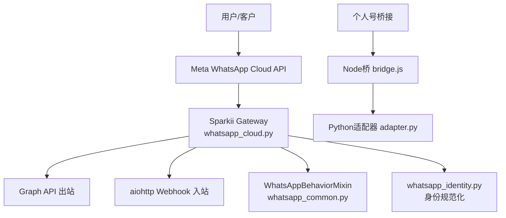
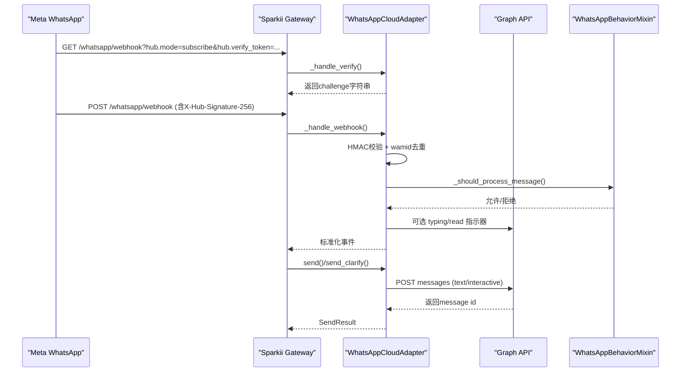
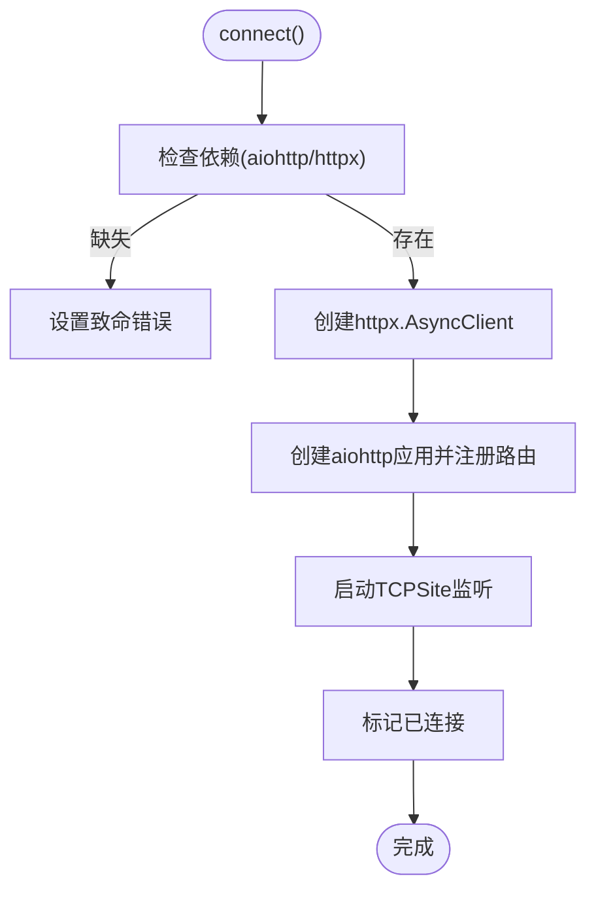
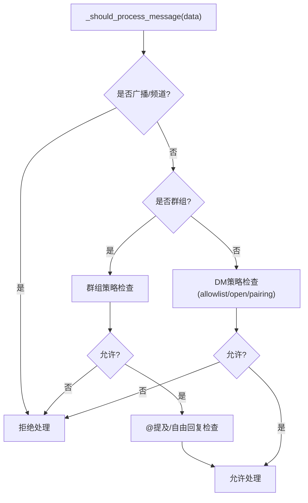
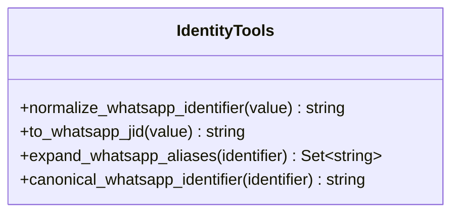
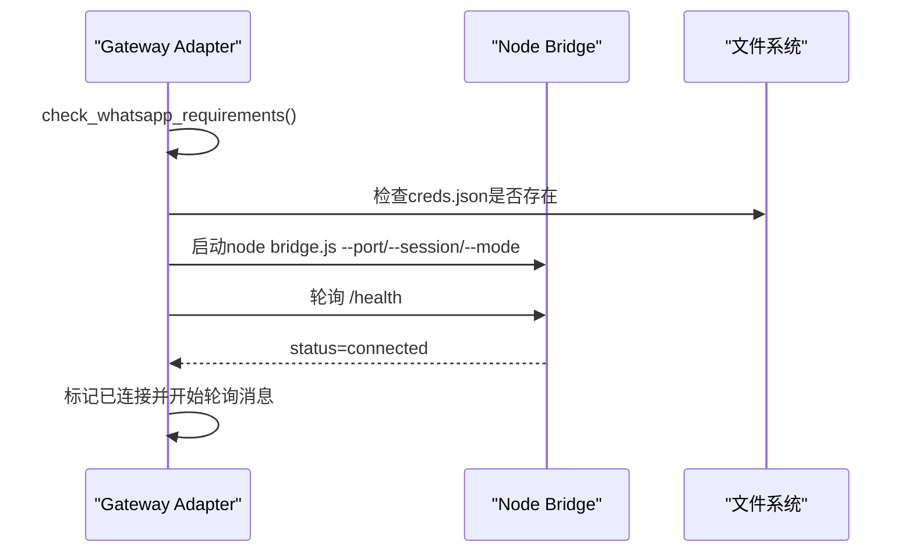
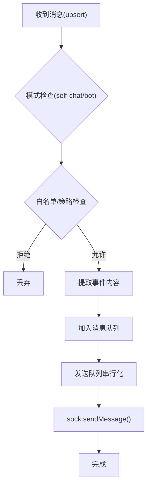
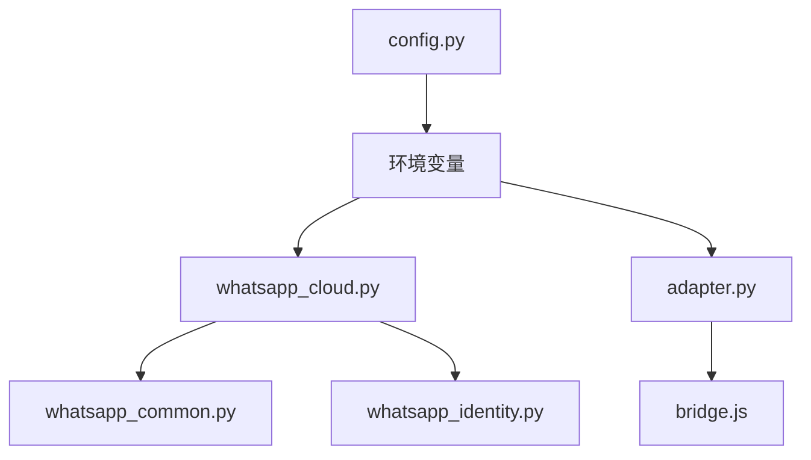

# WhatsApp集成问题

<cite>
**本文引用的文件**
- [whatsapp_cloud.py](file://gateway/platforms/whatsapp_cloud.py)
- [whatsapp_common.py](file://gateway/platforms/whatsapp_common.py)
- [whatsapp_identity.py](file://gateway/whatsapp_identity.py)
- [adapter.py](file://plugins/platforms/whatsapp/adapter.py)
- [bridge.js](file://scripts/whatsapp-bridge/bridge.js)
- [setup_whatsapp_cloud.py](file://sparkii_cli/setup_whatsapp_cloud.py)
- [config.py](file://gateway/config.py)
</cite>

## 目录
1. [简介](#简介)
2. [项目结构](#项目结构)
3. [核心组件](#核心组件)
4. [架构总览](#架构总览)
5. [详细组件分析](#详细组件分析)
6. [依赖关系分析](#依赖关系分析)
7. [性能考虑](#性能考虑)
8. [故障排除指南](#故障排除指南)
9. [结论](#结论)
10. [附录](#附录)

## 简介
本文件面向企业级WhatsApp平台集成的常见问题与解决方案，覆盖以下主题：
- WhatsApp Business API配置、Meta开发者账户设置与应用审核流程
- Webhook验证失败、回调URL配置与HTTPS证书问题
- 消息模板审批、业务账号绑定与电话号码验证
- 媒体文件处理、语音消息支持与位置信息分享
- 群聊管理、联系人同步与消息状态跟踪
- WhatsApp服务变更、API版本升级与合规性要求
- 企业级部署的数据隐私保护与消息加密策略

本仓库提供了两套WhatsApp接入路径：
- 官方WhatsApp Cloud API（Business API）：通过Graph API发送消息，使用Webhook接收消息，需要公网HTTPS回调地址与签名校验。
- 个人号桥接（Baileys/Node桥）：通过本地Node进程连接WhatsApp Web，适合个人号或开发调试场景。

## 项目结构
围绕WhatsApp集成的关键代码分布在以下模块：
- gateway/platforms/whatsapp_cloud.py：Cloud API适配器（出站Graph API、入站Webhook服务器、HMAC签名校验、wamid去重、交互消息等）
- gateway/platforms/whatsapp_common.py：跨传输的WhatsApp行为混入（DM/群组策略、@提及、Markdown转换、分块长度预算等）
- gateway/whatsapp_identity.py：WhatsApp标识规范化与LID映射（统一phone/LID身份）
- plugins/platforms/whatsapp/adapter.py：个人号桥接适配器（启动Node桥、健康检查、会话锁、端口清理、日志等）
- scripts/whatsapp-bridge/bridge.js：Node桥实现（消息队列、媒体下载、投票聚合、发送队列、安全Host头校验等）
- sparkii_cli/setup_whatsapp_cloud.py：交互式向导（字段校验、生成verify token、引导配置Meta回调）
- gateway/config.py：环境变量到平台配置的注入（App Secret、Verify Token等）

图表来源
- [whatsapp_cloud.py:203-495](file://gateway/platforms/whatsapp_cloud.py#L203-L495)
- [whatsapp_common.py:64-126](file://gateway/platforms/whatsapp_common.py#L64-L126)
- [whatsapp_identity.py:48-107](file://gateway/whatsapp_identity.py#L48-L107)
- [adapter.py:381-460](file://plugins/platforms/whatsapp/adapter.py#L381-L460)
- [bridge.js:22-49](file://scripts/whatsapp-bridge/bridge.js#L22-L49)

章节来源
- [whatsapp_cloud.py:1-120](file://gateway/platforms/whatsapp_cloud.py#L1-L120)
- [whatsapp_common.py:1-30](file://gateway/platforms/whatsapp_common.py#L1-L30)
- [whatsapp_identity.py:1-29](file://gateway/whatsapp_identity.py#L1-L29)
- [adapter.py:1-16](file://plugins/platforms/whatsapp/adapter.py#L1-L16)
- [bridge.js:1-20](file://scripts/whatsapp-bridge/bridge.js#L1-L20)
- [setup_whatsapp_cloud.py:1-33](file://sparkii_cli/setup_whatsapp_cloud.py#L1-L33)
- [config.py:1916-1939](file://gateway/config.py#L1916-L1939)

## 核心组件
- WhatsApp Cloud API适配器（whatsapp_cloud.py）
  - 出站：通过Graph API发送文本、交互消息、typing/read指示器
  - 入站：aiohttp Webhook服务器，支持hub.verify_token握手与X-Hub-Signature-256 HMAC校验
  - 去重：wamid重复缓存，避免重复投递
  - 媒体：按类型限制大小、MIME扩展映射、ffmpeg降级处理
- WhatsApp行为混入（whatsapp_common.py）
  - DM/群组策略（open/allowlist/disabled/pairing）
  - @提及检测、引用回复识别、广播/频道过滤
  - Markdown转WhatsApp语法、分块长度预算
- WhatsApp身份工具（whatsapp_identity.py）
  - phone/LID规范化、JID构建、别名展开、稳定标识选择
- 个人号桥接适配器（adapter.py）
  - Node桥生命周期管理、端口占用清理、健康检查、日志输出
  - 会话锁、自动安装依赖、stale bridge检测
- Node桥（bridge.js）
  - Baileys连接、消息队列、媒体下载、投票聚合、发送队列串行化
  - Host头校验防DNS重绑定、owner消息转发门控

章节来源
- [whatsapp_cloud.py:203-495](file://gateway/platforms/whatsapp_cloud.py#L203-L495)
- [whatsapp_common.py:64-126](file://gateway/platforms/whatsapp_common.py#L64-L126)
- [whatsapp_identity.py:48-107](file://gateway/whatsapp_identity.py#L48-L107)
- [adapter.py:381-460](file://plugins/platforms/whatsapp/adapter.py#L381-L460)
- [bridge.js:128-157](file://scripts/whatsapp-bridge/bridge.js#L128-L157)

## 架构总览
下图展示Cloud API与企业网关的端到端调用链，包括Webhook验证、签名校验、消息分发与出站发送。

图表来源
- [whatsapp_cloud.py:461-495](file://gateway/platforms/whatsapp_cloud.py#L461-L495)
- [whatsapp_cloud.py:513-589](file://gateway/platforms/whatsapp_cloud.py#L513-L589)
- [whatsapp_cloud.py:607-660](file://gateway/platforms/whatsapp_cloud.py#L607-L660)
- [whatsapp_cloud.py:678-735](file://gateway/platforms/whatsapp_cloud.py#L678-L735)
- [whatsapp_common.py:390-423](file://gateway/platforms/whatsapp_common.py#L390-L423)

## 详细组件分析

### WhatsApp Cloud API适配器（whatsapp_cloud.py）
- 职责
  - 初始化配置（phone_number_id、access_token、app_secret、verify_token、webhook host/port/path、api_version）
  - 启动aiohttp Webhook服务器，注册health与webhook路由
  - 出站消息：文本与交互消息（按钮/列表），typing/read指示器
  - 入站消息：HMAC签名校验、wamid去重、消息格式化与分发
  - 媒体限制与MIME扩展映射，ffmpeg降级
- 关键流程
  - connect()：创建HTTP客户端、启动Webhook服务器、标记已连接
  - send()：构造payload并POST至Graph API，记录rich_sent_store以便上下文引用
  - send_typing()：基于最近wamid发送read+typing指示器
  - _post_interactive()：封装交互消息发送，错误映射与message_id提取
- 错误处理
  - Graph API非200响应时解析结构化错误并记录
  - typing/read指示器对过期wamid进行友好降级

图表来源
- [whatsapp_cloud.py:435-495](file://gateway/platforms/whatsapp_cloud.py#L435-L495)

章节来源
- [whatsapp_cloud.py:203-495](file://gateway/platforms/whatsapp_cloud.py#L203-L495)
- [whatsapp_cloud.py:513-589](file://gateway/platforms/whatsapp_cloud.py#L513-L589)
- [whatsapp_cloud.py:607-660](file://gateway/platforms/whatsapp_cloud.py#L607-L660)
- [whatsapp_cloud.py:678-735](file://gateway/platforms/whatsapp_cloud.py#L678-L735)

### WhatsApp行为混入（whatsapp_common.py）
- 职责
  - DM/群组策略控制（open/allowlist/disabled/pairing）
  - @提及检测、引用回复识别、广播/频道过滤
  - Markdown转WhatsApp语法、分块长度预算
  - 白名单匹配（兼容phone/LID/JID形式）
- 关键点
  - enforces_own_access_policy=True，表示在入口处执行访问策略
  - _should_process_message()综合广播过滤、群组策略、@提及与自由回复规则
  - format_message()保护代码块与行内代码，转换标题为粗体、链接格式等

图表来源
- [whatsapp_common.py:190-214](file://gateway/platforms/whatsapp_common.py#L190-L214)
- [whatsapp_common.py:254-289](file://gateway/platforms/whatsapp_common.py#L254-L289)
- [whatsapp_common.py:390-423](file://gateway/platforms/whatsapp_common.py#L390-L423)

章节来源
- [whatsapp_common.py:64-126](file://gateway/platforms/whatsapp_common.py#L64-L126)
- [whatsapp_common.py:190-214](file://gateway/platforms/whatsapp_common.py#L190-L214)
- [whatsapp_common.py:254-289](file://gateway/platforms/whatsapp_common.py#L254-L289)
- [whatsapp_common.py:390-423](file://gateway/platforms/whatsapp_common.py#L390-L423)

### WhatsApp身份工具（whatsapp_identity.py）
- 职责
  - normalize_whatsapp_identifier()：剥离JID/LID/设备后缀，得到稳定数字标识
  - to_whatsapp_jid()：将裸手机号转换为桥安全的JID
  - expand_whatsapp_aliases()：读取lid-mapping-*.json，展开所有等价标识
  - canonical_whatsapp_identifier()：选择最短稳定标识作为会话键基础
- 价值
  - 确保授权、会话键、白名单匹配在不同形态（phone/LID）下保持一致

图表来源
- [whatsapp_identity.py:48-107](file://gateway/whatsapp_identity.py#L48-L107)
- [whatsapp_identity.py:121-207](file://gateway/whatsapp_identity.py#L121-L207)

章节来源
- [whatsapp_identity.py:48-107](file://gateway/whatsapp_identity.py#L48-L107)
- [whatsapp_identity.py:121-207](file://gateway/whatsapp_identity.py#L121-L207)

### 个人号桥接适配器（adapter.py）
- 职责
  - 启动Node桥进程，传递会话路径、端口、模式与环境变量
  - 健康检查与stale bridge检测（脚本哈希比对）
  - 端口占用清理、PID文件管理、进程树终止
  - 日志输出、依赖自动安装、会话锁防止重复会话
- 关键点
  - check_whatsapp_requirements()：验证Node.js可用
  - connect()：两阶段等待（HTTP就绪→WhatsApp connected）
  - 环境变量注入：WHATSAPP_*系列参数透传到桥进程

图表来源
- [adapter.py:358-379](file://plugins/platforms/whatsapp/adapter.py#L358-L379)
- [adapter.py:509-555](file://plugins/platforms/whatsapp/adapter.py#L509-L555)
- [adapter.py:617-668](file://plugins/platforms/whatsapp/adapter.py#L617-L668)

章节来源
- [adapter.py:381-460](file://plugins/platforms/whatsapp/adapter.py#L381-L460)
- [adapter.py:509-555](file://plugins/platforms/whatsapp/adapter.py#L509-L555)
- [adapter.py:617-668](file://plugins/platforms/whatsapp/adapter.py#L617-L668)

### Node桥（bridge.js）
- 职责
  - 建立Baileys连接，处理消息upsert/update事件
  - 消息队列与发送队列串行化，避免并发发送导致路由错乱
  - 媒体下载与缓存目录管理，投票聚合与诊断
  - Host头校验防御DNS重绑定，owner消息转发门控
- 关键点
  - sendWithTimeout()：超时保护，避免sendMessage挂起
  - splitLongMessage()：长消息分块
  - 健康检查：/health返回scriptHash与状态

图表来源
- [bridge.js:128-157](file://scripts/whatsapp-bridge/bridge.js#L128-L157)
- [bridge.js:167-188](file://scripts/whatsapp-bridge/bridge.js#L167-L188)
- [bridge.js:532-778](file://scripts/whatsapp-bridge/bridge.js#L532-L778)
- [bridge.js:781-800](file://scripts/whatsapp-bridge/bridge.js#L781-L800)

章节来源
- [bridge.js:22-49](file://scripts/whatsapp-bridge/bridge.js#L22-L49)
- [bridge.js:128-157](file://scripts/whatsapp-bridge/bridge.js#L128-L157)
- [bridge.js:532-778](file://scripts/whatsapp-bridge/bridge.js#L532-L778)

## 依赖关系分析
- 组件耦合
  - whatsapp_cloud.py依赖whatsapp_common.py的行为混入与whatsapp_identity.py的身份工具
  - adapter.py依赖bridge.js的HTTP接口与健康检查
  - setup_whatsapp_cloud.py提供交互式配置，写入环境变量供config.py注入
- 外部依赖
  - aiohttp用于Webhook服务器
  - httpx用于Graph API调用
  - Node.js与Baileys用于个人号桥接
  - ffmpeg用于语音消息opus转码（可选）

图表来源
- [whatsapp_cloud.py:73-82](file://gateway/platforms/whatsapp_cloud.py#L73-L82)
- [adapter.py:286-298](file://plugins/platforms/whatsapp/adapter.py#L286-L298)
- [config.py:1916-1939](file://gateway/config.py#L1916-L1939)

章节来源
- [whatsapp_cloud.py:73-82](file://gateway/platforms/whatsapp_cloud.py#L73-L82)
- [adapter.py:286-298](file://plugins/platforms/whatsapp/adapter.py#L286-L298)
- [config.py:1916-1939](file://gateway/config.py#L1916-L1939)

## 性能考虑
- 出站消息分块：根据MAX_MESSAGE_LENGTH与reply_prefix预留空间，避免超长消息
- Webhook负载限制：限制请求体大小，防止恶意大Payload
- 发送队列串行化：Node桥中串行化sendMessage，避免并发导致的消息错乱
- 超时保护：sendMessage设置超时，避免上游阻塞
- 内存控制：wamid去重与交互状态缓存采用FIFO上限，防止无限增长
- HTTP连接复用：tight keepalive减少CLOSE_WAIT堆积

[本节为通用性能建议，不直接分析具体文件]

## 故障排除指南

### Webhook验证失败
- 现象：GET /whatsapp/webhook?hub.mode=subscribe&hub.verify_token=...未返回challenge
- 排查步骤
  - 确认已设置WHATSAPP_CLOUD_VERIFY_TOKEN并通过setup向导保存
  - 确认Meta回调URL指向正确的path（默认/whatsapp/webhook）
  - 确认Tunnel/反向代理正确转发到localhost:8090
  - 使用curl测试本地可达性与verify token
- 参考
  - 向导生成verify token并打印验证命令
  - Webhook服务器注册GET路由并返回challenge

章节来源
- [setup_whatsapp_cloud.py:410-433](file://sparkii_cli/setup_whatsapp_cloud.py#L410-L433)
- [setup_whatsapp_cloud.py:487-496](file://sparkii_cli/setup_whatsapp_cloud.py#L487-L496)
- [whatsapp_cloud.py:461-495](file://gateway/platforms/whatsapp_cloud.py#L461-L495)

### 回调URL配置与HTTPS证书问题
- 现象：Meta无法验证回调URL或证书错误
- 排查步骤
  - 使用cloudflared/ngrok等隧道暴露HTTPS
  - 确保证书由受信任CA签发或使用自签证书配合企业信任链
  - 确认防火墙/安全组放行8090端口（本地）
  - 使用curl测试https://YOUR-TUNNEL.trycloudflare.com/health
- 参考
  - 向导提供cloudflared安装与启动指引
  - Webhook默认监听8090端口

章节来源
- [setup_whatsapp_cloud.py:468-496](file://sparkii_cli/setup_whatsapp_cloud.py#L468-L496)
- [whatsapp_cloud.py:95-98](file://gateway/platforms/whatsapp_cloud.py#L95-L98)

### 签名校验失败（X-Hub-Signature-256）
- 现象：POST webhook被拒绝（503）
- 原因：未设置WHATSAPP_CLOUD_APP_SECRET
- 解决：在Meta App Dashboard获取App Secret并保存到环境变量
- 参考
  - 向导提示App Secret作用与获取位置
  - 适配器在未设置secret时发出警告

章节来源
- [setup_whatsapp_cloud.py:339-368](file://sparkii_cli/setup_whatsapp_cloud.py#L339-L368)
- [whatsapp_cloud.py:484-494](file://gateway/platforms/whatsapp_cloud.py#L484-L494)

### 消息模板审批与业务账号绑定
- 说明：模板需经Meta审批后方可在对话窗口外发送；业务账号需在Business Manager中配置显示名称与头像
- 操作要点
  - 在Business Manager中完成企业认证与号码验证
  - 提交模板并在Dashboard中查看审批状态
  - 配置“From”与“To”号码列表
- 参考
  - 向导提供Business Manager页面链接与认证指引

章节来源
- [setup_whatsapp_cloud.py:515-537](file://sparkii_cli/setup_whatsapp_cloud.py#L515-L537)

### 媒体文件处理、语音消息与位置信息
- 媒体限制：按类型限制最大尺寸（image/video/audio/document/sticker）
- 语音消息：优先使用ffmpeg将opus转为MP3，若不可用则回退为音频附件
- 位置信息：Node桥支持发送位置pin（adapter与bridge协作）
- 参考
  - 媒体大小限制与MIME扩展映射
  - ffmpeg路径探测与降级逻辑
  - bridge.js中位置载荷构建

章节来源
- [whatsapp_cloud.py:108-150](file://gateway/platforms/whatsapp_cloud.py#L108-L150)
- [bridge.js:12-16](file://scripts/whatsapp-bridge/bridge.js#L12-L16)

### 群聊管理、联系人同步与消息状态跟踪
- 群聊策略：支持open/allowlist/disabled/pairing，可配置group_allow_from
- 联系人同步：通过lid-mapping-*.json维护phone/LID映射，确保会话键一致
- 消息状态：typing/read指示器基于最近wamid发送，支持蓝勾与输入指示
- 参考
  - 群组策略与白名单匹配
  - 身份工具中的LID映射与规范化工具
  - typing/read指示器实现

章节来源
- [whatsapp_common.py:279-289](file://gateway/platforms/whatsapp_common.py#L279-L289)
- [whatsapp_identity.py:121-207](file://gateway/whatsapp_identity.py#L121-L207)
- [whatsapp_cloud.py:607-660](file://gateway/platforms/whatsapp_cloud.py#L607-L660)

### WhatsApp服务变更、API版本升级与合规性
- API版本：默认v20.0，可通过api_version配置调整
- 服务变更：关注Meta公告，必要时升级版本号与适配新字段
- 合规性：遵循WhatsApp商业政策，避免滥用模板与频繁营销消息
- 参考
  - 默认API版本常量
  - 向导中关于认证与权限的说明

章节来源
- [whatsapp_cloud.py:88-98](file://gateway/platforms/whatsapp_cloud.py#L88-L98)
- [setup_whatsapp_cloud.py:309-323](file://sparkii_cli/setup_whatsapp_cloud.py#L309-L323)

### 企业级数据隐私与消息加密
- 数据传输：Graph API与Webhook均使用HTTPS，确保传输层加密
- 存储安全：敏感凭据（access_token、app_secret、verify_token）通过环境变量管理，避免明文硬编码
- 访问控制：DM/群组策略限制未授权访问，白名单精确控制
- 审计与日志：桥日志与健康检查便于排障，注意脱敏敏感信息
- 参考
  - 环境变量注入与向导保存机制
  - 策略混入中的访问控制逻辑

章节来源
- [config.py:1916-1939](file://gateway/config.py#L1916-L1939)
- [whatsapp_common.py:254-289](file://gateway/platforms/whatsapp_common.py#L254-L289)

## 结论
本仓库提供了生产级的WhatsApp Business API集成方案与个人号桥接能力。通过交互式向导、严格的字段校验、Webhook签名校验与身份规范化，企业可在合规前提下快速搭建稳定的WhatsApp通道。针对常见故障（Webhook验证、回调URL、签名校验、媒体处理、群聊策略等），本文提供了系统化的排查步骤与优化建议。建议在部署时启用HTTPS、最小权限原则与访问控制，并持续关注Meta服务变更与合规要求。

[本节为总结性内容，不直接分析具体文件]

## 附录
- 环境变量清单（示例）
  - WHATSAPP_CLOUD_PHONE_NUMBER_ID：Meta分配的Phone Number ID（15-17位数字）
  - WHATSAPP_CLOUD_ACCESS_TOKEN：Access Token（以EAA开头）
  - WHATSAPP_CLOUD_APP_SECRET：App Secret（32位十六进制）
  - WHATSAPP_CLOUD_VERIFY_TOKEN：Webhook验证令牌
  - WHATSAPP_CLOUD_WABA_ID：WhatsApp Business Account ID
  - WHATSAPP_CLOUD_API_VERSION：Graph API版本（默认v20.0）
  - WHATSAPP_CLOUD_WEBHOOK_HOST/PORT/PATH：Webhook监听配置
- 常用命令
  - 运行向导：sparkii whatsapp-cloud
  - 启动Tunnel：cloudflared tunnel --url http://localhost:8090
  - 验证Webhook：curl 'https://YOUR-TUNNEL.trycloudflare.com/whatsapp/webhook?hub.mode=subscribe&hub.verify_token=TOKEN&hub.challenge=hello'

[本节为补充信息，不直接分析具体文件]