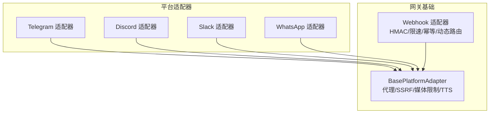
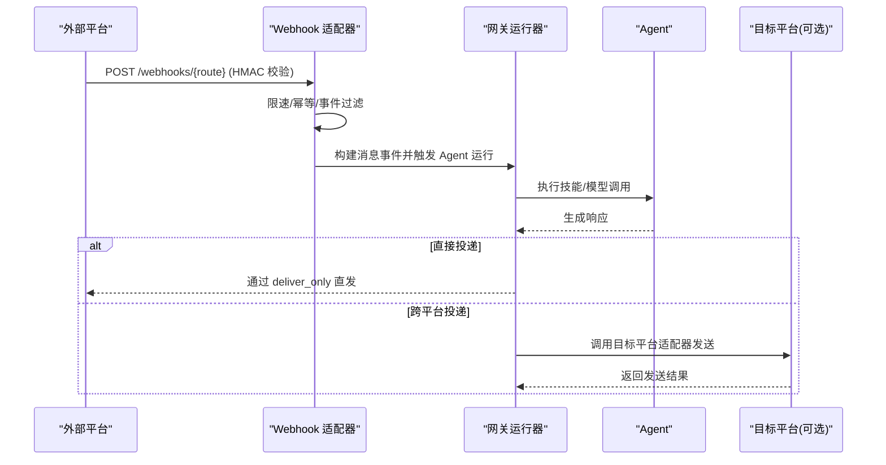
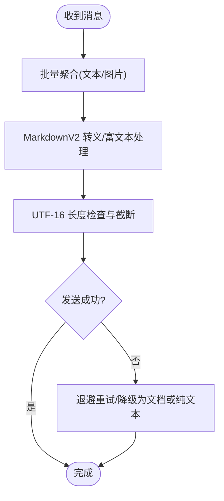
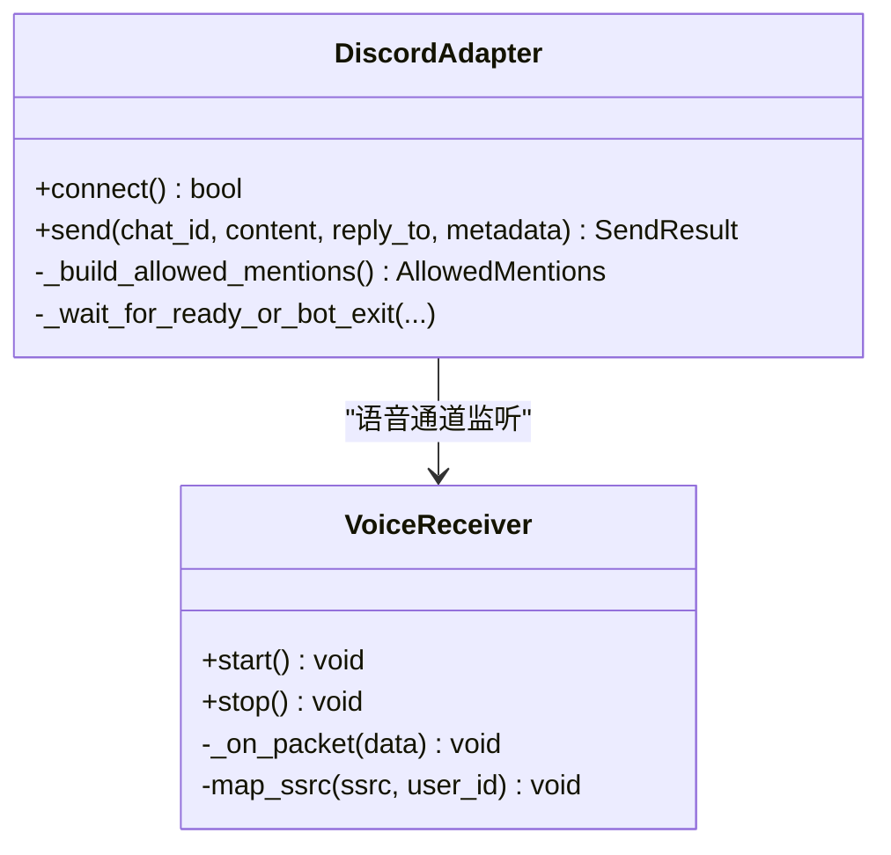
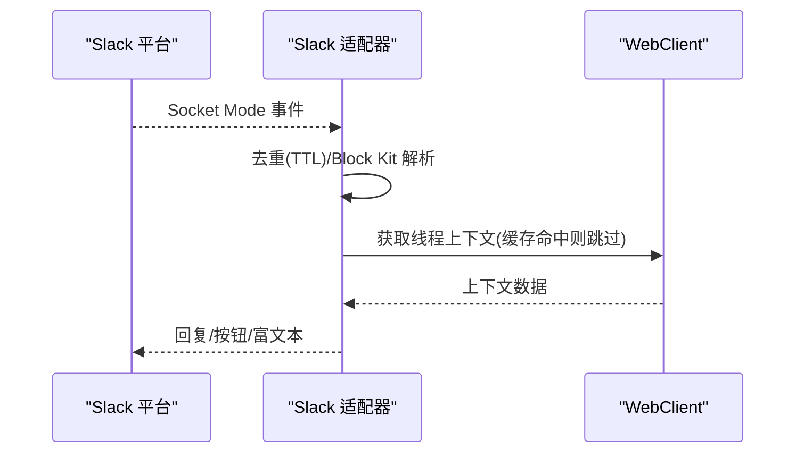
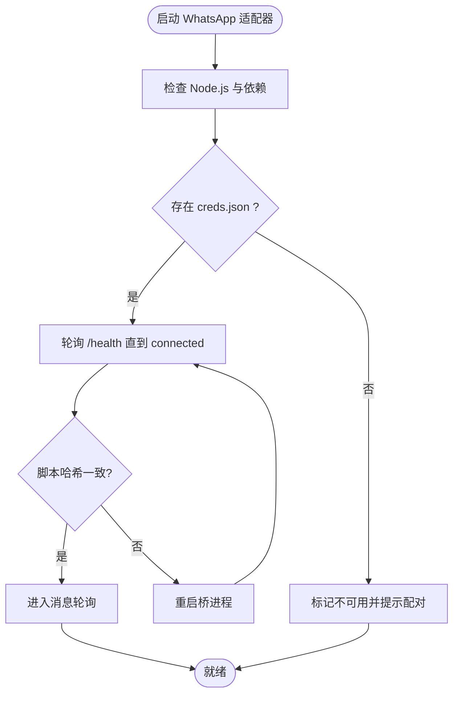
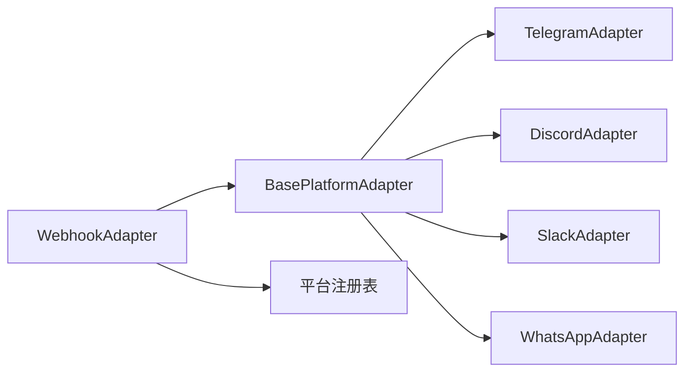

# 平台集成问题

<cite>
**本文引用的文件**
- [gateway/platforms/base.py](file://gateway/platforms/base.py)
- [gateway/platforms/webhook.py](file://gateway/platforms/webhook.py)
- [plugins/platforms/telegram/adapter.py](file://plugins/platforms/telegram/adapter.py)
- [plugins/platforms/discord/adapter.py](file://plugins/platforms/discord/adapter.py)
- [plugins/platforms/slack/adapter.py](file://plugins/platforms/slack/adapter.py)
- [plugins/platforms/whatsapp/adapter.py](file://plugins/platforms/whatsapp/adapter.py)
</cite>

## 目录
1. [简介](#简介)
2. [项目结构](#项目结构)
3. [核心组件](#核心组件)
4. [架构总览](#架构总览)
5. [详细组件分析](#详细组件分析)
6. [依赖关系分析](#依赖关系分析)
7. [性能与限流](#性能与限流)
8. [故障排除指南](#故障排除指南)
9. [结论](#结论)
10. [附录](#附录)

## 简介
本文件面向平台集成的常见问题与解决方案，覆盖 Telegram、Discord、Slack、WhatsApp 等消息平台的 OAuth 认证失败诊断与修复、API 限制与速率限制处理、Webhook 配置与事件处理排障、平台服务变更与 API 版本升级应对、多平台部署冲突与资源共享策略，以及监控与告警配置方法。内容基于代码库中的平台适配器与网关实现，提供可操作的步骤与最佳实践。

## 项目结构
- 平台适配层：各平台适配器位于 plugins/platforms/<platform>/adapter.py，负责与平台 SDK 交互、消息收发、媒体处理、线程/话题路由、错误降级与重试。
- 网关基础能力：gateway/platforms/base.py 提供跨平台通用能力（代理、SSRF 防护、入站媒体大小限制、TTS 输出路径、UTF-16 长度计算、消息截断等）。
- Webhook 接收器：gateway/platforms/webhook.py 提供通用 HTTP 端点、HMAC 签名校验、限速、幂等缓存、动态路由热加载与跨平台投递。
- WhatsApp 桥接：plugins/platforms/whatsapp/adapter.py 管理 Node.js 桥进程、会话生命周期、端口占用清理、脚本更新检测与日志记录。

图表来源
- [gateway/platforms/base.py:1-800](file://gateway/platforms/base.py#L1-L800)
- [gateway/platforms/webhook.py:177-344](file://gateway/platforms/webhook.py#L177-L344)
- [plugins/platforms/telegram/adapter.py:633-800](file://plugins/platforms/telegram/adapter.py#L633-L800)
- [plugins/platforms/discord/adapter.py:122-167](file://plugins/platforms/discord/adapter.py#L122-L167)
- [plugins/platforms/slack/adapter.py:25-60](file://plugins/platforms/slack/adapter.py#L25-L60)
- [plugins/platforms/whatsapp/adapter.py:381-412](file://plugins/platforms/whatsapp/adapter.py#L381-L412)

章节来源
- [gateway/platforms/base.py:1-800](file://gateway/platforms/base.py#L1-L800)
- [gateway/platforms/webhook.py:177-344](file://gateway/platforms/webhook.py#L177-L344)

## 核心组件
- BasePlatformAdapter：统一代理解析、NO_PROXY 匹配、SSRF 重定向防护、入站媒体大小上限、TTS 输出路径选择、UTF-16 长度与截断工具。
- WebhookAdapter：HTTP 服务器、HMAC V1/V2 签名校验、按路由限速、幂等去重、动态订阅热加载、跨平台投递。
- TelegramAdapter：长消息分块、MarkdownV2 转义与富文本、主题/话题路由、批量聚合、连接健康检查与恢复。
- DiscordAdapter：Slash 命令同步、允许提及控制、非对话消息追踪、语音通道接收与解码。
- SlackAdapter：Socket Mode、Block Kit 渲染与提取、线程上下文缓存、去重 TTL、代理与 UA 设置。
- WhatsAppAdapter：Node.js 桥进程管理、会话锁、端口占用清理、脚本更新检测、环境变量注入与日志。

章节来源
- [gateway/platforms/base.py:1-800](file://gateway/platforms/base.py#L1-L800)
- [gateway/platforms/webhook.py:177-344](file://gateway/platforms/webhook.py#L177-L344)
- [plugins/platforms/telegram/adapter.py:633-800](file://plugins/platforms/telegram/adapter.py#L633-L800)
- [plugins/platforms/discord/adapter.py:122-167](file://plugins/platforms/discord/adapter.py#L122-L167)
- [plugins/platforms/slack/adapter.py:25-60](file://plugins/platforms/slack/adapter.py#L25-L60)
- [plugins/platforms/whatsapp/adapter.py:381-412](file://plugins/platforms/whatsapp/adapter.py#L381-L412)

## 架构总览
下图展示从外部平台到网关再到 Agent 的端到端流程，包括 Webhook 与 Socket/Polling 两种接入方式。

图表来源
- [gateway/platforms/webhook.py:584-800](file://gateway/platforms/webhook.py#L584-L800)
- [gateway/platforms/webhook.py:353-402](file://gateway/platforms/webhook.py#L353-L402)

章节来源
- [gateway/platforms/webhook.py:584-800](file://gateway/platforms/webhook.py#L584-L800)
- [gateway/platforms/webhook.py:353-402](file://gateway/platforms/webhook.py#L353-L402)

## 详细组件分析

### Telegram 集成问题与解决
- 长消息与 MarkdownV2：使用 UTF-16 长度函数与截断逻辑避免超限；富文本路径支持表格/代码块保留。
- 主题与回复锚点：DM 话题优先回复触发消息，避免主题种子导致回复错位。
- 连接健康与恢复：为 PTB 初始化设置超时与放弃清理，防止连接池泄漏；心跳任务与恢复门控避免死锁。
- 速率与节流：文本/图片批量聚合降低编辑风暴；typing 动作冷却避免频繁请求。

图表来源
- [plugins/platforms/telegram/adapter.py:633-800](file://plugins/platforms/telegram/adapter.py#L633-L800)
- [gateway/platforms/base.py:202-252](file://gateway/platforms/base.py#L202-L252)

章节来源
- [plugins/platforms/telegram/adapter.py:633-800](file://plugins/platforms/telegram/adapter.py#L633-L800)
- [gateway/platforms/base.py:202-252](file://gateway/platforms/base.py#L202-L252)

### Discord 集成问题与解决
- Slash 命令同步：应用级命令上限保护，避免超量导致全部失效。
- 允许提及：默认拒绝 @everyone 与角色 ping，防止误广播。
- 非对话消息追踪：持久化状态文件标记状态提示，避免污染历史。
- 语音通道：RTP/Opus 解码、DAVE E2EE 解密、静音检测与用户映射。

图表来源
- [plugins/platforms/discord/adapter.py:122-167](file://plugins/platforms/discord/adapter.py#L122-L167)
- [plugins/platforms/discord/adapter.py:525-800](file://plugins/platforms/discord/adapter.py#L525-L800)

章节来源
- [plugins/platforms/discord/adapter.py:122-167](file://plugins/platforms/discord/adapter.py#L122-L167)
- [plugins/platforms/discord/adapter.py:525-800](file://plugins/platforms/discord/adapter.py#L525-L800)

### Slack 集成问题与解决
- Socket Mode 与去重：重连后事件重放窗口较长，需扩大去重 TTL。
- Block Kit 渲染：提取富文本、链接、引用与列表，保证 Agent 可见性。
- 线程上下文缓存：减少重复 API 调用，提升响应速度。
- 代理与 UA：为 Slack 专用主机跳过 NO_PROXY 白名单，设置识别 UA。

图表来源
- [plugins/platforms/slack/adapter.py:25-60](file://plugins/platforms/slack/adapter.py#L25-L60)
- [plugins/platforms/slack/adapter.py:266-284](file://plugins/platforms/slack/adapter.py#L266-L284)
- [plugins/platforms/slack/adapter.py:727-770](file://plugins/platforms/slack/adapter.py#L727-L770)

章节来源
- [plugins/platforms/slack/adapter.py:25-60](file://plugins/platforms/slack/adapter.py#L25-L60)
- [plugins/platforms/slack/adapter.py:266-284](file://plugins/platforms/slack/adapter.py#L266-L284)
- [plugins/platforms/slack/adapter.py:727-770](file://plugins/platforms/slack/adapter.py#L727-L770)

### WhatsApp 集成问题与解决
- 桥进程管理：启动前检查 Node.js 与 creds.json；自动安装依赖；健康检查与连接等待。
- 端口与 PID 清理：仅终止 LISTEN 状态的进程，避免误杀浏览器等客户端；PID 文件校验防复用。
- 脚本更新检测：对比运行桥与磁盘脚本哈希，不一致时重启以保证最新行为。
- 安全路径校验：入站媒体路径必须落在受信任缓存根下，防止任意文件读取。

图表来源
- [plugins/platforms/whatsapp/adapter.py:358-379](file://plugins/platforms/whatsapp/adapter.py#L358-L379)
- [plugins/platforms/whatsapp/adapter.py:509-800](file://plugins/platforms/whatsapp/adapter.py#L509-L800)
- [plugins/platforms/whatsapp/adapter.py:301-340](file://plugins/platforms/whatsapp/adapter.py#L301-L340)

章节来源
- [plugins/platforms/whatsapp/adapter.py:301-340](file://plugins/platforms/whatsapp/adapter.py#L301-L340)
- [plugins/platforms/whatsapp/adapter.py:358-379](file://plugins/platforms/whatsapp/adapter.py#L358-L379)
- [plugins/platforms/whatsapp/adapter.py:509-800](file://plugins/platforms/whatsapp/adapter.py#L509-L800)

## 依赖关系分析
- 平台适配器均继承 BasePlatformAdapter，复用代理、SSRF、媒体限制与 TTS 能力。
- Webhook 适配器作为通用入口，支持动态路由与跨平台投递，依赖平台注册表进行目标平台识别。
- WhatsApp 适配器依赖 Node.js 桥进程，需确保环境、端口与权限正确。

图表来源
- [gateway/platforms/base.py:1-800](file://gateway/platforms/base.py#L1-L800)
- [gateway/platforms/webhook.py:177-344](file://gateway/platforms/webhook.py#L177-L344)
- [plugins/platforms/telegram/adapter.py:633-800](file://plugins/platforms/telegram/adapter.py#L633-L800)
- [plugins/platforms/discord/adapter.py:122-167](file://plugins/platforms/discord/adapter.py#L122-L167)
- [plugins/platforms/slack/adapter.py:25-60](file://plugins/platforms/slack/adapter.py#L25-L60)
- [plugins/platforms/whatsapp/adapter.py:381-412](file://plugins/platforms/whatsapp/adapter.py#L381-L412)

章节来源
- [gateway/platforms/base.py:1-800](file://gateway/platforms/base.py#L1-L800)
- [gateway/platforms/webhook.py:177-344](file://gateway/platforms/webhook.py#L177-L344)

## 性能与限流
- 入站媒体大小限制：通过配置项限制内存缓冲，防止恶意大文件 OOM。
- Webhook 限速：固定时间窗口计数，超过阈值返回 429。
- 幂等缓存：基于 delivery ID 与 TTL 去重，避免重复执行。
- 平台侧节流：Telegram 文本/图片批量聚合；Discord 命令同步上限；Slack 去重 TTL 延长；WhatsApp 文本批量延迟。

章节来源
- [gateway/platforms/base.py:722-800](file://gateway/platforms/base.py#L722-L800)
- [gateway/platforms/webhook.py:436-461](file://gateway/platforms/webhook.py#L436-L461)
- [plugins/platforms/telegram/adapter.py:760-785](file://plugins/platforms/telegram/adapter.py#L760-L785)
- [plugins/platforms/discord/adapter.py:78-86](file://plugins/platforms/discord/adapter.py#L78-L86)
- [plugins/platforms/slack/adapter.py:748-770](file://plugins/platforms/slack/adapter.py#L748-L770)
- [plugins/platforms/whatsapp/adapter.py:472-488](file://plugins/platforms/whatsapp/adapter.py#L472-L488)

## 故障排除指南

### OAuth 认证失败的诊断与修复
- 令牌刷新：确认回调 URL 与授权范围配置一致；检查平台控制台是否启用必要权限；在网关中验证凭据作用域与有效期。
- 权限配置：核对平台应用权限（如读取消息、发送消息、频道成员等）；对 Slack 注意 Socket Mode 与 Bot Token 的作用域。
- 回调 URL 设置：确保公网可达且与平台配置一致；对 Webhook 场景使用 HMAC 校验并限制来源 IP。

建议步骤
- 在平台控制台重新生成 Token 并更新网关配置。
- 使用健康检查端点验证回调连通性。
- 开启调试日志，捕获授权失败的具体错误码与原因。

章节来源
- [gateway/platforms/webhook.py:248-285](file://gateway/platforms/webhook.py#L248-L285)
- [plugins/platforms/slack/adapter.py:25-60](file://plugins/platforms/slack/adapter.py#L25-L60)

### 平台 API 限制与速率限制
- 请求频率控制：启用 Webhook 路由限速；对平台侧高频操作（如编辑消息、打字动作）增加冷却与批量聚合。
- 批量处理优化：将短消息合并为一次处理；对图片/音频上传进行队列化与去重。
- 回退策略：当富文本发送失败时降级为普通文本或文档；对超长消息分块发送。

章节来源
- [gateway/platforms/webhook.py:436-461](file://gateway/platforms/webhook.py#L436-L461)
- [plugins/platforms/telegram/adapter.py:760-785](file://plugins/platforms/telegram/adapter.py#L760-L785)
- [plugins/platforms/slack/adapter.py:748-770](file://plugins/platforms/slack/adapter.py#L748-L770)

### Webhook 配置与事件处理排障
- HMAC 签名校验：确保路由 secret 已配置；生产环境禁止 INSECURE_NO_AUTH；本地测试可使用 loopback 绑定。
- 事件类型过滤：根据 X-GitHub-Event/X-GitLab-Event 或 payload.type 进行过滤；未匹配的事件将被忽略。
- 动态路由热加载：修改 webhook_subscriptions.json 后自动重载；静态路由优先级高于动态路由。

章节来源
- [gateway/platforms/webhook.py:248-285](file://gateway/platforms/webhook.py#L248-L285)
- [gateway/platforms/webhook.py:584-800](file://gateway/platforms/webhook.py#L584-L800)
- [gateway/platforms/webhook.py:474-532](file://gateway/platforms/webhook.py#L474-L532)

### 平台服务变更与 API 版本升级
- Telegram：关注 Bot API 版本变化，富文本与 MarkdownV2 兼容性；必要时关闭富文本以兼容旧客户端。
- Discord：slash 命令数量上限与字段限制；语音通道协议可能调整，需更新解码逻辑。
- Slack：Block Kit 结构变化；Socket Mode 重放事件窗口变化，需调整去重 TTL。
- WhatsApp：桥脚本更新后需重启以确保新行为；Node.js 依赖更新需重新安装。

章节来源
- [plugins/platforms/telegram/adapter.py:727-746](file://plugins/platforms/telegram/adapter.py#L727-L746)
- [plugins/platforms/discord/adapter.py:78-86](file://plugins/platforms/discord/adapter.py#L78-L86)
- [plugins/platforms/slack/adapter.py:748-770](file://plugins/platforms/slack/adapter.py#L748-L770)
- [plugins/platforms/whatsapp/adapter.py:629-660](file://plugins/platforms/whatsapp/adapter.py#L629-L660)

### 多平台部署冲突与资源共享
- 端口冲突：WhatsApp 桥进程需独占端口；启动前检测并清理 LISTEN 状态进程。
- 会话隔离：每个平台使用独立 session_path；WhatsApp 使用 PID 文件与启动时间校验避免误杀。
- 代理与 NO_PROXY：按平台域名配置绕过或强制代理；Slack 专用主机需特殊处理。

章节来源
- [plugins/platforms/whatsapp/adapter.py:65-139](file://plugins/platforms/whatsapp/adapter.py#L65-L139)
- [plugins/platforms/whatsapp/adapter.py:141-235](file://plugins/platforms/whatsapp/adapter.py#L141-L235)
- [plugins/platforms/slack/adapter.py:720-745](file://plugins/platforms/slack/adapter.py#L720-L745)
- [gateway/platforms/base.py:417-549](file://gateway/platforms/base.py#L417-L549)

### 监控与告警配置
- 健康检查：Webhook 提供 /health 端点；平台适配器在连接失败时记录致命错误并停止重试。
- 指标采集：记录限速命中、去重缓存大小、桥进程状态、媒体大小超限等关键指标。
- 告警规则：对连续失败、长时间无响应、桥进程异常退出、端口占用冲突等触发告警。

章节来源
- [gateway/platforms/webhook.py:290-344](file://gateway/platforms/webhook.py#L290-L344)
- [plugins/platforms/whatsapp/adapter.py:740-800](file://plugins/platforms/whatsapp/adapter.py#L740-L800)
- [gateway/platforms/base.py:682-696](file://gateway/platforms/base.py#L682-L696)

## 结论
通过统一的 BasePlatformAdapter 与各平台适配器协作，系统实现了跨平台消息收发的稳定与可扩展。结合 Webhook 的通用能力与严格的速率/幂等控制，可有效应对平台 API 限制与服务变更。针对 WhatsApp 的复杂桥接流程，提供了健壮的进程管理与安全校验。建议在部署中完善监控与告警，持续跟踪平台变更并及时适配。

## 附录
- 常见配置项参考：
  - Webhook：secret、rate_limit、max_body_bytes、routes、deliver_only
  - Telegram：rich_messages、disable_link_previews、text_batch_delay_seconds
  - Discord：allowed_mentions、command sync policy
  - Slack：dedup TTL、proxy 配置、UA 前缀
  - WhatsApp：bridge_script、bridge_port、session_path、dm_policy、group_policy

章节来源
- [gateway/platforms/webhook.py:186-242](file://gateway/platforms/webhook.py#L186-L242)
- [plugins/platforms/telegram/adapter.py:719-785](file://plugins/platforms/telegram/adapter.py#L719-L785)
- [plugins/platforms/discord/adapter.py:476-508](file://plugins/platforms/discord/adapter.py#L476-L508)
- [plugins/platforms/slack/adapter.py:727-770](file://plugins/platforms/slack/adapter.py#L727-L770)
- [plugins/platforms/whatsapp/adapter.py:414-458](file://plugins/platforms/whatsapp/adapter.py#L414-L458)