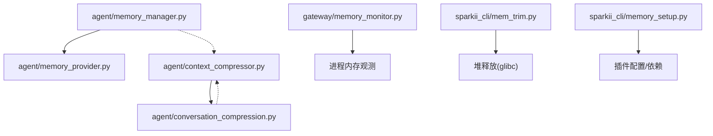
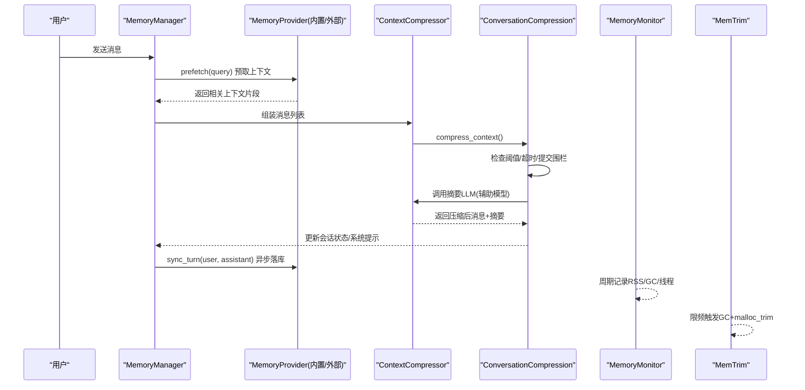
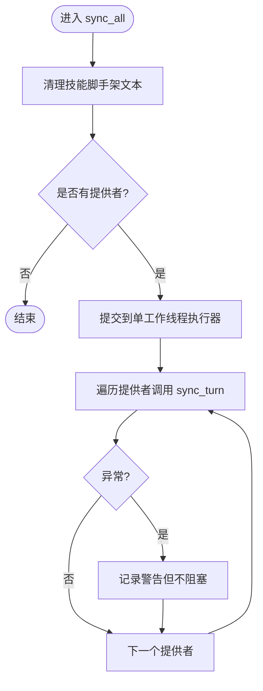
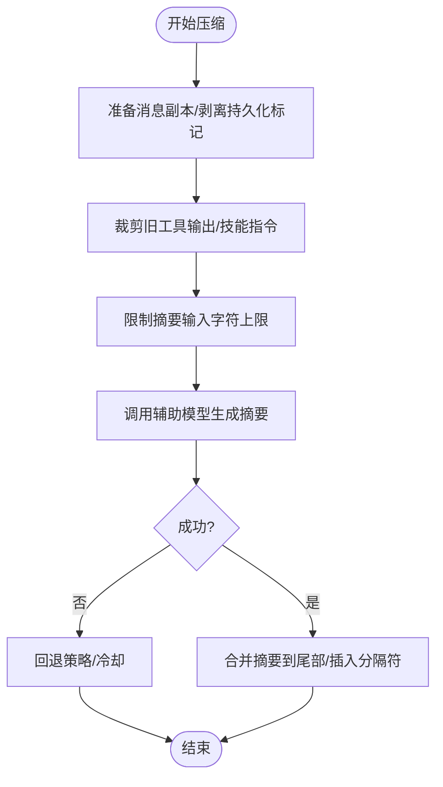
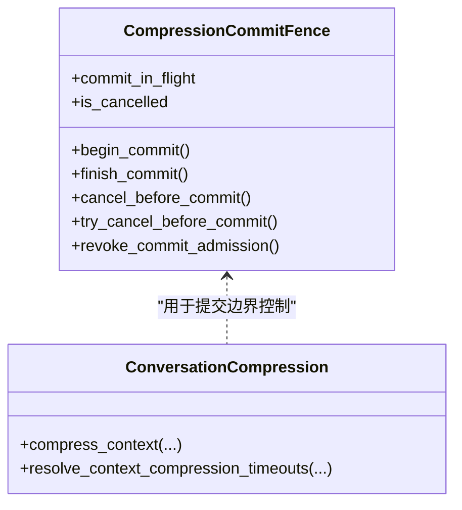
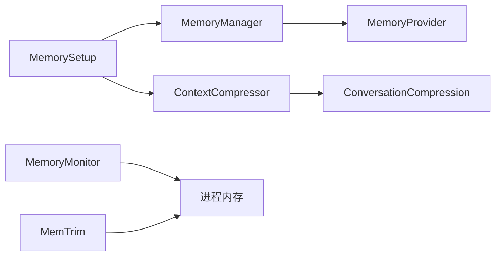

# 内存优化

<cite>
**本文引用的文件**
- [agent/memory_manager.py](file://agent/memory_manager.py)
- [agent/memory_provider.py](file://agent/memory_provider.py)
- [agent/context_compressor.py](file://agent/context_compressor.py)
- [agent/conversation_compression.py](file://agent/conversation_compression.py)
- [gateway/memory_monitor.py](file://gateway/memory_monitor.py)
- [sparkii_cli/mem_trim.py](file://sparkii_cli/mem_trim.py)
- [sparkii_cli/memory_setup.py](file://sparkii_cli/memory_setup.py)
</cite>

## 目录
1. [简介](#简介)
2. [项目结构](#项目结构)
3. [核心组件](#核心组件)
4. [架构总览](#架构总览)
5. [详细组件分析](#详细组件分析)
6. [依赖关系分析](#依赖关系分析)
7. [性能考量](#性能考量)
8. [故障排查指南](#故障排查指南)
9. [结论](#结论)
10. [附录](#附录)

## 简介
本指南面向生产环境下的内存优化，覆盖以下主题：
- 内存管理最佳实践：泄漏检测、垃圾回收优化、大对象处理策略
- 上下文压缩机制：对话历史压缩、工具结果缓存、会话状态优化
- 内存监控与分析：占用分析、热点识别、泄漏诊断
- AI模型加载/卸载策略：降低峰值内存
- 内存池化与对象重用模式
- 生产环境监控与自动扩缩容配置

本仓库在“上下文压缩”“内存提供者编排”“进程级内存监控”“堆释放”等方面提供了完善实现，可作为落地优化的基础。

## 项目结构
围绕内存优化的关键模块分布如下：
- agent/memory_manager.py：内存提供者（内置与外部）的统一编排，含预取、同步、后台任务调度与超时控制
- agent/memory_provider.py：内存提供者的抽象接口与生命周期钩子（如 on_pre_compress）
- agent/context_compressor.py：上下文窗口压缩的核心实现（摘要生成、工具输出裁剪、技能信息保留等）
- agent/conversation_compression.py：压缩流程编排、超时与提交围栏、执行器池与并发控制
- gateway/memory_monitor.py：周期性进程内存使用日志（RSS/GC/线程数），便于发现慢泄漏
- sparkii_cli/mem_trim.py：glibc malloc_trim 限频调用，配合 GC 释放空闲页
- sparkii_cli/memory_setup.py：内存插件安装与配置向导（影响运行时行为与资源占用）

图表来源
- [agent/memory_manager.py:364-758](file://agent/memory_manager.py#L364-L758)
- [agent/memory_provider.py:81-358](file://agent/memory_provider.py#L81-L358)
- [agent/context_compressor.py:1-180](file://agent/context_compressor.py#L1-L180)
- [agent/conversation_compression.py:445-774](file://agent/conversation_compression.py#L445-L774)
- [gateway/memory_monitor.py:83-231](file://gateway/memory_monitor.py#L83-L231)
- [sparkii_cli/mem_trim.py:169-256](file://sparkii_cli/mem_trim.py#L169-L256)
- [sparkii_cli/memory_setup.py:205-425](file://sparkii_cli/memory_setup.py#L205-L425)

章节来源
- [agent/memory_manager.py:364-758](file://agent/memory_manager.py#L364-L758)
- [agent/context_compressor.py:1-180](file://agent/context_compressor.py#L1-L180)
- [agent/conversation_compression.py:445-774](file://agent/conversation_compression.py#L445-L774)
- [gateway/memory_monitor.py:83-231](file://gateway/memory_monitor.py#L83-L231)
- [sparkii_cli/mem_trim.py:169-256](file://sparkii_cli/mem_trim.py#L169-L256)
- [sparkii_cli/memory_setup.py:205-425](file://sparkii_cli/memory_setup.py#L205-L425)

## 核心组件
- 内存管理器（MemoryManager）：统一注册/路由内存提供者，负责每轮对话的预取与落库，后台串行化写入，避免阻塞主循环；对外部提供者预取设置超时，防止卡死。
- 内存提供者（MemoryProvider）：定义可插拔持久记忆能力，支持系统提示块注入、预取、同步、工具暴露、压缩前钩子等。
- 上下文压缩器（ContextCompressor）：对长对话进行摘要压缩，保护头尾、裁剪工具输出、保留技能指令标记、限制摘要大小与输入长度，并处理失败冷却与回退。
- 对话压缩编排（conversation_compression）：封装压缩流程、超时/总时长上限、提交围栏（Commit Fence）、执行器池与并发限制，确保压缩过程可取消且不影响主会话。
- 内存监控（memory_monitor）：周期性记录 RSS、GC 计数、线程数，便于定位缓慢泄漏。
- 堆释放（mem_trim）：在 Linux/glibc 上调用 malloc_trim 归还空闲页，配合 GC 限频调用，减少长期运行进程的驻留内存。
- 内存插件配置（memory_setup）：交互式安装/配置外部内存插件，影响运行时行为与资源占用。

章节来源
- [agent/memory_manager.py:364-758](file://agent/memory_manager.py#L364-L758)
- [agent/memory_provider.py:81-358](file://agent/memory_provider.py#L81-L358)
- [agent/context_compressor.py:1-180](file://agent/context_compressor.py#L1-L180)
- [agent/conversation_compression.py:445-774](file://agent/conversation_compression.py#L445-L774)
- [gateway/memory_monitor.py:83-231](file://gateway/memory_monitor.py#L83-L231)
- [sparkii_cli/mem_trim.py:169-256](file://sparkii_cli/mem_trim.py#L169-L256)
- [sparkii_cli/memory_setup.py:205-425](file://sparkii_cli/memory_setup.py#L205-L425)

## 架构总览
下图展示了从用户消息到上下文压缩、再到内存提供者读写的全链路，以及进程级内存监控与堆释放的配合。

图表来源
- [agent/memory_manager.py:525-694](file://agent/memory_manager.py#L525-L694)
- [agent/context_compressor.py:1-180](file://agent/context_compressor.py#L1-L180)
- [agent/conversation_compression.py:445-774](file://agent/conversation_compression.py#L445-L774)
- [gateway/memory_monitor.py:83-231](file://gateway/memory_monitor.py#L83-L231)
- [sparkii_cli/mem_trim.py:169-256](file://sparkii_cli/mem_trim.py#L169-L256)

## 详细组件分析

### 内存管理器（MemoryManager）
- 职责
  - 注册内置与至多一个外部内存提供者，避免工具schema膨胀与冲突
  - 每轮对话前预取上下文（prefetch_all），失败不阻塞其他提供者
  - 每轮对话后异步同步（sync_all），通过单工作线程串行化写入，避免网络阻塞导致会话长时间“运行中”
  - 对外部提供者预取设置超时，避免卡死主循环
  - 提供 flush_pending 等待后台任务排空
- 内存要点
  - 后台任务使用守护线程/执行器，进程退出时不会阻塞
  - 外部预取使用独立线程并带超时，避免长时间占用CPU/IO
  - 工具schema归一化，避免无效或重复条目造成请求体膨胀

图表来源
- [agent/memory_manager.py:638-694](file://agent/memory_manager.py#L638-L694)

章节来源
- [agent/memory_manager.py:364-758](file://agent/memory_manager.py#L364-L758)

### 内存提供者（MemoryProvider）
- 职责
  - 定义统一的初始化、系统提示块、预取、同步、工具暴露、关闭等生命周期
  - 提供 on_pre_compress 钩子，可在上下文压缩前提取洞察，帮助压缩摘要保留关键信息
  - 支持 on_session_switch/on_session_end 等扩展点，适配会话切换与结束时的资源清理
- 内存要点
  - 预取应快速返回缓存结果，实际召回走后台队列，避免阻塞
  - 同步写入应非阻塞，必要时排队处理，避免网络延迟拖慢主循环
  - 通过 get_tool_schemas 暴露的工具需去重与命名规范，避免请求体过大

章节来源
- [agent/memory_provider.py:81-358](file://agent/memory_provider.py#L81-L358)

### 上下文压缩器（ContextCompressor）
- 职责
  - 对长对话进行摘要压缩，保护头部和尾部，裁剪中间内容
  - 工具输出裁剪与占位符替换，减少无用体积
  - 技能指令保留与“幽灵技能”防护，避免模型误以为技能仍加载
  - 限制摘要大小与输入字符上限，避免辅助模型上下文溢出
  - 失败冷却与回退策略，避免反复尝试导致抖动
- 内存要点
  - 严格限制摘要与输入大小，避免二次放大
  - 剥离持久化标记，避免复制污染新会话
  - 对 Codex/Responses 的推理项进行裁剪，仅保留当前回合必要数据

图表来源
- [agent/context_compressor.py:182-800](file://agent/context_compressor.py#L182-L800)

章节来源
- [agent/context_compressor.py:1-800](file://agent/context_compressor.py#L1-L800)

### 对话压缩编排（conversation_compression）
- 职责
  - 封装压缩流程：启动探测、状态上报、压缩调用、会话拆分、旋转 session_id、通知插件/提供者
  - 提供提交围栏（CompressionCommitFence），保证取消时机与提交边界安全
  - 维护压缩执行器池与并发上限，避免多个压缩任务堆积
  - 提供超时与总时长上限，保障主会话不被阻塞
- 内存要点
  - 执行器池为守护线程池，避免进程退出阻塞
  - 并发上限与快速失败，避免资源耗尽
  - 快照/恢复压缩尝试状态，保证取消后可回滚

图表来源
- [agent/conversation_compression.py:445-774](file://agent/conversation_compression.py#L445-L774)

章节来源
- [agent/conversation_compression.py:1-800](file://agent/conversation_compression.py#L1-L800)

### 进程内存监控（memory_monitor）
- 职责
  - 周期性记录 RSS、GC 计数、线程数，便于发现缓慢泄漏
  - 启动时记录基线，停止时记录最终值，便于前后对比
- 内存要点
  - 使用 resource.getrusage 优先，psutil 回退，跨平台兼容
  - 后台守护线程，不阻塞进程退出
  - 结构化日志行便于 grep 分析时间序列

章节来源
- [gateway/memory_monitor.py:83-231](file://gateway/memory_monitor.py#L83-L231)

### 堆释放（mem_trim）
- 职责
  - 在 Linux/glibc 上调用 malloc_trim 归还空闲页，结合 gc.collect 降低驻留内存
  - 限频调用与强制冷却，避免频繁触发影响性能
  - 收集内存快照（VmRSS/RssAnon）与耗时，便于观察效果
- 内存要点
  - 仅在 glibc 环境下生效，其他平台安全无操作
  - 强制模式也有最短间隔，避免批量子代理关闭时的抖动
  - 可配置开关与日志频率，便于生产灰度

章节来源
- [sparkii_cli/mem_trim.py:169-256](file://sparkii_cli/mem_trim.py#L169-L256)

### 内存插件配置（memory_setup）
- 职责
  - 交互式选择并安装内存插件，自动处理依赖与配置
  - 支持 provider.post_setup 自定义配置流程
  - 将密钥写入 .env，非密钥写入 config.yaml
- 内存要点
  - 按需安装依赖，避免不必要的包引入增加内存占用
  - 外部依赖检测与提示，减少运行时失败导致的重试开销

章节来源
- [sparkii_cli/memory_setup.py:205-425](file://sparkii_cli/memory_setup.py#L205-L425)

## 依赖关系分析
- MemoryManager 依赖 MemoryProvider 抽象，统一编排预取与同步
- ContextCompressor 与 conversation_compression 协作完成压缩流程与并发控制
- memory_monitor 与 mem_trim 提供进程级内存观测与释放手段
- memory_setup 影响运行时是否启用外部内存提供者及其资源占用

图表来源
- [agent/memory_manager.py:364-758](file://agent/memory_manager.py#L364-L758)
- [agent/memory_provider.py:81-358](file://agent/memory_provider.py#L81-L358)
- [agent/context_compressor.py:1-180](file://agent/context_compressor.py#L1-L180)
- [agent/conversation_compression.py:445-774](file://agent/conversation_compression.py#L445-L774)
- [gateway/memory_monitor.py:83-231](file://gateway/memory_monitor.py#L83-L231)
- [sparkii_cli/mem_trim.py:169-256](file://sparkii_cli/mem_trim.py#L169-L256)
- [sparkii_cli/memory_setup.py:205-425](file://sparkii_cli/memory_setup.py#L205-L425)

章节来源
- [agent/memory_manager.py:364-758](file://agent/memory_manager.py#L364-L758)
- [agent/context_compressor.py:1-180](file://agent/context_compressor.py#L1-L180)
- [agent/conversation_compression.py:445-774](file://agent/conversation_compression.py#L445-L774)
- [gateway/memory_monitor.py:83-231](file://gateway/memory_monitor.py#L83-L231)
- [sparkii_cli/mem_trim.py:169-256](file://sparkii_cli/mem_trim.py#L169-L256)
- [sparkii_cli/memory_setup.py:205-425](file://sparkii_cli/memory_setup.py#L205-L425)

## 性能考量
- 上下文压缩
  - 使用辅助模型进行摘要，限制输入字符上限与摘要token上限，避免二次放大
  - 工具输出裁剪与技能指令保留，减少无用体积同时保持可用性
  - 失败冷却与回退，避免反复尝试导致抖动
- 内存提供者
  - 预取与同步均异步化，避免阻塞主循环
  - 外部提供者预取超时，防止卡死
  - 工具schema归一化与去重，避免请求体膨胀
- 进程内存
  - 周期性RSS/GC/线程数监控，便于发现缓慢泄漏
  - 限频调用 malloc_trim 与 gc.collect，降低驻留内存
- 并发与超时
  - 压缩执行器池有并发上限，避免资源耗尽
  - 提交围栏保证取消时机安全，避免悬挂提交

[本节为通用指导，无需特定文件引用]

## 故障排查指南
- 内存缓慢泄漏
  - 使用 memory_monitor 的周期性日志，关注 RSS 随时间的增长趋势
  - 结合线程数与GC计数，判断是否存在线程泄漏或对象未释放
- 压缩失败或卡顿
  - 检查 conversation_compression 的超时与总时长上限，确认执行器池是否饱和
  - 查看 context_compressor 的失败冷却与回退逻辑，确认是否频繁失败
- 外部提供者阻塞
  - 检查 MemoryManager 的外部预取超时设置，确认是否被跳过
  - 查看 sync_all 的后台任务是否因网络/IO阻塞，必要时调整超时或降级
- 堆释放无效
  - 确认平台是否为 Linux/glibc，否则 malloc_trim 不可用
  - 检查限频与冷却设置，避免过于频繁或过于保守

章节来源
- [gateway/memory_monitor.py:83-231](file://gateway/memory_monitor.py#L83-L231)
- [agent/conversation_compression.py:445-774](file://agent/conversation_compression.py#L445-L774)
- [agent/context_compressor.py:1-180](file://agent/context_compressor.py#L1-L180)
- [agent/memory_manager.py:525-694](file://agent/memory_manager.py#L525-L694)
- [sparkii_cli/mem_trim.py:169-256](file://sparkii_cli/mem_trim.py#L169-L256)

## 结论
该代码库在上下文压缩、内存提供者编排、进程内存监控与堆释放方面提供了完善的实现。生产环境中建议：
- 启用上下文压缩并合理配置阈值与超时，保护头尾、裁剪工具输出、保留技能指令
- 使用内存监控与堆释放工具，定期评估RSS与GC行为，及时发现问题
- 对内存提供者进行异步化与超时控制，避免阻塞主循环
- 结合插件配置，按需启用外部提供者，减少不必要的依赖与内存占用

[本节为总结性内容，无需特定文件引用]

## 附录

### 内存管理最佳实践清单
- 使用上下文压缩控制对话长度，避免超出模型上下文限制
- 对工具输出进行裁剪，减少无用体积
- 外部提供者预取与同步异步化，设置超时与失败回退
- 启用进程级内存监控，定期分析RSS/GC/线程数
- 在合适时机调用 GC 与 malloc_trim，降低驻留内存
- 避免重复或无效的工具schema，减少请求体大小

[本节为通用指导，无需特定文件引用]

### 上下文压缩配置要点
- 设置合适的压缩阈值与超时，避免频繁压缩或压缩失败
- 限制摘要大小与输入字符上限，避免辅助模型上下文溢出
- 启用失败冷却与回退，避免抖动
- 在压缩前钩子中提取关键洞察，提升摘要质量

章节来源
- [agent/context_compressor.py:1-180](file://agent/context_compressor.py#L1-L180)
- [agent/conversation_compression.py:445-774](file://agent/conversation_compression.py#L445-L774)

### 内存监控与自动扩缩容建议
- 基于 memory_monitor 的RSS趋势，设定告警阈值
- 结合进程线程数与GC计数，判断是否需要扩容或重启
- 在生产环境开启 mem_trim，配合限频策略降低驻留内存
- 根据负载动态调整压缩阈值与超时，平衡响应时间与内存占用

章节来源
- [gateway/memory_monitor.py:83-231](file://gateway/memory_monitor.py#L83-L231)
- [sparkii_cli/mem_trim.py:169-256](file://sparkii_cli/mem_trim.py#L169-L256)