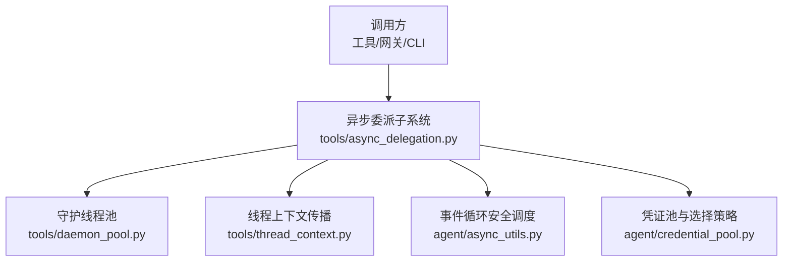
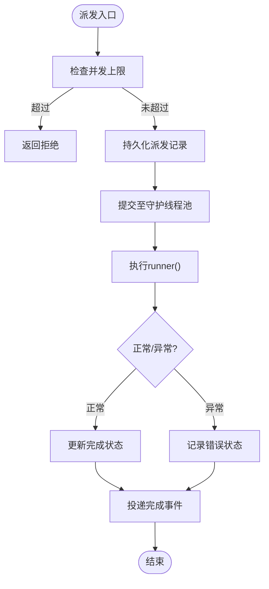
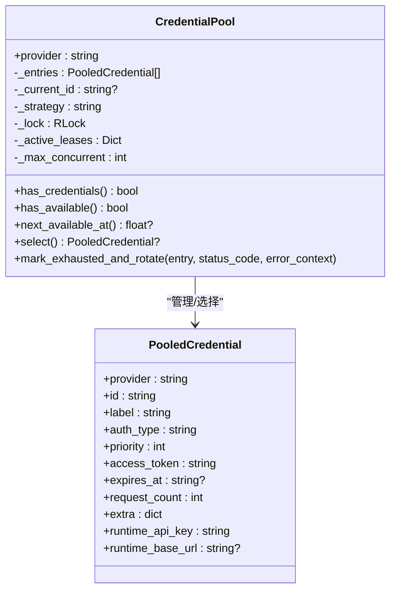
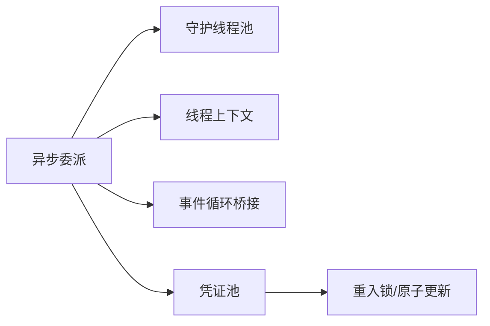

# 并发处理优化

<cite>
**本文引用的文件**
- [agent/async_utils.py](file://agent/async_utils.py)
- [tools/async_delegation.py](file://tools/async_delegation.py)
- [tools/thread_context.py](file://tools/thread_context.py)
- [tools/daemon_pool.py](file://tools/daemon_pool.py)
- [agent/credential_pool.py](file://agent/credential_pool.py)
</cite>

## 目录
1. [简介](#简介)
2. [项目结构](#项目结构)
3. [核心组件](#核心组件)
4. [架构总览](#架构总览)
5. [详细组件分析](#详细组件分析)
6. [依赖关系分析](#依赖关系分析)
7. [性能考量](#性能考量)
8. [故障排查指南](#故障排查指南)
9. [结论](#结论)
10. [附录](#附录)

## 简介
本指南聚焦于该代码库中的并发处理与优化实践，覆盖异步编程、事件循环安全调度、任务调度策略（工作线程池、优先级、资源竞争）、并发安全设计模式（锁、无共享数据、原子操作）、CPU与I/O密集型任务的并行度优化、死锁检测与预防，以及并发性能监控与瓶颈识别方法。内容基于仓库中实际实现进行提炼与归纳，帮助读者在现有架构上高效扩展并发能力并避免常见陷阱。

## 项目结构
围绕并发与异步的关键模块分布在以下位置：
- 异步工具与事件循环桥接：agent/async_utils.py
- 后台异步委派与持久化：tools/async_delegation.py
- 线程上下文传播：tools/thread_context.py
- 守护型线程池：tools/daemon_pool.py
- 多凭证池与选择策略：agent/credential_pool.py



图表来源
- [tools/async_delegation.py:61-116](file://tools/async_delegation.py#L61-L116)
- [tools/daemon_pool.py:1-25](file://tools/daemon_pool.py#L1-L25)
- [tools/thread_context.py:1-32](file://tools/thread_context.py#L1-L32)
- [agent/async_utils.py:1-22](file://agent/async_utils.py#L1-L22)
- [agent/credential_pool.py:633-661](file://agent/credential_pool.py#L633-L661)

章节来源
- [tools/async_delegation.py:61-116](file://tools/async_delegation.py#L61-L116)
- [tools/daemon_pool.py:1-25](file://tools/daemon_pool.py#L1-L25)
- [tools/thread_context.py:1-32](file://tools/thread_context.py#L1-L32)
- [agent/async_utils.py:1-22](file://agent/async_utils.py#L1-L22)
- [agent/credential_pool.py:633-661](file://agent/credential_pool.py#L633-L661)

## 核心组件
- 异步委派与持久化：提供后台子任务派发、完成事件投递、失败恢复与重试上限控制，并通过数据库持久化保证进程重启后的可恢复性。
- 守护线程池：以守护线程方式运行任务，避免阻塞解释器退出；适用于“尽力而为”或可独立中断的任务。
- 线程上下文传播：将父线程的上下文变量与审批回调安全复制到工作线程，确保工具执行时的权限与安全策略一致。
- 事件循环安全调度：从同步线程向事件循环提交协程时，捕获异常并关闭未等待的协程，防止警告与资源泄漏。
- 凭证池与选择策略：维护多凭证条目，支持多种选择策略、冷却期、永久失效标记与日志节流，保障高可用与可观测性。

章节来源
- [tools/async_delegation.py:61-116](file://tools/async_delegation.py#L61-L116)
- [tools/daemon_pool.py:1-25](file://tools/daemon_pool.py#L1-L25)
- [tools/thread_context.py:1-32](file://tools/thread_context.py#L1-L32)
- [agent/async_utils.py:1-22](file://agent/async_utils.py#L1-L22)
- [agent/credential_pool.py:633-661](file://agent/credential_pool.py#L633-L661)

## 架构总览
下图展示了从调用方到后台执行的完整并发链路，包括上下文传播、线程池执行、事件循环桥接与凭证选择。

```mermaid
sequenceDiagram
participant Caller as "调用方"
participant Delegate as "异步委派<br/>tools/async_delegation.py"
participant Pool as "守护线程池<br/>tools/daemon_pool.py"
participant ThreadCtx as "线程上下文<br/>tools/thread_context.py"
participant Loop as "事件循环桥接<br/>agent/async_utils.py"
participant Cred as "凭证池<br/>agent/credential_pool.py"
Caller->>Delegate : 派发后台任务
Delegate->>Pool : 提交任务守护线程
Pool-->>ThreadCtx : 复制上下文与回调
ThreadCtx->>Cred : 选择凭证/策略
Cred-->>ThreadCtx : 返回可用凭证
ThreadCtx->>Loop : 必要时调度协程
Loop-->>Caller : 返回句柄/结果
Note over Delegate,Caller : 完成事件持久化并投递
```

图表来源
- [tools/async_delegation.py:677-800](file://tools/async_delegation.py#L677-L800)
- [tools/daemon_pool.py:37-65](file://tools/daemon_pool.py#L37-L65)
- [tools/thread_context.py:64-121](file://tools/thread_context.py#L64-L121)
- [agent/async_utils.py:34-68](file://agent/async_utils.py#L34-L68)
- [agent/credential_pool.py:633-714](file://agent/credential_pool.py#L633-L714)

## 详细组件分析

### 异步委派与持久化（后台任务调度）
- 任务派发与容量限制：通过记录当前运行数与配置上限，拒绝超并发请求，避免无限堆积。
- 持久化与恢复：派发、完成与投递状态均落库；进程重启后恢复未完成投递的事件，支持认领与释放机制，设置最大尝试次数收敛为终态。
- 停滞检测：基于进度令牌与是否在工具内判断是否停滞，给予宽限窗口优雅终止，否则强制收尾。
- 完成事件投递：复用全局完成队列，保证消息角色交替与提示缓存不变量。



图表来源
- [tools/async_delegation.py:677-800](file://tools/async_delegation.py#L677-L800)
- [tools/async_delegation.py:200-283](file://tools/async_delegation.py#L200-L283)
- [tools/async_delegation.py:344-495](file://tools/async_delegation.py#L344-L495)

章节来源
- [tools/async_delegation.py:61-116](file://tools/async_delegation.py#L61-L116)
- [tools/async_delegation.py:677-800](file://tools/async_delegation.py#L677-L800)
- [tools/async_delegation.py:200-283](file://tools/async_delegation.py#L200-L283)
- [tools/async_delegation.py:344-495](file://tools/async_delegation.py#L344-L495)

### 守护线程池（不阻塞进程退出的工作线程）
- 守护线程：避免标准线程池在解释器退出时因join而长时间阻塞。
- 适用场景：后台工具执行、内存同步、目录扫描、子代理超时包装等“尽力而为”任务。
- 注意事项：必须用于可中断或可丢弃的工作；需要确保退出的持久写应使用前台线程并显式有界等待。

章节来源
- [tools/daemon_pool.py:1-25](file://tools/daemon_pool.py#L1-L25)
- [tools/daemon_pool.py:37-65](file://tools/daemon_pool.py#L37-L65)

### 线程上下文传播（跨线程安全）
- 作用：将父线程的上下文变量与审批/sudo回调复制到工作线程，确保工具执行的安全策略一致。
- 生命周期：进入时安装，退出时清理，避免回收线程持有过期引用。
- 失败回退：安装失败时保持“失败即拒绝”的安全路径。

章节来源
- [tools/thread_context.py:1-32](file://tools/thread_context.py#L1-L32)
- [tools/thread_context.py:64-121](file://tools/thread_context.py#L64-L121)

### 事件循环安全调度（从线程到事件循环）
- 问题背景：从工作线程向事件循环提交协程可能因循环关闭抛出异常，导致协程未被await与close，引发警告与帧泄漏。
- 解决方案：封装提交逻辑，捕获异常并关闭协程，返回None以便调用方分支处理；对已接受的任务交由事件循环管理生命周期。
- 附加能力：消费已分离任务的结果而不暴露取消信息，避免事件循环噪音。

章节来源
- [agent/async_utils.py:1-22](file://agent/async_utils.py#L1-L22)
- [agent/async_utils.py:34-68](file://agent/async_utils.py#L34-L68)
- [agent/async_utils.py:71-85](file://agent/async_utils.py#L71-L85)

### 凭证池与选择策略（并发安全与可用性）
- 数据结构：条目包含提供者、标识、优先级、访问令牌、过期时间、请求计数、额外字段等。
- 选择策略：填充优先、轮询、随机、最少使用；支持按提供者配置策略。
- 冷却与失效：根据HTTP状态码与分类原因计算冷却时长；支持“唯一凭证”短冷却；标记永久失效条目不参与轮换。
- 并发安全：使用重入锁保护选择、替换与持久化；延迟刷新路径在锁外执行网络I/O但序列化修改。
- 日志节流：避免空池/耗尽状态下高频日志风暴影响事件循环。



图表来源
- [agent/credential_pool.py:185-290](file://agent/credential_pool.py#L185-L290)
- [agent/credential_pool.py:633-714](file://agent/credential_pool.py#L633-L714)
- [agent/credential_pool.py:747-769](file://agent/credential_pool.py#L747-L769)

章节来源
- [agent/credential_pool.py:66-152](file://agent/credential_pool.py#L66-L152)
- [agent/credential_pool.py:185-290](file://agent/credential_pool.py#L185-L290)
- [agent/credential_pool.py:633-714](file://agent/credential_pool.py#L633-L714)
- [agent/credential_pool.py:747-769](file://agent/credential_pool.py#L747-L769)

## 依赖关系分析
- 异步委派依赖守护线程池执行后台任务，依赖线程上下文传播确保工具执行环境一致，依赖事件循环桥接安全调度协程，依赖凭证池获取可用凭据。
- 凭证池内部使用重入锁保护并发读写，延迟刷新路径规避长耗时I/O阻塞选择路径。
- 守护线程池避免标准线程池的退出阻塞问题，提升整体进程退出稳定性。



图表来源
- [tools/async_delegation.py:61-116](file://tools/async_delegation.py#L61-L116)
- [tools/daemon_pool.py:37-65](file://tools/daemon_pool.py#L37-L65)
- [tools/thread_context.py:64-121](file://tools/thread_context.py#L64-L121)
- [agent/async_utils.py:34-68](file://agent/async_utils.py#L34-L68)
- [agent/credential_pool.py:633-714](file://agent/credential_pool.py#L633-L714)

章节来源
- [tools/async_delegation.py:61-116](file://tools/async_delegation.py#L61-L116)
- [tools/daemon_pool.py:37-65](file://tools/daemon_pool.py#L37-L65)
- [tools/thread_context.py:64-121](file://tools/thread_context.py#L64-L121)
- [agent/async_utils.py:34-68](file://agent/async_utils.py#L34-L68)
- [agent/credential_pool.py:633-714](file://agent/credential_pool.py#L633-L714)

## 性能考量
- CPU密集型任务：尽量拆分批次、限制并发度，结合守护线程池执行，避免阻塞事件循环；必要时结合进程级隔离。
- I/O密集型任务：利用事件循环与协程并发；通过事件循环桥接安全提交；合理设置超时与重试。
- 任务优先级：凭证池支持优先级排序；异步委派可通过批量展开与实际任务计数观察真实并发。
- 资源竞争：使用重入锁与原子更新；对持久化写入采用事务与锁保护；对日志输出进行节流。
- 事件循环健康：避免在热路径中进行阻塞I/O；对可能的循环关闭进行防护；及时消费任务结果以避免噪音。

[本节为通用指导，无需特定文件来源]

## 故障排查指南
- 协程未等待警告：检查是否通过安全调度函数提交协程；若提交失败，确认已关闭协程并记录日志。
- 进程退出卡住：确认后台任务使用守护线程池；避免在守护线程中进行必须完成的持久写。
- 凭证不可用：查看凭证池的冷却时间与失效标记；检查是否有唯一凭证且处于短冷却；关注日志节流窗口。
- 完成事件未投递：检查持久化表状态与认领/释放流程；确认最大尝试次数未耗尽；核对恢复与投递路径。
- 停滞任务：启用进度探针；检查停滞阈值与宽限窗口；必要时触发中断与强制收尾。

章节来源
- [agent/async_utils.py:34-68](file://agent/async_utils.py#L34-L68)
- [tools/daemon_pool.py:1-25](file://tools/daemon_pool.py#L1-L25)
- [agent/credential_pool.py:633-714](file://agent/credential_pool.py#L633-L714)
- [tools/async_delegation.py:344-495](file://tools/async_delegation.py#L344-L495)
- [tools/async_delegation.py:61-116](file://tools/async_delegation.py#L61-L116)

## 结论
该代码库在并发与异步方面提供了完善的工程化方案：通过守护线程池避免退出阻塞、通过线程上下文传播保证安全一致性、通过事件循环桥接确保协程生命周期安全、通过异步委派与持久化实现可靠后台任务、通过凭证池提供高可用的认证选择策略。遵循上述最佳实践可有效提升系统吞吐、稳定性与可观测性，同时降低死锁与资源泄漏风险。

[本节为总结性内容，无需特定文件来源]

## 附录
- 并发安全设计模式建议
  - 锁机制：使用重入锁保护共享状态；细粒度锁定减少竞争面。
  - 无共享数据结构：尽量传递不可变数据；在边界处做拷贝与校验。
  - 原子操作：对持久化与状态变更使用原子更新与事务。
- 死锁检测与预防
  - 固定加锁顺序；避免嵌套锁；缩短持锁时间。
  - 引入超时与告警；对关键路径进行压测与回归测试。
- 并发性能监控与瓶颈识别
  - 监控活跃任务数、完成速率、错误率与冷却时间。
  - 关注事件循环阻塞点与日志风暴；对热点路径采样。
  - 结合持久化指标（如认领/释放次数、尝试次数）定位投递瓶颈。

[本节为通用指导，无需特定文件来源]