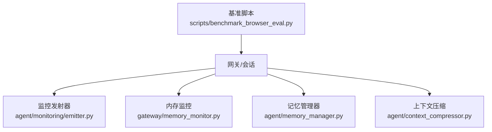
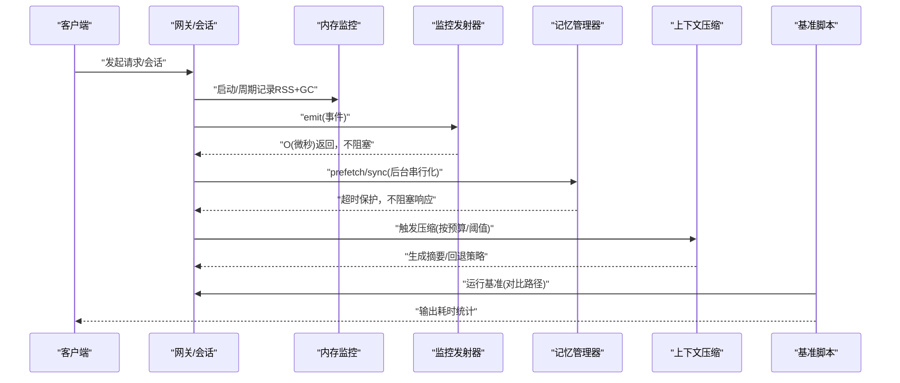
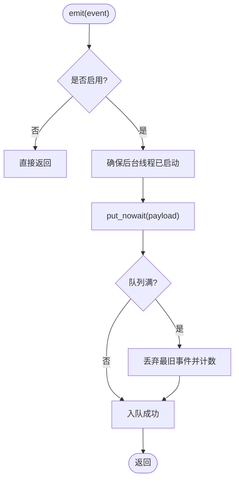
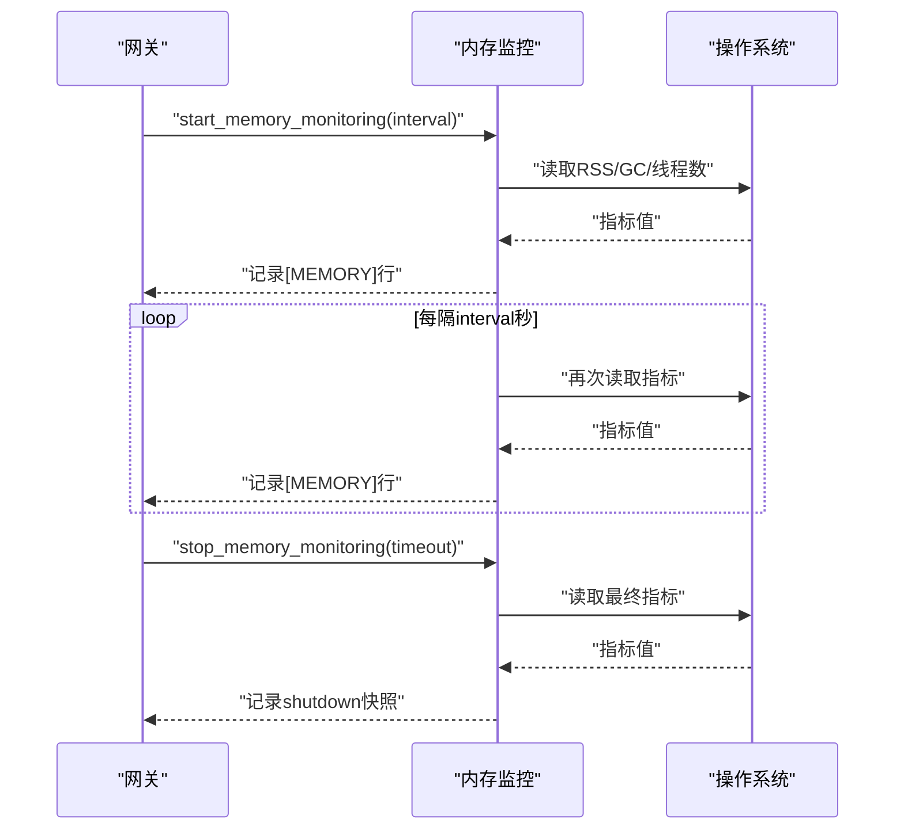
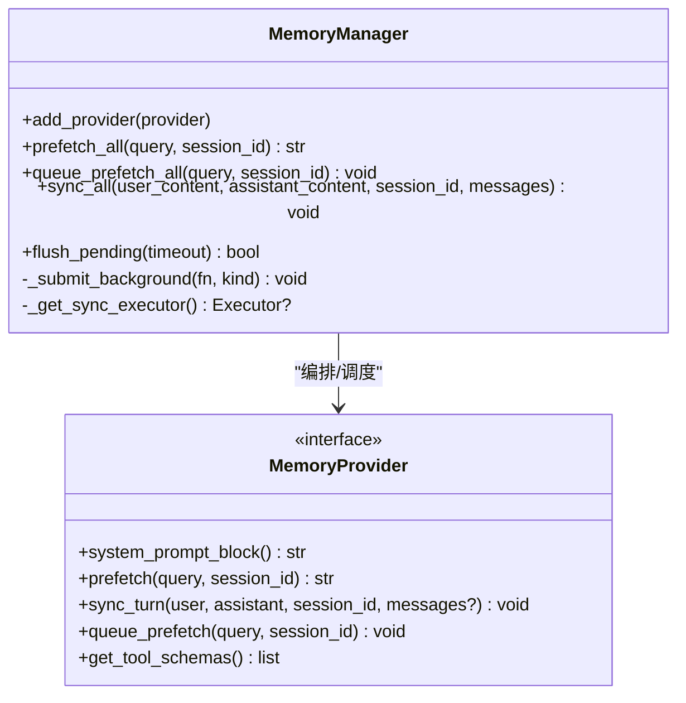
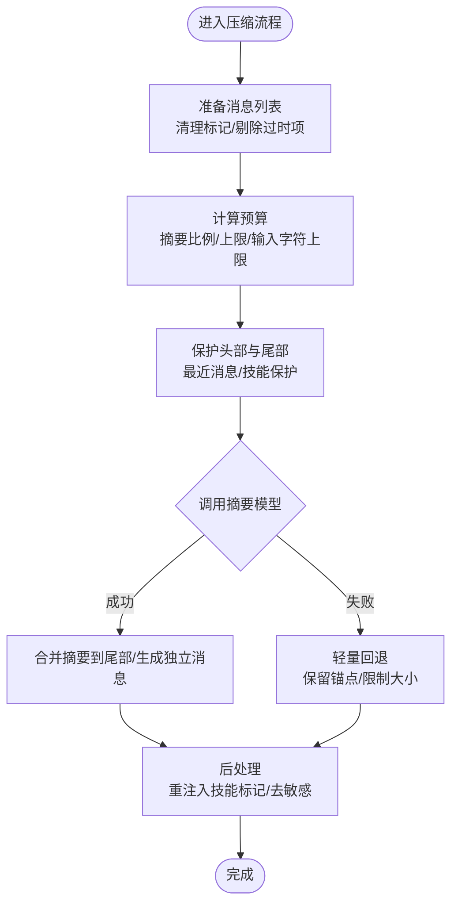
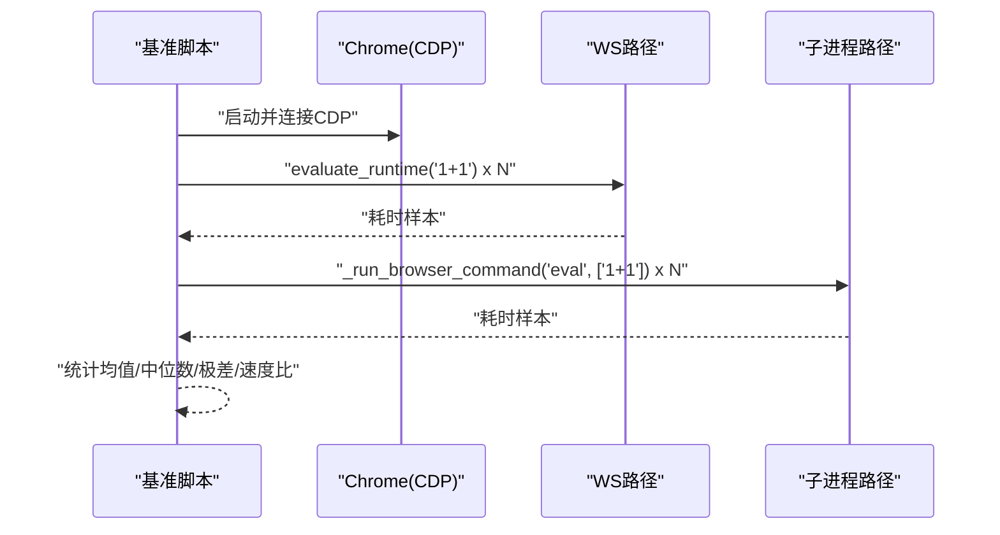
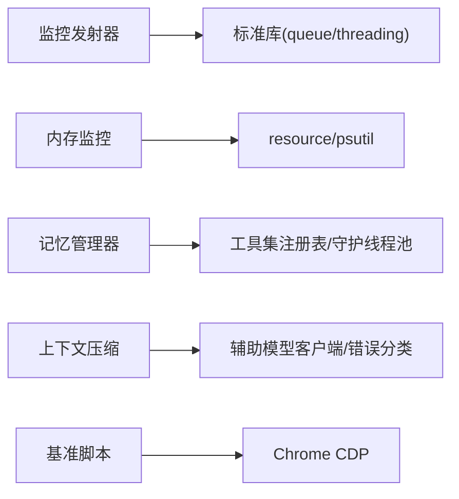

# 性能优化

<cite>
**本文引用的文件**
- [agent/monitoring/emitter.py](file://agent/monitoring/emitter.py)
- [gateway/memory_monitor.py](file://gateway/memory_monitor.py)
- [agent/memory_manager.py](file://agent/memory_manager.py)
- [agent/context_compressor.py](file://agent/context_compressor.py)
- [scripts/benchmark_browser_eval.py](file://scripts/benchmark_browser_eval.py)
</cite>

## 目录
1. [简介](#简介)
2. [项目结构](#项目结构)
3. [核心组件](#核心组件)
4. [架构总览](#架构总览)
5. [详细组件分析](#详细组件分析)
6. [依赖关系分析](#依赖关系分析)
7. [性能考量与调优建议](#性能考量与调优建议)
8. [故障排查指南](#故障排查指南)
9. [结论](#结论)
10. [附录](#附录)

## 简介
本指南面向生产环境下的系统级性能优化，覆盖监控、瓶颈定位、内存管理、上下文压缩与缓存、工具执行性能、API 调用与网络延迟分析、基准测试与回归检测等主题。文档基于仓库中现有的监控、内存、压缩与基准脚本实现，给出可操作的配置与调优建议，并配合图示帮助理解数据流与控制流。

## 项目结构
与性能相关的关键模块分布在以下位置：
- 监控与遥测：agent/monitoring/emitter.py（事件发射器）、gateway/memory_monitor.py（进程内存监控）
- 内存与并发：agent/memory_manager.py（记忆提供者编排、后台任务串行化与超时保护）
- 上下文压缩：agent/context_compressor.py（长对话自动压缩、预算控制、失败回退）
- 基准测试：scripts/benchmark_browser_eval.py（浏览器评估路径对比）

**图表来源**
- [agent/monitoring/emitter.py:1-212](file://agent/monitoring/emitter.py#L1-L212)
- [gateway/memory_monitor.py:1-231](file://gateway/memory_monitor.py#L1-L231)
- [agent/memory_manager.py:1-800](file://agent/memory_manager.py#L1-L800)
- [agent/context_compressor.py:1-800](file://agent/context_compressor.py#L1-L800)
- [scripts/benchmark_browser_eval.py:1-139](file://scripts/benchmark_browser_eval.py#L1-L139)

**章节来源**
- [agent/monitoring/emitter.py:1-212](file://agent/monitoring/emitter.py#L1-L212)
- [gateway/memory_monitor.py:1-231](file://gateway/memory_monitor.py#L1-L231)
- [agent/memory_manager.py:1-800](file://agent/memory_manager.py#L1-L800)
- [agent/context_compressor.py:1-800](file://agent/context_compressor.py#L1-L800)
- [scripts/benchmark_browser_eval.py:1-139](file://scripts/benchmark_browser_eval.py#L1-L139)

## 核心组件
- 监控发射器：提供非阻塞的事件发射、批量分发与订阅者隔离，确保监控不影响主路径性能。
- 内存监控：周期性记录进程 RSS、GC 计数、线程数，便于发现慢泄漏。
- 记忆管理器：统一编排记忆提供者，后台串行化写入，外部预取带超时保护，避免阻塞用户响应。
- 上下文压缩：对长对话进行自动压缩，维护头尾保护、摘要预算、失败回退与技能信息保留。
- 基准脚本：对比不同浏览器评估路径的性能差异，辅助回归检测。

**章节来源**
- [agent/monitoring/emitter.py:1-212](file://agent/monitoring/emitter.py#L1-L212)
- [gateway/memory_monitor.py:1-231](file://gateway/memory_monitor.py#L1-L231)
- [agent/memory_manager.py:1-800](file://agent/memory_manager.py#L1-L800)
- [agent/context_compressor.py:1-800](file://agent/context_compressor.py#L1-L800)
- [scripts/benchmark_browser_eval.py:1-139](file://scripts/benchmark_browser_eval.py#L1-L139)

## 架构总览
下图展示了从请求到监控、内存、压缩与基准的端到端交互。

**图表来源**
- [agent/monitoring/emitter.py:1-212](file://agent/monitoring/emitter.py#L1-L212)
- [gateway/memory_monitor.py:1-231](file://gateway/memory_monitor.py#L1-L231)
- [agent/memory_manager.py:1-800](file://agent/memory_manager.py#L1-L800)
- [agent/context_compressor.py:1-800](file://agent/context_compressor.py#L1-L800)
- [scripts/benchmark_browser_eval.py:1-139](file://scripts/benchmark_browser_eval.py#L1-L139)

## 详细组件分析

### 监控发射器（MonitoringEmitter）
- 设计要点：
  - emit() 必须 O(微秒) 返回，永不阻塞磁盘/网络，永不抛出异常到调用方。
  - 使用环形队列 + 后台派发线程，批量分发给订阅者（如 OTLP 导出器）。
  - 每个订阅者完全隔离失败，避免影响其他订阅者或热路径。
- 关键行为：
  - 队列满时丢弃最旧事件，保持最新优先；统计 dropped/dispatched。
  - flush(timeout) 用于测试或优雅关闭时的等待。
  - stats() 暴露队列长度、已派发、丢弃数、订阅者数量。

**图表来源**
- [agent/monitoring/emitter.py:52-117](file://agent/monitoring/emitter.py#L52-L117)

**章节来源**
- [agent/monitoring/emitter.py:1-212](file://agent/monitoring/emitter.py#L1-L212)

### 内存监控（Memory Monitor）
- 设计要点：
  - 后台守护线程每 N 分钟记录一次结构化日志行，便于 grep 时间序列。
  - 使用 resource.getrusage（Linux/macOS）或 psutil（Windows/其他）获取 RSS。
  - 启动时记录基线，关闭时记录最终快照，便于定位泄漏。
- 关键行为：
  - start_memory_monitoring(interval_seconds) 启动监控；stop_memory_monitoring(timeout) 停止并记录最后快照。
  - log_memory_usage(prefix) 安全地记录当前 RSS、GC 计数、线程数、运行时长。

**图表来源**
- [gateway/memory_monitor.py:52-127](file://gateway/memory_monitor.py#L52-L127)
- [gateway/memory_monitor.py:139-224](file://gateway/memory_monitor.py#L139-L224)

**章节来源**
- [gateway/memory_monitor.py:1-231](file://gateway/memory_monitor.py#L1-L231)

### 记忆管理器（MemoryManager）
- 设计要点：
  - 仅允许一个外部记忆提供者，避免工具 schema 膨胀与冲突。
  - 外部预取使用独立线程并设置超时，防止卡住导致用户长时间“running”。
  - 写入通过单工作线程序列化，保证 turn N 先于 turn N+1 落地。
- 关键行为：
  - prefetch_all/query：收集预取上下文，失败不阻塞其他提供者。
  - sync_all：后台串行化同步，避免阻塞响应路径。
  - queue_prefetch_all：异步预取下一轮上下文。
  - flush_pending(timeout)：在会话边界等待后台任务排空。

**图表来源**
- [agent/memory_manager.py:364-757](file://agent/memory_manager.py#L364-L757)

**章节来源**
- [agent/memory_manager.py:1-800](file://agent/memory_manager.py#L1-L800)

### 上下文压缩（Context Compressor）
- 设计要点：
  - 自动压缩长对话，保护头部与尾部，使用辅助模型生成摘要。
  - 严格预算控制：摘要比例、绝对上限、输入字符上限，避免慢后端超时。
  - 失败回退：当 LLM 不可用或配额不足时，采用轻量回退策略保持连续性。
  - 技能信息保留：识别被裁剪的技能并注入提示，避免“幽灵技能”问题。
- 关键行为：
  - 压缩前清理持久化标记、剔除过时推理项，保证消息列表一致性。
  - 摘要模板包含明确的“参考只读”指令，避免模型误将历史作为新任务。
  - 支持滚动微压缩与批量压缩，具备连续失败保护与光标推进。

**图表来源**
- [agent/context_compressor.py:182-317](file://agent/context_compressor.py#L182-L317)
- [agent/context_compressor.py:487-513](file://agent/context_compressor.py#L487-L513)
- [agent/context_compressor.py:556-690](file://agent/context_compressor.py#L556-L690)

**章节来源**
- [agent/context_compressor.py:1-800](file://agent/context_compressor.py#L1-L800)

### 基准测试（Browser Eval Benchmark）
- 用途：对比两种浏览器评估路径（WS 直连 vs 子进程）的耗时，辅助 PR 描述与回归检测。
- 关键点：
  - 启动 Chrome 无头模式并通过 CDP 连接。
  - 预热后循环执行固定表达式，统计均值/中位数/极差。
  - 输出速度比，便于快速判断路径优劣。

**图表来源**
- [scripts/benchmark_browser_eval.py:22-55](file://scripts/benchmark_browser_eval.py#L22-L55)
- [scripts/benchmark_browser_eval.py:58-139](file://scripts/benchmark_browser_eval.py#L58-L139)

**章节来源**
- [scripts/benchmark_browser_eval.py:1-139](file://scripts/benchmark_browser_eval.py#L1-L139)

## 依赖关系分析
- 监控发射器依赖标准库队列与线程，零外部依赖，适合嵌入任何热路径。
- 内存监控依赖 resource（Unix）或 psutil（可选），在不可用时降级为警告并跳过。
- 记忆管理器依赖工具集注册表与守护线程池，确保后台任务不会阻止解释器退出。
- 上下文压缩依赖辅助模型客户端与错误分类器，具备配额/鉴权失败的快速判定。
- 基准脚本依赖浏览器与 CDP，用于路径对比与回归检测。

**图表来源**
- [agent/monitoring/emitter.py:1-212](file://agent/monitoring/emitter.py#L1-L231)
- [gateway/memory_monitor.py:1-231](file://gateway/memory_monitor.py#L1-L231)
- [agent/memory_manager.py:1-800](file://agent/memory_manager.py#L1-L800)
- [agent/context_compressor.py:1-800](file://agent/context_compressor.py#L1-L800)
- [scripts/benchmark_browser_eval.py:1-139](file://scripts/benchmark_browser_eval.py#L1-L139)

**章节来源**
- [agent/monitoring/emitter.py:1-212](file://agent/monitoring/emitter.py#L1-L212)
- [gateway/memory_monitor.py:1-231](file://gateway/memory_monitor.py#L1-L231)
- [agent/memory_manager.py:1-800](file://agent/memory_manager.py#L1-L800)
- [agent/context_compressor.py:1-800](file://agent/context_compressor.py#L1-L800)
- [scripts/benchmark_browser_eval.py:1-139](file://scripts/benchmark_browser_eval.py#L1-L139)

## 性能考量与调优建议
- CPU 使用率
  - 监控发射器确保 emit() 为 O(微秒)，避免在主路径引入锁竞争或 I/O。
  - 记忆管理器后台串行化写入，减少多线程争用与上下文切换。
  - 上下文压缩限制输入字符上限，降低辅助模型负载。
- 内存占用
  - 使用内存监控定期记录 RSS/GC/线程数，关注缓慢上升趋势。
  - 记忆管理器外部预取设置超时，避免长期持有资源。
  - 上下文压缩清理持久化标记与过时推理项，减少无用数据累积。
- 磁盘 I/O
  - 监控发射器不持久化事件，仅内存缓冲；必要时结合落盘策略（如批写）。
  - 记忆管理器 flush_pending 在会话边界等待后台任务，避免频繁落盘抖动。
- 网络带宽
  - 监控发射器批量分发，减少网络往返。
  - 上下文压缩控制摘要大小，避免大报文传输。
- 慢查询优化
  - 记忆管理器外部预取超时保护，避免阻塞用户响应。
  - 上下文压缩失败回退，保障服务连续性。
- 并发处理调优
  - 记忆管理器单工作线程串行化写入，保证顺序性与低开销。
  - 监控发射器后台线程批量派发，隔离失败。
- 资源竞争解决
  - 监控发射器使用无锁 put_nowait 与丢弃策略，避免阻塞。
  - 内存监控在不可用时降级，不阻塞主流程。
- 内存管理最佳实践
  - 定期 GC 统计与线程数监控，识别泄漏迹象。
  - 大对象处理：上下文压缩裁剪工具输出与技能内容，保留必要元信息。
  - 垃圾回收优化：关注 GC 计数变化，调整触发阈值（若可配置）。
- 上下文压缩与缓存策略
  - 调整摘要比例与上限，平衡信息保留与成本。
  - 启用技能保护窗口，避免频繁 reload。
  - 缓存策略：利用记忆提供者工具 schema 缓存与去重，减少重复加载。
- 工具执行性能调优
  - 并行执行：监控发射器 fan-out 各订阅者并行处理。
  - 超时设置：记忆管理器外部预取超时，避免长时间挂起。
  - 重试机制：上下文压缩对速率限制等非永久错误可重试，鉴权/配额错误立即放弃。
- API 调用性能与网络延迟分析
  - 使用监控发射器记录关键事件时间戳，结合 OTLP 导出器分析延迟分布。
  - 基准脚本对比不同路径，识别网络/进程开销热点。
- 基准测试与性能回归检测
  - 使用基准脚本定期运行，记录均值/中位数/极差，设置阈值告警。
  - 在 CI 中集成基准，防止回归。
- 生产环境监控与告警
  - 开启内存监控，设置 RSS/GC/线程数阈值告警。
  - 监控发射器接入 OTLP，集中采集指标/追踪/日志。
  - 上下文压缩失败率与回退次数纳入告警。

[本节为通用指导，无需具体文件引用]

## 故障排查指南
- 监控发射器
  - 现象：事件丢失或延迟。检查队列长度、dropped 计数与订阅者状态。
  - 操作：stats() 查看 queued/dropped/subscribers；flush(timeout) 等待完成。
- 内存监控
  - 现象：RSS 持续上升。查看 [MEMORY] 日志中的 rss/gc/threads/uptime。
  - 操作：确认 resource/psutil 可用性；检查外部预取是否超时；审查大对象生命周期。
- 记忆管理器
  - 现象：用户响应长时间“running”。检查外部预取超时与后台任务是否堆积。
  - 操作：调整 external_prefetch_timeout；使用 flush_pending 等待；审查提供者实现。
- 上下文压缩
  - 现象：摘要过大或失败。检查输入字符上限、摘要比例与失败回退。
  - 操作：调整 _SUMMARY_INPUT_MAX_CHARS/_SUMMARY_RATIO；观察失败冷却与回退效果。
- 基准脚本
  - 现象：回归或性能下降。比较 WS 与子进程路径的均值/中位数/极差。
  - 操作：增加迭代次数；固定 Chrome 版本与环境；在 CI 中自动化。

**章节来源**
- [agent/monitoring/emitter.py:132-158](file://agent/monitoring/emitter.py#L132-L158)
- [gateway/memory_monitor.py:83-127](file://gateway/memory_monitor.py#L83-L127)
- [agent/memory_manager.py:547-595](file://agent/memory_manager.py#L547-L595)
- [agent/context_compressor.py:487-513](file://agent/context_compressor.py#L487-L513)
- [scripts/benchmark_browser_eval.py:58-139](file://scripts/benchmark_browser_eval.py#L58-L139)

## 结论
通过监控发射器、内存监控、记忆管理器与上下文压缩的组合，系统实现了高吞吐、低延迟且健壮的性能特性。结合基准测试与生产告警，可有效识别并缓解性能瓶颈，保障服务稳定性与用户体验。

[本节为总结性内容，无需具体文件引用]

## 附录
- 术语
  - RSS：进程常驻内存集大小。
  - GC：垃圾回收。
  - CDP：Chrome DevTools Protocol。
  - OTLP：OpenTelemetry 协议。
- 参考实现路径
  - 监控发射器：agent/monitoring/emitter.py
  - 内存监控：gateway/memory_monitor.py
  - 记忆管理器：agent/memory_manager.py
  - 上下文压缩：agent/context_compressor.py
  - 基准脚本：scripts/benchmark_browser_eval.py

[本节为补充说明，无需具体文件引用]