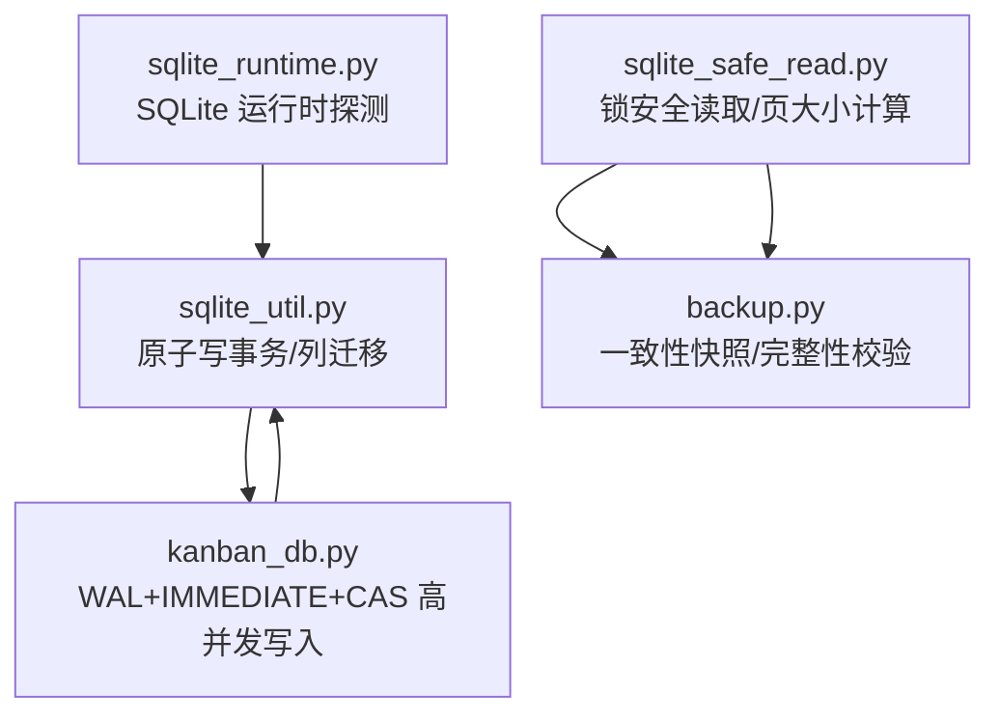
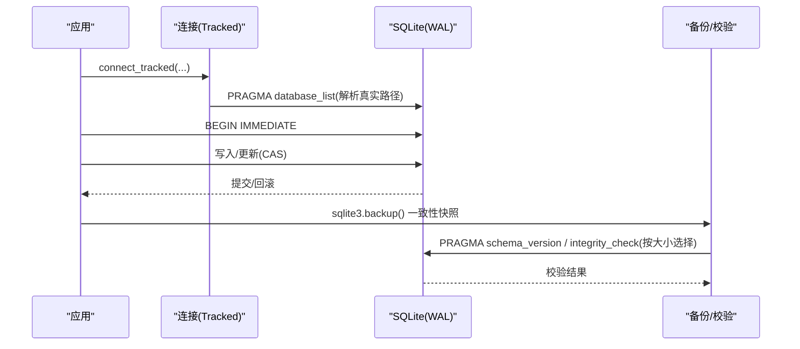
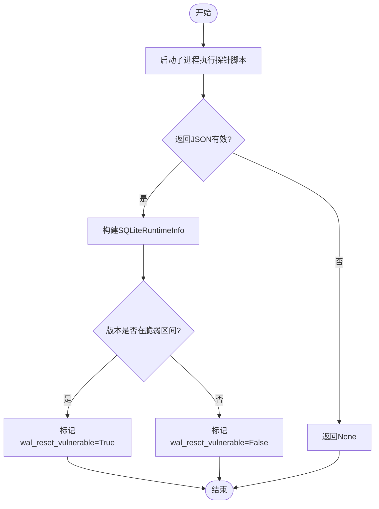
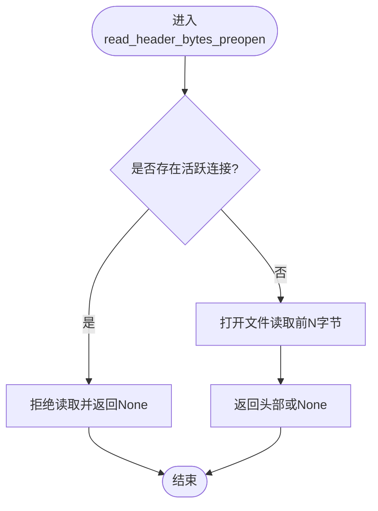
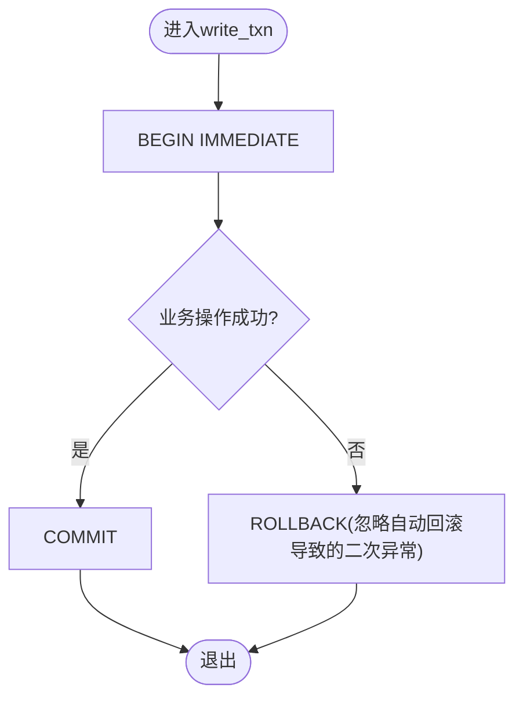
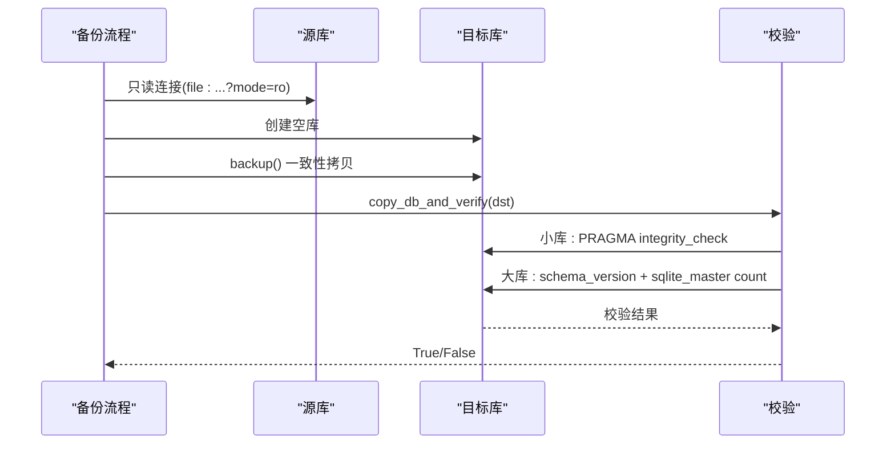
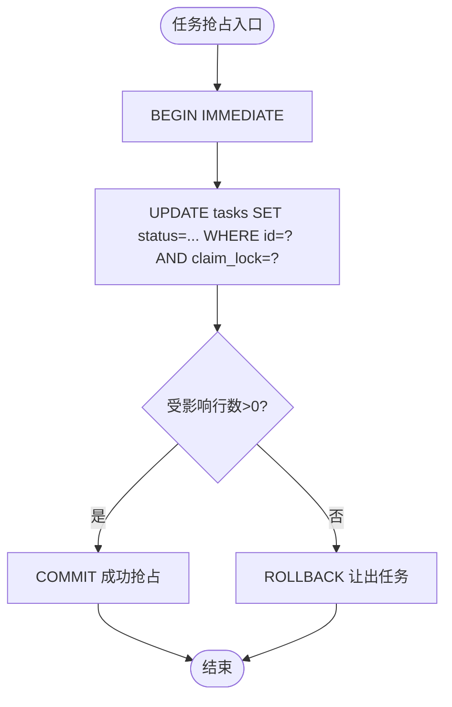
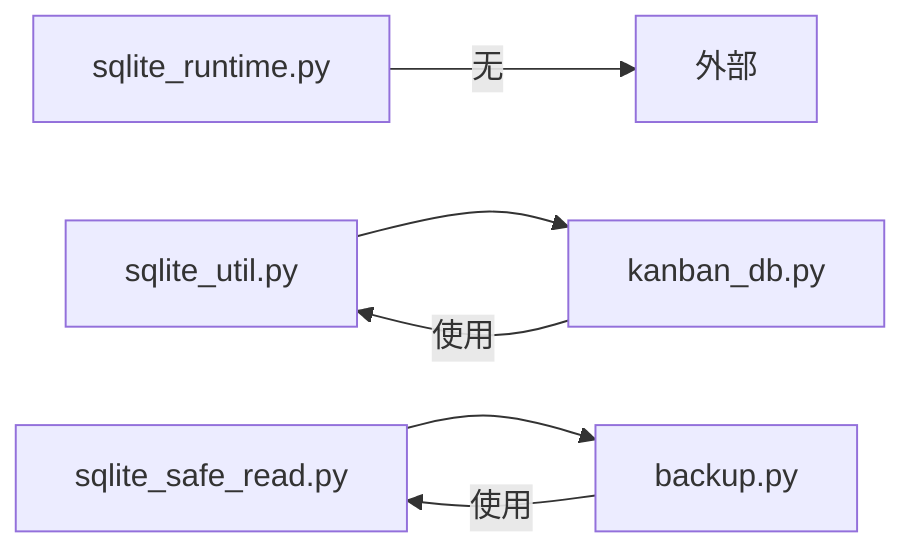

# 数据库性能优化

<cite>
**本文引用的文件**
- [sparkii_cli/sqlite_runtime.py](file://sparkii_cli/sqlite_runtime.py)
- [sparkii_cli/sqlite_util.py](file://sparkii_cli/sqlite_util.py)
- [sparkii_cli/sqlite_safe_read.py](file://sparkii_cli/sqlite_safe_read.py)
- [sparkii_cli/backup.py](file://sparkii_cli/backup.py)
- [sparkii_cli/kanban_db.py](file://sparkii_cli/kanban_db.py)
</cite>

## 目录
1. [简介](#简介)
2. [项目结构](#项目结构)
3. [核心组件](#核心组件)
4. [架构总览](#架构总览)
5. [详细组件分析](#详细组件分析)
6. [依赖关系分析](#依赖关系分析)
7. [性能考量](#性能考量)
8. [故障排查指南](#故障排查指南)
9. [结论](#结论)
10. [附录](#附录)

## 简介
本指南面向生产环境的 SQLite 使用场景，结合仓库中的实现，系统性地给出索引设计、查询优化、事务管理、会话数据存储（分片/归档/清理）、慢查询分析与优化、大规模读写优化、备份恢复与基准测试、以及生产监控与维护的配置建议。内容严格基于代码库中已实现的机制与约束，确保可落地执行。

## 项目结构
本项目在 CLI 层提供了围绕 SQLite 的通用能力：运行时探测、安全读取、原子写事务、备份与完整性校验，并在看板模块中实践了 WAL + IMMEDIATE 事务 + CAS 并发控制的高并发写入模式。这些能力共同构成数据库性能优化的基础。

图表来源
- [sparkii_cli/sqlite_runtime.py:1-125](file://sparkii_cli/sqlite_runtime.py#L1-L125)
- [sparkii_cli/sqlite_util.py:1-50](file://sparkii_cli/sqlite_util.py#L1-L50)
- [sparkii_cli/sqlite_safe_read.py:1-416](file://sparkii_cli/sqlite_safe_read.py#L1-L416)
- [sparkii_cli/backup.py:342-574](file://sparkii_cli/backup.py#L342-L574)
- [sparkii_cli/kanban_db.py:55-69](file://sparkii_cli/kanban_db.py#L55-L69)

章节来源
- [sparkii_cli/sqlite_runtime.py:1-125](file://sparkii_cli/sqlite_runtime.py#L1-L125)
- [sparkii_cli/sqlite_util.py:1-50](file://sparkii_cli/sqlite_util.py#L1-L50)
- [sparkii_cli/sqlite_safe_read.py:1-416](file://sparkii_cli/sqlite_safe_read.py#L1-L416)
- [sparkii_cli/backup.py:342-574](file://sparkii_cli/backup.py#L342-L574)
- [sparkii_cli/kanban_db.py:55-69](file://sparkii_cli/kanban_db.py#L55-L69)

## 核心组件
- SQLite 运行时探测：隔离子进程探测 Python 内置 SQLite 版本与源 ID，用于识别已知缺陷版本并做兼容处理。
- 安全读取：通过 PRAGMA 获取页计数与页大小，避免直接打开文件破坏 POSIX 锁；提供“仅当无连接时”的安全头读取。
- 原子写事务：统一使用 BEGIN IMMEDIATE 保证单写者串行化，失败时显式 ROLLBACK 避免掩盖原始异常。
- 备份与完整性：使用 sqlite3.backup() 生成一致快照，跳过 WAL/SHM/JOURNAL 侧车文件；对大库采用轻量结构探测替代全量 integrity_check。
- 高并发写入：看板模块以 WAL + IMMEDIATE + CAS 策略实现多进程/多线程下的任务抢占与状态更新，避免分布式锁。

章节来源
- [sparkii_cli/sqlite_runtime.py:24-53](file://sparkii_cli/sqlite_runtime.py#L24-L53)
- [sparkii_cli/sqlite_safe_read.py:297-344](file://sparkii_cli/sqlite_safe_read.py#L297-L344)
- [sparkii_cli/sqlite_util.py:31-50](file://sparkii_cli/sqlite_util.py#L31-L50)
- [sparkii_cli/backup.py:342-374](file://sparkii_cli/backup.py#L342-L374)
- [sparkii_cli/backup.py:416-552](file://sparkii_cli/backup.py#L416-L552)
- [sparkii_cli/kanban_db.py:55-69](file://sparkii_cli/kanban_db.py#L55-L69)

## 架构总览
下图展示了从连接建立到写入、备份、校验的关键路径，体现 WAL 模式、原子写事务、一致性快照与完整性检查的组合。

图表来源
- [sparkii_cli/sqlite_safe_read.py:210-274](file://sparkii_cli/sqlite_safe_read.py#L210-L274)
- [sparkii_cli/sqlite_util.py:31-50](file://sparkii_cli/sqlite_util.py#L31-L50)
- [sparkii_cli/backup.py:342-374](file://sparkii_cli/backup.py#L342-L374)
- [sparkii_cli/backup.py:416-552](file://sparkii_cli/backup.py#L416-L552)

## 详细组件分析

### 组件A：SQLite 运行时探测与兼容性
- 目标：在不引入第三方依赖的前提下，探测当前 Python 解释器链接的 SQLite 版本与源码 ID，判断是否处于已知存在 WAL-reset 漏洞的版本区间。
- 关键点：
  - 通过独立子进程执行最小脚本，避免继承调用方的环境干扰。
  - 将版本信息标准化为三元组，便于比较。
  - 暴露 wal_reset_vulnerable 属性供上层决策。

图表来源
- [sparkii_cli/sqlite_runtime.py:56-125](file://sparkii_cli/sqlite_runtime.py#L56-L125)

章节来源
- [sparkii_cli/sqlite_runtime.py:18-53](file://sparkii_cli/sqlite_runtime.py#L18-L53)
- [sparkii_cli/sqlite_runtime.py:78-125](file://sparkii_cli/sqlite_runtime.py#L78-L125)

### 组件B：安全读取与锁保护
- 目标：避免在进程持有 SQLite 连接的情况下直接打开数据库文件，防止 close() 取消 POSIX 锁导致数据损坏。
- 关键点：
  - 通过 PRAGMA page_count/page_size 计算逻辑文件大小，不打开新文件描述符。
  - 提供 read_header_bytes_preopen，仅在无连接时允许读取头部字节。
  - 维护连接生命周期注册表，确保 open/close 与注册/注销原子性。

图表来源
- [sparkii_cli/sqlite_safe_read.py:347-381](file://sparkii_cli/sqlite_safe_read.py#L347-L381)
- [sparkii_cli/sqlite_safe_read.py:297-344](file://sparkii_cli/sqlite_safe_read.py#L297-L344)

章节来源
- [sparkii_cli/sqlite_safe_read.py:1-120](file://sparkii_cli/sqlite_safe_read.py#L1-L120)
- [sparkii_cli/sqlite_safe_read.py:210-274](file://sparkii_cli/sqlite_safe_read.py#L210-L274)
- [sparkii_cli/sqlite_safe_read.py:297-381](file://sparkii_cli/sqlite_safe_read.py#L297-L381)

### 组件C：原子写事务与列迁移
- 目标：统一写事务边界，确保并发写串行化且错误不被掩盖；提供幂等的列添加迁移。
- 关键点：
  - write_txn 使用 BEGIN IMMEDIATE，失败时显式 ROLLBACK。
  - add_column_if_missing 捕获重复列错误，保证幂等。

图表来源
- [sparkii_cli/sqlite_util.py:31-50](file://sparkii_cli/sqlite_util.py#L31-L50)

章节来源
- [sparkii_cli/sqlite_util.py:14-29](file://sparkii_cli/sqlite_util.py#L14-L29)
- [sparkii_cli/sqlite_util.py:31-50](file://sparkii_cli/sqlite_util.py#L31-L50)

### 组件D：备份与完整性校验
- 目标：生成一致的 SQLite 快照，并对备份进行完整性验证；对超大库采用轻量结构探测以避免长时间 CPU 占用。
- 关键点：
  - 使用 sqlite3.backup() 复制数据库，正确处理 WAL 模式。
  - verify_sqlite_integrity 根据文件大小选择 PRAGMA integrity_check 或轻量 schema probe。
  - 备份过程排除 WAL/SHM/JOURNAL 等瞬态侧车文件，避免不一致恢复。

图表来源
- [sparkii_cli/backup.py:342-374](file://sparkii_cli/backup.py#L342-L374)
- [sparkii_cli/backup.py:416-552](file://sparkii_cli/backup.py#L416-L552)
- [sparkii_cli/backup.py:555-574](file://sparkii_cli/backup.py#L555-L574)

章节来源
- [sparkii_cli/backup.py:342-374](file://sparkii_cli/backup.py#L342-L374)
- [sparkii_cli/backup.py:416-552](file://sparkii_cli/backup.py#L416-L552)
- [sparkii_cli/backup.py:555-574](file://sparkii_cli/backup.py#L555-L574)

### 组件E：高并发写入（看板）
- 目标：在多进程/多线程环境下实现任务抢占与状态更新，避免分布式锁。
- 关键点：
  - WAL 模式提升并发读性能。
  - 写事务使用 BEGIN IMMEDIATE 串行化写者。
  - 通过 CAS（影响行数判断）实现 claim_lock/status 的原子更新，失败即放弃而非重试风暴。

图表来源
- [sparkii_cli/kanban_db.py:55-69](file://sparkii_cli/kanban_db.py#L55-L69)

章节来源
- [sparkii_cli/kanban_db.py:55-69](file://sparkii_cli/kanban_db.py#L55-L69)

## 依赖关系分析
- sqlite_runtime.py 独立于其他模块，仅依赖标准库，用于早期健康检查。
- sqlite_util.py 被 kanban_db.py 引用，提供统一的写事务与列迁移能力。
- sqlite_safe_read.py 被 backup.py 和 is_zeroed_sqlite_file 等路径引用，保障文件级安全访问。
- backup.py 依赖 sqlite3.backup() 与 PRAGMA 能力，并结合 sqlite_safe_read 进行头部检测。
- kanban_db.py 依赖 sqlite_util 的事务封装，自身实现 WAL + IMMEDIATE + CAS 的并发模型。

图表来源
- [sparkii_cli/sqlite_util.py:1-50](file://sparkii_cli/sqlite_util.py#L1-L50)
- [sparkii_cli/sqlite_safe_read.py:1-416](file://sparkii_cli/sqlite_safe_read.py#L1-L416)
- [sparkii_cli/backup.py:342-574](file://sparkii_cli/backup.py#L342-L574)
- [sparkii_cli/kanban_db.py:55-69](file://sparkii_cli/kanban_db.py#L55-L69)

章节来源
- [sparkii_cli/sqlite_util.py:1-50](file://sparkii_cli/sqlite_util.py#L1-L50)
- [sparkii_cli/sqlite_safe_read.py:1-416](file://sparkii_cli/sqlite_safe_read.py#L1-L416)
- [sparkii_cli/backup.py:342-574](file://sparkii_cli/backup.py#L342-L574)
- [sparkii_cli/kanban_db.py:55-69](file://sparkii_cli/kanban_db.py#L55-L69)

## 性能考量
- 索引设计
  - 在高并发写入场景中，优先通过 CAS 条件减少锁竞争（如看板 claim_lock/status）。
  - 对频繁过滤字段建立复合索引，遵循“等值优先、范围后置”的原则。
  - 避免过度索引：每个额外索引都会增加写放大与空间开销。
- 查询优化
  - 使用 EXPLAIN QUERY PLAN 分析执行计划，确保走索引扫描而非全表扫描。
  - 限制 SELECT 列数，避免回表；必要时使用覆盖索引。
  - 将热点查询参数化，减少软解析成本。
- 事务管理
  - 写路径统一使用 BEGIN IMMEDIATE，避免隐式事务带来的锁升级与死锁风险。
  - 短事务原则：尽量缩小事务范围，降低 WAL 增长与锁持有时间。
- 会话数据存储
  - 数据分片：按业务域或租户拆分数据库文件（如看板的多 board 设计），天然隔离热点。
  - 归档策略：对历史会话数据按月/季度归档至只读库，主库保留近期热数据。
  - 清理机制：定期删除过期附件与日志，释放磁盘与 WAL 压力。
- 慢查询分析与优化
  - 执行计划分析：结合 EXPLAIN 与统计信息定位瓶颈。
  - 索引使用率监控：记录未命中索引的查询，持续优化。
  - 查询重写：拆分复杂 JOIN、使用临时表或物化视图。
- 大规模读写优化
  - 批量操作：合并 INSERT/UPDATE，减少事务边界次数。
  - 预取策略：按需加载关联数据，避免 N+1 问题。
  - 缓存机制：对读多写少的配置类数据使用内存缓存，降低 DB 压力。
- 备份恢复与基准测试
  - 备份：使用 sqlite3.backup() 生成一致快照，跳过瞬态侧车文件。
  - 恢复：先校验再替换，支持大库的结构探测快速验证。
  - 基准测试：针对典型负载（读多/写多/混合）建立压测脚本，关注延迟分布与吞吐。
- 生产监控与维护
  - 监控指标：连接数、事务时长、WAL 大小、锁等待、错误率。
  - 维护窗口：定期 VACUUM、PRANMA optimize、索引重建（低峰期）。
  - 告警策略：WAL 过大、长事务、频繁锁冲突触发告警。

[本节为通用指导，不直接分析具体文件]

## 故障排查指南
- 常见症状
  - “database disk image is malformed”：通常由直接打开数据库文件导致 POSIX 锁被取消引起。
  - 备份不一致：未使用 sqlite3.backup() 或未跳过侧车文件。
  - 大库校验缓慢：对超大库执行 PRAGMA integrity_check 导致长时间 CPU 占用。
- 排查步骤
  - 确认所有文件级访问通过 sqlite_safe_read 提供的安全接口。
  - 检查是否使用了 BEGIN IMMEDIATE 写事务，避免隐式事务。
  - 对大库使用结构探测替代全量 integrity_check。
  - 核对备份流程是否包含一致性快照与校验。

章节来源
- [sparkii_cli/sqlite_safe_read.py:1-60](file://sparkii_cli/sqlite_safe_read.py#L1-L60)
- [sparkii_cli/sqlite_util.py:31-50](file://sparkii_cli/sqlite_util.py#L31-L50)
- [sparkii_cli/backup.py:416-552](file://sparkii_cli/backup.py#L416-L552)

## 结论
本项目在 SQLite 的使用上体现了工程化的最佳实践：通过 WAL 提升并发读性能，使用 BEGIN IMMEDIATE 保证写串行化，借助 CAS 实现无锁抢占；通过安全读取与一致性备份保障数据完整性；针对大库提供轻量校验策略。将这些模式推广到会话存储与全局数据库设计中，可显著提升性能与稳定性。

[本节为总结，不直接分析具体文件]

## 附录
- 关键函数与用途速查
  - sqlite_runtime.probe_sqlite_runtime：探测 SQLite 版本与漏洞区间。
  - sqlite_safe_read.connect_tracked：跟踪连接生命周期，防止锁破坏。
  - sqlite_safe_read.page_count_bytes：通过 PRAGMA 计算逻辑大小。
  - sqlite_util.write_txn：统一写事务边界。
  - backup.copy_db_and_verify：一致性备份与校验。
  - kanban_db 并发策略：WAL + IMMEDIATE + CAS。

章节来源
- [sparkii_cli/sqlite_runtime.py:78-125](file://sparkii_cli/sqlite_runtime.py#L78-L125)
- [sparkii_cli/sqlite_safe_read.py:210-274](file://sparkii_cli/sqlite_safe_read.py#L210-L274)
- [sparkii_cli/sqlite_safe_read.py:297-344](file://sparkii_cli/sqlite_safe_read.py#L297-L344)
- [sparkii_cli/sqlite_util.py:31-50](file://sparkii_cli/sqlite_util.py#L31-L50)
- [sparkii_cli/backup.py:555-574](file://sparkii_cli/backup.py#L555-L574)
- [sparkii_cli/kanban_db.py:55-69](file://sparkii_cli/kanban_db.py#L55-L69)