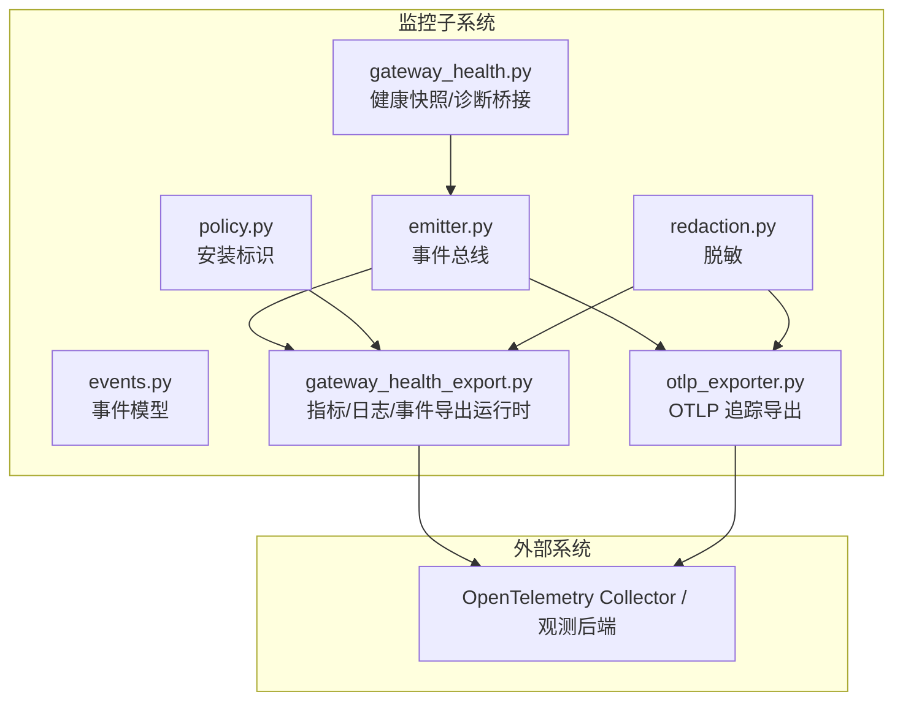
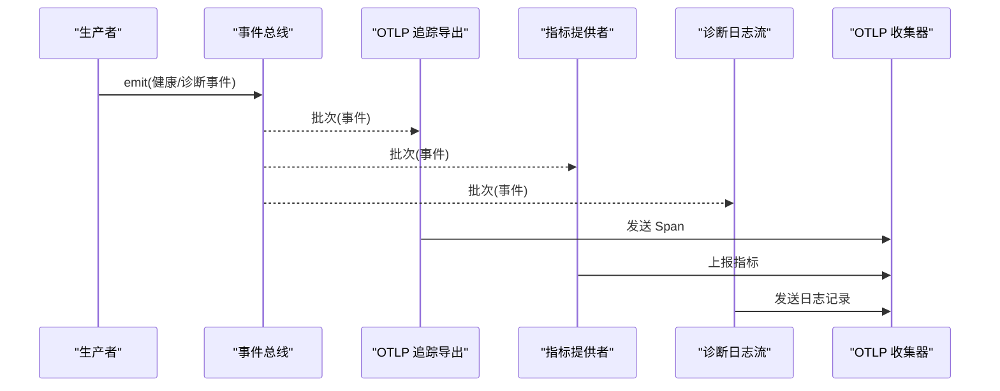
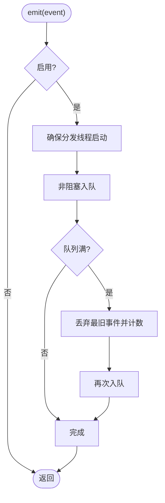
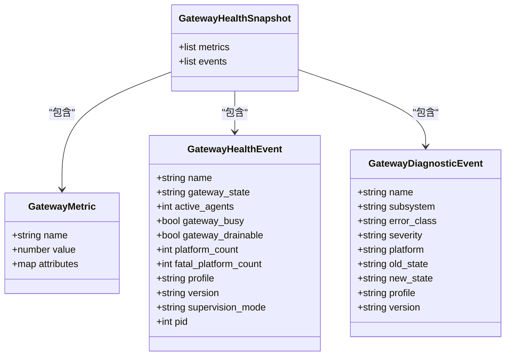
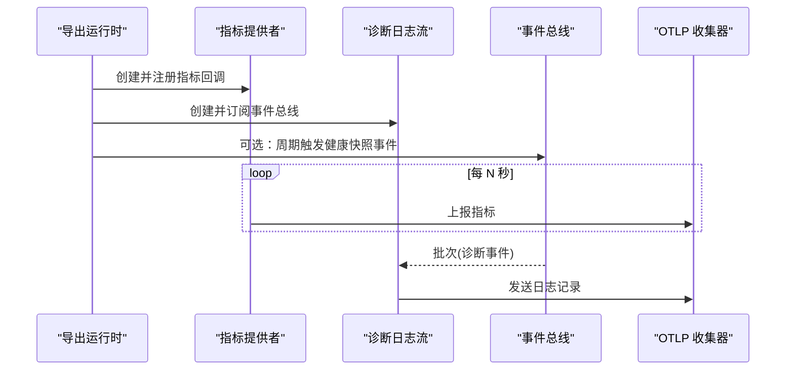
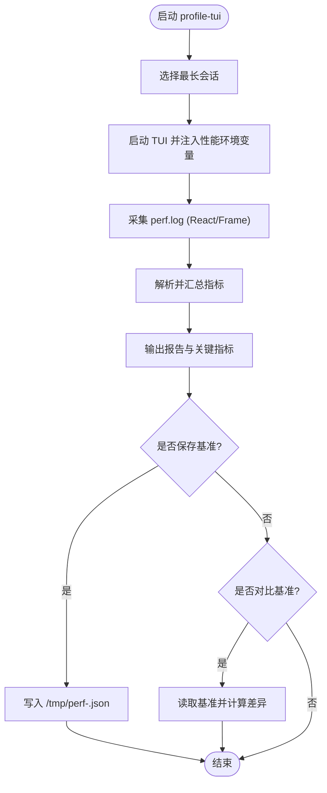
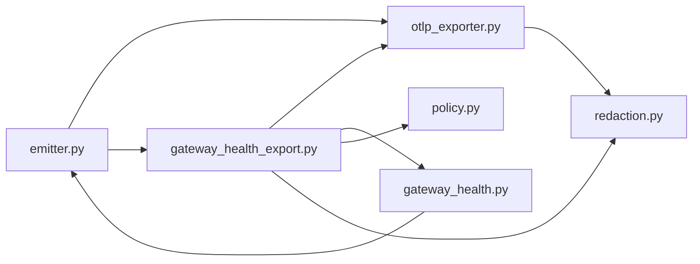

# 监控与剖析

<cite>
**本文引用的文件**
- [agent/monitoring/__init__.py](file://agent/monitoring/__init__.py)
- [agent/monitoring/emitter.py](file://agent/monitoring/emitter.py)
- [agent/monitoring/events.py](file://agent/monitoring/events.py)
- [agent/monitoring/gateway_health.py](file://agent/monitoring/gateway_health.py)
- [agent/monitoring/gateway_health_export.py](file://agent/monitoring/gateway_health_export.py)
- [agent/monitoring/otlp_exporter.py](file://agent/monitoring/otlp_exporter.py)
- [agent/monitoring/policy.py](file://agent/monitoring/policy.py)
- [agent/monitoring/redaction.py](file://agent/monitoring/redaction.py)
- [scripts/profile-tui.py](file://scripts/profile-tui.py)
</cite>

## 目录
1. [简介](#简介)
2. [项目结构](#项目结构)
3. [核心组件](#核心组件)
4. [架构总览](#架构总览)
5. [详细组件分析](#详细组件分析)
6. [依赖关系分析](#依赖关系分析)
7. [性能考量](#性能考量)
8. [故障排查指南](#故障排查指南)
9. [结论](#结论)
10. [附录](#附录)

## 简介
本指南面向生产与研发环境，提供系统级监控与性能剖析的完整方案。内容涵盖：
- 指标定义与采集：网关健康、平台状态、后台任务、定时任务等；通过 OTLP（OpenTelemetry）导出到观测后端。
- 性能剖析工具：前端 TUI 性能采集脚本、关键帧耗时与回压分析、A/B 对比与回归检测。
- 日志分析与调试：结构化诊断事件、错误分类、脱敏策略、告警建议。
- 基线与回归：自动化测试集成、阈值告警、持续比对。
- 分布式可观测性：链路追踪、聚合分析、实例标识与资源属性。
- 生产仪表板与告警：指标命名、标签规范、阈值建议与落地步骤。

## 项目结构
监控子系统位于 agent/monitoring，负责“热路径不阻塞”的事件发射、安全脱敏、OTLP 导出以及网关健康快照；脚本层 scripts/profile-tui.py 提供前端 TUI 的性能采集与报告能力。

**图表来源**
- [agent/monitoring/emitter.py:1-212](file://agent/monitoring/emitter.py#L1-L212)
- [agent/monitoring/events.py:1-87](file://agent/monitoring/events.py#L1-L87)
- [agent/monitoring/gateway_health.py:1-470](file://agent/monitoring/gateway_health.py#L1-L470)
- [agent/monitoring/gateway_health_export.py:1-644](file://agent/monitoring/gateway_health_export.py#L1-L644)
- [agent/monitoring/otlp_exporter.py:1-271](file://agent/monitoring/otlp_exporter.py#L1-L271)
- [agent/monitoring/policy.py:1-58](file://agent/monitoring/policy.py#L1-L58)
- [agent/monitoring/redaction.py:1-72](file://agent/monitoring/redaction.py#L1-L72)

**章节来源**
- [agent/monitoring/__init__.py:1-30](file://agent/monitoring/__init__.py#L1-L30)
- [agent/monitoring/emitter.py:1-212](file://agent/monitoring/emitter.py#L1-L212)
- [agent/monitoring/gateway_health_export.py:1-644](file://agent/monitoring/gateway_health_export.py#L1-L644)

## 核心组件
- 事件总线（MonitoringEmitter）：进程内无阻塞队列 + 后台分发线程，保证热路径永不阻塞、永不抛异常；支持批量订阅者扇出与失败隔离。
- 事件模型（events.py）：网关健康、诊断、定时任务执行等无内容事件的类型化数据类。
- 网关健康与诊断（gateway_health.py）：从运行时状态构建健康快照、错误分类、日志桥接为诊断事件。
- 导出运行时（gateway_health_export.py）：启动指标、日志、事件导出，管理生命周期与关闭流程。
- OTLP 追踪导出（otlp_exporter.py）：将事件映射为 Span 并发送到 OTLP 端点。
- 安装标识（policy.py）：生成并持久化实例标识，用于跨重启识别服务实例。
- 脱敏（redaction.py）：强制对敏感信息、PII 进行不可逆替换，确保出站数据不含隐私。

**章节来源**
- [agent/monitoring/emitter.py:36-164](file://agent/monitoring/emitter.py#L36-L164)
- [agent/monitoring/events.py:19-80](file://agent/monitoring/events.py#L19-L80)
- [agent/monitoring/gateway_health.py:20-31](file://agent/monitoring/gateway_health.py#L20-L31)
- [agent/monitoring/gateway_health_export.py:101-165](file://agent/monitoring/gateway_health_export.py#L101-L165)
- [agent/monitoring/otlp_exporter.py:107-178](file://agent/monitoring/otlp_exporter.py#L107-L178)
- [agent/monitoring/policy.py:18-52](file://agent/monitoring/policy.py#L18-L52)
- [agent/monitoring/redaction.py:43-66](file://agent/monitoring/redaction.py#L43-L66)

## 架构总览
监控子系统采用“生产者-事件总线-消费者”的解耦设计：
- 生产者：网关状态变更、平台状态变化、定时任务执行、诊断日志桥接。
- 事件总线：单例 MonitoringEmitter，非阻塞入队，后台线程批量分发。
- 消费者：OTLP 追踪导出器、指标提供者、诊断日志流式导出器。
- 安全边界：所有出站字符串经 redaction 脱敏；资源属性白名单校验；事件过滤限定平面范围。

**图表来源**
- [agent/monitoring/emitter.py:52-117](file://agent/monitoring/emitter.py#L52-L117)
- [agent/monitoring/otlp_exporter.py:166-203](file://agent/monitoring/otlp_exporter.py#L166-L203)
- [agent/monitoring/gateway_health_export.py:417-468](file://agent/monitoring/gateway_health_export.py#L417-L468)
- [agent/monitoring/gateway_health_export.py:485-556](file://agent/monitoring/gateway_health_export.py#L485-L556)

## 详细组件分析

### 事件总线（MonitoringEmitter）
- 职责：维护有界队列、后台分发线程、订阅者列表；保证 emit() 微秒级返回、永不阻塞、永不抛出。
- 机制：put_nowait 入队；队列满时丢弃最旧事件；批量消费（_DRAIN_BATCH）；每个订阅者失败隔离。
- 生命周期：懒启动分发线程；flush 等待完成；close 停止线程。
- 统计：队列长度、已分发数、丢弃数、订阅者数量。

**图表来源**
- [agent/monitoring/emitter.py:52-117](file://agent/monitoring/emitter.py#L52-L117)

**章节来源**
- [agent/monitoring/emitter.py:36-164](file://agent/monitoring/emitter.py#L36-L164)

### 事件模型（GatewayHealthEvent / GatewayDiagnosticEvent / CronExecutionEvent）
- 特点：无内容、带时间戳、to_dict 标准化；严格限制字段集合，避免泄露业务数据。
- 用途：统一接入 OTLP 追踪与日志导出；便于在观测系统中按事件类型筛选与聚合。

**章节来源**
- [agent/monitoring/events.py:19-80](file://agent/monitoring/events.py#L19-L80)

### 网关健康与诊断（gateway_health.py）
- 健康快照：从运行时状态计算 up/busy/drainable/active_agents 等指标；平台 up/degraded 计数；构造健康事件。
- 诊断桥接：将 gateway.* 日志中的警告/错误转换为诊断事件，包含错误分类、严重级别、子系统等。
- 错误分类：基于关键词将原始错误归一化为 auth_failed/rate_limited/timeout/network_error/invalid_config/startup_failed/platform_fatal 等。
- 实例标识：使用哈希后的安装 ID 作为稳定 service.instance.id。

**图表来源**
- [agent/monitoring/gateway_health.py:20-31](file://agent/monitoring/gateway_health.py#L20-L31)
- [agent/monitoring/events.py:19-80](file://agent/monitoring/events.py#L19-L80)

**章节来源**
- [agent/monitoring/gateway_health.py:70-120](file://agent/monitoring/gateway_health.py#L70-L120)
- [agent/monitoring/gateway_health.py:210-291](file://agent/monitoring/gateway_health.py#L210-L291)
- [agent/monitoring/gateway_health.py:427-459](file://agent/monitoring/gateway_health.py#L427-L459)

### 导出运行时（gateway_health_export.py）
- 指标提供者：周期性读取运行时快照，注册可观察 Gauge，上报至 OTLP 指标端点。
- 诊断日志流：订阅事件总线，将 gateway_diagnostic 事件转为 OTLP 日志记录，保留受控的 source_logger 以精确定位代码位置。
- 事件导出：可选地周期触发健康快照事件，并通过事件总线转发。
- 生命周期：start_gateway_health_export 启动各组件；shutdown 有序关闭，先停生产者再 flush 网络。

**图表来源**
- [agent/monitoring/gateway_health_export.py:417-468](file://agent/monitoring/gateway_health_export.py#L417-L468)
- [agent/monitoring/gateway_health_export.py:485-556](file://agent/monitoring/gateway_health_export.py#L485-L556)
- [agent/monitoring/gateway_health_export.py:559-637](file://agent/monitoring/gateway_health_export.py#L559-L637)

**章节来源**
- [agent/monitoring/gateway_health_export.py:167-182](file://agent/monitoring/gateway_health_export.py#L167-L182)
- [agent/monitoring/gateway_health_export.py:281-401](file://agent/monitoring/gateway_health_export.py#L281-L401)
- [agent/monitoring/gateway_health_export.py:587-637](file://agent/monitoring/gateway_health_export.py#L587-L637)

### OTLP 追踪导出（otlp_exporter.py）
- 功能：将事件映射为 Span，设置 sparkii.event 等属性；支持 headers_env 动态注入认证头；懒加载 OpenTelemetry SDK。
- 过滤：event_filter 限定仅导出指定平面事件，防止无关事件泄漏。
- 可用性：is_available/is_enabled 检查依赖与配置；start_streaming 启动流式导出。

**章节来源**
- [agent/monitoring/otlp_exporter.py:37-80](file://agent/monitoring/otlp_exporter.py#L37-L80)
- [agent/monitoring/otlp_exporter.py:107-178](file://agent/monitoring/otlp_exporter.py#L107-L178)
- [agent/monitoring/otlp_exporter.py:181-259](file://agent/monitoring/otlp_exporter.py#L181-L259)

### 安装标识（policy.py）
- 作用：生成并持久化安装 ID，作为 service.instance.id 跨重启稳定标识；支持清空配置以轮换 ID。
- 容错：写入失败不影响运行，仅使用内存临时 ID。

**章节来源**
- [agent/monitoring/policy.py:18-52](file://agent/monitoring/policy.py#L18-L52)

### 脱敏（redaction.py）
- 规则：强制对敏感文本、Bearer/token、邮箱、电话、UUID 等进行替换；若脱敏器不可用则拒绝输出原始文本。
- 定位：被指标、日志、追踪导出多处复用，确保出站数据一致安全。

**章节来源**
- [agent/monitoring/redaction.py:1-72](file://agent/monitoring/redaction.py#L1-L72)

### 前端 TUI 性能剖析（scripts/profile-tui.py）
- 功能：驱动 TUI 会话，采集 React 渲染与 Ink 管线帧事件，输出 p50/p95/p99/max、FPS、阶段耗时、回压、抖动原因等。
- A/B 对比：保存关键指标 JSON，支持 diff 比较，自动标记改善或退化。
- 循环模式：监听源码变更，自动重建、重跑并对比上一轮结果，加速性能回归发现。

**图表来源**
- [scripts/profile-tui.py:65-136](file://scripts/profile-tui.py#L65-L136)
- [scripts/profile-tui.py:147-284](file://scripts/profile-tui.py#L147-L284)
- [scripts/profile-tui.py:287-402](file://scripts/profile-tui.py#L287-L402)
- [scripts/profile-tui.py:405-525](file://scripts/profile-tui.py#L405-L525)

**章节来源**
- [scripts/profile-tui.py:1-626](file://scripts/profile-tui.py#L1-L626)

## 依赖关系分析
- 松耦合：事件总线与导出器通过订阅者接口解耦；每个订阅者失败隔离，不影响热路径与其他订阅者。
- 可选依赖：OTLP SDK 按需懒加载；缺失时优雅降级并提示安装。
- 配置驱动：export.otlp.endpoint、headers_env、metrics_enabled、diagnostic_events_enabled 控制行为。
- 资源属性白名单：仅允许有限键值进入资源属性，防止污染观测系统。

**图表来源**
- [agent/monitoring/emitter.py:118-131](file://agent/monitoring/emitter.py#L118-L131)
- [agent/monitoring/gateway_health_export.py:587-637](file://agent/monitoring/gateway_health_export.py#L587-L637)
- [agent/monitoring/otlp_exporter.py:107-178](file://agent/monitoring/otlp_exporter.py#L107-L178)

**章节来源**
- [agent/monitoring/gateway_health_export.py:167-182](file://agent/monitoring/gateway_health_export.py#L167-L182)
- [agent/monitoring/otlp_exporter.py:218-230](file://agent/monitoring/otlp_exporter.py#L218-L230)

## 性能考量
- 热路径不变量：emit() 必须 O(微秒)、不阻塞、不抛异常；队列满时丢弃最旧事件，保证内存可控。
- 批量处理：分发线程批量消费（默认 256），降低网络与 I/O 开销。
- 失败隔离：订阅者异常不影响其他订阅者与热路径；仅在本地 debug 日志记录。
- 指标采样：指标提供者周期性读取快照，避免高频 IO；可配置导出间隔。
- 前端剖析：profile-tui 提供帧级耗时、阶段耗时、回压与抖动分析，帮助定位 UI 瓶颈。

[本节为通用指导，无需特定文件引用]

## 故障排查指南
- OTLP 不可用：检查依赖安装与配置 endpoint；查看警告日志中关于 OTLP SDK 不可用的提示。
- 指标未上报：确认 metrics_enabled 与 export_interval_seconds；验证 headers_env 是否正确注入。
- 诊断日志未导出：确认 diagnostic_events_enabled 与 warning_error_events_enabled；检查 root logger 是否挂载了诊断处理器。
- 事件丢失：关注 emitter.stats() 中的 dropped 计数；必要时增大队列深度或优化下游消费速度。
- 前端性能问题：使用 profile-tui 采集 perf.log，关注 p99 耗时、backpressure 比例、drainMs、Yoga 缓存命中率与 patches 数量。

**章节来源**
- [agent/monitoring/otlp_exporter.py:218-230](file://agent/monitoring/otlp_exporter.py#L218-L230)
- [agent/monitoring/gateway_health_export.py:587-637](file://agent/monitoring/gateway_health_export.py#L587-L637)
- [agent/monitoring/emitter.py:152-158](file://agent/monitoring/emitter.py#L152-L158)
- [scripts/profile-tui.py:147-284](file://scripts/profile-tui.py#L147-L284)

## 结论
本监控与剖析体系以“无内容、强脱敏、热路径零影响”为核心原则，通过事件总线与 OTLP 导出实现网关健康、平台状态、后台任务与定时任务的统一观测；结合前端 TUI 性能剖析脚本，形成端到端的性能基线与回归检测闭环。生产环境可通过配置开关灵活启用指标、日志与事件导出，并在观测后端建立仪表板与告警规则，保障系统稳定性与可维护性。

[本节为总结性内容，无需特定文件引用]

## 附录

### 指标清单与采集方法
- 网关指标
  - sparkii.gateway.up：网关是否存活（0/1）。
  - sparkii.gateway.state：网关状态（starting/running/stopped 等）。
  - sparkii.gateway.active_agents：活跃代理数。
  - sparkii.gateway.busy：是否繁忙（0/1）。
  - sparkii.gateway.drainable：是否可排空（0/1）。
  - sparkii.gateway.restart_requested：是否请求重启（0/1）。
  - sparkii.gateway.background_work：后台任务总数（委托子代理、终端后台进程等）。
  - sparkii.gateway.background_delegations：后台委托单元数（调度槽占用）。
- 平台指标
  - sparkii.platform.up：平台是否可用（0/1）。
  - sparkii.platform.degraded：平台是否降级（0/1），附带 error_code。
- 定时任务指标
  - sparkii.cron.scheduler.heartbeat_age_seconds：心跳年龄。
  - sparkii.cron.scheduler.last_success_age_seconds：上次成功时间年龄。
  - sparkii.cron.scheduler.catch_up_occurrences：追赶次数。
  - sparkii.cron.jobs.enabled/running/overdue：作业数量。
- 采集方式
  - 指标提供者周期性读取运行时快照，注册可观察 Gauge，上报至 OTLP 指标端点。
  - 事件总线将健康快照事件与诊断事件转发至 OTLP 追踪与日志通道。

**章节来源**
- [agent/monitoring/gateway_health.py:230-291](file://agent/monitoring/gateway_health.py#L230-L291)
- [agent/monitoring/gateway_health_export.py:437-468](file://agent/monitoring/gateway_health_export.py#L437-L468)

### 日志分析与调试技巧
- 结构化诊断事件：name/subsystem/error_class/severity/platform 等字段便于检索与聚合。
- 错误分类：auth_failed/rate_limited/timeout/network_error/invalid_config/startup_failed/platform_fatal 等。
- 脱敏策略：所有出站字符串经 redaction_for_export 处理，确保不含敏感信息与 PII。
- 调试建议：开启 DEBUG 日志查看导出失败详情；关注 dropped 计数与 backpressure 比例。

**章节来源**
- [agent/monitoring/gateway_health.py:70-120](file://agent/monitoring/gateway_health.py#L70-L120)
- [agent/monitoring/redaction.py:43-66](file://agent/monitoring/redaction.py#L43-L66)

### 性能基线与回归检测
- 基线建立：使用 profile-tui 运行一次标准负载，保存关键指标 JSON 作为基准。
- 回归检测：每次变更后运行相同负载，对比基准指标，自动标记退化项。
- 自动化：可在 CI 中集成 profile-tui 循环模式，监听源码变更并自动产出差异报告。

**章节来源**
- [scripts/profile-tui.py:489-525](file://scripts/profile-tui.py#L489-L525)
- [scripts/profile-tui.py:528-602](file://scripts/profile-tui.py#L528-L602)

### 分布式系统的性能监控方案
- 链路追踪：通过 OTLP 追踪导出，将事件映射为 Span，附加 sparkii.event 与上下文属性。
- 聚合分析：在观测后端按 service.name/service.instance.id/telemetry.scope 聚合指标与日志。
- 实例标识：使用 policy.ensure_install_id 生成稳定实例 ID，跨重启可区分不同部署。

**章节来源**
- [agent/monitoring/otlp_exporter.py:137-178](file://agent/monitoring/otlp_exporter.py#L137-L178)
- [agent/monitoring/gateway_health_export.py:77-88](file://agent/monitoring/gateway_health_export.py#L77-L88)
- [agent/monitoring/policy.py:18-52](file://agent/monitoring/policy.py#L18-L52)

### 生产环境的仪表板与告警规则
- 仪表板建议
  - 网关健康：sparkii.gateway.up、sparkii.gateway.busy、sparkii.gateway.active_agents。
  - 平台健康：sparkii.platform.up、sparkii.platform.degraded。
  - 后台负载：sparkii.gateway.background_work、sparkii.gateway.background_delegations。
  - 定时任务：sparkii.cron.scheduler.* 与作业状态指标。
- 告警规则建议
  - 网关不可用：sparkii.gateway.up == 0 持续 N 分钟。
  - 高负载：sparkii.gateway.busy == 1 且 sparkii.gateway.active_agents > 阈值。
  - 平台降级：sparkii.platform.degraded == 1 且 error_code 为 network_error/auth_failed。
  - 定时任务滞后：sparkii.cron.scheduler.heartbeat_age_seconds > 阈值。
  - 前端回压：profile-tui 报告中 backpressure_frames 占比 > 阈值。

[本节为通用实践建议，无需特定文件引用]