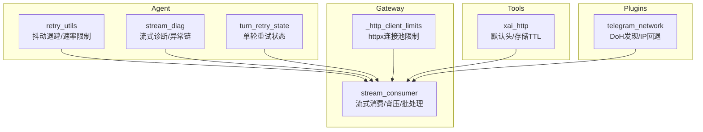
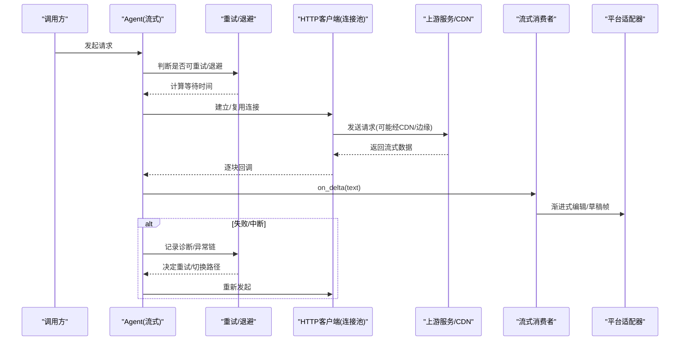
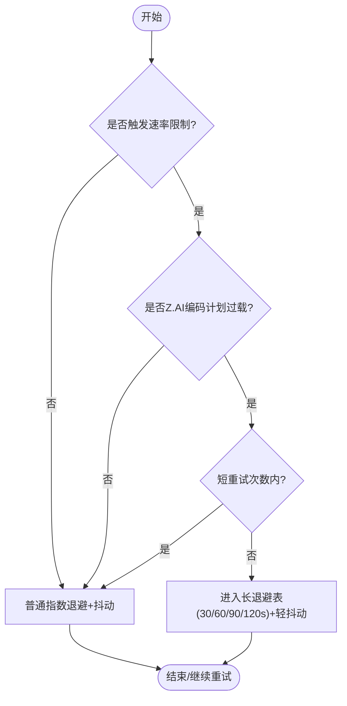
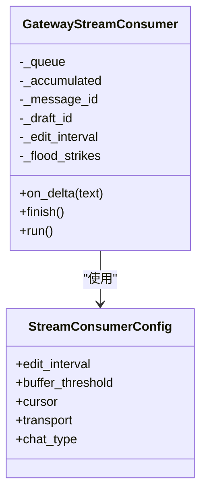
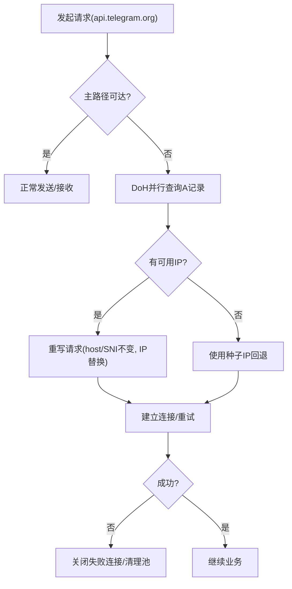
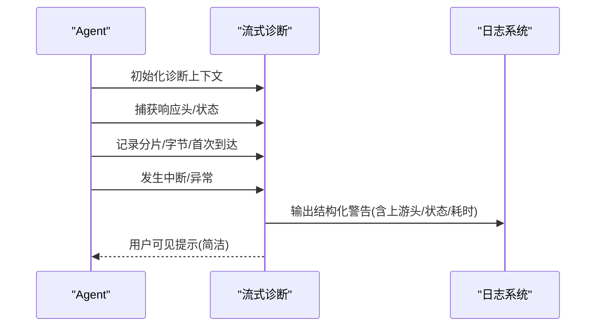
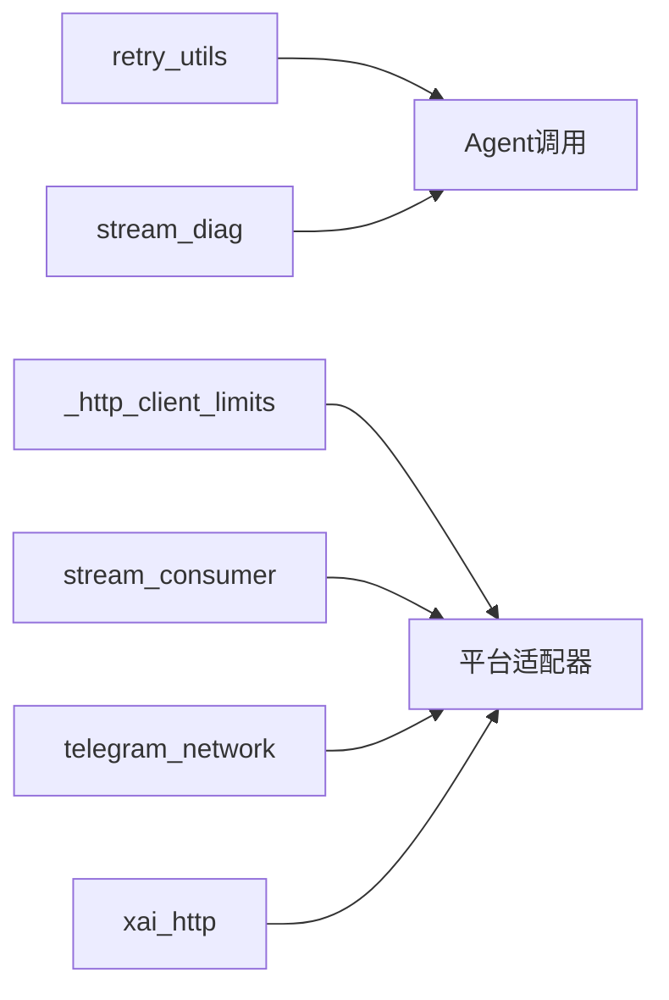

# 网络性能优化

<cite>
**本文引用的文件**
- [agent/retry_utils.py](file://agent/retry_utils.py)
- [gateway/platforms/_http_client_limits.py](file://gateway/platforms/_http_client_limits.py)
- [tools/xai_http.py](file://tools/xai_http.py)
- [agent/stream_diag.py](file://agent/stream_diag.py)
- [plugins/platforms/telegram/telegram_network.py](file://plugins/platforms/telegram/telegram_network.py)
- [agent/turn_retry_state.py](file://agent/turn_retry_state.py)
- [gateway/stream_consumer.py](file://gateway/stream_consumer.py)
</cite>

## 目录
1. [简介](#简介)
2. [项目结构](#项目结构)
3. [核心组件](#核心组件)
4. [架构总览](#架构总览)
5. [详细组件分析](#详细组件分析)
6. [依赖关系分析](#依赖关系分析)
7. [性能考量](#性能考量)
8. [故障排查指南](#故障排查指南)
9. [结论](#结论)
10. [附录](#附录)

## 简介
本指南面向在复杂网络环境下运行的高并发、流式AI网关与平台适配器，聚焦以下目标：
- API调用性能优化：连接池配置、请求重试机制、超时设置。
- 流式传输优化：WebSocket/长连接管理、消息批处理、背压控制。
- 网络延迟分析与调优：DNS解析优化、TCP连接复用、HTTP/2相关实践。
- 大文件与媒体数据处理：分块上传、断点续传、并发下载。
- CDN集成与边缘计算：缓存策略、就近接入、回源优化。
- 监控与诊断：可观测性指标、错误归因、定位链路瓶颈。

本仓库中已实现多项关键能力（如抖动退避重试、HTTP客户端连接池限制、流式诊断、Telegram DoH回退等），本文将基于这些实现提炼为可操作的优化指南。

## 项目结构
与网络性能相关的代码主要分布在以下模块：
- agent层：重试与流式诊断、会话级重试状态管理。
- gateway层：流式消费者（平台消息编辑/草稿）、HTTP客户端连接池限制。
- tools层：第三方HTTP集成（如xAI）的默认头、存储TTL等。
- plugins层：特定平台的网络回退（如Telegram DoH与IP回退）。

图表来源
- [agent/retry_utils.py:1-209](file://agent/retry_utils.py#L1-L209)
- [agent/stream_diag.py:1-281](file://agent/stream_diag.py#L1-L281)
- [agent/turn_retry_state.py:1-94](file://agent/turn_retry_state.py#L1-L94)
- [gateway/platforms/_http_client_limits.py:1-85](file://gateway/platforms/_http_client_limits.py#L1-L85)
- [gateway/stream_consumer.py:1-800](file://gateway/stream_consumer.py#L1-L800)
- [tools/xai_http.py:1-330](file://tools/xai_http.py#L1-L330)
- [plugins/platforms/telegram/telegram_network.py:1-306](file://plugins/platforms/telegram/telegram_network.py#L1-L306)

章节来源
- [agent/retry_utils.py:1-209](file://agent/retry_utils.py#L1-L209)
- [gateway/platforms/_http_client_limits.py:1-85](file://gateway/platforms/_http_client_limits.py#L1-L85)
- [tools/xai_http.py:1-330](file://tools/xai_http.py#L1-L330)
- [agent/stream_diag.py:1-281](file://agent/stream_diag.py#L1-L281)
- [plugins/platforms/telegram/telegram_network.py:1-306](file://plugins/platforms/telegram/telegram_network.py#L1-L306)
- [agent/turn_retry_state.py:1-94](file://agent/turn_retry_state.py#L1-L94)
- [gateway/stream_consumer.py:1-800](file://gateway/stream_consumer.py#L1-L800)

## 核心组件
- 抖动退避重试：通过指数退避+随机抖动避免“惊群”重试；支持按供应商/模型的特殊速率限制策略。
- HTTP客户端连接池限制：针对长期存活的平台适配器，收紧keepalive过期时间，降低FD压力。
- 流式诊断：捕获上游响应头、HTTP状态、字节/分片计数、首次到达时间，辅助定位上游边缘节点或下游提供商问题。
- Telegram DoH回退：当主路径不可达时，通过DoH发现可用IPv4并维持SNI/Host不变进行重连。
- 会话级重试状态：将多种恢复分支（认证刷新、压缩重启、格式修复等）收敛到单一状态对象，避免重复尝试。
- 流式消费者：将同步回调转为异步任务，缓冲、限速、渐进式编辑消息，提供背压与批处理。

章节来源
- [agent/retry_utils.py:1-209](file://agent/retry_utils.py#L1-L209)
- [gateway/platforms/_http_client_limits.py:1-85](file://gateway/platforms/_http_client_limits.py#L1-L85)
- [agent/stream_diag.py:1-281](file://agent/stream_diag.py#L1-L281)
- [plugins/platforms/telegram/telegram_network.py:1-306](file://plugins/platforms/telegram/telegram_network.py#L1-L306)
- [agent/turn_retry_state.py:1-94](file://agent/turn_retry_state.py#L1-L94)
- [gateway/stream_consumer.py:1-800](file://gateway/stream_consumer.py#L1-L800)

## 架构总览
下图展示了从API调用到流式输出的整体链路，以及各优化点在其中的位置。

图表来源
- [agent/retry_utils.py:1-209](file://agent/retry_utils.py#L1-L209)
- [agent/stream_diag.py:1-281](file://agent/stream_diag.py#L1-L281)
- [gateway/platforms/_http_client_limits.py:1-85](file://gateway/platforms/_http_client_limits.py#L1-L85)
- [gateway/stream_consumer.py:1-800](file://gateway/stream_consumer.py#L1-L800)
- [plugins/platforms/telegram/telegram_network.py:1-306](file://plugins/platforms/telegram/telegram_network.py#L1-L306)

## 详细组件分析

### API调用性能优化：连接池、重试、超时
- 连接池配置
  - 使用紧凑的keepalive过期时间与最大空闲连接数，减少代理/CLOSE_WAIT导致的FD耗尽风险。
  - 可通过环境变量调整过期时间和最大空闲连接数，以适配不同负载。
- 重试机制
  - 采用抖动指数退避，避免多会话同时重试造成“惊群”。
  - 对特定供应商过载场景（如Z.AI Coding Plan GLM-5.2）采用自适应长退避表，前若干次短重试后进入更长等待窗口。
  - 支持解析Retry-After头部，尊重服务端限流指示。
- 超时设置
  - 对DoH查询等辅助网络操作设置明确超时，避免阻塞主流程。
  - 对平台适配器长连接，合理缩短keepalive以避免僵尸连接占用资源。

图表来源
- [agent/retry_utils.py:1-209](file://agent/retry_utils.py#L1-L209)

章节来源
- [gateway/platforms/_http_client_limits.py:1-85](file://gateway/platforms/_http_client_limits.py#L1-L85)
- [agent/retry_utils.py:1-209](file://agent/retry_utils.py#L1-L209)

### 流式传输优化：连接管理、消息批处理、背压控制
- 连接管理
  - 平台适配器保持长连接，配合紧凑的keepalive策略，降低FD压力。
  - 对Telegram等场景，当主路径不可达时，通过DoH发现可用IPv4并保持SNI/Host不变进行回退。
- 消息批处理
  - 流式消费者将同步回调放入队列，异步任务批量缓冲、限速，再渐进式编辑平台消息，减少频繁写放大。
  - 支持原生草稿流式（如Telegram DM），提升动画预览体验，最终落盘为真实消息。
- 背压控制
  - 通过队列与事件屏障（flush_pending_sync）保证顺序与一致性，防止UI与交互提示争抢。
  - 自适应编辑间隔与洪水控制（连续失败则降级），保障稳定性。

图表来源
- [gateway/stream_consumer.py:1-800](file://gateway/stream_consumer.py#L1-L800)

章节来源
- [gateway/stream_consumer.py:1-800](file://gateway/stream_consumer.py#L1-L800)
- [plugins/platforms/telegram/telegram_network.py:1-306](file://plugins/platforms/telegram/telegram_network.py#L1-L306)

### 网络延迟分析与调优：DNS、TCP复用、HTTP/2
- DNS解析优化
  - 通过DoH并行查询多个提供商，快速获得可达IP；系统DNS作为补充信息，不阻塞主流程。
  - 对Telegram等关键域名，维护种子IP列表作为兜底。
- TCP连接复用
  - 使用httpx长连接，结合紧凑的keepalive过期时间，平衡复用与FD占用。
  - 对失败的回退连接及时关闭释放，避免CLOSE_WAIT堆积。
- HTTP/2配置
  - 当前实现基于httpx（默认支持HTTP/2），建议在上游服务启用HTTP/2以获得多路复用与头部压缩优势；若遇到兼容性问题，可按需回退至HTTP/1.1。

图表来源
- [plugins/platforms/telegram/telegram_network.py:1-306](file://plugins/platforms/telegram/telegram_network.py#L1-L306)

章节来源
- [plugins/platforms/telegram/telegram_network.py:1-306](file://plugins/platforms/telegram/telegram_network.py#L1-L306)

### 大文件与媒体数据处理：分块上传、断点续传、并发下载
- 分块上传
  - 对媒体生成/存储接口，可配置TTL与公开URL策略，便于CDN缓存与复用。
  - 文件名包含时间戳与短标识，避免冲突。
- 断点续传
  - 建议在应用层实现分块校验与偏移记录，结合服务端支持的Range/Resume能力（若可用）。
- 并发下载
  - 对静态资源/媒体，结合CDN就近分发，利用多连接并行下载；注意并发上限与背压，避免打满带宽或触发限流。

章节来源
- [tools/xai_http.py:1-330](file://tools/xai_http.py#L1-L330)

### CDN集成与边缘计算
- 将静态资源与媒体内容托管于CDN，开启缓存与边缘渲染（如图片处理、视频转码）。
- 通过User-Agent识别与自定义头，便于CDN侧做路由与统计。
- 对敏感或动态内容，使用边缘函数进行鉴权与签名验证，减少回源。

章节来源
- [tools/xai_http.py:1-330](file://tools/xai_http.py#L1-L330)

### 监控与诊断：指标采集、错误归因、链路追踪
- 流式诊断
  - 捕获上游响应头（如Cloudflare Ray ID、OpenRouter提供商/模型ID、Vercel ID等）、HTTP状态、字节/分片计数、首次到达时间。
  - 输出结构化日志，便于事后分析“哪条边缘/哪个下游提供商导致中断”。
- 异常链扁平化
  - 将多层包装异常展平为“Outer <- Inner”形式，便于快速定位底层网络错误类型。
- 用户可见提示
  - 在UI中显示简洁的重试提示，同时在日志中保留完整细节。

图表来源
- [agent/stream_diag.py:1-281](file://agent/stream_diag.py#L1-L281)

章节来源
- [agent/stream_diag.py:1-281](file://agent/stream_diag.py#L1-L281)

## 依赖关系分析
- 重试与流式诊断共同作用于Agent的调用路径，确保在失败时能优雅降级与恢复。
- 流式消费者依赖平台适配器能力（编辑/草稿），并通过队列与事件实现背压与顺序控制。
- HTTP客户端限制为所有平台适配器提供统一的连接池策略，避免FD泄漏。
- Telegram网络回退独立于主路径，仅在连接失败时介入，保持透明。

图表来源
- [agent/retry_utils.py:1-209](file://agent/retry_utils.py#L1-L209)
- [agent/stream_diag.py:1-281](file://agent/stream_diag.py#L1-L281)
- [gateway/platforms/_http_client_limits.py:1-85](file://gateway/platforms/_http_client_limits.py#L1-L85)
- [gateway/stream_consumer.py:1-800](file://gateway/stream_consumer.py#L1-L800)
- [plugins/platforms/telegram/telegram_network.py:1-306](file://plugins/platforms/telegram/telegram_network.py#L1-L306)
- [tools/xai_http.py:1-330](file://tools/xai_http.py#L1-L330)

章节来源
- [agent/retry_utils.py:1-209](file://agent/retry_utils.py#L1-L209)
- [agent/stream_diag.py:1-281](file://agent/stream_diag.py#L1-L281)
- [gateway/platforms/_http_client_limits.py:1-85](file://gateway/platforms/_http_client_limits.py#L1-L85)
- [gateway/stream_consumer.py:1-800](file://gateway/stream_consumer.py#L1-L800)
- [plugins/platforms/telegram/telegram_network.py:1-306](file://plugins/platforms/telegram/telegram_network.py#L1-L306)
- [tools/xai_http.py:1-330](file://tools/xai_http.py#L1-L330)

## 性能考量
- 连接池与FD管理
  - 缩短keepalive过期时间，降低代理/CLOSE_WAIT导致的FD耗尽风险；根据负载调整最大空闲连接数。
- 重试策略
  - 使用抖动退避，避免多会话同时重试；对特定供应商过载场景采用长退避表，提升用户体验。
- 流式批处理与背压
  - 通过队列缓冲与限速，减少频繁写放大；使用事件屏障保证顺序与一致性。
- DNS与连接复用
  - 使用DoH快速发现可达IP；复用长连接，但及时关闭失败连接，避免资源泄漏。
- CDN与边缘
  - 将静态与媒体资源置于CDN，开启缓存与边缘处理；对动态内容使用边缘函数进行鉴权与签名。

[本节为通用指导，无需具体文件引用]

## 故障排查指南
- 流式中断定位
  - 查看流式诊断日志中的上游头（cf-ray、x-openrouter-provider等）、HTTP状态、字节/分片计数、首次到达时间，判断是否为某边缘节点或下游提供商问题。
- 重试与退避
  - 检查是否命中特定供应商过载策略；确认Retry-After解析是否正确。
- 连接池与FD
  - 观察是否有大量CLOSE_WAIT；必要时调整keepalive过期时间与最大空闲连接数。
- Telegram连通性
  - 若主路径不可达，确认DoH查询是否成功；检查种子IP回退是否生效。

章节来源
- [agent/stream_diag.py:1-281](file://agent/stream_diag.py#L1-L281)
- [agent/retry_utils.py:1-209](file://agent/retry_utils.py#L1-L209)
- [gateway/platforms/_http_client_limits.py:1-85](file://gateway/platforms/_http_client_limits.py#L1-L85)
- [plugins/platforms/telegram/telegram_network.py:1-306](file://plugins/platforms/telegram/telegram_network.py#L1-L306)

## 结论
通过在连接池、重试、流式批处理与背压、DNS与连接复用、CDN与边缘等方面采取系统化优化，可显著提升在高并发与不稳定网络环境下的API调用与流式传输性能。结合完善的监控与诊断能力，能够快速定位并解决上游边缘与下游提供商问题，保障用户体验与服务稳定性。

[本节为总结，无需具体文件引用]

## 附录
- 环境变量参考
  - SPARKII_GATEWAY_HTTPX_KEEPALIVE_EXPIRY：调整keepalive过期时间（秒）。
  - SPARKII_GATEWAY_HTTPX_MAX_KEEPALIVE：调整最大空闲连接数。
- 配置建议
  - 在高FD限制环境中可适当放宽max_keepalive_connections；在受限环境（如macOS+代理）建议缩短keepalive_expiry。
  - 对特定供应商过载场景，结合重试策略与长退避表，平衡成功率与用户体验。

[本节为补充说明，无需具体文件引用]