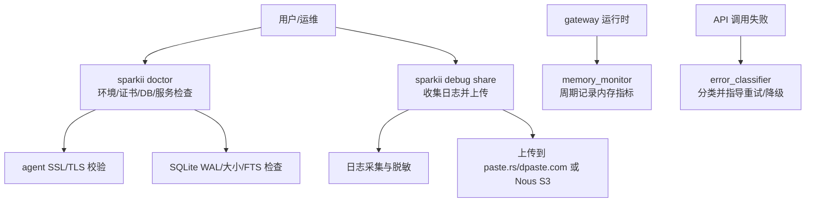
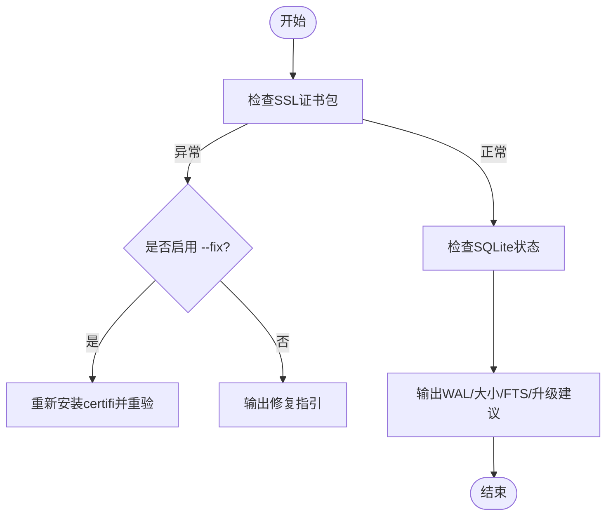
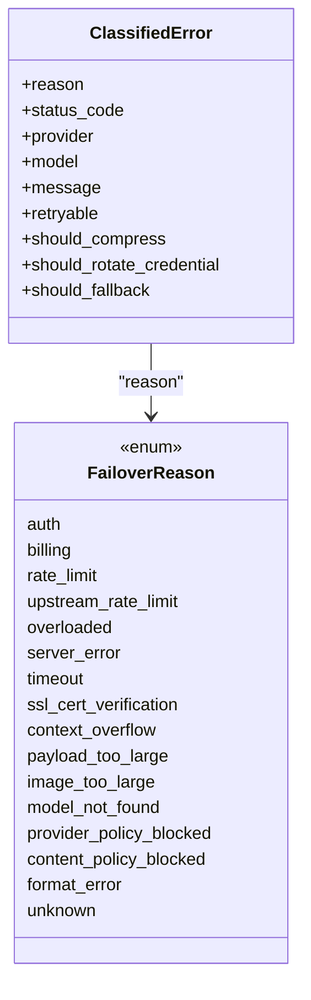
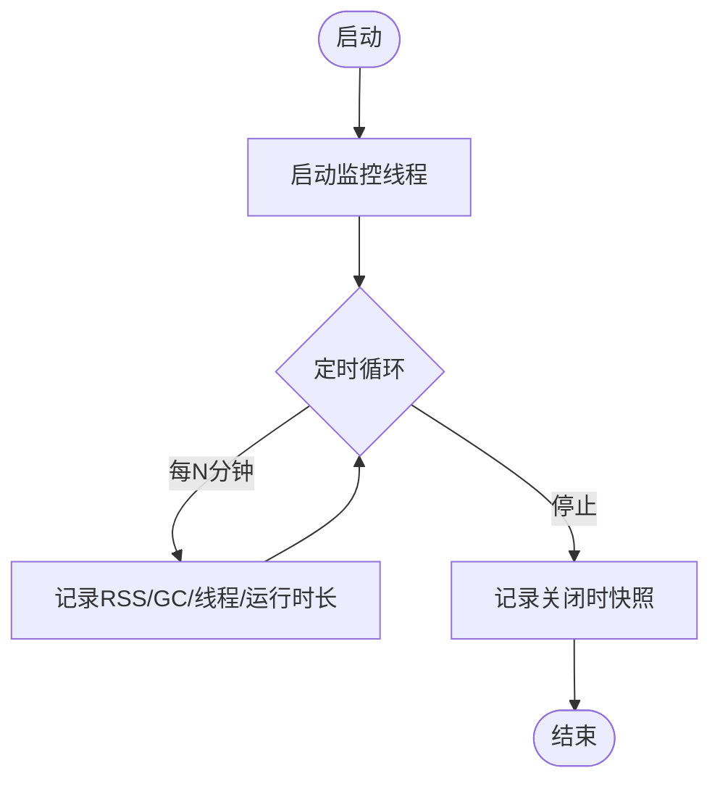
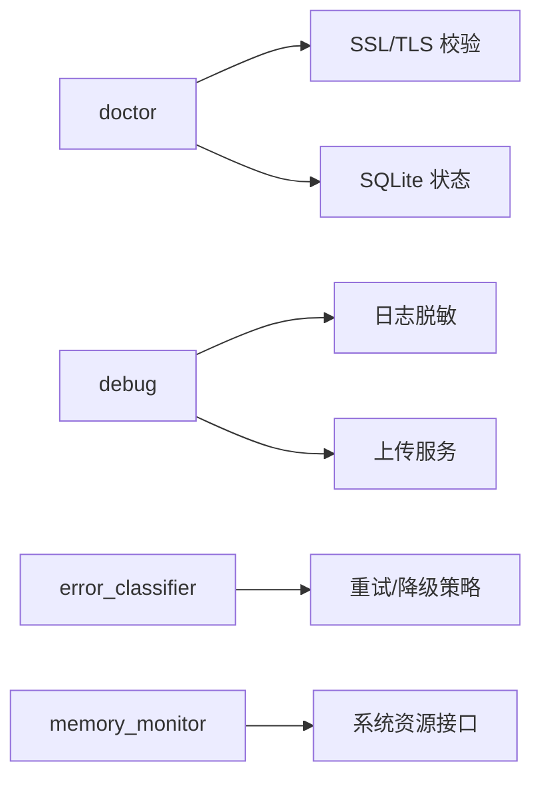

# 故障排除

<cite>
**本文引用的文件**
- [sparkii_cli/doctor.py](file://sparkii_cli/doctor.py)
- [agent/errors.py](file://agent/errors.py)
- [agent/error_classifier.py](file://agent/error_classifier.py)
- [sparkii_cli/debug.py](file://sparkii_cli/debug.py)
- [gateway/memory_monitor.py](file://gateway/memory_monitor.py)
- [sparkii_cli/diagnostics_upload.py](file://sparkii_cli/diagnostics_upload.py)
</cite>

## 目录
1. [简介](#简介)
2. [项目结构](#项目结构)
3. [核心组件](#核心组件)
4. [架构总览](#架构总览)
5. [详细组件分析](#详细组件分析)
6. [依赖关系分析](#依赖关系分析)
7. [性能注意事项](#性能注意事项)
8. [故障排除指南](#故障排除指南)
9. [结论](#结论)
10. [附录](#附录)

## 简介
本指南面向安装、配置与运行阶段出现的常见问题，提供系统化的错误诊断方法（日志分析、性能监控、状态检查），并说明如何使用诊断工具与命令（如 doctor、debug share）定位问题。同时涵盖网络相关问题的排查与优化、社区支持与问题报告最佳实践，以及常见错误代码对照表与解决步骤。

## 项目结构
围绕故障排除的关键模块分布如下：
- 诊断与健康检查：doctor（环境、证书、数据库、服务状态等）
- 调试与日志上报：debug（收集日志、脱敏、上传到公共或私有存储）
- 错误分类与自动恢复：error_classifier（按原因分类并给出重试/降级策略）
- 内存监控：memory_monitor（周期性记录 RSS/GC/线程数，辅助发现内存泄漏）
- 诊断数据上传：diagnostics_upload（将打包后的诊断数据上传至内部 S3）



**图示来源**
- [sparkii_cli/doctor.py:646-730](file://sparkii_cli/doctor.py#L646-L730)
- [sparkii_cli/debug.py:583-711](file://sparkii_cli/debug.py#L583-L711)
- [gateway/memory_monitor.py:139-193](file://gateway/memory_monitor.py#L139-L193)
- [agent/error_classifier.py:624-717](file://agent/error_classifier.py#L624-L717)

**章节来源**
- [sparkii_cli/doctor.py:646-730](file://sparkii_cli/doctor.py#L646-L730)
- [sparkii_cli/debug.py:583-711](file://sparkii_cli/debug.py#L583-L711)
- [gateway/memory_monitor.py:139-193](file://gateway/memory_monitor.py#L139-L193)
- [agent/error_classifier.py:624-717](file://agent/error_classifier.py#L624-L717)

## 核心组件
- 健康检查（doctor）
  - 验证 SSL CA 证书包是否可用，支持 --fix 自动修复
  - 检测 SQLite 数据库的 journal mode、大小、WAL 风险，并提供升级建议
  - 检查 systemd linger、s6 监督状态、版本一致性、弃用配置项与环境变量
- 调试与日志上报（debug）
  - 采集 agent/gateway/gui/desktop 日志尾部与完整日志，自动脱敏敏感信息
  - 上传到公共粘贴服务或内部 S3（--nous），支持过期清理
- 错误分类（error_classifier）
  - 对 API 错误进行结构化分类（认证、配额、限流、过载、SSL、上下文溢出、模型不存在、内容策略拦截等）
  - 输出可执行的重试/降级/压缩/轮换凭据等动作提示
- 内存监控（memory_monitor）
  - 后台线程周期性记录 RSS、GC 计数、线程数与运行时长，便于发现内存泄漏
- 诊断上传（diagnostics_upload）
  - 通过 NAS 签发临时上传 URL，安全上传 gzip 包到内部 S3，供支持团队查看

**章节来源**
- [sparkii_cli/doctor.py:646-730](file://sparkii_cli/doctor.py#L646-L730)
- [sparkii_cli/debug.py:583-711](file://sparkii_cli/debug.py#L583-L711)
- [agent/error_classifier.py:22-93](file://agent/error_classifier.py#L22-L93)
- [gateway/memory_monitor.py:139-193](file://gateway/memory_monitor.py#L139-L193)
- [sparkii_cli/diagnostics_upload.py:42-139](file://sparkii_cli/diagnostics_upload.py#L42-L139)

## 架构总览
下图展示了从“异常发生”到“诊断与修复”的端到端流程：

```mermaid
sequenceDiagram
participant U as "用户"
participant CLI as "sparkii CLI"
participant DOC as "doctor"
DBG as "debug"
EC as "error_classifier"
MM as "memory_monitor"
NET as "外部网络/代理"
DB as "SQLite"
U->>CLI : 运行 sparkii doctor / debug share
CLI->>DOC : 检查 SSL/DB/服务/配置
DOC->>NET : 验证证书链/连通性
DOC->>DB : 读取journal模式/大小
CLI->>DBG : 采集日志并脱敏
DBG->>NET : 上传到粘贴服务或S3
U->>CLI : 发起API调用
CLI->>EC : 捕获异常并分类
EC-->>CLI : 返回重试/降级/压缩/轮换建议
CLI->>MM : 启动内存监控可选
MM-->>CLI : 定期输出[RMEMORY]行
```

**图示来源**
- [sparkii_cli/doctor.py:646-730](file://sparkii_cli/doctor.py#L646-L730)
- [sparkii_cli/debug.py:583-711](file://sparkii_cli/debug.py#L583-L711)
- [agent/error_classifier.py:624-717](file://agent/error_classifier.py#L624-L717)
- [gateway/memory_monitor.py:139-193](file://gateway/memory_monitor.py#L139-L193)

## 详细组件分析

### 健康检查（doctor）
- 功能要点
  - SSL CA 证书校验与自动修复（--fix）
  - SQLite 数据库健康：journal mode、大小阈值告警、WAL 风险与修复提示
  - 服务状态：systemd linger、s6 监督、版本一致性、弃用配置/环境变量提示
- 典型输出
  - 成功/警告/失败三类提示，附带修复建议
- 适用场景
  - 首次安装后无法联网、证书错误、数据库过大导致性能下降、服务退出后不再自启动



**图示来源**
- [sparkii_cli/doctor.py:646-730](file://sparkii_cli/doctor.py#L646-L730)
- [sparkii_cli/doctor.py:156-199](file://sparkii_cli/doctor.py#L156-L199)

**章节来源**
- [sparkii_cli/doctor.py:646-730](file://sparkii_cli/doctor.py#L646-L730)
- [sparkii_cli/doctor.py:156-199](file://sparkii_cli/doctor.py#L156-L199)

### 调试与日志上报（debug）
- 功能要点
  - 采集多类日志（agent/gateway/gui/desktop），支持尾部与完整日志
  - 上传前强制脱敏敏感信息，避免泄露密钥与个人信息
  - 支持上传到公共粘贴服务或内部 S3（--nous），并自动清理过期条目
- 使用建议
  - 遇到问题先本地查看报告（--local），再选择公开或私有上传
  - 若网络受限，优先使用 --nous 走受控通道

```mermaid
sequenceDiagram
participant U as "用户"
participant D as "debug"
P as "粘贴服务/S3"
U->>D : sparkii debug share [--no-redact|--nous]
D->>D : 采集日志并脱敏
alt 公共粘贴
D->>P : POST/PUT 上传
P-->>D : 返回URL
else 内部S3
D->>P : 请求签名上传URL
D->>P : PUT 压缩包
P-->>D : 返回查看链接
end
D-->>U : 输出报告与链接
```

**图示来源**
- [sparkii_cli/debug.py:583-711](file://sparkii_cli/debug.py#L583-L711)
- [sparkii_cli/diagnostics_upload.py:42-139](file://sparkii_cli/diagnostics_upload.py#L42-L139)

**章节来源**
- [sparkii_cli/debug.py:583-711](file://sparkii_cli/debug.py#L583-L711)
- [sparkii_cli/diagnostics_upload.py:42-139](file://sparkii_cli/diagnostics_upload.py#L42-L139)

### 错误分类与自动恢复（error_classifier）
- 功能要点
  - 将异常归类为认证、配额、限流、过载、SSL、上下文溢出、模型不存在、内容策略拦截等
  - 输出重试、压缩、轮换凭据、回退模型等动作建议
- 适用场景
  - 401/403 认证失败、402 欠费、429 限流、5xx 过载、TLS 证书错误、上下文过大、模型不可用、内容被安全策略拒绝



**图示来源**
- [agent/error_classifier.py:22-93](file://agent/error_classifier.py#L22-L93)

**章节来源**
- [agent/error_classifier.py:22-93](file://agent/error_classifier.py#L22-L93)
- [agent/error_classifier.py:624-717](file://agent/error_classifier.py#L624-L717)

### 内存监控（memory_monitor）
- 功能要点
  - 后台线程每 N 分钟记录一次 RSS、GC 计数、线程数与运行时长
  - 启动时记录基线，关闭时记录最终快照，便于对比趋势
- 适用场景
  - 长时间运行的 gateway 进程疑似内存泄漏；需要定位缓慢增长的 RSS



**图示来源**
- [gateway/memory_monitor.py:139-193](file://gateway/memory_monitor.py#L139-L193)
- [gateway/memory_monitor.py:196-231](file://gateway/memory_monitor.py#L196-L231)

**章节来源**
- [gateway/memory_monitor.py:139-193](file://gateway/memory_monitor.py#L139-L193)
- [gateway/memory_monitor.py:196-231](file://gateway/memory_monitor.py#L196-L231)

## 依赖关系分析
- doctor 依赖 SSL 校验与 SQLite 状态读取，必要时触发 pip 重装 certifi
- debug 依赖日志路径解析、脱敏与上传服务（公共粘贴或内部 S3）
- error_classifier 依赖 HTTP 状态码、错误体与消息模式匹配，驱动上层重试/降级逻辑
- memory_monitor 依赖系统资源接口（resource/psutil）以获取 RSS



**图示来源**
- [sparkii_cli/doctor.py:646-730](file://sparkii_cli/doctor.py#L646-L730)
- [sparkii_cli/debug.py:583-711](file://sparkii_cli/debug.py#L583-L711)
- [agent/error_classifier.py:624-717](file://agent/error_classifier.py#L624-L717)
- [gateway/memory_monitor.py:139-193](file://gateway/memory_monitor.py#L139-L193)

**章节来源**
- [sparkii_cli/doctor.py:646-730](file://sparkii_cli/doctor.py#L646-L730)
- [sparkii_cli/debug.py:583-711](file://sparkii_cli/debug.py#L583-L711)
- [agent/error_classifier.py:624-717](file://agent/error_classifier.py#L624-L717)
- [gateway/memory_monitor.py:139-193](file://gateway/memory_monitor.py#L139-L193)

## 性能注意事项
- 内存泄漏排查
  - 观察 gateway 日志中的 [MEMORY] 行，关注 RSS 随时间的增长趋势
  - 结合 GC 计数与线程数变化，判断是否存在对象未释放或线程泄漏
- CPU 瓶颈定位
  - 在高频调用场景下，结合 error_classifier 的分类结果，减少无效重试与重复压缩
  - 对大上下文请求，优先采用压缩与分片策略，避免频繁触发上下文溢出
- 网络延迟优化
  - 使用 doctor 验证证书链与代理设置，确保 TLS 握手稳定
  - 对限流与过载错误，遵循分类器建议进行退避与切换模型/提供商

[本节为通用指导，不直接分析具体文件]

## 故障排除指南

### 安装问题
- 症状
  - 首次运行报 SSL 证书错误、依赖缺失、路径不正确
- 处理步骤
  - 运行健康检查：sparkii doctor
  - 若证书损坏，使用 --fix 自动修复；否则手动重装证书包
  - 检查 Python/Node 环境与 PATH，确认安装方式与更新命令
- 参考
  - 证书校验与修复：[sparkii_cli/doctor.py:646-730](file://sparkii_cli/doctor.py#L646-L730)

**章节来源**
- [sparkii_cli/doctor.py:646-730](file://sparkii_cli/doctor.py#L646-L730)

### 配置错误
- 症状
  - 弃用配置键或环境变量导致行为异常
- 处理步骤
  - 运行 doctor 查看弃用项提示，按建议迁移到新配置键
  - 核对 .env 与 config.yaml 的一致性，避免桥接变量误报
- 参考
  - 弃用配置与环境变量检测：[sparkii_cli/doctor.py:420-515](file://sparkii_cli/doctor.py#L420-L515)

**章节来源**
- [sparkii_cli/doctor.py:420-515](file://sparkii_cli/doctor.py#L420-L515)

### 运行时异常
- 症状
  - API 调用失败、超时、限流、认证失败、上下文溢出、模型不存在、内容策略拦截
- 处理步骤
  - 查看错误分类结果，按建议执行重试、压缩、轮换凭据或切换模型/提供商
  - 对 SSL 错误，优先使用 doctor 校验证书链与代理设置
- 参考
  - 错误分类与恢复建议：[agent/error_classifier.py:624-717](file://agent/error_classifier.py#L624-L717)
  - SSL 配置错误类型：[agent/errors.py:1-14](file://agent/errors.py#L1-L14)

**章节来源**
- [agent/error_classifier.py:624-717](file://agent/error_classifier.py#L624-L717)
- [agent/errors.py:1-14](file://agent/errors.py#L1-L14)

### 日志分析与状态检查
- 症状
  - 难以定位问题根因，需收集最近日志与系统状态
- 处理步骤
  - 使用 debug share 收集报告与日志，默认脱敏；必要时使用 --no-redact 保留原始内容
  - 如需内部审核，使用 --nous 上传到私有存储
  - 检查 gateway 的 [MEMORY] 行，评估内存趋势
- 参考
  - 日志采集与上传：[sparkii_cli/debug.py:583-711](file://sparkii_cli/debug.py#L583-L711)
  - 内存监控：[gateway/memory_monitor.py:139-193](file://gateway/memory_monitor.py#L139-L193)

**章节来源**
- [sparkii_cli/debug.py:583-711](file://sparkii_cli/debug.py#L583-L711)
- [gateway/memory_monitor.py:139-193](file://gateway/memory_monitor.py#L139-L193)

### 性能问题排查与优化
- 内存泄漏检测
  - 持续观察 [MEMORY] 行，识别 RSS 持续增长；结合 GC 与线程数变化定位可疑模块
- CPU 瓶颈分析
  - 减少无效重试与重复压缩；对大上下文请求采用压缩与分片
- 网络延迟优化
  - 使用 doctor 校验证书链与代理；对限流/过载错误采用退避与切换策略

[本节为通用指导，不直接分析具体文件]

### 网络相关问题
- 症状
  - API 连接失败、平台集成问题、防火墙/代理配置不当
- 处理步骤
  - 使用 doctor 校验 SSL 证书包与代理设置
  - 对认证失败与限流错误，依据 error_classifier 的建议轮换凭据或切换提供商
  - 若企业网络限制，优先使用 --nous 上传诊断数据
- 参考
  - 证书校验与修复：[sparkii_cli/doctor.py:646-730](file://sparkii_cli/doctor.py#L646-L730)
  - 错误分类（含 SSL 与限流）：[agent/error_classifier.py:624-717](file://agent/error_classifier.py#L624-L717)
  - 内部上传：[sparkii_cli/diagnostics_upload.py:42-139](file://sparkii_cli/diagnostics_upload.py#L42-L139)

**章节来源**
- [sparkii_cli/doctor.py:646-730](file://sparkii_cli/doctor.py#L646-L730)
- [agent/error_classifier.py:624-717](file://agent/error_classifier.py#L624-L717)
- [sparkii_cli/diagnostics_upload.py:42-139](file://sparkii_cli/diagnostics_upload.py#L42-L139)

### 社区支持与问题报告最佳实践
- 收集信息
  - 使用 debug share 生成报告与日志，默认脱敏；必要时使用 --no-redact
  - 如需内部审核，使用 --nous 上传到私有存储
- 报告格式
  - 附上 doctor 输出、最近日志片段、错误分类结果与复现步骤
- 隐私与安全
  - 默认脱敏已移除敏感信息；公开粘贴会包含部分非敏感个人信息，注意链接传播范围

**章节来源**
- [sparkii_cli/debug.py:583-711](file://sparkii_cli/debug.py#L583-L711)
- [sparkii_cli/diagnostics_upload.py:42-139](file://sparkii_cli/diagnostics_upload.py#L42-L139)

### 常见错误代码对照表与解决步骤
- 认证失败（401/403）
  - 现象：认证或授权失败
  - 处理：轮换凭据或刷新令牌；检查代理与证书链
  - 参考：[agent/error_classifier.py:624-717](file://agent/error_classifier.py#L624-L717)
- 欠费/配额耗尽（402）
  - 现象：账户余额不足或配额耗尽
  - 处理：充值或切换提供商；检查订阅状态
  - 参考：[agent/error_classifier.py:624-717](file://agent/error_classifier.py#L624-L717)
- 限流（429）
  - 现象：请求频率过高或被节流
  - 处理：退避重试；必要时切换到其他模型/提供商
  - 参考：[agent/error_classifier.py:624-717](file://agent/error_classifier.py#L624-L717)
- 服务器过载（503/529）
  - 现象：上游服务过载
  - 处理：退避重试；避免频繁轮换凭据
  - 参考：[agent/error_classifier.py:624-717](file://agent/error_classifier.py#L624-L717)
- SSL/TLS 证书错误
  - 现象：证书链验证失败
  - 处理：使用 doctor 校验并修复；检查代理与企业 CA
  - 参考：[sparkii_cli/doctor.py:646-730](file://sparkii_cli/doctor.py#L646-L730)、[agent/errors.py:1-14](file://agent/errors.py#L1-L14)
- 上下文溢出
  - 现象：请求过长或 token 超限
  - 处理：压缩上下文；降低 max_tokens；拆分请求
  - 参考：[agent/error_classifier.py:624-717](file://agent/error_classifier.py#L624-L717)
- 模型不存在
  - 现象：模型 ID 无效或不支持工具调用
  - 处理：切换模型或提供商；检查模型前缀
  - 参考：[agent/error_classifier.py:624-717](file://agent/error_classifier.py#L624-L717)
- 内容策略拦截
  - 现象：安全策略拒绝生成
  - 处理：调整输入内容；切换模型或提供商
  - 参考：[agent/error_classifier.py:624-717](file://agent/error_classifier.py#L624-L717)

**章节来源**
- [agent/error_classifier.py:624-717](file://agent/error_classifier.py#L624-L717)
- [sparkii_cli/doctor.py:646-730](file://sparkii_cli/doctor.py#L646-L730)
- [agent/errors.py:1-14](file://agent/errors.py#L1-L14)

## 结论
通过 doctor 的健康检查、debug 的日志采集与上传、error_classifier 的错误分类与恢复建议，以及 memory_monitor 的内存监控，可以系统化地定位与解决安装、配置、运行时与性能问题。结合网络优化与社区支持流程，能够显著提升问题定位效率与用户体验。

[本节为总结，不直接分析具体文件]

## 附录
- 常用命令速查
  - 健康检查：sparkii doctor
  - 修复证书：sparkii doctor --fix
  - 收集并上传日志：sparkii debug share
  - 仅本地查看报告：sparkii debug share --local
  - 上传到内部存储：sparkii debug share --nous
- 关键日志关键字
  - 内存监控：[MEMORY]
  - 错误分类：根据 error_classifier 输出的原因与建议
  - 证书错误：SSL/TLS 相关提示

[本节为补充信息，不直接分析具体文件]