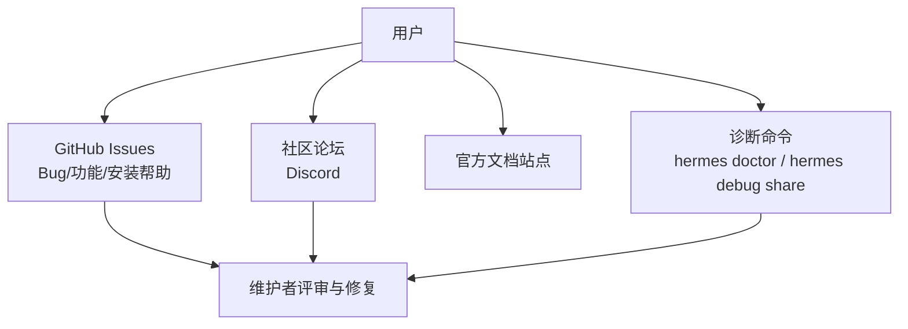
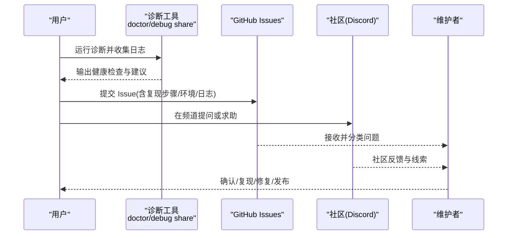
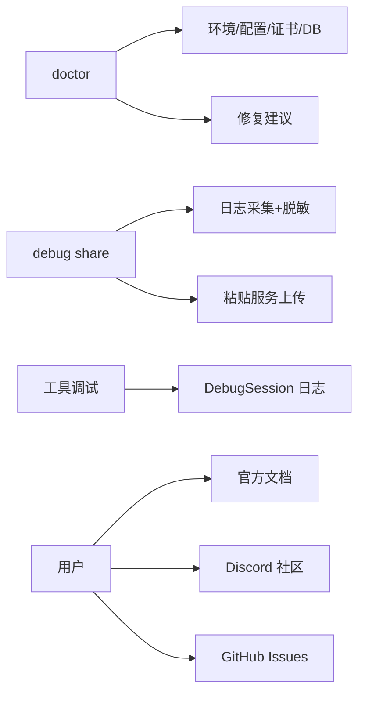

# 社区支持

<cite>
**本文引用的文件**
- [README.md](file://README.md)
- [CONTRIBUTING.md](file://CONTRIBUTING.md)
- [SECURITY.md](file://SECURITY.md)
- [.github/ISSUE_TEMPLATE/bug_report.yml](file://.github/ISSUE_TEMPLATE/bug_report.yml)
- [.github/ISSUE_TEMPLATE/feature_request.yml](file://.github/ISSUE_TEMPLATE/feature_request.yml)
- [.github/ISSUE_TEMPLATE/setup_help.yml](file://.github/ISSUE_TEMPLATE/setup_help.yml)
- [.github/PULL_REQUEST_TEMPLATE.md](file://.github/PULL_REQUEST_TEMPLATE.md)
- [sparkii_cli/debug.py](file://sparkii_cli/debug.py)
- [sparkii_cli/doctor.py](file://sparkii_cli/doctor.py)
- [tools/debug_helpers.py](file://tools/debug_helpers.py)
</cite>

## 目录
1. [简介](#简介)
2. [项目结构](#项目结构)
3. [核心组件](#核心组件)
4. [架构总览](#架构总览)
5. [详细组件分析](#详细组件分析)
6. [依赖关系分析](#依赖关系分析)
7. [性能与稳定性考量](#性能与稳定性考量)
8. [故障排查指南](#故障排查指南)
9. [版本升级与迁移](#版本升级与迁移)
10. [结论](#结论)
11. [附录：模板与清单](#附录模板与清单)

## 简介
本指南面向用户与贡献者，系统化说明如何获取官方支持与社区帮助、如何提交高质量问题报告、如何参与贡献、如何使用调试工具与资源、如何加入开发者社区，以及如何进行版本升级与迁移并处理向后兼容性问题。内容基于仓库中的文档、Issue 模板、PR 模板与安全策略，确保可操作且与代码库保持一致。

## 项目结构
围绕“社区支持”的关键位置包括：
- 文档与入口：根级 README 提供安装、快速开始、文档链接、社区渠道（Discord、Issues）等。
- 贡献流程：CONTRIBUTING 明确贡献优先级、开发环境、测试、跨平台注意事项与技能/工具规范。
- 安全与漏洞上报：SECURITY 定义信任边界、上报渠道与范围。
- Issue/PR 模板：.github 下提供 Bug、功能请求、安装帮助模板与 PR 模板，统一信息收集与复现步骤。
- 诊断与调试：CLI 的 doctor 与 debug share 能力，以及工具侧的 DebugSession 日志记录。

章节来源
- [README.md:105-184](file://README.md#L105-L184)
- [README.md:217-257](file://README.md#L217-L257)

## 核心组件
- 问题报告与模板：通过 .github/ISSUE_TEMPLATE 下的 bug_report、feature_request、setup_help 模板，标准化描述、复现步骤、环境与日志。
- 贡献与协作：CONTRIBUTING 规定贡献优先级、开发设置、测试与跨平台要求；PR 模板约束变更说明、测试与文档更新。
- 安全上报：SECURITY 指定私有上报通道与所需信息，避免公开披露敏感问题。
- 诊断与调试：
  - doctor：检查环境、配置、证书、数据库状态、过时配置与环境变量等，给出修复建议。
  - debug share：采集系统信息与日志摘要，脱敏后上传至临时粘贴服务，生成可分享链接。
  - tools/debug_helpers：为工具调用提供会话级调试日志记录，便于定位问题。

章节来源
- [.github/ISSUE_TEMPLATE/bug_report.yml:1-163](file://.github/ISSUE_TEMPLATE/bug_report.yml#L1-L163)
- [.github/ISSUE_TEMPLATE/feature_request.yml:1-86](file://.github/ISSUE_TEMPLATE/feature_request.yml#L1-L86)
- [.github/ISSUE_TEMPLATE/setup_help.yml:1-113](file://.github/ISSUE_TEMPLATE/setup_help.yml#L1-L113)
- [.github/PULL_REQUEST_TEMPLATE.md:1-76](file://.github/PULL_REQUEST_TEMPLATE.md#L1-L76)
- [SECURITY.md:7-28](file://SECURITY.md#L7-L28)
- [sparkii_cli/doctor.py:1-120](file://sparkii_cli/doctor.py#L1-L120)
- [sparkii_cli/debug.py:1-118](file://sparkii_cli/debug.py#L1-L118)
- [tools/debug_helpers.py:1-106](file://tools/debug_helpers.py#L1-L106)

## 架构总览
下图展示从用户到支持闭环的流程：用户遇到问题时，先尝试本地诊断（doctor/debug），再按模板提交 Issue；维护者在 GitHub 上评审、复现与修复；同时可通过 Discord 社区获得即时帮助。

图表来源
- [sparkii_cli/doctor.py:305-415](file://sparkii_cli/doctor.py#L305-L415)
- [sparkii_cli/debug.py:754-800](file://sparkii_cli/debug.py#L754-L800)
- [.github/ISSUE_TEMPLATE/bug_report.yml:16-103](file://.github/ISSUE_TEMPLATE/bug_report.yml#L16-L103)

## 详细组件分析

### 问题报告与最佳实践
- 使用模板：
  - Bug 报告：包含问题描述、复现步骤、期望与实际行为、受影响组件、平台、Hermes 版本、Python 版本、Debug Report 链接、操作系统、附加日志与可选根因分析与修复建议。
  - 功能请求：说明问题或使用场景、提出方案、考虑过的替代方案、类型与范围、是否愿意贡献。
  - 安装/设置帮助：描述问题、已执行步骤、安装方式、操作系统、Python/Hermes 版本、Debug Report、完整错误输出与已尝试方法。
- 必要信息收集：
  - 版本与环境：hermes version、python --version、操作系统。
  - 复现步骤：最小化可复现的命令序列与输入。
  - 日志与诊断：优先使用 hermes debug share 生成报告链接；必要时附额外 traceback。
- 日志格式化：
  - 使用内置 debug share 自动脱敏并上传，避免泄露密钥与隐私。
  - 若上传失败，使用 --local 查看本地报告或直接粘贴关键片段。

章节来源
- [.github/ISSUE_TEMPLATE/bug_report.yml:16-163](file://.github/ISSUE_TEMPLATE/bug_report.yml#L16-L163)
- [.github/ISSUE_TEMPLATE/feature_request.yml:14-86](file://.github/ISSUE_TEMPLATE/feature_request.yml#L14-L86)
- [.github/ISSUE_TEMPLATE/setup_help.yml:18-113](file://.github/ISSUE_TEMPLATE/setup_help.yml#L18-L113)
- [sparkii_cli/debug.py:754-800](file://sparkii_cli/debug.py#L754-L800)

### 贡献流程（代码、文档、问题反馈）
- 贡献优先级：缺陷修复 > 跨平台兼容性 > 安全加固 > 性能与健壮性 > 新技能 > 新工具 > 文档改进。
- 开发环境：推荐通过标准安装器克隆仓库并在受管布局下工作；也可手动克隆并使用 uv 创建独立 venv。
- 测试：推荐使用 scripts/run_tests.sh 或 pytest tests/ -v；确保本地通过后再提 PR。
- 代码风格与跨平台：遵循 PEP 8 实用约定；避免 Windows 不安全模式；使用 psutil 进行进程检测；注意路径与编码差异。
- 技能与工具：优先以 Skill 表达能力；如需深度集成才实现 Tool；遵循 SKILL.md 格式与平台声明。
- PR 模板：清晰描述变更、关联 Issue、类型、测试步骤、清单（代码、文档、跨平台影响）。

章节来源
- [CONTRIBUTING.md:7-17](file://CONTRIBUTING.md#L7-L17)
- [CONTRIBUTING.md:105-211](file://CONTRIBUTING.md#L105-L211)
- [CONTRIBUTING.md:330-400](file://CONTRIBUTING.md#L330-L400)
- [CONTRIBUTING.md:404-624](file://CONTRIBUTING.md#L404-L624)
- [CONTRIBUTING.md:676-800](file://CONTRIBUTING.md#L676-L800)
- [.github/PULL_REQUEST_TEMPLATE.md:1-76](file://.github/PULL_REQUEST_TEMPLATE.md#L1-L76)

### 安全与漏洞上报
- 私有上报：通过 GitHub Security Advisories 或安全邮箱；不要公开披露安全问题。
- 报告要素：简要描述与严重性、受影响组件（文件路径与行号）、环境信息、对 main 或最新版本的复现、触发的信任边界。
- 信任模型：唯一的安全边界是操作系统隔离；进程内启发式不是边界；插件与技能需审阅。
- 部署加固：非 root 运行、凭证保护、网络暴露限制、调用方白名单、第三方技能/插件审阅。

章节来源
- [SECURITY.md:7-28](file://SECURITY.md#L7-L28)
- [SECURITY.md:32-119](file://SECURITY.md#L32-L119)
- [SECURITY.md:226-298](file://SECURITY.md#L226-L298)
- [SECURITY.md:301-336](file://SECURITY.md#L301-L336)

### 常用调试工具与资源
- 诊断命令：
  - hermes doctor：检查环境、配置、证书、数据库状态、过时项并提供修复建议。
  - hermes debug share：采集系统信息与日志摘要，脱敏后上传并返回分享链接；支持 --local 本地查看。
- 工具级调试：
  - tools/debug_helpers.DebugSession：按工具维度启用调试会话，记录调用时序与参数，导出 JSON 日志供分析。
- 在线资源：
  - 官方文档站点：安装、配置、网关、工具、技能、架构、贡献等。
  - Discord 社区：快速问答与经验分享。
  - Skills Hub：发现与安装社区技能。

章节来源
- [sparkii_cli/doctor.py:305-415](file://sparkii_cli/doctor.py#L305-L415)
- [sparkii_cli/debug.py:1-118](file://sparkii_cli/debug.py#L1-L118)
- [tools/debug_helpers.py:36-106](file://tools/debug_helpers.py#L36-L106)
- [README.md:163-184](file://README.md#L163-L184)
- [README.md:250-257](file://README.md#L250-L257)

### 学习资源与培训材料
- 官方文档：快速开始、CLI、配置、网关、安全、工具与工具集、技能系统、记忆、MCP、定时任务、上下文文件、架构、贡献、CLI 参考、环境变量。
- 教程与实践：通过 CLI 与网关示例练习；结合 Skills Hub 探索社区技能；在 Discord 中交流案例。
- 视频与案例：可在社区频道获取由社区分享的实战案例与经验总结。

章节来源
- [README.md:163-184](file://README.md#L163-L184)
- [README.md:250-257](file://README.md#L250-L257)

### 加入开发者社区与获取技术支持
- Discord：加入讨论区，获取即时帮助与经验分享。
- GitHub Issues：提交问题与功能请求，使用模板保证信息完整。
- 贡献者通道：阅读 CONTRIBUTING 与 PR 模板，遵循开发与测试流程。

章节来源
- [README.md:250-257](file://README.md#L250-L257)
- [.github/ISSUE_TEMPLATE/bug_report.yml:1-163](file://.github/ISSUE_TEMPLATE/bug_report.yml#L1-L163)
- [.github/PULL_REQUEST_TEMPLATE.md:1-76](file://.github/PULL_REQUEST_TEMPLATE.md#L1-L76)

## 依赖关系分析
- 诊断链路依赖：
  - doctor 依赖配置加载、环境探测、证书校验、SQLite 状态读取与提示。
  - debug share 依赖日志采集、脱敏、上传至粘贴服务与过期清理。
  - 工具调试依赖 DebugSession 写入 JSON 日志。
- 外部依赖：
  - 文档站点与 Discord 作为学习与交流入口。
  - GitHub 作为问题追踪与协作平台。

图表来源
- [sparkii_cli/doctor.py:305-415](file://sparkii_cli/doctor.py#L305-L415)
- [sparkii_cli/debug.py:754-800](file://sparkii_cli/debug.py#L754-L800)
- [tools/debug_helpers.py:36-106](file://tools/debug_helpers.py#L36-L106)

## 性能与稳定性考量
- 日志采集优化：debug share 仅读取最近 N 行与最大字节数，避免大文件 I/O 阻塞；对缺失日志给出友好提示。
- 脱敏与隐私：上传前强制脱敏，防止密钥与隐私泄露；支持本地查看以避免网络问题。
- 诊断准确性：doctor 针对常见环境问题（如证书、WAL 模式、过时配置）给出具体修复指引，减少误判。

章节来源
- [sparkii_cli/debug.py:442-530](file://sparkii_cli/debug.py#L442-L530)
- [sparkii_cli/debug.py:754-800](file://sparkii_cli/debug.py#L754-L800)
- [sparkii_cli/doctor.py:305-415](file://sparkii_cli/doctor.py#L305-L415)

## 故障排查指南
- 快速自检：
  - 运行 hermes doctor 检查环境与健康度。
  - 运行 hermes debug share 生成报告链接，附带 agent.log、gateway.log 等。
- 常见问题定位：
  - 证书问题：doctor 会检测并建议修复 certifi。
  - 数据库状态：检查 WAL/大小/FTS 表，必要时离线优化存储。
  - 过时配置/环境变量：doctor 提示替换键名或变量名。
- 工具级问题：
  - 启用对应工具的 DebugSession，导出 JSON 日志分析调用链与参数。
- 社区与支持：
  - 在 Discord 提问并附上 doctor 与 debug share 结果。
  - 在 GitHub 提交 Issue，使用模板并确保复现步骤完整。

章节来源
- [sparkii_cli/doctor.py:646-731](file://sparkii_cli/doctor.py#L646-L731)
- [sparkii_cli/debug.py:754-800](file://sparkii_cli/debug.py#L754-L800)
- [tools/debug_helpers.py:36-106](file://tools/debug_helpers.py#L36-L106)
- [.github/ISSUE_TEMPLATE/bug_report.yml:16-103](file://.github/ISSUE_TEMPLATE/bug_report.yml#L16-L103)

## 版本升级与迁移
- 升级：
  - 使用 hermes update 升级到最新版本。
  - 通过 doctor 检查是否存在过时配置或环境变量，并按建议迁移。
- 迁移：
  - 从 OpenClaw 迁移：支持交互式迁移、预览与覆盖策略。
  - 配置迁移：doctor 会提示过时键与新键的对应关系。
- 向后兼容：
  - 保持配置与环境的渐进式迁移，避免破坏现有工作流。
  - 遇到兼容问题时，优先回退到稳定版本并查阅文档与社区。

章节来源
- [README.md:187-214](file://README.md#L187-L214)
- [sparkii_cli/doctor.py:420-515](file://sparkii_cli/doctor.py#L420-L515)

## 结论
通过标准化的问题报告模板、完善的诊断工具与清晰的贡献流程，用户可以高效地获取支持与解决问题，贡献者也能顺畅地参与改进。结合官方文档与社区资源，形成持续学习与协作的良性循环。

## 附录：模板与清单
- Issue 模板要点：
  - Bug：描述、复现步骤、期望/实际、组件、平台、版本、Debug Report、操作系统、日志。
  - 功能请求：问题/场景、方案、替代方案、类型/范围、是否贡献。
  - 安装帮助：问题描述、步骤、安装方式、操作系统、版本、Debug Report、错误输出、已尝试方法。
- PR 清单：
  - 变更说明、关联 Issue、类型、测试步骤、代码/文档/跨平台检查、技能相关条目。

章节来源
- [.github/ISSUE_TEMPLATE/bug_report.yml:16-163](file://.github/ISSUE_TEMPLATE/bug_report.yml#L16-L163)
- [.github/ISSUE_TEMPLATE/feature_request.yml:14-86](file://.github/ISSUE_TEMPLATE/feature_request.yml#L14-L86)
- [.github/ISSUE_TEMPLATE/setup_help.yml:18-113](file://.github/ISSUE_TEMPLATE/setup_help.yml#L18-L113)
- [.github/PULL_REQUEST_TEMPLATE.md:1-76](file://.github/PULL_REQUEST_TEMPLATE.md#L1-L76)