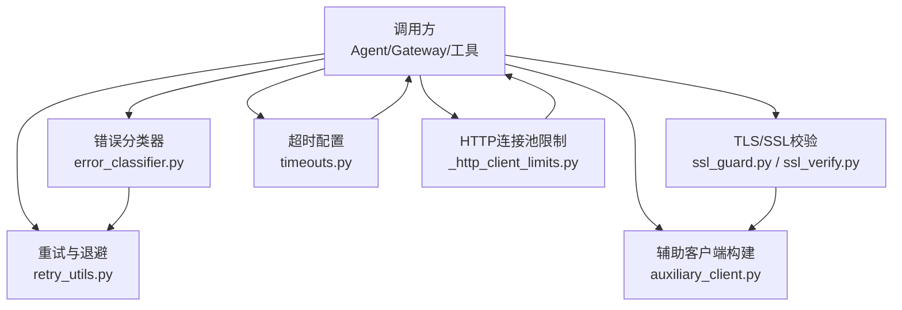
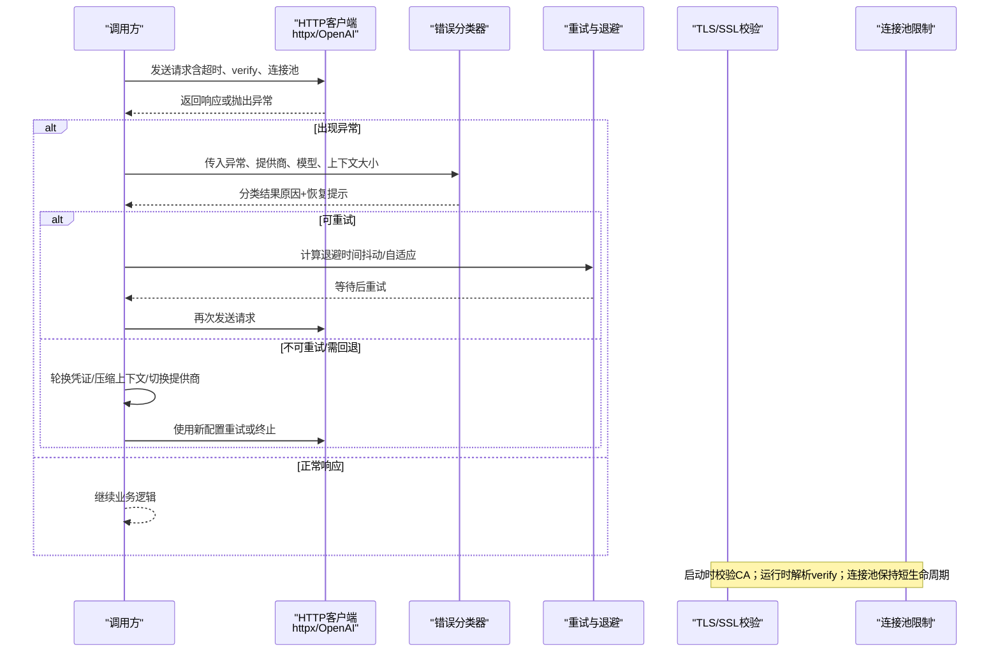
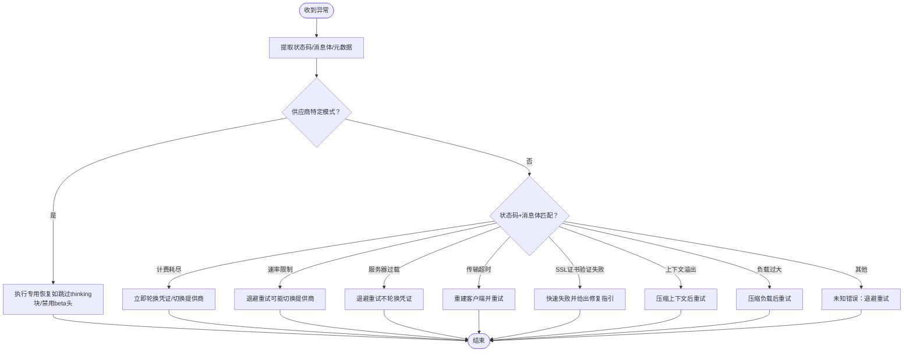
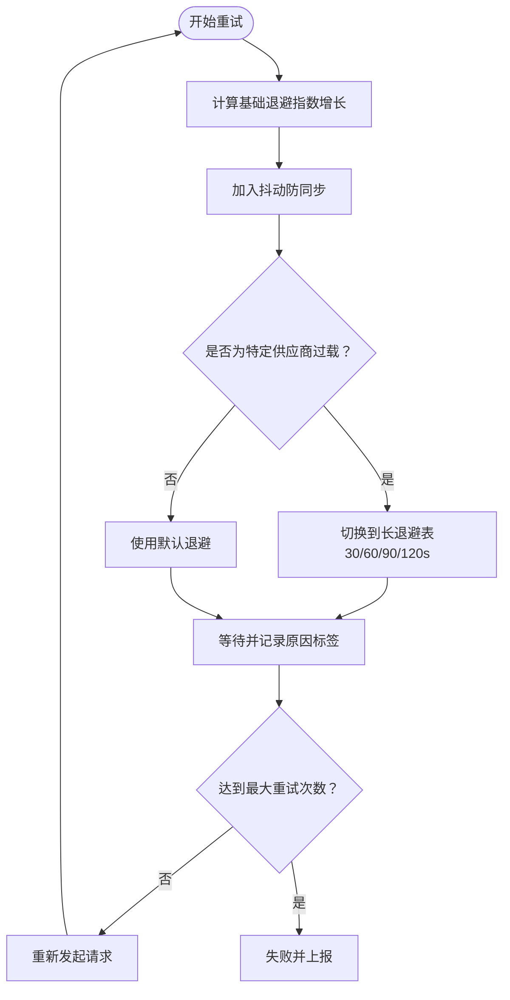
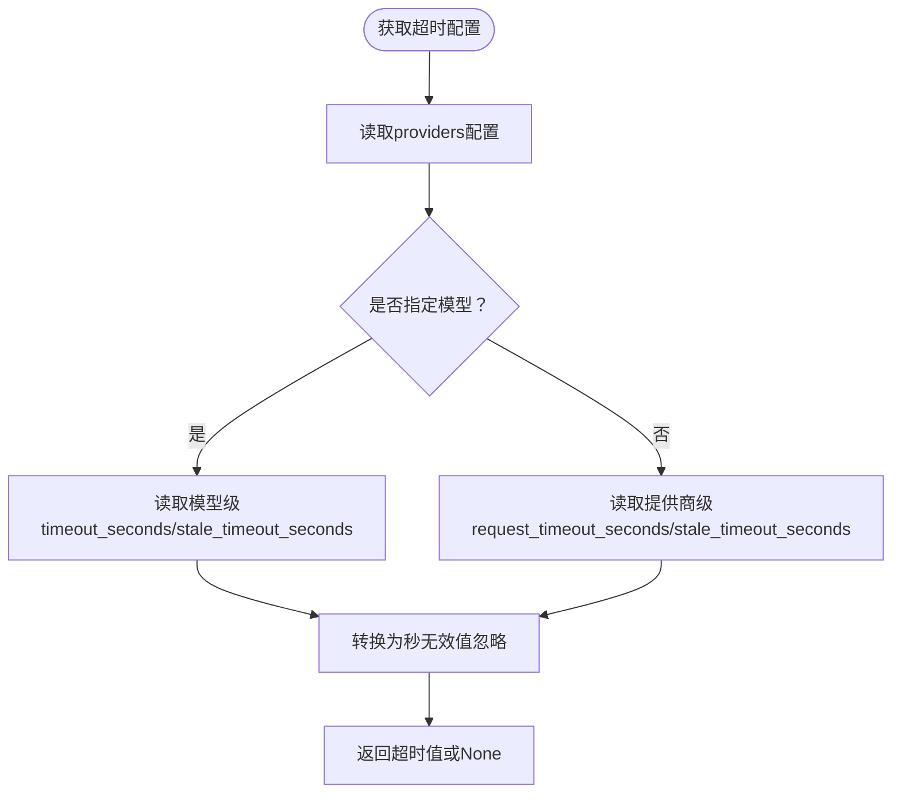
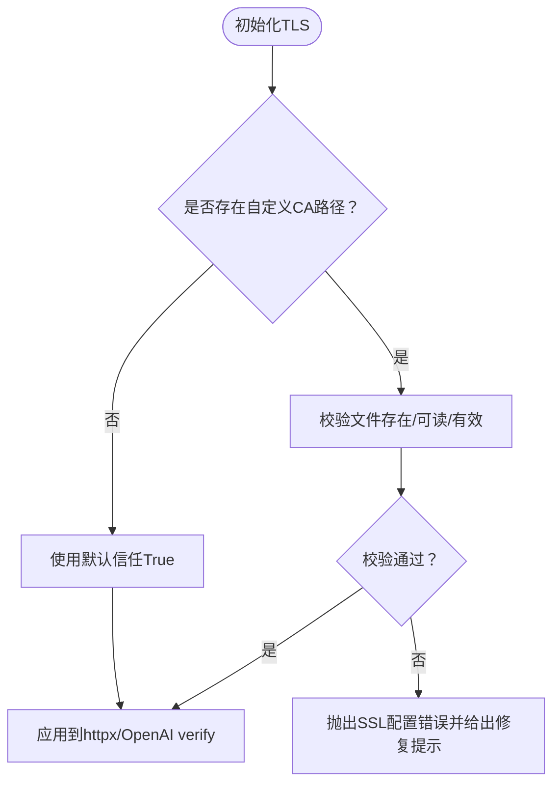
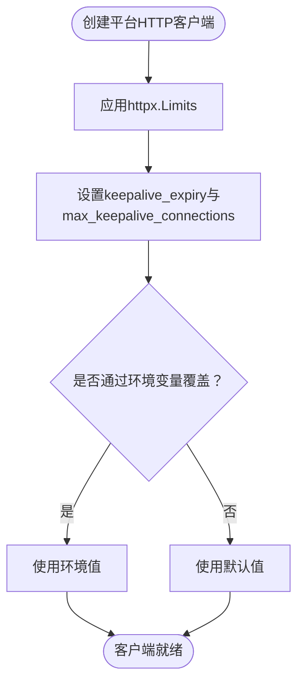
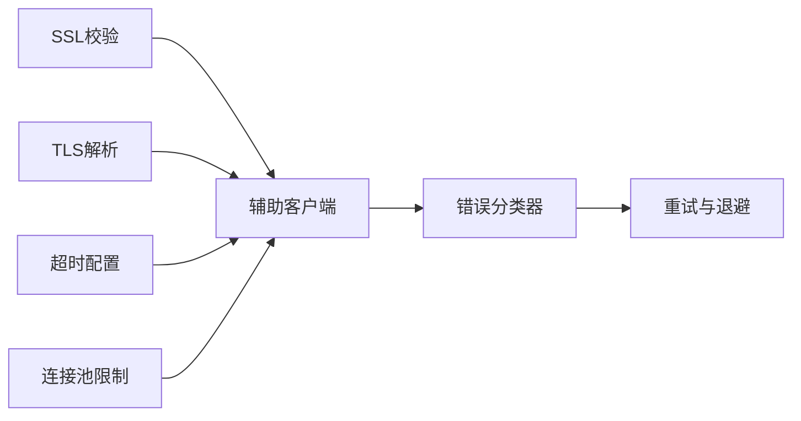

# API连接失败

<cite>
**本文引用的文件**
- [agent/retry_utils.py](file://agent/retry_utils.py)
- [agent/error_classifier.py](file://agent/error_classifier.py)
- [agent/ssl_guard.py](file://agent/ssl_guard.py)
- [agent/ssl_verify.py](file://agent/ssl_verify.py)
- [sparkii_cli/timeouts.py](file://sparkii_cli/timeouts.py)
- [gateway/platforms/_http_client_limits.py](file://gateway/platforms/_http_client_limits.py)
- [agent/auxiliary_client.py](file://agent/auxiliary_client.py)
</cite>

## 目录
1. [简介](#简介)
2. [项目结构](#项目结构)
3. [核心组件](#核心组件)
4. [架构总览](#架构总览)
5. [详细组件分析](#详细组件分析)
6. [依赖关系分析](#依赖关系分析)
7. [性能考量](#性能考量)
8. [故障排查指南](#故障排查指南)
9. [结论](#结论)
10. [附录](#附录)

## 简介
本文件面向OpenAI API、第三方服务与消息平台的API连接失败问题，提供系统化的解决方案：包括重试机制配置、超时参数调优、错误分类处理、网络错误诊断（HTTP状态码、SSL握手失败、路由问题）、故障转移（备用端点与负载均衡）以及连接池管理与资源清理最佳实践。文档基于仓库中现有的重试、错误分类、TLS校验、超时解析与HTTP客户端限制等实现进行说明，并给出可操作的配置建议与排障流程。

## 项目结构
围绕“API连接失败”的关键代码分布在以下模块：
- 重试与退避：jittered backoff、速率限制自适应退避、特定供应商过载策略
- 错误分类：结构化分类器，将异常映射为可执行的恢复动作（重试、轮换凭证、降级压缩、回退模型/提供商）
- TLS/SSL：CA证书预检查、httpx/OpenAI的verify解析
- 超时配置：按提供商/模型读取请求超时与空闲超时
- HTTP连接池：平台适配器的httpx连接池限制与keepalive过期策略
- 辅助客户端：统一解析TLS与httpx keepalive客户端，兼容版本差异

图表来源
- [agent/error_classifier.py:1-120](file://agent/error_classifier.py#L1-L120)
- [agent/retry_utils.py:1-120](file://agent/retry_utils.py#L1-L120)
- [agent/ssl_guard.py:1-102](file://agent/ssl_guard.py#L1-L102)
- [agent/ssl_verify.py:1-64](file://agent/ssl_verify.py#L1-L64)
- [sparkii_cli/timeouts.py:1-83](file://sparkii_cli/timeouts.py#L1-L83)
- [gateway/platforms/_http_client_limits.py:1-85](file://gateway/platforms/_http_client_limits.py#L1-L85)
- [agent/auxiliary_client.py:141-200](file://agent/auxiliary_client.py#L141-L200)

章节来源
- [agent/error_classifier.py:1-120](file://agent/error_classifier.py#L1-L120)
- [agent/retry_utils.py:1-120](file://agent/retry_utils.py#L1-L120)
- [agent/ssl_guard.py:1-102](file://agent/ssl_guard.py#L1-L102)
- [agent/ssl_verify.py:1-64](file://agent/ssl_verify.py#L1-L64)
- [sparkii_cli/timeouts.py:1-83](file://sparkii_cli/timeouts.py#L1-L83)
- [gateway/platforms/_http_client_limits.py:1-85](file://gateway/platforms/_http_client_limits.py#L1-L85)
- [agent/auxiliary_client.py:141-200](file://agent/auxiliary_client.py#L141-L200)

## 核心组件
- 错误分类器：将异常结构化分类为认证失败、计费耗尽、速率限制、服务器过载、传输超时、SSL证书验证失败、上下文溢出、负载过大、模型不存在、内容策略拦截等，并附带是否可重试、是否需要压缩、是否需要轮换凭证或回退等恢复提示。
- 重试与退避：提供抖动指数退避、针对特定供应商（如Z.AI Coding Plan GLM-5.2）的自适应长退避策略，避免“惊群效应”。
- TLS/SSL：启动前校验CA证书路径与有效性；运行时解析httpx/OpenAI的verify参数，支持禁用校验（仅限本地开发）。
- 超时配置：从配置中按提供商/模型读取请求超时与空闲超时，统一转换为秒级数值。
- HTTP连接池：为长期存在的平台适配器设置更激进的keepalive过期与最大连接数，降低文件描述符压力。
- 辅助客户端：统一解析TLS与httpx keepalive客户端，兼容版本差异，确保辅助任务（压缩、视觉、网页提取等）具备一致的连接行为。

章节来源
- [agent/error_classifier.py:22-120](file://agent/error_classifier.py#L22-L120)
- [agent/retry_utils.py:38-128](file://agent/retry_utils.py#L38-L128)
- [agent/ssl_guard.py:41-102](file://agent/ssl_guard.py#L41-L102)
- [agent/ssl_verify.py:14-64](file://agent/ssl_verify.py#L14-L64)
- [sparkii_cli/timeouts.py:4-83](file://sparkii_cli/timeouts.py#L4-L83)
- [gateway/platforms/_http_client_limits.py:39-85](file://gateway/platforms/_http_client_limits.py#L39-L85)
- [agent/auxiliary_client.py:141-200](file://agent/auxiliary_client.py#L141-L200)

## 架构总览
下图展示一次API调用在连接失败时的整体处理流程：调用方发起请求，若发生异常则进入错误分类器进行分类；根据分类结果决定重试、轮换凭证、压缩上下文或回退到备用提供商；同时结合重试退避策略与TLS/SSL校验、超时与连接池配置，形成稳健的连接与恢复机制。

图表来源
- [agent/error_classifier.py:624-718](file://agent/error_classifier.py#L624-L718)
- [agent/retry_utils.py:90-128](file://agent/retry_utils.py#L90-L128)
- [agent/ssl_guard.py:68-102](file://agent/ssl_guard.py#L68-L102)
- [agent/ssl_verify.py:22-64](file://agent/ssl_verify.py#L22-L64)
- [gateway/platforms/_http_client_limits.py:43-85](file://gateway/platforms/_http_client_limits.py#L43-L85)

## 详细组件分析

### 错误分类与恢复策略
- 分类维度：认证失败、计费耗尽、速率限制、上游限速、服务器过载、传输超时、SSL证书验证失败、上下文溢出、负载过大、图片过大、模型不存在、提供商策略拦截、内容策略拦截、格式错误、思考签名、长上下文层级、OAuth长上下文Beta禁止、llama.cpp语法模式等。
- 恢复提示：是否可重试、是否需要压缩上下文、是否需要轮换凭证、是否需要回退到其他模型/提供商。
- 优先级：先匹配供应商特定模式，再按HTTP状态码与消息体细化，最后走传输错误启发式与未知兜底。

图表来源
- [agent/error_classifier.py:22-120](file://agent/error_classifier.py#L22-L120)
- [agent/error_classifier.py:624-718](file://agent/error_classifier.py#L624-L718)

章节来源
- [agent/error_classifier.py:22-120](file://agent/error_classifier.py#L22-L120)
- [agent/error_classifier.py:624-718](file://agent/error_classifier.py#L624-L718)

### 重试机制与退避策略
- 抖动指数退避：避免多会话同时重试导致的“惊群”，通过随机抖动分散重试峰值。
- 自适应速率限制退避：对特定供应商（如Z.AI Coding Plan GLM-5.2）采用短重试后逐步拉长等待的策略，防止持续压垮过载窗口。
- Retry-After解析：支持数字与HTTP日期两种格式，自动取非负秒数。

图表来源
- [agent/retry_utils.py:38-128](file://agent/retry_utils.py#L38-L128)
- [agent/retry_utils.py:162-209](file://agent/retry_utils.py#L162-L209)

章节来源
- [agent/retry_utils.py:38-128](file://agent/retry_utils.py#L38-L128)
- [agent/retry_utils.py:162-209](file://agent/retry_utils.py#L162-L209)

### 超时参数调优
- 请求超时与空闲超时：可从配置中按提供商或模型读取，单位秒；未配置时返回None由上层决定默认值。
- 建议：
  - 连接超时：较短（如5-10秒），快速失败以便重试或切换。
  - 读取超时：较长（如30-120秒），适应流式响应与慢后端。
  - 写入超时：通常与连接/读取一致或略短，避免长时间阻塞。
- 配置读取路径：通过提供商ID与模型名获取对应超时值。

图表来源
- [sparkii_cli/timeouts.py:4-83](file://sparkii_cli/timeouts.py#L4-L83)

章节来源
- [sparkii_cli/timeouts.py:4-83](file://sparkii_cli/timeouts.py#L4-L83)

### SSL/TLS与证书校验
- 启动前校验：检查环境变量指向的CA bundle是否存在、可读且有效；校验内置certifi包是否可用且包含证书。
- 运行时解析：优先支持显式禁用校验（仅本地开发），其次按per-provider配置或环境变量解析CA路径，最终回退到默认信任。
- 常见失败：证书链不完整、企业代理中间人、自签证书、证书过期、主机名不匹配。

图表来源
- [agent/ssl_guard.py:41-102](file://agent/ssl_guard.py#L41-L102)
- [agent/ssl_verify.py:14-64](file://agent/ssl_verify.py#L14-L64)

章节来源
- [agent/ssl_guard.py:41-102](file://agent/ssl_guard.py#L41-L102)
- [agent/ssl_verify.py:14-64](file://agent/ssl_verify.py#L14-L64)

### 连接池管理与资源清理
- 平台适配器使用长期存在的httpx客户端以摊销TLS/连接开销，但需控制keepalive过期与最大连接数以降低文件描述符压力。
- 默认策略：最大keepalive连接数较小、keepalive过期时间短，避免代理侧CLOSE_WAIT堆积导致FD耗尽。
- 可调参数：通过环境变量覆盖keepalive过期时间与最大连接数。

图表来源
- [gateway/platforms/_http_client_limits.py:39-85](file://gateway/platforms/_http_client_limits.py#L39-L85)

章节来源
- [gateway/platforms/_http_client_limits.py:39-85](file://gateway/platforms/_http_client_limits.py#L39-L85)

### 辅助客户端与TLS/Keepalive集成
- 辅助任务（压缩、视觉、网页提取等）通过统一解析TLS与httpx keepalive客户端，确保与主客户端一致的行为。
- 兼容版本差异：当底层helper不可用时降级到SDK默认客户端并记录警告，避免进程启动失败。

章节来源
- [agent/auxiliary_client.py:141-200](file://agent/auxiliary_client.py#L141-L200)

## 依赖关系分析
- 错误分类器依赖异常类型、HTTP状态码与消息体模式，输出结构化恢复建议。
- 重试模块依赖分类结果与供应商特征，动态调整退避策略。
- TLS模块依赖环境变量与配置文件，影响httpx/OpenAI的verify行为。
- 超时模块依赖配置结构，为调用方提供统一的超时取值。
- 连接池模块为平台适配器提供稳定的连接管理策略。

图表来源
- [agent/error_classifier.py:624-718](file://agent/error_classifier.py#L624-L718)
- [agent/retry_utils.py:90-128](file://agent/retry_utils.py#L90-L128)
- [agent/ssl_guard.py:68-102](file://agent/ssl_guard.py#L68-L102)
- [agent/ssl_verify.py:22-64](file://agent/ssl_verify.py#L22-L64)
- [sparkii_cli/timeouts.py:14-83](file://sparkii_cli/timeouts.py#L14-L83)
- [gateway/platforms/_http_client_limits.py:43-85](file://gateway/platforms/_http_client_limits.py#L43-L85)
- [agent/auxiliary_client.py:141-200](file://agent/auxiliary_client.py#L141-L200)

章节来源
- [agent/error_classifier.py:624-718](file://agent/error_classifier.py#L624-L718)
- [agent/retry_utils.py:90-128](file://agent/retry_utils.py#L90-L128)
- [agent/ssl_guard.py:68-102](file://agent/ssl_guard.py#L68-L102)
- [agent/ssl_verify.py:22-64](file://agent/ssl_verify.py#L22-L64)
- [sparkii_cli/timeouts.py:14-83](file://sparkii_cli/timeouts.py#L14-L83)
- [gateway/platforms/_http_client_limits.py:43-85](file://gateway/platforms/_http_client_limits.py#L43-L85)
- [agent/auxiliary_client.py:141-200](file://agent/auxiliary_client.py#L141-L200)

## 性能考量
- 连接复用：使用长期httpx客户端减少TLS握手成本，但需控制keepalive过期以避免FD泄漏。
- 退避抖动：避免多会话同步重试造成二次拥塞。
- 超时分层：连接超时短、读取超时适中，兼顾快速失败与容忍慢后端。
- 压缩上下文：在上下文溢出或负载过大时主动压缩，减少请求体积与超时概率。
- 供应商过载：对已知过载场景采用更长退避，避免雪崩。

[本节为通用指导，无需具体文件引用]

## 故障排查指南
- HTTP状态码分析：
  - 401/403：认证失败，尝试刷新或轮换凭证；若仍失败则快速失败并提示用户。
  - 402：计费耗尽，立即切换提供商或提示充值。
  - 429：速率限制或上游限速，退避重试；对特定供应商过载采用长退避。
  - 500/502/503/529：服务器错误或过载，退避重试且不轮换凭证。
  - 413：负载过大，压缩请求或图片尺寸后重试。
- SSL握手失败：
  - 检查企业代理、自定义CA路径、证书有效期与主机名匹配。
  - 使用启动前校验快速定位问题，必要时临时禁用校验（仅本地开发）。
- 网络路由问题：
  - 确认代理设置、DNS解析、防火墙规则；观察连接超时与读取超时的分布。
- 诊断步骤：
  - 启用日志记录异常类型、状态码、消息体与分类结果。
  - 检查重试次数与退避策略是否合理。
  - 验证TLS配置与连接池参数。
  - 对重复失败的模式进行根因分析（如固定模型/提供商/端点）。

章节来源
- [agent/error_classifier.py:22-120](file://agent/error_classifier.py#L22-L120)
- [agent/error_classifier.py:624-718](file://agent/error_classifier.py#L624-L718)
- [agent/ssl_guard.py:68-102](file://agent/ssl_guard.py#L68-L102)
- [agent/ssl_verify.py:22-64](file://agent/ssl_verify.py#L22-L64)
- [agent/retry_utils.py:90-128](file://agent/retry_utils.py#L90-L128)

## 结论
通过结构化错误分类、智能重试退避、严格的TLS校验、合理的超时配置与连接池管理，系统能够在面对OpenAI API、第三方服务与消息平台的连接超时、连接拒绝与认证失败时，快速定位问题并采取正确的恢复动作。建议在生产环境中启用启动前SSL校验、配置合适的超时与连接池参数，并结合错误分类日志进行持续优化。

[本节为总结性内容，无需具体文件引用]

## 附录
- 配置示例（路径参考）：
  - 提供商请求超时与空闲超时：参见超时配置读取函数。
  - 平台适配器连接池限制：参见httpx.Limits工厂函数与环境变量覆盖。
  - TLS/SSL校验：参见CA bundle校验与httpx verify解析。
- 故障转移与负载均衡：
  - 依据错误分类结果，自动轮换凭证或切换到备用提供商/模型。
  - 对上游限速与供应商过载采用差异化退避策略。
- 资源清理最佳实践：
  - 控制keepalive过期时间，避免代理侧CLOSE_WAIT堆积。
  - 在异常路径及时释放客户端与上下文，避免资源泄漏。

章节来源
- [sparkii_cli/timeouts.py:14-83](file://sparkii_cli/timeouts.py#L14-L83)
- [gateway/platforms/_http_client_limits.py:43-85](file://gateway/platforms/_http_client_limits.py#L43-L85)
- [agent/ssl_guard.py:68-102](file://agent/ssl_guard.py#L68-L102)
- [agent/ssl_verify.py:22-64](file://agent/ssl_verify.py#L22-L64)
- [agent/error_classifier.py:22-120](file://agent/error_classifier.py#L22-L120)
- [agent/retry_utils.py:90-128](file://agent/retry_utils.py#L90-L128)