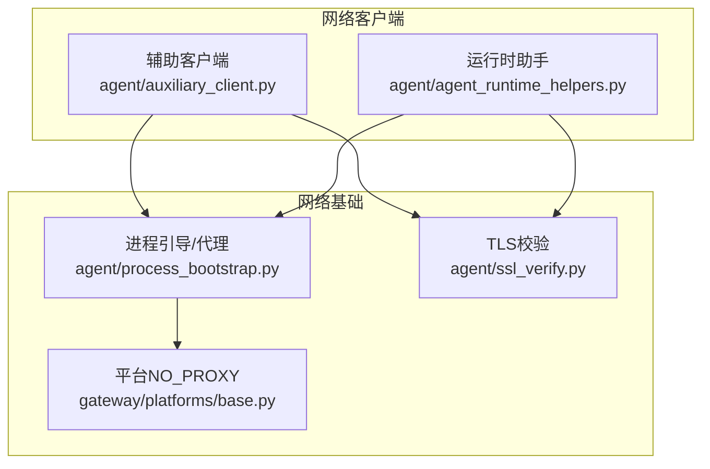
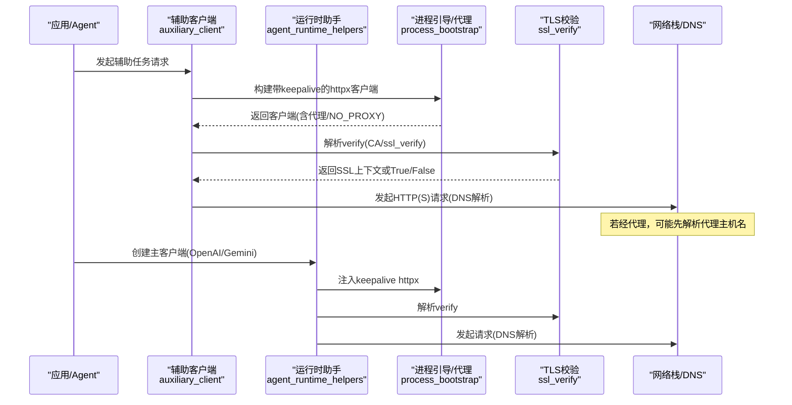
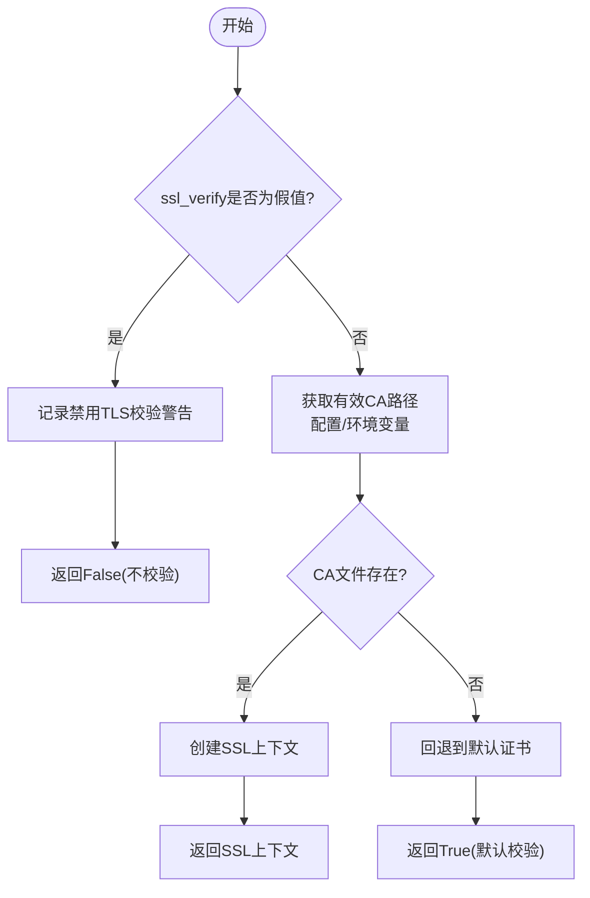
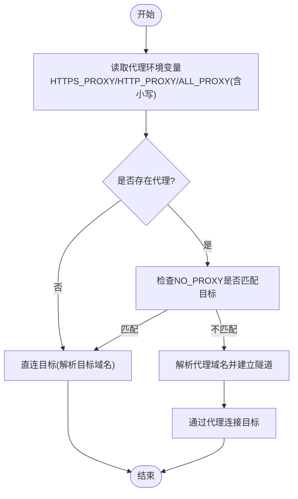
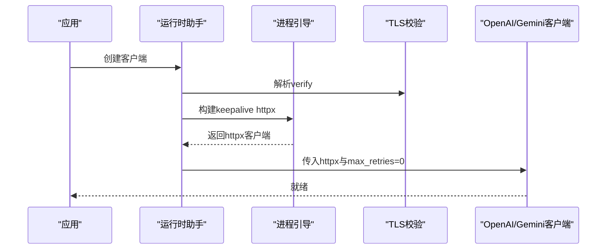
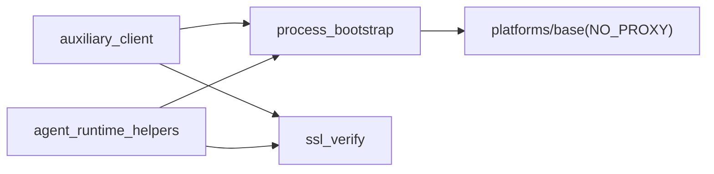

# DNS解析问题

<cite>
**本文引用的文件**
- [agent/auxiliary_client.py](file://agent/auxiliary_client.py)
- [agent/process_bootstrap.py](file://agent/process_bootstrap.py)
- [agent/ssl_verify.py](file://agent/ssl_verify.py)
- [agent/agent_runtime_helpers.py](file://agent/agent_runtime_helpers.py)
- [gateway/platforms/base.py](file://gateway/platforms/base.py)
</cite>

## 目录
1. [简介](#简介)
2. [项目结构](#项目结构)
3. [核心组件](#核心组件)
4. [架构总览](#架构总览)
5. [详细组件分析](#详细组件分析)
6. [依赖关系分析](#依赖关系分析)
7. [性能考虑](#性能考虑)
8. [故障排查指南](#故障排查指南)
9. [结论](#结论)
10. [附录](#附录)

## 简介
本指南聚焦于DNS解析问题的诊断与解决，结合代码库中的网络客户端、代理与环境变量处理逻辑，给出可操作的排障步骤与优化建议。内容涵盖：
- DNS解析失败的常见原因与修复思路（系统/容器DNS配置、缓存、DNSSEC）
- 不同操作系统与容器环境下的DNS相关配置要点
- 解析超时与重试策略（含备用DNS、超时参数）
- 性能优化（本地缓存、预取、负载均衡）
- 常用诊断工具使用（nslookup、dig、traceroute）
- 企业网络中的DNS转发与防火墙规则
- DNS劫持与安全加固（TLS证书校验、CA证书链）

## 项目结构
本项目在多处实现了HTTP客户端的构建与网络访问控制，涉及代理、超时、TLS校验等与DNS解析密切相关的环节。关键位置包括：
- 辅助任务客户端路由与TLS校验解析
- 进程启动时的代理环境变量读取与NO_PROXY匹配
- OpenAI/Gemini等客户端创建时的keepalive与重试策略注入
- 平台侧对NO_PROXY的处理

**图示来源**
- [agent/auxiliary_client.py:141-166](file://agent/auxiliary_client.py#L141-L166)
- [agent/agent_runtime_helpers.py:2251-2333](file://agent/agent_runtime_helpers.py#L2251-L2333)
- [agent/process_bootstrap.py:115-127](file://agent/process_bootstrap.py#L115-L127)
- [agent/ssl_verify.py:22-63](file://agent/ssl_verify.py#L22-L63)
- [gateway/platforms/base.py:346-354](file://gateway/platforms/base.py#L346-L354)

**章节来源**
- [agent/auxiliary_client.py:141-166](file://agent/auxiliary_client.py#L141-L166)
- [agent/agent_runtime_helpers.py:2251-2333](file://agent/agent_runtime_helpers.py#L2251-L2333)
- [agent/process_bootstrap.py:115-127](file://agent/process_bootstrap.py#L115-L127)
- [agent/ssl_verify.py:22-63](file://agent/ssl_verify.py#L22-L63)
- [gateway/platforms/base.py:346-354](file://gateway/platforms/base.py#L346-L354)

## 核心组件
- 辅助客户端TLS校验解析：统一从配置与环境变量解析httpx的verify参数，确保自定义CA或禁用校验的场景一致生效。
- 进程引导代理与NO_PROXY：按优先级读取HTTPS_PROXY/HTTP_PROXY/ALL_PROXY及其小写变体，并依据NO_PROXY排除特定主机。
- 运行时客户端创建：为OpenAI/Gemini等客户端注入keepalive httpx传输，设置max_retries=0以交由上层统一重试，避免重复退避与死锁。
- 平台层NO_PROXY匹配：提供NO_PROXY条目匹配逻辑，用于网关侧过滤不需要走代理的主机。

这些组件共同决定了域名到IP的解析路径是否经过代理、是否启用TLS校验、以及连接复用与超时行为，直接影响DNS解析成功率与延迟。

**章节来源**
- [agent/auxiliary_client.py:141-166](file://agent/auxiliary_client.py#L141-L166)
- [agent/process_bootstrap.py:115-127](file://agent/process_bootstrap.py#L115-L127)
- [agent/agent_runtime_helpers.py:2251-2333](file://agent/agent_runtime_helpers.py#L2251-L2333)
- [gateway/platforms/base.py:346-354](file://gateway/platforms/base.py#L346-L354)

## 架构总览
下图展示了请求从应用侧到网络层的调用链，突出DNS解析的关键节点：代理选择、TLS校验、keepalive与重试策略。

**图示来源**
- [agent/auxiliary_client.py:172-200](file://agent/auxiliary_client.py#L172-L200)
- [agent/agent_runtime_helpers.py:2251-2333](file://agent/agent_runtime_helpers.py#L2251-L2333)
- [agent/process_bootstrap.py:115-127](file://agent/process_bootstrap.py#L115-L127)
- [agent/ssl_verify.py:22-63](file://agent/ssl_verify.py#L22-L63)

## 详细组件分析

### 辅助客户端TLS校验解析
- 功能：根据配置与环境变量解析httpx的verify参数，支持自定义CA、显式关闭校验等。
- 关键点：当ssl_verify被置为“假值”时，会发出安全警告；否则优先使用显式CA，再回退到系统默认。
- 对DNS的影响：若目标域名的证书链不可信或CA缺失，可能导致握手失败，需检查DNS解析结果与证书域名一致性。

**图示来源**
- [agent/ssl_verify.py:22-63](file://agent/ssl_verify.py#L22-L63)

**章节来源**
- [agent/auxiliary_client.py:141-166](file://agent/auxiliary_client.py#L141-L166)
- [agent/ssl_verify.py:22-63](file://agent/ssl_verify.py#L22-L63)

### 进程引导代理与NO_PROXY
- 功能：按优先级读取HTTPS_PROXY/HTTP_PROXY/ALL_PROXY及其小写变体，决定请求是否走代理；基于NO_PROXY判断是否跳过代理。
- 关键点：代理主机名本身也需要DNS解析，若代理域名无法解析将导致连接失败。
- 对DNS的影响：当目标域名在NO_PROXY中时，直接解析目标域名；否则先解析代理域名建立隧道。

**图示来源**
- [agent/process_bootstrap.py:115-127](file://agent/process_bootstrap.py#L115-L127)
- [gateway/platforms/base.py:346-354](file://gateway/platforms/base.py#L346-L354)

**章节来源**
- [agent/process_bootstrap.py:115-127](file://agent/process_bootstrap.py#L115-L127)
- [gateway/platforms/base.py:346-354](file://gateway/platforms/base.py#L346-L354)

### 运行时客户端创建与重试策略
- 功能：为OpenAI/Gemini等客户端注入keepalive的httpx传输，设置max_retries=0，由上层统一重试与退避。
- 关键点：避免SDK内部重试与上层重试叠加导致的死锁或过度重试；keepalive有助于快速检测死连接。
- 对DNS的影响：连接复用减少频繁DNS查询；若上游断开，内核探测可在约60秒内发现并重建连接。

**图示来源**
- [agent/agent_runtime_helpers.py:2251-2333](file://agent/agent_runtime_helpers.py#L2251-L2333)
- [agent/ssl_verify.py:22-63](file://agent/ssl_verify.py#L22-L63)
- [agent/process_bootstrap.py:115-127](file://agent/process_bootstrap.py#L115-L127)

**章节来源**
- [agent/agent_runtime_helpers.py:2251-2333](file://agent/agent_runtime_helpers.py#L2251-L2333)

## 依赖关系分析
- auxiliary_client依赖process_bootstrap构建带keepalive的httpx客户端，并依赖ssl_verify解析TLS校验。
- agent_runtime_helpers在创建主客户端时同样依赖process_bootstrap与ssl_verify，并统一设置重试策略。
- gateway/platforms/base提供NO_PROXY匹配能力，供平台侧决定是否走代理。

**图示来源**
- [agent/auxiliary_client.py:172-200](file://agent/auxiliary_client.py#L172-L200)
- [agent/agent_runtime_helpers.py:2251-2333](file://agent/agent_runtime_helpers.py#L2251-L2333)
- [agent/process_bootstrap.py:115-127](file://agent/process_bootstrap.py#L115-L127)
- [gateway/platforms/base.py:346-354](file://gateway/platforms/base.py#L346-L354)

**章节来源**
- [agent/auxiliary_client.py:172-200](file://agent/auxiliary_client.py#L172-L200)
- [agent/agent_runtime_helpers.py:2251-2333](file://agent/agent_runtime_helpers.py#L2251-L2333)
- [agent/process_bootstrap.py:115-127](file://agent/process_bootstrap.py#L115-L127)
- [gateway/platforms/base.py:346-354](file://gateway/platforms/base.py#L346-L354)

## 性能考虑
- 本地DNS缓存：启用系统或容器的本地缓存（如systemd-resolved、dnsmasq），减少重复解析开销。
- 解析预取：对高频域名进行预热解析，降低首包延迟。
- 负载均衡：多DNS服务器轮询或智能调度，提升可用性。
- Keepalive连接：复用TCP连接，减少握手与DNS查询次数。
- 合理超时与重试：避免过短超时导致误判，避免过长等待影响用户体验；配合指数退避与抖动。

[本节为通用指导，无需具体文件引用]

## 故障排查指南
- 确认代理与NO_PROXY：
  - 检查HTTPS_PROXY/HTTP_PROXY/ALL_PROXY是否设置正确，目标是否在NO_PROXY中被排除。
  - 若经代理，需确保代理域名可解析且可达。
- 验证TLS校验：
  - 若出现证书错误，检查ssl_verify与CA证书路径是否正确；必要时临时关闭校验仅用于调试。
- 观察重试与超时：
  - 主客户端已设置max_retries=0，由上层统一重试；关注上层日志与指标，定位超时根因。
- 容器环境：
  - 检查容器DNS配置（/etc/resolv.conf）、网络模式与端口连通性；必要时指定外部DNS或代理。
- 企业网络：
  - 确认防火墙放行DNS(UDP/TCP 53)与代理端口；检查DNS转发策略与ACL。

**章节来源**
- [agent/process_bootstrap.py:115-127](file://agent/process_bootstrap.py#L115-L127)
- [agent/ssl_verify.py:22-63](file://agent/ssl_verify.py#L22-L63)
- [agent/agent_runtime_helpers.py:2251-2333](file://agent/agent_runtime_helpers.py#L2251-L2333)

## 结论
DNS解析问题往往与代理配置、TLS校验、连接复用与重试策略密切相关。通过统一解析TLS参数、规范代理与NO_PROXY、注入keepalive与集中重试，可显著提升解析成功率与稳定性。结合本地缓存、预取与负载均衡，可进一步优化性能。在企业环境中，还需完善DNS转发与防火墙策略，防范劫持与中间人攻击。

[本节为总结，无需具体文件引用]

## 附录
- 常用诊断命令
  - nslookup：快速查看域名解析结果与使用的DNS服务器。
  - dig：详细输出解析过程、权威服务器与缓存状态。
  - traceroute：追踪数据包路径，定位网络瓶颈或丢包点。
- 操作系统与容器DNS配置要点
  - Linux：systemd-resolved、NetworkManager、/etc/resolv.conf。
  - macOS：系统偏好设置中的DNS、mDNSResponder。
  - Windows：网卡属性中的DNS、netsh。
  - Docker/Podman：--dns、--dns-search、/etc/resolv.conf挂载。
- 企业网络DNS转发与防火墙
  - 配置内部DNS转发至上游；开放必要端口；设置ACL与审计。
- DNS劫持与安全防护
  - 启用DNSSEC验证；使用可信CA与严格校验；避免在生产环境禁用TLS校验。

[本节为通用指导，无需具体文件引用]