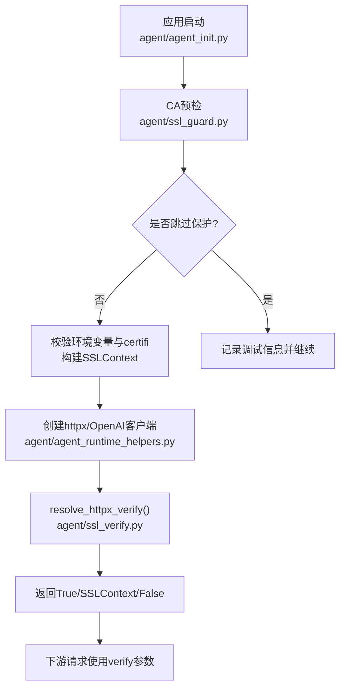
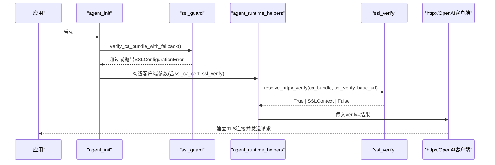
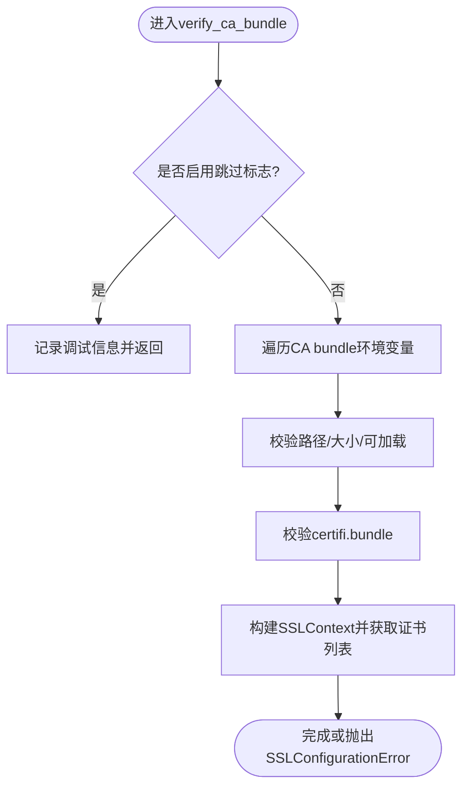
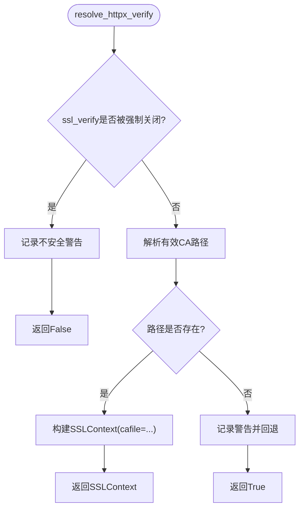
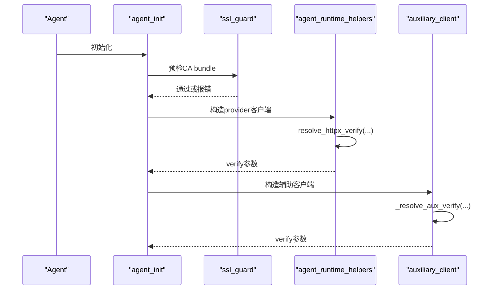
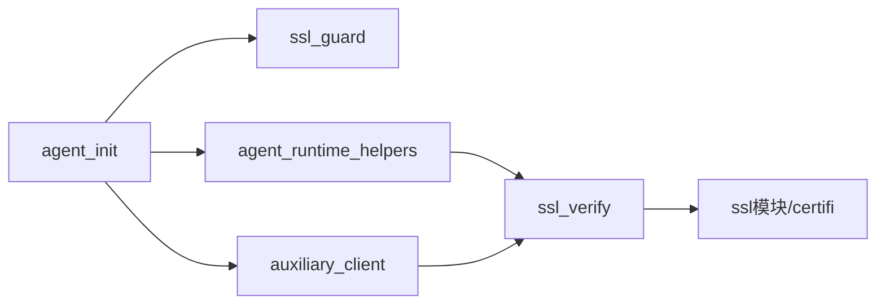

# SSL/TLS证书问题

<cite>
**本文引用的文件**
- [agent/ssl_guard.py](file://agent/ssl_guard.py)
- [agent/ssl_verify.py](file://agent/ssl_verify.py)
- [agent/errors.py](file://agent/errors.py)
- [agent/agent_init.py](file://agent/agent_init.py)
- [agent/agent_runtime_helpers.py](file://agent/agent_runtime_helpers.py)
- [agent/auxiliary_client.py](file://agent/auxiliary_client.py)
- [docs/rca-ssl-cacert-post-git-pull.md](file://docs/rca-ssl-cacert-post-git-pull.md)
- [tests/agent/test_ssl_ca_guard.py](file://tests/agent/test_ssl_ca_guard.py)
- [tests/agent/test_ssl_verify.py](file://tests/agent/test_ssl_verify.py)
- [docker/entrypoint.sh](file://docker/entrypoint.sh)
</cite>

## 目录
1. [简介](#简介)
2. [项目结构](#项目结构)
3. [核心组件](#核心组件)
4. [架构总览](#架构总览)
5. [详细组件分析](#详细组件分析)
6. [依赖关系分析](#依赖关系分析)
7. [性能考虑](#性能考虑)
8. [故障排查指南](#故障排查指南)
9. [结论](#结论)
10. [附录](#附录)

## 简介
本文件面向在开发、测试与生产环境中遇到SSL/TLS证书问题的用户，提供从根因定位到修复的完整方案。重点覆盖：
- 证书验证失败的常见原因与修复步骤
- 自签名证书与企业内部CA的处理方法
- CA证书更新与容器化环境中的证书配置
- SSL握手失败诊断（证书链、域名匹配、协议版本）
- 自定义CA添加与管理
- SSL性能优化（会话复用、加密套件、证书缓存）
- SSL调试日志与连接测试
- 常见错误及解决方案

## 项目结构
本项目在Agent层集中实现了SSL/TLS证书校验与解析逻辑，并通过统一的入口在启动时进行预检查，确保后续HTTP客户端创建不会因CA证书路径损坏或不可用而失败。关键文件包括：
- 启动前CA校验：agent/ssl_guard.py
- httpx/OpenAI客户端verify解析：agent/ssl_verify.py
- 统一异常类型：agent/errors.py
- 启动流程集成：agent/agent_init.py
- 运行时TLS参数注入：agent/agent_runtime_helpers.py
- 辅助客户端TLS解析：agent/auxiliary_client.py
- RCA文档与用例：docs/rca-ssl-cacert-post-git-pull.md、tests/...

**图表来源**
- [agent/agent_init.py:1350-1380](file://agent/agent_init.py#L1350-L1380)
- [agent/ssl_guard.py:68-101](file://agent/ssl_guard.py#L68-L101)
- [agent/ssl_verify.py:22-63](file://agent/ssl_verify.py#L22-L63)
- [agent/agent_runtime_helpers.py:2253-2321](file://agent/agent_runtime_helpers.py#L2253-L2321)

**章节来源**
- [agent/agent_init.py:1350-1380](file://agent/agent_init.py#L1350-L1380)
- [agent/ssl_guard.py:1-101](file://agent/ssl_guard.py#L1-L101)
- [agent/ssl_verify.py:1-64](file://agent/ssl_verify.py#L1-L64)

## 核心组件
- CA预检器（ssl_guard）
  - 作用：在OpenAI/httpx客户端初始化之前，校验显式配置的CA bundle路径与内置certifi包是否可用且可加载。
  - 行为：读取SPARKII_CA_BUNDLE、SSL_CERT_FILE、REQUESTS_CA_BUNDLE、CURL_CA_BUNDLE等环境变量；若存在则验证路径、大小与可加载性；同时校验certifi.where()指向的bundle。
  - 异常：抛出SSLConfigurationError，附带修复建议。
- verify解析器（ssl_verify）
  - 作用：为httpx/OpenAI客户端生成verify参数。
  - 优先级：ssl_verify=false禁用验证（仅本地开发）→ 显式ca_bundle → 环境变量 → True（默认）。
  - 输出：布尔值或ssl.SSLContext对象。
- 统一异常（errors）
  - 定义SSLConfigurationError用于一致的SSL配置错误上报。

**章节来源**
- [agent/ssl_guard.py:18-101](file://agent/ssl_guard.py#L18-L101)
- [agent/ssl_verify.py:14-63](file://agent/ssl_verify.py#L14-L63)
- [agent/errors.py:1-3](file://agent/errors.py#L1-L3)

## 架构总览
下图展示从启动到发起HTTPS请求的完整链路，以及SSL/TLS相关决策点。

**图表来源**
- [agent/agent_init.py:1350-1380](file://agent/agent_init.py#L1350-L1380)
- [agent/ssl_guard.py:68-101](file://agent/ssl_guard.py#L68-L101)
- [agent/agent_runtime_helpers.py:2253-2321](file://agent/agent_runtime_helpers.py#L2253-L2321)
- [agent/ssl_verify.py:22-63](file://agent/ssl_verify.py#L22-L63)

## 详细组件分析

### CA预检器（ssl_guard）
- 功能要点
  - 支持通过环境变量跳过保护（便于受控沙箱环境）。
  - 对每个显式CA bundle环境变量执行路径存在性、是否为文件、大小合理性、可加载性检查。
  - 对内置certifi bundle进行实质性检查（要求大于阈值），并尝试构建SSLContext。
  - 兼容Windows truststore场景（get_ca_certs可能不支持）。
- 典型错误
  - 缺失或损坏的CA bundle路径
  - certifi包不可导入或bundle为空/过小
- 修复建议
  - 重新安装依赖以恢复certifi bundle
  - 修正或移除错误的CA bundle环境变量

**图表来源**
- [agent/ssl_guard.py:28-66](file://agent/ssl_guard.py#L28-L66)
- [agent/ssl_guard.py:68-101](file://agent/ssl_guard.py#L68-L101)

**章节来源**
- [agent/ssl_guard.py:18-101](file://agent/ssl_guard.py#L18-L101)
- [tests/agent/test_ssl_ca_guard.py:12-75](file://tests/agent/test_ssl_ca_guard.py#L12-L75)

### verify解析器（ssl_verify）
- 功能要点
  - 将配置与环境变量转换为httpx/OpenAI所需的verify参数。
  - 明确支持ssl_verify=false用于本地开发（会记录警告）。
  - 当指定ca_bundle或环境变量存在时，尝试构建ssl.SSLContext；否则回退到True（使用系统/默认CA）。
- 优先级
  - ssl_verify=false → 显式ca_bundle → SPARKII_CA_BUNDLE → SSL_CERT_FILE → REQUESTS_CA_BUNDLE → CURL_CA_BUNDLE → True

**图表来源**
- [agent/ssl_verify.py:14-63](file://agent/ssl_verify.py#L14-L63)

**章节来源**
- [agent/ssl_verify.py:1-64](file://agent/ssl_verify.py#L1-L64)
- [tests/agent/test_ssl_verify.py:21-32](file://tests/agent/test_ssl_verify.py#L21-L32)

### 启动集成与运行时注入
- 启动阶段
  - 在创建OpenAI兼容客户端前调用CA预检，确保早期暴露问题。
- 运行时
  - 根据客户端参数与全局设置解析verify，并应用到httpx/OpenAI客户端。
  - 辅助客户端也遵循相同约定，优先使用显式配置与环境变量。

**图表来源**
- [agent/agent_init.py:1350-1380](file://agent/agent_init.py#L1350-L1380)
- [agent/agent_runtime_helpers.py:2253-2321](file://agent/agent_runtime_helpers.py#L2253-L2321)
- [agent/auxiliary_client.py:141-160](file://agent/auxiliary_client.py#L141-L160)

**章节来源**
- [agent/agent_init.py:1350-1380](file://agent/agent_init.py#L1350-L1380)
- [agent/agent_runtime_helpers.py:2253-2321](file://agent/agent_runtime_helpers.py#L2253-L2321)
- [agent/auxiliary_client.py:141-160](file://agent/auxiliary_client.py#L141-L160)

## 依赖关系分析
- 模块耦合
  - agent_init依赖ssl_guard进行启动前校验，并在创建客户端时结合agent_runtime_helpers与ssl_verify决定verify参数。
  - auxiliary_client复用相同的verify解析策略，保证一致性。
- 外部依赖
  - 依赖Python标准库ssl与第三方包certifi。
  - 依赖httpx/OpenAI客户端的verify语义。
- 潜在风险
  - 环境变量污染（如旧版脚本遗留的SSL_CERT_FILE）可能导致非预期行为。
  - 容器镜像中未正确包含CA bundle或权限不足会导致加载失败。

**图表来源**
- [agent/agent_init.py:1350-1380](file://agent/agent_init.py#L1350-L1380)
- [agent/agent_runtime_helpers.py:2253-2321](file://agent/agent_runtime_helpers.py#L2253-L2321)
- [agent/auxiliary_client.py:141-160](file://agent/auxiliary_client.py#L141-L160)
- [agent/ssl_verify.py:22-63](file://agent/ssl_verify.py#L22-L63)

**章节来源**
- [agent/agent_init.py:1350-1380](file://agent/agent_init.py#L1350-L1380)
- [agent/agent_runtime_helpers.py:2253-2321](file://agent/agent_runtime_helpers.py#L2253-L2321)
- [agent/auxiliary_client.py:141-160](file://agent/auxiliary_client.py#L141-L160)
- [agent/ssl_verify.py:22-63](file://agent/ssl_verify.py#L22-L63)

## 性能考虑
- 会话复用
  - 保持HTTP连接池与会话复用，减少TLS握手开销。
- 加密套件选择
  - 使用现代加密套件（如ECDHE+AES-GCM），避免弱算法。
- 证书缓存
  - 利用操作系统或中间件的证书缓存机制，减少I/O与解析成本。
- 客户端配置
  - 合理设置超时与重试策略，避免频繁重建SSL上下文。
- 注意
  - 在生产环境不要禁用证书验证（ssl_verify=false仅用于本地开发）。

[本节为通用指导，不直接分析具体文件]

## 故障排查指南
- 常见问题与修复
  - 证书验证失败：检查SPARKII_CA_BUNDLE、SSL_CERT_FILE、REQUESTS_CA_BUNDLE、CURL_CA_BUNDLE是否指向有效的PEM文件；必要时重新安装certifi/openai/httpx。
  - 自签名证书：将企业CA证书加入可信存储，或通过ssl_ca_cert指定自定义CA bundle。
  - CA证书更新：更新系统或容器镜像中的CA bundle，并确保环境变量指向最新文件。
- SSL握手失败诊断
  - 证书链验证：确认服务器返回完整链，且根CA受信任。
  - 域名匹配：确保证书CN/SAN与目标域名一致。
  - 协议版本兼容性：确保客户端与服务端支持相同TLS版本（推荐TLS 1.2+）。
- 自定义CA管理
  - 通过ssl_ca_cert或环境变量指定CA bundle路径。
  - 在容器中挂载CA bundle文件并设置相应环境变量。
- 容器化环境配置
  - 确保镜像包含正确的CA bundle，或使用系统信任库。
  - 通过环境变量传递CA bundle路径，或在启动脚本中设置。
- 调试与测试
  - 启用SSL调试日志（如httpx/OpenAI的调试模式）观察握手过程。
  - 使用curl或openssl s_client验证证书链与协议版本。
- 常见错误
  - FileNotFoundError：CA bundle路径不存在或权限不足。
  - 空或损坏的bundle：文件大小过小或无法加载。
  - 平台差异：Windows truststore不支持get_ca_certs，需兼容处理。

**章节来源**
- [docs/rca-ssl-cacert-post-git-pull.md:1-55](file://docs/rca-ssl-cacert-post-git-pull.md#L1-L55)
- [agent/ssl_guard.py:41-66](file://agent/ssl_guard.py#L41-L66)
- [agent/ssl_verify.py:39-63](file://agent/ssl_verify.py#L39-L63)
- [tests/agent/test_ssl_ca_guard.py:22-75](file://tests/agent/test_ssl_ca_guard.py#L22-L75)

## 结论
本项目通过启动前CA预检与运行时verify解析，提供了健壮且可配置的SSL/TLS证书管理机制。建议在开发环境谨慎使用禁用验证，在生产环境始终启用证书验证并使用受信任的CA。对于企业环境，应统一管理CA bundle并通过环境变量或配置项注入。在容器化部署中，确保镜像包含正确的CA证书，并通过环境变量或卷挂载方式传递。

[本节为总结，不直接分析具体文件]

## 附录
- 环境变量参考
  - SPARKII_CA_BUNDLE：项目约定的CA bundle路径
  - SSL_CERT_FILE：标准SSL模块使用的CA bundle路径
  - REQUESTS_CA_BUNDLE / CURL_CA_BUNDLE：requests/curl使用的CA bundle路径
- 跳过保护开关
  - SPARKII_SKIP_SSL_GUARD：仅在受控环境中跳过预检
- 容器入口说明
  - docker/entrypoint.sh为兼容层，实际入口由s6-overlay管理

**章节来源**
- [agent/ssl_guard.py:18-29](file://agent/ssl_guard.py#L18-L29)
- [docker/entrypoint.sh:1-29](file://docker/entrypoint.sh#L1-L29)