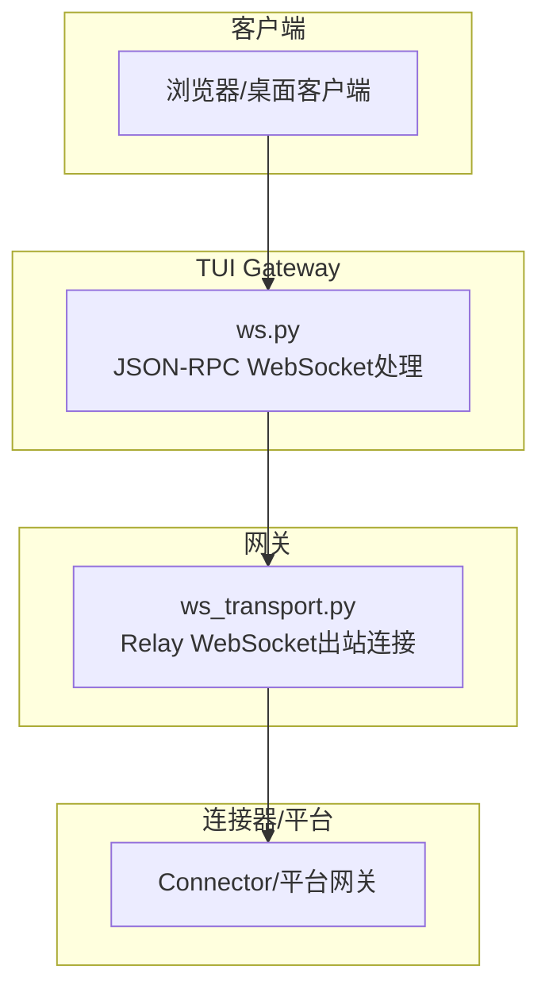
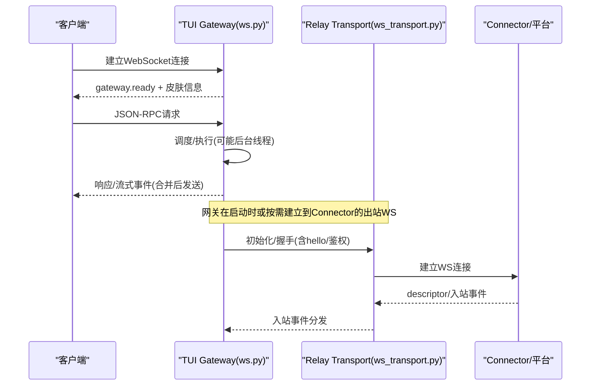
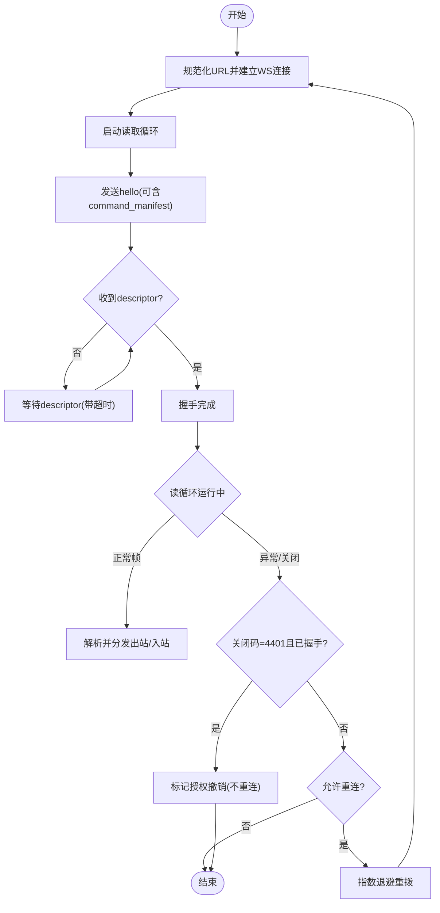
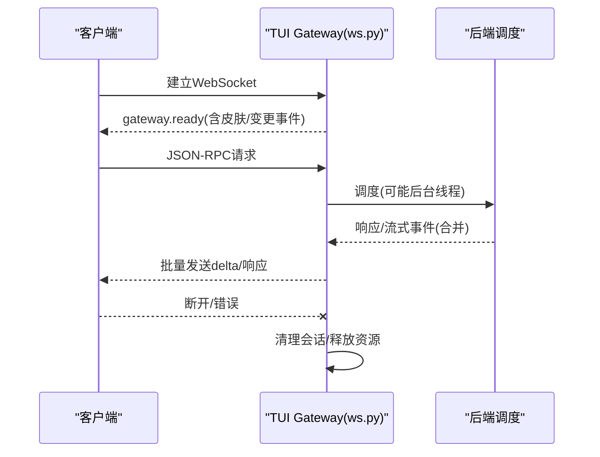
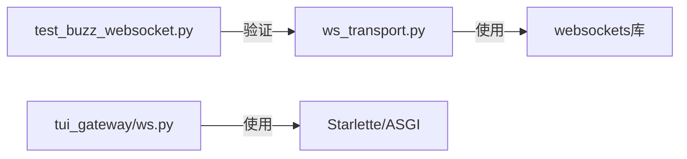

# WebSocket连接问题

<cite>
**本文引用的文件**
- [gateway/relay/ws_transport.py](file://gateway/relay/ws_transport.py)
- [tui_gateway/ws.py](file://tui_gateway/ws.py)
- [tests/gateway/test_buzz_websocket.py](file://tests/gateway/test_buzz_websocket.py)
- [sparkii_cli/dashboard_auth/ws_tickets.py](file://sparkii_cli/dashboard_auth/ws_tickets.py)
- [gateway/config.py](file://gateway/config.py)
</cite>

## 目录
1. [简介](#简介)
2. [项目结构](#项目结构)
3. [核心组件](#核心组件)
4. [架构总览](#架构总览)
5. [详细组件分析](#详细组件分析)
6. [依赖关系分析](#依赖关系分析)
7. [性能考虑](#性能考虑)
8. [故障排查指南](#故障排查指南)
9. [结论](#结论)
10. [附录](#附录)

## 简介
本文件面向在生产环境中遇到的WebSocket连接问题，提供从连接建立失败、连接中断到消息传输错误的系统化诊断与修复方案。内容覆盖：
- WebSocket代理配置、防火墙穿透与负载均衡设置
- 心跳机制与连接保活（心跳间隔、重连策略、最大重试次数）
- 性能优化建议（消息压缩、连接池管理、内存优化）
- 多浏览器/客户端环境下的调试方法
- 安全配置（CORS、身份认证、消息加密）
- 监控与日志记录最佳实践

## 项目结构
本项目包含两类WebSocket实现：
- 网关到连接器（Connector）的出站长连接：用于平台事件与消息的可靠转发，具备握手、鉴权、断线重连、休眠/唤醒等能力。
- TUI Gateway的JSON-RPC WebSocket服务：为桌面/TUI/Web客户端提供实时RPC通道，具备流式帧合并、Nagle禁用、线程安全写入等特性。

**图表来源**
- [tui_gateway/ws.py:1-477](file://tui_gateway/ws.py#L1-L477)
- [gateway/relay/ws_transport.py:1-903](file://gateway/relay/ws_transport.py#L1-L903)

**章节来源**
- [tui_gateway/ws.py:1-477](file://tui_gateway/ws.py#L1-L477)
- [gateway/relay/ws_transport.py:1-903](file://gateway/relay/ws_transport.py#L1-L903)

## 核心组件
- 出站Relay WebSocket传输（ws_transport.py）
  - 负责与Connector建立并维护长连接，支持握手、鉴权、请求-响应、入站事件分发、断线自动重连、休眠/唤醒、授权撤销检测等。
- TUI Gateway WebSocket服务（tui_gateway/ws.py）
  - 负责接受客户端连接、解析JSON-RPC、流式事件合并、线程安全写入、错误统计与清理。
- 仪表盘WS票据鉴权（ws_tickets.py）
  - 提供一次性浏览器升级票据与进程级内部凭证，解决浏览器无法设置Authorization头的问题。
- 平台模式与端口绑定（config.py）
  - 定义不同平台的连接模式（如websocket/webhook），影响是否监听端口及流量走向。

**章节来源**
- [gateway/relay/ws_transport.py:339-903](file://gateway/relay/ws_transport.py#L339-L903)
- [tui_gateway/ws.py:70-477](file://tui_gateway/ws.py#L70-L477)
- [sparkii_cli/dashboard_auth/ws_tickets.py:1-162](file://sparkii_cli/dashboard_auth/ws_tickets.py#L1-L162)
- [gateway/config.py:390-417](file://gateway/config.py#L390-L417)

## 架构总览
下图展示了典型的数据流：客户端通过TUI Gateway的WebSocket接入，进行JSON-RPC交互；同时网关通过出站Relay WebSocket与Connector保持长连接，以接收平台侧事件并转发给Agent。

**图表来源**
- [tui_gateway/ws.py:286-477](file://tui_gateway/ws.py#L286-L477)
- [gateway/relay/ws_transport.py:441-541](file://gateway/relay/ws_transport.py#L441-L541)

## 详细组件分析

### 出站Relay WebSocket传输（ws_transport.py）
- 连接建立与握手
  - URL规范化：将http(s)映射为ws(s)，并确保路径为/relay。
  - 握手流程：建立连接→启动读取任务→发送hello（可携带命令清单等扩展字段）→等待descriptor就绪。
  - 鉴权：可选的每实例密钥签名Bearer令牌，未通过则连接器关闭（自定义4401）。
- 入站事件处理
  - 按行分隔的JSON帧解析，转换为MessageEvent并交给上层处理器。
  - 对Slack父命令等进行归一化，保证路由一致性。
- 出站请求-响应
  - 为每个outbound分配requestId，等待匹配的outbound_result，超时返回错误。
- 断线重连与休眠
  - 非预期关闭触发指数退避重连；支持go_idle/go_dormant配合平台侧缓冲与唤醒。
  - 检测到4401且已握手成功视为“授权撤销”，停止重连。
- 资源清理
  - disconnect()会取消supervisor/reader、关闭socket、挂起pending future，避免悬挂。

**图表来源**
- [gateway/relay/ws_transport.py:69-95](file://gateway/relay/ws_transport.py#L69-L95)
- [gateway/relay/ws_transport.py:441-541](file://gateway/relay/ws_transport.py#L441-L541)
- [gateway/relay/ws_transport.py:731-803](file://gateway/relay/ws_transport.py#L731-L803)

**章节来源**
- [gateway/relay/ws_transport.py:69-95](file://gateway/relay/ws_transport.py#L69-L95)
- [gateway/relay/ws_transport.py:339-541](file://gateway/relay/ws_transport.py#L339-L541)
- [gateway/relay/ws_transport.py:567-729](file://gateway/relay/ws_transport.py#L567-L729)
- [gateway/relay/ws_transport.py:731-803](file://gateway/relay/ws_transport.py#L731-L803)

### TUI Gateway WebSocket服务（tui_gateway/ws.py）
- 连接生命周期
  - 接受连接→发送gateway.ready→注册传输→进入读循环→处理JSON-RPC→最终清理会话与释放资源。
- 流式事件合并
  - 高频token类事件（message/reasoning/thinking delta）被合并缓冲，定时批量发送，降低事件循环唤醒开销。
- 线程安全写入
  - write()可在任意线程调用，使用锁与异步调度避免死锁；write_async()在事件循环内等待发送完成。
- 网络优化
  - 禁用Nagle，使小帧尽快发出，保持客户端看到的token节奏。
- 错误与统计
  - 记录解析错误、dispatch崩溃、发送失败等指标，便于定位问题。

**图表来源**
- [tui_gateway/ws.py:286-477](file://tui_gateway/ws.py#L286-L477)

**章节来源**
- [tui_gateway/ws.py:70-256](file://tui_gateway/ws.py#L70-L256)
- [tui_gateway/ws.py:258-284](file://tui_gateway/ws.py#L258-L284)
- [tui_gateway/ws.py:286-477](file://tui_gateway/ws.py#L286-L477)

### 仪表盘WS票据鉴权（ws_tickets.py）
- 一次性浏览器票据
  - 通过REST获取ticket，WS升级时附带ticket参数，有效期短（默认30秒），防泄露。
- 进程级内部凭证
  - 进程生命周期内稳定有效，供服务端派生子进程复用，避免频繁申请；仅在内网/受控环境传递。
- 安全要点
  - 使用随机熵生成，比较采用常量时间函数，避免时序攻击。

**章节来源**
- [sparkii_cli/dashboard_auth/ws_tickets.py:1-162](file://sparkii_cli/dashboard_auth/ws_tickets.py#L1-L162)

### 平台模式与端口绑定（config.py）
- 连接模式
  - 某些平台（如飞书）默认使用websocket出站长连接，不监听端口；切换为webhook时才绑定端口。
- 配置项
  - connection_mode决定实际行为，影响端口绑定与流量方向。

**章节来源**
- [gateway/config.py:390-417](file://gateway/config.py#L390-L417)

## 依赖关系分析
- ws_transport.py依赖websockets库（可选导入），并在缺失时报错提示安装messaging extra。
- tui_gateway/ws.py依赖Starlette/ASGI框架的WebSocket接口，兼容降级处理。
- 测试用例验证Nostr/NIP-42的WS认证流程，确保鉴权拒绝路径正确抛出异常。

**图表来源**
- [gateway/relay/ws_transport.py:46-51](file://gateway/relay/ws_transport.py#L46-L51)
- [tui_gateway/ws.py:62-67](file://tui_gateway/ws.py#L62-L67)
- [tests/gateway/test_buzz_websocket.py:107-119](file://tests/gateway/test_buzz_websocket.py#L107-L119)

**章节来源**
- [gateway/relay/ws_transport.py:46-51](file://gateway/relay/ws_transport.py#L46-L51)
- [tui_gateway/ws.py:62-67](file://tui_gateway/ws.py#L62-L67)
- [tests/gateway/test_buzz_websocket.py:107-119](file://tests/gateway/test_buzz_websocket.py#L107-L119)

## 性能考虑
- 流式事件合并
  - 高频delta事件合并发送，减少事件循环唤醒与GIL竞争，提升吞吐与延迟稳定性。
- Nagle禁用
  - 对小帧立即发送，避免客户端端平滑丢失节奏。
- 连接池与长连接
  - 出站Relay使用单连接长驻，避免频繁握手开销；必要时结合平台侧缓冲与休眠策略。
- 内存与序列化
  - 使用预序列化批次发送，减少重复序列化成本；合理控制缓冲区大小，避免堆积。
- 超时与背压
  - 出站请求设置超时，防止阻塞；写操作超时保护避免长时间占用线程。

[本节为通用指导，无需特定文件引用]

## 故障排查指南

### 连接建立失败
- 检查URL与路径
  - 确认URL被规范为ws(s)://…/relay，否则握手会被拒绝。
- 检查鉴权
  - 若启用每实例密钥，需携带正确的Authorization Bearer；连接器会在未通过时关闭（4401）。
- 检查依赖
  - 缺少websockets包会导致初始化失败，需安装对应extra。
- 参考路径
  - [URL规范化:69-95](file://gateway/relay/ws_transport.py#L69-L95)
  - [握手与鉴权:441-541](file://gateway/relay/ws_transport.py#L441-L541)
  - [依赖检查:46-51](file://gateway/relay/ws_transport.py#L46-L51)

### 连接中断与重连
- 识别原因
  - 网络抖动、平台侧重启、授权撤销（4401）等。
- 重连策略
  - 指数退避重拨；若已握手成功后收到4401，视为授权撤销，不再重连。
- 休眠/唤醒
  - go_idle/go_dormant配合平台侧缓冲，避免事件丢失；唤醒后连接器回放缓冲。
- 参考路径
  - [读取循环与重连:731-803](file://gateway/relay/ws_transport.py#L731-L803)
  - [休眠/唤醒:609-679](file://gateway/relay/ws_transport.py#L609-L679)

### 消息传输错误
- 出站超时
  - outbound请求设置超时，超时返回错误；检查远端是否处理及时。
- 入站解析错误
  - 非JSON或格式错误会记录并返回错误帧；检查上游数据源。
- 发送失败
  - 写操作失败会标记传输关闭并记录错误；检查网络与对端状态。
- 参考路径
  - [出站请求-响应:692-729](file://gateway/relay/ws_transport.py#L692-L729)
  - [TUI发送失败处理:228-247](file://tui_gateway/ws.py#L228-L247)

### 代理、防火墙与负载均衡
- 代理配置
  - 确保ws/wss可通过代理；必要时设置环境变量以穿透企业代理。
- 防火墙
  - 放行ws/wss端口与路径；注意中间设备对Upgrade头的处理。
- 负载均衡
  - 使用基于Cookie或Session的粘性会话，保证同一会话在同一实例；或采用共享状态的后端。
- 平台模式
  - 根据平台模式（websocket/webhook）选择出站长连接或入站回调，避免端口冲突。
- 参考路径
  - [平台模式与端口绑定:390-417](file://gateway/config.py#L390-L417)

### 心跳与连接保活
- 心跳机制
  - 出站Relay未内置应用层心跳，但通过keepalive HTTP客户端注入TCP保活，检测死连接。
- 重连策略
  - 指数退避重拨；休眠模式下使用更长轮询周期，避免与平台暂停窗口冲突。
- 最大重试次数
  - 代码未显式限制最大重试次数，通常由外部运维策略（如进程重启、健康检查）控制。
- 参考路径
  - [TCP keepalives注入:2302-2324](file://agent/agent_runtime_helpers.py#L2302-L2324)
  - [重连循环:791-803](file://gateway/relay/ws_transport.py#L791-L803)

### 安全配置（CORS、认证、加密）
- CORS
  - 在反向代理或Web服务器层配置允许的Origin与Header；确保WebSocket Upgrade不被拦截。
- 认证
  - 浏览器无法设置Authorization头时使用一次性ticket；内部子进程使用进程级凭证。
- 加密
  - 生产环境强制wss；确保证书链完整、主机名匹配。
- 参考路径
  - [WS升级票据:1-162](file://sparkii_cli/dashboard_auth/ws_tickets.py#L1-L162)
  - [连接器鉴权:486-501](file://gateway/relay/ws_transport.py#L486-L501)

### 监控与日志记录
- 关键指标
  - 连接数、重连次数、出站超时、入站解析错误、发送失败、授权撤销次数。
- 日志级别
  - 连接建立/关闭、握手结果、错误堆栈、近端对端标识（peer）。
- 可观测性
  - 结合APM/日志系统聚合指标；对慢请求与高延迟事件进行采样分析。
- 参考路径
  - [TUI统计与日志:286-477](file://tui_gateway/ws.py#L286-L477)
  - [Relay读写循环日志:731-803](file://gateway/relay/ws_transport.py#L731-L803)

## 结论
通过规范的URL与路径、可靠的握手与鉴权、健壮的重连与休眠策略、以及流式事件合并与Nagle禁用等优化手段，可有效提升WebSocket连接的稳定性与性能。结合代理/防火墙/负载均衡的正确配置与安全加固，能够在复杂网络环境下保障实时通信质量。建议在生产中完善监控与告警，持续跟踪连接质量与错误分布，快速定位与修复问题。

## 附录
- 常见问题速查
  - 连接失败：检查URL、鉴权、依赖包、代理与防火墙。
  - 频繁断线：关注4401授权撤销、网络抖动、平台侧重启。
  - 消息延迟：检查流式合并阈值、Nagle设置、后端处理耗时。
  - 安全合规：强制wss、校验Origin、使用一次性票据与内部凭证。
- 相关实现路径
  - [Relay传输:339-903](file://gateway/relay/ws_transport.py#L339-L903)
  - [TUI服务:70-477](file://tui_gateway/ws.py#L70-L477)
  - [票据鉴权:1-162](file://sparkii_cli/dashboard_auth/ws_tickets.py#L1-L162)
  - [平台模式:390-417](file://gateway/config.py#L390-L417)