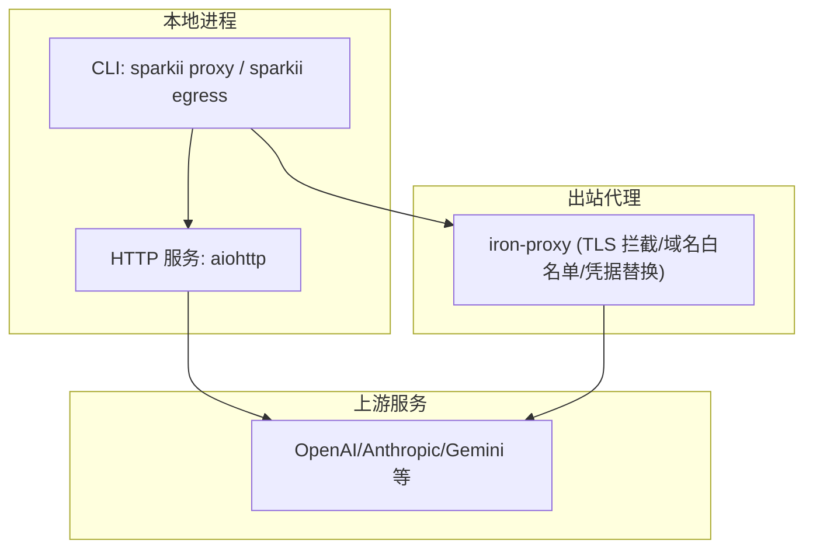
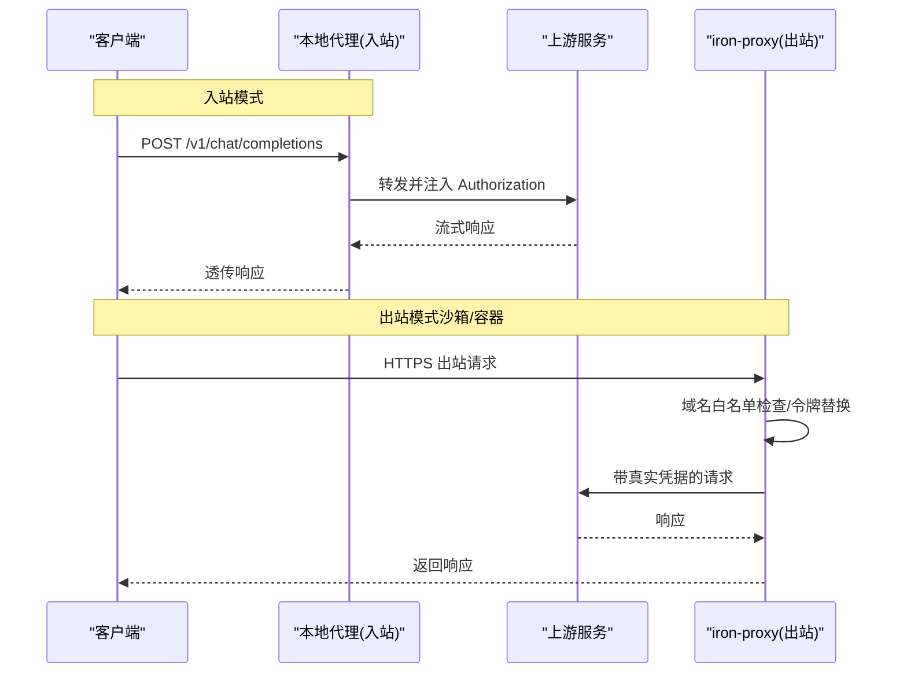
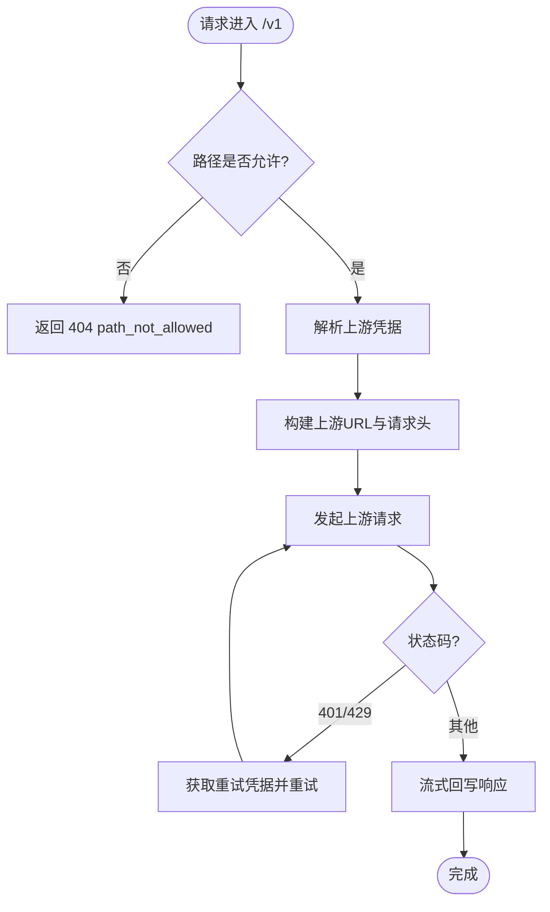
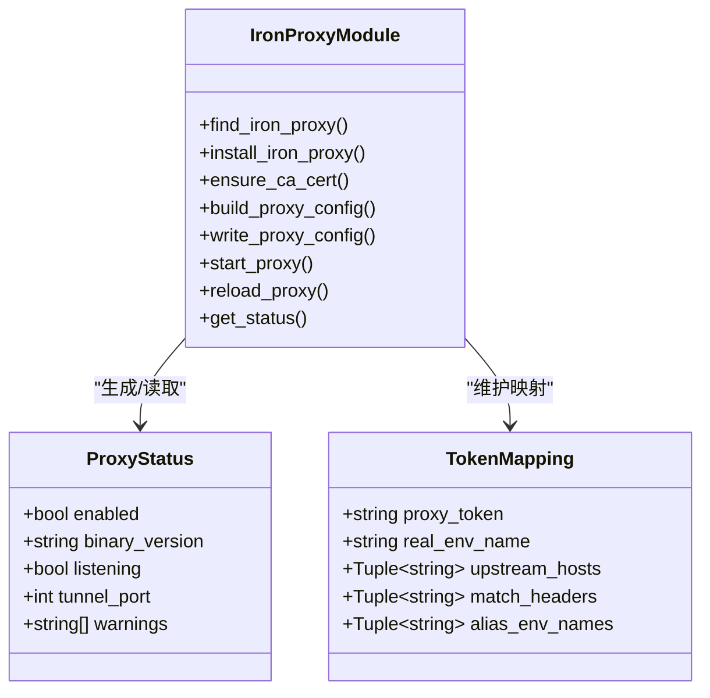
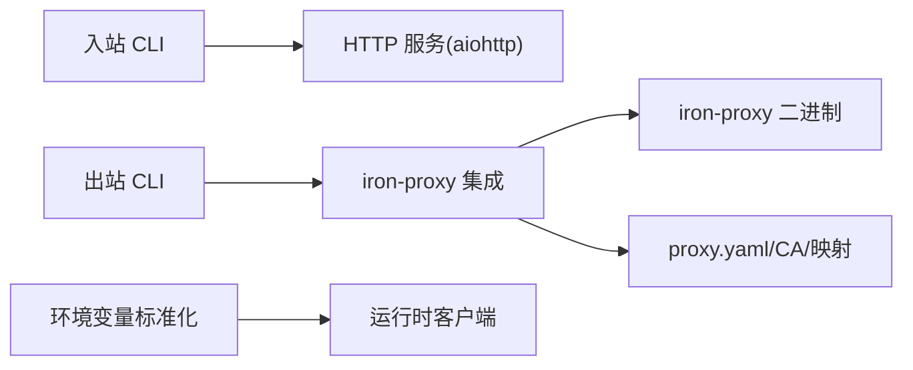

# 代理配置

<cite>
**本文引用的文件**
- [sparkii_cli/proxy/cli.py](file://sparkii_cli/proxy/cli.py)
- [sparkii_cli/proxy/server.py](file://sparkii_cli/proxy/server.py)
- [agent/proxy_sources/iron_proxy.py](file://agent/proxy_sources/iron_proxy.py)
- [sparkii_cli/proxy_cli.py](file://sparkii_cli/proxy_cli.py)
- [utils.py](file://utils.py)
- [agent/auxiliary_client.py](file://agent/auxiliary_client.py)
- [docker/entrypoint.sh](file://docker/entrypoint.sh)
</cite>

## 目录
1. [简介](#简介)
2. [项目结构](#项目结构)
3. [核心组件](#核心组件)
4. [架构总览](#架构总览)
5. [详细组件分析](#详细组件分析)
6. [依赖关系分析](#依赖关系分析)
7. [性能与优化建议](#性能与优化建议)
8. [故障排查指南](#故障排查指南)
9. [结论](#结论)
10. [附录：环境变量与配置项速查](#附录：环境变量与配置项速查)

## 简介
本指南面向需要在本地或容器环境中使用代理访问上游服务的用户，覆盖以下主题：
- HTTP、HTTPS、SOCKS 代理的环境变量与配置文件设置
- 企业代理、VPN 代理、透明代理的配置示例
- 认证方式：用户名/密码、OAuth、证书（CA）
- 代理健康检测与自动切换机制
- 连接池、超时与缓存等性能优化
- Docker 容器中的代理配置与跨操作系统差异
- 代理连接的测试与验证方法

本项目提供两类“代理”能力：
- 入站 OpenAI 兼容代理：将本地请求转发到上游并注入凭据（OAuth），适合在客户端侧统一接入。
- 出站 egress 代理（iron-proxy）：对沙箱/容器的出站流量进行 TLS 拦截、域名白名单控制，并将沙箱内可见的“代理令牌”替换为真实上游凭据，实现最小权限外发。

## 项目结构
与代理相关的关键代码分布如下：
- 入站 OpenAI 兼容代理：CLI 入口与服务实现
  - CLI 命令：[sparkii_cli/proxy/cli.py](file://sparkii_cli/proxy/cli.py)
  - HTTP 服务与转发逻辑：[sparkii_cli/proxy/server.py](file://sparkii_cli/proxy/server.py)
- 出站 egress 代理（iron-proxy）：安装、配置、运行与管理
  - iron-proxy 集成与配置生成：[agent/proxy_sources/iron_proxy.py](file://agent/proxy_sources/iron_proxy.py)
  - CLI 管理命令（install/setup/start/reload/status）：[sparkii_cli/proxy_cli.py](file://sparkii_cli/proxy_cli.py)
- 代理环境变量标准化与校验
  - 环境变量规范化：[utils.py](file://utils.py)
  - 辅助客户端中对代理 URL 的校验与调用点：[agent/auxiliary_client.py](file://agent/auxiliary_client.py)
- Docker 启动脚本（用于容器环境初始化）：[docker/entrypoint.sh](file://docker/entrypoint.sh)

**图表来源**
- [sparkii_cli/proxy/cli.py:28-73](file://sparkii_cli/proxy/cli.py#L28-L73)
- [sparkii_cli/proxy/server.py:88-243](file://sparkii_cli/proxy/server.py#L88-L243)
- [agent/proxy_sources/iron_proxy.py:126-157](file://agent/proxy_sources/iron_proxy.py#L126-L157)
- [sparkii_cli/proxy_cli.py:36-130](file://sparkii_cli/proxy_cli.py#L36-L130)

**章节来源**
- [sparkii_cli/proxy/cli.py:28-73](file://sparkii_cli/proxy/cli.py#L28-L73)
- [sparkii_cli/proxy/server.py:88-243](file://sparkii_cli/proxy/server.py#L88-L243)
- [agent/proxy_sources/iron_proxy.py:126-157](file://agent/proxy_sources/iron_proxy.py#L126-L157)
- [sparkii_cli/proxy_cli.py:36-130](file://sparkii_cli/proxy_cli.py#L36-L130)

## 核心组件
- 入站 OpenAI 兼容代理
  - 功能：监听本地端口，接收 /v1/* 请求，按允许路径转发至上游，并在请求头中注入有效的 Bearer 凭据；支持流式响应透传。
  - 关键行为：过滤逐跳头、替换 Authorization、处理 401/429 重试凭据、超时与连接错误映射为 OpenAI 风格错误。
  - 参考实现：[sparkii_cli/proxy/server.py](file://sparkii_cli/proxy/server.py)
- 出站 egress 代理（iron-proxy）
  - 功能：在沙箱/容器边界拦截出站 HTTPS，基于域名白名单放行，将沙箱内的“代理令牌”替换为真实上游凭据；支持热重载规则、审计日志预留位、管理 API。
  - 关键行为：自动下载并校验二进制、生成 CA、写入配置、维护映射表、通过管理端口热重载。
  - 参考实现：[agent/proxy_sources/iron_proxy.py](file://agent/proxy_sources/iron_proxy.py)、[sparkii_cli/proxy_cli.py](file://sparkii_cli/proxy_cli.py)
- 代理环境变量标准化
  - 功能：将常见代理环境变量（如 HTTP_PROXY、HTTPS_PROXY、ALL_PROXY 等）归一化为标准 URL 形式，确保下游库正确识别。
  - 参考实现：[utils.py](file://utils.py)
- 辅助客户端代理校验
  - 功能：在创建辅助客户端前校验代理 URL，避免非法地址导致连接失败。
  - 参考实现：[agent/auxiliary_client.py](file://agent/auxiliary_client.py)

**章节来源**
- [sparkii_cli/proxy/server.py:88-243](file://sparkii_cli/proxy/server.py#L88-L243)
- [agent/proxy_sources/iron_proxy.py:126-157](file://agent/proxy_sources/iron_proxy.py#L126-L157)
- [utils.py:581-588](file://utils.py#L581-L588)
- [agent/auxiliary_client.py:3315-3326](file://agent/auxiliary_client.py#L3315-L3326)

## 架构总览
下图展示两种代理模式的交互流程：
- 入站模式：客户端 → 本地 HTTP 代理 → 上游服务（注入凭据）
- 出站模式：沙箱/容器 → iron-proxy（TLS 拦截/白名单/凭据替换）→ 上游服务

**图表来源**
- [sparkii_cli/proxy/server.py:110-236](file://sparkii_cli/proxy/server.py#L110-L236)
- [agent/proxy_sources/iron_proxy.py:126-157](file://agent/proxy_sources/iron_proxy.py#L126-L157)

## 详细组件分析

### 入站 OpenAI 兼容代理（本地 HTTP 转发）
- 监听与路由
  - 默认监听 127.0.0.1:8645，路由 /v1/{tail} 转发到上游对应路径。
  - 健康检查端点 /health 返回状态与认证信息。
- 请求处理
  - 过滤逐跳头与 Authorization，保留其他头部。
  - 读取请求体并转发，保持查询字符串不变。
  - 超时设置：连接 15s，读取 300s，总时长无限制（适合长流）。
  - 错误映射：连接失败→502，超时→504，上游认证失败→401。
- 凭据与重试
  - 每次请求解析有效凭据；若上游返回 401/429，尝试获取重试凭据并重试一次。
- 启动与停止
  - 通过 CLI 子命令启动，支持 Ctrl+C/SIGTERM 优雅关闭。

**图表来源**
- [sparkii_cli/proxy/server.py:110-236](file://sparkii_cli/proxy/server.py#L110-L236)

**章节来源**
- [sparkii_cli/proxy/server.py:88-243](file://sparkii_cli/proxy/server.py#L88-L243)
- [sparkii_cli/proxy/cli.py:28-73](file://sparkii_cli/proxy/cli.py#L28-L73)

### 出站 egress 代理（iron-proxy）
- 安装与版本管理
  - 自动从官方发布页下载指定版本的二进制，校验 SHA-256，可选 GPG 签名验证。
  - 支持系统 PATH 查找或托管目录优先。
- CA 与 TLS 拦截
  - 首次使用时生成 CA 证书与私钥，供铁盒/沙箱信任以进行 MITM。
- 配置与映射
  - 自动生成 proxy.yaml，包含域名白名单、审计日志路径、管理端口等。
  - 维护 token 映射：将沙箱可见的“代理令牌”映射到真实上游凭据（支持多种头部匹配）。
- 运行与管理
  - 作为受管子进程运行，支持 start/stop/restart/reload/status。
  - 管理 API 支持热重载规则（无需重启，不中断连接）。
- 安全策略
  - 默认拒绝私有网段、IMDS、环回等敏感地址。
  - 剥离可能引起递归或泄露的环境变量（如 HTTP(S)_PROXY、NO_PROXY）。

**图表来源**
- [agent/proxy_sources/iron_proxy.py:299-352](file://agent/proxy_sources/iron_proxy.py#L299-L352)
- [agent/proxy_sources/iron_proxy.py:436-546](file://agent/proxy_sources/iron_proxy.py#L436-L546)
- [sparkii_cli/proxy_cli.py:137-149](file://sparkii_cli/proxy_cli.py#L137-L149)

**章节来源**
- [agent/proxy_sources/iron_proxy.py:126-157](file://agent/proxy_sources/iron_proxy.py#L126-L157)
- [agent/proxy_sources/iron_proxy.py:436-546](file://agent/proxy_sources/iron_proxy.py#L436-L546)
- [sparkii_cli/proxy_cli.py:137-149](file://sparkii_cli/proxy_cli.py#L137-L149)

### 环境变量与标准化
- 支持的代理环境变量键集合会被归一化为标准 URL 形式，确保 httpx/aiohttp 等库正确识别。
- 在辅助客户端创建前会校验代理 URL，避免非法地址导致连接失败。

**章节来源**
- [utils.py:581-588](file://utils.py#L581-L588)
- [agent/auxiliary_client.py:3315-3326](file://agent/auxiliary_client.py#L3315-L3326)

## 依赖关系分析
- CLI 层
  - 入站代理 CLI 依赖适配器注册表与服务器模块。
  - 出站代理 CLI 依赖 iron-proxy 集成模块，负责安装、配置、运行。
- 运行时
  - 入站代理使用 aiohttp 提供 HTTP 服务与客户端转发。
  - 出站代理通过子进程管理 iron-proxy 二进制，并使用管理 API 热重载。
- 外部依赖
  - openssl（用于生成 CA）、gpg（可选，用于签名校验）、aiohttp（入站代理必需）。

**图表来源**
- [sparkii_cli/proxy/cli.py:28-73](file://sparkii_cli/proxy/cli.py#L28-L73)
- [sparkii_cli/proxy/server.py:88-243](file://sparkii_cli/proxy/server.py#L88-L243)
- [agent/proxy_sources/iron_proxy.py:436-546](file://agent/proxy_sources/iron_proxy.py#L436-L546)
- [utils.py:581-588](file://utils.py#L581-L588)

**章节来源**
- [sparkii_cli/proxy/cli.py:28-73](file://sparkii_cli/proxy/cli.py#L28-L73)
- [sparkii_cli/proxy/server.py:88-243](file://sparkii_cli/proxy/server.py#L88-L243)
- [agent/proxy_sources/iron_proxy.py:436-546](file://agent/proxy_sources/iron_proxy.py#L436-L546)
- [utils.py:581-588](file://utils.py#L581-L588)

## 性能与优化建议
- 连接池与复用
  - 入站代理为每个请求创建 aiohttp.ClientSession，适合短生命周期场景；如需高并发可考虑会话级连接池与 keepalive。
  - 出站 iron-proxy 由独立进程管理，连接池由其内部实现决定。
- 超时设置
  - 入站代理：连接 15s，读取 300s，总时长不限（适配 SSE 长流）。可根据业务调整 sock_read。
  - 出站代理：通过 iron-proxy 的默认策略与上游白名单减少无效连接。
- 缓存策略
  - 入站代理不缓存请求/响应，保证实时性与一致性；如需缓存可在上层网关实现。
  - 出站代理可通过白名单与 deny CIDR 减少不必要的外联。
- 资源限制
  - 入站代理限制最大请求体大小（约 10MB），防止大负载阻塞。
  - 出站代理默认拒绝私有网段与 IMDS，降低 SSRF 风险。

[本节为通用指导，不直接分析具体文件]

## 故障排查指南
- 入站代理常见问题
  - 未登录上游：提示需先执行认证命令；检查适配器是否已登录。
  - 路径不允许：仅允许的路径会被转发；确认 /v1/* 路径是否在允许列表中。
  - 上游不可达：返回 502；检查网络连通性与上游服务状态。
  - 超时：返回 504；适当增大 sock_read 或优化上游响应时间。
- 出站代理常见问题
  - 二进制缺失：运行 install 或启用 auto_install；检查网络与镜像源。
  - CA 未生成：运行 setup 生成 CA；确保 openssl 可用。
  - 端口冲突：修改 tunnel_port；确认端口未被占用。
  - 规则变更未生效：使用 reload 热重载；涉及新密钥需 restart。
- 环境变量问题
  - 代理 URL 格式不正确：使用 normalize_proxy_env_vars 进行归一化。
  - 辅助客户端无法连接：检查 _validate_proxy_env_urls 的校验结果。

**章节来源**
- [sparkii_cli/proxy/server.py:110-236](file://sparkii_cli/proxy/server.py#L110-L236)
- [sparkii_cli/proxy_cli.py:137-149](file://sparkii_cli/proxy_cli.py#L137-L149)
- [utils.py:581-588](file://utils.py#L581-L588)
- [agent/auxiliary_client.py:3315-3326](file://agent/auxiliary_client.py#L3315-L3326)

## 结论
本项目提供了完善的代理能力：
- 入站 OpenAI 兼容代理：简化客户端接入，自动注入凭据，支持流式响应与错误映射。
- 出站 egress 代理：通过 iron-proxy 实现细粒度外发控制与凭据替换，保障沙箱/容器安全。
- 环境变量标准化与校验：提升兼容性，减少配置错误。
结合上述能力，可在不同环境与操作系统上稳定部署代理，并通过 CLI 工具进行安装、配置、运行与管理。

[本节为总结性内容，不直接分析具体文件]

## 附录：环境变量与配置项速查
- 入站代理
  - 启动命令：sparkii proxy start [--provider <name>] [--host <ip>] [--port <port>]
  - 健康检查：GET /health
  - 转发路径：/v1/*（需在适配器允许列表中）
- 出站代理（iron-proxy）
  - 安装：sparkii egress install
  - 配置向导：sparkii egress setup [--tunnel-port <port>] [--from-bitwarden|--no-bitwarden] [--rotate-tokens]
  - 运行：sparkii egress start/restart/stop
  - 热重载：sparkii egress reload
  - 状态查看：sparkii egress status [--show-tokens]
- 环境变量
  - 代理 URL 归一化：HTTP_PROXY、HTTPS_PROXY、ALL_PROXY 等将被标准化
  - 辅助客户端校验：创建客户端前会校验代理 URL

**章节来源**
- [sparkii_cli/proxy/cli.py:28-73](file://sparkii_cli/proxy/cli.py#L28-L73)
- [sparkii_cli/proxy_cli.py:36-130](file://sparkii_cli/proxy_cli.py#L36-L130)
- [utils.py:581-588](file://utils.py#L581-L588)
- [agent/auxiliary_client.py:3315-3326](file://agent/auxiliary_client.py#L3315-L3326)