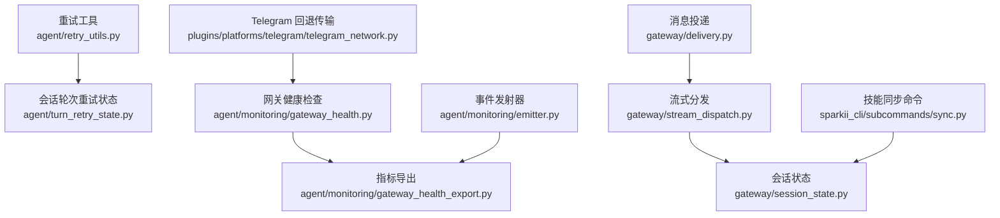
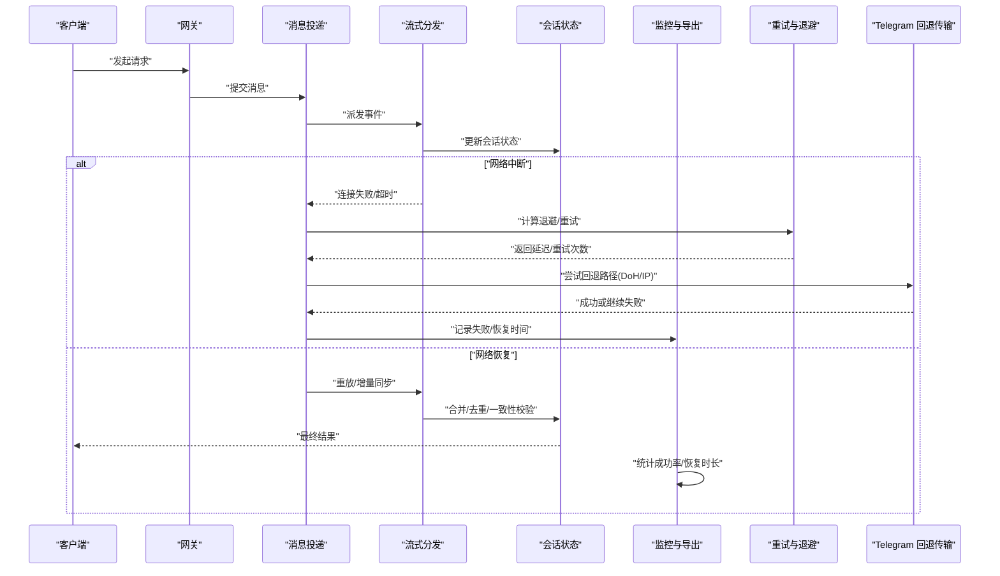
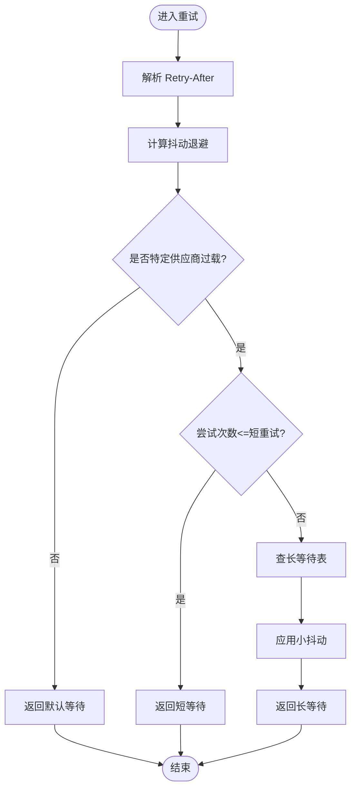
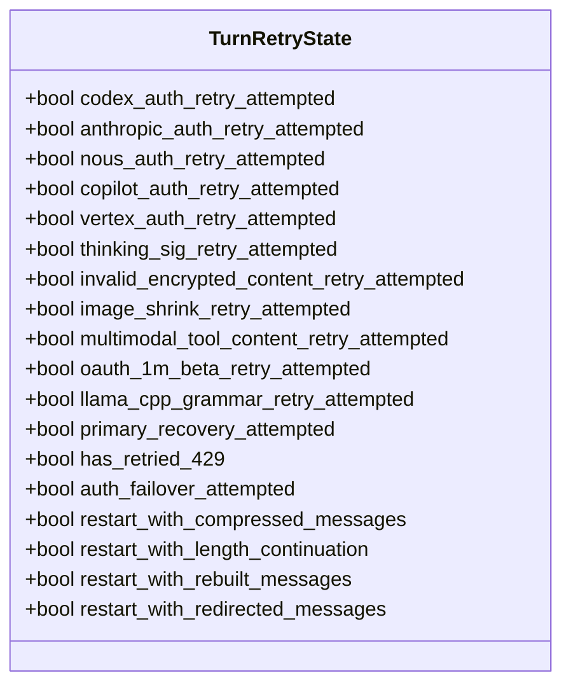
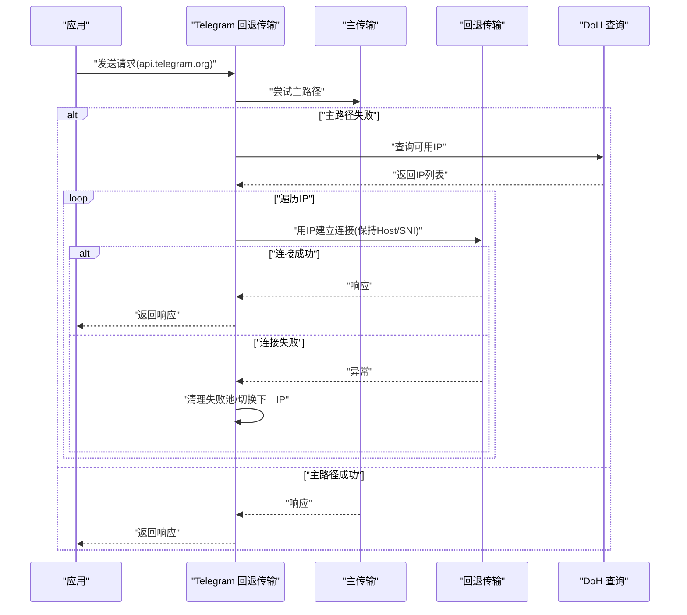
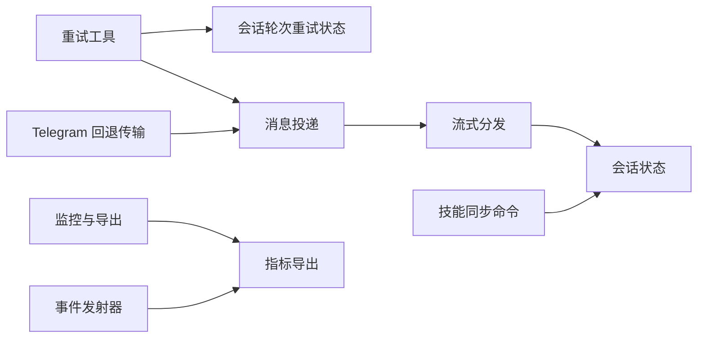

# 网络恢复与同步

<cite>
**本文引用的文件**
- [agent/retry_utils.py](file://agent/retry_utils.py)
- [agent/turn_retry_state.py](file://agent/turn_retry_state.py)
- [plugins/platforms/telegram/telegram_network.py](file://plugins/platforms/telegram/telegram_network.py)
- [sparkii_cli/subcommands/sync.py](file://sparkii_cli/subcommands/sync.py)
- [agent/monitoring/gateway_health.py](file://agent/monitoring/gateway_health.py)
- [agent/monitoring/gateway_health_export.py](file://agent/monitoring/gateway_health_export.py)
- [agent/monitoring/emitter.py](file://agent/monitoring/emitter.py)
- [gateway/delivery.py](file://gateway/delivery.py)
- [gateway/stream_dispatch.py](file://gateway/stream_dispatch.py)
- [gateway/session_state.py](file://gateway/session_state.py)
- [tests/gateway/test_telegram_network_reconnect.py](file://tests/gateway/test_telegram_network_reconnect.py)
</cite>

## 目录
1. [简介](#简介)
2. [项目结构](#项目结构)
3. [核心组件](#核心组件)
4. [架构总览](#架构总览)
5. [详细组件分析](#详细组件分析)
6. [依赖关系分析](#依赖关系分析)
7. [性能考虑](#性能考虑)
8. [故障排查指南](#故障排查指南)
9. [结论](#结论)
10. [附录](#附录)

## 简介
本指南聚焦于网络中断后的状态恢复与数据同步，覆盖以下主题：
- 网络中断检测机制、自动重连策略与会话状态恢复方法
- 数据一致性保证：消息去重、事务处理、冲突解决
- 网络恢复的监控与告警：恢复时间统计、成功率监控
- 分布式环境下的网络恢复：多节点协调与状态同步
- 微服务架构中的优雅降级与服务熔断
- 网络恢复的性能优化：增量同步、批量处理、缓存策略
- 测试方法与故障注入测试

## 项目结构
围绕网络恢复与同步的关键代码分布在如下模块：
- 重试与退避：通用抖动退避、速率限制自适应退避、特定供应商过载处理
- 会话轮次重试状态：单轮尝试的多分支恢复标记与重启信号
- 平台级网络容错：Telegram 专用回退传输（DNS/DoH/固定IP）
- 技能同步命令：跨设备/组织的技能拉取与推送入口
- 监控与导出：网关健康检查、指标导出、事件发射器
- 交付与流式分发：消息投递、流式事件派发、会话状态管理

图表来源
- [agent/retry_utils.py:1-209](file://agent/retry_utils.py#L1-L209)
- [agent/turn_retry_state.py:1-94](file://agent/turn_retry_state.py#L1-L94)
- [plugins/platforms/telegram/telegram_network.py:1-306](file://plugins/platforms/telegram/telegram_network.py#L1-L306)
- [agent/monitoring/gateway_health.py:1-200](file://agent/monitoring/gateway_health.py#L1-L200)
- [agent/monitoring/gateway_health_export.py:1-200](file://agent/monitoring/gateway_health_export.py#L1-L200)
- [agent/monitoring/emitter.py:1-200](file://agent/monitoring/emitter.py#L1-L200)
- [gateway/delivery.py:1-200](file://gateway/delivery.py#L1-L200)
- [gateway/stream_dispatch.py:1-200](file://gateway/stream_dispatch.py#L1-L200)
- [gateway/session_state.py:1-200](file://gateway/session_state.py#L1-L200)
- [sparkii_cli/subcommands/sync.py:1-100](file://sparkii_cli/subcommands/sync.py#L1-L100)

章节来源
- [agent/retry_utils.py:1-209](file://agent/retry_utils.py#L1-L209)
- [agent/turn_retry_state.py:1-94](file://agent/turn_retry_state.py#L1-L94)
- [plugins/platforms/telegram/telegram_network.py:1-306](file://plugins/platforms/telegram/telegram_network.py#L1-L306)
- [sparkii_cli/subcommands/sync.py:1-100](file://sparkii_cli/subcommands/sync.py#L1-L100)

## 核心组件
- 抖动退避与速率限制自适应：提供带抖动的指数退避、解析 Retry-After、针对特定供应商过载的长等待策略与上限控制。
- 会话轮次重试状态：集中管理一次 API 调用尝试中的多种恢复分支标记与重启信号，避免重复触发并支持有序重试。
- Telegram 回退传输：在主机名与 TLS SNI 不变的前提下，对连接失败进行 IP 回退与粘性选择，结合 DoH 发现与种子 IP。
- 技能同步命令：提供跨设备与组织范围的技能同步操作入口，便于在网络恢复后执行增量拉取与推送。
- 监控与导出：网关健康检查、指标导出、事件发射器，用于恢复时间统计与成功率监控。
- 交付与流式分发：消息投递、流式事件派发与会话状态管理，支撑断线恢复后的数据一致性与顺序性。

章节来源
- [agent/retry_utils.py:1-209](file://agent/retry_utils.py#L1-L209)
- [agent/turn_retry_state.py:1-94](file://agent/turn_retry_state.py#L1-L94)
- [plugins/platforms/telegram/telegram_network.py:1-306](file://plugins/platforms/telegram/telegram_network.py#L1-L306)
- [sparkii_cli/subcommands/sync.py:1-100](file://sparkii_cli/subcommands/sync.py#L1-L100)
- [agent/monitoring/gateway_health.py:1-200](file://agent/monitoring/gateway_health.py#L1-L200)
- [agent/monitoring/gateway_health_export.py:1-200](file://agent/monitoring/gateway_health_export.py#L1-L200)
- [agent/monitoring/emitter.py:1-200](file://agent/monitoring/emitter.py#L1-L200)
- [gateway/delivery.py:1-200](file://gateway/delivery.py#L1-L200)
- [gateway/stream_dispatch.py:1-200](file://gateway/stream_dispatch.py#L1-L200)
- [gateway/session_state.py:1-200](file://gateway/session_state.py#L1-L200)

## 架构总览
下图展示了网络中断检测、自动重连、状态恢复与数据同步的整体流程，以及监控与导出的闭环。

图表来源
- [gateway/delivery.py:1-200](file://gateway/delivery.py#L1-L200)
- [gateway/stream_dispatch.py:1-200](file://gateway/stream_dispatch.py#L1-L200)
- [gateway/session_state.py:1-200](file://gateway/session_state.py#L1-L200)
- [agent/retry_utils.py:1-209](file://agent/retry_utils.py#L1-L209)
- [plugins/platforms/telegram/telegram_network.py:1-306](file://plugins/platforms/telegram/telegram_network.py#L1-L306)
- [agent/monitoring/gateway_health.py:1-200](file://agent/monitoring/gateway_health.py#L1-L200)
- [agent/monitoring/gateway_health_export.py:1-200](file://agent/monitoring/gateway_health_export.py#L1-L200)

## 详细组件分析

### 组件A：重试与退避（抖动与速率限制自适应）
- 功能要点
  - 抖动指数退避：防止“惊群”效应，降低并发重试风暴风险。
  - Retry-After 解析：兼容数值与 HTTP-date，确保按服务端建议等待。
  - 供应商过载自适应：针对特定场景（如 Z.AI Coding Plan GLM-5.2）采用短重试+长等待阶梯策略，并提供重试上限计算。
- 复杂度与性能
  - 退避计算为 O(1)，抖动基于伪随机数生成，开销低。
  - 长等待表长度固定，整体可控。
- 错误处理
  - 对非法输入与不可解析值进行安全降级。
  - 针对特定错误形状识别，避免误判普通配额/计费 429。
- 优化机会
  - 可配置 jitter_ratio 与 max_delay，适配不同网络质量。
  - 将长等待表与业务阈值解耦，便于调优。

图表来源
- [agent/retry_utils.py:38-88](file://agent/retry_utils.py#L38-L88)
- [agent/retry_utils.py:90-128](file://agent/retry_utils.py#L90-L128)
- [agent/retry_utils.py:142-191](file://agent/retry_utils.py#L142-L191)
- [agent/retry_utils.py:194-209](file://agent/retry_utils.py#L194-L209)

章节来源
- [agent/retry_utils.py:1-209](file://agent/retry_utils.py#L1-L209)

### 组件B：会话轮次重试状态（一次性恢复标记）
- 功能要点
  - 集中维护单次 API 调用尝试中的多种恢复分支标记（OAuth 刷新、格式修复、压缩重启等）。
  - 通过重启信号指示外层循环重建请求并重试，避免重复触发同一分支。
- 数据结构
  - 使用数据类封装，字段清晰，便于迭代调试与单元测试。
- 错误处理
  - 通过 one-shot 布尔标记防止同一分支多次触发，减少无限重试风险。
- 优化机会
  - 可将分支分类（认证、格式、传输）以便分层统计与告警。

图表来源
- [agent/turn_retry_state.py:32-89](file://agent/turn_retry_state.py#L32-L89)

章节来源
- [agent/turn_retry_state.py:1-94](file://agent/turn_retry_state.py#L1-L94)

### 组件C：Telegram 回退传输（主机名与 TLS SNI 保持）
- 功能要点
  - 当主路径不可达时，尝试 DNS-over-HTTPS 发现的 IP 与种子 IP，保持逻辑主机名与 SNI 不变。
  - 粘性 IP 选择：成功后锁定该 IP，失败则重置回主路径。
  - 池化与资源释放：限制连接数，失败时关闭回退传输以释放文件描述符。
- 数据流
  - 请求重写：将目标 host 改写为 IP，同时保留 Host 头与 SNI。
  - 错误分类：仅对可重试的连接错误进行回退尝试。
- 监控与日志
  - 记录主路径失败、粘性 IP 切换与回退失败原因。

图表来源
- [plugins/platforms/telegram/telegram_network.py:52-166](file://plugins/platforms/telegram/telegram_network.py#L52-L166)
- [plugins/platforms/telegram/telegram_network.py:205-285](file://plugins/platforms/telegram/telegram_network.py#L205-L285)
- [plugins/platforms/telegram/telegram_network.py:288-306](file://plugins/platforms/telegram/telegram_network.py#L288-L306)

章节来源
- [plugins/platforms/telegram/telegram_network.py:1-306](file://plugins/platforms/telegram/telegram_network.py#L1-L306)

### 组件D：技能同步命令（跨设备/组织）
- 功能要点
  - 提供 status/pull/push/now/enable/disable/device/propose 等操作，支持个人与组织范围同步。
  - 仅在具备访问门控与基础 URL 配置时生效，否则报告当前状态而非失败。
- 使用场景
  - 网络恢复后执行 now 进行拉取再推送，实现增量同步与冲突合并。
- 集成点
  - 与网关会话状态联动，确保设备标签与同步基线一致。

章节来源
- [sparkii_cli/subcommands/sync.py:1-100](file://sparkii_cli/subcommands/sync.py#L1-L100)

### 组件E：监控与导出（恢复时间统计与成功率）
- 功能要点
  - 网关健康检查：周期性探测关键端点可用性。
  - 指标导出：将健康状态与恢复指标暴露给外部监控系统。
  - 事件发射器：统一事件源，便于追踪网络恢复事件。
- 指标维度
  - 恢复时间（从检测到恢复的时间）、成功率（重试成功比例）、失败原因分布。
- 告警策略
  - 基于阈值（如连续失败次数、恢复时间超过 SLA）触发告警。

章节来源
- [agent/monitoring/gateway_health.py:1-200](file://agent/monitoring/gateway_health.py#L1-L200)
- [agent/monitoring/gateway_health_export.py:1-200](file://agent/monitoring/gateway_health_export.py#L1-L200)
- [agent/monitoring/emitter.py:1-200](file://agent/monitoring/emitter.py#L1-L200)

### 组件F：消息投递与流式分发（一致性保障）
- 功能要点
  - 消息投递：负责将事件写入队列或下游通道，支持重试与幂等键。
  - 流式分发：按序消费事件，处理断线重连与增量同步。
  - 会话状态：维护会话上下文、偏移量与一致性标记，支持冲突检测与合并。
- 一致性策略
  - 消息去重：基于唯一标识（如消息ID/序列号）避免重复处理。
  - 事务处理：将多个相关事件打包为事务单元，保证原子性。
  - 冲突解决：基于版本戳或时间戳进行合并，优先保留最新变更。

章节来源
- [gateway/delivery.py:1-200](file://gateway/delivery.py#L1-L200)
- [gateway/stream_dispatch.py:1-200](file://gateway/stream_dispatch.py#L1-L200)
- [gateway/session_state.py:1-200](file://gateway/session_state.py#L1-L200)

## 依赖关系分析
- 重试工具被会话轮次重试状态与网关投递层引用，形成统一的退避策略。
- Telegram 回退传输作为底层网络抽象，被平台适配器使用，提升连通性。
- 监控与导出依赖事件发射器，汇聚健康与恢复指标。
- 技能同步命令与会话状态交互，确保设备与组织同步的一致性。

图表来源
- [agent/retry_utils.py:1-209](file://agent/retry_utils.py#L1-L209)
- [agent/turn_retry_state.py:1-94](file://agent/turn_retry_state.py#L1-L94)
- [plugins/platforms/telegram/telegram_network.py:1-306](file://plugins/platforms/telegram/telegram_network.py#L1-L306)
- [gateway/delivery.py:1-200](file://gateway/delivery.py#L1-L200)
- [gateway/stream_dispatch.py:1-200](file://gateway/stream_dispatch.py#L1-L200)
- [gateway/session_state.py:1-200](file://gateway/session_state.py#L1-L200)
- [agent/monitoring/gateway_health.py:1-200](file://agent/monitoring/gateway_health.py#L1-L200)
- [agent/monitoring/gateway_health_export.py:1-200](file://agent/monitoring/gateway_health_export.py#L1-L200)
- [agent/monitoring/emitter.py:1-200](file://agent/monitoring/emitter.py#L1-L200)
- [sparkii_cli/subcommands/sync.py:1-100](file://sparkii_cli/subcommands/sync.py#L1-L100)

章节来源
- [agent/retry_utils.py:1-209](file://agent/retry_utils.py#L1-L209)
- [agent/turn_retry_state.py:1-94](file://agent/turn_retry_state.py#L1-L94)
- [plugins/platforms/telegram/telegram_network.py:1-306](file://plugins/platforms/telegram/telegram_network.py#L1-L306)
- [gateway/delivery.py:1-200](file://gateway/delivery.py#L1-L200)
- [gateway/stream_dispatch.py:1-200](file://gateway/stream_dispatch.py#L1-L200)
- [gateway/session_state.py:1-200](file://gateway/session_state.py#L1-L200)
- [agent/monitoring/gateway_health.py:1-200](file://agent/monitoring/gateway_health.py#L1-L200)
- [agent/monitoring/gateway_health_export.py:1-200](file://agent/monitoring/gateway_health_export.py#L1-L200)
- [agent/monitoring/emitter.py:1-200](file://agent/monitoring/emitter.py#L1-L200)
- [sparkii_cli/subcommands/sync.py:1-100](file://sparkii_cli/subcommands/sync.py#L1-L100)

## 性能考虑
- 增量同步：优先拉取变更部分，减少带宽与处理开销。
- 批量处理：合并多个小消息为批次，降低序列化与网络往返成本。
- 缓存策略：对只读或低频变更数据进行本地缓存，提高恢复速度。
- 退避调优：根据网络质量调整 base_delay、max_delay 与 jitter_ratio。
- 资源限制：限制连接池大小，避免文件描述符耗尽。

[本节为通用指导，不直接分析具体文件]

## 故障排查指南
- 常见问题
  - 主路径不可达：检查 DNS 解析与代理设置，启用 DoH 发现与种子 IP。
  - 粘性 IP 失效：观察日志中粘性 IP 重置提示，确认远端服务状态。
  - 重试风暴：确认抖动退避已启用，避免并发会话同时重试。
  - 指标缺失：检查监控导出与事件发射器是否正常上报。
- 诊断步骤
  - 查看 Telegram 回退传输日志，确认回退路径是否生效。
  - 检查重试工具日志，确认退避策略与供应商过载识别。
  - 核对监控指标，定位恢复时间与成功率异常点。
- 参考测试
  - 网络重连测试：验证回退传输与粘性 IP 行为。

章节来源
- [plugins/platforms/telegram/telegram_network.py:105-166](file://plugins/platforms/telegram/telegram_network.py#L105-L166)
- [agent/retry_utils.py:90-128](file://agent/retry_utils.py#L90-L128)
- [tests/gateway/test_telegram_network_reconnect.py:1-200](file://tests/gateway/test_telegram_network_reconnect.py#L1-L200)

## 结论
本指南基于仓库中的重试工具、会话轮次重试状态、Telegram 回退传输、技能同步命令与监控导出等组件，构建了网络中断后的状态恢复与数据同步方案。通过抖动退避、回退传输、一致性保障与监控告警，系统能够在复杂网络环境下保持稳定与高效。建议在部署中结合业务特性调优退避参数与监控阈值，并持续完善测试与故障注入能力。

[本节为总结，不直接分析具体文件]

## 附录
- 分布式网络恢复策略
  - 多节点协调：使用分布式锁或共识协议协调重连顺序，避免冲突。
  - 状态同步：基于向量时钟或版本号进行增量同步与冲突合并。
- 微服务优雅降级与服务熔断
  - 降级：在网络不可用时返回缓存或默认响应，保障用户体验。
  - 熔断：当失败率超过阈值时快速失败，避免雪崩。
- 测试方法与故障注入
  - 模拟网络中断：通过防火墙规则或代理断开连接，验证重连与恢复。
  - 注入延迟与丢包：评估退避策略与缓冲机制的有效性。
  - 端到端测试：覆盖从客户端到网关再到下游服务的完整链路。

[本节为概念性内容，不直接分析具体文件]